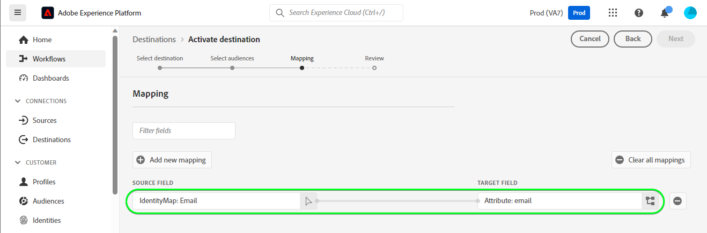

# [!DNL HubSpot]-Verbindung

[[!DNL HubSpot]](https://www.hubspot.com) ist eine CRM-Plattform mit allen Software, Integrationen und Ressourcen, die Sie für die Verbindung von Marketing, Vertrieb, Content Management und Kundendienst benötigen. Dadurch können Sie Ihre Daten, Teams und Kunden auf einer CRM-Plattform verbinden.

Diese [!DNL Adobe Experience Platform] [Ziel](/help/destinations/home.md) nutzt die [[!DNL HubSpot] Kontakt-API](https://developers.hubspot.com/docs/api/crm/contacts), um Kontakte in zu aktualisieren [!DNL HubSpot] aus einer bestehenden Experience Platform-Audience nach der Aktivierung.

Anweisungen zur Authentifizierung bei Ihrer [!DNL HubSpot]-Instanz sehen Sie weiter unten im Abschnitt [Authentifizieren bei Ziel](#authenticate).

## Anwendungsfälle {#use-cases}

Damit Sie besser verstehen können, wie und wann Sie das [!DNL HubSpot]-Ziel verwenden sollten, finden Sie hier ein Anwendungsbeispiel, das für Kundinnen und Kunden von Adobe Experience Platform mit diesem Ziel geeignet ist.

[!DNL HubSpot] -Kontakte speichern Informationen zu den Personen, die mit Ihrem Unternehmen interagieren. Ihr Team verwendet die in [!DNL HubSpot] um die Experience Platform-Zielgruppen zu erstellen. Nach dem Senden dieser Zielgruppen an [!DNL HubSpot], werden ihre Informationen aktualisiert und jedem Kontakt wird eine Eigenschaft mit dem Wert als Zielgruppenname zugewiesen, der angibt, zu welcher Zielgruppe der Kontakt gehört.

## Voraussetzungen {#prerequisites}

In den folgenden Abschnitten finden Sie alle Voraussetzungen, die Sie unter Experience Platform einrichten müssen. [!DNL HubSpot] und für Informationen, die Sie vor der Arbeit mit dem [!DNL HubSpot] Ziel.

### Voraussetzungen für Experience Platform {#prerequisites-in-experience-platform}

Vor der Aktivierung der Daten für [!DNL HubSpot] Ziel, müssen Sie über eine [schema](/help/xdm/schema/composition.md), a [Datensatz](https://experienceleague.adobe.com/docs/platform-learn/tutorials/data-ingestion/create-datasets-and-ingest-data.html?lang=de), und [Zielgruppen](https://experienceleague.adobe.com/docs/platform-learn/tutorials/audiences/create-audiences.html?lang=en) erstellt in [!DNL Experience Platform].

Weitere Informationen finden Sie in der Experience Platform-Dokumentation für [Feldergruppe Zielgruppenzugehörigkeitsdetails](/help/xdm/field-groups/profile/segmentation.md) wenn Sie Anleitungen zum Zielgruppenstatus benötigen.

### Voraussetzungen für die [!DNL HubSpot] Ziel {#prerequisites-destination}

Beachten Sie die folgenden Voraussetzungen, um Daten von Platform in Ihre [!DNL HubSpot] Konto:

#### Sie müssen über eine [!DNL HubSpot] account {#prerequisites-account}

So exportieren Sie Daten von Platform in Ihre [!DNL Hubspot] -Konto, über das Sie verfügen müssen, [!DNL HubSpot] -Konto. Wenn Sie noch keine haben, rufen Sie die Seite [HubSpot-Konto einrichten](https://knowledge.hubspot.com/get-started/set-up-your-account) und befolgen Sie die Anleitung zur Registrierung und Erstellung Ihres Kontos.

#### Sammeln Sie die [!DNL HubSpot] Zugriffstoken für private Apps {#gather-credentials}

Sie benötigen Ihre [!DNL HubSpot] `Access token` , um die [!DNL HubSpot] Ziel, API-Aufrufe über Ihre [!DNL HubSpot] private App in [!DNL HubSpot] -Konto. Die `Access token` dient als `Bearer token` wenn Sie [das Ziel authentifizieren](#authenticate).

Wenn Sie keine private App haben, führen Sie die Dokumentation aus, um [Erstellen einer privaten App in [!DNL HubSpot]](https://developers.hubspot.com/docs/api/private-apps).

>[!IMPORTANT]
>
> Der privaten App sollten die folgenden Bereiche zugewiesen werden:
> `crm.objects.contacts.write`, `crm.objects.contacts.read`
> `crm.schemas.contacts.write`, `crm.schemas.contacts.read`

| Anmeldedaten | Beschreibung | Beispiel |
| --- | --- | --- |
| `Bearer token` | Die `Access token` Ihrer [!DNL HubSpot] private App.  So erhalten Sie [!DNL HubSpot] `Access token` folgen Sie dem [!DNL HubSpot] Dokumentation zu [API-Aufrufe mit dem Zugriffstoken Ihrer App durchführen](https://developers.hubspot.com/docs/api/private-apps#make-api-calls-with-your-app-s-access-token). | `pat-na1-11223344-abcde-12345-9876-1234a1b23456` |

## Leitplanken {#guardrails}

[!DNL HubSpot] private Apps unterliegen [Ratenbeschränkungen](https://developers.hubspot.com/docs/api/usage-details). Die Anzahl der Aufrufe, die Ihre private App tätigen kann, hängt von Ihrer [!DNL HubSpot] Kontoanmeldung und ob Sie das API-Add-on erworben haben. Weitere Informationen finden Sie unter [Sonstige Beschränkungen](https://developers.hubspot.com/docs/api/usage-details#other-limits).

## Unterstützte Identitäten {#supported-identities}

[!DNL HubSpot] unterstützt die Aktualisierung von Identitäten, die in der folgenden Tabelle beschrieben werden. Erhalten Sie weitere Informationen zu [Identitäten](/help/identity-service/namespaces.md).

| Ziel-Identität | Beispiel | Beschreibung | Zu beachten |
|---|---|---|---|
| `email` | `test@test.com` | Email-Adresse des Kontakts. | Obligatorisch |

## Unterstützte Zielgruppen {#supported-audiences}

In diesem Abschnitt werden alle Zielgruppen beschrieben, die Sie an dieses Ziel exportieren können.

Dieses Ziel unterstützt die Aktivierung aller durch die Experience Platform generierten Zielgruppen über den [Segmentierungsdienst](../../../segmentation/home.md).

Dieses Ziel unterstützt auch die Aktivierung der in der folgenden Tabelle beschriebenen Zielgruppen.

| Zielgruppentyp | Beschreibung |
---------|----------|
| Benutzerdefinierte Uploads | Zielgruppen, die aus CSV-Dateien in Experience Platform [importiert](../../../segmentation/ui/overview.md#import-audience) werden. |

{style="table-layout:auto"}

## Exporttyp und -häufigkeit {#export-type-frequency}

Beziehen Sie sich auf die folgende Tabelle, um Informationen zu Typ und Häufigkeit des Zielexports zu erhalten.

| Element | Typ | Anmerkungen |
---------|----------|---------|
| Exporttyp | **[!UICONTROL Profilbasiert]** | <ul><li>Sie exportieren alle Mitglieder einer Zielgruppe zusammen mit den gewünschten Schemafeldern *(z. B. E-Mail-Adresse, Telefonnummer, Nachname)*, entsprechend Ihrer Feldzuordnung.</li><li> Darüber hinaus wird eine neue Eigenschaft in [!DNL HubSpot] unter Verwendung des Zielgruppennamen und des zugehörigen Werts mit dem entsprechenden Zielgruppenstatus von Platform für jede der ausgewählten Zielgruppen.</li></ul> |
| Exporthäufigkeit | **[!UICONTROL Streaming]** | <ul><li>Streaming-Ziele sind „immer verfügbare“ API-basierte Verbindungen. Sobald ein Profil in Experience Platform auf der Grundlage einer Zielgruppenauswertung aktualisiert wird, sendet der Connector das Update nachgelagert an die Zielplattform. Lesen Sie mehr über [Streaming-Ziele](/help/destinations/destination-types.md#streaming-destinations).</li></ul> |

{style="table-layout:auto"}

## Herstellen einer Verbindung mit dem Ziel {#connect}

>[!IMPORTANT]
>
>Um eine Verbindung zum Ziel herzustellen, benötigen Sie die [Zugriffsberechtigung](/help/access-control/home.md#permissions) **[!UICONTROL Ziele verwalten]**. Lesen Sie die [Zugriffskontrolle – Übersicht](/help/access-control/ui/overview.md) oder wenden Sie sich an Ihren Produktadministrator, um die erforderlichen Berechtigungen zu erhalten.

Um eine Verbindung mit diesem Ziel herzustellen, gehen Sie wie im [Tutorial zur Zielkonfiguration](../../ui/connect-destination.md) beschrieben vor. Füllen Sie im Workflow zum Konfigurieren des Ziels die Felder aus, die in den beiden folgenden Abschnitten aufgeführt sind.

Suchen Sie in **[!UICONTROL Ziele]** > **[!UICONTROL Katalog]** nach [!DNL HubSpot]. Alternativ können Sie es unter der **[!UICONTROL CRM]**-Kategorie finden.

### Beim Ziel authentifizieren {#authenticate}

Füllen Sie die erforderlichen Felder aus. Siehe Abschnitt [Sammeln Sie die [!DNL HubSpot] Zugriffstoken für private Apps](#gather-credentials) für Hinweise.
* **[!UICONTROL Trägertoken]**: Das Zugriffstoken für Ihre [!DNL HubSpot] private App.

Um sich beim Ziel zu authentifizieren, wählen Sie **[!UICONTROL Mit Ziel verbinden]**.

Wenn die angegebenen Details gültig sind, zeigt die Benutzeroberfläche den Status **[!UICONTROL Verbunden]** mit einem grünen Häkchen an. Sie können dann mit dem nächsten Schritt fortfahren.

### Ausfüllen der Zieldetails {#destination-details}

Füllen Sie die folgenden erforderlichen und optionalen Felder aus, um Details für das Ziel zu konfigurieren. Ein Sternchen neben einem Feld in der Benutzeroberfläche zeigt an, dass das Feld erforderlich ist.

* **[!UICONTROL Name]**: Ein Name, durch den Sie dieses Ziel in Zukunft erkennen können.
* **[!UICONTROL Beschreibung]**: Eine Beschreibung, die Ihnen hilft, dieses Ziel in Zukunft zu identifizieren.

### Aktivieren von Warnhinweisen {#enable-alerts}

Sie können Warnhinweise aktivieren, um Benachrichtigungen zum Status des Datenflusses zu Ihrem Ziel zu erhalten. Wählen Sie einen Warnhinweis aus der zu abonnierenden Liste aus, um Benachrichtigungen über den Status Ihres Datenflusses zu erhalten. Weitere Informationen zu Warnhinweisen finden Sie im Handbuch zum [Abonnieren von Zielwarnhinweisen über die Benutzeroberfläche](../../ui/alerts.md).

Wenn Sie alle Details für Ihre Zielverbindung eingegeben haben, klicken Sie auf **[!UICONTROL Weiter]**.

## Aktivieren von Zielgruppen für dieses Ziel {#activate}

>[!IMPORTANT]
>
>Um Daten zu aktivieren, benötigen Sie die [Zugriffskontrollberechtigungen](/help/access-control/home.md#permissions) **[!UICONTROL Ziele verwalten]**, **[!UICONTROL Ziele aktivieren]**, **[!UICONTROL Profile anzeigen]** und **[!UICONTROL Segmente anzeigen]**. Lesen Sie die [Übersicht über die Zugriffskontrolle](/help/access-control/ui/overview.md) oder wenden Sie sich an Ihren Produktadministrator, um die erforderlichen Berechtigungen zu erhalten.

Anweisungen zum Aktivieren von Zielgruppen für dieses Ziel finden Sie unter [Aktivieren von Profilen und Zielgruppen für Streaming-Zielgruppen-Exportziele](/help/destinations/ui/activate-segment-streaming-destinations.md).

### Zuordnen von Attributen und Identitäten {#map}

So senden Sie Ihre Zielgruppendaten ordnungsgemäß von Adobe Experience Platform an die [!DNL HubSpot] Ziel, müssen Sie den Schritt zur Feldzuordnung durchlaufen. Die Zuordnung besteht darin, eine Verknüpfung zwischen den Schemafeldern Ihres Experience-Datenmodells (XDM) in Ihrem Platform-Konto und den jeweiligen Entsprechungen vom Ziel zu erstellen.

So ordnen Sie Ihre XDM-Felder korrekt der [!DNL HubSpot] Gehen Sie wie folgt vor:

#### Zuordnen der `Email` identity

Die `Email` identity ist eine obligatorische Zuordnung für dieses Ziel. Gehen Sie wie folgt vor, um sie zuzuordnen:
1. Wählen Sie Im Schritt **[!UICONTROL Zuordnung]** die Option **[!UICONTROL Neue Zuordnung hinzufügen]** aus. Auf dem Bildschirm wird jetzt eine neue Zuordnungszeile angezeigt.
   
1. Im **[!UICONTROL Quellfeld auswählen]** Fenster, wählen Sie die **[!UICONTROL Identitäts-Namespace auswählen]** und wählen Sie eine Identität.
   
1. Im **[!UICONTROL Zielgruppenfeld auswählen]** Fenster, wählen Sie die **[!UICONTROL Attribute auswählen]** und wählen `email`.
   

| Quellfeld | Zielfeld | Obligatorisch |
| --- | --- | --- |
| `IdentityMap: Email` | `Identity: email` | Ja |

Nachfolgend finden Sie ein Beispiel mit der Identitätszuordnung:

#### Zuordnung **optional** attributes

So fügen Sie weitere Attribute hinzu, die Sie zwischen Ihrem XDM-Profilschema und Ihrem [!DNL HubSpot] -Konto die folgenden Schritte wiederholen:
1. Wählen Sie Im Schritt **[!UICONTROL Zuordnung]** die Option **[!UICONTROL Neue Zuordnung hinzufügen]** aus. Auf dem Bildschirm wird jetzt eine neue Zuordnungszeile angezeigt.
   
1. Im **[!UICONTROL Quellfeld auswählen]** Fenster, wählen Sie die **[!UICONTROL Attribute auswählen]** und wählen Sie das XDM-Attribut aus.
   
1. Im **[!UICONTROL Zielgruppenfeld auswählen]** auswählen **[!UICONTROL Attribute auswählen]** und wählen Sie aus der Liste der Attribute aus, die automatisch aus Ihrem [!DNL HubSpot] -Konto. Das Ziel verwendet die [[!DNL HubSpot] Eigenschaften](https://developers.hubspot.com/docs/api/crm/properties) API zum Abrufen dieser Informationen. Beide [!DNL HubSpot] [Standardeigenschaften](https://knowledge.hubspot.com/contacts/hubspots-default-contact-properties) und alle benutzerdefinierten Eigenschaften zur Auswahl als Zielfelder abgerufen werden.
   

Einige verfügbare Zuordnungen zwischen Ihrem XDM-Profilschema und [!DNL Hubspot] sind unten dargestellt:

| Quellfeld | Zielfeld |
| --- | --- |
| `xdm: person.name.firstName` | `Attribute: firstname` |
| `xdm: person.name.lastName` | `Attribute: lastname` |
| `xdm: workAddress.street1` | `Attribute: address` |
| `xdm: workAddress.city` | `Attribute: city` |
| `xdm: workAddress.country` | `Attribute: country` |

Nachfolgend finden Sie ein Beispiel für die Verwendung dieser Attributzuordnungen:

Wenn Sie mit der Bereitstellung der Zuordnungen für Ihre Zielverbindung fertig sind, wählen Sie **[!UICONTROL Nächste]**.

## Überprüfen des Datenexports {#exported-data}

Gehen Sie wie folgt vor, um zu überprüfen, ob Sie das Ziel korrekt eingerichtet haben:

1. Melden Sie sich bei [!DNL HubSpot] Website und navigieren Sie dann zur **[!UICONTROL Kontakte]** Seite, um den Audience-Status zu überprüfen. Diese Liste kann so konfiguriert werden, dass Spalten für die benutzerdefinierten Eigenschaften angezeigt werden, die mit dem Zielgruppennamen erstellt wurden, wobei ihr Wert dem Zielgruppenstatus entspricht.
   

1. Alternativ können Sie einen Drilldown in eine einzelne **[!UICONTROL Person]** und navigieren Sie zu den Eigenschaften, die den Zielgruppennamen und den Zielgruppenstatus anzeigen.
   

## Datennutzung und -Governance {#data-usage-governance}

Alle [!DNL Adobe Experience Platform]-Ziele sind bei der Verarbeitung Ihrer Daten mit Datennutzungsrichtlinien konform. Ausführliche Informationen darüber, wie [!DNL Adobe Experience Platform] Data Governance erzwingt, finden Sie unter [Data Governance – Übersicht](/help/data-governance/home.md).

## Zusätzliche Ressourcen {#additional-resources}

Weitere nützliche Informationen aus der [!DNL HubSpot]Dokumentation finden Sie im Folgenden:
* [Authentifizierungsmethoden auf HubSpot](https://developers.hubspot.com/docs/api/intro-to-auth)
* [!DNL HubSpot] API-Referenzen für [Kontakte](https://developers.hubspot.com/docs/api/crm/contacts) und [Eigenschaften](https://developers.hubspot.com/docs/api/crm/properties) APIs.

### Änderungsprotokoll

In diesem Abschnitt werden aktualisierte Funktionen und wesentliche Dokumentationsänderungen für diesen Ziel-Connector erfasst.

+++ Änderungsprotokoll anzeigen

| Veröffentlichungsmonat | Art der Aktualisierung | Beschreibung |
|---|---|---|
| September 2023 | Erstmalige Veröffentlichung | Erste Zielversion und Veröffentlichung der Dokumentation. |

{style="table-layout:auto"}

+++