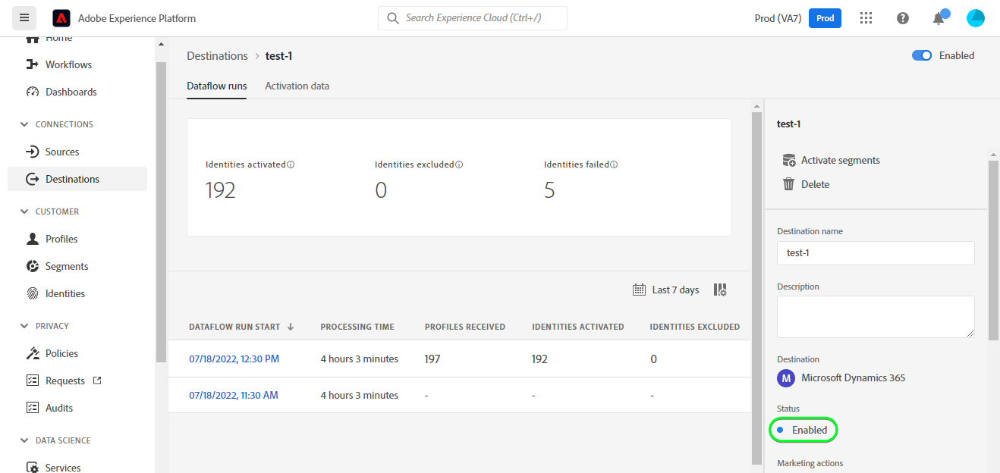

# [!DNL Microsoft Dynamics 365]-Verbindung

## Übersicht {#overview}

[[!DNL Microsoft Dynamics 365]](https://dynamics.microsoft.com/en-us/) ist eine Cloud-basierte Business-Anwendungsplattform, die Enterprise Resource Planning (ERP) und Customer Relationship Management (CRM) zusammen mit Produktivitätsanwendungen und KI-Tools kombiniert, um End-to-End-reibungsloseren und besser kontrollierten Betrieb, besseres Wachstumspotenzial und geringere Kosten zu erzielen.

Diese [!DNL Adobe Experience Platform] [Ziel](/help/destinations/home.md) nutzt die [[!DNL Contact Entity Reference API]](https://docs.microsoft.com/en-us/dynamics365/customerengagement/on-premises/developer/entities/contact?view=op-9-1), mit dem Sie Identitäten innerhalb eines Segments in [!DNL Dynamics 365].

[!DNL Dynamics 365] verwendet OAuth 2 mit Autorisierungszuschuss als Authentifizierungsmechanismus für die Kommunikation mit dem [!DNL Contact Entity Reference API]. Anweisungen zur Authentifizierung bei Ihrem [!DNL Dynamics 365] -Instanz weiter unten im [An Ziel authentifizieren](#authenticate) Abschnitt.

## Anwendungsbeispiele {#use-cases}

Als Marketer können Sie Ihren Benutzern personalisierte Erlebnisse auf der Basis von Attributen aus ihren Adobe Experience Platform-Profilen bereitstellen. Sie können Segmente aus Ihren Offline-Daten erstellen und diese Segmente an senden [!DNL Dynamics 365], um in den Feeds der Benutzer anzuzeigen, sobald Segmente und Profile in Adobe Experience Platform aktualisiert wurden.

## Voraussetzungen {#prerequisites}

### Voraussetzungen für die Experience Platform {#prerequisites-in-experience-platform}

Vor der Aktivierung der Daten für [!DNL Dynamics 365] Ziel, müssen Sie über eine [schema](/help/xdm/schema/composition.md), [Datensatz](https://experienceleague.adobe.com/docs/platform-learn/tutorials/data-ingestion/create-datasets-and-ingest-data.html?lang=en)und [Segmente](https://experienceleague.adobe.com/docs/platform-learn/tutorials/segments/create-segments.html?lang=en) erstellt in [!DNL Experience Platform].

Weitere Informationen finden Sie in der Dokumentation von Adobe für [Feldergruppe Segmentzugehörigkeitsdetails](/help/xdm/field-groups/profile/segmentation.md) , wenn Sie Anleitungen zum Segmentstatus benötigen.

### [!DNL Microsoft Dynamics 365] Voraussetzungen {#prerequisites-destination}

Beachten Sie die folgenden Voraussetzungen in [!DNL Dynamics 365], um Daten von Platform in Ihre [!DNL Dynamics 365] Konto:

#### Sie benötigen eine [!DNL Microsoft Dynamics 365] account {#prerequisites-account}

Navigieren Sie zu [!DNL Dynamics 365] [Testversion](https://dynamics.microsoft.com/en-us/dynamics-365-free-trial/) -Seite, um sich zu registrieren und ein Konto zu erstellen, falls Sie noch kein Konto haben.

#### Feld erstellen in [!DNL Dynamics 365] {#prerequisites-custom-field}

Benutzerdefiniertes Feld vom Typ erstellen `Simple` mit dem Felddatentyp als `Single Line of Text` welche Experience Platform verwendet, um den Segmentstatus in [!DNL Dynamics 365].
Siehe Abschnitt [!DNL Dynamics 365] Dokumentation zu [Feld erstellen (Attribut)](https://docs.microsoft.com/en-us/dynamics365/customerengagement/on-premises/customize/create-edit-fields?view=op-9-1) wenn Sie zusätzliche Anleitungen benötigen.

Beispiel-Setup in [!DNL Dynamics 365] ist unten dargestellt:

#### Registrieren von Anwendungs- und Anwendungsbenutzern in Azure Active Directory {#prerequisites-app-user}

Aktivieren [!DNL Dynamics 365] Um auf Ressourcen zugreifen zu können, müssen Sie sich bei Ihrem [!DNL Azure Account] nach [[!DNL Azure Active Directory]](https://docs.microsoft.com/en-us/azure/active-directory/develop/howto-create-service-principal-portal#register-an-application-with-azure-ad-and-create-a-service-principal) und erstellen Sie Folgendes:
* Ein [!DNL Azure Active Directory] application
* Dienstprinzipal
* Anwendungsgeheimnis

Sie müssen auch [Anwendungsbenutzer erstellen](https://docs.microsoft.com/en-us/power-platform/admin/manage-application-users#create-an-application-user) in [!DNL Azure Active Directory] und verknüpfen Sie sie mit der neu erstellten Anwendung.

#### Gather [!DNL Dynamics 365] Anmeldeinformationen {#gather-credentials}

Beachten Sie die folgenden Elemente, bevor Sie sich bei der [!DNL Dynamics 365] CRM-Ziel:

| Anmeldedaten | Beschreibung | Beispiel |
| --- | --- | --- |
| `Client ID` | Die [!DNL Dynamics 365] Client-ID für Ihre [!DNL Azure Active Directory] Anwendung. Siehe Abschnitt [[!DNL Dynamics 365] Dokumentation](https://docs.microsoft.com/en-us/azure/active-directory/develop/howto-create-service-principal-portal#get-tenant-and-app-id-values-for-signing-in) für Leitlinien. | `ababbaba-abab-baba-acac-acacacacacac` |
| `Client Secret` | Die [!DNL Dynamics 365] Client-Geheimnis für Ihre [!DNL Azure Active Directory] Anwendung. Sie würden Option 2 innerhalb der [[!DNL Dynamics 365] Dokumentation](https://docs.microsoft.com/en-us/azure/active-directory/develop/howto-create-service-principal-portal#authentication-two-options). | `abcde~abcdefghijklmnopqrstuvwxyz12345678` für Leitlinien. |
| `Tenant ID` | Die [!DNL Dynamics 365] Mandantenkennung für Ihre [!DNL Azure Active Directory] Anwendung. Siehe Abschnitt [[!DNL Dynamics 365] Dokumentation](https://docs.microsoft.com/en-us/azure/active-directory/develop/howto-create-service-principal-portal#get-tenant-and-app-id-values-for-signing-in) für Leitlinien. | `1234567-aaaa-12ab-ba21-1234567890` |
| `Environment URL` | Siehe Abschnitt [[!DNL Dynamics 365] Dokumentation](https://docs.microsoft.com/en-us/dynamics365/customerengagement/on-premises/developer/org-service/discover-url-organization-organization-service?view=op-9-1) für Leitlinien. | Wenn [!DNL Dynamics 365] wie unten gezeigt, benötigen Sie den hervorgehobenen Wert.  *`org57771b33`.crm.dynamics.com* |

## Limits {#guardrails}

Die [Anforderungsbegrenzungen und -zuweisungen](https://docs.microsoft.com/en-us/power-platform/admin/api-request-limits-allocations) Seitendetails [!DNL Dynamics 365] API-Beschränkungen für Ihre [!DNL Dynamics 365] Lizenz. Sie müssen sicherstellen, dass Ihre Daten und Payloads diesen Beschränkungen unterliegen.

## Unterstützte Identitäten {#supported-identities}

[!DNL Dynamics 365] unterstützt die Aktualisierung von Identitäten, die in der folgenden Tabelle beschrieben werden. Weitere Informationen [identities](/help/identity-service/namespaces.md).

| Zielgruppenidentität | Beispiel | Beschreibung | Zu beachten |
|---|---|---|---|
| `contactId` | 7eb682f1-ca75-e511-80d4-00155d2a68d1 | Eindeutige Kennung für einen Kontakt. | **Obligatorisch**. Siehe Abschnitt [[!DNL Dynamics 365] Dokumentation](https://docs.microsoft.com/en-us/dynamics365/customerengagement/on-premises/developer/entities/contact?view=op-9-1) für weitere Informationen. |

## Exportart und -frequenz {#export-type-frequency}

Informationen zum Zielexporttyp und zur Häufigkeit finden Sie in der unten stehenden Tabelle.

| Element | Typ | Anmerkungen |
---------|----------|---------|
| Exporttyp | **[!UICONTROL Profilbasiert]** | <ul><li>Sie exportieren alle Mitglieder eines Segments zusammen mit den gewünschten Schemafeldern *(z. B.: E-Mail-Adresse, Telefonnummer, Nachname)*, entsprechend Ihrer Feldzuordnung.</li><li> Jeder Segmentstatus in [!DNL Dynamics 365] wird mit dem entsprechenden Segmentstatus von Platform aktualisiert, basierend auf dem **[!UICONTROL Zuordnungs-ID]** Wert, der während der [Segmentplanung](#schedule-segment-export-example) Schritt.</li></ul> |
| Exporthäufigkeit | **[!UICONTROL Streaming]** | <ul><li>Streaming-Ziele sind &quot;immer auf&quot;-API-basierte Verbindungen. Sobald ein Profil in Experience Platform auf der Grundlage einer Segmentbewertung aktualisiert wird, sendet der Connector das Update nachgelagert an die Zielplattform. Mehr dazu [Streaming-Ziele](/help/destinations/destination-types.md#streaming-destinations).</li></ul> |

{style=&quot;table-layout:auto&quot;}

## Herstellen einer Verbindung mit der Datenbank {#connect}

>[!IMPORTANT]
>
>Um eine Verbindung zum Ziel herzustellen, benötigen Sie die **[!UICONTROL Ziele verwalten]** [Zugriffsberechtigung](/help/access-control/home.md#permissions). Lesen Sie die [Zugriffskontrolle - Übersicht](/help/access-control/ui/overview.md) oder wenden Sie sich an Ihren Produktadministrator, um die erforderlichen Berechtigungen zu erhalten.

Um eine Verbindung mit diesem Ziel herzustellen, gehen Sie wie im Abschnitt [Tutorial zur Zielkonfiguration](../../ui/connect-destination.md) beschrieben vor. Füllen Sie im Workflow zum Konfigurieren des Ziels die Felder aus, die in den beiden folgenden Abschnitten aufgeführt sind.

Within **[!UICONTROL Ziele]** > **[!UICONTROL Katalog]** Suchen nach [!DNL Dynamics 365]. Alternativ können Sie sie unter der **[!UICONTROL CRM]** Kategorie.

### An Ziel authentifizieren {#authenticate}

Um sich beim Ziel zu authentifizieren, wählen Sie **[!UICONTROL Mit Ziel verbinden]**.

Füllen Sie unten die erforderlichen Felder aus. Siehe Abschnitt [Dynamics 365-Anmeldeinformationen sammeln](#gather-credentials) für Hinweise.
* **[!UICONTROL Client-ID]**: Die [!DNL Dynamics 365] Client-ID für Ihre [!DNL Azure Active Directory] Anwendung.
* **[!UICONTROL Mandanten-ID]**: Die [!DNL Dynamics 365] Mandantenkennung für Ihre [!DNL Azure Active Directory] Anwendung.
* **[!UICONTROL Client Secret]**: Die [!DNL Dynamics 365] Client-Geheimnis für Ihre [!DNL Azure Active Directory] Anwendung.
* **[!UICONTROL Umgebungs-URL]**: Ihre [!DNL Dynamics 365] Umgebungs-URL.

Wenn die angegebenen Details gültig sind, zeigt die Benutzeroberfläche eine **[!UICONTROL Verbunden]** Status mit einem grünen Häkchen. Sie können dann mit dem nächsten Schritt fortfahren.

### Zieldetails ausfüllen {#destination-details}

Füllen Sie die folgenden erforderlichen und optionalen Felder aus, um Details für das Ziel zu konfigurieren. Ein Sternchen neben einem Feld in der Benutzeroberfläche zeigt an, dass das Feld erforderlich ist.

* **[!UICONTROL Name]**: Ein Name, mit dem Sie dieses Ziel in der Zukunft erkennen werden.
* **[!UICONTROL Beschreibung]**: Eine Beschreibung, die Ihnen dabei hilft, dieses Ziel in der Zukunft zu identifizieren.

### Aktivieren von Warnhinweisen {#enable-alerts}

Sie können Warnhinweise aktivieren, um Benachrichtigungen über den Status des Datenflusses an Ihr Ziel zu erhalten. Wählen Sie einen Warnhinweis aus der zu abonnierenden Liste aus, um Benachrichtigungen über den Status Ihres Datenflusses zu erhalten. Weitere Informationen zu Warnungen finden Sie im Handbuch zu [Abonnieren von Zielwarnhinweisen über die Benutzeroberfläche](../../ui/alerts.md).

Wenn Sie alle Details für Ihre Zielverbindung angegeben haben, wählen Sie **[!UICONTROL Nächste]**.

## Aktivieren von Segmenten für dieses Ziel {#activate}

>[!IMPORTANT]
>
>Um Daten zu aktivieren, benötigen Sie die **[!UICONTROL Ziele verwalten]**, **[!UICONTROL Ziele aktivieren]**, **[!UICONTROL Profile anzeigen]** und **[!UICONTROL Segmente anzeigen]** [Zugriffssteuerungsberechtigungen](/help/access-control/home.md#permissions). Lesen Sie die [Zugriffskontrolle - Übersicht](/help/access-control/ui/overview.md) oder wenden Sie sich an Ihren Produktadministrator, um die erforderlichen Berechtigungen zu erhalten.

Lesen [Aktivieren von Profilen und Segmenten für Streaming-Segmentexportziele](/help/destinations/ui/activate-segment-streaming-destinations.md) für Anweisungen zum Aktivieren von Zielgruppensegmenten für dieses Ziel.

### Zuordnungsüberlegungen und Beispiel {#mapping-considerations-example}

So senden Sie Ihre Zielgruppendaten ordnungsgemäß von Adobe Experience Platform an [!DNL Dynamics 365] Ziel, müssen Sie den Schritt zur Feldzuordnung durchlaufen. Die Zuordnung besteht darin, eine Verknüpfung zwischen den Schemafeldern Ihres Experience-Datenmodell (XDM) in Ihrem Platform-Konto und den entsprechenden Entsprechungen vom Ziel zu erstellen. So ordnen Sie Ihre XDM-Felder korrekt der [!DNL Dynamics 365] Führen Sie die folgenden Schritte aus:

1. Im **[!UICONTROL Zuordnung]** Schritt auswählen **[!UICONTROL Neues Mapping hinzufügen]**. Auf dem Bildschirm wird eine neue Zuordnungszeile angezeigt.
   

1. Im **[!UICONTROL Quellfeld auswählen]** Fenster, wählen Sie die **[!UICONTROL Identitäts-Namespace auswählen]** Kategorie und wählen Sie `contactId`.
   

1. Im **[!UICONTROL Zielgruppenfeld auswählen]** wählen Sie den Typ des Zielfelds aus, dem Sie Ihr Quellfeld zuordnen möchten.
   * **[!UICONTROL Identitäts-Namespace auswählen]**: Wählen Sie diese Option aus, um Ihr Quellfeld einem Identitäts-Namespace aus der Liste zuzuordnen.
      

   * Fügen Sie die folgende Zuordnung zwischen Ihrem XDM-Profilschema und Ihrem [!DNL Dynamics 365] instance: |XDM-Profilschema|[!DNL Dynamics 365] Instanz| Erforderlich| |—|—|—| |`contactId`|`contactId`| Ja |

   * **[!UICONTROL Benutzerdefinierte Attribute auswählen]**: Wählen Sie diese Option aus, um Ihr Quellfeld einem benutzerdefinierten Attribut zuzuordnen, das Sie in der Variablen **[!UICONTROL Attributname]** -Feld. Siehe [[!DNL Dynamics 365] Dokumentation](https://docs.microsoft.com/en-us/dynamics365/customerengagement/on-premises/developer/entities/contact?view=op-9-1#entity-properties) für eine umfassende Liste der unterstützten Attribute.
      

      >[!IMPORTANT]
      >
      >Wenn Sie über ein Quellfeld für Datum oder Zeitstempel verfügen, das einem [!DNL Dynamics 365] [Datum oder Zeitstempel](https://docs.microsoft.com/en-us/power-apps/developer/data-platform/webapi/reference/timestampdatemapping?view=dataverse-latest) Zielfeld verwenden, stellen Sie sicher, dass der zugeordnete Wert nicht leer ist. Wenn der übergebene Wert leer ist, wird ein *`Bad request reported while pushing events to the destination. Please contact the administrator and try again.`* -Fehlermeldung angezeigt und die Daten werden nicht aktualisiert. Dies ist ein [!DNL Dynamics 365] Beschränkung.

   * Fügen Sie je nach den Werten, die Sie aktualisieren möchten, beispielsweise die folgende Zuordnung zwischen Ihrem XDM-Profilschema und Ihrem [!DNL Dynamics 365] instance: |XDM-Profilschema|[!DNL Dynamics 365] Instanz| |—|—| |`person.name.firstName`|`FirstName`| |`person.name.lastName`|`LastName`| |`personalEmail.address`|`Email`|

   * Nachfolgend finden Sie ein Beispiel für die Verwendung dieser Zuordnungen:
      

### Segmentexport planen, Beispiel {#schedule-segment-export-example}

Im [[!UICONTROL Segmentexport planen]](/help/destinations/ui/activate-segment-streaming-destinations.md#scheduling) Schritt des Aktivierungs-Workflows müssen Sie Platform-Segmente manuell dem benutzerdefinierten Feldattribut in [!DNL Dynamics 365].

Wählen Sie dazu jedes Segment aus und geben Sie dann das entsprechende benutzerdefinierte Feldattribut aus [!DNL Dynamics 365] im **[!UICONTROL Zuordnungs-ID]** -Feld.

>[!IMPORTANT]
>
>Der für die **[!UICONTROL Zuordnungs-ID]** sollte genau mit dem Namen des benutzerdefinierten Feldattributs übereinstimmen, das in [!DNL Dynamics 365]. Siehe [[!DNL Dynamics 365] Dokumentation](https://docs.microsoft.com/en-us/dynamics365/customerengagement/on-premises/customize/create-edit-fields?view=op-9-1) , wenn Sie Anleitungen zum Auffinden Ihrer benutzerdefinierten Feldattribute benötigen.

Nachfolgend finden Sie ein Beispiel:

## Datenexport überprüfen {#exported-data}

Gehen Sie wie folgt vor, um zu überprüfen, ob Sie das Ziel korrekt eingerichtet haben:

1. Auswählen **[!UICONTROL Ziele]** > **[!UICONTROL Durchsuchen]** um zur Liste der Ziele zu navigieren.
   

1. Wählen Sie das Ziel aus und überprüfen Sie, ob der Status **[!UICONTROL enabled]**.
   

1. Wechseln Sie zu **[!DNL Activation data]** und wählen Sie einen Segmentnamen aus.
   

1. Überwachen Sie die Segmentzusammenfassung und stellen Sie sicher, dass die Anzahl der Profile der im Segment erstellten Anzahl entspricht.
   

1. Melden Sie sich bei der [!DNL Dynamics 365] Website und navigieren Sie dann zur [!DNL Customers] > [!DNL Contacts] und überprüfen Sie, ob die Profile aus dem Segment hinzugefügt wurden. Sie können sehen, dass jeder Segmentstatus in [!DNL Dynamics 365] mit dem entsprechenden Segmentstatus von Platform aktualisiert wurde, basierend auf dem **[!UICONTROL Zuordnungs-ID]** Wert, der während der [Segmentplanung](#schedule-segment-export-example) Schritt.
   

## Datennutzung und -Governance {#data-usage-governance}

Alle [!DNL Adobe Experience Platform]-Ziele sind bei der Verarbeitung Ihrer Daten mit Datennutzungsrichtlinien konform. Detaillierte Informationen zur [!DNL Adobe Experience Platform] erzwingt Data Governance, siehe [Data Governance - Übersicht](/help/data-governance/home.md).

## Fehler und Fehlerbehebung {#errors-and-troubleshooting}

### Unbekannte Fehler beim Senden von Ereignissen an das Ziel {#unknown-errors}

Wenn Sie beim Überprüfen eines Datenflusses die folgende Fehlermeldung erhalten: `Bad request reported while pushing events to the destination. Please contact the administrator and try again.`

Um diesen Fehler zu beheben, überprüfen Sie, ob die Variable **[!UICONTROL Zuordnungs-ID]** Sie haben [!DNL Dynamics 365] für Ihr Platform-Segment gültig ist und in [!DNL Dynamics 365].

## Weitere Ressourcen {#additional-resources}

Zusätzliche nützliche Informationen aus dem [[!DNL Dynamics 365] Dokumentation](https://docs.microsoft.com/en-us/dynamics365/) unten steht:
* [Organisationsdienst.Update(Entity)-Methode](https://docs.microsoft.com/en-us/dotnet/api/microsoft.xrm.sdk.iorganizationservice.update?view=dataverse-sdk-latest)
* [Aktualisieren und Löschen von Tabellenzeilen mithilfe der Web-API](https://docs.microsoft.com/en-us/power-apps/developer/data-platform/webapi/update-delete-entities-using-web-api#basic-update)