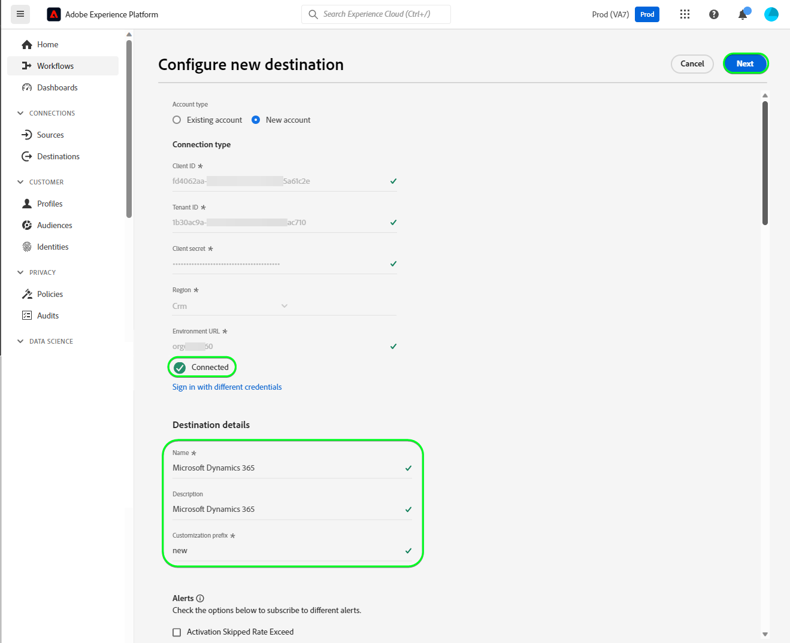
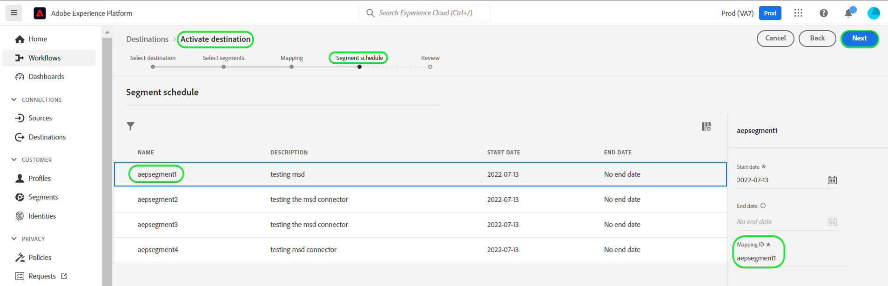

# [!DNL Microsoft Dynamics 365]-Verbindung

## Übersicht {#overview}

[[!DNL Microsoft Dynamics 365]](https://dynamics.microsoft.com/de-de/) ist eine Cloud-basierte Plattform für geschäftliche Anwendungen, die Enterprise Resource Planning (ERP) und Customer Relationship Management (CRM) mit Produktivitätsanwendungen und KI-Tools kombiniert, um einen rundum reibungsloseren und besser kontrollierten Betrieb, besseres Wachstumspotenzial und Kostenreduzierungen zu erzielen.

Dieses [!DNL Adobe Experience Platform] [Ziel](/help/destinations/home.md) nutzt die [[!DNL Contact Entity Reference API]](https://docs.microsoft.com/de-de/dynamics365/customerengagement/on-premises/developer/entities/contact?view=op-9-1), mit der Sie Identitäten innerhalb einer Zielgruppe in [!DNL Dynamics 365] aktualisieren können.

[!DNL Dynamics 365] verwendet OAuth 2 mit Autorisierungs-Grant als Authentifizierungsmechanismus für die Kommunikation mit der [!DNL Contact Entity Reference API]. Anweisungen zur Authentifizierung bei Ihrer [!DNL Dynamics 365]-Instanz sehen Sie weiter unten im Abschnitt [Authentifizieren bei Ziel](#authenticate).

## Anwendungsbeispiele {#use-cases}

Als Marketing-Experte können Sie Ihren Benutzern personalisierte Erlebnisse auf der Basis von Attributen aus ihren Adobe Experience Platform-Profilen bereitstellen. Sie können Zielgruppen aus Ihren Offline-Daten erstellen und diese Zielgruppen an [!DNL Dynamics 365] senden, damit sie in den Feeds der Benutzer angezeigt werden, sobald Zielgruppen und Profile in Adobe Experience Platform aktualisiert werden.

## Voraussetzungen {#prerequisites}

### Voraussetzungen für Experience Platform {#prerequisites-in-experience-platform}

Bevor Sie Daten für das [!DNL Dynamics 365]-Ziel aktivieren, müssen Sie ein [Schema](/help/xdm/schema/composition.md), einen [Datensatz](https://experienceleague.adobe.com/docs/platform-learn/tutorials/data-ingestion/create-datasets-and-ingest-data.html) und [Audiences](https://experienceleague.adobe.com/docs/platform-learn/tutorials/audiences/create-audiences.html) in [!DNL Experience Platform] erstellt haben.

Adobe Weitere Informationen finden Sie in der Dokumentation zur [Schemafeldgruppe der Zielgruppenzugehörigkeitsdetails](/help/xdm/field-groups/profile/segmentation.md) wenn Sie Anleitungen zu Zielgruppenstatus benötigen.

### Voraussetzungen für [!DNL Microsoft Dynamics 365] {#prerequisites-destination}

Beachten Sie die folgenden Voraussetzungen in [!DNL Dynamics 365], um Daten von Platform in Ihr [!DNL Dynamics 365]-Konto zu exportieren:

#### Sie benötigen ein [!DNL Microsoft Dynamics 365]-Konto {#prerequisites-account}

Navigieren Sie zur [Testversion-Seite](https://dynamics.microsoft.com/de-de/dynamics-365-free-trial/) von [!DNL Dynamics 365], um sich zu registrieren und ein Konto zu erstellen, falls Sie noch keines haben.

#### Erstellen eines Felds in [!DNL Dynamics 365] {#prerequisites-custom-field}

Erstellen Sie das benutzerdefinierte Feld vom Typ &quot;`Simple`&quot; mit dem Felddatentyp &quot;`Single Line of Text`&quot;, den Experience Platform verwendet, um den Audience-Status in [!DNL Dynamics 365] zu aktualisieren.

Weitere Anleitungen finden Sie in der [!DNL Dynamics 365] [Erstellen oder Bearbeiten eines Felds (Attribut](https://docs.microsoft.com/de-de/dynamics365/customerengagement/on-premises/customize/create-edit-fields?view=op-9-1)).

Notieren Sie sich das **[!UICONTROL Anpassungspräfix]** des benutzerdefinierten Felds, das Sie in [!DNL Dynamics 365] erstellen. Sie benötigen dieses Präfix während des Schritts [Ausfüllen der Zieldetails](#destination-details). Weitere Informationen finden [ im Abschnitt ](https://learn.microsoft.com/en-us/dynamics365/customerengagement/on-premises/customize/create-edit-fields?view=op-9-1#create-and-edit-fields) und Bearbeiten von Feldern in der [!DNL Dynamics 365].
Screenshot der 

Im Folgenden sehen Sie ein Beispiel-Setup in [!DNL Dynamics 365]:

#### Registrieren von Programmen und Programmbenutzern in Azure Active Directory {#prerequisites-app-user}

Um [!DNL Dynamics 365] für den Zugriff auf Ressourcen zu aktivieren, müssen Sie sich mit Ihrem [!DNL Azure Account] bei [[!DNL Azure Active Directory]](https://docs.microsoft.com/de-de/azure/active-directory/develop/howto-create-service-principal-portal#register-an-application-with-azure-ad-and-create-a-service-principal) anmelden und Folgendes erstellen:
* Ein [!DNL Azure Active Directory]-Programm
* Einen Dienstprinzipal
* Einen Programm-Geheim-Code

Sie müssen außerdem [Programmbenutzer](https://docs.microsoft.com/de-de/power-platform/admin/manage-application-users#create-an-application-user) in [!DNL Azure Active Directory] erstellen und sie mit dem neu erstellten Programm verknüpfen.

#### Sammeln von [!DNL Dynamics 365]-Anmeldedaten {#gather-credentials}

Beachten Sie die folgenden Punkte, bevor Sie sich beim [!DNL Dynamics 365]-CRM-Ziel authentifizieren:

| Anmeldedaten | Beschreibung | Beispiel |
| --- | --- | --- |
| `Client ID` | Die [!DNL Dynamics 365]-Client-ID für Ihr [!DNL Azure Active Directory]-Programm. Eine Anleitung finden Sie in der [[!DNL Dynamics 365] Dokumentation](https://docs.microsoft.com/de-de/azure/active-directory/develop/howto-create-service-principal-portal#get-tenant-and-app-id-values-for-signing-in). | `ababbaba-abab-baba-acac-acacacacacac` |
| `Client Secret` | Den [!DNL Dynamics 365]-Client-Geheim-Code für Ihr [!DNL Azure Active Directory]-Programm. Sie würden Option 2 innerhalb der [[!DNL Dynamics 365] Dokumentation](https://docs.microsoft.com/de-de/azure/active-directory/develop/howto-create-service-principal-portal#authentication-two-options) verwenden. | `abcde~abcdefghijklmnopqrstuvwxyz12345678` für Anleitung. |
| `Tenant ID` | Die [!DNL Dynamics 365]-Mandanten-ID für Ihr [!DNL Azure Active Directory]-Programm. Eine Anleitung dazu finden Sie in der [[!DNL Dynamics 365] Dokumentation](https://docs.microsoft.com/de-de/azure/active-directory/develop/howto-create-service-principal-portal#get-tenant-and-app-id-values-for-signing-in). | `1234567-aaaa-12ab-ba21-1234567890` |
| `Region` | Die mit der Umgebungs-URL verknüpfte Microsoft-Region.  Anleitungen finden Sie [[!DNL Dynamics 365]  der ](https://learn.microsoft.com/en-us/power-platform/admin/new-datacenter-regions). | Wenn Ihre Domain wie im Folgenden aussieht, müssen Sie bei der Authentifizierung beim [Ziel“ den hervorgehobenen Wert für das CRM](#authenticate)Feld in der Dropdown-Auswahl angeben  *org57771b33.`crm`.dynamics.com*  Beispiel: Wenn Ihr Unternehmen in der Region Nordamerika (NAM) bereitgestellt wird, ist Ihre URL `crm.dynamics.com`, und Sie müssen `crm` auswählen. Wenn Ihr Unternehmen in der Region Kanada (CAN) bereitgestellt ist, wird Ihre URL `crm3.dynamics.com` und Sie müssen `crm3` auswählen. |
| `Environment URL` | Siehe die [[!DNL Dynamics 365] Dokumentation](https://docs.microsoft.com/de-de/dynamics365/customerengagement/on-premises/developer/org-service/discover-url-organization-organization-service?view=op-9-1), um eine Anleitung zu erhalten. | Wenn Ihre [!DNL Dynamics 365]-Domain wie im Folgenden aussieht, benötigen Sie den hervorgehobenen Wert.  *`org57771b33`.crm.dynamics.com* |

{style="table-layout:auto"}

## Leitplanken {#guardrails}

Auf der Seite [Anforderungsbeschränkungen und Zuweisungen](https://docs.microsoft.com/de-de/power-platform/admin/api-request-limits-allocations) werden die [!DNL Dynamics 365]-API-Beschränkungen für Ihre [!DNL Dynamics 365]-Lizenz detailliert aufgeführt. Sie müssen sicherstellen, dass Ihre Daten und Payloads innerhalb dieser Beschränkungen liegen.

## Unterstützte Identitäten {#supported-identities}

[!DNL Dynamics 365] unterstützt die Aktualisierung von Identitäten, die in der folgenden Tabelle beschrieben werden. Erhalten Sie weitere Informationen zu [Identitäten](/help/identity-service/features/namespaces.md).

| Ziel-Identität | Beispiel | Beschreibung | Zu beachten |
|---|---|---|---|
| `contactid` | 7eb682f1-ca75-e511-80d4-00155d2a68d1 | Eindeutige Kennung für einen Kontakt. | **Obligatorisch**. Siehe die [[!DNL Dynamics 365] Dokumentation](https://docs.microsoft.com/de-de/dynamics365/customerengagement/on-premises/developer/entities/contact?view=op-9-1), um weitere Informationen zu erhalten. |

{style="table-layout:auto"}

## Unterstützte Zielgruppen {#supported-audiences}

In diesem Abschnitt werden alle Zielgruppen beschrieben, die Sie an dieses Ziel exportieren können.

Dieses Ziel unterstützt die Aktivierung aller durch die Experience Platform generierten Zielgruppen über den [Segmentierungsdienst](../../../segmentation/home.md).

## Exporttyp und -häufigkeit {#export-type-frequency}

Beziehen Sie sich auf die folgende Tabelle, um Informationen zu Typ und Häufigkeit des Zielexports zu erhalten.

| Element | Typ | Anmerkungen |
---------|----------|---------|
| Exporttyp | **[!UICONTROL Profilbasiert]** | <ul><li>Sie exportieren alle Mitglieder einer Zielgruppe zusammen mit den gewünschten Schemafeldern *z. B. E-Mail-Adresse, Telefonnummer, Nachname)* entsprechend Ihrer Feldzuordnung.</li><li> Jeder Zielgruppenstatus in [!DNL Dynamics 365] wird mit dem entsprechenden Zielgruppenstatus von Platform aktualisiert, basierend auf dem Wert **[!UICONTROL Zuordnungs-ID]**, der im Schritt [Zielgruppen-Planung](#schedule-audience-export-example) angegeben wurde.</li></ul> |
| Exporthäufigkeit | **[!UICONTROL Streaming]** | <ul><li>Streaming-Ziele sind „immer verfügbare“ API-basierte Verbindungen. Sobald ein Profil in Experience Platform auf der Grundlage einer Zielgruppenauswertung aktualisiert wird, sendet der Connector das Update nachgelagert an die Zielplattform. Lesen Sie mehr über [Streaming-Ziele](/help/destinations/destination-types.md#streaming-destinations).</li></ul> |

{style="table-layout:auto"}

## Herstellen einer Verbindung mit dem Ziel {#connect}

>[!IMPORTANT]
>
>Um eine Verbindung mit dem Ziel herzustellen, benötigen Sie **[!UICONTROL Ziele anzeigen]** und **[!UICONTROL Ziele verwalten]** [Zugriffssteuerungsberechtigungen](/help/access-control/home.md#permissions). Lesen Sie die [Zugriffskontrolle – Übersicht](/help/access-control/ui/overview.md) oder wenden Sie sich an Ihren Produktadministrator, um die erforderlichen Berechtigungen zu erhalten.

Um eine Verbindung mit diesem Ziel herzustellen, gehen Sie wie im [Tutorial zur Zielkonfiguration](../../ui/connect-destination.md) beschrieben vor. Füllen Sie im Workflow zum Konfigurieren des Ziels die Felder aus, die in den beiden folgenden Abschnitten aufgeführt sind.

Suchen Sie in **[!UICONTROL Ziele]** > **[!UICONTROL Katalog]** nach [!DNL Dynamics 365]. Alternativ können Sie es unter der **[!UICONTROL CRM]**-Kategorie finden.

### Beim Ziel authentifizieren {#authenticate}

Um sich beim Ziel zu authentifizieren, wählen Sie **[!UICONTROL Mit Ziel verbinden]**.

Füllen Sie die erforderlichen Felder aus. Eine Anleitung dazu finden Sie im Abschnitt [Sammeln von Dynamics 365-Anmeldedaten](#gather-credentials).
* **[!UICONTROL Client-ID]**: Die [!DNL Dynamics 365]-Client-ID für Ihr [!DNL Azure Active Directory]-Programm.
* **[!UICONTROL Mandanten-ID]**: Die [!DNL Dynamics 365]-Mandanten-ID für Ihr [!DNL Azure Active Directory]-Programm.
* **[!UICONTROL Client-Geheimnis]**: Der [!DNL Dynamics 365]-Client-Geheim-Code für Ihr [!DNL Azure Active Directory]-Programm.
* **[!UICONTROL Region]**: Ihre [[!DNL Dynamics 365]](https://learn.microsoft.com/en-us/power-platform/admin/new-datacenter-regions). Ein Beispiel: Wenn Ihr Unternehmen in der Region Nordamerika (NAM) bereitgestellt wird, ist Ihre URL `crm.dynamics.com` und Sie müssen `crm` auswählen. Wenn Ihr Unternehmen in der Region Kanada (CAN) bereitgestellt ist, wird Ihre URL `crm3.dynamics.com` und Sie müssen `crm3` auswählen.
* **[!UICONTROL Umgebungs-URL]**: Ihre [!DNL Dynamics 365]-Umgebungs-URL.

Wenn die angegebenen Details gültig sind, zeigt die Benutzeroberfläche den Status **[!UICONTROL Verbunden]** mit einem grünen Häkchen an. Sie können dann mit dem nächsten Schritt fortfahren.

### Ausfüllen der Zieldetails {#destination-details}

Füllen Sie die folgenden erforderlichen und optionalen Felder aus, um Details für das Ziel zu konfigurieren. Ein Sternchen neben einem Feld in der Benutzeroberfläche zeigt an, dass das Feld erforderlich ist.

* **[!UICONTROL Name]**: Ein Name, durch den Sie dieses Ziel in Zukunft erkennen können.
* **[!UICONTROL Beschreibung]**: Eine Beschreibung, die Ihnen hilft, dieses Ziel in Zukunft zu identifizieren.
* **[!UICONTROL Anpassungspräfix]**: Die `Customization prefix` des benutzerdefinierten Felds, das Sie in [!DNL Dynamics 365] erstellt haben. Weitere Informationen finden [ im Abschnitt ](https://learn.microsoft.com/en-us/dynamics365/customerengagement/on-premises/customize/create-edit-fields?view=op-9-1#create-and-edit-fields) und Bearbeiten von Feldern in der [!DNL Dynamics 365].

### Aktivieren von Warnhinweisen {#enable-alerts}

Sie können Warnhinweise aktivieren, um Benachrichtigungen zum Status des Datenflusses zu Ihrem Ziel zu erhalten. Wählen Sie einen Warnhinweis aus der zu abonnierenden Liste aus, um Benachrichtigungen über den Status Ihres Datenflusses zu erhalten. Weitere Informationen zu Warnhinweisen finden Sie im Handbuch zum [Abonnieren von Zielwarnhinweisen über die Benutzeroberfläche](../../ui/alerts.md).

Wenn Sie alle Details für Ihre Zielverbindung eingegeben haben, klicken Sie auf **[!UICONTROL Weiter]**.

## Aktivieren von Zielgruppen für dieses Ziel {#activate}

>[!IMPORTANT]
> 
>* Zum Aktivieren von Daten benötigen Sie die Berechtigungen **[!UICONTROL Ziele anzeigen]**, **[!UICONTROL Ziele aktivieren]**, **[!UICONTROL Profile anzeigen]** und **[!UICONTROL Segmente anzeigen]**[Zugriffssteuerung](/help/access-control/home.md#permissions). Lesen Sie die [Übersicht über die Zugriffssteuerung](/help/access-control/ui/overview.md) oder wenden Sie sich an Ihre Produktadmins, um die erforderlichen Berechtigungen zu erhalten.
>* Zum Exportieren *Identitäten* benötigen Sie die Berechtigung **[!UICONTROL Identitätsdiagramm anzeigen]** [Zugriffssteuerung](/help/access-control/home.md#permissions).   {width="100" zoomable="yes"}

Anweisungen zum Aktivieren von Zielgruppen für dieses Ziel finden Sie unter [Aktivieren von Profilen und Zielgruppen für Streaming-Zielgruppen-Exportziele](/help/destinations/ui/activate-segment-streaming-destinations.md).

### Zuordnungsüberlegungen und Beispiel {#mapping-considerations-example}

Um Ihre Zielgruppendaten ordnungsgemäß von Adobe Experience Platform an das [!DNL Dynamics 365]-Ziel zu senden, müssen Sie den Schritt zur Feldzuordnung durchlaufen. Die Zuordnung besteht darin, eine Verknüpfung zwischen den Schemafeldern Ihres Experience-Datenmodells (XDM) in Ihrem Platform-Konto und den jeweiligen Entsprechungen vom Ziel zu erstellen. Um Ihre XDM-Felder den [!DNL Dynamics 365]-Zielfeldern korrekt zuzuordnen, führen Sie die folgenden Schritte aus:

1. Wählen Sie Im Schritt **[!UICONTROL Zuordnung]** die Option **[!UICONTROL Neue Zuordnung hinzufügen]** aus. Auf dem Bildschirm wird eine neue Zuordnungszeile angezeigt.
   

1. Wählen Sie im Fenster **[!UICONTROL Quellfeld auswählen]** die Kategorie **[!UICONTROL Identity-Namespace auswählen]** und klicken Sie auf `contactid`.
   

1. Wählen Sie im Fenster **[!UICONTROL Zielfeld auswählen]** den Typ des Zielfelds aus, dem Sie Ihr Quellfeld zuordnen möchten.
   * **[!UICONTROL Identity-Namespace auswählen]**: Wählen Sie diese Option aus, um Ihr Quellfeld einem Identity-Namespace aus der Liste zuzuordnen.
     

   * Fügen Sie die folgende Zuordnung zwischen Ihrem XDM-Profilschema und Ihrer [!DNL Dynamics 365]-Instanz hinzu:

     | XDM-Profilschema | Instanz [!DNL Dynamics 365] | Obligatorisch |
     |---|---|---|
     | `contactid` | `contactid` | Ja |

   * **[!UICONTROL Benutzerdefinierte Attribute auswählen]**: Wählen Sie diese Option aus, um Ihr Quellfeld einem benutzerdefinierten Attribut zuzuordnen, das Sie im Feld **[!UICONTROL Attributname]** definieren. Eine umfassende Liste der unterstützten Attribute finden Sie in der [[!DNL Dynamics 365] Dokumentation](https://docs.microsoft.com/de-de/dynamics365/customerengagement/on-premises/developer/entities/contact?view=op-9-1#entity-properties).
     

     >[!IMPORTANT]
     >
     > * Die Namen der Zielfelder sollten in `lowercase` sein.
     > * Wenn Sie außerdem über ein Quellfeld für Datum oder Zeitstempel verfügen, das einem Zielfeld vom Typ [!DNL Dynamics 365] ([ oder Zeitstempel](https://docs.microsoft.com/de-de/power-apps/developer/data-platform/webapi/reference/timestampdatemapping?view=dataverse-latest) zugeordnet ist, stellen Sie sicher, dass der zugeordnete Wert nicht leer ist. Wenn der exportierte Feldwert leer ist, wird die *`Bad request reported while pushing events to the destination. Please contact the administrator and try again.`* Fehlermeldung angezeigt und die Daten werden nicht aktualisiert. Dies ist eine [!DNL Dynamics 365]-Beschränkung.

   * Fügen Sie je nach den Werten, die Sie aktualisieren möchten, beispielsweise die folgende Zuordnung zwischen Ihrem XDM-Profilschema und Ihrer [!DNL Dynamics 365]-Instanz hinzu:

     | XDM-Profilschema | Instanz [!DNL Dynamics 365] |
     |---|---|
     | `person.name.firstName` | `firstname` |
     | `person.name.lastName` | `lastname` |
     | `personalEmail.address` | `emailaddress1` |

   * Nachfolgend finden Sie ein Beispiel für die Verwendung dieser Zuordnungen:

   

### Planen des Zielgruppenexports und Beispiel {#schedule-audience-export-example}

Im Schritt [[!UICONTROL Planen des Zielgruppenexports]](/help/destinations/ui/activate-segment-streaming-destinations.md#scheduling) des Aktivierungs-Workflows müssen Sie Platform-Zielgruppen manuell dem benutzerdefinierten Feldattribut in [!DNL Dynamics 365] zuordnen.

Wählen Sie dazu jede Zielgruppe aus und geben Sie dann das entsprechende benutzerdefinierte Feldattribut aus [!DNL Dynamics 365] in das Feld **[!UICONTROL Zuordnungs-ID]** ein.

>[!IMPORTANT]
>
>Der für die **[!UICONTROL Zuordnungs-ID]** verwendete Wert sollte genau mit dem Namen des benutzerdefinierten Feldattributs übereinstimmen, das in [!DNL Dynamics 365] erstellt wurde. Siehe die [[!DNL Dynamics 365] Dokumentation](https://docs.microsoft.com/de-de/dynamics365/customerengagement/on-premises/customize/create-edit-fields?view=op-9-1), wenn Sie Anleitungen zum Auffinden Ihrer benutzerdefinierten Feldattribute benötigen.

Nachfolgend finden Sie ein Beispiel:

## Überprüfen des Datenexports {#exported-data}

Gehen Sie wie folgt vor, um zu überprüfen, ob Sie das Ziel korrekt eingerichtet haben:

1. Wählen Sie **[!UICONTROL Ziele]** > **[!UICONTROL Durchsuchen]** aus, um zur Liste der Ziele zu navigieren.
   

1. Wählen Sie das Ziel aus und überprüfen Sie, ob der Status **[!UICONTROL aktiviert]** ist.
   

1. Wechseln Sie zur Registerkarte **[!DNL Activation data]** und wählen Sie einen Zielgruppennamen aus.
   

1. Überwachen Sie die Zielgruppenzusammenfassung und stellen Sie sicher, dass die Anzahl der Profile der in der Zielgruppe erstellten Anzahl entspricht.
   

1. Melden Sie sich bei der [!DNL Dynamics 365]-Website an und navigieren Sie dann zur Seite [!DNL Customers] > [!DNL Contacts] , um zu überprüfen, ob die Profile aus der Audience hinzugefügt wurden. Sie können sehen, dass jeder Zielgruppenstatus in [!DNL Dynamics 365] mit dem entsprechenden Zielgruppenstatus von Platform aktualisiert wurde, basierend auf dem Wert **[!UICONTROL Zuordnungs-ID]**, der im Schritt [Zielgruppen-Planung](#schedule-audience-export-example) angegeben wurde.
   Screenshot der 

## Datennutzung und -Governance {#data-usage-governance}

Alle [!DNL Adobe Experience Platform]-Ziele sind bei der Verarbeitung Ihrer Daten mit Datennutzungsrichtlinien konform. Ausführliche Informationen darüber, wie [!DNL Adobe Experience Platform] Data Governance erzwingt, finden Sie unter [Data Governance – Übersicht](/help/data-governance/home.md).

## Fehler und Fehlerbehebung {#errors-and-troubleshooting}

### Unbekannte Fehler beim Pushen von Ereignissen an das Ziel aufgetreten {#unknown-errors}

Wenn Sie beim Überprüfen eines Datenflusses die folgende Fehlermeldung erhalten: `Bad request reported while pushing events to the destination. Please contact the administrator and try again.`

Um diesen Fehler zu beheben, überprüfen Sie, ob die **[!UICONTROL Zuordnungs-ID]**, die Sie in [!DNL Dynamics 365] für Ihre Platform-Zielgruppe angegeben haben, in [!DNL Dynamics 365] vorhanden und gültig ist.

## Weitere Ressourcen {#additional-resources}

Weitere nützliche Informationen aus der [[!DNL Dynamics 365] Dokumentation](https://docs.microsoft.com/de-de/dynamics365/) finden Sie im Folgenden:
* [Die Methode IOrganizationService.Update(Entity)](https://docs.microsoft.com/de-de/dotnet/api/microsoft.xrm.sdk.iorganizationservice.update?view=dataverse-sdk-latest)
* [Aktualisieren und Löschen von Tabellenzeilen mithilfe der Web-API](https://docs.microsoft.com/de-de/power-apps/developer/data-platform/webapi/update-delete-entities-using-web-api#basic-update)

### Änderungsprotokoll

In diesem Abschnitt werden aktualisierte Funktionen und wesentliche Dokumentationsänderungen für diesen Ziel-Connector erfasst.

+++ Änderungsprotokoll anzeigen

| Veröffentlichungsmonat | Art der Aktualisierung | Beschreibung |
|---|---|---|
| Oktober 2023 | Dokumentation aktualisieren | Aktualisierte Anleitungen, um anzugeben, dass alle Zielattributnamen im Schritt [Zuordnungsüberlegungen und Beispiel“ in Kleinbuchstaben ](#mapping-considerations-example) werden sollten. |
| August 2023 | Funktions- und Dokumentationsaktualisierung | Es wurde Unterstützung für [!DNL Dynamics 365] benutzerdefinierte Feldpräfixe für benutzerdefinierte Felder hinzugefügt, die nicht innerhalb der Standardlösung in [!DNL Dynamics 365] erstellt wurden. Ein neues Eingabefeld, **[!UICONTROL Anpassungspräfix]**, wurde im Schritt [Ausfüllen der Zieldetails](#destination-details) hinzugefügt. (PLATIR-31602). |
| November 2022 | Erstmalige Veröffentlichung | Erstmalige Zielveröffentlichung und Dokumentation. |

{style="table-layout:auto"}

+++