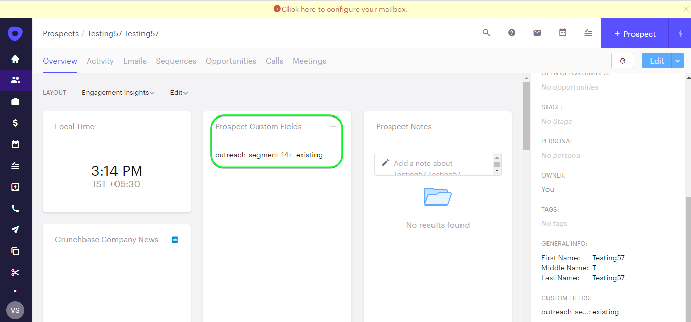

# [!DNL Outreach]-Verbindung

## Übersicht {#overview}

[[!DNL Outreach]](https://www.outreach.io/) ist eine Sales Execution-Plattform mit den weltweit meisten Daten zu B2B-Käufer-Verkäufer-Interaktionen und erheblichen Investitionen in proprietäre KI-Technologien zur Umwandlung von Verkaufsdaten in Intelligenz. [!DNL Outreach] unterstützt Unternehmen bei der Automatisierung des Vertriebsengagements und der Nutzung von Umsatzdaten, um ihre Effizienz, Vorhersagbarkeit und ihr Wachstum zu verbessern.

Dieses [!DNL Adobe Experience Platform] [Ziel](/help/destinations/home.md) nutzt die [API für das Auslaufen der Update-Ressource ](https://api.outreach.io/api/v2/docs#update-an-existing-resource), mit der Sie Identitäten innerhalb einer Zielgruppe aktualisieren können, die Interessenten in [!DNL Outreach] entspricht.

[!DNL Outreach] verwendet OAuth 2 mit Autorisierungszuschuss als Authentifizierungsmechanismus für die Kommunikation mit dem [!DNL Outreach] [!DNL Update Resource API]. Anweisungen zum Authentifizieren bei Ihrer [!DNL Outreach]-Instanz finden Sie weiter unten im Abschnitt [Für Ziel authentifizieren](#authenticate) .

## Anwendungsfälle {#use-cases}

Als Marketer können Sie Ihren potenziellen Kunden personalisierte Erlebnisse auf der Grundlage von Attributen aus ihren Adobe Experience Platform-Profilen bereitstellen. Sie können Zielgruppen aus Ihren Offline-Daten erstellen und diese Zielgruppen an [!DNL Outreach] senden, um sie in den Feeds der Interessenten anzuzeigen, sobald Zielgruppen und Profile in Adobe Experience Platform aktualisiert wurden.

## Voraussetzungen {#prerequisites}

### Voraussetzungen für Experience Platform {#prerequisites-in-experience-platform}

Vor der Aktivierung der Daten für das [!DNL Outreach]-Ziel müssen Sie über ein [Schema](/help/xdm/schema/composition.md), einen [Datensatz](https://experienceleague.adobe.com/docs/platform-learn/tutorials/data-ingestion/create-datasets-and-ingest-data.html) und [Segmente](https://experienceleague.adobe.com/docs/platform-learn/tutorials/segments/create-segments.html) verfügen, die in [!DNL Experience Platform] erstellt wurden.

Weitere Informationen zum Zielgruppenstatus finden Sie in der Adobe-Dokumentation für die Schemafeldergruppe [Zielgruppenzugehörigkeitsdetails](/help/xdm/field-groups/profile/segmentation.md) .

### Voraussetzungen für die Auslieferung {#prerequisites-destination}

Beachten Sie die folgenden Voraussetzungen in [!DNL Outreach], um Daten von Platform in Ihr [!DNL Outreach]-Konto zu exportieren:

#### Sie benötigen ein Outreach-Konto. {#prerequisites-account}

Rufen Sie die Seite [!DNL Outreach] [Anmelden](https://accounts.outreach.io/users/sign_in) auf, um sich zu registrieren und ein Konto zu erstellen, falls noch keines vorhanden ist. Weitere Informationen finden Sie unter [!DNL Outreach] Unterstützung [Seite](https://support.outreach.io/hc/en-us/articles/207238607-Claim-Your-Outreach-Account) .

Beachten Sie die folgenden Punkte, bevor Sie sich beim [!DNL Outreach]-CRM-Ziel authentifizieren:

| Anmeldedaten | Beschreibung |
|---|---|
| E-Mail | Ihre [!DNL Outreach] -Konto-E-Mail |
| Kennwort | Ihr [!DNL Outreach] Kontokennwort |

#### Benutzerdefinierte Feldbeschriftungen einrichten {#prerequisites-custom-fields}

[!DNL Outreach] unterstützt benutzerdefinierte Felder für [Interessenten](https://support.outreach.io/hc/en-us/articles/360001557554-Outreach-Prospect-Profile-Overview). Weitere Informationen finden Sie unter [Hinzufügen eines benutzerdefinierten Felds in Outreach ](https://support.outreach.io/hc/en-us/articles/219124908-How-To-Add-a-Custom-Field-in-Outreach) . Zur einfachen Identifizierung wird empfohlen, die Titel manuell auf die entsprechenden Zielgruppennamen zu aktualisieren, anstatt die Standardwerte beizubehalten. Beispiel:

[!DNL Outreach] Einstellungsseite für Interessenten, die benutzerdefinierte Felder anzeigen.

[!DNL Outreach] Einstellungsseite für Interessenten, die benutzerdefinierte Felder mit *benutzerfreundlichen* Bezeichnungen anzeigen, die mit den Zielgruppennamen übereinstimmen. Sie können den Zielgruppenstatus auf der Interessensseite anhand dieser Bezeichnungen anzeigen.

>[!NOTE]
>
> Bezeichnungsnamen dienen nur der einfachen Identifizierung. Sie werden bei der Aktualisierung von Interessenten nicht verwendet.

## Leitplanken

Die [!DNL Outreach] -API hat eine Ratenbegrenzung von 10.000 Anfragen pro Stunde pro Benutzer. Wenn Sie dieses Limit erreichen, erhalten Sie eine `429` -Antwort mit der folgenden Meldung: `You have exceeded your permitted rate limit of 10,000; please try again at 2017-01-01T00:00:00.`.

Wenn Sie diese Nachricht erhalten haben, müssen Sie Ihren Zielgruppenexport-Zeitplan entsprechend dem Schwellenwert für die Rate aktualisieren.

Weitere Informationen finden Sie in der [[!DNL Outreach] Dokumentation](https://api.outreach.io/api/v2/docs#rate-limiting) .

## Unterstützte Identitäten {#supported-identities}

[!DNL Outreach] unterstützt die Aktualisierung von Identitäten, die in der folgenden Tabelle beschrieben werden. Erhalten Sie weitere Informationen zu [Identitäten](/help/identity-service/features/namespaces.md).

| Zielgruppenidentität | Beschreibung | Zu beachten |
|---|---|---|
| `OutreachId` | <ul><li>[!DNL Outreach] Kennung. Dies ist ein numerischer Wert, der dem Prospektprofil entspricht.</li><li>Die ID muss mit der ID innerhalb der [!DNL Outreach]-URL übereinstimmen, damit der Interessent aktualisiert wird.</li><li>Siehe die [[!DNL Outreach] Dokumentation](https://api.outreach.io/api/v2/docs#update-an-existing-resource), um weitere Informationen zu erhalten.</li></ul> | Obligatorisch |

## Exporttyp und -häufigkeit {#export-type-frequency}

Beziehen Sie sich auf die folgende Tabelle, um Informationen zu Typ und Häufigkeit des Zielexports zu erhalten.

| Element | Typ | Anmerkungen |
---------|----------|---------|
| Exporttyp | **[!UICONTROL Profilbasiert]** | <ul><li> Sie exportieren alle Mitglieder eines Segments zusammen mit den gewünschten Schemafeldern *(z. B.: E-Mail-Adresse, Telefonnummer, Nachname)*, entsprechend Ihrer Feldzuordnung.</li><li> Jeder Segmentstatus in [!DNL Outreach] wird mit dem entsprechenden Zielgruppenstatus von Platform aktualisiert, basierend auf dem Wert [!UICONTROL Zuordnungs-ID] , der während des Schritts [Zielgruppenplanung](#schedule-segment-export-example) angegeben wurde.</li></ul> |
| Exporthäufigkeit | **[!UICONTROL Streaming]** | <ul><li> Streaming-Ziele sind „immer verfügbare“ API-basierte Verbindungen. Sobald ein Profil in Experience Platform auf der Grundlage einer Zielgruppenauswertung aktualisiert wird, sendet der Connector das Update nachgelagert an die Zielplattform. Lesen Sie mehr über [Streaming-Ziele](/help/destinations/destination-types.md#streaming-destinations).</li></ul> |

{style="table-layout:auto"}

## Herstellen einer Verbindung mit dem Ziel {#connect}

>[!IMPORTANT]
> 
> Um eine Verbindung zum Ziel herzustellen, benötigen Sie die [Zugriffsberechtigung](/help/access-control/home.md#permissions) **[!UICONTROL Ziele verwalten]**. Lesen Sie die [Zugriffskontrolle – Übersicht](/help/access-control/ui/overview.md) oder wenden Sie sich an Ihren Produktadministrator, um die erforderlichen Berechtigungen zu erhalten.

Um eine Verbindung mit diesem Ziel herzustellen, gehen Sie wie im [Tutorial zur Zielkonfiguration](../../ui/connect-destination.md) beschrieben vor. Füllen Sie im Workflow zum Konfigurieren des Ziels die Felder aus, die in den beiden folgenden Abschnitten aufgeführt sind.

Suchen Sie in **[!UICONTROL Ziele]** > **[!UICONTROL Katalog]** nach [!DNL Outreach]. Alternativ können Sie sie unter der Kategorie CRM finden.

### Beim Ziel authentifizieren {#authenticate}

Um sich beim Ziel zu authentifizieren, wählen Sie **[!UICONTROL Mit Ziel verbinden]** aus.

Ihnen wird die Anmeldeseite [!DNL Outreach] angezeigt. Geben Sie Ihre E-Mail an.

Geben Sie als Nächstes Ihr Kennwort ein.

* **[!UICONTROL Benutzername]**: Ihre [!DNL Outreach] Konto-E-Mail.
* **[!UICONTROL Kennwort]**: Ihr [!DNL Outreach] Kontokennwort.

Wenn die angegebenen Details gültig sind, zeigt die Benutzeroberfläche den Status **Verbunden** mit einem grünen Häkchen an. Sie können dann mit dem nächsten Schritt fortfahren.

### Ausfüllen der Zieldetails {#destination-details}

Füllen Sie die folgenden erforderlichen und optionalen Felder aus, um Details für das Ziel zu konfigurieren. Ein Sternchen neben einem Feld in der Benutzeroberfläche zeigt an, dass das Feld erforderlich ist.

* **[!UICONTROL Name]**: Ein Name, durch den Sie dieses Ziel in Zukunft erkennen können.
* **[!UICONTROL Beschreibung]**: Eine Beschreibung, die Ihnen hilft, dieses Ziel in Zukunft zu identifizieren.

### Aktivieren von Warnhinweisen {#enable-alerts}

Sie können Warnhinweise aktivieren, um Benachrichtigungen zum Status des Datenflusses zu Ihrem Ziel zu erhalten. Wählen Sie einen Warnhinweis aus der zu abonnierenden Liste aus, um Benachrichtigungen über den Status Ihres Datenflusses zu erhalten. Weitere Informationen zu Warnhinweisen finden Sie im Handbuch zum [Abonnieren von Zielwarnhinweisen über die Benutzeroberfläche](../../ui/alerts.md).

Wenn Sie alle Details für Ihre Zielverbindung eingegeben haben, klicken Sie auf **[!UICONTROL Weiter]**.

## Aktivieren von Zielgruppen für dieses Ziel {#activate}

>[!IMPORTANT]
> 
>* Um Daten zu aktivieren, benötigen Sie die Zugriffssteuerungsberechtigungen **[!UICONTROL Ziele anzeigen]**, **[!UICONTROL Ziele aktivieren]**, **[!UICONTROL Profile anzeigen]** und **[!UICONTROL Segmente anzeigen]** [. ](/help/access-control/home.md#permissions) Lesen Sie die [Übersicht über die Zugriffssteuerung](/help/access-control/ui/overview.md) oder wenden Sie sich an Ihre Produktadmins, um die erforderlichen Berechtigungen zu erhalten.
>* Um *identities* zu exportieren, benötigen Sie die Zugriffssteuerungsberechtigung **[!UICONTROL Identitätsdiagramm anzeigen]** .   {width="100" zoomable="yes"}

Anweisungen zum Aktivieren von Zielgruppen für dieses Ziel finden Sie unter [Aktivieren von Profilen und Zielgruppen für Streaming-Zielgruppen-Exportziele](../../ui/activate-segment-streaming-destinations.md).

### Zuordnungsüberlegungen und Beispiel {#mapping-considerations-example}

Um Ihre Zielgruppendaten ordnungsgemäß von Adobe Experience Platform an das [!DNL Outreach]-Ziel zu senden, müssen Sie den Schritt zur Feldzuordnung durchlaufen. Die Zuordnung besteht darin, eine Verknüpfung zwischen den Schemafeldern Ihres Experience-Datenmodells (XDM) in Ihrem Platform-Konto und den jeweiligen Entsprechungen vom Ziel zu erstellen. Um Ihre XDM-Felder den [!DNL Outreach]-Zielfeldern korrekt zuzuordnen, führen Sie die folgenden Schritte aus:

1. Klicken Sie im Schritt [!UICONTROL Zuordnung] auf **[!UICONTROL Neue Zuordnung hinzufügen]**. Auf dem Bildschirm wird eine neue Zuordnungszeile angezeigt.
   

1. Wählen Sie im Fenster [!UICONTROL Quellfeld auswählen] die Kategorie **[!UICONTROL Identitäts-Namespace auswählen]** aus und fügen Sie die gewünschten Zuordnungen hinzu.
   

1. Wählen Sie im Fenster [!UICONTROL Zielfeld auswählen] den Typ des Zielfelds aus, dem Sie Ihr Quellfeld zuordnen möchten.
   * **[!UICONTROL Identity-Namespace auswählen]**: Wählen Sie diese Option aus, um Ihr Quellfeld einem Identity-Namespace aus der Liste zuzuordnen.
     

   * Fügen Sie die folgende Zuordnung zwischen Ihrem XDM-Profilschema und Ihrer [!DNL Outreach]-Instanz hinzu:
|XDM-Profilschema|[!DNL Outreach] Instanz| Obligatorisch|
|---|---|---|
|`Oid`|`OutreachId`| Ja |

   * **[!UICONTROL Benutzerdefinierte Attribute auswählen]**: Wählen Sie diese Option aus, um Ihr Quellfeld einem benutzerdefinierten Attribut zuzuordnen, das Sie im Feld [!UICONTROL Attributname] definieren. Eine umfassende Liste der unterstützten Attribute finden Sie in der [[!DNL Outreach] Prospektdokumentation](https://api.outreach.io/api/v2/docs#prospect) .
     

   * Fügen Sie je nach den Werten, die Sie aktualisieren möchten, beispielsweise die folgende Zuordnung zwischen Ihrem XDM-Profilschema und Ihrer [!DNL Outreach] -Instanz hinzu:
|XDM-Profilschema|[!DNL Outreach] Instanz|
|—|—|
|`person.name.firstName`|`firstName`|
|`person.name.lastName`|`lastName`|

   * Nachfolgend finden Sie ein Beispiel für die Verwendung dieser Zuordnungen:
     

### Zielgruppenexport und Beispiel planen {#schedule-segment-export-example}

* Beim Ausführen des Schritts [Zielgruppenexport planen](../../ui/activate-segment-streaming-destinations.md) müssen Sie Platform-Zielgruppen manuell dem benutzerdefinierten Feldattribut in [!DNL Outreach] zuordnen.

* Wählen Sie dazu jedes Segment aus und geben Sie dann im Feld **[!UICONTROL Zuordnungs-ID]** den entsprechenden numerischen Wert ein, der dem Feld *Benutzerdefiniertes Feld `N` Titel* von [!DNL Outreach] entspricht.

  >[!IMPORTANT]
  >
  > * Der numerische Wert *(`N`)*, der innerhalb der [!UICONTROL Zuordnungs-ID] verwendet wird, sollte mit dem benutzerdefinierten Attributschlüssel übereinstimmen, der mit dem numerischen Wert innerhalb von [!DNL Outreach] suffiziert wird. Beispiel: *Benutzerdefiniertes Feld `N` Bezeichnung*.
  > * Sie müssen nur den numerischen Wert angeben, nicht die gesamte benutzerdefinierte Feldbezeichnung.
  > * [!DNL Outreach] unterstützt maximal 150 benutzerdefinierte Beschriftungsfelder.
  > * Weitere Informationen finden Sie in der [[!DNL Outreach] Prospektdokumentation](https://api.outreach.io/api/v2/docs#prospect) .

   * Beispiel:

     | [!DNL Outreach] Feld | Plattformzuordnungs-ID |
     |---|---|
     | Beschriftung für benutzerdefiniertes Feld `4` | `4` |

     

## Überprüfen des Datenexports {#exported-data}

Gehen Sie wie folgt vor, um zu überprüfen, ob Sie das Ziel korrekt eingerichtet haben:

1. Wählen Sie **[!UICONTROL Ziele]** > **[!UICONTROL Durchsuchen]** aus, um zur Liste der Ziele zu navigieren.
   

1. Wählen Sie das Ziel aus und überprüfen Sie, ob der Status **[!UICONTROL aktiviert]** ist.
   

1. Wechseln Sie zur Registerkarte **[!DNL Activation data]** und wählen Sie einen Zielgruppennamen aus.
   

1. Überwachen Sie die Zielgruppenzusammenfassung und stellen Sie sicher, dass die Anzahl der Profile der im Segment erstellten Anzahl entspricht.
   

1. Melden Sie sich bei der [!DNL Outreach] -Website an, navigieren Sie zur Seite [!DNL Apps] > [!DNL Contacts] und überprüfen Sie, ob die Profile aus der Zielgruppe hinzugefügt wurden. Sie können sehen, dass jeder Zielgruppenstatus in [!DNL Outreach] anhand des Werts [!UICONTROL Zuordnungs-ID], der beim Schritt [Zielgruppenplanung](#schedule-segment-export-example) angegeben wurde, mit dem entsprechenden Zielgruppenstatus von Platform aktualisiert wurde.

## Datennutzung und -Governance {#data-usage-governance}

Alle [!DNL Adobe Experience Platform]-Ziele sind bei der Verarbeitung Ihrer Daten mit Datennutzungsrichtlinien konform. Ausführliche Informationen darüber, wie [!DNL Adobe Experience Platform] Data Governance erzwingt, finden Sie unter [Data Governance – Übersicht](/help/data-governance/home.md).

## Fehler und Fehlerbehebung {#errors-and-troubleshooting}

Beim Überprüfen eines Datenfluss-Ablaufs wird möglicherweise die folgende Fehlermeldung angezeigt: `Bad request reported while pushing events to the destination. Please contact the administrator and try again.`

Um diesen Fehler zu beheben, überprüfen Sie, ob die [!UICONTROL Zuordnungs-ID], die Sie in Platform für Ihre [!DNL Outreach] -Zielgruppe angegeben haben, gültig ist und in [!DNL Outreach] vorhanden ist.

## Zusätzliche Ressourcen {#additional-resources}

Die [[!DNL Outreach] Dokumentation](https://api.outreach.io/api/v2/docs/) enthält Details zu [Fehlerantworten](https://api.outreach.io/api/v2/docs#error-responses) , die Sie zum Debuggen von Problemen verwenden können.
