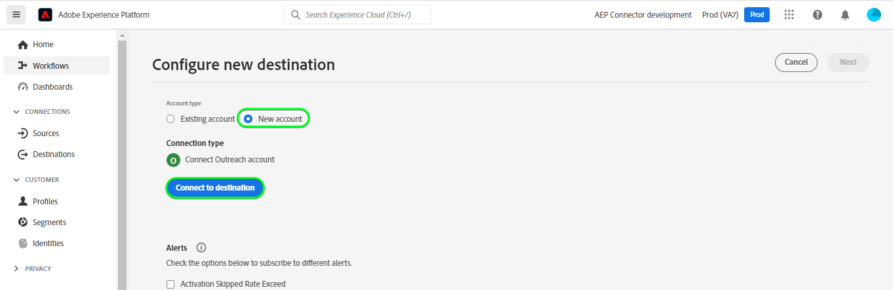

# [!DNL Outreach]-Verbindung

## Übersicht {#overview}

[[!DNL Outreach]](https://www.outreach.io/) ist eine Sales Execution-Plattform mit den weltweit meisten Daten zu B2B-Käufer-Verkäufer-Interaktionen und erheblichen Investitionen in proprietäre KI-Technologien zur Umwandlung von Verkaufsdaten in Intelligenz. [!DNL Outreach] unterstützt Unternehmen bei der Automatisierung des Vertriebsengagements und der Nutzung von Umsatzdaten, um ihre Effizienz, Vorhersagbarkeit und ihr Wachstum zu verbessern.

Diese [!DNL Adobe Experience Platform] [Ziel](/help/destinations/home.md) nutzt die [Outreach Update Resource API](https://api.outreach.io/api/v2/docs#update-an-existing-resource), mit dem Sie Identitäten innerhalb eines Segments aktualisieren können, die potenziellen Kunden in [!DNL Outreach].

[!DNL Outreach] verwendet OAuth 2 mit Autorisierungs-Grant als Authentifizierungsmechanismus für die Kommunikation mit der [!DNL Outreach] [!DNL Update Resource API]. Anweisungen zur Authentifizierung bei Ihrem [!DNL Outreach] -Instanz befindet sich weiter unten in [An Ziel authentifizieren](#authenticate) Abschnitt.

## Anwendungsfälle {#use-cases}

Als Marketer können Sie Ihren potenziellen Kunden personalisierte Erlebnisse auf der Grundlage von Attributen aus ihren Adobe Experience Platform-Profilen bereitstellen. Sie können Segmente aus Ihren Offline-Daten erstellen und diese Segmente an senden [!DNL Outreach], um in den Feeds der potenziellen Kunden anzuzeigen, sobald Segmente und Profile in Adobe Experience Platform aktualisiert wurden.

## Voraussetzungen {#prerequisites}

### Voraussetzungen für Experience Platform {#prerequisites-in-experience-platform}

Vor der Aktivierung der Daten für das [!DNL Outreach]-Ziel müssen Sie über ein [Schema](/help/xdm/schema/composition.md), einen [Datensatz](https://experienceleague.adobe.com/docs/platform-learn/tutorials/data-ingestion/create-datasets-and-ingest-data.html?lang=de) und [Segmente](https://experienceleague.adobe.com/docs/platform-learn/tutorials/segments/create-segments.html?lang=de) verfügen, die in [!DNL Experience Platform] erstellt wurden.

Weitere Informationen finden Sie in der Dokumentation von Adobe zu den [Details zur Segmentzugehörigkeit der Schemafeldgruppe](/help/xdm/field-groups/profile/segmentation.md), wenn Sie Anleitung zu Segmentstatus benötigen.

### Voraussetzungen für die Auslieferung {#prerequisites-destination}

Beachten Sie die folgenden Voraussetzungen in [!DNL Outreach], um Daten von Platform in Ihr [!DNL Outreach]-Konto zu exportieren:

#### Sie benötigen ein Outreach-Konto. {#prerequisites-account}

Navigieren Sie zu [!DNL Outreach] [Anmelden](https://accounts.outreach.io/users/sign_in) -Seite, um sich zu registrieren und ein Konto zu erstellen, falls Sie noch kein Konto haben. Siehe auch [!DNL Outreach] Support [page](https://support.outreach.io/hc/en-us/articles/207238607-Claim-Your-Outreach-Account) für weitere Details.

Beachten Sie die folgenden Punkte, bevor Sie sich beim [!DNL Outreach]-CRM-Ziel authentifizieren:

| Anmeldedaten | Beschreibung |
|---|---|
| E-Mail | Ihre [!DNL Outreach] Konto-E-Mail |
| Kennwort | Ihre [!DNL Outreach] Passwort des Kontos |

#### Benutzerdefinierte Feldbeschriftungen einrichten {#prerequisites-custom-fields}

[!DNL Outreach] unterstützt benutzerdefinierte Felder für [Perspektiven](https://support.outreach.io/hc/en-us/articles/360001557554-Outreach-Prospect-Profile-Overview). Siehe [Hinzufügen eines benutzerdefinierten Felds in Outreach](https://support.outreach.io/hc/en-us/articles/219124908-How-To-Add-a-Custom-Field-in-Outreach) für zusätzliche Leitlinien. Zur einfachen Identifizierung wird empfohlen, die Bezeichnungen manuell auf die entsprechenden Segmentnamen zu aktualisieren, anstatt die Standardwerte beizubehalten. Beispiel:

[!DNL Outreach] Einstellungsseite für Interessenten, die benutzerdefinierte Felder anzeigen.

[!DNL Outreach] Einstellungsseite für Interessenten, die benutzerdefinierte Felder mit *benutzerfreundlich* Bezeichnungen, die mit den Segmentnamen übereinstimmen. Sie können den Segmentstatus auf der Interessensseite anhand dieser Beschriftungen anzeigen.

>[!NOTE]
>
> Bezeichnungsnamen dienen nur der einfachen Identifizierung. Sie werden bei der Aktualisierung von Interessenten nicht verwendet.

## Leitplanken

Die [!DNL Outreach] Die API hat eine Ratenbegrenzung von 10.000 Anfragen pro Stunde und Benutzer. Wenn Sie dieses Limit erreichen, erhalten Sie eine `429` Antwort mit der folgenden Meldung: `You have exceeded your permitted rate limit of 10,000; please try again at 2017-01-01T00:00:00.`.

Wenn Sie diese Nachricht erhalten haben, müssen Sie Ihren Zeitplan für den Segmentexport entsprechend dem Schwellenwert für die Segmentexportrate aktualisieren.

Siehe Abschnitt [[!DNL Outreach] Dokumentation](https://api.outreach.io/api/v2/docs#rate-limiting) für weitere Details.

## Unterstützte Identitäten {#supported-identities}

[!DNL Outreach] unterstützt die Aktualisierung von Identitäten, die in der folgenden Tabelle beschrieben werden. Erhalten Sie weitere Informationen zu [Identitäten](/help/identity-service/namespaces.md).

| Zielgruppenidentität | Beschreibung | Zu beachten |
|---|---|---|
| `OutreachId` | <ul><li>[!DNL Outreach] identifier. Dies ist ein numerischer Wert, der dem Prospektprofil entspricht.</li><li>Die ID muss mit der ID innerhalb der [!DNL Outreach] URL für den zu aktualisierenden Interessenten.</li><li>Siehe die [[!DNL Outreach] Dokumentation](https://api.outreach.io/api/v2/docs#update-an-existing-resource), um weitere Informationen zu erhalten.</li></ul> | Obligatorisch |

## Exporttyp und -häufigkeit {#export-type-frequency}

Beziehen Sie sich auf die folgende Tabelle, um Informationen zu Typ und Häufigkeit des Zielexports zu erhalten.

| Element | Typ | Anmerkungen |
---------|----------|---------|
| Exporttyp | **[!UICONTROL Profilbasiert]** | <ul><li> Sie exportieren alle Mitglieder eines Segments zusammen mit den gewünschten Schemafeldern *(z. B.: E-Mail-Adresse, Telefonnummer, Nachname)*, entsprechend Ihrer Feldzuordnung.</li><li> Jeder Segmentstatus in [!DNL Outreach] wird mit dem entsprechenden Segmentstatus von Platform aktualisiert, basierend auf dem Wert der [!UICONTROL Zuordnungs-ID], der im Schritt [Segmentplanung](#schedule-segment-export-example) angegeben wurde.</li></ul> |
| Exporthäufigkeit | **[!UICONTROL Streaming]** | <ul><li> Streaming-Ziele sind „immer verfügbare“ API-basierte Verbindungen. Sobald ein Profil in Experience Platform auf der Grundlage einer Segmentbewertung aktualisiert wird, sendet der Connector das Update nachgelagert an die Zielplattform. Lesen Sie mehr über [Streaming-Ziele](/help/destinations/destination-types.md#streaming-destinations).</li></ul> |

{style="table-layout:auto"}

## Herstellen einer Verbindung mit dem Ziel {#connect}

>[!IMPORTANT]
> 
> Um eine Verbindung zum Ziel herzustellen, benötigen Sie die [Zugriffsberechtigung](/help/access-control/home.md#permissions) **[!UICONTROL Ziele verwalten]**. Lesen Sie die [Zugriffskontrolle – Übersicht](/help/access-control/ui/overview.md) oder wenden Sie sich an Ihren Produktadministrator, um die erforderlichen Berechtigungen zu erhalten.

Um eine Verbindung mit diesem Ziel herzustellen, gehen Sie wie im [Tutorial zur Zielkonfiguration](../../ui/connect-destination.md) beschrieben vor. Füllen Sie im Workflow zum Konfigurieren des Ziels die Felder aus, die in den beiden folgenden Abschnitten aufgeführt sind.

Suchen Sie in **[!UICONTROL Ziele]** > **[!UICONTROL Katalog]** nach [!DNL Outreach]. Alternativ können Sie es unter der CRM-Kategorie finden.

### Beim Ziel authentifizieren {#authenticate}

Um sich beim Ziel zu authentifizieren, wählen Sie **[!UICONTROL Mit Ziel verbinden]**.

Sie werden die [!DNL Outreach] Anmeldeseite. Geben Sie Ihre E-Mail an.

Geben Sie als Nächstes Ihr Kennwort ein.

* **[!UICONTROL Benutzername]**: Ihre [!DNL Outreach] Konto-E-Mail.
* **[!UICONTROL Passwort]**: Ihre [!DNL Outreach] Kontokennwort.

Wenn die angegebenen Details gültig sind, zeigt die Benutzeroberfläche den Status **Verbunden** mit einem grünen Häkchen an. Sie können dann mit dem nächsten Schritt fortfahren.

### Ausfüllen der Zieldetails {#destination-details}

Füllen Sie die folgenden erforderlichen und optionalen Felder aus, um Details für das Ziel zu konfigurieren. Ein Sternchen neben einem Feld in der Benutzeroberfläche zeigt an, dass das Feld erforderlich ist.

* **[!UICONTROL Name]**: Ein Name, durch den Sie dieses Ziel in Zukunft erkennen können.
* **[!UICONTROL Beschreibung]**: Eine Beschreibung, die Ihnen hilft, dieses Ziel in Zukunft zu identifizieren.

### Aktivieren von Warnhinweisen {#enable-alerts}

Sie können Warnhinweise aktivieren, um Benachrichtigungen zum Status des Datenflusses zu Ihrem Ziel zu erhalten. Wählen Sie einen Warnhinweis aus der zu abonnierenden Liste aus, um Benachrichtigungen über den Status Ihres Datenflusses zu erhalten. Weitere Informationen zu Warnhinweisen finden Sie im Handbuch zum [Abonnieren von Zielwarnhinweisen über die Benutzeroberfläche](../../ui/alerts.md).

Wenn Sie mit dem Eingeben der Details für Ihre Zielverbindung fertig sind, klicken Sie auf **[!UICONTROL Weiter]**.

## Aktivieren von Segmenten für dieses Ziel {#activate}

>[!IMPORTANT]
> 
> Um Daten zu aktivieren, benötigen Sie die [Zugriffssteuerungsberechtigungen](/help/access-control/home.md#permissions) **[!UICONTROL Ziele verwalten]**, **[!UICONTROL Ziele aktivieren]**, **[!UICONTROL Profile anzeigen]** und **[!UICONTROL Segmente anzeigen]**. Lesen Sie die [Zugriffssteuerung – Übersicht](/help/access-control/ui/overview.md) oder wenden Sie sich an Ihren Produktadministrator, um die erforderlichen Berechtigungen zu erhalten.

Anweisungen zum Aktivieren von Zielgruppensegmenten für dieses Ziel finden Sie unter [Aktivieren von Profilen und Segmenten für Streaming-Segmentexportziele](../../ui/activate-segment-streaming-destinations.md).

### Zuordnungsüberlegungen und Beispiel {#mapping-considerations-example}

Um Ihre Zielgruppendaten ordnungsgemäß von Adobe Experience Platform an das [!DNL Outreach]-Ziel zu senden, müssen Sie den Schritt zur Feldzuordnung durchlaufen. Die Zuordnung besteht darin, eine Verknüpfung zwischen den Schemafeldern Ihres Experience-Datenmodells (XDM) in Ihrem Platform-Konto und den jeweiligen Entsprechungen vom Ziel zu erstellen. Um Ihre XDM-Felder den [!DNL Outreach]-Zielfeldern korrekt zuzuordnen, führen Sie die folgenden Schritte aus:

1. Im [!UICONTROL Zuordnung] Schritt, klicken Sie auf **[!UICONTROL Neues Mapping hinzufügen]**. Auf dem Bildschirm wird eine neue Zuordnungszeile angezeigt.
   

1. Im [!UICONTROL Quellfeld auswählen] Fenster, wählen Sie die **[!UICONTROL Identitäts-Namespace auswählen]** und fügen Sie die gewünschten Zuordnungen hinzu.
   

1. Wählen Sie im Fenster [!UICONTROL Zielfeld auswählen] den Typ des Zielfelds aus, dem Sie Ihr Quellfeld zuordnen möchten.
   * **[!UICONTROL Identity-Namespace auswählen]**: Wählen Sie diese Option aus, um Ihr Quellfeld einem Identity-Namespace aus der Liste zuzuordnen.
      

   * Fügen Sie die folgende Zuordnung zwischen Ihrem XDM-Profilschema und Ihrer [!DNL Outreach]-Instanz hinzu:
|XDM-Profilschema|[!DNL Outreach] Instanz| Obligatorisch|
|---|---|---|
|`Oid`|`OutreachId`| Ja |

   * **[!UICONTROL Benutzerdefinierte Attribute auswählen]**: Wählen Sie diese Option aus, um Ihr Quellfeld einem benutzerdefinierten Attribut zuzuordnen, das Sie im Feld [!UICONTROL Attributname] definieren. Siehe [[!DNL Outreach] Interessentendokumentation](https://api.outreach.io/api/v2/docs#prospect) für eine umfassende Liste der unterstützten Attribute.
      

   * Fügen Sie je nach den Werten, die Sie aktualisieren möchten, beispielsweise die folgende Zuordnung zwischen Ihrem XDM-Profilschema und Ihrem [!DNL Outreach] instance: |XDM-Profilschema|[!DNL Outreach] Instanz| |—|—| |`person.name.firstName`|`firstName`| |`person.name.lastName`|`lastName`|

   * Nachfolgend finden Sie ein Beispiel für die Verwendung dieser Zuordnungen:
      

### Planen des Segmentexports und Beispiel {#schedule-segment-export-example}

* Bei der Durchführung der [Segmentexport planen](../../ui/activate-segment-streaming-destinations.md) Schritt: Sie müssen Platform-Segmente manuell dem benutzerdefinierten Feldattribut in [!DNL Outreach].

* Wählen Sie dazu jedes Segment aus und geben Sie dann den entsprechenden numerischen Wert ein, der dem *Benutzerdefiniertes Feld `N` Titel* -Feld aus [!DNL Outreach] im **[!UICONTROL Zuordnungs-ID]** -Feld.

   >[!IMPORTANT]
   >
   > * Numerischer Wert *(`N`)* verwendet innerhalb der [!UICONTROL Zuordnungs-ID] sollte mit dem benutzerdefinierten Attributschlüssel übereinstimmen, der dem numerischen Wert in [!DNL Outreach]. Beispiel: *Benutzerdefiniertes Feld `N` Titel*.
   > * Sie müssen nur den numerischen Wert angeben, nicht die gesamte benutzerdefinierte Feldbezeichnung.
   > * [!DNL Outreach] unterstützt maximal 150 benutzerdefinierte Beschriftungsfelder.
   > * Siehe [[!DNL Outreach] Interessentendokumentation](https://api.outreach.io/api/v2/docs#prospect) für Details.

   * Beispiel:

      | [!DNL Outreach] Feld | Plattformzuordnungs-ID |
      |---|---|
      | Benutzerdefiniertes Feld `4` Titel | `4` |

      

## Überprüfen des Datenexports {#exported-data}

Gehen Sie wie folgt vor, um zu überprüfen, ob Sie das Ziel korrekt eingerichtet haben:

1. Wählen Sie **[!UICONTROL Ziele]** > **[!UICONTROL Durchsuchen]** aus, um zur Liste der Ziele zu navigieren.
   

1. Wählen Sie das Ziel aus und überprüfen Sie, ob der Status **[!UICONTROL aktiviert]** ist.
   

1. Wechseln Sie zur Registerkarte **[!DNL Activation data]** und wählen Sie einen Segmentnamen aus.
   

1. Überwachen Sie die Segmentzusammenfassung und stellen Sie sicher, dass die Anzahl der Profile der im Segment erstellten Anzahl entspricht.
   

1. Melden Sie sich bei der [!DNL Outreach]-Website an und navigieren Sie dann zur Seite [!DNL Apps] > [!DNL Contacts], um zu überprüfen, ob die Profile aus dem Segment hinzugefügt wurden. Sie können sehen, dass jeder Segmentstatus in [!DNL Outreach] mit dem entsprechenden Segmentstatus von Platform aktualisiert wurde, basierend auf dem Wert der [!UICONTROL Zuordnungs-ID], der im Schritt [Segmentplanung](#schedule-segment-export-example) angegeben wurde.

## Datennutzung und -Governance {#data-usage-governance}

Alle [!DNL Adobe Experience Platform]-Ziele sind bei der Verarbeitung Ihrer Daten mit Datennutzungsrichtlinien konform. Ausführliche Informationen darüber, wie [!DNL Adobe Experience Platform] Data Governance erzwingt, finden Sie unter [Data Governance – Übersicht](/help/data-governance/home.md).

## Fehler und Fehlerbehebung {#errors-and-troubleshooting}

Beim Überprüfen eines Datenfluss-Ablaufs wird möglicherweise die folgende Fehlermeldung angezeigt: `Bad request reported while pushing events to the destination. Please contact the administrator and try again.`

Um diesen Fehler zu beheben, überprüfen Sie, ob die Variable [!UICONTROL Zuordnungs-ID] Sie in Platform für Ihre [!DNL Outreach] Segment gültig ist und in vorhanden ist [!DNL Outreach].

## Zusätzliche Ressourcen {#additional-resources}

Die [[!DNL Outreach] Dokumentation](https://api.outreach.io/api/v2/docs/) enthält Details zu [Fehlerantworten](https://api.outreach.io/api/v2/docs#error-responses) die Sie zum Debuggen von Problemen verwenden können.
