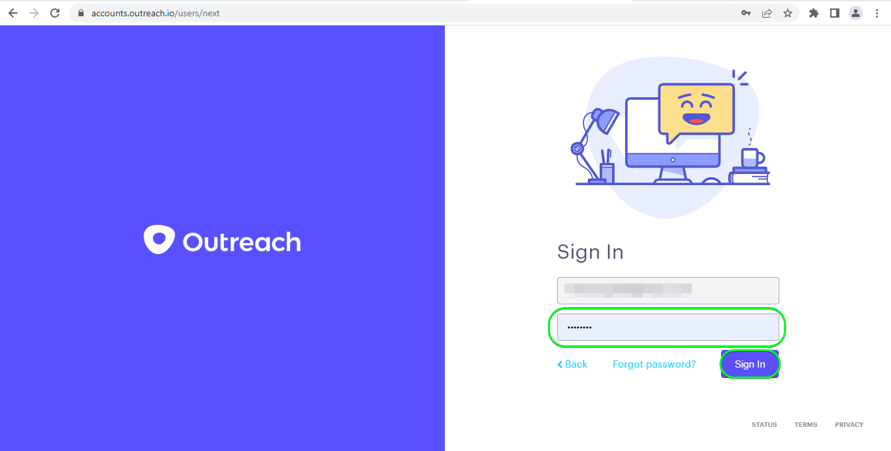

# [!DNL Outreach]-Verbindung

## Übersicht {#overview}

[[!DNL Outreach]](https://www.outreach.io/) ist eine Sales Execution-Plattform mit den weltweit meisten Daten zu B2B-Käufer-Verkäufer-Interaktionen und erheblichen Investitionen in proprietäre KI-Technologien zur Umwandlung von Verkaufsdaten in Intelligenz. [!DNL Outreach] unterstützt Unternehmen bei der Automatisierung des Vertriebsengagements und der Nutzung von Umsatzdaten, um ihre Effizienz, Vorhersagbarkeit und ihr Wachstum zu verbessern.

Dieses [!DNL Adobe Experience Platform] [Ziel](/help/destinations/home.md) nutzt die [Outreach Update Resource API](https://api.outreach.io/api/v2/docs#update-an-existing-resource), mit der Sie Identitäten in einer Audience aktualisieren können, die Interessenten in [!DNL Outreach] entspricht.

[!DNL Outreach] verwendet OAuth 2 mit Autorisierungs-Grant als Authentifizierungsmechanismus für die Kommunikation mit dem [!DNL Outreach]-[!DNL Update Resource API]. Anweisungen zur Authentifizierung bei Ihrer [!DNL Outreach] finden Sie weiter unten im Abschnitt [Authentifizieren bei Ziel](#authenticate).

## Anwendungsszenarien {#use-cases}

Als Marketing-Experte können Sie Ihren Interessenten personalisierte Erlebnisse auf der Grundlage von Attributen aus ihren Adobe Experience Platform-Profilen bereitstellen. Sie können Zielgruppen aus Ihren Offline-Daten erstellen und diese Zielgruppen an [!DNL Outreach] senden, damit sie in den Feeds der potenziellen Kunden angezeigt werden, sobald Zielgruppen und Profile in Adobe Experience Platform aktualisiert werden.

## Voraussetzungen {#prerequisites}

### Voraussetzungen für Experience Platform {#prerequisites-in-experience-platform}

Vor der Aktivierung der Daten für das [!DNL Outreach]-Ziel müssen Sie über ein [Schema](/help/xdm/schema/composition.md), einen [Datensatz](https://experienceleague.adobe.com/docs/platform-learn/tutorials/data-ingestion/create-datasets-and-ingest-data.html) und [Segmente](https://experienceleague.adobe.com/docs/platform-learn/tutorials/segments/create-segments.html) verfügen, die in [!DNL Experience Platform] erstellt wurden.

Weitere Informationen finden Sie in der Adobe[Dokumentation zur Schemafeldgruppe „Details zur Zielgruppenzugehörigkeit](/help/xdm/field-groups/profile/segmentation.md) , wenn Sie Anleitungen zu Zielgruppenstatus benötigen.

### Voraussetzungen für die Kontaktaufnahme {#prerequisites-destination}

Beachten Sie die folgenden Voraussetzungen in [!DNL Outreach], um Daten aus Experience Platform in Ihr [!DNL Outreach]-Konto zu exportieren:

#### Sie benötigen ein Outreach-Konto {#prerequisites-account}

Navigieren Sie zur [!DNL Outreach] [Anmelden](https://accounts.outreach.io/users/sign_in)-Seite, um sich zu registrieren und ein Konto zu erstellen, falls Sie noch keines haben. Weitere Informationen finden Sie auch auf [ Seite ](https://support.outreach.io/hc/en-us/articles/207238607-Claim-Your-Outreach-Account) [!DNL Outreach]-Support .

Beachten Sie die folgenden Punkte, bevor Sie sich beim [!DNL Outreach]-CRM-Ziel authentifizieren:

| Anmeldedaten | Beschreibung |
|---|---|
| E-Mail | E-Mail zu Ihrem [!DNL Outreach] Konto |
| Kennwort | Passwort Ihres [!DNL Outreach] Kontos |

#### Einrichten von benutzerdefinierten Feldbezeichnungen {#prerequisites-custom-fields}

[!DNL Outreach] unterstützt benutzerdefinierte Felder für [Interessenten](https://support.outreach.io/hc/en-us/articles/360001557554-Outreach-Prospect-Profile-Overview). Weitere Anleitungen finden [ unter „Hinzufügen eines benutzerdefinierten Felds ](https://support.outreach.io/hc/en-us/articles/219124908-How-To-Add-a-Custom-Field-in-Outreach) Outreach“. Um die Identifizierung zu erleichtern, wird empfohlen, die Kennzeichnungen manuell auf die entsprechenden Zielgruppennamen zu aktualisieren, anstatt die Standardwerte beizubehalten. Beispiel:

Seite „Einstellungen“ für Interessenten mit benutzerdefinierten Feldern [!DNL Outreach].

[!DNL Outreach] Einstellungsseite für Interessenten mit benutzerdefinierten Feldern, *benutzerfreundlichen*, die den Zielgruppennamen entsprechen. Sie können den Status der Zielgruppe auf der Seite Interessent anhand dieser Kennzeichnungen einsehen.

>[!NOTE]
>
> Bezeichnungsnamen dienen nur der einfachen Identifizierung. Sie werden nicht zur Aktualisierung von potenziellen Kunden verwendet.

## Leitlinien

Die [!DNL Outreach]-API erlaubt eine Ratenbeschränkung von 10.000 Anfragen pro Stunde und Benutzer. Wenn Sie diese Grenze erreichen, erhalten Sie eine `429` Antwort mit der folgenden Nachricht: `You have exceeded your permitted rate limit of 10,000; please try again at 2017-01-01T00:00:00.`.

Wenn Sie diese Nachricht erhalten haben, müssen Sie Ihren Zeitplan für den Zielgruppenexport aktualisieren, um den Schwellenwert für die Rate einzuhalten.

Weitere Informationen finden [[!DNL Outreach]  in der ](https://api.outreach.io/api/v2/docs#rate-limiting).

## Unterstützte Identitäten {#supported-identities}

[!DNL Outreach] unterstützt die Aktualisierung von Identitäten, die in der folgenden Tabelle beschrieben werden. Erhalten Sie weitere Informationen zu [Identitäten](/help/identity-service/features/namespaces.md).

| Zielidentität | Beschreibung | Zu beachten |
|---|---|---|
| `OutreachId` | <ul><li>[!DNL Outreach]. Dies ist ein numerischer Wert, der dem Interessentenprofil entspricht.</li><li>Die ID muss mit der ID in der [!DNL Outreach]-URL übereinstimmen, damit der Interessent aktualisiert wird.</li><li>Siehe die [[!DNL Outreach] Dokumentation](https://api.outreach.io/api/v2/docs#update-an-existing-resource), um weitere Informationen zu erhalten.</li></ul> | Obligatorisch |

## Exporttyp und -häufigkeit {#export-type-frequency}

Beziehen Sie sich auf die folgende Tabelle, um Informationen zu Typ und Häufigkeit des Zielexports zu erhalten.

| Element | Typ | Anmerkungen |
---------|----------|---------|
| Exporttyp | **[!UICONTROL Profilbasiert]** | <ul><li> Sie exportieren alle Mitglieder eines Segments zusammen mit den gewünschten Schemafeldern *(z. B.: E-Mail-Adresse, Telefonnummer, Nachname)*, entsprechend Ihrer Feldzuordnung.</li><li> Jeder Segmentstatus in [!DNL Outreach] wird mit dem entsprechenden Zielgruppenstatus von Experience Platform aktualisiert, basierend auf dem Wert [!UICONTROL Zuordnungs-ID], der im Schritt [Zielgruppen-Planung](#schedule-segment-export-example) angegeben wurde.</li></ul> |
| Exporthäufigkeit | **[!UICONTROL Streaming]** | <ul><li> Streaming-Ziele sind „immer verfügbare“ API-basierte Verbindungen. Sobald ein Profil in Experience Platform auf der Grundlage einer Zielgruppenauswertung aktualisiert wird, sendet der Connector das Update nachgelagert an die Zielplattform. Lesen Sie mehr über [Streaming-Ziele](/help/destinations/destination-types.md#streaming-destinations).</li></ul> |

{style="table-layout:auto"}

## Herstellen einer Verbindung mit dem Ziel {#connect}

>[!IMPORTANT]
> 
> Um eine Verbindung zum Ziel herzustellen, benötigen Sie die [Zugriffsberechtigung](/help/access-control/home.md#permissions) **[!UICONTROL Ziele verwalten]**. Lesen Sie die [Zugriffskontrolle – Übersicht](/help/access-control/ui/overview.md) oder wenden Sie sich an Ihren Produktadministrator, um die erforderlichen Berechtigungen zu erhalten.

Um eine Verbindung mit diesem Ziel herzustellen, gehen Sie wie im [Tutorial zur Zielkonfiguration](../../ui/connect-destination.md) beschrieben vor. Füllen Sie im Workflow zum Konfigurieren des Ziels die Felder aus, die in den beiden folgenden Abschnitten aufgeführt sind.

Suchen Sie in **[!UICONTROL Ziele]** > **[!UICONTROL Katalog]** nach [!DNL Outreach]. Alternativ können Sie es unter der CRM -Kategorie finden.

### Beim Ziel authentifizieren {#authenticate}

Um sich beim Ziel zu authentifizieren, wählen Sie **[!UICONTROL Mit Ziel verbinden]** aus.

Screenshot der 

Ihnen wird die [!DNL Outreach] Anmeldeseite angezeigt. Geben Sie Ihre E-Mail an.

Geben Sie als Nächstes Ihr Kennwort ein.

* **[!UICONTROL Benutzername]**: Ihre E-Mail-Adresse für das [!DNL Outreach].
* **[!UICONTROL Kennwort]**: Ihr Kennwort für das [!DNL Outreach]-Konto.

Wenn die angegebenen Details gültig sind, zeigt die Benutzeroberfläche den Status **Verbunden** mit einem grünen Häkchen an. Sie können dann mit dem nächsten Schritt fortfahren.

### Ausfüllen der Zieldetails {#destination-details}

Füllen Sie die folgenden erforderlichen und optionalen Felder aus, um Details für das Ziel zu konfigurieren. Ein Sternchen neben einem Feld in der Benutzeroberfläche zeigt an, dass das Feld erforderlich ist.
Screenshot der 

* **[!UICONTROL Name]**: Ein Name, durch den Sie dieses Ziel in Zukunft erkennen können.
* **[!UICONTROL Beschreibung]**: Eine Beschreibung, die Ihnen hilft, dieses Ziel in Zukunft zu identifizieren.

### Aktivieren von Warnhinweisen {#enable-alerts}

Sie können Warnhinweise aktivieren, um Benachrichtigungen zum Status des Datenflusses zu Ihrem Ziel zu erhalten. Wählen Sie einen Warnhinweis aus der zu abonnierenden Liste aus, um Benachrichtigungen über den Status Ihres Datenflusses zu erhalten. Weitere Informationen zu Warnhinweisen finden Sie im Handbuch zum [Abonnieren von Zielwarnhinweisen über die Benutzeroberfläche](../../ui/alerts.md).

Wenn Sie alle Details für Ihre Zielverbindung eingegeben haben, klicken Sie auf **[!UICONTROL Weiter]**.

## Aktivieren von Zielgruppen für dieses Ziel {#activate}

>[!IMPORTANT]
> 
>* Zum Aktivieren von Daten benötigen Sie die Berechtigungen **[!UICONTROL Ziele anzeigen]**, **[!UICONTROL Ziele aktivieren]**, **[!UICONTROL Profile anzeigen]** und **[!UICONTROL Segmente anzeigen]**&#x200B;[Zugriffssteuerung](/help/access-control/home.md#permissions). Lesen Sie die [Übersicht über die Zugriffssteuerung](/help/access-control/ui/overview.md) oder wenden Sie sich an Ihre Produktadmins, um die erforderlichen Berechtigungen zu erhalten.
>* Zum Exportieren *Identitäten* benötigen Sie die Berechtigung **[!UICONTROL Identitätsdiagramm anzeigen]** [Zugriffssteuerung](/help/access-control/home.md#permissions).   {width="100" zoomable="yes"}

Anweisungen zum Aktivieren von Zielgruppen für dieses Ziel finden Sie unter [Aktivieren von Profilen und Zielgruppen für Streaming-Zielgruppen-Exportziele](../../ui/activate-segment-streaming-destinations.md).

### Zuordnungsüberlegungen und Beispiel {#mapping-considerations-example}

Um Ihre Zielgruppendaten ordnungsgemäß von Adobe Experience Platform an das [!DNL Outreach]-Ziel zu senden, müssen Sie den Schritt zur Feldzuordnung durchlaufen. Die Zuordnung besteht darin, eine Verknüpfung zwischen den Schemafeldern Ihres Experience-Datenmodells (XDM) in Ihrem Experience Platform-Konto und den entsprechenden Entsprechungen vom Ziel zu erstellen. Um Ihre XDM-Felder den [!DNL Outreach]-Zielfeldern korrekt zuzuordnen, führen Sie die folgenden Schritte aus:

1. Klicken Sie [!UICONTROL &#x200B; Schritt &#x200B;]Zuordnung“ auf **[!UICONTROL Neue Zuordnung hinzufügen]**. Auf dem Bildschirm wird eine neue Zuordnungszeile angezeigt.
   Screenshot der 

1. Wählen Sie im Fenster [!UICONTROL Quellfeld auswählen] die Kategorie **[!UICONTROL Identity-Namespace auswählen]** und fügen Sie die gewünschten Zuordnungen hinzu.
   Screenshot der 

1. Wählen Sie im Fenster [!UICONTROL Zielfeld auswählen] den Typ des Zielfelds aus, dem Sie Ihr Quellfeld zuordnen möchten.
   * **[!UICONTROL Identity-Namespace auswählen]**: Wählen Sie diese Option aus, um Ihr Quellfeld einem Identity-Namespace aus der Liste zuzuordnen.

     Screenshot der 

   * Fügen Sie die folgende Zuordnung zwischen Ihrem XDM-Profilschema und Ihrer [!DNL Outreach]-Instanz hinzu:

     | XDM-Profilschema | Instanz [!DNL Outreach] | Obligatorisch |
     |---|---|---|
     | `Oid` | `OutreachId` | Ja |

   * **[!UICONTROL Benutzerdefinierte Attribute auswählen]**: Wählen Sie diese Option aus, um Ihr Quellfeld einem benutzerdefinierten Attribut zuzuordnen, das Sie im Feld [!UICONTROL Attributname] definieren. Eine umfassende Liste [[!DNL Outreach]  unterstützten Attribute finden ](https://api.outreach.io/api/v2/docs#prospect) in der Dokumentation zum Interessenten .

     Screenshot der Experience Platform-Benutzeroberfläche mit Ziel-Zuordnung unter Verwendung von LastName.

   * Fügen Sie je nach den Werten, die Sie aktualisieren möchten, beispielsweise die folgende Zuordnung zwischen Ihrem XDM-Profilschema und Ihrer [!DNL Outreach]-Instanz hinzu:

     | XDM-Profilschema | Instanz [!DNL Outreach] |
     |---|---|
     | `person.name.firstName` | `firstName` |
     | `person.name.lastName` | `lastName` |

   * Nachfolgend finden Sie ein Beispiel für die Verwendung dieser Zuordnungen:

     Beispiel-Screenshot der Experience Platform-Benutzeroberfläche mit Ziel-Zuordnungen.

### Planen des Zielgruppenexports und Beispiel {#schedule-segment-export-example}

* Beim Schritt [Planen des Zielgruppenexports](../../ui/activate-segment-streaming-destinations.md) müssen Sie Experience Platform-Zielgruppen manuell dem benutzerdefinierten Feldattribut in [!DNL Outreach] zuordnen.

* Wählen Sie dazu jedes Segment aus und geben Sie dann den entsprechenden numerischen Wert, der dem Feld *Benutzerdefiniertes Feld `N` Beschriftung* von [!DNL Outreach] im Feld **[!UICONTROL Zuordnungs-ID]** entspricht, ein.

  >[!IMPORTANT]
  >
  > * Der numerische Wert *(`N`)*, der in der [!UICONTROL Zuordnungs-ID] verwendet wird, sollte mit dem benutzerdefinierten Attributschlüssel übereinstimmen, der mit dem numerischen Wert in [!DNL Outreach] angefügt wird. Beispiel: *Benutzerdefiniertes Feld `N` Bezeichnung*.
  > * Sie müssen nur den numerischen Wert angeben, nicht die gesamte benutzerdefinierte Feldbezeichnung.
  > * [!DNL Outreach] unterstützt maximal 150 benutzerdefinierte Beschriftungsfelder.
  > * Weitere Informationen finden [[!DNL Outreach]  in der Dokumentation ](https://api.outreach.io/api/v2/docs#prospect) Interessenten .

   * z. B.:

     | [!DNL Outreach] | Experience Platform-Zuordnungs-ID |
     |---|---|
     | Titel `4` benutzerdefinierten Feldergruppen | `4` |

     Screenshot der 

## Überprüfen des Datenexports {#exported-data}

Gehen Sie wie folgt vor, um zu überprüfen, ob Sie das Ziel korrekt eingerichtet haben:

1. Wählen Sie **[!UICONTROL Ziele]** > **[!UICONTROL Durchsuchen]** aus, um zur Liste der Ziele zu navigieren.
   Screenshot der 

1. Wählen Sie das Ziel aus und überprüfen Sie, ob der Status **[!UICONTROL aktiviert]** ist.
   Screenshot der 

1. Wechseln Sie zur Registerkarte **[!DNL Activation data]** und wählen Sie einen Zielgruppennamen aus.
   Screenshot der 

1. Überwachen Sie die Zielgruppenzusammenfassung und stellen Sie sicher, dass die Anzahl der Profile der im Segment erstellten Anzahl entspricht.
   Screenshot der 

1. Melden Sie sich bei der [!DNL Outreach]-Website an und navigieren Sie dann zur Seite [!DNL Apps] > [!DNL Contacts] , um zu überprüfen, ob die Profile aus der Audience hinzugefügt wurden. Sie können sehen, dass jeder Zielgruppenstatus in [!DNL Outreach] mit dem entsprechenden Zielgruppenstatus von Experience Platform aktualisiert wurde, basierend auf dem Wert [!UICONTROL Zuordnungs-ID], der im Schritt [Zielgruppen-Planung](#schedule-segment-export-example) angegeben wurde.

## Datennutzung und -Governance {#data-usage-governance}

Alle [!DNL Adobe Experience Platform]-Ziele sind bei der Verarbeitung Ihrer Daten mit Datennutzungsrichtlinien konform. Ausführliche Informationen darüber, wie [!DNL Adobe Experience Platform] Data Governance erzwingt, finden Sie unter [Data Governance – Übersicht](/help/data-governance/home.md).

## Fehler und Fehlerbehebung {#errors-and-troubleshooting}

Beim Überprüfen einer Datenflussausführung wird möglicherweise die folgende Fehlermeldung angezeigt: `Bad request reported while pushing events to the destination. Please contact the administrator and try again.`

Screenshot der 

Um diesen Fehler zu beheben, überprüfen Sie, ob die [!UICONTROL Zuordnungs-ID], die Sie in Experience Platform für Ihre [!DNL Outreach] Zielgruppe angegeben haben, in [!DNL Outreach] vorhanden und gültig ist.

## Zusätzliche Ressourcen {#additional-resources}

Die [[!DNL Outreach] Dokumentation](https://api.outreach.io/api/v2/docs/) enthält Details zu [Fehlerantworten](https://api.outreach.io/api/v2/docs#error-responses) mit denen Sie Probleme beheben können.
