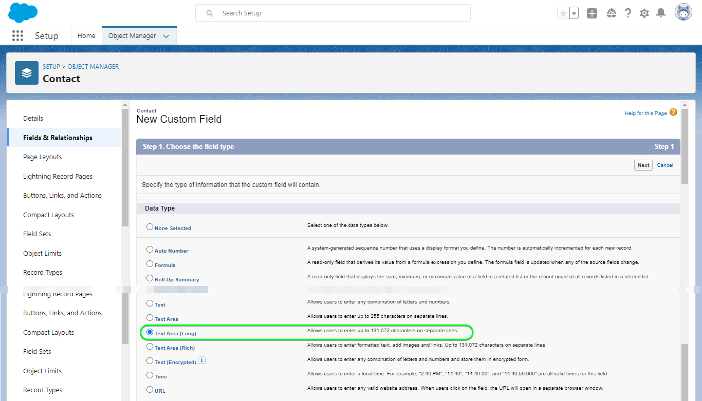

# [!DNL Salesforce CRM]-Verbindung

## Übersicht {#overview}

[[!DNL Salesforce CRM]](https://www.salesforce.com/crm/) ist eine beliebte CRM-Plattform (Customer Relationship Management) und unterstützt die unten beschriebenen Profiltypen:

* [Leads](https://developer.salesforce.com/docs/atlas.en-us.object_reference.meta/object_reference/sforce_api_objects_lead.htm) - Ein Lead ist der Name einer Person oder Firma, die sich möglicherweise für die von Ihnen verkauften Produkte oder Dienstleistungen interessiert (oder nicht).
* [Kontakte](https://developer.salesforce.com/docs/atlas.en-us.object_reference.meta/object_reference/sforce_api_objects_contact.htm) - Ein Kontakt ist eine Person, mit der einer Ihrer Vertreter eine Beziehung hergestellt hat und die als potenzieller Kunde qualifiziert wurde.

Dieses [!DNL Adobe Experience Platform] [Ziel](/help/destinations/home.md) nutzt den [[!DNL Salesforce composite API]](https://developer.salesforce.com/docs/atlas.en-us.api_rest.meta/api_rest/resources_composite_sobjects_collections_update.htm), der beide oben beschriebenen Profiltypen unterstützt.

Beim [Aktivieren von Segmenten](#activate) können Sie zwischen Leads oder Kontakten wählen und Attribute und Zielgruppendaten in [!DNL Salesforce CRM] aktualisieren.

[!DNL Salesforce CRM] verwendet OAuth 2 mit Password Grant als Authentifizierungsmechanismus für die Kommunikation mit der Salesforce REST API. Anweisungen zur Authentifizierung bei Ihrer [!DNL Salesforce CRM]-Instanz sehen Sie weiter unten im Abschnitt [Authentifizieren bei Ziel](#authenticate).

## Anwendungsbeispiele {#use-cases}

Als Marketing-Experte können Sie Ihren Benutzern personalisierte Erlebnisse auf der Basis von Attributen aus ihren Adobe Experience Platform-Profilen bereitstellen. Sie können Zielgruppen aus Ihren Offline-Daten erstellen und an Salesforce CRM senden, um die CRM-Mitgliedschaft zu aktualisieren, sobald Audiences und Profile in Adobe Experience Platform aktualisiert wurden.

## Voraussetzungen {#prerequisites}

### Voraussetzungen für Experience Platform {#prerequisites-in-experience-platform}

Bevor Sie Daten für das Salesforce CRM-Ziel aktivieren, müssen Sie über ein [Schema](/help/xdm/schema/composition.md), einen [Datensatz](https://experienceleague.adobe.com/docs/platform-learn/tutorials/data-ingestion/create-datasets-and-ingest-data.html) und [Segmente](https://experienceleague.adobe.com/docs/platform-learn/tutorials/segments/create-segments.html) verfügen, die in [!DNL Experience Platform] erstellt wurden.

### Voraussetzungen in [!DNL Salesforce CRM] {#prerequisites-destination}

Beachten Sie die folgenden Voraussetzungen in [!DNL Salesforce CRM], um Daten von Platform in Ihr Salesforce-Konto zu exportieren:

#### Sie benötigen ein [!DNL Salesforce]-Konto {#prerequisites-account}

Rufen Sie die Seite [!DNL Salesforce] [Testen](https://www.salesforce.com/in/form/signup/freetrial-sales/) auf, um sich zu registrieren und ein [!DNL Salesforce] -Konto zu erstellen, falls noch keines vorhanden ist.

#### Eine verbundene App mit [!DNL Salesforce] konfigurieren {#prerequisites-connected-app}

Zunächst müssen Sie eine [[!DNL Salesforce] verbundene App](https://help.salesforce.com/s/articleView?id=sf.connected_app_create.htm&amp;language=en_US&amp;r=https%3A%2F%2Fhelp.salesforce.com%2F&amp;type=5) in Ihrem [!DNL Salesforce]-Konto konfigurieren, falls noch keine vorhanden ist. [!DNL Salesforce CRM] nutzt die verbundene App, um eine Verbindung zu [!DNL Salesforce] herzustellen.

Aktivieren Sie als Nächstes [!DNL OAuth Settings for API Integration] für den [!DNL Salesforce connected app]. Eine Anleitung finden Sie in der Dokumentation zu [[!DNL Salesforce]](https://help.salesforce.com/s/articleView?id=connected_app_create_api_integration.htm&amp;type=5&amp;language=en_US) .

Stellen Sie außerdem sicher, dass die unten erwähnten [Bereiche](https://help.salesforce.com/s/articleView?id=connected_app_create_api_integration.htm&amp;type=5&amp;language=en_US) für den [!DNL Salesforce connected app] ausgewählt sind.

* ``chatter_api``
* ``lightning``
* ``visualforce``
* ``content``
* ``openid``
* ``full``
* ``api``
* ``web``
* ``refresh_token``
* ``offline_access``

Stellen Sie schließlich sicher, dass der `password`-Zuschuss in Ihrem [!DNL Salesforce]-Konto aktiviert ist. Weitere Informationen finden Sie in der Dokumentation [!DNL Salesforce] [OAuth 2.0 Username-Password Flow for Special Scenarios](https://help.salesforce.com/s/articleView?id=sf.remoteaccess_oauth_username_password_flow.htm&amp;type=5) , wenn Sie Anleitungen benötigen.

>[!IMPORTANT]
>
>Wenn Ihr [!DNL Salesforce] -Kontoadministrator eingeschränkten Zugriff auf vertrauenswürdige IP-Bereiche hat, müssen Sie ihn kontaktieren, damit die [Experience Platform IP&#39;s](/help/destinations/catalog/streaming/ip-address-allow-list.md)-Adresse auf die Zulassungsliste gesetzt wird. Weitere Informationen finden Sie in der Dokumentation [!DNL Salesforce] [Beschränken des Zugriffs auf vertrauenswürdige IP-Bereiche für eine Connected App](https://help.salesforce.com/s/articleView?id=sf.connected_app_edit_ip_ranges.htm&amp;type=5) .

#### Benutzerdefinierte Felder in [!DNL Salesforce] erstellen {#prerequisites-custom-field}

Beim Aktivieren von Zielgruppen für das Ziel [!DNL Salesforce CRM] müssen Sie im Schritt **[Zielgruppenplan](#schedule-segment-export-example)** im Feld **[!UICONTROL Zuordnungs-ID]** einen Wert für jede aktivierte Zielgruppe eingeben.

[!DNL Salesforce CRM] erfordert diesen Wert, um von Experience Platform kommende Zielgruppen korrekt zu lesen und zu interpretieren und ihren Zielgruppenstatus innerhalb von [!DNL Salesforce] zu aktualisieren. Informationen zum Zielgruppenstatus finden Sie in der Experience Platform-Dokumentation für die Schemafeldergruppe [Zielgruppenzugehörigkeitsdetails](/help/xdm/field-groups/profile/segmentation.md) .

Für jede Zielgruppe, die Sie von Platform bis [!DNL Salesforce CRM] aktivieren, müssen Sie ein benutzerdefiniertes Feld vom Typ `Text Area (Long)` in [!DNL Salesforce] erstellen. Sie können die Länge von Feldzeichen zwischen 256 und 131.072 Zeichen entsprechend Ihren Geschäftsanforderungen definieren. Weitere Informationen zu benutzerdefinierten Feldtypen finden Sie auf der Dokumentationsseite [!DNL Salesforce] [Benutzerdefinierte Feldtypen](https://help.salesforce.com/s/articleView?id=sf.custom_field_types.htm&amp;type=5) . Weitere Informationen zum Erstellen benutzerdefinierter Felder finden Sie in der Dokumentation zu [!DNL Salesforce] unter [Erstellen benutzerdefinierter Felder](https://help.salesforce.com/s/articleView?id=mc_cab_create_an_attribute.htm&amp;type=5&amp;language=en_US) , wenn Sie Unterstützung bei der Felderstellung benötigen.

>[!IMPORTANT]
>
>Fügen Sie keine Leerzeichen in den Feldnamen ein. Verwenden Sie stattdessen den Unterstrich `(_)` als Trennzeichen.
>Innerhalb von [!DNL Salesforce] müssen Sie benutzerdefinierte Felder mit einem **[!UICONTROL Feldnamen]** erstellen, der genau mit dem in **[!UICONTROL Zuordnungs-ID]** angegebenen Wert für jedes aktivierte Platform-Segment übereinstimmt. Der folgende Screenshot zeigt beispielsweise ein benutzerdefiniertes Feld mit dem Namen `crm_2_seg`. Fügen Sie beim Aktivieren einer Zielgruppe für dieses Ziel `crm_2_seg` als **[!UICONTROL Zuordnungs-ID]** hinzu, um Zielgruppen aus Experience Platform in dieses benutzerdefinierte Feld zu füllen.

Nachfolgend finden Sie ein Beispiel für die Erstellung benutzerdefinierter Felder in [!DNL Salesforce], *Schritt 1 - Auswählen des Datentyps*:

Ein Beispiel für die Erstellung eines benutzerdefinierten Felds in [!DNL Salesforce], *Schritt 2 - Geben Sie die Details für das benutzerdefinierte Feld ein*:

>[!TIP]
>
>* Um zwischen benutzerdefinierten Feldern, die für Platform-Zielgruppen verwendet werden, und anderen benutzerdefinierten Feldern in [!DNL Salesforce] zu unterscheiden, können Sie beim Erstellen des benutzerdefinierten Felds ein erkennbares Präfix oder Suffix einfügen. Verwenden Sie beispielsweise anstelle von `test_segment` `Adobe_test_segment` oder `test_segment_Adobe`.
>* Wenn Sie bereits andere benutzerdefinierte Felder in [!DNL Salesforce] erstellt haben, können Sie denselben Namen wie das Platform-Segment verwenden, um die Zielgruppe in [!DNL Salesforce] einfach zu identifizieren.

>[!NOTE]
>
>* Objekte in Salesforce sind auf 25 externe Felder beschränkt, siehe [Benutzerdefinierte Feldattribute](https://help.salesforce.com/s/articleView?id=sf.custom_field_attributes.htm&amp;type=5).
>* Diese Einschränkung bedeutet, dass Sie immer nur maximal 25 Experience Platform-Zielgruppenmitgliedschaften aktiv sein können.
>* Wenn Sie diese Grenze in Salesforce erreicht haben, müssen Sie die benutzerdefinierten Attribute aus Salesforce entfernen, die zum Speichern des Zielgruppenstatus für ältere Zielgruppen innerhalb von Experience Platform verwendet wurden, bevor eine neue **[!UICONTROL Zuordnungs-ID]** verwendet werden kann.

#### Sammeln von [!DNL Salesforce CRM]-Anmeldedaten {#gather-credentials}

Beachten Sie die folgenden Elemente, bevor Sie sich beim [!DNL Salesforce CRM]-Ziel authentifizieren:

| Anmeldedaten | Beschreibung | Beispiel |
| --- | --- | --- |
| `Username` | Ihr [!DNL Salesforce] -Konto-Benutzername. | |
| `Password` | Ihr [!DNL Salesforce] Kontokennwort. | |
| `Security Token` | Ihr [!DNL Salesforce]-Sicherheits-Token, das Sie später an das Ende Ihres [!DNL Salesforce] Passworts anhängen, um eine verkettete Zeichenfolge zu erstellen, die bei der Authentifizierung beim Ziel [ als **[!UICONTROL Passwort]** verwendet wird.](#authenticate)  In der Dokumentation [!DNL Salesforce] erfahren Sie, wie Sie Ihr Sicherheits-Token zurücksetzen ](https://help.salesforce.com/s/articleView?id=sf.user_security_token.htm&amp;type=5), indem Sie erfahren, wie Sie es über die [!DNL Salesforce] -Benutzeroberfläche neu generieren, wenn Sie nicht über das Sicherheits-Token verfügen.[ |  |
| `Custom Domain` | Ihr [!DNL Salesforce]-Domänenpräfix.   In der [[!DNL Salesforce] Dokumentation](https://help.salesforce.com/s/articleView?id=sf.domain_name_setting_login_policy.htm&amp;type=5) erfahren Sie, wie Sie diesen Wert von der [!DNL Salesforce] -Oberfläche abrufen. | Wenn Ihre [!DNL Salesforce] -Domäne   ist *`d5i000000isb4eak-dev-ed`.my.salesforce.com*,   benötigen Sie `d5i000000isb4eak-dev-ed` als Wert. |
| `Client ID` | Ihre Salesforce `Consumer Key`.   In der [[!DNL Salesforce] Dokumentation](https://help.salesforce.com/s/articleView?id=sf.connected_app_rotate_consumer_details.htm&amp;type=5) erfahren Sie, wie Sie diesen Wert aus der [!DNL Salesforce] -Oberfläche abrufen. | |
| `Client Secret` | Ihre Salesforce `Consumer Secret`.   In der [[!DNL Salesforce] Dokumentation](https://help.salesforce.com/s/articleView?id=sf.connected_app_rotate_consumer_details.htm&amp;type=5) erfahren Sie, wie Sie diesen Wert aus der [!DNL Salesforce] -Oberfläche abrufen. | |

### Leitplanken {#guardrails}

[!DNL Salesforce] gleicht Transaktionslasten durch Auferlegung von Anforderungs-, Rate- und Timeout-Beschränkungen aus. Weitere Informationen finden Sie unter [API-Anforderungsbeschränkungen und -Zuordnungen](https://developer.salesforce.com/docs/atlas.en-us.salesforce_app_limits_cheatsheet.meta/salesforce_app_limits_cheatsheet/salesforce_app_limits_platform_api.htm) .

Wenn Ihr [!DNL Salesforce] -Kontoadministrator IP-Einschränkungen erzwungen hat, müssen Sie [Experience Platform IP-Adressen](/help/destinations/catalog/streaming/ip-address-allow-list.md) zu den vertrauenswürdigen IP-Bereichen Ihrer [!DNL Salesforce]-Konten hinzufügen. Weitere Informationen finden Sie in der Dokumentation [!DNL Salesforce] [Beschränken des Zugriffs auf vertrauenswürdige IP-Bereiche für eine Connected App](https://help.salesforce.com/s/articleView?id=sf.connected_app_edit_ip_ranges.htm&amp;type=5) .

>[!IMPORTANT]
>
>Beim Aktivieren von [Segmenten](#activate) müssen Sie entweder den Typ *Kontakt* oder den Typ *Lead* auswählen. Sie müssen sicherstellen, dass Ihre Zielgruppen entsprechend dem ausgewählten Typ über das entsprechende Daten-Mapping verfügen.

## Unterstützte Identitäten {#supported-identities}

[!DNL Salesforce CRM] unterstützt die Aktualisierung von Identitäten, die in der folgenden Tabelle beschrieben werden. Erhalten Sie weitere Informationen zu [Identitäten](/help/identity-service/features/namespaces.md).

| Ziel-Identität | Beschreibung | Zu beachten |
|---|---|---|
| `SalesforceId` | Die [!DNL Salesforce CRM]-Kennung für die Kontakt- oder Lead-Identitäten, die Sie über Ihr Segment exportieren oder aktualisieren. | Obligatorisch |

## Exporttyp und -häufigkeit {#export-type-frequency}

Beziehen Sie sich auf die folgende Tabelle, um Informationen zu Typ und Häufigkeit des Zielexports zu erhalten.

| Element | Typ | Anmerkungen |
|---------|----------|---------|
| Exporttyp | **[!UICONTROL Profilbasiert]** | <ul><li>Sie exportieren alle Mitglieder eines Segments zusammen mit den gewünschten Schemafeldern *(z. B.: E-Mail-Adresse, Telefonnummer, Nachname)*, entsprechend Ihrer Feldzuordnung.</li><li> Jeder Zielgruppenstatus in [!DNL Salesforce CRM] wird anhand des Werts **[!UICONTROL Zuordnungs-ID]** aktualisiert, der während des Schritts [Zielgruppenplanung](#schedule-segment-export-example) angegeben wurde, und erhält den entsprechenden Zielgruppenstatus von Platform.</li></ul> |
| Exporthäufigkeit | **[!UICONTROL Streaming]** | <ul><li>Streaming-Ziele sind „immer verfügbare“ API-basierte Verbindungen. Sobald ein Profil in Experience Platform auf der Grundlage einer Zielgruppenauswertung aktualisiert wird, sendet der Connector das Update nachgelagert an die Zielplattform. Lesen Sie mehr über [Streaming-Ziele](/help/destinations/destination-types.md#streaming-destinations).</li></ul> |

{style="table-layout:auto"}

## Herstellen einer Verbindung mit dem Ziel {#connect}

>[!IMPORTANT]
>
>Um eine Verbindung zum Ziel herzustellen, benötigen Sie die Zugriffssteuerungsberechtigungen **[!UICONTROL Ziele anzeigen]** und **[!UICONTROL Ziele verwalten]** [. ](/help/access-control/home.md#permissions) Lesen Sie die [Zugriffskontrolle – Übersicht](/help/access-control/ui/overview.md) oder wenden Sie sich an Ihren Produktadministrator, um die erforderlichen Berechtigungen zu erhalten.

Um eine Verbindung mit diesem Ziel herzustellen, gehen Sie wie im [Tutorial zur Zielkonfiguration](../../ui/connect-destination.md) beschrieben vor. Füllen Sie im Workflow zum Konfigurieren des Ziels die Felder aus, die in den beiden folgenden Abschnitten aufgeführt sind.

Suchen Sie in **[!UICONTROL Ziele]** > **[!UICONTROL Katalog]** nach [!DNL Salesforce CRM]. Alternativ können Sie es unter der **[!UICONTROL CRM]**-Kategorie finden.

### Beim Ziel authentifizieren {#authenticate}

Um sich beim Ziel zu authentifizieren, füllen Sie die erforderlichen Felder unten aus und wählen Sie **[!UICONTROL Mit Ziel verbinden]** aus. Eine Anleitung finden Sie im Abschnitt [Anmeldedaten sammeln [!DNL Salesforce CRM] 2} .](#gather-credentials)

| Anmeldedaten | Beschreibung |
| --- | --- |
| **[!UICONTROL Benutzername]** | Ihr [!DNL Salesforce] -Konto-Benutzername. |
| **[!UICONTROL Passwort]** | Eine verkettete Zeichenfolge, die aus Ihrem [!DNL Salesforce]-Kontokennwort besteht und an Ihr [!DNL Salesforce]-Sicherheitstoken angehängt ist. Der verkettete Wert hat die Form &quot;`{PASSWORD}{TOKEN}`&quot;.  Beachten Sie, dass Sie keine geschweiften Klammern oder Leerzeichen verwenden. Wenn Ihr [!DNL Salesforce] Kennwort beispielsweise `MyPa$$w0rd123` und Ihr [!DNL Salesforce] Sicherheitstoken `TOKEN12345....0000` lautet, lautet der verkettete Wert, den Sie im Feld **[!UICONTROL Kennwort]** verwenden, `MyPa$$w0rd123TOKEN12345....0000`. |
| **[!UICONTROL Benutzerdefinierte Domäne]** | Ihr [!DNL Salesforce]-Domänenpräfix.  Wenn Ihre Domäne beispielsweise *`d5i000000isb4eak-dev-ed`.my.salesforce.com* ist, müssen Sie als Wert `d5i000000isb4eak-dev-ed` angeben. |
| **[!UICONTROL Client-ID]** | Ihre [!DNL Salesforce] verbundene App `Consumer Key`. |
| **[!UICONTROL Client Secret]** (Client-Geheimnis) | Ihre [!DNL Salesforce] verbundene App `Consumer Secret`. |

Wenn die angegebenen Details gültig sind, zeigt die Benutzeroberfläche den Status **[!UICONTROL Verbunden]** mit einem grünen Häkchen an. Sie können dann mit dem nächsten Schritt fortfahren.

### Ausfüllen der Zieldetails {#destination-details}

Füllen Sie die folgenden erforderlichen und optionalen Felder aus, um Details für das Ziel zu konfigurieren. Ein Sternchen neben einem Feld in der Benutzeroberfläche zeigt an, dass das Feld erforderlich ist.
* **[!UICONTROL Name]**: Ein Name, durch den Sie dieses Ziel in Zukunft erkennen können.
* **[!UICONTROL Beschreibung]**: Eine Beschreibung, die Ihnen hilft, dieses Ziel in Zukunft zu identifizieren.
* **[!UICONTROL Salesforce ID Type]**:
   * Wählen Sie **[!UICONTROL Kontakt]** aus, wenn die Identitäten, die Sie exportieren oder aktualisieren möchten, vom Typ *Kontakt* sind.
   * Wählen Sie **[!UICONTROL Lead]** aus, wenn die Identitäten, die Sie exportieren oder aktualisieren möchten, vom Typ *Lead* sind.

### Aktivieren von Warnhinweisen {#enable-alerts}

Sie können Warnhinweise aktivieren, um Benachrichtigungen zum Status des Datenflusses zu Ihrem Ziel zu erhalten. Wählen Sie einen Warnhinweis aus der zu abonnierenden Liste aus, um Benachrichtigungen über den Status Ihres Datenflusses zu erhalten. Weitere Informationen zu Warnhinweisen finden Sie im Handbuch zum [Abonnieren von Zielwarnhinweisen über die Benutzeroberfläche](../../ui/alerts.md).

Wenn Sie alle Details für Ihre Zielverbindung eingegeben haben, klicken Sie auf **[!UICONTROL Weiter]**.

## Aktivieren von Zielgruppen für dieses Ziel {#activate}

>[!IMPORTANT]
> 
>* Um Daten zu aktivieren, benötigen Sie die Zugriffssteuerungsberechtigungen **[!UICONTROL Ziele anzeigen]**, **[!UICONTROL Ziele aktivieren]**, **[!UICONTROL Profile anzeigen]** und **[!UICONTROL Segmente anzeigen]** [. ](/help/access-control/home.md#permissions) Lesen Sie die [Übersicht über die Zugriffssteuerung](/help/access-control/ui/overview.md) oder wenden Sie sich an Ihre Produktadmins, um die erforderlichen Berechtigungen zu erhalten.
>* Um *identities* zu exportieren, benötigen Sie die Zugriffssteuerungsberechtigung **[!UICONTROL Identitätsdiagramm anzeigen]** .   {width="100" zoomable="yes"}

Anweisungen zum Aktivieren von Zielgruppen für dieses Ziel finden Sie unter [Aktivieren von Profilen und Zielgruppen für Streaming-Zielgruppen-Exportziele](/help/destinations/ui/activate-segment-streaming-destinations.md).

### Zuordnungsüberlegungen und Beispiel {#mapping-considerations-example}

Um Ihre Zielgruppendaten ordnungsgemäß von Adobe Experience Platform an das [!DNL Salesforce CRM]-Ziel zu senden, müssen Sie den Schritt zur Feldzuordnung durchlaufen. Die Zuordnung besteht darin, eine Verknüpfung zwischen den Schemafeldern Ihres Experience-Datenmodell (XDM) in Ihrem Platform-Konto und den entsprechenden Entsprechungen vom Ziel zu erstellen.

Die im Feld **[!UICONTROL Ziel]** angegebenen Attribute sollten genau wie in der Tabelle der Attributzuordnungen beschrieben benannt werden, da diese Attribute den Anfrageinhalt bilden.

Im Feld **[!UICONTROL Source]** angegebene Attribute unterliegen keiner solchen Einschränkung. Sie können sie nach Bedarf zuordnen. Stellen Sie jedoch sicher, dass das Format der Eingabedaten gemäß der [[!DNL Salesforce] Dokumentation](https://help.salesforce.com/s/articleView?id=sf.custom_field_attributes.htm&amp;type=5) gültig ist. Wenn die Eingabedaten nicht gültig sind, schlägt der Aktualisierungsaufruf an [!DNL Salesforce] fehl und Ihre Kontakte/Leads werden nicht aktualisiert.

Um Ihre XDM-Felder den [!DNL (API) Salesforce CRM]-Zielfeldern korrekt zuzuordnen, führen Sie die folgenden Schritte aus:

1. Wählen Sie im Schritt **[!UICONTROL Zuordnung]** die Option **[!UICONTROL Neue Zuordnung hinzufügen]** aus. Auf dem Bildschirm wird eine neue Zuordnungszeile angezeigt.
   
1. Wählen Sie im Fenster **[!UICONTROL Quellfeld auswählen]** die Kategorie **[!UICONTROL Attribute auswählen]** aus, wählen Sie das XDM-Attribut aus oder wählen Sie den Eintrag **[!UICONTROL Identitäts-Namespace auswählen]** und wählen Sie eine Identität aus.
1. Wählen Sie im Fenster **[!UICONTROL Zielfeld auswählen]** den Eintrag **[!UICONTROL Identitäts-Namespace auswählen]** aus, wählen Sie eine Identität aus oder wählen Sie die Kategorie **[!UICONTROL Benutzerdefinierte Attribute auswählen]** und wählen Sie ein Attribut aus oder definieren Sie eines mithilfe des Felds **[!UICONTROL Attributname]**. Eine Anleitung zu unterstützten Attributen finden Sie in der [[!DNL Salesforce CRM] Dokumentation](https://help.salesforce.com/s/articleView?id=sf.custom_field_attributes.htm&amp;type=5) .
   * Wiederholen Sie diese Schritte, um die folgenden Zuordnungen zwischen Ihrem XDM-Profilschema und [!DNL (API) Salesforce CRM] hinzuzufügen:

   **Arbeiten mit Kontakten**

   * Wenn Sie in Ihrem Segment mit *Kontakten* arbeiten, finden Sie in der Objektreferenz in Salesforce für [Kontakt](https://developer.salesforce.com/docs/atlas.en-us.object_reference.meta/object_reference/sforce_api_objects_contact.htm) Informationen zum Definieren von Zuordnungen für die zu aktualisierenden Felder.
   * Sie können erforderliche Felder identifizieren, indem Sie nach dem Wort *Erforderlich* suchen, das in den Feldbeschreibungen im obigen Link erwähnt wird.
   * Je nach den Feldern, die Sie exportieren oder aktualisieren möchten, fügen Sie Zuordnungen zwischen Ihrem XDM-Profilschema und [!DNL (API) Salesforce CRM] hinzu:

     | Quellfeld | Zielfeld | Anmerkungen |
     | --- | --- | --- |
     | `IdentityMap: crmID` | `Identity: SalesforceId` | `Mandatory` |
     | `xdm: person.name.lastName` | `Attribute: LastName` | `Mandatory`. Nachname des Kontakts mit bis zu 80 Zeichen. |
     | `xdm: person.name.firstName` | `Attribute: FirstName` | Vorname des Kontakts mit bis zu 40 Zeichen. |
     | `xdm: personalEmail.address` | `Attribute: Email` | Die E-Mail-Adresse des Kontakts. |

   * Nachfolgend finden Sie ein Beispiel für die Verwendung dieser Zuordnungen:
     

   **Arbeiten mit Leads**

   * Wenn Sie in Ihrem Segment mit *Leads* arbeiten, lesen Sie die Objektreferenz in Salesforce für [Lead](https://developer.salesforce.com/docs/atlas.en-us.object_reference.meta/object_reference/sforce_api_objects_lead.htm) , um Zuordnungen für die zu aktualisierenden Felder zu definieren.
   * Sie können erforderliche Felder identifizieren, indem Sie nach dem Wort *Erforderlich* suchen, das in den Feldbeschreibungen im obigen Link erwähnt wird.
   * Je nach den Feldern, die Sie exportieren oder aktualisieren möchten, fügen Sie Zuordnungen zwischen Ihrem XDM-Profilschema und [!DNL (API) Salesforce CRM] hinzu:

     | Quellfeld | Zielfeld | Anmerkungen |
     | --- | --- | --- |
     | `IdentityMap: crmID` | `Identity: SalesforceId` | `Mandatory` |
     | `xdm: person.name.lastName` | `Attribute: LastName` | `Mandatory`. Nachname des Leads mit bis zu 80 Zeichen. |
     | `xdm: b2b.companyName` | `Attribute: Company` | `Mandatory`. Die Führung ist dabei. |
     | `xdm: personalEmail.address` | `Attribute: Email` | Die E-Mail-Adresse des Leads. |

   * Nachfolgend finden Sie ein Beispiel für die Verwendung dieser Zuordnungen:
     

Wenn Sie die Zuordnungen für Ihre Zielverbindung bereitgestellt haben, wählen Sie **[!UICONTROL Weiter]** aus.

### Zielgruppenexport und Beispiel planen {#schedule-segment-export-example}

Beim Ausführen des Schritts [Zielgruppenexport planen](/help/destinations/ui/activate-segment-streaming-destinations.md#scheduling) müssen Sie die von Platform aktivierten Zielgruppen manuell ihrem entsprechenden benutzerdefinierten Feld in [!DNL Salesforce] zuordnen.

Wählen Sie dazu jedes Segment aus und geben Sie dann den benutzerdefinierten Feldnamen aus [!DNL Salesforce] in das Feld [!DNL Salesforce CRM] **[!UICONTROL Zuordnungs-ID]** ein. Anleitungen und Best Practices zum Erstellen benutzerdefinierter Felder in [!DNL Salesforce] finden Sie im Abschnitt [Erstellen benutzerdefinierter Felder in  [!DNL Salesforce]](#prerequisites-custom-field) .

Wenn Ihr benutzerdefiniertes [!DNL Salesforce] -Feld beispielsweise `crm_2_seg` ist, geben Sie diesen Wert in der [!DNL Salesforce CRM] **[!UICONTROL Zuordnungs-ID]** an, um Zielgruppen aus Experience Platform in dieses benutzerdefinierte Feld zu füllen.

Nachfolgend finden Sie ein Beispiel für ein benutzerdefiniertes Feld von [!DNL Salesforce]:
![[!DNL Salesforce] UI-Screenshot mit benutzerdefiniertem Feld.](../../assets/catalog/crm/salesforce/salesforce-custom-field.png)

Unten finden Sie ein Beispiel, das die Position der [!DNL Salesforce CRM] **[!UICONTROL Zuordnungs-ID]** angibt:

Wie oben gezeigt, entspricht der [!DNL Salesforce] **[!UICONTROL Feldname]** genau dem Wert, der in [!DNL Salesforce CRM] **[!UICONTROL Zuordnungs-ID]** angegeben ist.

Je nach Anwendungsfall können alle aktivierten Zielgruppen demselben benutzerdefinierten Feld [!DNL Salesforce] oder unterschiedlichen **[!UICONTROL Feldnamen]** in [!DNL Salesforce CRM] zugeordnet werden. Ein typisches Beispiel, das auf dem oben gezeigten Bild basiert, könnte sein.

| [!DNL Salesforce CRM] Segmentname | [!DNL Salesforce] **[!UICONTROL Feldname]** | [!DNL Salesforce CRM] **[!UICONTROL Zuordnungs-ID]** |
| --- | --- | --- |
| crm_1_seg | `crm_1_seg` | `crm_1_seg` |
| crm_2_seg | `crm_2_seg` | `crm_2_seg` |

Wiederholen Sie diesen Abschnitt für jedes aktivierte Platform-Segment.

## Überprüfen des Datenexports {#exported-data}

Gehen Sie wie folgt vor, um zu überprüfen, ob Sie das Ziel korrekt eingerichtet haben:

1. Wählen Sie **[!UICONTROL Ziele]** > **[!UICONTROL Durchsuchen]** aus, um zur Liste der Ziele zu navigieren.
   

1. Wählen Sie das Ziel aus und überprüfen Sie, ob der Status **[!UICONTROL aktiviert]** ist.
   

1. Wechseln Sie zur Registerkarte **[!UICONTROL Aktivierungsdaten]** und wählen Sie dann einen Zielgruppennamen aus.
   

1. Überwachen Sie die Zielgruppenzusammenfassung und stellen Sie sicher, dass die Anzahl der Profile der im Segment erstellten Anzahl entspricht.
   

1. Melden Sie sich schließlich bei der Salesforce-Website an und überprüfen Sie, ob die Profile der Audience hinzugefügt oder aktualisiert wurden.

   **Arbeiten mit Kontakten**

   * Wenn Sie in Ihrem Platform-Segment *Kontakte* ausgewählt haben, navigieren Sie zur Seite **[!DNL Apps]** > **[!DNL Contacts]** .
     

   * Wählen Sie einen *Kontakt* aus und überprüfen Sie, ob die Felder aktualisiert wurden. Sie können sehen, dass jeder Zielgruppenstatus in [!DNL Salesforce CRM] basierend auf dem Wert **[!UICONTROL Zuordnungs-ID]** , der während der [Zielgruppenplanung](#schedule-segment-export-example) bereitgestellt wurde, mit dem entsprechenden Zielgruppenstatus von Platform aktualisiert wurde.
     

   **Arbeiten mit Leads**

   * Wenn Sie in Ihrem Platform-Segment *Leads* ausgewählt haben, navigieren Sie zur Seite **[!DNL Apps]** > **[!DNL Leads]** .
     

   * Wählen Sie einen *Lead* aus und überprüfen Sie, ob die Felder aktualisiert wurden. Sie können sehen, dass jeder Zielgruppenstatus in [!DNL Salesforce CRM] basierend auf dem Wert **[!UICONTROL Zuordnungs-ID]** , der während der [Zielgruppenplanung](#schedule-segment-export-example) bereitgestellt wurde, mit dem entsprechenden Zielgruppenstatus von Platform aktualisiert wurde.
     

## Datennutzung und -Governance {#data-usage-governance}

Alle [!DNL Adobe Experience Platform]-Ziele sind bei der Verarbeitung Ihrer Daten mit Datennutzungsrichtlinien konform. Ausführliche Informationen darüber, wie [!DNL Adobe Experience Platform] Data Governance erzwingt, finden Sie unter [Data Governance – Übersicht](/help/data-governance/home.md).

## Fehler und Fehlerbehebung {#errors-and-troubleshooting}

### Unbekannte Fehler beim Senden von Ereignissen an das Ziel {#unknown-errors}

* Beim Überprüfen eines Datenfluss-Ablaufs wird möglicherweise die folgende Fehlermeldung ausgegeben: `Unknown errors encountered while pushing events to the destination. Please contact the administrator and try again.`
  

   * Um diesen Fehler zu beheben, überprüfen Sie, ob die **[!UICONTROL Zuordnungs-ID]**, die Sie im Aktivierungs-Workflow für das Ziel [!DNL Salesforce CRM] bereitgestellt haben, genau mit dem Wert des benutzerdefinierten Feldtyps übereinstimmt, den Sie in [!DNL Salesforce] erstellt haben. Eine Anleitung finden Sie im Abschnitt [Benutzerdefinierte Felder in  [!DNL Salesforce]](#prerequisites-custom-field) erstellen .

* Beim Aktivieren eines Segments erhalten Sie möglicherweise eine Fehlermeldung: `The client's IP address is unauthorized for this account. Allowlist the client's IP address...`
   * Um diesen Fehler zu beheben, wenden Sie sich an Ihren [!DNL Salesforce] -Kontoadministrator, um [Experience Platform IP-Adressen](/help/destinations/catalog/streaming/ip-address-allow-list.md) zu den vertrauenswürdigen IP-Bereichen Ihrer [!DNL Salesforce]-Konten hinzuzufügen. Weitere Informationen finden Sie in der Dokumentation [!DNL Salesforce] [Beschränken des Zugriffs auf vertrauenswürdige IP-Bereiche für eine Connected App](https://help.salesforce.com/s/articleView?id=sf.connected_app_edit_ip_ranges.htm&amp;type=5) .

## Zusätzliche Ressourcen {#additional-resources}

Weitere nützliche Informationen aus dem [Salesforce-Entwicklerportal](https://developer.salesforce.com/) finden Sie unten:
* [Schnellstart](https://developer.salesforce.com/docs/atlas.en-us.api_rest.meta/api_rest/quickstart.htm)
* [Erstellen eines Datensatzes](https://developer.salesforce.com/docs/atlas.en-us.api_rest.meta/api_rest/dome_sobject_create.htm)
* [Benutzerspezifische Empfehlungszielgruppen](https://developer.salesforce.com/docs/atlas.en-us.236.0.chatterapi.meta/chatterapi/connect_resources_recommendation_audiences_list.htm)
* [Verwenden von Composite-Ressourcen](https://developer.salesforce.com/docs/atlas.en-us.api_rest.meta/api_rest/using_composite_resources.htm?q=composite)
* Dieses Ziel nutzt die API [Mehrere Datensätze hochladen](https://developer.salesforce.com/docs/atlas.en-us.api_rest.meta/api_rest/resources_composite_sobjects_collections_update.htm) anstelle des API-Aufrufs [Einzeldatensatz hochladen](https://developer.salesforce.com/docs/atlas.en-us.api_rest.meta/api_rest/dome_composite_upsert_example.htm?q=contacts) .
