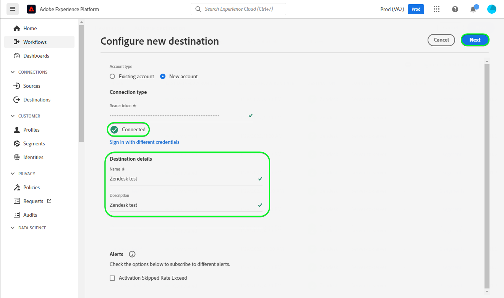

# [!DNL Zendesk]-Verbindung

[[!DNL Zendesk]](https://www.zendesk.de) ist eine Kunden-Service-Lösung und ein Vertriebswerkzeug.

Diese [!DNL Adobe Experience Platform] [Ziel](/help/destinations/home.md) nutzt die [[!DNL Zendesk] Kontakt-API](https://developer.zendesk.com/api-reference/sales-crm/resources/contacts/), um Identitäten innerhalb eines Segments als Kontakte innerhalb von zu erstellen und zu aktualisieren [!DNL Zendesk].

[!DNL Zendesk] verwendet Trägertoken als Authentifizierungsmechanismus für die Kommunikation mit dem [!DNL Zendesk] Kontaktiert die API. Anweisungen zur Authentifizierung bei Ihrer [!DNL Zendesk]-Instanz sehen Sie weiter unten im Abschnitt [Authentifizieren bei Ziel](#authenticate).

## Anwendungsbeispiele {#use-cases}

Als Marketing-Experte können Sie Ihren Benutzern personalisierte Erlebnisse auf der Basis von Attributen aus ihren Adobe Experience Platform-Profilen bereitstellen. Sie können Segmente aus Ihren Offline-Daten erstellen und diese Segmente an [!DNL Zendesk] senden, damit sie in den Feeds der Benutzer angezeigt werden, sobald Segmente und Profile in Adobe Experience Platform aktualisiert werden.

## Voraussetzungen {#prerequisites}

### Voraussetzungen für Experience Platform {#prerequisites-in-experience-platform}

Vor der Aktivierung der Daten für das [!DNL Zendesk]-Ziel müssen Sie über ein [Schema](/help/xdm/schema/composition.md), einen [Datensatz](https://experienceleague.adobe.com/docs/platform-learn/tutorials/data-ingestion/create-datasets-and-ingest-data.html?lang=de) und [Segmente](https://experienceleague.adobe.com/docs/platform-learn/tutorials/segments/create-segments.html?lang=de) verfügen, die in [!DNL Experience Platform] erstellt wurden.

Weitere Informationen finden Sie in der Experience Platform-Dokumentation für [Feldergruppe Segmentzugehörigkeitsdetails](/help/xdm/field-groups/profile/segmentation.md) , wenn Sie Anleitungen zum Segmentstatus benötigen.

### Voraussetzungen für [!DNL Zendesk] {#prerequisites-destination}

So exportieren Sie Daten von Platform in Ihre [!DNL Zendesk] -Konto, über das Sie verfügen müssen, [!DNL Zendesk] -Konto.

#### Sammeln von [!DNL Zendesk]-Anmeldeinformationen {#gather-credentials}

Beachten Sie die folgenden Elemente, bevor Sie sich bei der [!DNL Zendesk] Ziel:

| Anmeldedaten | Beschreibung | Beispiel |
| --- | --- | --- |
| `Bearer token` | Das Zugriffstoken, das Sie in Ihrer [!DNL Zendesk] -Konto.   Befolgen Sie die Dokumentation zum [generieren Sie eine [!DNL Zendesk] Zugriffstoken](https://developer.zendesk.com/documentation/sales-crm/first-call/#1-generate-an-access-token) , wenn Sie keinen haben. | `a0b1c2d3e4...v20w21x22y23z` |

## Leitplanken {#guardrails}

Die [Preis- und Preisgrenzen](https://developer.zendesk.com/api-reference/sales-crm/rate-limits/#pricing) Seitendetails [!DNL Zendesk] API-Beschränkungen für Ihr Konto. Sie müssen sicherstellen, dass Ihre Daten und Payloads innerhalb dieser Beschränkungen liegen.

## Unterstützte Identitäten {#supported-identities}

[!DNL Zendesk] unterstützt die Aktualisierung von Identitäten, die in der folgenden Tabelle beschrieben werden. Erhalten Sie weitere Informationen zu [Identitäten](/help/identity-service/namespaces.md).

| Ziel-Identität | Beispiel | Beschreibung | Obligatorisch |
|---|---|---|---|
| `email` | `test@test.com` | E-Mail-Adresse des Kontakts. | Ja |

## Exporttyp und -häufigkeit {#export-type-frequency}

Beziehen Sie sich auf die folgende Tabelle, um Informationen zu Typ und Häufigkeit des Zielexports zu erhalten.

| Element | Typ | Anmerkungen |
---------|----------|---------|
| Exporttyp | **[!UICONTROL Profilbasiert]** | <ul><li>Sie exportieren alle Mitglieder eines Segments zusammen mit den gewünschten Schemafeldern *(z. B.: E-Mail-Adresse, Telefonnummer, Nachname)*, entsprechend Ihrer Feldzuordnung.</li><li> Jeder Segmentstatus in [!DNL Zendesk] wird mit dem entsprechenden Segmentstatus von Platform aktualisiert, basierend auf dem Wert der **[!UICONTROL Zuordnungs-ID]**, der im Schritt [Segmentplanung](#schedule-segment-export-example) angegeben wurde.</li></ul> |
| Exporthäufigkeit | **[!UICONTROL Streaming]** | <ul><li>Streaming-Ziele sind „immer verfügbare“ API-basierte Verbindungen. Sobald ein Profil in Experience Platform auf der Grundlage einer Segmentbewertung aktualisiert wird, sendet der Connector das Update nachgelagert an die Zielplattform. Lesen Sie mehr über [Streaming-Ziele](/help/destinations/destination-types.md#streaming-destinations).</li></ul> |

{style="table-layout:auto"}

## Herstellen einer Verbindung mit dem Ziel {#connect}

>[!IMPORTANT]
>
>Um eine Verbindung zum Ziel herzustellen, benötigen Sie die [Zugriffsberechtigung](/help/access-control/home.md#permissions) **[!UICONTROL Ziele verwalten]**. Lesen Sie die [Zugriffskontrolle – Übersicht](/help/access-control/ui/overview.md) oder wenden Sie sich an Ihren Produktadministrator, um die erforderlichen Berechtigungen zu erhalten.

Um eine Verbindung mit diesem Ziel herzustellen, gehen Sie wie im [Tutorial zur Zielkonfiguration](../../ui/connect-destination.md) beschrieben vor. Füllen Sie im Workflow zum Konfigurieren des Ziels die Felder aus, die in den beiden folgenden Abschnitten aufgeführt sind.

Suchen Sie in **[!UICONTROL Ziele]** > **[!UICONTROL Katalog]** nach [!DNL Zendesk]. Alternativ können Sie es unter der **[!UICONTROL CRM]**-Kategorie finden.

### Beim Ziel authentifizieren {#authenticate}

Füllen Sie die erforderlichen Felder aus. Eine Anleitung dazu finden Sie im Abschnitt [ [!DNL Zendesk] Sammeln von -Anmeldeinformationen](#gather-credentials).
* **[!UICONTROL Trägertoken]**: Das Zugriffstoken, das Sie in Ihrem [!DNL Zendesk] -Konto.

Um sich beim Ziel zu authentifizieren, wählen Sie **[!UICONTROL Mit Ziel verbinden]**.

Wenn die angegebenen Details gültig sind, zeigt die Benutzeroberfläche den Status **[!UICONTROL Verbunden]** mit einem grünen Häkchen an. Sie können dann mit dem nächsten Schritt fortfahren.

### Ausfüllen der Zieldetails {#destination-details}

Füllen Sie die folgenden erforderlichen und optionalen Felder aus, um Details für das Ziel zu konfigurieren. Ein Sternchen neben einem Feld in der Benutzeroberfläche zeigt an, dass das Feld erforderlich ist.

* **[!UICONTROL Name]**: Ein Name, durch den Sie dieses Ziel in Zukunft erkennen können.
* **[!UICONTROL Beschreibung]**: Eine Beschreibung, die Ihnen hilft, dieses Ziel in Zukunft zu identifizieren.

### Aktivieren von Warnhinweisen {#enable-alerts}

Sie können Warnhinweise aktivieren, um Benachrichtigungen zum Status des Datenflusses zu Ihrem Ziel zu erhalten. Wählen Sie einen Warnhinweis aus der zu abonnierenden Liste aus, um Benachrichtigungen über den Status Ihres Datenflusses zu erhalten. Weitere Informationen zu Warnhinweisen finden Sie im Handbuch zum [Abonnieren von Zielwarnhinweisen über die Benutzeroberfläche](../../ui/alerts.md).

Wenn Sie mit dem Eingeben der Details für Ihre Zielverbindung fertig sind, klicken Sie auf **[!UICONTROL Weiter]**.

## Aktivieren von Segmenten für dieses Ziel {#activate}

>[!IMPORTANT]
>
>Um Daten zu aktivieren, benötigen Sie die [Zugriffssteuerungsberechtigungen](/help/access-control/home.md#permissions) **[!UICONTROL Ziele verwalten]**, **[!UICONTROL Ziele aktivieren]**, **[!UICONTROL Profile anzeigen]** und **[!UICONTROL Segmente anzeigen]**. Lesen Sie die [Zugriffssteuerung – Übersicht](/help/access-control/ui/overview.md) oder wenden Sie sich an Ihren Produktadministrator, um die erforderlichen Berechtigungen zu erhalten.

Anweisungen zum Aktivieren von Zielgruppensegmenten für dieses Ziel finden Sie unter [Aktivieren von Profilen und Segmenten für Streaming-Segmentexportziele](/help/destinations/ui/activate-segment-streaming-destinations.md).

### Zuordnungsüberlegungen und Beispiel {#mapping-considerations-example}

Um Ihre Zielgruppendaten ordnungsgemäß von Adobe Experience Platform an das [!DNL Zendesk]-Ziel zu senden, müssen Sie den Schritt zur Feldzuordnung durchlaufen. Die Zuordnung besteht darin, eine Verknüpfung zwischen den Schemafeldern Ihres Experience-Datenmodells (XDM) in Ihrem Platform-Konto und den jeweiligen Entsprechungen vom Ziel zu erstellen.

In der Variablen **[!UICONTROL Zielfeld]** sollte genau wie in der Tabelle der Attributzuordnungen beschrieben benannt werden, da diese Attribute den Anfragetext bilden.

In der Variablen **[!UICONTROL Quellfeld]** keine solchen Einschränkungen befolgen. Sie können sie jedoch nach Bedarf zuordnen, wenn das Datenformat beim Senden an [!DNL Zendesk] wird ein Fehler ausgegeben.

Um Ihre XDM-Felder den [!DNL Zendesk]-Zielfeldern korrekt zuzuordnen, führen Sie die folgenden Schritte aus:

1. Wählen Sie Im Schritt **[!UICONTROL Zuordnung]** die Option **[!UICONTROL Neue Zuordnung hinzufügen]** aus. Auf dem Bildschirm wird eine neue Zuordnungszeile angezeigt.
1. Im **[!UICONTROL Quellfeld auswählen]** Fenster, wählen Sie die **[!UICONTROL Attribute auswählen]** und wählen Sie das XDM-Attribut aus oder wählen Sie die **[!UICONTROL Identitäts-Namespace auswählen]** und wählen Sie eine Identität aus.
1. Im **[!UICONTROL Zielgruppenfeld auswählen]** Fenster, wählen Sie die **[!UICONTROL Identitäts-Namespace auswählen]** und wählen Sie eine Identität oder **[!UICONTROL Benutzerdefinierte Attribute auswählen]** und wählen Sie nach Bedarf ein Attribut aus.
   * Wiederholen Sie diese Schritte, um die folgenden Zuordnungen zwischen Ihrem XDM-Profilschema und Ihrem [!DNL Zendesk] instance: |Quellfeld|Zielfeld| Erforderlich| |—|—|—| |`xdm: person.name.lastName`|`Attribute: last_name`  oder `Attribute: name`| Ja | |`IdentityMap: Email`|`Identity: email`| Ja |

   * Nachfolgend finden Sie ein Beispiel für die Verwendung dieser Zuordnungen:
      

      >[!IMPORTANT]
      >
      >Die Zielfeldzuordnungen sind obligatorisch und für [!DNL Zendesk] arbeiten.
      >
      >Die Zuordnung für *Nachname* oder *Name* ist erforderlich, andernfalls wird [!DNL Zendesk] Die API reagiert nicht mit einem Fehler und übergebene Attributwerte werden ignoriert.

Wenn Sie mit der Bereitstellung der Zuordnungen für Ihre Zielverbindung fertig sind, wählen Sie **[!UICONTROL Nächste]**.

### Planen des Segmentexports und Beispiel {#schedule-segment-export-example}

Im Schritt [[!UICONTROL Planen des Segmentexports]](/help/destinations/ui/activate-segment-streaming-destinations.md#scheduling) des Aktivierungs-Workflows müssen Sie Platform-Segmente manuell dem benutzerdefinierten Feldattribut in [!DNL Zendesk] zuordnen.

Wählen Sie dazu jedes Segment aus und geben Sie dann das entsprechende benutzerdefinierte Feldattribut aus [!DNL Zendesk] im Feld **[!UICONTROL Zuordnungs-ID]** an.

Nachfolgend finden Sie ein Beispiel:

## Überprüfen des Datenexports {#exported-data}

Gehen Sie wie folgt vor, um zu überprüfen, ob Sie das Ziel korrekt eingerichtet haben:

1. Auswählen **[!UICONTROL Ziele]** > **[!UICONTROL Durchsuchen]** und navigieren Sie zur Liste der Ziele.
1. Wählen Sie als Nächstes das Ziel aus und wechseln Sie zur **[!UICONTROL Aktivierungsdaten]** und wählen Sie einen Segmentnamen aus.
   

1. Überwachen Sie die Segmentzusammenfassung und stellen Sie sicher, dass die Anzahl der Profile der Anzahl innerhalb des Segments entspricht.
   

1. Melden Sie sich bei der [!DNL Zendesk] Website und navigieren Sie dann zur **[!UICONTROL Kontakte]** -Seite, um zu überprüfen, ob die Profile aus dem Segment hinzugefügt wurden. Diese Liste kann so konfiguriert werden, dass Spalten für die zusätzlichen Felder angezeigt werden, die mit dem Segment erstellt wurden **[!UICONTROL Zuordnungs-ID]** und Segmentstatus.
   

1. Alternativ können Sie einen Drilldown in eine einzelne **[!UICONTROL Person]** und überprüfen Sie die **[!UICONTROL Zusätzliche Felder]** -Abschnitt, der den Segmentnamen und den Segmentstatus anzeigt.
   

## Datennutzung und -Governance {#data-usage-governance}

Alle [!DNL Adobe Experience Platform]-Ziele sind bei der Verarbeitung Ihrer Daten mit Datennutzungsrichtlinien konform. Ausführliche Informationen darüber, wie [!DNL Adobe Experience Platform] Data Governance erzwingt, finden Sie unter [Data Governance – Übersicht](/help/data-governance/home.md).

## Zusätzliche Ressourcen {#additional-resources}

Weitere nützliche Informationen aus der [!DNL Zendesk]Dokumentation finden Sie im Folgenden:
* [Erstmaliger Aufruf](https://developer.zendesk.com/documentation/sales-crm/first-call/)
* [Benutzerdefinierte Felder](https://developer.zendesk.com/api-reference/sales-crm/requests/#custom-fields)