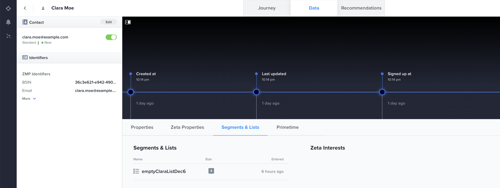

# Zeta-Marketing-Plattform {#zeta-marketing-platform}

## Übersicht {#overview}

Die Zeta Marketing Platform (ZMP) ist ein Cloud-basiertes System, das Ihnen dabei hilft, Kunden effizienter zu gewinnen, zu wachsen und zu binden, basierend auf intelligenten (proprietären Daten und KI). Weitere Informationen finden Sie unter [Zeta Global](https://zetaglobal.com/).

Mit dem in Adobe Experience Platform verfügbaren Zeta Marketing Platform-Connector können Sie Ihre Zielgruppen nahtlos von der Experience Platform mit dem ZMP synchronisieren.

>[!IMPORTANT]
>
>Der Ziel-Connector und die Dokumentationsseite werden vom *Zeta Global* Team. Bei Fragen oder Aktualisierungsanfragen wenden Sie sich bitte an das Team unter [Kontakt](https://zetaglobal.com/about/contact-us/).

## Anwendungsfälle {#use-cases}

### Erstellen von Zielgruppensegmenten {#use-case-build-audiences}

Ein Marketer möchte eindeutige Zielgruppenprofile erstellen, seine wertvollsten Segmente identifizieren und diese über alle digitalen Kanäle hinweg verwenden, die von der Zeta Marketing Platform unterstützt werden. Sie möchten eine echte 360-Grad-Ansicht eines Verbraucherprofils erstellen, aussagekräftige Zielgruppen erstellen und aktivieren. Weitere Informationen darüber, welche Kanäle die Zeta-Marketing-Plattform unterstützt, finden Sie [here](https://zetaglobal.com/platform/integrations/).

### Benutzer mit Anzeigen als Ziel auswählen {#use-case-target-users}

Ein Advertiser möchte Benutzer über die Zeta-Demand Side Platform (DSP) in bestimmten Zielgruppen ansprechen, da diese Benutzer mit ihren Marken interagieren. Für weitere Informationen über die DSP klicken Sie auf [here](https://knowledgebase.zetaglobal.com/programmatic-user-guide/).

## Voraussetzungen {#prerequisites}

### Voraussetzungen für Zeta-Marketing-Plattform

* Bevor Sie eine neue Verbindung zum Ziel der Zeta Marketing Platform herstellen, müssen Sie eine leere Kundenliste in Ihrem Zeta Marketing Platform-Konto erstellen. Sie müssen eine dieser Kundenlisten als Zielgruppe für den Empfang der Adobe Experience Platform-Zielgruppe auswählen, die Sie senden möchten. Sie können eine leere Kundenliste im ZMP erstellen, indem Sie die Anweisungen befolgen [here](https://knowledgebase.zetaglobal.com/zmp/creating-audiences#CreatingAudiences-CreatingaCustomerList).
* Obwohl die Adobe Experience Platform die Aktivierung mehrerer Zielgruppen für eine bestimmte ZMP-Zielinstanz zulässt, ist es obligatorisch, dass jede ZMP-Zielinstanz nur eine Experience Platform-Zielgruppe erhält. Um mehrere Zielgruppen aus der Experience Platform zu verarbeiten, erstellen Sie zusätzliche ZMP-Zielinstanzen für jede Zielgruppe und wählen Sie eine andere Kundenliste aus der Dropdown-Liste aus. Dieser Ansatz stellt sicher, dass die ZMP-Zielgruppen nicht überschrieben werden. Siehe [Zieldetails ausfüllen](#destination-details) für weitere Details.
* Verwenden Sie die folgenden Anmeldeinformationen, um das Ziel zu konfigurieren:
   * Benutzername: **api**
   * Kennwort: Ihr ZMP-REST-API-Schlüssel. Sie finden Ihren REST-API-Schlüssel, indem Sie sich bei Ihrem ZMP-Konto anmelden und zu **Einstellungen** > **Integrationen** > **Schlüssel und Apps** Abschnitt. Siehe [ZMP-Dokumentation](https://knowledgebase.zetaglobal.com/zmp/integrations) für weitere Details.

## Unterstützte Identitäten {#supported-identities}

[!DNL Zeta Marketing Platform] unterstützt die Aktivierung von benutzerdefinierten Benutzer-IDs, die in der folgenden Tabelle beschrieben sind. Weitere Informationen finden Sie unter [identities](/help/identity-service/features/namespaces.md).

>[!IMPORTANT]
> Für das Ziel der Zeta Marketing Platform müssen Sie einen Quell-Identitäts-Namespace dem ZMP zuordnen `uid` Zielidentität. Dies hilft der Zeta Marketing Platform, jedes Profil eindeutig zu unterscheiden.

| Ziel-Identität | Beschreibung | Zu beachten | Anmerkungen |
---------|----------|----------|----------|
| uid | Eindeutige ID, die ZMP verwendet, um Kundenprofile zu unterscheiden | Obligatorisch | Wählen Sie die `Email` Standard-Identitäts-Namespace , wenn Sie eindeutige Profile anhand ihrer E-Mail-Adressen identifizieren möchten. Alternativ können Sie Ihren benutzerdefinierten Namespace auch `uid` , wenn Kundenprofile keine E-Mail haben. |
| email_md5_id | E-Mail-MD5, die jedes Kundenprofil darstellt | Optional | Wählen Sie diese Zielidentität aus, wenn Sie Kundenprofile anhand von E-Mail-MD5-Werten eindeutig identifizieren möchten. E-Mail-Adressen müssen innerhalb der Experience Platform bereits im MD5-Format vorliegen, da die Plattform keinen Nur-Text in MD5 konvertiert. Legen Sie in diesem Szenario `uid` (erforderlich), um entweder dieselben E-Mail-MD5-Werte oder einen anderen geeigneten Identitäts-Namespace zu verwenden. |

{style="table-layout:auto"}

## Unterstützte Zielgruppen {#supported-audiences}

In diesem Abschnitt wird beschrieben, welche Zielgruppentypen Sie an dieses Ziel exportieren können.

| Audience Origin | Unterstützt | Beschreibung |
|---------|----------|----------|
| [!DNL Segmentation Service] | ✓ | Über die Experience Platform generierte Zielgruppen [Segmentierungsdienst](../../../segmentation/home.md). |
| Benutzerdefinierte Uploads | X | Zielgruppen, die aus CSV-Dateien in Experience Platform [importiert](../../../segmentation/ui/audience-portal.md#import-audience) werden. |

{style="table-layout:auto"}

>[!NOTE]
> Wenn einzelne Mitglieder der Platform-Audience hinzugefügt oder daraus entfernt werden, werden Aktualisierungen an den ZMP gesendet, um sicherzustellen, dass die Ziel-Kundenliste entsprechend synchronisiert wird.

## Exporttyp und -häufigkeit {#export-type-frequency}

Beziehen Sie sich auf die folgende Tabelle, um Informationen zu Typ und Häufigkeit des Zielexports zu erhalten.

| Element | Typ | Anmerkungen |
---------|----------|---------|
| Exporthäufigkeit | **[!UICONTROL Streaming]** | Streaming-Ziele sind „immer verfügbare“ API-basierte Verbindungen. Sobald ein Profil in Experience Platform auf der Grundlage einer Segmentauswertung aktualisiert wird, sendet der Connector das Update nachgelagert an die Zielplattform. Lesen Sie mehr über [Streaming-Ziele](/help/destinations/destination-types.md#streaming-destinations). |

{style="table-layout:auto"}

## Herstellen einer Verbindung mit dem Ziel {#connect}

>[!IMPORTANT]
> 
>Um eine Verbindung zum Ziel herzustellen, benötigen Sie die [Zugriffsberechtigung](/help/access-control/home.md#permissions) **[!UICONTROL Ziele verwalten]**. Lesen Sie die [Zugriffskontrolle – Übersicht](/help/access-control/ui/overview.md) oder wenden Sie sich an Ihren Produktadministrator, um die erforderlichen Berechtigungen zu erhalten.

Um eine Verbindung mit diesem Ziel herzustellen, gehen Sie wie im [Tutorial zur Zielkonfiguration](../../ui/connect-destination.md) beschrieben vor. Füllen Sie im Workflow zum Konfigurieren des Ziels die Felder aus, die in den beiden folgenden Abschnitten aufgeführt sind.

### Beim Ziel authentifizieren {#authenticate}

Um sich beim Ziel zu authentifizieren, füllen Sie die erforderlichen Felder aus und wählen Sie **[!UICONTROL Mit Ziel verbinden]** aus.

* **[!UICONTROL Benutzername]**: `api`
* **[!UICONTROL Passwort]**: Ihr ZMP-REST-API-Schlüssel. Sie finden Ihren REST-API-Schlüssel, indem Sie sich bei Ihrem ZMP-Konto anmelden und zu **Einstellungen** > **Integrationen** > **Schlüssel und Apps** Abschnitt. Siehe [ZMP-Dokumentation](https://knowledgebase.zetaglobal.com/zmp/integrations) für weitere Details.

### Ausfüllen der Zieldetails {#destination-details}

Füllen Sie die folgenden erforderlichen und optionalen Felder aus, um Details für das Ziel zu konfigurieren. Ein Sternchen neben einem Feld in der Benutzeroberfläche zeigt an, dass das Feld erforderlich ist.

* **[!UICONTROL Name]**: Ein Name, durch den Sie dieses Ziel in Zukunft erkennen können.
* **[!UICONTROL Beschreibung]**: Eine Beschreibung, die Ihnen hilft, dieses Ziel in Zukunft zu identifizieren.
* **[!UICONTROL ZMP-Konto-Site-ID]**: Ihr ZMP **Site-ID** an die Sie Ihre Zielgruppen senden möchten. Sie können Ihre Site-ID anzeigen, indem Sie zu **Einstellungen** > **Integrationen** > **Schlüssel und Apps** Abschnitt. Weitere Informationen finden Sie unter [here](https://knowledgebase.zetaglobal.com/zmp/integrations).
* **[!UICONTROL ZMP-Segment]**: Das Kundenlistensegment in Ihrem ZMP-Site-ID-Konto, das Sie mit der Platform-Zielgruppe aktualisieren möchten.

### Aktivieren von Warnhinweisen {#enable-alerts}

Sie können Warnhinweise aktivieren, um Benachrichtigungen zum Status des Datenflusses zu Ihrem Ziel zu erhalten. Wählen Sie einen Warnhinweis aus der zu abonnierenden Liste aus, um Benachrichtigungen über den Status Ihres Datenflusses zu erhalten. Weitere Informationen zu Warnhinweisen finden Sie im Handbuch zum [Abonnieren von Zielwarnhinweisen über die Benutzeroberfläche](../../ui/alerts.md).

Wenn Sie mit dem Eingeben der Details für Ihre Zielverbindung fertig sind, klicken Sie auf **[!UICONTROL Weiter]**.

## Aktivieren von Segmenten für dieses Ziel {#activate}

>[!IMPORTANT]
> 
>* Um Daten zu aktivieren, benötigen Sie die [Zugriffssteuerungsberechtigungen](/help/access-control/home.md#permissions) **[!UICONTROL Ziele verwalten]**, **[!UICONTROL Ziele aktivieren]**, **[!UICONTROL Profile anzeigen]** und **[!UICONTROL Segmente anzeigen]**. Lesen Sie die [Übersicht über die Zugriffskontrolle](/help/access-control/ui/overview.md) oder wenden Sie sich an Ihren Produktadministrator, um die erforderlichen Berechtigungen zu erhalten.
>* Export *identities*, benötigen Sie die **[!UICONTROL Identitätsdiagramm anzeigen]** [Zugriffsberechtigung](/help/access-control/home.md#permissions).   {width="100" zoomable="yes"}

Anweisungen zum Aktivieren von Zielgruppensegmenten für dieses Ziel finden Sie unter [Aktivieren von Profilen und Segmenten für Streaming-Segmentexportziele](/help/destinations/ui/activate-segment-streaming-destinations.md).

### Zuordnen von Attributen und Identitäten {#map}

Nachfolgend finden Sie ein Beispiel für die korrekte Identitätszuordnung beim Export von Profilen in . [!DNL Zeta Marketing Platform].

Quellfelder auswählen:
* Wählen Sie einen Quell-Identitäts-Namespace aus (benutzerdefiniert oder Standard, z. B. `Email`), das ein Profil in Adobe Experience Platform eindeutig identifiziert und [!DNL Zeta Marketing Platform].
* Wählen Sie beliebige XDM-Quellprofilattribute aus, die in die [!DNL Zeta Marketing Platform].

Zielgruppenfelder auswählen:
* (Erforderlich) Wählen Sie `uid` als Zielidentität, der Sie einen Quell-Identitäts-Namespace zuordnen.
* (Optional) Wählen Sie `email_md5_id` als Zielidentität, der Sie den Quell-Identitäts-Namespace zugeordnet haben, der E-Mail-md5-Werte darstellt. E-Mail-Adressen müssen innerhalb der Experience Platform bereits im MD5-Format vorliegen, da die Plattform keinen Normaltext in MD5 konvertiert
* Wählen Sie bei Bedarf weitere Zielgruppen-Mappings aus.

## Exportierte Daten/Datenexport validieren {#exported-data}

Eine erfolgreiche Zielgruppenaktivierung von Experience Platform an die Zeta Marketing Platform aktualisiert die Zielkundenliste im ZMP. Die Anzahl und die Beispielprofile in der Zielkundenliste entsprechen der Anzahl der Identitäten, die erfolgreich aktiviert wurden.

Alle Zielgruppenmitglieder, die über Experience Platform aktiviert wurden, werden ebenfalls unter **Zielgruppen** > **Personen** im ZMP. Sie können auch die **Kundenliste** ein Profil in der Ansicht &quot;Einzelkunde&quot;zu segmentieren, wie unten dargestellt.

## Datennutzung und -Governance {#data-usage-governance}

Alle [!DNL Adobe Experience Platform]-Ziele sind bei der Verarbeitung Ihrer Daten mit Datennutzungsrichtlinien konform. Ausführliche Informationen darüber, wie [!DNL Adobe Experience Platform] Data Governance erzwingt, finden Sie unter [Data Governance - Übersicht](/help/data-governance/home.md).

## Zusätzliche Ressourcen {#additional-resources}

* [Zeta-Wissensdatenbank](https://knowledgebase.zetaglobal.com/zmp/)
