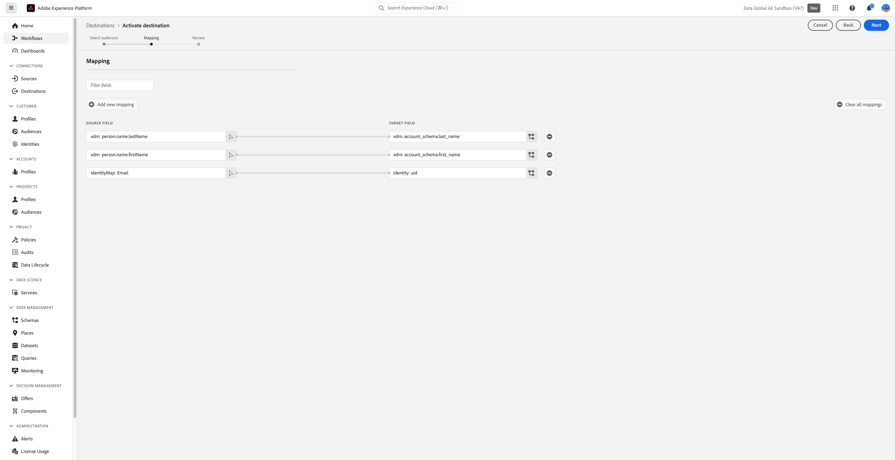

# Zeta-Marketing-Plattform {#zeta-marketing-platform}

## Überblick {#overview}

Die Zeta Marketing Platform (ZMP) ist ein Cloud-basiertes System, mit dem Sie Kunden effizienter gewinnen, wachsen und halten können, basierend auf Intelligenz (proprietäre Daten und KI). Weitere Informationen finden Sie unter [Zeta Global](https://zetaglobal.com/).

Mit dem in [!DNL Adobe Experience Platform] verfügbaren Zeta Marketing Platform-Connector können Sie Ihre Zielgruppen von Experience Platform nahtlos mit der ZMP synchronisieren.

>[!IMPORTANT]
>
>Der Ziel-Connector und die Dokumentationsseite werden vom Team *Zeta Global* erstellt und gepflegt. Bei Fragen oder Aktualisierungsanfragen wenden Sie sich bitte an das Team unter [Kontakt](https://zetaglobal.com/about/contact-us/).

## Anwendungsfälle {#use-cases}

### Erstellen von Zielgruppensegmenten {#use-case-build-audiences}

Ein Marketing-Experte möchte einzigartige Zielgruppenprofile erstellen, deren wertvollste Segmente identifizieren und diese über alle digitalen Kanäle hinweg nutzen, die die Zeta-Marketing-Plattform unterstützt. Sie möchten eine echte 360-Grad-Ansicht eines Verbraucherprofils erstellen, aussagekräftige Zielgruppen erstellen und aktivieren. Weitere Informationen zu den von der Zeta Marketing-Plattform unterstützten Kanälen finden Sie [hier](https://zetaglobal.com/platform/integrations/).

### Targeting von Benutzern mit Anzeigen {#use-case-target-users}

Ein Werbetreibender zielt darauf ab, Benutzende innerhalb bestimmter Zielgruppen über die Zeta Demand Side Platform (DSP) anzusprechen, da diese Benutzenden mit ihren Marken interagieren. Für weitere Informationen über die Zeta DSP klicken Sie [hier](https://knowledgebase.zetaglobal.com/pug/).

## Voraussetzungen {#prerequisites}

### Voraussetzungen für die Zeta-Marketing-Plattform {#zmp-prerequisites}

* Bevor Sie eine neue Verbindung zum Zeta Marketing Platform-Ziel einrichten, müssen Sie in Ihrem Zeta Marketing Platform-Konto eine leere Kundenliste erstellen. Sie müssen eine dieser Kundenlisten als Zielgruppe auswählen, um die [!DNL Adobe Experience Platform] Zielgruppe zu erhalten, die Sie senden möchten. Sie können in der ZMP eine leere Kundenliste erstellen, indem Sie den Anweisungen [hier](https://knowledgebase.zetaglobal.com/kb/creating-audiences#CreatingAudiences-CreatingaCustomerList) folgen.
* Obwohl die [!DNL Adobe Experience Platform] die Aktivierung mehrerer Zielgruppen für eine bestimmte ZMP-Zielinstanz zulässt, ist es obligatorisch, dass jede ZMP-Zielinstanz nur eine Experience Platform-Zielgruppe erhält. Um mehrere Zielgruppen aus der Experience Platform zu verarbeiten, erstellen Sie für jede Zielgruppe zusätzliche ZMP-Zielinstanzen und wählen Sie aus der Dropdown-Liste eine andere Kundenliste aus. Dadurch wird sichergestellt, dass die Ziel-ZMP-Zielgruppen nicht überschrieben werden. Weitere [&#x200B; finden Sie unter „Ausfüllen &#x200B;](#destination-details) Zieldetails“.
* Verwenden Sie die folgenden Anmeldeinformationen, um das Ziel zu konfigurieren:
   * Benutzername: **api**
   * Kennwort: Ihr ZMP REST API-Schlüssel. Sie können Ihren REST-API-Schlüssel finden, indem Sie sich bei Ihrem ZMP-Konto anmelden und zum Abschnitt **Einstellungen** > **Integrationen** > **Schlüssel und Anwendungen** navigieren. Weitere Informationen finden [&#x200B; in der &#x200B;](https://knowledgebase.zetaglobal.com/kb/integrations)ZMP-Dokumentation“.

## Unterstützte Identitäten {#supported-identities}

[!DNL Zeta Marketing Platform] unterstützt die Aktivierung benutzerdefinierter Benutzer-IDs, die in der folgenden Tabelle beschrieben werden. Weitere Informationen finden Sie unter [Identitäten](/help/identity-service/features/namespaces.md).

>[!IMPORTANT]
>
> Das Ziel der Zeta Marketing Platform erfordert die Zuordnung eines Quell-Identity-Namespace zur ZMP `uid` Zielidentität. Dies hilft der Zeta Marketing-Plattform, jedes Profil eindeutig zu unterscheiden.

| Ziel-Identität | Beschreibung | Zu beachten | Anmerkungen |
|---------|----------|----------|----------|
| UID | Eindeutige ID, die ZMP verwendet, um Kundenprofile zu unterscheiden | Obligatorisch | Wählen Sie den `Email` Standard-Identity-Namespace aus, wenn Sie eindeutige Profile anhand ihrer E-Mail-Adressen identifizieren möchten. Alternativ können Sie auch festlegen, dass Ihr benutzerdefinierter Namespace `uid` zugeordnet wird, wenn Kundenprofile keine E-Mail haben. |
| email_md5_id | E-Mail-MD5-Hashs, die die einzelnen Kundenprofile darstellen | Optional | Wählen Sie diese Zielidentität aus, wenn Sie Kundenprofile anhand von E-Mail-MD5-Werten eindeutig identifizieren möchten. Es ist wichtig, dass E-Mail-Adressen innerhalb der Experience Platform bereits im MD5-Format vorliegen, da die Experience Platform keinen einfachen Text in MD5 konvertiert. Legen Sie in diesem Szenario `uid` (obligatorisch) auf dieselben E-Mail-MD5-Werte oder einen anderen geeigneten Identity-Namespace fest. |

{style="table-layout:auto"}

## Unterstützte Zielgruppen {#supported-audiences}

In diesem Abschnitt wird beschrieben, welche Art von Zielgruppen Sie an dieses Ziel exportieren können.

| Zielgruppenherkunft | Unterstützt | Beschreibung |
|---------|----------|----------|
| [!DNL Segmentation Service] | Ja | Zielgruppen, die über den Experience Platform-[&#x200B; (Segmentierungs-Service) generiert &#x200B;](../../../segmentation/home.md). |
| Alle anderen Ursprünge der Zielgruppe | Nein | Diese Kategorie enthält alle Ursprünge der Zielgruppe außerhalb der Zielgruppen, die durch die [!DNL Segmentation Service] generiert wurden. Lesen Sie mehr über [verschiedene Ursprünge von Audiences](/help/segmentation/ui/audience-portal.md#customize). Einige Beispiele: <ul><li> benutzerdefinierte Upload-Zielgruppen [importiert](../../../segmentation/ui/audience-portal.md#import-audience) aus CSV-Dateien in Experience Platform,</li><li> Lookalike-Zielgruppen, </li><li> Federated Audiences, </li><li> Zielgruppen, die in anderen Experience Platform-Apps generiert werden, z. B. [!DNL Adobe Journey Optimizer], </li><li> und mehr. </li></ul> |

{style="table-layout:auto"}

>[!NOTE]
>
> Wenn einzelne Mitglieder zur Experience Platform-Zielgruppe hinzugefügt oder daraus entfernt werden, werden Aktualisierungen an die ZMP gesendet, um sicherzustellen, dass die Ziel-Kundenliste entsprechend synchronisiert wird.

## Exporttyp und -häufigkeit {#export-type-frequency}

Beziehen Sie sich auf die folgende Tabelle, um Informationen zu Typ und Häufigkeit des Zielexports zu erhalten.

| Element | Typ | Anmerkungen |
|---------|----------|---------|
| Exporthäufigkeit | **[!UICONTROL Streaming]** | Streaming-Ziele sind „immer verfügbare“ API-basierte Verbindungen. Sobald ein Profil in Experience Platform auf der Grundlage einer Segmentauswertung aktualisiert wird, sendet der Connector das Update nachgelagert an die Zielplattform. Lesen Sie mehr über [Streaming-Ziele](/help/destinations/destination-types.md#streaming-destinations). |

{style="table-layout:auto"}

Unterstützte Zielgruppen nach Zielgruppen-Datentyp:

| Datentyp der Zielgruppe | Unterstützt | Beschreibung | Anwendungsfälle |
|--------------------|-----------|-------------|-----------|
| [Personen-Zielgruppen](/help/segmentation/types/people-audiences.md) | Ja | Basierend auf Kundenprofilen können Sie bestimmte Personengruppen für Marketing-Kampagnen ansprechen. | Häufige Käufer, Warenkorbabbrüche |
| [Konto-Zielgruppen](/help/segmentation/types/account-audiences.md) | Nein | Targeting von Personen in bestimmten Organisationen für Account-basierte Marketing-Strategien. | B2B-Marketing |
| [Interessenten-Zielgruppen](/help/segmentation/types/prospect-audiences.md) | Nein | Targeting von Personen, die noch keine Kunden sind, aber Merkmale mit Ihrer Zielgruppe teilen. | Akquise mit Drittanbieterdaten |
| [Datensatzexporte](/help/catalog/datasets/overview.md) | Nein | Sammlungen strukturierter Daten, die im Data Lake von [!DNL Adobe Experience Platform] gespeichert sind. | Reporting, Datenwissenschaft-Workflows |

{style="table-layout:auto"}

## Herstellen einer Verbindung mit dem Ziel {#connect}

>[!IMPORTANT]
>
>Um eine Verbindung zum Ziel herzustellen, benötigen Sie die **[!UICONTROL Manage Destinations]** [Zugriffssteuerungsberechtigung](/help/access-control/home.md#permissions). Lesen Sie die [Zugriffskontrolle – Übersicht](/help/access-control/ui/overview.md) oder wenden Sie sich an Ihren Produktadministrator, um die erforderlichen Berechtigungen zu erhalten.

Um eine Verbindung mit diesem Ziel herzustellen, gehen Sie wie im [Tutorial zur Zielkonfiguration](../../ui/connect-destination.md) beschrieben vor. Füllen Sie im Workflow zum Konfigurieren des Ziels die Felder aus, die in den beiden folgenden Abschnitten aufgeführt sind.

### Beim Ziel authentifizieren {#authenticate}

Um sich beim Ziel zu authentifizieren, füllen Sie die erforderlichen Felder aus und wählen Sie **[!UICONTROL Connect to destination]** aus.

* **[!UICONTROL Username]**: `api`
* **[!UICONTROL Password]**: Ihr ZMP REST API-Schlüssel. Sie können Ihren REST-API-Schlüssel finden, indem Sie sich bei Ihrem ZMP-Konto anmelden und zum Abschnitt **Einstellungen** > **Integrationen** > **Schlüssel und Anwendungen** navigieren. Weitere Informationen finden [&#x200B; in der &#x200B;](https://knowledgebase.zetaglobal.com/kb/integrations)ZMP-Dokumentation“.

### Ausfüllen der Zieldetails {#destination-details}

Füllen Sie die folgenden erforderlichen und optionalen Felder aus, um Details für das Ziel zu konfigurieren. Ein Sternchen neben einem Feld in der Benutzeroberfläche zeigt an, dass das Feld erforderlich ist.

* **[!UICONTROL Name]**: Ein Name, durch den Sie dieses Ziel in Zukunft erkennen können.
* **[!UICONTROL Description]**: Eine Beschreibung, die Ihnen hilft, dieses Ziel in Zukunft zu identifizieren.
* **[!UICONTROL ZMP Account Site Id]**: Ihre ZMP **Site-ID**, an die Sie Ihre Zielgruppen senden möchten. Sie können Ihre Site-ID anzeigen, indem Sie zum Abschnitt **Einstellungen** > **Integrationen** > **Schlüssel und Anwendungen** navigieren. Weitere Informationen finden Sie [hier](https://knowledgebase.zetaglobal.com/kb/integrations).
* **[!UICONTROL ZMP Segment]**: Das Kundenlistensegment in Ihrem ZMP Site ID-Konto, das mit der Experience Platform-Zielgruppe aktualisiert werden soll.

### Aktivieren von Warnhinweisen {#enable-alerts}

Sie können Warnhinweise aktivieren, um Benachrichtigungen zum Status des Datenflusses zu Ihrem Ziel zu erhalten. Wählen Sie einen Warnhinweis aus der zu abonnierenden Liste aus, um Benachrichtigungen über den Status Ihres Datenflusses zu erhalten. Weitere Informationen zu Warnhinweisen finden Sie im Handbuch zum [Abonnieren von Zielwarnhinweisen über die Benutzeroberfläche](../../ui/alerts.md).

Wenn Sie mit dem Eingeben der Details für Ihre Zielverbindung fertig sind, wählen Sie **[!UICONTROL Next]** aus.

## Aktivieren von Zielgruppen für dieses Ziel {#activate}

>[!IMPORTANT]
>
>* Zum Aktivieren von Daten benötigen Sie die **[!UICONTROL Manage Destinations]**, **[!UICONTROL Activate Destinations]**, **[!UICONTROL View Profiles]** und **[!UICONTROL View Segments]** [Zugriffssteuerungsberechtigungen](/help/access-control/home.md#permissions). Lesen Sie die [Übersicht über die Zugriffssteuerung](/help/access-control/ui/overview.md) oder wenden Sie sich an Ihre Produktadmins, um die erforderlichen Berechtigungen zu erhalten.
>* Zum Exportieren *Identitäten* benötigen Sie die **[!UICONTROL View Identity Graph]** Zugriffssteuerungsberechtigung[&#x200B; &#x200B;](/help/access-control/home.md#permissions).   {width="100" zoomable="yes"}

Anweisungen [&#x200B; Aktivieren von Zielgruppen für dieses Ziel finden &#x200B;](/help/destinations/ui/activate-segment-streaming-destinations.md) unter Aktivieren von Zielgruppen für Streaming-Ziele .

### Zuordnen von Attributen und Identitäten {#map}

Nachfolgend finden Sie ein Beispiel für die korrekte Identitätszuordnung beim Exportieren von Profilen in [!DNL Zeta Marketing Platform].

Auswahl der Quellfelder:

* Wählen Sie einen Quell-Identity-Namespace aus (benutzerdefiniert oder Standard, z. B. `Email`), der ein Profil in [!DNL Adobe Experience Platform] und [!DNL Zeta Marketing Platform] eindeutig identifiziert.
* Wählen Sie alle XDM-Quellprofilattribute aus, die in den [!DNL Zeta Marketing Platform] exportiert und aktualisiert werden müssen.

Auswählen der Zielfelder:

* (Obligatorisch) Wählen Sie `uid` als Zielidentität aus, der Sie einen Quell-Identity-Namespace zuordnen.
* (Optional) Wählen Sie `email_md5_id` als Zielidentität aus, der Sie den Quell-Identity-Namespace zugeordnet haben, der E-Mail-MD5-Werte darstellt. Es ist wichtig, dass E-Mail-Adressen innerhalb der Experience Platform bereits im MD5-Format vorliegen, da die Experience Platform keinen einfachen Text in MD5 konvertiert
* Wählen Sie bei Bedarf zusätzliche Zielgruppen-Mappings aus.

## Exportierte Daten/Datenexport validieren {#exported-data}

Bei einer erfolgreichen Zielgruppenaktivierung von Experience Platform auf die Zeta-Marketing-Plattform wird die Zielkundenliste in der ZMP aktualisiert. Die Anzahl und die Beispielprofile in der Zielkundenliste entsprechen der Anzahl der Identitäten, die erfolgreich aktiviert wurden.

Jedes Zielgruppenmitglied, das von Experience Platform aktiviert wurde, wird auch unter **Zielgruppen** > **Personen** in der ZMP angezeigt. Sie können auch das Segment **Kundenliste), zu** ein Profil gehört, in der Einzelkundenansicht anzeigen, wie unten dargestellt.

## Datennutzung und -Governance {#data-usage-governance}

Alle [!DNL Adobe Experience Platform]-Ziele sind bei der Verarbeitung Ihrer Daten mit Datennutzungsrichtlinien konform. Ausführliche Informationen darüber, wie [!DNL Adobe Experience Platform] Data Governance erzwingt, finden Sie unter [Data Governance - Übersicht](/help/data-governance/home.md).

## Weitere Ressourcen {#additional-resources}

* [Zeta-Wissensdatenbank](https://knowledgebase.zetaglobal.com/kb/)
