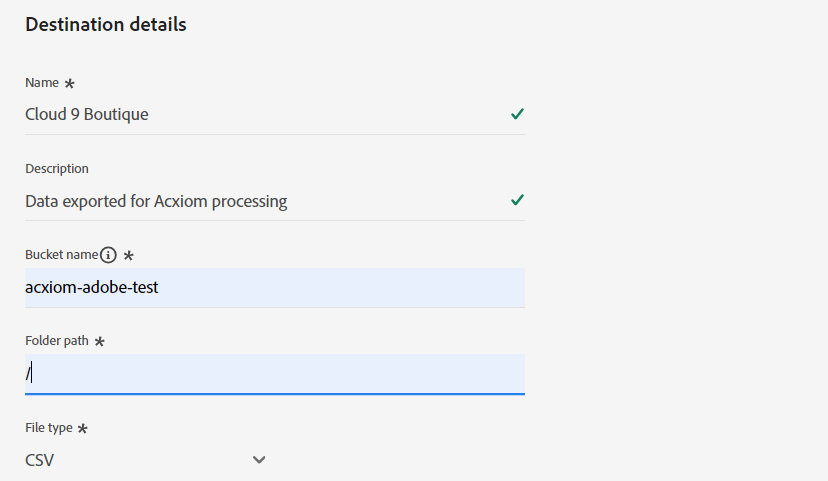

# [!DNL Acxiom Data Enhancement] Zielverbindung

>[!NOTE]
>
>Die [!DNL Acxiom Data Enhancement] Das Ziel befindet sich in der Beta-Phase.  Diese Ziel-Connector- und Dokumentationsseite werden vom Acxiom-Team erstellt und gepflegt. Bei Fragen oder Aktualisierungsanfragen wenden Sie sich bitte direkt an acxiom-adobe-help@acxiom.com.

## Übersicht {#overview}

Verwenden Sie den Acxiom Data Enhancement Connector, um Ihren Adobe-Profilen zusätzliche beschreibende Daten zur Verfügung zu stellen, die in Analyse-, Segmentierungs- und Targeting-Anwendungen verwendet werden können. Hunderte von verfügbaren Elementen ermöglichen es Benutzern, Daten besser zu segmentieren und zu modellieren, was zu einer präziseren Zielgruppenbestimmung und prädiktiven Modellierung führt.

In diesem Tutorial werden Schritte zum Erstellen eines [!DNL Acxiom Data Enhancement] Zielverbindung und Datenfluss über die Adobe Experience Platform-Benutzeroberfläche.  Dieser Connector wird verwendet, um Daten mithilfe von Amazon S3 als Ablagepunkt an den Acxiom Enhancement Service zu übermitteln.

## Anwendungsfälle {#use-cases}

Hier finden Sie Beispielanwendungsfälle, die Adobe Experience Platform-Kunden mithilfe dieses Ziels lösen können, um besser zu verstehen, wie und wann Sie das Acxiom Data Enhancement-Ziel verwenden sollten.

### Kundendaten verbessern {#enhance-customer-data}

Dieser Connector sollte von Marketingfachleuten verwendet werden, die die Effektivität ihrer Zielgruppenstrategien steigern, indem sie ausgewählte beschreibende Elemente an ihre Adobe-Profile anhängen und diese zur gezielteren Ausrichtung von-Kampagnen verwenden.

Als Marketing-Experte möchten Sie beispielsweise Ihr Verständnis für Ihre bestehenden Zielgruppen vertiefen, indem Sie deren Profile mit zusätzlichen Daten anreichern. Dadurch werden Ihre Segmentierungs- und Targeting-Strategien verbessert, was zu einer Steigerung der Kampagnenpersonalisierung und -konvertierung führt.

Der Anwendungsfall wird über eine Kombination aus Ziel- und Quell-Connectoren ausgeführt.

Exportieren Sie zunächst Ihre vorhandenen Kundendatensätze zur Anreicherung mithilfe dieses Ziel-Connectors. Der Dienst von Acxiom würde nach der Datei suchen, sie abrufen, sie mit Acxiom-Daten anreichern und eine Datei generieren.

Der Kunde würde dann die entsprechende Acxiom-Datenaufnahme-Quellkarte verwenden, um die hydrierten Kundenprofile wieder in Adobe Real-Time CDP aufzunehmen.

## Voraussetzungen {#prerequisites}

>[!IMPORTANT]
>
>* Um eine Verbindung zum Ziel herzustellen, benötigen Sie die **[!UICONTROL Ziele anzeigen]** und **[!UICONTROL Ziele verwalten]**, **[!UICONTROL Ziele aktivieren]**, **[!UICONTROL Anzeigen von Profilen]**, und **[!UICONTROL Segmente anzeigen]** [Zugriffssteuerungsberechtigungen](/help/access-control/home.md#permissions). Lesen Sie die [Übersicht über die Zugriffssteuerung](/help/access-control/ui/overview.md) oder wenden Sie sich an Ihre Produktadmins, um die erforderlichen Berechtigungen zu erhalten.
>* Export *identities*, benötigen Sie die **[!UICONTROL Identitätsdiagramm anzeigen]** [Zugriffsberechtigung](/help/access-control/home.md#permissions).   {width="100" zoomable="yes"}

## Unterstützte Zielgruppen {#supported-audiences}

In diesem Abschnitt wird beschrieben, welche Zielgruppentypen Sie an dieses Ziel exportieren können.

| Audience Origin | Unterstützt | Beschreibung |
|-----------------------------|-----------|---------------------------------------------------------------------------------------------------------------------|
| [!DNL Segmentation Service] | ✓ | Über die Experience Platform generierte Zielgruppen [Segmentierungsdienst](../../../segmentation/home.md). |
| Benutzerdefinierte Uploads | x | Zielgruppen, die aus CSV-Dateien in Experience Platform [importiert](../../../segmentation/ui/overview.md#import-audience) werden. |

{style="table-layout:auto"}

## Exporttyp und -häufigkeit {#export-type-frequency}

Beziehen Sie sich auf die folgende Tabelle, um Informationen zu Typ und Häufigkeit des Zielexports zu erhalten.

| Element | Typ | Anmerkungen |
|------------------|--------------------------------|------------------------------------------------------------------------------------------------------------------------------------------------------------------------------------------------------------------------------------------------------------------------------------------------------------------------|
| Exporttyp | **[!UICONTROL Profilbasiert]** | Sie exportieren alle Mitglieder eines Segments zusammen mit den gewünschten Schemafeldern (z. B. E-Mail-Adresse, Telefonnummer, Nachname), wie im Bildschirm „Auswählen der Profilattribute“ im [Zielaktivierungs-Workflow](/help/destinations/ui/activate-batch-profile-destinations.md#select-attributes) festgelegt. |
| Exporthäufigkeit | **[!UICONTROL Batch]** | Batch-Ziele exportieren Dateien in Schritten von drei, sechs, acht, zwölf oder vierundzwanzig Stunden auf nachgelagerte Plattformen. Weitere Informationen finden Sie unter [Batch-Datei-basierte Ziele](/help/destinations/destination-types.md#file-based). |

{style="table-layout:auto"}

## Herstellen einer Verbindung mit dem Ziel {#connect}

>[!IMPORTANT]
>
>Um eine Verbindung zum Ziel herzustellen, benötigen Sie die **[!UICONTROL Ziele anzeigen]** und **[!UICONTROL Verwalten und Aktivieren von Datensatzzielen]** [Zugriffssteuerungsberechtigungen](/help/access-control/home.md#permissions). Lesen Sie die [Übersicht über die Zugriffssteuerung](/help/access-control/ui/overview.md) oder wenden Sie sich an Ihre Produktadmins, um die erforderlichen Berechtigungen zu erhalten.

### Beim Ziel authentifizieren {#authenticate}

Um sich beim Ziel zu authentifizieren, füllen Sie die erforderlichen Felder aus und wählen Sie **[!UICONTROL Mit Ziel verbinden]** aus.

Um auf Ihren Bucket auf dem Experience Platform zuzugreifen, müssen Sie gültige Werte für die folgenden Anmeldedaten angeben:

| Anmeldedaten | Beschreibung |
|---------------|----------------------------------------------------------------------------------------------------------|
| S3-Zugriffsschlüssel | Die Zugriffsschlüssel-ID für Ihren Behälter. Sie können diesen Wert aus dem [!DNL Acxiom] Team. |
| S3-Geheimschlüssel | Die geheime Schlüssel-ID für Ihren Bucket. Sie können diesen Wert aus dem [!DNL Acxiom] Team. |
| Behältername | Dies ist Ihr Bucket, in dem Dateien freigegeben werden. Sie können diesen Wert aus dem [!DNL Acxiom] Team. |

### Neues Konto

So definieren Sie einen neuen Acxiom Managed S3-Speicherort:

### Vorhandenes Konto

Konten, die bereits mit der Karte &quot;Acxiom Data Enhancement&quot;definiert wurden, werden in einem Listen-Popup angezeigt und erhalten bei Auswahl Details zum Konto.  Dies wird unten im Beispiel der Benutzeroberfläche angezeigt, wenn Sie zu **Ziele** > **Konten**;

### Ausfüllen der Zieldetails {#destination-details}

Füllen Sie die folgenden erforderlichen und optionalen Felder aus, um Details für das Ziel zu konfigurieren. Ein Sternchen neben einem Feld in der Benutzeroberfläche zeigt an, dass das Feld erforderlich ist.

* **Name (erforderlich)** - Der Name, unter dem das Ziel gespeichert wird
* **Beschreibung** - Kurze Erläuterung des Ziels des Bestimmungsorts
* **Behältername (erforderlich)** - Name des auf S3 eingerichteten Amazon S3-Buckets
* **Ordnerpfad (erforderlich)** - Wenn Unterverzeichnisse in einem Behälter verwendet werden, muss ein Pfad definiert werden, oder &quot;/&quot;, um auf den Stammpfad zu verweisen.
* **Dateityp** - Wählen Sie das Format aus, das Experience Platform für die exportierten Dateien verwenden soll. Derzeit erwartet die Acxiom-Verarbeitung nur den Dateityp CSV

>[!IMPORTANT]
>
>Bei Auswahl der CSV-Option *Trennzeichen*, *Anführungszeichen*, *Escape-Zeichen*, *Leerer Wert*, *Nullwert*, *Komprimierungsformat*, und *Manifestdatei einschließen* Optionen angezeigt werden, werden diese Einstellungen im folgenden Dokument ausführlicher erläutert [Formatierungsoptionen konfigurieren](../../ui/batch-destinations-file-formatting-options.md).

### Aktivieren von Warnhinweisen {#enable-alerts}

Sie können Warnhinweise aktivieren, um Benachrichtigungen zum Status des Datenflusses zu Ihrem Ziel zu erhalten. Wählen Sie einen Warnhinweis aus der zu abonnierenden Liste aus, um Benachrichtigungen über den Status Ihres Datenflusses zu erhalten. Weitere Informationen zu Warnhinweisen finden Sie im Handbuch zum [Abonnieren von Zielwarnhinweisen über die Benutzeroberfläche](../../ui/alerts.md).

Wenn Sie alle Details für Ihre Zielverbindung eingegeben haben, klicken Sie auf **[!UICONTROL Weiter]**.

## Aktivieren von Zielgruppen für dieses Ziel {#activate}

>[!IMPORTANT]
>
>* Um Daten zu aktivieren, benötigen Sie die **[!UICONTROL Ziele anzeigen]**, **[!UICONTROL Ziele aktivieren]**, **[!UICONTROL Anzeigen von Profilen]**, und **[!UICONTROL Segmente anzeigen]** [Zugriffssteuerungsberechtigungen](/help/access-control/home.md#permissions). Lesen Sie die [Übersicht über die Zugriffssteuerung](/help/access-control/ui/overview.md) oder wenden Sie sich an Ihre Produktadmins, um die erforderlichen Berechtigungen zu erhalten.
>* Export *identities*, benötigen Sie die **[!UICONTROL Identitätsdiagramm anzeigen]** [Zugriffsberechtigung](/help/access-control/home.md#permissions).   {width="100" zoomable="yes"}

Anweisungen zum Aktivieren von Zielgruppen für dieses Ziel finden Sie unter [Aktivieren von Zielgruppendaten für Batch-Profil-Exportziele](/help/destinations/ui/activate-batch-profile-destinations.md).

### Vorschläge zuordnen

Für die korrekte Verarbeitung von Dateien auf der Seite &quot;Acxiom&quot;sind Name- und Adresselemente erforderlich. Auch wenn nicht alle Elemente erforderlich sind, hilft eine möglichst umfassende Bereitstellung bei der erfolgreichen Zuordnung.

Zuordnungsvorschläge finden Sie in der folgenden Tabelle, in der Attribute auf Ihrer Zielseite aufgelistet werden, die von der Acxiom-Verarbeitung verwendet werden und denen Kunden Profilattribute zuordnen können. Behandeln Sie diese Elemente als Vorschläge, da nicht alle Elemente erforderlich sind und die Quellwerte von den Anforderungen des Kontos abhängen.

| Zielfeld | Quellbeschreibung |
|--------------|-------------------------------------------------------------|
| name | Der Wert person.name.fullName in Experience Platform. |
| firstName | Der Wert person.name.firstName in Experience Platform. |
| lastName | Der Wert person.name.lastName in Experience Platform. |
| address1 | Der Wert mailingAddress.street1 in Experience Platform. |
| address2 | Der Wert mailingAddress.street2 in Experience Platform. |
| city | Der Wert mailingAddress.city in Experience Platform. |
| state | Der Wert &quot;mailingAddress.state&quot;in Experience Platform. |
| zip | Der mailingAddress.postalCode -Wert in Experience Platform. |

>[!NOTE]
>
>Wenn Sie zusätzliche Felder zuordnen, die oben nicht im Datenfluss aufgeführt sind, werden diese im Datenexport einbezogen, aber von der Acxiom-Verarbeitung ignoriert.

## Überprüfen des Datenexports {#exported-data}

Um festzustellen, ob die Daten erfolgreich exportiert wurden, überprüfen Sie Ihren [!DNL Amazon S3 Storage]-Behälter und stellen Sie sicher, dass die exportierten Dateien die erwarteten Profilpopulationen enthalten.

## Nächste Schritte

In diesem Tutorial haben Sie erfolgreich einen Datenfluss erstellt, um Profildaten von Experience Platform in Ihre [!DNL Acxiom] verwalteter S3-Speicherort. Als Nächstes müssen Sie sich an Ihren Acxiom-Support-Mitarbeiter mit dem Namen des Kontos, den Dateinamen und dem Behälterpfad wenden, damit die Verarbeitung eingerichtet werden kann.

## Datennutzung und -Governance {#data-usage-governance}

Alle [!DNL Adobe Experience Platform]-Ziele sind bei der Verarbeitung Ihrer Daten mit Datennutzungsrichtlinien konform. Ausführliche Informationen darüber, wie [!DNL Adobe Experience Platform] Data Governance erzwingt, finden Sie unter [Data Governance - Übersicht](/help/data-governance/home.md).

## Zusätzliche Ressourcen {#additional-resources}

*Acxiom Infobase:* https://www.acxiom.com/wp-content/uploads/2022/02/fs-acxiom-infobase_AC-0268-22.pdf
