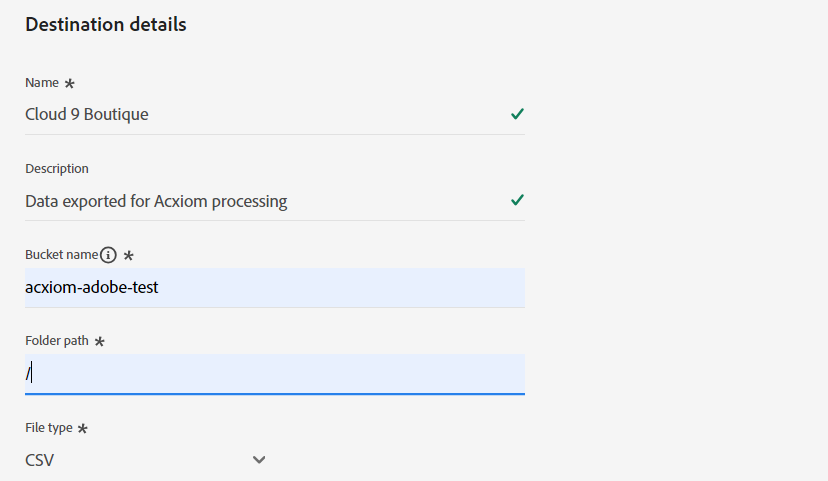

# [!DNL Acxiom Prospect-Suppression] Zielverbindung

>[!NOTE]
>
>Das Ziel [!DNL Acxiom Prospect-Suppression] befindet sich in der Beta-Phase. Diese Ziel-Connector- und Dokumentationsseite werden vom Acxiom-Team erstellt und gepflegt. Bei Fragen oder Aktualisierungsanfragen wenden Sie sich bitte direkt an acxiom-adobe-help@acxiom.com.

## Übersicht {#overview}

Verwenden Sie [!DNL Acxiom Prospect-Suppression], um die produktivsten potenziellen Zielgruppen bereitzustellen. Dieser Connector exportiert Erstanbieterdaten sicher aus Real-time Customer Data Platform und führt sie durch eine preisgekrönte Hygiene- und Identitätsauflösung, die eine Datendatei zur Verwendung als Unterdrückungsliste erzeugt. Dies wird mit der [!DNL Acxiom Global] -Datenbank abgeglichen, die es ermöglicht, die Interessenslisten für den Import anzupassen. Verwenden Sie dann den Quell-Connector &quot;[[!DNL Acxiom Prospecting Data Import]](/help/sources/connectors/data-partners/acxiom-prospecting-data-import.md)&quot;, um Listen von Acxiom wieder in Real-Time CDP aufzuspüren, wobei Ihre bekannten oder konvertierten Kunden entfernt sind.

Acxiom bietet die leistungsstärksten Zielgruppen der Branche mit dem größten Katalog von über 12.000 globalen Datenattributen, die speziell auf die Bereitstellung personalisierter Erlebnisse ausgerichtet sind. Tippen Sie auf unbegrenzte Kombinationen aus hochwertigen Daten, um Zielgruppen zu erstellen und zu verteilen, um spezifischen Kampagnenanforderungen gerecht zu werden.

In diesem Tutorial werden Schritte zum Erstellen einer [!DNL Acxiom Prospect-Suppression] -Zielverbindung und eines Datenflusses mithilfe der Adobe Experience Platform-Benutzeroberfläche beschrieben. Dieser Connector wird verwendet, um Daten mithilfe von Amazon S3 als Ablagepunkt an den potenziellen Acxiom-Dienst zu senden. Wenden Sie sich an Ihren Acxiom-Kundenbetreuer, sobald Sie mit dem Export von Dateien in die Amazon S3-Dropdown-Liste beginnen.

## Anwendungsfälle {#use-cases}

Um Ihnen zu helfen, besser zu verstehen, wie und wann Sie das [!DNL Acxiom Prospect-Suppression]-Ziel verwenden sollten, finden Sie hier Beispielanwendungsfälle, die Adobe Experience Platform-Kunden mit diesem Ziel lösen können.

### Erstellen einer Unterdrückungsliste für die Anzeige von Datensätzen {#create-suppression-list}

Marketing-Experten, die die Effektivität ihrer Outreach-Strategien steigern möchten, setzen häufig die Erstellung einer Unterdrückungsliste ein. Diese Liste umfasst bestehende Kunden und spezifische Segmente, die sicherstellen, dass sie während gezielter Kampagnen von Interessenten-Aktivitäten ausgeschlossen werden. Dieser strategische Ansatz hilft bei der Verfeinerung der Zielgruppe, vermeidet redundante Kommunikation und trägt zu gezielteren und effizienteren Marketing-Maßnahmen bei.

Als Marketing-Experte können Sie beispielsweise Ihre Kampagnenreichweite erweitern, indem Sie Ihren Kampagnen zielgerichtete Interessenten-Profile hinzufügen, die auf von Ihnen bereitgestellten Segmentierungs- und Unterdrückungskriterien basieren.

Der Anwendungsfall wird über eine Kombination aus Ziel- und Quell-Connectoren ausgeführt.

Zunächst würden Sie Ihre vorhandenen Kundenprofile mithilfe dieses Ziel-Connectors exportieren, um sie als Unterdrückungsdatei zu verwenden. Dadurch wird sichergestellt, dass keine vorhandenen Kundendatensätze einbezogen werden.

Der Dienst von Acxiom sucht nach der Datei, ruft sie ab und verwendet sie zusammen mit zusätzlichen Auswahlkriterien und generiert eine Prospektdatei. Anschließend verwenden Sie den entsprechenden Quell-Connector [[!DNL Acxiom Prospecting Data Import]](/help/sources/connectors/data-partners/acxiom-prospecting-data-import.md) , um die potenziellen Profile in Adobe Real-Time CDP aufzunehmen.

## Voraussetzungen {#prerequisites}

>[!IMPORTANT]
>
>* Um eine Verbindung zum Ziel herzustellen, benötigen Sie die Zugriffssteuerungsberechtigungen ](/help/access-control/home.md#permissions), **[!UICONTROL Ziele anzeigen]** und **[!UICONTROL Ziele verwalten]**, **[!UICONTROL Ziele aktivieren]**, **[!UICONTROL Profile anzeigen]** und **[!UICONTROL Segmente anzeigen]** [. Lesen Sie die [Übersicht über die Zugriffssteuerung](/help/access-control/ui/overview.md) oder wenden Sie sich an Ihre Produktadmins, um die erforderlichen Berechtigungen zu erhalten.
>* Um *identities* zu exportieren, benötigen Sie die Zugriffssteuerungsberechtigung **[!UICONTROL Identitätsdiagramm anzeigen]** .   {width="100" zoomable="yes"}

## Unterstützte Zielgruppen {#supported-audiences}

In diesem Abschnitt wird beschrieben, welche Zielgruppentypen Sie an dieses Ziel exportieren können.

| Audience Origin | Unterstützt | Beschreibung |
|-----------------------------|-----------|---------------------------------------------------------------------------------------------------------------------|
| [!DNL Segmentation Service] | ✓ | Zielgruppen, die durch den Experience Platform [Segmentierungsdienst](../../../segmentation/home.md) generiert wurden. |
| Benutzerdefinierte Uploads | x | Zielgruppen, die aus CSV-Dateien in Experience Platform [importiert](../../../segmentation/ui/audience-portal.md#import-audience) werden. |

{style="table-layout:auto"}

## Exporttyp und -häufigkeit {#export-type-frequency}

Beziehen Sie sich auf die folgende Tabelle, um Informationen zu Typ und Häufigkeit des Zielexports zu erhalten.

| Element | Typ | Anmerkungen |
|------------------|--------------------------------|------------------------------------------------------------------------------------------------------------------------------------------------------------------------------------------------------------------------------------------------------------------------------------------------------------------------|
| Exporttyp | **[!UICONTROL Profilbasiert]** | Sie exportieren alle Mitglieder eines Segments zusammen mit den gewünschten Schemafeldern (z. B. E-Mail-Adresse, Telefonnummer, Nachname), wie im Bildschirm „Auswählen der Profilattribute“ im [Zielaktivierungs-Workflow](/help/destinations/ui/activate-batch-profile-destinations.md#select-attributes) festgelegt. |
| Exporthäufigkeit | **[!UICONTROL Batch]** | Batch-Ziele exportieren Dateien in Schritten von drei, sechs, acht, zwölf oder vierundzwanzig Stunden auf nachgelagerte Plattformen. Weitere Informationen finden Sie unter [Batch-Datei-basierte Ziele](/help/destinations/destination-types.md#file-based). |

{style="table-layout:auto"}

## Herstellen einer Verbindung mit dem Ziel {#connect}

>[!IMPORTANT]
> 
>Um eine Verbindung zum Ziel herzustellen, benötigen Sie die Zugriffssteuerungsberechtigungen **[!UICONTROL Ziele anzeigen]** und **[!UICONTROL Ziele verwalten]** [. ](/help/access-control/home.md#permissions) Lesen Sie die [Zugriffskontrolle – Übersicht](/help/access-control/ui/overview.md) oder wenden Sie sich an Ihren Produktadministrator, um die erforderlichen Berechtigungen zu erhalten.

Um eine Verbindung mit diesem Ziel herzustellen, gehen Sie wie im [Tutorial zur Zielkonfiguration](../../ui/connect-destination.md) beschrieben vor. Füllen Sie im Zielkonfigurations-Workflow die Felder aus, die in den beiden folgenden Abschnitten aufgeführt sind.

### Beim Ziel authentifizieren {#authenticate}

Um sich beim Ziel zu authentifizieren, füllen Sie die erforderlichen Felder aus und wählen Sie **[!UICONTROL Mit Ziel verbinden]** aus.

Um auf Ihren Bucket auf dem Experience Platform zuzugreifen, müssen Sie gültige Werte für die folgenden Anmeldedaten angeben:

| Anmeldedaten | Beschreibung |
|---------------|----------------------------------------------------------------------------------------------------------|
| S3-Zugriffsschlüssel | Die Zugriffsschlüssel-ID für Ihren Behälter. Sie können diesen Wert vom [!DNL Acxiom]-Team abrufen. |
| S3-Geheimschlüssel | Die geheime Schlüssel-ID für Ihren Bucket. Sie können diesen Wert vom [!DNL Acxiom]-Team abrufen. |
| Behältername | Dies ist Ihr Bucket, in dem Dateien freigegeben werden. Sie können diesen Wert vom [!DNL Acxiom]-Team abrufen. |

### Neues Konto

So definieren Sie einen neuen Acxiom Managed S3-Speicherort:

### Vorhandenes Konto

Konten, die bereits mit dem Ziel [!DNL Acxiom Prospect Suppression] definiert wurden, werden in einem Listen-Popup angezeigt. Wenn diese Option aktiviert ist, werden Details zum Konto in der rechten Leiste angezeigt. Zeigen Sie das Beispiel in der Benutzeroberfläche an, wenn Sie zu **[!UICONTROL Ziele]** > **[!UICONTROL Konten]** navigieren:

### Ausfüllen der Zieldetails {#destination-details}

Füllen Sie die folgenden erforderlichen und optionalen Felder aus, um Details für das Ziel zu konfigurieren. Ein Sternchen neben einem Feld in der Benutzeroberfläche zeigt an, dass das Feld erforderlich ist.

* **Name (erforderlich)** - Der Name, unter dem das Ziel gespeichert wird
* **Beschreibung** - Kurze Erläuterung des Zwecks des Ziels
* **Behältername (erforderlich)** - Name des auf S3 eingerichteten Amazon S3-Behälters
* **Ordnerpfad (erforderlich)** - Wenn Unterverzeichnisse in einem Behälter verwendet werden, muss ein Pfad definiert sein oder &quot;/&quot;, um auf den Stammpfad zu verweisen.
* **Dateityp** - Wählen Sie das Format aus, das Experience Platform für die exportierten Dateien verwenden soll. Derzeit erwartet die Acxiom-Verarbeitung nur den Dateityp CSV

>[!IMPORTANT]
>
>Bei Auswahl der CSV-Option werden die Optionen *Trennzeichen*, *Anführungszeichen*, *Escape-Zeichen*, *Leerwert*, *Nullwert*, *Komprimierungsformat* und *Manifestdatei einschließen* angezeigt. Im folgenden Dokument werden diese Einstellungen erläutert weitere Details [Konfigurieren der Formatierungsoptionen](../../ui/batch-destinations-file-formatting-options.md).

### Aktivieren von Warnhinweisen {#enable-alerts}

Sie können Warnhinweise aktivieren, um Benachrichtigungen zum Status des Datenflusses zu Ihrem Ziel zu erhalten. Wählen Sie einen Warnhinweis aus der zu abonnierenden Liste aus, um Benachrichtigungen über den Status Ihres Datenflusses zu erhalten. Weitere Informationen zu Warnhinweisen finden Sie im Handbuch zum [Abonnieren von Zielwarnhinweisen über die Benutzeroberfläche](../../ui/alerts.md).

Wenn Sie alle Details für Ihre Zielverbindung eingegeben haben, klicken Sie auf **[!UICONTROL Weiter]**.

## Aktivieren von Zielgruppen für dieses Ziel {#activate}

>[!IMPORTANT]
>
>* Um Daten zu aktivieren, benötigen Sie die Zugriffssteuerungsberechtigungen **[!UICONTROL Ziele anzeigen]**, **[!UICONTROL Ziele aktivieren]**, **[!UICONTROL Profile anzeigen]** und **[!UICONTROL Segmente anzeigen]** [. ](/help/access-control/home.md#permissions) Lesen Sie die [Übersicht über die Zugriffssteuerung](/help/access-control/ui/overview.md) oder wenden Sie sich an Ihre Produktadmins, um die erforderlichen Berechtigungen zu erhalten.
>* Um *identities* zu exportieren, benötigen Sie die Zugriffssteuerungsberechtigung **[!UICONTROL Identitätsdiagramm anzeigen]** .   {width="100" zoomable="yes"}

Anweisungen zum Aktivieren von Zielgruppen für dieses Ziel finden Sie unter [Aktivieren von Zielgruppendaten für Batch-Profil-Exportziele](/help/destinations/ui/activate-batch-profile-destinations.md).

### Vorschläge zuordnen

Die Verarbeitung erfordert Name- und Adresselemente, während nicht alle Elemente erforderlich sind. Wenn Sie so viel wie möglich bereitstellen, wird eine erfolgreiche Zuordnung erleichtert.  Zuordnungsvorschläge finden Sie in der folgenden Tabelle, in der Attribute auf Ihrer Zielseite aufgelistet werden, die von der Acxiom-Verarbeitung verwendet werden und denen Kunden Profilattribute zuordnen können.  Dies sollte als Vorschläge behandelt werden, da nicht alle Elemente erforderlich sind und die Quellwerte von den Anforderungen des Kontos abhängen.

| Zielfeld | Source-Beschreibung |
|--------------|-------------------------------------------------------------|
| name | Der `person.name.fullName` -Wert in Experience Platform. |
| firstName | Der `person.name.firstName` -Wert in Experience Platform. |
| lastName | Der `person.name.lastName` -Wert in Experience Platform. |
| address1 | Der `mailingAddress.street1` -Wert in Experience Platform. |
| address2 | Der `mailingAddress.street2` -Wert in Experience Platform. |
| city | Der `mailingAddress.city` -Wert in Experience Platform. |
| state | Der `mailingAddress.state` -Wert in Experience Platform. |
| zip | Der `mailingAddress.postalCode` -Wert in Experience Platform. |

{style="table-layout:auto"}

>[!NOTE]
>
>Zusätzliche, oben nicht aufgeführte Felder werden in den Export einbezogen, aber von der Acxiom-Verarbeitung ignoriert.

## Überprüfen des Datenflusses

Verwenden Sie die Überprüfungsseite für eine Zusammenfassung Ihres Datenflusses vor der Übermittlung.

## Überprüfen des Datenexports {#exported-data}

Um festzustellen, ob die Daten erfolgreich exportiert wurden, überprüfen Sie Ihren [!DNL Amazon S3 Storage]-Behälter und stellen Sie sicher, dass die exportierten Dateien die erwarteten Profilpopulationen enthalten.

## Nächste Schritte

In diesem Tutorial haben Sie erfolgreich einen Datenfluss erstellt, um Batch-Daten von Experience Platform an Ihren von [!DNL Acxiom] verwalteten S3-Speicherort zu exportieren. Wenden Sie sich an Ihren Acxiom-Support-Mitarbeiter mit dem Namen des Kontos, dem Dateinamen und dem Behälterpfad, damit die Verarbeitung eingerichtet werden kann.

## Datennutzung und -Governance {#data-usage-governance}

Alle [!DNL Adobe Experience Platform]-Ziele sind bei der Verarbeitung Ihrer Daten mit Datennutzungsrichtlinien konform. Ausführliche Informationen darüber, wie [!DNL Adobe Experience Platform] Data Governance erzwingt, finden Sie unter [Data Governance - Übersicht](/help/data-governance/home.md).

## Zusätzliche Ressourcen {#additional-resources}

*Acxiom-Zielgruppendaten und -verteilung:* https://www.acxiom.com/customer-data/audience-data-distribution/
