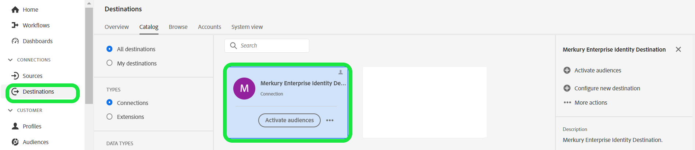

# Merkury Enterprise Identity Destination

>[!NOTE]
>
>Der Ziel-Connector und die Dokumentationsseite werden vom [!DNL Merkury] Team. Bei Fragen oder Aktualisierungsanfragen wenden Sie sich bitte an Ihre [!DNL Merkury] Kundenbetreuer.

## Übersicht

Verwenden Sie die [!DNL Merkury Enterprise Identity] Ziel, um genauere, umfassendere und aufschlussreichere Verbraucherprofile zu erstellen. Dank verbesserter Profildaten können Marketingexperten bessere Einblicke, Segmente und Modelle gewinnen, was zu genauerer Zielgruppenbestimmung und prädiktiver Modellierung führt.

Führen Sie die Schritte auf dieser Dokumentationsseite aus, um eine [!DNL Merkury Identity] Zielverbindung und Aktivierung von Zielgruppen zur Identifizierung und Anreicherung über die Adobe Experience Platform-Benutzeroberfläche.

>[!NOTE]
>
>Wenn Sie Zielgruppen für Medienziele mit Ihrer [!DNL Merkury Connect] -Konto, verwenden Sie die [!DNL Merkury Connections] Ziel.

## Anwendungsfälle

Die [!DNL Merkury Enterprise Identity] Das Ziel bietet die Möglichkeit, personenbezogene Daten von Verbrauchern sicher für Folgendes zu übertragen: [!DNL Merkury] -Funktionen:

* **Datenqualität**: Verbesserung der Qualität der Verbraucherprofildaten durch Datenhygiene und -standardisierung. [!DNL Merkury] umfasst die US-Posthygiene und die Identifizierung von Bewegungen, um die fortschrittlichsten Anwendungsfälle für das Briefpost-Marketing zu unterstützen.
* **Identity Resolution**: Erstellen Sie eine genaue und umfassende Einzelansicht des Kunden, informiert von [!DNL Merkury] Einzelne IDs und Haushalts-IDs. Merkury-IDs bieten eine tiefe Ebene der Profilverknüpfung, die von [!DNL Merkury]Das umfassende US-Identitätsdiagramm für erwachsene Verbraucher von mehr als 268 Millionen Menschen.
* **Anreicherung**: Bessere Einblicke und Personalisierung mit [!DNL Merkury Data]. [!DNL Merkury Data] enthält mehr als 10.000 verfügbare Datenattribute, von demografischen Daten, Lebensstil-, Finanz-, Lebensereignissen und Kaufdaten aus dem [!DNL Merkury Data Suite].

>[!NOTE]
>
>Diese Anwendungsfälle werden über eine Kombination aus Ziel- und Quell-Connectoren ausgeführt. Der Kunde exportiert zunächst seine vorhandenen Kundendatensätze zur Anreicherung mithilfe dieses Ziel-Connectors. [!DNL Merkury]Der -Dienst würde nach der Datei suchen, sie abrufen und sie anreichern mit [!DNL Merkury]-Daten und generieren eine -Datei. Der Kunde würde dann die entsprechende [!DNL Merkury] Source-Connector-Quellkarte, um die hydrierten Kundenprofile wieder in Adobe Real-Time CDP aufzunehmen.

## Voraussetzungen

>[!IMPORTANT]
>
>* Um eine Verbindung zum Ziel herzustellen, benötigen Sie die **Ziele anzeigen** und **Ziele verwalten**, **Ziele aktivieren**, **Anzeigen von Profilen**, und **Segmente anzeigen** [[Zugriffssteuerungsberechtigungen]](https://experienceleague.adobe.com/en/docs/experience-platform/access-control/home#permissions). Lesen Sie die [[Zugriffskontrolle - Übersicht]](https://experienceleague.adobe.com/en/docs/experience-platform/access-control/ui/overview) oder wenden Sie sich an Ihren Produktadministrator, um die erforderlichen Berechtigungen zu erhalten.
>* Export *identities*, benötigen Sie die **Identitätsdiagramm anzeigen** [[Zugriffssteuerungsberechtigung]](https://experienceleague.adobe.com/en/docs/experience-platform/access-control/home#permissions).\

## Unterstützte Identitäten {#supported-identities}

| Ziel-Identität | Beschreibung | Zu beachten |
|---|---|---|
| GAID | GOOGLE ADVERTISING ID | Wählen Sie die GAID-Zielidentität aus, wenn Ihre Quellidentität ein GAID-Namespace ist. |
| IDFA | Apple ID für Advertiser | Wählen Sie die IDFA-Zielidentität aus, wenn Ihre Quellidentität ein IDFA-Namespace ist. |
| ECID | Experience Cloud ID | Ein Namespace, der die ECID darstellt. Dieser Namespace kann auch durch die folgenden Aliase referenziert werden: „Adobe Marketing Cloud ID“, „Adobe Experience Cloud ID“, „Adobe Experience Platform ID“. Siehe folgendes Dokument unter [ECID](/help/identity-service/features/ecid.md) für weitere Informationen. |
| phone_sha256 | Telefonnummern, die mit dem SHA256-Algorithmus gehasht wurden | Es werden sowohl einfache als auch SHA256-Hash-Telefonnummern von Adobe Experience Platform unterstützt. Wenn Ihr Quellfeld ungehashte Attribute enthält, überprüfen Sie die Option **[!UICONTROL Umwandlung anwenden]**, damit [!DNL Platform] die Daten bei Aktivierung automatisch hasht. |
| email_lc_sha256 | E-Mail-Adressen, die mit dem SHA-256-Algorithmus gehasht wurden | Es werden sowohl Nur-Text- als auch SHA256-Hash-E-Mail-Adressen von Adobe Experience Platform unterstützt. Wenn Ihr Quellfeld ungehashte Attribute enthält, überprüfen Sie die Option **[!UICONTROL Umwandlung anwenden]**, damit [!DNL Platform] die Daten bei Aktivierung automatisch hasht. |
| extern_id | Benutzerdefinierte Benutzer-IDs | Wählen Sie diese Zielidentität aus, wenn Ihre Quellidentität ein benutzerdefinierter Namespace ist. |

{style="table-layout:auto"}

## Unterstützte Zielgruppen

In diesem Abschnitt wird beschrieben, welche Zielgruppentypen Sie an dieses Ziel exportieren können.

| **Zielgruppe** | **Unterstützt** | **Beschreibung** | **origin** |
|---|---|---|---|
| Segmentierungs-Service | ✓ | Über die Experience Platform generierte Zielgruppen [[Segmentation Service]](https://experienceleague.adobe.com/en/docs/experience-platform/segmentation/home). |
| Benutzerdefinierte Uploads | x | Zielgruppen [[importiert]](https://experienceleague.adobe.com/en/docs/experience-platform/segmentation/ui/overview#import-audience) in Experience Platform aus CSV-Dateien. |

{style="table-layout:auto"}

## Exporttyp und -häufigkeit

Informationen zum Zielexporttyp und zur Häufigkeit finden Sie in der unten stehenden Tabelle.

|**Zielgruppe**|**Unterstützt**|**Ursprung der Beschreibung**|
|---|---|---|
|Segmentation Service|✓|Über die Experience Platform generierte Zielgruppen [[Segmentation Service]](https://experienceleague.adobe.com/en/docs/experience-platform/segmentation/home).|
|Benutzerdefinierte Uploads|X|Zielgruppen [[importiert]](https://experienceleague.adobe.com/en/docs/experience-platform/segmentation/ui/overview#import-audience) in Experience Platform aus CSV-Dateien.|

{style="table-layout:auto"}

## Herstellen einer Verbindung mit dem Ziel

>[!IMPORTANT]
>
>Um eine Verbindung zum Ziel herzustellen, benötigen Sie die **Ziele anzeigen** und **Verwalten und Aktivieren von Datensatzzielen** [[Zugriffssteuerungsberechtigungen]](https://experienceleague.adobe.com/en/docs/experience-platform/access-control/home#permissions). Lesen Sie die [[Zugriffskontrolle - Übersicht]](https://experienceleague.adobe.com/en/docs/experience-platform/access-control/ui/overview) oder wenden Sie sich an Ihren Produktadministrator, um die erforderlichen Berechtigungen zu erhalten.

Gehen Sie wie im Abschnitt [[Tutorial zur Zielkonfiguration]](https://experienceleague.adobe.com/en/docs/experience-platform/destinations/ui/connect-destination). Füllen Sie im Zielkonfigurations-Workflow die Felder aus, die in den beiden folgenden Abschnitten aufgeführt sind.

### Beim Ziel authentifizieren

Füllen Sie die erforderlichen Felder aus und wählen Sie **Mit Ziel verbinden**.

Um auf Ihren Bucket auf dem Experience Platform zuzugreifen, müssen Sie gültige Werte für die folgenden Anmeldedaten angeben:

| **Berechtigung** | **Beschreibung** |
|---|---|
| Zugriffsschlüssel | Die Zugriffsschlüssel-ID für Ihren Behälter. Sie können diesen Wert vom Merkury-Team abrufen. |
| Geheimer Schlüssel | Die geheime Schlüssel-ID für Ihren Bucket. Sie können diesen Wert vom Merkury-Team abrufen. |
| Behältername | Dies ist Ihr Bucket, in dem Dateien freigegeben werden. Sie können diesen Wert vom Merkury-Team abrufen. |

{style="table-layout:auto"}

### Ausfüllen der Zieldetails

Füllen Sie die folgenden erforderlichen und optionalen Felder aus, um Details für das Ziel zu konfigurieren. Ein Sternchen neben einem Feld in der Benutzeroberfläche zeigt an, dass das Feld erforderlich ist.

* **Name (erforderlich)** - Der Name, unter dem das Ziel gespeichert wird
* **Beschreibung** - Kurze Erläuterung des Ziels des Bestimmungsorts
* **Behältername (erforderlich)** - Name des auf S3 eingerichteten Amazon S3-Buckets
* **Ordnerpfad (erforderlich)** - Wenn Unterverzeichnisse in einem Behälter verwendet werden, muss ein Pfad definiert werden, oder &quot;/&quot;, um auf den Stammpfad zu verweisen.
* **Dateityp** - Wählen Sie das Format aus, das Experience Platform für die exportierten Dateien verwenden soll. Fragen Sie Ihr Merkury-Team nach dem erwarteten Dateityp für Ihr Konto.

>[!NOTE]
>
>Bei der Auswahl der CSV-Option werden die Optionen Trennzeichen, Anführungszeichen, Escape-Zeichen, Leerwert, Null-Wert, Komprimierungsformat und Manifestdatei einschließen angezeigt. Wenden Sie sich an Ihr Merkury-Team, um die entsprechenden Einstellungen für Ihr Konto zu erhalten.

### Vorhandenes Konto

Konten, die bereits mit dem Merkury Enterprise Identity-Ziel definiert wurden, werden in einem Listen-Popup angezeigt. Wenn diese Option aktiviert ist, werden Details zum Konto in der rechten Leiste angezeigt. Zeigen Sie das Beispiel in der Benutzeroberfläche an, wenn Sie zu **Ziele** > **Konten**;

### Aktivieren von Warnhinweisen

Sie können Warnhinweise aktivieren, um Benachrichtigungen zum Status des Datenflusses zu Ihrem Ziel zu erhalten. Wählen Sie einen Warnhinweis aus der zu abonnierenden Liste aus, um Benachrichtigungen über den Status Ihres Datenflusses zu erhalten. Weitere Informationen zu Warnungen finden Sie im Handbuch zu [Abonnieren von Zielwarnhinweisen über die Benutzeroberfläche](https://experienceleague.adobe.com/en/docs/experience-platform/destinations/ui/alerts).

Wenn Sie alle Details für Ihre Zielverbindung angegeben haben, wählen Sie **Nächste**.

## Aktivieren von Zielgruppen für dieses Ziel

>[!IMPORTANT]
>
>* Um Daten zu aktivieren, benötigen Sie die **Ziele anzeigen**, **Ziele aktivieren**, **Anzeigen von Profilen**, und **Segmente anzeigen** Zugriffssteuerungsberechtigungen. Lesen Sie die Übersicht zur Zugriffskontrolle oder kontaktieren Sie Ihren Produktadministrator, um die erforderlichen Berechtigungen zu erhalten.
>* Um Identitäten zu exportieren, benötigen Sie die **Identitätsdiagramm anzeigen** Zugriffssteuerungsberechtigung.

Lesen [Aktivieren von Zielgruppendaten für Batch-Profil-Export-Ziele](https://experienceleague.adobe.com/en/docs/experience-platform/destinations/ui/activate/activate-batch-profile-destinations) für Anweisungen zum Aktivieren von Zielgruppen für dieses Ziel.

## Vorschläge zuordnen

Die korrekte Verarbeitung von Dateien auf der [!DNL Merkury] -Seite erfordert Namen- und Adresselemente. Auch wenn nicht alle Elemente erforderlich sind, hilft eine möglichst umfassende Bereitstellung bei der erfolgreichen Zuordnung.

Zuordnungsvorschläge werden in der folgenden Tabelle bereitgestellt und enthalten Attribute auf Ihrer Zielseite, die von [!DNL Merkury] -Verarbeitung, der Kunden Profilattribute zuordnen können. Behandeln Sie diese Elemente als Vorschläge, da nicht alle Elemente erforderlich sind und die Quellwerte von den Anforderungen des Kontos abhängen.

| Zielfeld | Source-Beschreibung |
|---|---|
| id | Identitätsfeld für die Zuordnung [!DNL Merkury] Daten, die über die [!DNL Merkury Enterprise Identity] Source-Connector |
| input_first_name | Die `person.name.firstName` -Wert in Experience Platform. |
| input_last_name | Die `person.name.lastName` -Wert in Experience Platform. |
| Input_Address_Line_1 | Die `mailingAddress.street` -Wert in Experience Platform. |
| Input_City | Die `mailingAddress.city` -Wert in Experience Platform. |
| Input_State_Province_code | Die `mailingAddress.state` -Wert in Experience Platform. Verwenden Sie diese Option, wenn der Status im Formular mit dem Code für zwei Zeichen vorliegt. |
| Input_State_Province_Name | Die `mailingAddress.state` -Wert in Experience Platform. Verwenden Sie , wenn der Status der vollständige Statusname ist. |
| input_postal_code | Die `mailingAddress.postalCode` -Wert in Experience Platform. |
| input_email_address | Der Wert, den Sie als Profil-E-Mail-Adresse zuordnen möchten. |
| Input_Phone | Der Wert, den Sie als Telefonnummer für Profile zuordnen möchten. |

{style="table-layout:auto"}

## Überprüfen des Datenexports

Um zu überprüfen, ob die Daten erfolgreich exportiert wurden, überprüfen Sie Ihren Amazon S3-Speicher-Bucket und stellen Sie sicher, dass die exportierten Dateien die erwarteten Profilpopulationen enthalten.

## Datennutzung und -Governance

Alle Adobe Experience Platform-Ziele sind bei der Verarbeitung Ihrer Daten mit Datennutzungsrichtlinien konform. Detaillierte Informationen dazu, wie Adobe Experience Platform Data Governance durchsetzt, finden Sie im Abschnitt [Data Governance - Übersicht](https://experienceleague.adobe.com/en/docs/experience-platform/data-governance/home).

## Nächste Schritte

In diesem Tutorial haben Sie erfolgreich einen Datenfluss erstellt, um Profildaten von Experience Platform in Ihre [!DNL Merkury] verwalteter S3-Speicherort. Als Nächstes müssen Sie Ihre [!DNL Merkury] mit dem Namen des Kontos, den Dateinamen und dem Behälterpfad übereinstimmen, damit die Verarbeitung eingerichtet werden kann.
