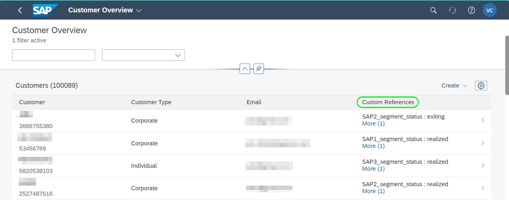

# [!DNL SAP Commerce]-Verbindung

[!DNL SAP Commerce], früher bekannt als [[!DNL Hybris]](https://www.sap.com/india/products/acquired-brands/what-is-hybris.html), ist eine Cloud-basierte E-Commerce-Plattform-Lösung für B2B- und B2C-Unternehmen und steht als Teil des SAP Customer Experience Portfolios zur Verfügung. [[!DNL SAP] Subscription Billing](https://www.sap.com/products/financial-management/subscription-billing.html) ist ein Produkt aus dem Portfolio und ermöglicht durch standardisierte Integrationen ein vollständiges Abonnement-Lifecycle-Management mit vereinfachten Verkaufs- und Zahlungserlebnissen.

Dieses [!DNL Adobe Experience Platform] [Ziel](/help/destinations/home.md) verwendet die [[!DNL SAP Subscription Billing] Customer Management API](https://api.sap.com/api/BusinessPartner_APIs/path/PUT_customers-customerNumber), um Ihre Kundendaten innerhalb von [!DNL SAP Commerce] aus einer bestehenden Experience Platform-Zielgruppe nach der Aktivierung zu aktualisieren.

Anweisungen zur Authentifizierung bei Ihrer [!DNL SAP Commerce]-Instanz sehen Sie weiter unten im Abschnitt [Authentifizieren bei Ziel](#authenticate).

## Anwendungsfälle {#use-cases}

Damit Sie besser verstehen können, wie und wann Sie das [!DNL SAP Commerce]-Ziel verwenden sollten, finden Sie hier ein Anwendungsbeispiel, das für Kundinnen und Kunden von Adobe Experience Platform mit diesem Ziel geeignet ist.

[!DNL SAP Commerce] Kunden speichern Informationen über Einzelpersonen oder Organisationseinheiten, die mit Ihrem Unternehmen interagieren. Ihr Team verwendet die in [!DNL SAP Commerce] vorhandenen Kunden, um die Experience Platform-Zielgruppen zu erstellen. Nachdem diese Zielgruppen an [!DNL SAP Commerce] gesendet wurden, werden ihre Informationen aktualisiert und jedem Kunden wird eine Eigenschaft mit dem Wert als Zielgruppenname zugewiesen, der angibt, zu welcher Zielgruppe der Kunde gehört.

## Voraussetzungen {#prerequisites}

In den folgenden Abschnitten finden Sie alle Voraussetzungen, die Sie in Experience Platform und [!DNL SAP Commerce] einrichten müssen, sowie Informationen, die Sie vor der Arbeit mit dem [!DNL SAP Commerce]-Ziel sammeln müssen.

### Voraussetzungen für Experience Platform {#prerequisites-in-experience-platform}

Bevor Sie Daten für das [!DNL SAP Commerce]-Ziel aktivieren, müssen Sie ein [Schema](/help/xdm/schema/composition.md), einen [Datensatz](https://experienceleague.adobe.com/docs/platform-learn/tutorials/data-ingestion/create-datasets-and-ingest-data.html) und [Audiences](https://experienceleague.adobe.com/docs/platform-learn/tutorials/audiences/create-audiences.html) in [!DNL Experience Platform] erstellt haben.

Weitere Informationen finden Sie in der Experience Platform[Dokumentation für die Schemafeldgruppe „Details zur Zielgruppenzugehörigkeit](/help/xdm/field-groups/profile/segmentation.md) , wenn Sie Anleitungen zu Zielgruppenstatus benötigen.

### Voraussetzungen für das [!DNL SAP Commerce] Ziel {#prerequisites-destination}

Beachten Sie die folgenden Voraussetzungen, um Daten aus Experience Platform in Ihr [!DNL SAP Commerce]-Konto zu exportieren:

#### Sie müssen über ein [!DNL SAP Subscription Billing] Konto verfügen {#prerequisites-account}

Um Daten aus Experience Platform in Ihr [!DNL SAP Commerce]-Konto zu exportieren, benötigen Sie ein [!DNL SAP Subscription Billing]. Wenn Sie kein gültiges Abrechnungskonto haben, wenden Sie sich an Ihren [!DNL SAP] Account Manager. Weitere Informationen finden Sie [[!DNL SAP]  Dokument &#x200B;](https://help.sap.com/doc/5fd179965d5145fbbe7f2a7aa1272338/latest/en-US/PlatformConfiguration.pdf)Platform-Konfiguration“.

#### Generieren eines Service-Schlüssels {#prerequisites-service-key}

* Mit dem [!DNL SAP Commerce]-Dienstschlüssel können Sie über Experience Platform auf die [!DNL SAP Subscription Billing]-API zugreifen. Informationen zum Erstellen eines Service[!DNL SAP Commerce]Schlüssels finden Sie unter [Erstellen eines Service](https://help.sap.com/docs/CLOUD_TO_CASH_OD/1216e7b79c984675b0a6f0005e351c74/87c11a0f5dc3494eaf3baa355925c030.html#create-a-service-key-with-client-id-and-client-secret)Schlüssels mit Client-ID und Client-Geheimnis“. [!DNL SAP Commerce] erfordert Folgendes:
   * Client-ID
   * Client-Geheimnis
   * URL. Das URL-Muster sieht wie folgt aus: `https://subscriptionbilling.authentication.eu10.hana.ondemand.com`. Dieser Wert wird später zum Abrufen von Werten für `Region` und `Endpoint` verwendet.

+++Wählen Sie aus, um ein Beispiel für den Dienstschlüssel anzuzeigen

```json
{ 
    "url": "https://eu10.revenue.cloud.sap/api",
    "uaa": {
        "clientid": "XXX",
        "clientsecret": "XXX",
        "url": "https://subscriptionbilling.authentication.eu10.hana.ondemand.com",
        "identityzone": "subscriptionbilling",
        "identityzoneid": "XXX",
        "tenantid": "XXX",
        "tenantmode": "dedicated",
        "sburl": "https://internal-xsuaa.authentication.eu10.hana.ondemand.com",
        "apiurl": "https://api.authentication.eu10.hana.ondemand.com",
        "verificationkey": "XXX",
        "xsappname": "XXX",
        "subaccountid": "XXX",
        "uaadomain": "authentication.eu10.hana.ondemand.com",
        "zoneid": "XXX",
        "credential-type": "binding-secret"
    },
    "vendor": "SAP"
}
```

+++

#### Erstellen benutzerdefinierter Verweise in [!DNL SAP Subscription Billing] {#prerequisites-custom-reference}

Um den Experience Platform-Zielgruppenstatus in [!DNL SAP Subscription Billing] zu aktualisieren, benötigen Sie ein benutzerdefiniertes Referenzfeld für jede in Experience Platform ausgewählte Zielgruppe.

Um die benutzerdefinierten Verweise zu erstellen, melden Sie sich bei Ihrem [!DNL SAP Subscription Billing]-Konto an und navigieren Sie zur **[Stammdaten und Konfiguration]** > **[Benutzerdefinierte Verweise]**. Wählen Sie als Nächstes **[!UICONTROL Create]** aus, um für jede in Experience Platform ausgewählte Zielgruppe eine neue Referenz hinzuzufügen. Sie benötigen diese Referenzfeldnamen im nachfolgenden Schritt [Planen des Zielgruppenexports und Beispiel](#schedule-segment-export-example).

Nachfolgend finden Sie ein Beispiel für das Erstellen eines benutzerdefinierten **[!UICONTROL Reference Type]** in [!DNL SAP Subscription Billing]:


Weitere Anleitungen finden Sie in der Dokumentation [!DNL SAP Subscription Billing] [Benutzerdefinierte &#x200B;](https://help.sap.com/docs/CLOUD_TO_CASH_OD/80d121f216af43648e79664efe5595f7/85696a63c8d8453a934e86c9413a25cf.html?version=2023-11-27)).

### Sammeln erforderlicher Anmeldedaten {#gather-credentials}

Um [!DNL SAP Commerce] mit Experience Platform zu verbinden, müssen Sie Werte für die folgenden Verbindungseigenschaften angeben:

| Anmeldedaten | Beschreibung |
| --- | --- |
| Client-ID | Der Wert von `clientId` aus dem Service-Schlüssel. |
| Client-Geheimnis | Der Wert von `clientSecret` aus dem Service-Schlüssel. |
| Endpunkt | Der Wert von `url` aus dem Dienstschlüssel ähnelt `https://subscriptionbilling.authentication.eu10.hana.ondemand.com`. |
| Region | Ihr Rechenzentrumsstandort. Die Region befindet sich in der `url` und hat einen ähnlichen Wert wie `eu10` oder `us10`. Wenn die `url` beispielsweise `https://eu10.revenue.cloud.sap/api` ist, benötigen Sie `eu10`. |

## Leitlinien {#guardrails}

API-Anfragen an den [!DNL SAP Cloud Management service] unterliegen [Ratenbeschränkungen](https://help.sap.com/docs/btp/sap-business-technology-platform/account-administration-rate-limiting). Wenn das Ratenlimit überschritten wird, wird der Status-Code einer `HTTP 429 Too Many Requests` Antwort angezeigt.

## Unterstützte Identitäten {#supported-identities}

[!DNL SAP Commerce] unterstützt die Aktualisierung von Identitäten, die in der folgenden Tabelle beschrieben werden. Erhalten Sie weitere Informationen zu [Identitäten](/help/identity-service/features/namespaces.md).

| Ziel-Identität | Beschreibung | Zu beachten |
| --- | --- | --- |
| `customerNumberSAP` | Eine Kundenkennung des Privat- oder Firmenkunden, der bereits in Ihrem [!DNL SAP Commerce] vorhanden ist. | Obligatorisch |

## Unterstützte Zielgruppen {#supported-audiences}

In diesem Abschnitt werden alle Zielgruppen beschrieben, die Sie an dieses Ziel exportieren können.

Dieses Ziel unterstützt die Aktivierung aller durch die Experience Platform generierten Zielgruppen über den [Segmentierungsdienst](../../../segmentation/home.md).

Dieses Ziel unterstützt auch die Aktivierung der in der folgenden Tabelle beschriebenen Zielgruppen.

| Zielgruppentyp | Unterstützt | Beschreibung |
| ------------- | --------- | ----------- |
| [!DNL Segmentation Service] | ✓ | Zielgruppen, die über den Experience Platform-[&#x200B; (Segmentierungs-Service) generiert &#x200B;](../../../segmentation/home.md). |
| Benutzerdefinierte Uploads | ✓ | Zielgruppen, die aus CSV-Dateien in Experience Platform [importiert](../../../segmentation/ui/audience-portal.md#import-audience) werden. |

{style="table-layout:auto"}

## Exporttyp und -häufigkeit {#export-type-frequency}

Beziehen Sie sich auf die folgende Tabelle, um Informationen zu Typ und Häufigkeit des Zielexports zu erhalten.

| Element | Typ | Anmerkungen |
|---------|----------|---------|
| Exporttyp | **[!UICONTROL Profile-based]** | <ul><li>Sie exportieren alle Mitglieder einer Zielgruppe zusammen mit den gewünschten Schemafeldern *z. B. E-Mail-Adresse, Telefonnummer, Nachname)* entsprechend Ihrer Feldzuordnung.</li><li> Für jede ausgewählte Zielgruppe in Experience Platform wird das entsprechende [!DNL SAP Commerce] zusätzliche Attribut von Experience Platform mit seinem Zielgruppenstatus aktualisiert.</li></ul> |
| Exporthäufigkeit | **[!UICONTROL Streaming]** | <ul><li>Streaming-Ziele sind „immer verfügbare“ API-basierte Verbindungen. Wenn ein Profil in Experience Platform auf der Grundlage einer Zielgruppenbewertung aktualisiert wird, sendet der Connector die Aktualisierung nachgelagert an die Zielplattform. Lesen Sie mehr über [Streaming-Ziele](/help/destinations/destination-types.md#streaming-destinations).</li></ul> |

{style="table-layout:auto"}

## Herstellen einer Verbindung mit dem Ziel {#connect}

>[!IMPORTANT]
>
>Um eine Verbindung zum Ziel herzustellen, benötigen Sie die **[!UICONTROL Manage Destinations]** [Zugriffssteuerungsberechtigung](/help/access-control/home.md#permissions). Lesen Sie die [Zugriffskontrolle – Übersicht](/help/access-control/ui/overview.md) oder wenden Sie sich an Ihren Produktadministrator, um die erforderlichen Berechtigungen zu erhalten.

Um eine Verbindung mit diesem Ziel herzustellen, gehen Sie wie im [Tutorial zur Zielkonfiguration](../../ui/connect-destination.md) beschrieben vor. Füllen Sie im Workflow zum Konfigurieren des Ziels die Felder aus, die in den beiden folgenden Abschnitten aufgeführt sind.

Suchen Sie in **[!UICONTROL Destinations]** > **[!UICONTROL Catalog]** nach [!DNL SAP Commerce]. Alternativ können Sie es unter der Kategorie **[!UICONTROL eCommerce]** finden.

### Beim Ziel authentifizieren {#authenticate}

Füllen Sie die erforderlichen Felder aus. Eine Anleitung dazu finden [&#x200B; im Abschnitt &#x200B;](#prerequisites-service-key) eines Dienstschlüssels .

| Feld | Beschreibung |
| --- | --- |
| **[!UICONTROL Client ID]** | Der Wert von `clientId` aus dem Service-Schlüssel. |
| **[!UICONTROL Client secret]** | Der Wert von `clientSecret` aus dem Service-Schlüssel. |
| **[!UICONTROL Endpoint]** | Der Wert von `url` aus dem Dienstschlüssel ähnelt `https://subscriptionbilling.authentication.eu10.hana.ondemand.com`. |
| **[!UICONTROL Region]** | Ihr Rechenzentrumsstandort. Die Region befindet sich in der `url` und hat einen ähnlichen Wert wie `eu10` oder `us10`. Wenn die `url` beispielsweise `https://eu10.revenue.cloud.sap/api` ist, benötigen Sie `eu10`. |

Um sich beim Ziel zu authentifizieren, wählen Sie **[!UICONTROL Connect to destination]** aus.


Wenn die angegebenen Details gültig sind, zeigt die Benutzeroberfläche einen **[!UICONTROL Connected]** mit einem grünen Häkchen an. Sie können dann mit dem nächsten Schritt fortfahren.

### Ausfüllen der Zieldetails {#destination-details}

Füllen Sie die folgenden erforderlichen und optionalen Felder aus, um Details für das Ziel zu konfigurieren. Ein Sternchen neben einem Feld in der Benutzeroberfläche zeigt an, dass das Feld erforderlich ist.


* **[!UICONTROL Name]**: Ein Name, durch den Sie dieses Ziel in Zukunft erkennen können.
* **[!UICONTROL Description]**: Eine Beschreibung, die Ihnen hilft, dieses Ziel in Zukunft zu identifizieren.
* **[!UICONTROL Type of Customer]**: Wählen Sie entweder ***Einzelperson*** oder ***Unternehmen*** je nach den Entitäten in Ihrer Audience aus. Das [!DNL SAP Subscription Billing] [Schema](https://api.sap.com/api/BusinessPartner_APIs/schema) wechselt die Pflichtfelder je nach dieser Auswahl, die dem `customerType` Attribut zugeordnet ist. Wenn die Auswahl &quot;***&quot; lautet*** werden die für einen einzelnen Kunden erforderlichen obligatorischen Zuordnungen wie `firstName` und `lastName` ignoriert und `company` werden obligatorisch und umgekehrt.

### Aktivieren von Warnhinweisen {#enable-alerts}

Sie können Warnhinweise aktivieren, um Benachrichtigungen zum Status des Datenflusses zu Ihrem Ziel zu erhalten. Wählen Sie einen Warnhinweis aus der zu abonnierenden Liste aus, um Benachrichtigungen über den Status Ihres Datenflusses zu erhalten. Weitere Informationen zu Warnhinweisen finden Sie im Handbuch zum [Abonnieren von Zielwarnhinweisen über die Benutzeroberfläche](../../ui/alerts.md).

Wenn Sie mit dem Eingeben der Details für Ihre Zielverbindung fertig sind, wählen Sie **[!UICONTROL Next]** aus.

## Aktivieren von Zielgruppen für dieses Ziel {#activate}

>[!IMPORTANT]
> 
>* Zum Aktivieren von Daten benötigen Sie die **[!UICONTROL View Destinations]**, **[!UICONTROL Activate Destinations]**, **[!UICONTROL View Profiles]** und **[!UICONTROL View Segments]** [Zugriffssteuerungsberechtigungen](/help/access-control/home.md#permissions). Lesen Sie die [Übersicht über die Zugriffssteuerung](/help/access-control/ui/overview.md) oder wenden Sie sich an Ihre Produktadmins, um die erforderlichen Berechtigungen zu erhalten.
>* Zum Exportieren *Identitäten* benötigen Sie die **[!UICONTROL View Identity Graph]** Zugriffssteuerungsberechtigung[&#x200B; &#x200B;](/help/access-control/home.md#permissions). <br> {width="100" zoomable="yes"}

Anweisungen zum Aktivieren von Zielgruppen für dieses Ziel finden Sie unter [Aktivieren von Profilen und Zielgruppen für Streaming-Zielgruppen-Exportziele](/help/destinations/ui/activate-segment-streaming-destinations.md).

### Zuordnen von Attributen und Identitäten {#map}

Um Ihre Zielgruppendaten ordnungsgemäß von Adobe Experience Platform an das [!DNL SAP Commerce] Ziel zu senden, müssen Sie den Schritt zur Feldzuordnung durchlaufen. Die Zuordnung besteht darin, eine Verknüpfung zwischen den Schemafeldern Ihres Experience-Datenmodells (XDM) in Ihrem Experience Platform-Konto und den entsprechenden Entsprechungen vom Ziel zu erstellen. Gehen Sie wie folgt vor, um Ihre XDM-Felder den [!DNL SAP Commerce]-Zielfeldern korrekt zuzuordnen:

#### `customerNumberSAP` Identität zuordnen

Die `customerNumberSAP` Identität ist eine obligatorische Zuordnung für dieses Ziel. Gehen Sie wie folgt vor, um sie zuzuordnen:

1. Wählen Sie im **[!UICONTROL Mapping]** Schritt **[!UICONTROL Add new mapping]** aus. Auf dem Bildschirm wird nun eine neue Zuordnungszeile angezeigt.
   Screenshot der Experience Platform-Benutzeroberfläche mit hervorgehobener Schaltfläche „Neue Zuordnung hinzufügen“.
1. Wählen Sie im **[!UICONTROL Select source field]** die **[!UICONTROL Select identity namespace]** und dann `customerNumberSAP` aus.
   
1. Wählen Sie im **[!UICONTROL Select target field]** die **[!UICONTROL Select identity namespace]** und dann die `customerNumber` Identität aus.
   

| Quellfeld | Zielfeld | Obligatorisch |
| --- | --- | --- |
| `IdentityMap: customerNumberSAP` | `Identity: customerNumber` | Ja |

Nachfolgend finden Sie ein Beispiel mit der Identitätszuordnung:


#### Zuordnungsattribute

Um weitere Attribute hinzuzufügen, die Sie zwischen Ihrem XDM-Profilschema und Ihrem [!DNL SAP Subscription Billing]-Konto aktualisieren möchten, wiederholen Sie die folgenden Schritte:

1. Wählen Sie im **[!UICONTROL Mapping]** Schritt **[!UICONTROL Add new mapping]** aus. Auf dem Bildschirm wird nun eine neue Zuordnungszeile angezeigt.
   Screenshot der Experience Platform-Benutzeroberfläche mit hervorgehobener Schaltfläche „Neue Zuordnung hinzufügen“.
1. Wählen Sie im **[!UICONTROL Select source field]** die Kategorie **[!UICONTROL Select attributes]** und dann das XDM-Attribut aus.
   Screenshot der 
1. Wählen Sie im **[!UICONTROL Select target field]**-Fenster **[!UICONTROL Select custom attributes]** Kategorie aus und geben Sie den Namen des [!DNL SAP Subscription Billing] Attributs aus der Liste der Kunden-([)-](https://api.sap.com/api/BusinessPartner_APIs/schema) ein.
   Screenshot der 

>[!IMPORTANT]
>
> Bei den Namen der Zielfelder wird zwischen Groß- und Kleinschreibung unterschieden und sie sollten mit den [!DNL SAP Subscription Billing] Attributnamen übereinstimmen. Die einzige Ausnahme hierfür ist `country`, wo stattdessen `countryCode` verwendet werden sollte. [!DNL SAP Subscription Billing] unterstützt Alpha-2 (ISO 3166)-Ländercodes. Bei dem Wert wird zwischen Groß- und Kleinschreibung unterschieden und er muss zwischen 0 und 3 Zeichen lang sein. Stellen Sie daher sicher, dass Sie genau wie definiert angeben, andernfalls würden Fehler auftreten: `The country code {} does not exist` oder `size must be between 0 and 3`.

#### Dem ausgewählten Kundentyp `mandatory` Attribute zuordnen

Obligatorische Attributzuordnungen hängen von der ausgewählten **[!UICONTROL Type of Customer]** ab. Um die obligatorischen Attribute zuzuordnen, wählen Sie aus den folgenden Optionen aus:

>[!BEGINTABS]

>[!TAB Einzelkunde]

| Quellfeld | Zielfeld | Obligatorisch |
| --- | --- | --- |
| `xdm: person.lastName` | `Attribute: lastName` | Ja |
| `xdm: workAddress.countryCode` | `Attribute: countryCode` | Ja |

>[!TAB Firmenkunde]

| Quellfeld | Zielfeld | Obligatorisch |
| --- | --- | --- |
| `xdm: b2b.companyName` | `Attribute: company` | Ja |
| `xdm: workAddress.countryCode` | `Attribute: countryCode` | Ja |

>[!ENDTABS]

#### Zuordnen zusätzlicher Attribute

Anschließend können Sie wie unten dargestellt zusätzliche Zuordnungen zwischen Ihrem XDM-Profilschema und den [!DNL SAP Subscription Billing][schema](https://api.sap.com/api/BusinessPartner_APIs/schema)-Attributen für einen Kunden hinzufügen:

>[!BEGINTABS]

>[!TAB Einzelkunde]

| Quellfeld | Zielfeld | Obligatorisch |
| --- | --- | --- |
| `xdm: person.name.firstName` | `Attribute: firstName` | Nein |
| `xdm: workAddress.street1` | `Attribute: street` | Nein |
| `xdm: workAddress.city` | `Attribute: city` | Nein |

Nachfolgend finden Sie ein Beispiel mit obligatorischen und optionalen Attributzuordnungen, bei denen der Kunde eine Einzelperson ist:


>[!TAB Firmenkunde]

| Quellfeld | Zielfeld | Obligatorisch |
| --- | --- | --- |
| `xdm: workAddress.street1` | `Attribute: street` | Nein |
| `xdm: workAddress.city` | `Attribute: city` | Nein |

Nachfolgend finden Sie ein Beispiel mit obligatorischen und optionalen Attributzuordnungen, bei denen der Kunde ein Unternehmen ist:


>[!ENDTABS]

Wenn Sie mit dem Eingeben der Zuordnungen für Ihre Zielverbindung fertig sind, wählen Sie **[!UICONTROL Next]** aus.

### Planen des Zielgruppenexports und Beispiel {#schedule-segment-export-example}

Bei der Durchführung des Schritts [Planen des &#x200B;](/help/destinations/ui/activate-segment-streaming-destinations.md#scheduling)-Exports) müssen Sie Experience Platform-Zielgruppen manuell den [Attributen](#prerequisites-attribute) in [!DNL SAP Subscription Billing] zuordnen.

Ein Beispiel für den Schritt Zielgruppenexport planen mit hervorgehobener Position des [!DNL SAP Commerce] **[!UICONTROL Mapping ID]** wird unten angezeigt:


Wählen Sie dazu jedes Segment aus und geben Sie dann den Namen der benutzerdefinierten Referenz aus [!DNL SAP Subscription Billing] in das Feld [!DNL SAP Commerce] **[!UICONTROL Mapping ID]**-Ziel-Connector ein. Anleitungen zum Erstellen benutzerdefinierter Verweise finden Sie im Abschnitt [Erstellen benutzerdefinierter Verweise in [!DNL SAP Subscription Billing]](#prerequisites-custom-reference).

>[!IMPORTANT]
>
> Verwenden Sie nicht die benutzerdefinierte Referenzbeschriftung als Wert.
> &#x200B;>

Wenn Ihre ausgewählte Experience Platform-Zielgruppe beispielsweise `sap_audience1` ist und Sie möchten, dass ihr Status in der [!DNL SAP Subscription Billing] Benutzerdefinierter Verweis `SAP_1` aktualisiert wird, geben Sie diesen Wert im Feld [!DNL SAP_Commerce] **[!UICONTROL Mapping ID]** an.

Nachfolgend finden Sie ein Beispiel **[!UICONTROL Reference Type]** von [!DNL SAP Subscription Billing]:


Ein Beispiel für den Schritt „Zielgruppenexport planen“, bei dem eine Zielgruppe ausgewählt und die entsprechende [!DNL SAP Commerce] hervorgehoben **[!UICONTROL Mapping ID]**, finden Sie unten:


Wie gezeigt, sollte der Wert im Feld **[!UICONTROL Mapping ID]** genau mit dem [!DNL SAP Subscription Billing] **[!UICONTROL Reference Type]** übereinstimmen.

Wiederholen Sie diesen Abschnitt für jede aktivierte Experience Platform-Zielgruppe.

Basierend auf der Abbildung oben, in der Sie zwei Zielgruppen ausgewählt haben, würde die Zuordnung wie folgt aussehen:

| [!DNL SAP Commerce] Zielgruppenname | [!DNL SAP Subscription Billing] **[!UICONTROL Reference Type]** | [!DNL SAP Commerce] **[!UICONTROL Mapping ID]** |
| --- | --- | --- |
| SAP_AUDIENCE1 | `SAP_1` | `SAP_1` |
| SAP-Zielgruppe2 | `SAP_2` | `SAP_2` |

## Überprüfen des Datenexports {#exported-data}

Gehen Sie wie folgt vor, um zu überprüfen, ob Sie das Ziel korrekt eingerichtet haben:

Melden Sie sich beim [!DNL SAP Subscription Billing]-Konto an und navigieren Sie dann zur Seite **[!UICONTROL Contacts]** , um den Status der Zielgruppe zu überprüfen. Die Liste kann so konfiguriert werden, dass Spalten für die benutzerdefinierten Verweise und die entsprechenden Zielgruppenstatus angezeigt werden.


## Datennutzung und -Governance {#data-usage-governance}

Alle [!DNL Adobe Experience Platform]-Ziele sind bei der Verarbeitung Ihrer Daten mit Datennutzungsrichtlinien konform. Ausführliche Informationen darüber, wie [!DNL Adobe Experience Platform] Data Governance erzwingt, finden Sie unter [Data Governance – Übersicht](/help/data-governance/home.md).

## Fehler und Fehlerbehebung {#errors-and-troubleshooting}

Auf der Dokumentationsseite [[!DNL SAP Subscription Billing] Fehlertypen](https://help.sap.com/docs/CLOUD_TO_CASH_OD/987aec876092428f88162e438acf80d6/1a6a0dd6129c48e8b235190a1b5409fa.html) finden Sie eine Liste der möglichen Fehlertypen und ihrer Antwort-Codes.

## Weitere Ressourcen {#additional-resources}

Weitere nützliche Informationen aus der [!DNL SAP] Dokumentation finden Sie unten:

* [Onboarding SAP Subscription Billing](https://help.sap.com/docs/CLOUD_TO_CASH_OD/1216e7b79c984675b0a6f0005e351c74/e4b8badf7d124026991e4ab6b57d2a33.html)

### Änderungsprotokoll

In diesem Abschnitt werden aktualisierte Funktionen und wesentliche Dokumentationsänderungen für diesen Ziel-Connector erfasst.

+++ Änderungsprotokoll anzeigen

| Veröffentlichungsmonat | Art der Aktualisierung | Beschreibung |
|---|---|---|
| Januar 2024 | Erstmalige Veröffentlichung | Erstmalige Zielveröffentlichung und Dokumentation. |

{style="table-layout:auto"}

+++
