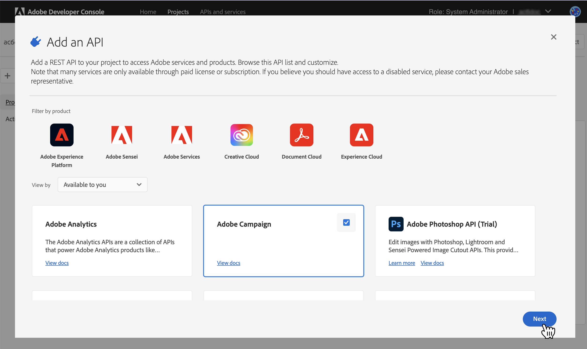
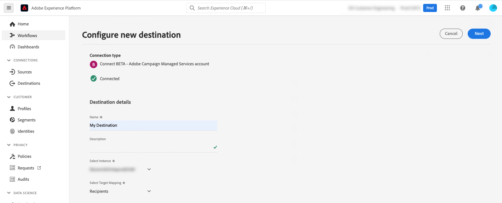

# Adobe Campaign Managed Cloud Services-Verbindung {#adobe-campaign-managed-services}

>[!IMPORTANT]
>
>Diese Integration funktioniert mit Adobe Campaign-Version 8.4 oder höher. Version 8.4 soll am 30. September 2022 veröffentlicht werden.

## Übersicht {#overview}

Adobe Campaign Managed Cloud Services bietet eine Plattform für die Konzeption kanalübergreifender Kundenerlebnisse und eine Umgebung für die visuelle Kampagnenorchestrierung, Interaktionsverwaltung in Echtzeit und die kanalübergreifende Ausführung. [Erste Schritte mit Campaign](https://experienceleague.adobe.com/docs/campaign/campaign-v8/start/get-started.html)

Mit Campaign haben Sie folgende Möglichkeiten:
* Personalisierung und Interaktion mit der Hilfe einer umfassenden, zentralen Sicht auf den Kunden fördern,
* E-Mail-, Mobil-, Online- und Offline-Kanälen in die Customer Journey integrieren,
* Zielführende, zeitlich optimal abgestimmte Nachrichten und Angebote automatisch versenden.

>[!IMPORTANT]
>
>Beachten Sie bei der Verwendung der Adobe Campaign Managed Cloud Services-Verbindung die folgenden Limits:
>
>* Maximal 50 Segmente können [enabled](#activate) für das Ziel,
>* Für jedes Segment können Sie bis zu 20 Felder zu [map](#map) nach Adobe Campaign,
>* Datenbeibehaltung in Azure Blob Storage Data Landing Zone (DLZ) : 7 Tage,
>* Die Aktivierungshäufigkeit beträgt mindestens 3 Stunden.

## Anwendungsbeispiele {#use-cases}

Um Ihnen zu helfen, besser zu verstehen, wie und wann Sie das Adobe Campaign-Verwaltungsdienstziel verwenden sollten, finden Sie hier ein Beispielanwendungsbeispiel, das Adobe Experience Platform-Kunden mithilfe dieses Ziels lösen können.

Adobe Experience Platform erstellt ein Kundenprofil, das Informationen wie das Identitätsdiagramm, Verhaltensdaten aus Analysen, das Zusammenführen von Offline- und Online-Daten usw. enthält. Durch diese Integration können Sie die Segmentierungsfunktionen, die bereits in Adobe Campaign vorhanden sind, mit den Adobe Experience Platform-basierten Zielgruppen erweitern und diese Daten in Campaign aktivieren.

Ein Sportartikelunternehmen möchte beispielsweise die Adobe Experience Platform-gestützten Smart-Segmente nutzen und sie mithilfe von Adobe Campaign aktivieren, um über die verschiedenen von Adobe Campaign unterstützten Kanäle zu seinem Kundenstamm zu gelangen.

Nachdem die Nachrichten gesendet wurden, sollen sie das Kundenprofil in der Adobe Experience Platform mit Erlebnisdaten aus Adobe Campaign wie Sendungen, Öffnungen und Klicks verbessern.

Das Ergebnis sind kanalübergreifende Kampagnen, die im gesamten Adobe Experience Cloud-Ökosystem konsistenter sind, und ein umfangreiches Kundenprofil, das sich schnell anpasst und lernt.

[Weitere Informationen zur Integration von Adobe Campaign mit Adobe Experience Platform](https://experienceleague.adobe.com/docs/campaign/campaign-v8/connect/ac-aep.html)

## Voraussetzungen {#prerequisites}

Damit Campaign Daten aus Adobe Experience Platform abrufen kann, müssen Sie ein Campaign-API-Projekt erstellen und die Kundenunterstützung bitten, die zugehörige Client-ID einer Zulassungsliste hinzuzufügen.

>[!NOTE]
>
>Allgemeine Informationen zum Erstellen eines API-Projekts finden Sie unter [diese Dokumentation](https://experienceleague.adobe.com/docs/platform-learn/getting-started-for-data-architects-and-data-engineers/set-up-developer-console-and-postman.html)

1. Anmelden bei [Adobe Developer-Konsole](https://console.adobe.io/) und erstellen Sie ein neues Projekt.

1. Auswählen **[!UICONTROL API hinzufügen]** und wählen Sie **[!UICONTROL Adobe Campaign]**.

   

1. Generieren Sie ein Schlüsselpaar.

1. Wählen Sie die `<Instance Name> - admin` Produktprofil und wählen Sie **[!UICONTROL Konfigurierte API speichern]**.

1. Ihr API-Projekt wird erstellt. Beachten Sie die **[!UICONTROL Client-ID]** in Ihrem Projekt angezeigt. Wenden Sie sich an die Kundenunterstützung von Adobe und bitten Sie sie, Ihre Client-ID einer Zulassungsliste hinzuzufügen.

   

## Unterstützte Identitäten {#supported-identities}

*Adobe Campaign Managed Cloud Services* unterstützt die Aktivierung der in der folgenden Tabelle beschriebenen Identitäten. Weitere Informationen [identities](/help/identity-service/namespaces.md).

| Zielgruppenidentität | Beschreibung | Zu beachten |
|---|---|---|
| external_id | Benutzerdefinierte Benutzer-IDs | Wählen Sie diese Zielidentität aus, wenn Ihre Quellidentität ein benutzerdefinierter Namespace ist. Es wird empfohlen, diese Identität zu verwenden und sie der ID in Ihrer Campaign-Instanz zuzuordnen, die den Kunden repräsentiert (loyalty_ID, account_ID, customer_ID..). |
| ECID | Experience Cloud ID | Ein Namespace, der die ECID darstellt. Dieser Namespace kann auch durch die folgenden Alias referenziert werden: &quot;Adobe Marketing Cloud ID&quot;, &quot;Adobe Experience Cloud ID&quot;, &quot;Adobe Experience Platform ID&quot;. Siehe folgendes Dokument unter [ECID](/help/identity-service/ecid.md) für weitere Informationen. |
| email_lc_sha256 | E-Mail-Adressen, die mit dem SHA-256-Algorithmus gehasht wurden | Sowohl Nur-Text- als auch SHA256-Hash-E-Mail-Adressen werden von Adobe Experience Platform unterstützt. Wenn Ihr Quellfeld ungehashte Attribute enthält, überprüfen Sie die **[!UICONTROL Umwandlung anwenden]** -Option, um [!DNL Platform] die Daten bei Aktivierung automatisch hash. |
| phone_sha256 | Telefonnummern, die mit dem SHA256-Algorithmus gehasht wurden | Sowohl einfache als auch SHA256-Hash-Telefonnummern werden von Adobe Experience Platform unterstützt. Wenn Ihr Quellfeld ungehashte Attribute enthält, überprüfen Sie die **[!UICONTROL Umwandlung anwenden]** -Option, um [!DNL Platform] die Daten bei Aktivierung automatisch hash. |
| GAID | Google Advertising ID | Wählen Sie die GAID-Zielidentität aus, wenn Ihre Quellidentität ein GAID-Namespace ist. |
| IDFA | Apple ID für Advertiser | Wählen Sie die IDFA-Zielidentität aus, wenn Ihre Quellidentität ein IDFA-Namespace ist. |

{style=&quot;table-layout:auto&quot;}

## Exportart und -frequenz {#export-type-frequency}

Informationen zum Zielexporttyp und zur Häufigkeit finden Sie in der unten stehenden Tabelle.

| Element | Typ | Anmerkungen |
---------|----------|---------|
| Exporttyp | **[!UICONTROL Profilbasiert]** | Sie exportieren alle Mitglieder eines Segments zusammen mit den gewünschten Schemafeldern (z. B.: E-Mail-Adresse, Telefonnummer, Nachname), wie im Bildschirm Profilattribute im [Zielaktivierungs-Workflow](/help/destinations/ui/activate-batch-profile-destinations.md#select-attributes). |
| Exporthäufigkeit | **[!UICONTROL Batch]** | Batch-Ziele exportieren Dateien in Schritten von drei, sechs, acht, zwölf oder vierundzwanzig Stunden auf nachgelagerte Plattformen. Mehr dazu [Batch-dateibasierte Ziele](/help/destinations/destination-types.md#file-based). |

{style=&quot;table-layout:auto&quot;}

## Herstellen einer Verbindung mit der Datenbank {#connect}

>[!IMPORTANT]
> 
>Um eine Verbindung zum Ziel herzustellen, benötigen Sie die **[!UICONTROL Ziele verwalten]** [Zugriffsberechtigung](/help/access-control/home.md#permissions). Lesen Sie die [Zugriffskontrolle - Übersicht](/help/access-control/ui/overview.md) oder wenden Sie sich an Ihren Produktadministrator, um die erforderlichen Berechtigungen zu erhalten.

Um eine Verbindung mit diesem Ziel herzustellen, gehen Sie wie im Abschnitt [Tutorial zur Zielkonfiguration](../../ui/connect-destination.md) beschrieben vor. Füllen Sie im Workflow zum Konfigurieren des Ziels die Felder aus, die in den beiden folgenden Abschnitten aufgeführt sind.

### Zieldetails ausfüllen {#destination-details}

Füllen Sie die folgenden erforderlichen und optionalen Felder aus, um Details für das Ziel zu konfigurieren. Ein Sternchen neben einem Feld in der Benutzeroberfläche zeigt an, dass das Feld erforderlich ist.

* **[!UICONTROL Name]**: Ein Name, mit dem Sie dieses Ziel in der Zukunft erkennen werden.
* **[!UICONTROL Beschreibung]**: Eine Beschreibung, die Ihnen dabei hilft, dieses Ziel in der Zukunft zu identifizieren.
* **[!UICONTROL Instanz auswählen]**: Ihre **[!DNL Campaign]** Marketing-Instanz.
* **[!UICONTROL Zielgruppen-Mapping]**: Wählen Sie das Zielgruppen-Mapping aus, das Sie in **[!DNL Adobe Campaign]** Sendungen. [Weitere Informationen](https://experienceleague.adobe.com/docs/campaign/campaign-v8/profiles-and-audiences/add-profiles/target-mappings.html).

### Aktivieren von Warnhinweisen {#enable-alerts}

Sie können Warnhinweise aktivieren, um Benachrichtigungen über den Status des Datenflusses an Ihr Ziel zu erhalten. Wählen Sie einen Warnhinweis aus der zu abonnierenden Liste aus, um Benachrichtigungen über den Status Ihres Datenflusses zu erhalten. Weitere Informationen zu Warnungen finden Sie im Handbuch zu [Abonnieren von Zielwarnhinweisen über die Benutzeroberfläche](../../ui/alerts.md).

Wenn Sie alle Details für Ihre Zielverbindung angegeben haben, wählen Sie **[!UICONTROL Nächste]**.

### Governance-Richtlinie und Durchsetzungsmaßnahmen {#governance}

Wählen Sie die Marketing-Aktionen aus, die für die Daten gelten, die Sie an das Ziel exportieren möchten. Für Adobe Campaign wird empfohlen, die **[!UICONTROL E-Mail-Targeting]** Marketing-Aktion.

Weitere Informationen zu Marketing-Aktionen finden Sie unter [Datennutzungsrichtlinien - Übersicht](/help/data-governance/policies/overview.md) Seite.

## Aktivieren von Segmenten für dieses Ziel {#activate}

>[!IMPORTANT]
> 
>Um Daten zu aktivieren, benötigen Sie die **[!UICONTROL Ziele verwalten]**, **[!UICONTROL Ziele aktivieren]**, **[!UICONTROL Profile anzeigen]** und **[!UICONTROL Segmente anzeigen]** [Zugriffssteuerungsberechtigungen](/help/access-control/home.md#permissions). Lesen Sie die [Zugriffskontrolle - Übersicht](/help/access-control/ui/overview.md) oder wenden Sie sich an Ihren Produktadministrator, um die erforderlichen Berechtigungen zu erhalten.

Lesen [Aktivieren von Zielgruppendaten für Batch-Profil-Export-Ziele](https://experienceleague.adobe.com/docs/experience-platform/destinations/ui/activate/activate-batch-profile-destinations.html) für Anweisungen zum Aktivieren von Zielgruppendaten für dieses Ziel.

### Zuordnen von Attributen und Identitäten {#map}

Wählen Sie XDM-Felder aus, die mit den Profilen exportiert werden sollen, und ordnen Sie sie den entsprechenden Adobe Campaign-Feldern zu.[Erfahren Sie mehr über die Auswahl von Identitäts- und Attributen für E-Mail-Marketing-Ziele.](overview.md)

1. Quellfelder auswählen:

   * Wählen Sie eine **identifier** (Beispiel: das E-Mail-Feld) als Quellidentität, die ein Profil in Adobe Experience Platform und Adobe Campaign eindeutig identifiziert.

   * Alle anderen auswählen **XDM-Quellprofilattribute** die nach Adobe Campaign exportiert werden müssen.
   >[!NOTE]
   >
   >Das Feld &quot;segmentMembershipStatus&quot;ist ein erforderliches Mapping, das den Segmentzugehörigkeitsstatus widerspiegelt. Dieses Feld wird standardmäßig hinzugefügt und kann nicht geändert oder entfernt werden.

1. Ordnen Sie jedes Feld dem Zielfeld in Adobe Campaign zu. Die verfügbaren Zielfelder werden durch das beim [Erstellen des Ziels](#destination-details).

1. Identifizieren Sie erforderliche Attribute und Deduplizierungsschlüssel. Beachten Sie, dass Werte in Attributen, die als &quot;Obligatorisch&quot;oder &quot;Deduplizierungsschlüssel&quot;markiert sind, nicht null sein können.

   * [Obligatorische Attribute](../../ui/activate-batch-profile-destinations.md#mandatory-attributes) stellen sicher, dass alle Profildatensätze die ausgewählten Attribute enthalten. Beispiel: alle exportierten Profile eine E-Mail-Adresse enthalten. Es wird empfohlen, sowohl das Identitätsfeld als auch das als Deduplizierungsschlüssel verwendete Feld als obligatorisch festzulegen.
   * [Deduplizierungsschlüssel](../../ui/activate-batch-profile-destinations.md#mandatory-attributes) ist ein Primärschlüssel, der die Identität bestimmt, anhand derer Benutzer ihre Profile deduplizieren möchten.

      >[!IMPORTANT]
      >
      >Stellen Sie sicher, dass der Name des Deduplizierungsschlüsselattributs mit dem Spaltennamen des ausgewählten Zielgruppen-Mappings übereinstimmt.
   

1. Nachdem die Zuordnung durchgeführt wurde, können Sie die Zielkonfiguration überprüfen und abschließen, um mit dem Senden von Daten an zu beginnen. **[!DNL Campaign]**.
   [Erfahren Sie, wie Sie die Zielkonfiguration überprüfen und abschließen](/help/destinations/destination-types.md#review).

## Export von Daten/Export validieren {#exported-data}

Nachdem ein Ziel aktiviert wurde, können Sie in Campaign auf den entsprechenden Auftrag und die exportierten Daten zugreifen.

### Überwachen von Datenexportvorgängen {#jobs}

Navigieren Sie zum **[!UICONTROL Administration]** > **[!UICONTROL Prüfung]** > **[!UICONTROL Audience-Ladevorgänge]** -Menü, um alle von Adobe Experience Platform aktivierten Exportvorgänge zu überwachen.

### Auf exportierte Daten zugreifen {#data}

Navigieren Sie zum **[!UICONTROL Profil und Zielgruppe]** > **[!UICONTROL Liste]** > **[!UICONTROL AEP-Zielgruppen]** -Menü, um auf Zielgruppen zuzugreifen, die nach der Aktivierung eines Ziels erstellt wurden.

## Datennutzung und -Governance {#data-usage-governance}

Alle [!DNL Adobe Experience Platform]-Ziele sind bei der Verarbeitung Ihrer Daten mit Datennutzungsrichtlinien konform. Ausführliche Informationen darüber, wie [!DNL Adobe Experience Platform] Data Governance erzwingt, finden Sie unter [Data Governance - Übersicht](/help/data-governance/home.md).
