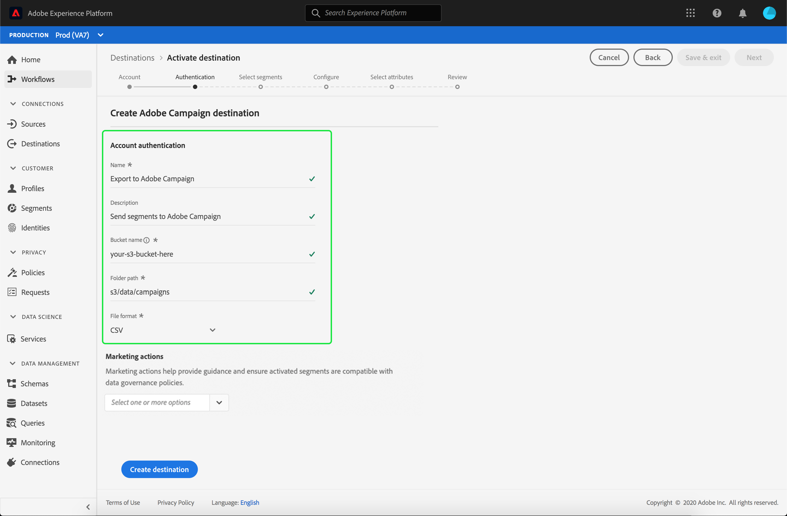

# Adobe Campaign

## Übersicht

Adobe Campaign umfasst verschiedene Lösungen, mit denen Sie Kampagnen über alle Ihre Online- und Offline-Kanäle hinweg personalisieren und bereitstellen können. Weiterführende Informationen finden Sie unter [Info zu Adobe Campaign Classic](https://experienceleague.adobe.com/docs/campaign-classic/using/getting-started/starting-with-adobe-campaign/about-adobe-campaign-classic.html).

Zum Senden von Segmentdaten an Campaign müssen Sie zuerst in der Echtzeit-Kundendatenplattform von Adobe das [Ziel verbinden](#connect-destination) und dann einen [Datenimport](#import-data-into-campaign) von Ihrem Speicherort zu Adobe Campaign einrichten.

## Exporttyp {#export-type}

**Profil-basiert** - Sie exportieren alle Segmentmitglieder zusammen mit den gewünschten Segmentfeldern (z. B.: E-Mail-Adresse, Telefonnummer, Nachname), wie im Bildschirm &quot;Attribute auswählen&quot;des Arbeitsablaufs für die [Ziel-Aktivierung](../../ui/activate-destinations.md#select-attributes)ausgewählt.

## Ziel verbinden {#connect-destination}

In **[!UICONTROL Connections]** > **[!UICONTROL Destinations]**, select Adobe Campaign, then select **[!UICONTROL Connect destination]**.

Wählen Sie im Zielverbindungs-Workflow den **[!UICONTROL Verbindungstyp]** für Ihren Speicherort aus. Bei Adobe Campaign können Sie zwischen **[!UICONTROL Amazon S3]**, **[!UICONTROL SFTP mit Passwort]** und **[!UICONTROL SFTP mit SSH-Schlüssel]** wählen. Füllen Sie je nach Verbindungstyp die folgenden Informationen aus und wählen Sie dann **[!UICONTROL Verbinden]**.

- Bei Verbindungen des Typs **[!UICONTROL Amazon S3]** müssen Sie die Zugriffsschlüsselkennung und den geheimen Zugriffsschlüssel angeben.
- Bei Verbindungen des Typs **[!UICONTROL SFTP mit Passwort]** müssen Sie Domäne, Port, Benutzernamen und Kennwort angeben.
- Bei Verbindungen des Typs **[!UICONTROL SFTP mit SSH-Schlüssel]** müssen Sie Domäne, Port, Benutzernamen und SSH-Schlüssel angeben.

Optional können Sie Ihren RSA-formatierten öffentlichen Schlüssel anhängen, um eine Verschlüsselung mit PGP/GPG zu Ihren exportierten Dateien im Abschnitt **[!UICONTROL Schlüssel]** hinzuzufügen. Beachten Sie, dass dieser öffentliche Schlüssel als Base64-kodierte Zeichenfolge geschrieben werden **muss** .

Geben Sie unter **[!UICONTROL Grundlegende Informationen]** die entsprechenden Informationen für Ihr Ziel ein, wie nachfolgend dargestellt:
- **[!UICONTROL Name]**: Wählen Sie einen passenden Namen für Ihr Ziel.
- **[!UICONTROL Beschreibung]**: Geben Sie eine Beschreibung für Ihr Ziel ein.
- **[!UICONTROL Bucket-Name]**: *Bei S3-Verbindungen*. Geben Sie den Speicherort Ihres S3-Buckets ein, an dem die Echtzeit-Kundendatenplattform Ihre Exportdaten als CSV- oder tabulatorgetrennte Dateien hinterlegen wird.
- **[!UICONTROL Ordnerpfad]**: Geben Sie den Pfad Ihres Speicherorts an, an dem die Echtzeit-Kundendatenplattform Ihre Exportdaten als CSV- oder tabulatorgetrennte Dateien hinterlegen wird.
- **[!UICONTROL Dateiformat]**: **CSV** oder **TAB_DELIMITED**. Wählen Sie das Dateiformat aus, mit dem Sie an Ihren Speicherort exportieren möchten.

Klicken Sie, nachdem Sie die Felder oben ausgefüllt haben, auf **[!UICONTROL Erstellen]**. Ihr Ziel ist nun verbunden und Sie können für das Ziel [Segmente aktivieren](../../ui/activate-destinations.md).

## Aktivieren von Segmenten {#activate-segments}

Informationen zum Workflow für die Segmentaktivierung finden Sie unter [Profile und Segmente für ein Ziel aktivieren](../../ui/activate-destinations.md).

## Zielattribute {#destination-attributes}

Beim [Aktivieren von Segmenten](../../ui/activate-destinations.md) für das Adobe Campaign-Ziel empfehlen wir, eine eindeutige Kennung aus Ihrem [Vereinigungsschema](../../../profile/home.md#profile-fragments-and-union-schemas) auszuwählen. Wählen Sie die eindeutige Kennung und alle anderen XDM-Felder aus, die Sie an das Ziel exportieren möchten. For more information, see [Select which schema fields to use as destination attributes in your exported files](./overview.md#destination-attributes) in email marketing destinations documentation.

## Exportierte Daten {#exported-data}

For [!DNL Adobe Campaign] destinations, Real-time CDP creates a tab-delimited `.txt` or `.csv` file in the storage location that you provided. Weitere Informationen zu den Dateien finden Sie unter [E-Mail-Marketing-Ziele und Cloud-Datenspeicherung-Ziele](../../ui/activate-destinations.md#esp-and-cloud-storage) im Tutorial zur Aktivierung von Segmenten.

## Datenimport in Adobe Campaign einrichten {#import-data-into-campaign}

>[!IMPORTANT]
>
>- Beachten Sie bei der Durchführung dieser Integration die Einschränkungen der SFTP-Datenspeicherung, die Datenspeicherung der Datenbank und die Einschränkungen des aktiven Profils gemäß Ihrem Adobe Campaign-Vertrag.
>- Sie müssen Ihre exportierten Segmente in Adobe Campaign mit [!DNL Campaign] Workflows planen, importieren und zuordnen. Weitere Informationen finden Sie in der Dokumentation zum Adobe Campaign unter [Einrichten eines wiederkehrenden Imports](https://experienceleague.adobe.com/docs/campaign-classic/using/automating-with-workflows/general-operation/importing-data.html#automating-with-workflows) .

After connecting Real-time CDP to your [!DNL Amazon S3] or SFTP storage, you must set up the data import from your storage location into Adobe Campaign. To learn how to accomplish this, refer to [Importing data](https://experienceleague.adobe.com/docs/campaign-classic/using/automating-with-workflows/general-operation/importing-data.html) in the Adobe Campaign documentation.