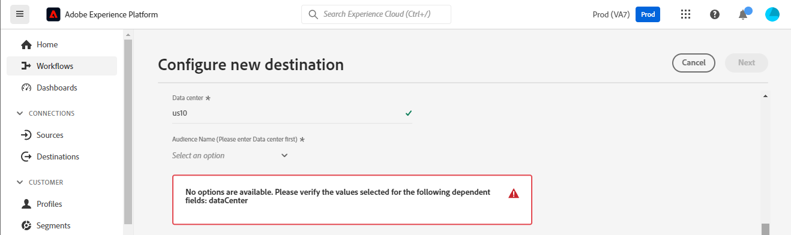

# [!DNL Mailchimp Interest Categories]-Verbindung

[[!DNL Mailchimp]](https://mailchimp.com) ist eine beliebte Marketing-Automatisierungsplattform und ein E-Mail-Marketing-Service, der von Unternehmen verwendet wird, um Kontakte zu verwalten und mit *(Kunden, Kunden oder anderen interessierten Parteien)* mithilfe von Mailinglisten und E-Mail-Marketing-Kampagnen zu sprechen. Verwenden Sie diesen Connector, um Ihre Kontakte nach deren Interessen und Präferenzen zu sortieren.

[!DNL Mailchimp Interest Categories] verwendet [Zielgruppen](https://mailchimp.com/help/getting-started-audience/), [Gruppen](https://mailchimp.com/help/getting-started-with-groups/) und Interessenkategorien *(auch als Gruppennamen oder Gruppentitel bezeichnet)*. Jede [!DNL Mailchimp] ist eine Liste von Interessenskategorien. Kontakte werden einer Interessenkategorie zugeordnet, wenn sie sich über ein Anmeldeformular auf Ihrer Website für eine oder mehrere Interessenkategorien anmelden. Innerhalb einer Audience können Sie die Kontakte auch in Gruppen organisieren und mit Interessenkategorien verknüpfen. Diese können dann verwendet werden, um Segmente zu erstellen. Sie können diese Zielgruppen verwenden, um zielgerichtete Kampagnen-E-Mails an die abonnierten Kontakte zu senden.

<!--
Compared to [!DNL Mailchimp Tags] which you would use for internal classification, [!DNL Mailchimp Interest Categories] is meant to manage subscriptions to topics of interest that your contacts might be interested in. *Note, Experience Platform also has a connection for [!DNL Mailchimp Tags], you can check it out on the [[!DNL Mailchimp Tags]](/help/destinations/catalog/email-marketing/mailchimp-tags.md) page.*
-->

Dieses [!DNL Adobe Experience Platform] [Ziel](/help/destinations/home.md) verwendet die [[!DNL Mailchimp batch subscribe or unsubscribe API]](https://mailchimp.com/developer/marketing/api/lists/batch-subscribe-or-unsubscribe/)-API, um [Interessenkategorien](https://mailchimp.com/developer/marketing/api/interest-categories/) zu erstellen und dann Kontakte aus jeder der ausgewählten Experience Platform-Zielgruppen in eine entsprechende Interessenkategorie einzufügen. Sie können **neue Kontakte hinzufügen** oder **die Informationen vorhandener [!DNL Mailchimp] Kontakte aktualisieren** und sie dann **hinzufügen oder aus ihren gewünschten Gruppen entfernen** innerhalb einer bestehenden [!DNL Mailchimp]-Zielgruppe, nachdem sie sie in einem neuen Segment aktiviert haben. [!DNL Mailchimp Interest Groups] verwendet die ausgewählten Zielgruppennamen aus Experience Platform als Interessenkategorien in [!DNL Mailchimp].

## Anwendungsfälle {#use-cases}

Damit Sie besser verstehen können, wie und wann Sie das [!DNL Mailchimp Interest Categories]-Ziel verwenden sollten, finden Sie hier ein Anwendungsbeispiel, das für Kundinnen und Kunden von Adobe Experience Platform mit diesem Ziel geeignet ist.

### Senden von E-Mails an Kontakte für Marketing-Kampagnen {#use-case-send-emails}

Die Verkaufsabteilung einer Sportartikel-Website möchte eine E-Mail-basierte Marketing-Kampagne an eine Liste von Kontakten senden, die sich selbst als fußballinteressiert identifiziert haben. Die Kontaktlisten werden im Datenexport als Batches vom Entwicklungsteam der Website getrennt und müssen daher verfolgt werden. Das Team identifiziert eine bestehende [!DNL Mailchimp]-Zielgruppe und beginnt mit der Erstellung der Experience Platform-Zielgruppen, denen die Kontakte aus jeder Liste hinzugefügt werden. Wenn diese Zielgruppen nach dem Senden an [!DNL Mailchimp Interest Categories] in der ausgewählten [!DNL Mailchimp] Zielgruppe keine Kontakte vorhanden sind, werden sie zu einer Gruppe mit dem Zielgruppennamen hinzugefügt, zu dem der Kontakt gehört. Wenn in der [!DNL Mailchimp] Zielgruppe oder Gruppe bereits Kontakte vorhanden sind, werden deren Informationen aktualisiert. Sobald die Daten an [!DNL Mailchimp Interest Categories] gesendet wurden, kann das Vertriebsteam die E-Mail zur Marketing-Kampagne auswählen und innerhalb der [!DNL Mailchimp] Zielgruppe an die Interessengruppe Fußball senden.

## Voraussetzungen {#prerequisites}

In den folgenden Abschnitten finden Sie alle Voraussetzungen, die Sie in Experience Platform und [!DNL Mailchimp] einrichten müssen, sowie Informationen, die Sie vor der Arbeit mit dem [!DNL Mailchimp Interest Categories]-Ziel sammeln müssen.

### Voraussetzungen in Experience Platform {#prerequisites-in-experience-platform}

Vor der Aktivierung der Daten für das [!DNL Mailchimp Interest Categories]-Ziel müssen Sie über ein [Schema](/help/xdm/schema/composition.md), einen [Datensatz](https://experienceleague.adobe.com/docs/platform-learn/tutorials/data-ingestion/create-datasets-and-ingest-data.html) und [Segmente](https://experienceleague.adobe.com/docs/platform-learn/tutorials/segments/create-segments.html) verfügen, die in [!DNL Experience Platform] erstellt wurden.

### Voraussetzungen für das [!DNL Mailchimp Interest Categories] Ziel {#prerequisites-destination}

Beachten Sie die folgenden Voraussetzungen, um Daten aus Experience Platform in Ihr [!DNL Mailchimp]-Konto zu exportieren:

#### Sie müssen über ein [!DNL Mailchimp] Konto verfügen {#prerequisites-account}

Bevor Sie ein [!DNL Mailchimp Interest Categories] Ziel erstellen können, müssen Sie zunächst sicherstellen, dass Sie über ein [!DNL Mailchimp] verfügen. Wenn Sie noch kein Konto haben, besuchen Sie die [[!DNL Mailchimp] Anmeldeseite](https://login.mailchimp.com/signup/) um sich zu registrieren und Ihr Konto zu erstellen.

#### Erfassen [!DNL Mailchimp] API-Schlüssels {#gather-credentials}

Sie benötigen Ihren [!DNL Mailchimp] **API-Schlüssel**, um das [!DNL Mailchimp Interest Categories]-Ziel für Ihr [!DNL Mailchimp]-Konto zu authentifizieren. Der **API-Schlüssel** dient als **Kennwort** wenn Sie [das Ziel authentifizieren](#authenticate).

Wenn Sie nicht über Ihren **API-Schlüssel** verfügen, melden Sie sich bei Ihrem Konto an und lesen Sie die Dokumentation [[!DNL Mailchimp] API-Schlüssel generieren](https://mailchimp.com/developer/marketing/guides/quick-start/#generate-your-api-key) um einen zu erstellen.

Ein Beispiel für einen API-Schlüssel ist `0123456789abcdef0123456789abcde-us14`.

>[!IMPORTANT]
>
>Wenn Sie den **API-Schlüssel** generieren, schreiben Sie ihn auf, da Sie nach der Generierung nicht mehr darauf zugreifen können.

#### Identifizieren [!DNL Mailchimp] Rechenzentrums {#identify-data-center}

Als Nächstes müssen Sie Ihr [!DNL Mailchimp] Rechenzentrum identifizieren. Melden Sie sich dazu bei Ihrem [!DNL Mailchimp]-Konto an und navigieren Sie zum Abschnitt **API-Schlüssel** Ihres Kontos.

Der Wert ist der erste Teil der URL, die Sie in Ihrem Browser sehen. Wenn die URL *https://`us14`.mailchimp.com/account/api/* lautet, wird das Rechenzentrum `us14`.

Es wird auch an Ihren API-Schlüssel in der Form *key-dc* angehängt. Wenn Ihr API-Schlüssel `0123456789abcdef0123456789abcde-us14` ist, wird das Rechenzentrum `us14`.

Notieren Sie den *des Rechenzentrums (`us14` in diesem Beispiel)* Sie benötigen diesen Wert, wenn Sie [Zieldetails ausfüllen](#destination-details).

Weitere Anleitungen finden Sie in der Dokumentation zu [[!DNL Mailchimp] Grundlagen](https://mailchimp.com/developer/marketing/docs/fundamentals/#api-structure).

### Leitlinien {#guardrails}

Jede Ihrer [!DNL Mailchimp] Zielgruppen kann bis zu 60 Gruppennamen (oder Interessenkategorien) in einer einzelnen Gruppe oder über mehrere Gruppen innerhalb derselben Zielgruppe hinweg enthalten. Unter [!DNL Mailchimp]Gruppen[ finden ](https://mailchimp.com/help/getting-started-with-groups/) weitere Informationen. Wenn Sie dieses Limit erreichen, erhalten Sie von der [!DNL Mailchimp]-API eine `400 BAD_REQUEST Cannot have more than 60 interests per list (Across all categories)` als Fehlerantwort.

Weitere Informationen zu den von der [!DNL Mailchimp]-API auferlegten Beschränkungen finden [!DNL Mailchimp] [ unter ](https://mailchimp.com/developer/marketing/docs/fundamentals/#api-limits)Ratenbeschränkungen .

## Unterstützte Identitäten {#supported-identities}

[!DNL Mailchimp] unterstützt die Aktivierung von Identitäten, die in der folgenden Tabelle beschrieben sind. Erhalten Sie weitere Informationen zu [Identitäten](/help/identity-service/features/namespaces.md).

| Ziel-Identität | Beschreibung | Zu beachten |
|---|---|---|
| E-Mail | Kontakt-E-Mail-Adresse | Obligatorisch |

{style="table-layout:auto"}

## Exporttyp und -häufigkeit {#export-type-frequency}

Beziehen Sie sich auf die folgende Tabelle, um Informationen zu Typ und Häufigkeit des Zielexports zu erhalten.

| Element | Typ | Anmerkungen |
---------|----------|---------|
| Exporttyp | **[!UICONTROL Profilbasiert]** | <ul><li>Sie exportieren alle Mitglieder eines Segments zusammen mit den gewünschten Schemafeldern *(z. B.: E-Mail-Adresse, Telefonnummer, Nachname)*, entsprechend Ihrer Feldzuordnung.</li><li> Für jede ausgewählte Zielgruppe in Experience Platform wird der entsprechende [!DNL Mailchimp Interest Categories] Segmentstatus mit dem Zielgruppenstatus aus Experience Platform aktualisiert.</li></ul> |
| Exporthäufigkeit | **[!UICONTROL Streaming]** | Streaming-Ziele sind „immer verfügbare“ API-basierte Verbindungen. Wenn ein Profil in Experience Platform auf der Grundlage einer Zielgruppenbewertung aktualisiert wird, sendet der Connector die Aktualisierung nachgelagert an die Zielplattform. Lesen Sie mehr über [Streaming-Ziele](/help/destinations/destination-types.md#streaming-destinations). |

{style="table-layout:auto"}

## Herstellen einer Verbindung mit dem Ziel {#connect}

>[!IMPORTANT]
>
>Um eine Verbindung mit dem Ziel herzustellen, benötigen Sie **[!UICONTROL Ziele anzeigen]** und **[!UICONTROL Ziele verwalten]** [Zugriffssteuerungsberechtigungen](/help/access-control/home.md#permissions). Lesen Sie die [Zugriffskontrolle – Übersicht](/help/access-control/ui/overview.md) oder wenden Sie sich an Ihren Produktadministrator, um die erforderlichen Berechtigungen zu erhalten.

Um eine Verbindung mit diesem Ziel herzustellen, gehen Sie wie im [Tutorial zur Zielkonfiguration](../../ui/connect-destination.md) beschrieben vor. Füllen Sie im Workflow zum Konfigurieren des Ziels die Felder aus, die in den beiden folgenden Abschnitten aufgeführt sind.

Suchen Sie **[!UICONTROL Ziele]** > **[!UICONTROL Katalog]** nach [!DNL Mailchimp Interest Categories]. Alternativ können Sie es unter der Kategorie **[!UICONTROL E-Mail-Marketing]** finden.

### Beim Ziel authentifizieren {#authenticate}

Um sich beim Ziel zu authentifizieren, füllen Sie die erforderlichen Felder unten aus und wählen Sie **[!UICONTROL Mit Ziel verbinden]**.

| Feld | Beschreibung |
| --- | --- |
| **[!UICONTROL Benutzername]** | Ihr [!DNL Mailchimp Interest Categories]. |
| **[!UICONTROL Passwort]** | Ihr [!DNL Mailchimp] **API-**), den Sie im Abschnitt [Sammeln [!DNL Mailchimp] Anmeldeinformationen](#gather-credentials) notiert hatten.  Ihr API-Schlüssel hat die Form von `{KEY}-{DC}`, wobei der `{KEY}` Teil auf den Wert verweist, der im Abschnitt [[!DNL Mailchimp] API-Schlüssel](#gather-credentials) angegeben ist, und der `{DC}` Teil auf das [[!DNL Mailchimp] Rechenzentrum](#identify-data-center).  Sie können entweder den `{KEY}` Teil oder das gesamte Formular angeben.  Wenn Ihr API-Schlüssel beispielsweise  *`0123456789abcdef0123456789abcde-us14`*ist, können   entweder *`0123456789abcdef0123456789abcde`*oder *`0123456789abcdef0123456789abcde-us14`*als Wert angeben. |

{style="table-layout:auto"}

Screenshot der 

Wenn die angegebenen Details gültig sind, zeigt die Benutzeroberfläche den Status **[!UICONTROL Verbunden]** mit einem grünen Häkchen an. Sie können dann mit dem nächsten Schritt fortfahren.

### Ausfüllen der Zieldetails {#destination-details}

Füllen Sie die folgenden erforderlichen und optionalen Felder aus, um Details für das Ziel zu konfigurieren. Ein Sternchen neben einem Feld in der Benutzeroberfläche zeigt an, dass das Feld erforderlich ist.

Screenshot der 

| Feld | Beschreibung |
| --- | --- |
| **[!UICONTROL Name]** | Ein Name, durch den Sie dieses Ziel in Zukunft erkennen können. |
| **[!UICONTROL Beschreibung]** | Eine Beschreibung, die Ihnen hilft, dieses Ziel in Zukunft zu identifizieren. |
| **[!UICONTROL Rechenzentrum]** | Ihr [!DNL Mailchimp]-Konto `data center`. Eine Anleitung dazu finden [ im Abschnitt  [!DNL Mailchimp] Identifizieren](#identify-data-center)Datenzentrum“. |
| **[!UICONTROL Zielgruppenname (bitte zuerst Rechenzentrum auswählen)]** | Nachdem Sie Ihr **[!UICONTROL Rechenzentrum]** ausgewählt haben, werden in dieser Dropdown-Liste automatisch die Zielgruppennamen aus Ihrem [!DNL Mailchimp]-Konto angezeigt. Wählen Sie die Zielgruppe aus, die Sie mit Daten aus Experience Platform aktualisieren möchten. |
| **[!UICONTROL Interessenkategorie (Bitte wählen Sie zuerst Datenzentrum und Zielgruppenname aus)]** | Nachdem Sie Ihren **[!UICONTROL Zielgruppennamen]** ausgewählt haben, wird dieses Dropdown-Menü automatisch mit den Namen der Interessengruppen-Kategorien aus Ihrem [!DNL Mailchimp]-Konto gefüllt. Wählen Sie den Kategorienamen aus, den Sie mit Daten aus Experience Platform aktualisieren möchten. |

{style="table-layout:auto"}

>[!TIP]
>
> Wenn der von Ihnen im Feld **[!UICONTROL Kennwort]** angegebene API-Schlüssel oder der Wert **[!UICONTROL Rechenzentrum]** falsch sind, zeigt die Benutzeroberfläche eine [!DNL Mailchimp] API-Fehlerantwort an: *`No options are available. Please verify the values selected for the following dependent fields: dataCenter`* wie unten dargestellt. In diesem Fall können Sie keinen Wert aus dem Feld **[!UICONTROL Zielgruppenname (Bitte zuerst Rechenzentrum auswählen)]** auswählen. Um diesen Fehler zu beheben, geben Sie die richtigen Werte an.

### Aktivieren von Warnhinweisen {#enable-alerts}

Sie können Warnhinweise aktivieren, um Benachrichtigungen zum Status des Datenflusses zu Ihrem Ziel zu erhalten. Wählen Sie einen Warnhinweis aus der zu abonnierenden Liste aus, um Benachrichtigungen über den Status Ihres Datenflusses zu erhalten. Weitere Informationen zu Warnhinweisen finden Sie im Handbuch zum [Abonnieren von Zielwarnhinweisen über die Benutzeroberfläche](../../ui/alerts.md).

Wenn Sie alle Details für Ihre Zielverbindung eingegeben haben, klicken Sie auf **[!UICONTROL Weiter]**.

## Aktivieren von Zielgruppen für dieses Ziel {#activate}

>[!IMPORTANT]
> 
>* Zum Aktivieren von Daten benötigen Sie die Berechtigungen **[!UICONTROL Ziele anzeigen]**, **[!UICONTROL Ziele aktivieren]**, **[!UICONTROL Profile anzeigen]** und **[!UICONTROL Segmente anzeigen]**[Zugriffssteuerung](/help/access-control/home.md#permissions). Lesen Sie die [Übersicht über die Zugriffssteuerung](/help/access-control/ui/overview.md) oder wenden Sie sich an Ihre Produktadmins, um die erforderlichen Berechtigungen zu erhalten.
>* Zum Exportieren *Identitäten* benötigen Sie die Berechtigung **[!UICONTROL Identitätsdiagramm anzeigen]** [Zugriffssteuerung](/help/access-control/home.md#permissions).   {width="100" zoomable="yes"}

Anweisungen zum Aktivieren von Zielgruppen für dieses Ziel finden Sie unter [Aktivieren von Profilen und Zielgruppen für Streaming-Zielgruppen-Exportziele](/help/destinations/ui/activate-segment-streaming-destinations.md).

### Zuordnungsüberlegungen und Beispiel {#mapping-considerations-example}

Um Ihre Zielgruppendaten ordnungsgemäß von Adobe Experience Platform an das [!DNL Mailchimp Interest Categories] Ziel zu senden, müssen Sie den Schritt zur Feldzuordnung durchlaufen. Die Zuordnung besteht darin, eine Verknüpfung zwischen den Schemafeldern Ihres Experience-Datenmodells (XDM) in Ihrem Experience Platform-Konto und den entsprechenden Entsprechungen vom Ziel zu erstellen.

Gehen Sie wie folgt vor, um Ihre XDM-Felder den [!DNL Mailchimp Interest Categories]-Zielfeldern korrekt zuzuordnen:

1. Wählen Sie Im Schritt **[!UICONTROL Zuordnung]** die Option **[!UICONTROL Neue Zuordnung hinzufügen]** aus. Auf dem Bildschirm wird nun eine neue Zuordnungszeile angezeigt.
1. Wählen Sie im Fenster **[!UICONTROL Quellfeld auswählen]** die Kategorie **[!UICONTROL Attribute auswählen]** und wählen Sie das XDM-Attribut oder den **[!UICONTROL Identity-Namespace auswählen]** und wählen Sie eine Identität aus.
1. Wählen Sie im Fenster **[!UICONTROL Zielfeld auswählen]** die Kategorie **[!UICONTROL Identity-Namespace auswählen]** und wählen Sie eine Identität oder **[!UICONTROL Attribute auswählen]** aus der Liste der Attribute aus, die von der [!DNL Mailchimp]-API ausgefüllt werden. *Alle benutzerdefinierten Attribute, die Sie der ausgewählten [!DNL Mailchimp]-Zielgruppe hinzugefügt haben, stehen auch als Zielfelder zur Auswahl.*

   Folgende Zuordnungen sind zwischen Ihrem XDM-Profilschema und [!DNL Mailchimp Interest Categories] verfügbar:

   | Quellfeld | Zielfeld | Anmerkungen |
   | --- | --- | --- |
   | `IdentityMap: Email` | `Identity: email` | Obligatorisch: Ja |
   | `xdm: person.name.firstName` | `Attribute: FNAME` | |
   | `xdm: person.name.lastName` | `Attribute: LNAME` | |
   | `xdm: person.birthDayAndMonth` | `Attribute: BIRTHDAY` | |

   Darüber hinaus ist `ADDRESS` ein spezielles Zielfeld, das in Ihrer [!DNL Mailchimp]-Zielgruppe als `merge field` bezeichnet wird. In [[!DNL Mailchimp] Dokumentation](https://mailchimp.com/developer/marketing/docs/merge-fields/) werden die erforderlichen Schlüssel wie `addr1`, `city`, `state` und `zip` sowie die optionalen Schlüssel `addr2` und `country` definiert. Die Werte für diese Felder müssen Zeichenfolgen sein. Wenn eine der `ADDRESS` Feldzuordnungen vorhanden ist, übergibt das Ziel das `ADDRESS` zur Aktualisierung an die [!DNL Mailchimp]-API. Für alle `ADDRESS` Felder, die nicht zugeordnet werden, ist standardmäßig `NULL` festgelegt, mit Ausnahme des Landes, das standardmäßig `US`.

   Für das Feld `ADDRESS` sind die folgenden Zuordnungen verfügbar:

   | Quellfeld | Zielfeld |
   | --- | --- |
   | `xdm: workAddress.street1` | `Attribute: ADDRESS.addr1` |
   | `xdm: workAddress.street2` | `Attribute: ADDRESS.addr2` |
   | `xdm: workAddress.city` | `Attribute: ADDRESS.city` |
   | `xdm: workAddress.state` | `Attribute: ADDRESS.state` |
   | `xdm: workAddress.postalCode` | `Attribute: ADDRESS.zip` |
   | `xdm: workAddress.country` | `Attribute: ADDRESS.country` |

   Sie möchten beispielsweise den Wert für `country` mit den vorhandenen Adressfeldwerten `addr1`, `city`, `state` und `zip` des Kontakts wie `132, My Street, Kingston`, `New York`, `New York` und `12401` aktualisieren. Um die `country` zu aktualisieren, müssen Sie die vorhandenen Werte mit Änderungen *(falls vorhanden)* und den neuen Wert für Land übergeben. Daher sollten die Werte in Ihrem Datensatz `132, My Street, Kingston`, `New York`, `New York`, `12401` und `US` sein. Um es noch einmal zu wiederholen: Wenn Sie nur `country` übergeben und keine Werte für `addr1`, `city`, `state` und `zip` angeben, werden diese von `NULL` überschrieben.

   Nachfolgend finden Sie ein Beispiel mit den abgeschlossenen Zuordnungen:
   Beispiel-Screenshot der Experience Platform-Benutzeroberfläche mit Feldzuordnungen.](../../assets/catalog/email-marketing/mailchimp-interest-categories/mappings.png)![

Wenn Sie mit dem Eingeben der Zuordnungen für Ihre Zielverbindung fertig sind, klicken Sie auf **[!UICONTROL Weiter]**.

## Überprüfen des Datenexports {#exported-data}

Gehen Sie wie folgt vor, um zu überprüfen, ob Sie das Ziel korrekt eingerichtet haben:

* Melden Sie sich bei Ihrem [[!DNL Mailchimp]](https://login.mailchimp.com/) an. Navigieren Sie dann zur **[!DNL Audience]**. Erweitern Sie anschließend das **[!DNL Manage Contacts]** und wählen Sie **[!DNL Groups]** aus.

* Wählen Sie die Gruppe aus und überprüfen Sie, ob die ausgewählten Zielgruppen als Kategorien mit dem Zielgruppennamen aus Experience Platform erstellt wurden, auf den möglicherweise ein automatisch generiertes Suffix folgt.
   * Dieses Ziel verwendet die Namen der ausgewählten Segmente, um die Interessenkategorie mithilfe der API [[!DNL Mailchimp] Interessenkategorie hinzufügen“ ](https://mailchimp.com/developer/marketing/api/interest-categories/add-interest-category/) erstellen. Wenn Sie ein neues Ziel erstellen und dieselben Zielgruppen erneut aktivieren, fügt [!DNL Mailchimp] ein Suffix hinzu, um zwischen den vorhandenen und den neuen Segmenten zu unterscheiden.
* Kontakte, deren E-Mails nicht in der Gruppe vorhanden waren, werden der neu erstellten Kategorie hinzugefügt.
* Bei Kontakten, die bereits in der Gruppe vorhanden sind, werden die Attributfelddaten aktualisiert und der Kontakt zur neu erstellten Kategorie hinzugefügt.

## Datennutzung und -Governance {#data-usage-governance}

Alle [!DNL Adobe Experience Platform]-Ziele sind bei der Verarbeitung Ihrer Daten mit Datennutzungsrichtlinien konform. Ausführliche Informationen darüber, wie [!DNL Adobe Experience Platform] Data Governance erzwingt, finden Sie unter [Data Governance – Übersicht](/help/data-governance/home.md).

## Fehler und Fehlerbehebung {#errors-and-troubleshooting}

### Fehler aufgetreten, wenn [!DNL Mailchimp] API-Schlüssel oder die Werte des Rechenzentrums falsch sind {#incorrect-credentials-error}

Wenn der von Ihnen im Feld **[!UICONTROL Kennwort]** angegebene API-Schlüssel oder der Wert **[!UICONTROL Rechenzentrum]** falsch sind, zeigt die Benutzeroberfläche eine [!DNL Mailchimp] API-Fehlerantwort an: *`No options are available. Please verify the values selected for the following dependent fields: dataCenter`* wie unten dargestellt. In diesem Fall können Sie keinen Wert aus dem Feld **[!UICONTROL Zielgruppenname (Bitte zuerst Rechenzentrum auswählen)]** auswählen.

Um diesen Fehler zu beheben und mit dem nächsten Schritt fortzufahren, müssen Sie die richtigen Werte angeben. Siehe [Identifizieren [!DNL Mailchimp] Rechenzentrum](#identify-data-center) und
[Gather [!DNL Mailchimp] API key](#gather-credentials)-Abschnitte, wenn Sie Anleitung benötigen.

### Fehler beim Überschreiten [!DNL Mailchimp] Limits für Gruppennamen {#group-name-limits-error}

Beim Erstellen des Ziels erhalten Sie möglicherweise die folgenden Fehlermeldungen: *`Cannot have more than 60 interests per list (Across all categories)`* oder *`400 BAD_REQUEST`*. Dies geschieht, wenn Sie die 60 Gruppennamen (oder Interessenkategorien) in einer einzelnen Gruppe oder über mehrere Gruppen hinweg innerhalb desselben Zielgruppen-Limits überschreiten, wie im Abschnitt [Leitplanken](#guardrails) beschrieben. Um diesen Fehler zu beheben, stellen Sie sicher, dass Sie das Limit für Gruppennamen in [!DNL Mailchimp] nicht überschreiten.

### [!DNL Mailchimp] Status- und Fehlercodes

Auf der [[!DNL Mailchimp] Fehlerseite](https://mailchimp.com/developer/marketing/docs/errors/) finden Sie eine umfassende Liste von Status- und Fehler-Codes mit Erläuterungen.

## Zusätzliche Ressourcen {#additional-resources}

Weitere nützliche Informationen aus der [!DNL Mailchimp] Dokumentation finden Sie unten:
* [Erste Schritte mit [!DNL Mailchimp]](https://mailchimp.com/help/getting-started-with-mailchimp/)
* [Erste Schritte mit Audiences](https://mailchimp.com/help/getting-started-audience/)
* [Zielgruppe erstellen](https://mailchimp.com/help/create-audience/)
* [Erste Schritte mit Gruppen](https://mailchimp.com/help/getting-started-with-groups/)
* [Erstellen einer neuen Zielgruppe](https://mailchimp.com/help/create-new-audience-group/)
* [Interessenkategorien](https://mailchimp.com/developer/marketing/api/interest-categories/)
* [Marketing-API](https://mailchimp.com/developer/marketing/api/)
