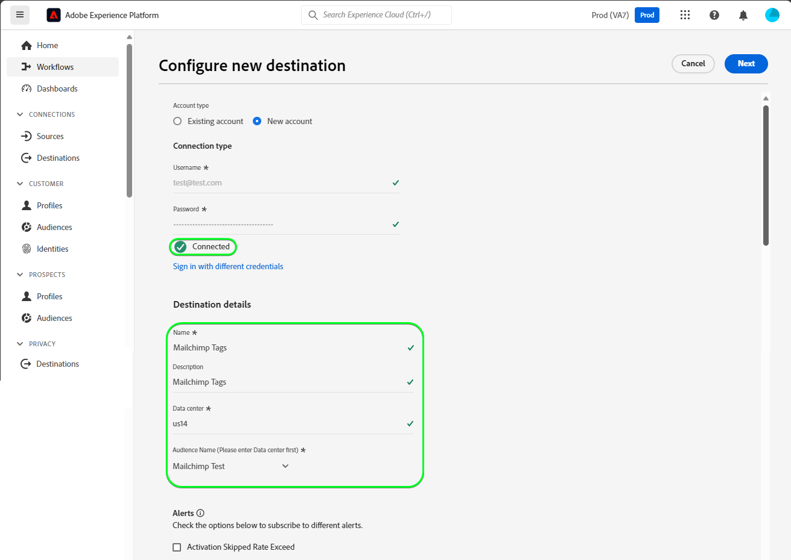

# [!DNL Mailchimp Tags]-Verbindung

[[!DNL Mailchimp]](https://mailchimp.com) *(auch bekannt als [!DNL Intuit Mailchimp])* ist eine beliebte Marketing-Automatisierungsplattform und ein E-Mail-Marketing-Service, der von Unternehmen zur Verwaltung und Kommunikation von Kontakten verwendet wird. *(Kunden, Kunden oder sonstige interessierte Parteien)* Verwendung von Mailinglisten und E-Mail-Marketing-Kampagnen.

[!DNL Mailchimp Tags] uses [Zielgruppen](https://mailchimp.com/help/getting-started-audience/) und [tags](https://mailchimp.com/help/getting-started-tags/) um Ihre Kontaktdaten zu verwalten. Tags sind Bezeichnungen, mit denen Sie Ihre Kontakte organisieren und für Ihre interne Kategorisierung in [!DNL Mailchimp].

Im Vergleich zu [!DNL Mailchimp Interest Categories] welche Sie verwenden würden, um Ihre Kontakte nach ihren Interessen und Vorlieben zu sortieren, [!DNL Mailchimp Tags] ist dazu gedacht, Abonnements für Themen zu verwalten, die für Ihre Kontakte von Interesse sein könnten. *Beachten Sie, dass Experience Platform auch eine Verbindung für [!DNL Mailchimp Interest Categories], können Sie sie im [[!DNL Mailchimp Interest Categories]](/help/destinations/catalog/email-marketing/mailchimp-interest-categories.md) Seite.*

Diese [!DNL Adobe Experience Platform] [Ziel](/help/destinations/home.md) nutzt die [[!DNL Mailchimp batch subscribe or unsubscribe API]](https://mailchimp.com/developer/marketing/api/lists/batch-subscribe-or-unsubscribe/) -Endpunkt. Sie können **neue Kontakte hinzufügen** oder **Tags vorhandener [!DNL Mailchimp] contact** innerhalb eines vorhandenen [!DNL Mailchimp] Zielgruppe, nachdem sie in einer neuen Zielgruppe aktiviert wurden. [!DNL Mailchimp Tags] verwendet die ausgewählten Zielgruppennamen aus Platform als Tag-Namen in [!DNL Mailchimp].

## Anwendungsfälle {#use-cases}

Damit Sie besser verstehen können, wie und wann Sie das [!DNL Mailchimp Tags]-Ziel verwenden sollten, finden Sie hier ein Anwendungsbeispiel, das für Kundinnen und Kunden von Adobe Experience Platform mit diesem Ziel geeignet ist.

### Senden von E-Mails an Kontakte für Marketingkampagnen {#use-case-send-emails}

Die Vertriebsabteilung einer Organisation möchte eine E-Mail-basierte Marketing-Kampagne an eine kuratierte Kontaktliste senden. Die Kontaktlisten werden in Stapeln aus verschiedenen Offline-Quellen empfangen und müssen daher verfolgt werden. Das Team identifiziert ein vorhandenes [!DNL Mailchimp] und beginnt mit der Erstellung der Experience Platform-Audiences, in die die Kontakte aus den einzelnen Listen aufgenommen werden. Nach dem Senden dieser Zielgruppen an [!DNL Mailchimp Tags], wenn in der ausgewählten Option keine Kontakte vorhanden sind [!DNL Mailchimp] Zielgruppe hinzugefügt werden, wird ihnen ein entsprechendes Tag hinzugefügt, das den Zielgruppennamen enthält, zu dem der Kontakt gehört. Wenn bereits Kontakte im [!DNL Mailchimp] Zielgruppe wird ein neues Tag mit dem Namen der Zielgruppe hinzugefügt. Da die Beschriftungen in [!DNL Mailchimp] die Offline-Quellen leicht zu identifizieren sind. Nach dem Senden der Daten an [!DNL Mailchimp] sie senden die E-Mail-Adresse der Marketing-Kampagne an die Audience.

## Voraussetzungen {#prerequisites}

In den folgenden Abschnitten finden Sie alle Voraussetzungen, die Sie unter Experience Platform einrichten müssen. [!DNL Mailchimp] und für Informationen, die Sie vor der Arbeit mit dem [!DNL Mailchimp Tags] Ziel.

### Voraussetzungen für Experience Platform {#prerequisites-in-experience-platform}

Vor der Aktivierung der Daten für [!DNL Mailchimp Tags] Ziel, müssen Sie über eine [schema](/help/xdm/schema/composition.md), a [Datensatz](https://experienceleague.adobe.com/docs/platform-learn/tutorials/data-ingestion/create-datasets-and-ingest-data.html?lang=de), und [Zielgruppen](https://experienceleague.adobe.com/docs/platform-learn/tutorials/audiences/create-audiences.html) erstellt in [!DNL Experience Platform].

### Voraussetzungen für die [!DNL Mailchimp Tags] Ziel {#prerequisites-destination}

Beachten Sie die folgenden Voraussetzungen, um Daten von Platform in Ihre [!DNL Mailchimp Tags] Konto:

#### Sie benötigen ein [!DNL Mailchimp]-Konto {#prerequisites-account}

Bevor Sie eine [!DNL Mailchimp Tags] Ziel müssen Sie zunächst sicherstellen, dass Sie über eine [!DNL Mailchimp] -Konto. Wenn Sie noch keinen Besuch haben, finden Sie unter [[!DNL Mailchimp] Anmeldeseite](https://login.mailchimp.com/signup/) , um sich zu registrieren und Ihr Konto zu erstellen.

#### Gather [!DNL Mailchimp] API-Schlüssel {#gather-credentials}

Sie benötigen Ihre [!DNL Mailchimp] **API-Schlüssel** zum Authentifizieren der [!DNL Mailchimp Interest Categories] Ziel gegen [!DNL Mailchimp] -Konto. Die **API-Schlüssel** dient als **Passwort** wenn Sie [das Ziel authentifizieren](#authenticate).

Wenn Sie Ihre **API-Schlüssel** anmelden, [!DNL Mailchimp] -Konto und siehe [!DNL Mailchimp] Dokumentation zu [Generieren Ihres API-Schlüssels](https://mailchimp.com/developer/marketing/guides/quick-start/#generate-your-api-key).

Ein Beispiel für einen API-Schlüssel ist `0123456789abcdef0123456789abcde-us14`.

>[!IMPORTANT]
>
>Wenn Sie die **API-Schlüssel**, schreiben Sie es auf, da Sie nach der Generierung nicht mehr darauf zugreifen können.

#### Identifizieren Ihrer [!DNL Mailchimp] Rechenzentrum {#identify-data-center}

Als Nächstes müssen Sie Ihre [!DNL Mailchimp] Rechenzentrum. Melden Sie sich dazu bei Ihrem [!DNL Mailchimp] -Konto und navigieren Sie zum **API-Schlüsselabschnitt** Ihres Kontos.

Die Rechenzentrum-ID ist der erste Abschnitt der URL, die im Browser angezeigt wird. Wenn die URL *https://`us14`.mailchimp.com/account/api/*, dann ist das Rechenzentrum `us14`.

Die Data Center ID wird auch an Ihren API-Schlüssel im Formular angehängt *key-dc*; wenn Ihr API-Schlüssel beispielsweise `0123456789abcdef0123456789abcde-us14`, dann ist das Rechenzentrum `us14`.

Notieren Sie sich den Wert des Rechenzentrums. *(`us14` in diesem Beispiel)*. Sie benötigen diesen Wert, wenn Sie [Zieldetails ausfüllen](#destination-details).

Weitere Informationen finden Sie im Abschnitt [[!DNL Mailchimp] Dokumentation zu Grundlagen](https://mailchimp.com/developer/marketing/docs/fundamentals/#api-structure).

### Leitplanken {#guardrails}

Siehe Abschnitt [!DNL Mailchimp] [Grenzwerte](https://mailchimp.com/developer/marketing/docs/fundamentals/#api-limits) für ausführliche Informationen über die durch die [!DNL Mailchimp] API.

## Unterstützte Identitäten {#supported-identities}

[!DNL Mailchimp] unterstützt die Aktivierung der in der folgenden Tabelle beschriebenen Identitäten. Erhalten Sie weitere Informationen zu [Identitäten](/help/identity-service/features/namespaces.md).

| Ziel-Identität | Beschreibung | Zu beachten |
|---|---|---|
| E-Mail | Die E-Mail-Adresse des Kontakts. | Obligatorisch |

{style="table-layout:auto"}

## Unterstützte Zielgruppen {#supported-audiences}

In diesem Abschnitt wird beschrieben, welche Zielgruppentypen Sie an dieses Ziel exportieren können.

| Audience Origin | Unterstützt | Beschreibung |
---------|----------|----------|
| [!DNL Segmentation Service] | ✓ | Über die Experience Platform generierte Zielgruppen [Segmentierungsdienst](../../../segmentation/home.md). |
| Benutzerdefinierte Uploads | ✓ | Zielgruppen, die aus CSV-Dateien in Experience Platform [importiert](../../../segmentation/ui/overview.md#import-audience) werden. |

{style="table-layout:auto"}

## Exporttyp und -häufigkeit {#export-type-frequency}

Beziehen Sie sich auf die folgende Tabelle, um Informationen zu Typ und Häufigkeit des Zielexports zu erhalten.

| Element | Typ | Anmerkungen |
---------|----------|---------|
| Exporttyp | **[!UICONTROL Profilbasiert]** | <ul><li>Sie exportieren alle Mitglieder einer Zielgruppe zusammen mit den gewünschten Schemafeldern *(z. B. E-Mail-Adresse, Telefonnummer, Nachname)*, entsprechend Ihrer Feldzuordnung.</li><li> Für jede in Platform ausgewählte Audience wird die entsprechende [!DNL Mailchimp Tags] Segmentstatus mit dem Zielgruppenstatus von Platform aktualisiert.</li></ul> |
| Exporthäufigkeit | **[!UICONTROL Streaming]** | Streaming-Ziele sind „immer verfügbare“ API-basierte Verbindungen. Sobald ein Profil in Experience Platform auf der Grundlage einer Zielgruppenauswertung aktualisiert wird, sendet der Connector das Update nachgelagert an die Zielplattform. Lesen Sie mehr über [Streaming-Ziele](/help/destinations/destination-types.md#streaming-destinations). |

{style="table-layout:auto"}

## Herstellen einer Verbindung mit dem Ziel {#connect}

>[!IMPORTANT]
>
>Um eine Verbindung zum Ziel herzustellen, benötigen Sie die [Zugriffsberechtigung](/help/access-control/home.md#permissions) **[!UICONTROL Ziele verwalten]**. Lesen Sie die [Zugriffskontrolle – Übersicht](/help/access-control/ui/overview.md) oder wenden Sie sich an Ihren Produktadministrator, um die erforderlichen Berechtigungen zu erhalten.

Um eine Verbindung mit diesem Ziel herzustellen, gehen Sie wie im [Tutorial zur Zielkonfiguration](../../ui/connect-destination.md) beschrieben vor. Füllen Sie im Workflow zum Konfigurieren des Ziels die Felder aus, die in den beiden folgenden Abschnitten aufgeführt sind.

Within **[!UICONTROL Ziele]** > **[!UICONTROL Katalog]**, suchen Sie nach [!DNL Mailchimp Tags]. Alternativ können Sie sie unter der **[!UICONTROL E-Mail-Marketing]** Kategorie.

### Beim Ziel authentifizieren {#authenticate}

Um sich beim Ziel zu authentifizieren, füllen Sie die erforderlichen Felder unten aus und wählen Sie **[!UICONTROL Mit Ziel verbinden]**.

| Feld | Beschreibung |
| --- | --- |
| **[!UICONTROL Benutzername]** | Ihre [!DNL Mailchimp] Benutzername. |
| **[!UICONTROL Passwort]** | Ihre [!DNL Mailchimp] **API-Schlüssel**, die Sie im Abschnitt [Gather [!DNL Mailchimp] Anmeldeinformationen](#gather-credentials) Abschnitt.  Ihr API-Schlüssel hat die Form `{KEY}-{DC}`, wobei `{KEY}` Der Teil bezieht sich auf den im [[!DNL Mailchimp] API-Schlüssel](#gather-credentials) und `{DC}` -Teil auf [[!DNL Mailchimp] Rechenzentrum](#identify-data-center).  Sie können entweder `{KEY}` oder das gesamte Formular.  Wenn Ihr API-Schlüssel beispielsweise  *`0123456789abcdef0123456789abcde-us14`*,  Sie können *`0123456789abcdef0123456789abcde`*oder *`0123456789abcdef0123456789abcde-us14`*als Wert. |

{style="table-layout:auto"}

Wenn die angegebenen Details gültig sind, zeigt die Benutzeroberfläche den Status **[!UICONTROL Verbunden]** mit einem grünen Häkchen an. Sie können dann mit dem nächsten Schritt fortfahren.

### Ausfüllen der Zieldetails {#destination-details}

Füllen Sie die folgenden erforderlichen und optionalen Felder aus, um Details für das Ziel zu konfigurieren. Ein Sternchen neben einem Feld in der Benutzeroberfläche zeigt an, dass das Feld erforderlich ist.

| Feld | Beschreibung |
| --- | --- |
| **[!UICONTROL Name]** | Ein Name, mit dem Sie dieses Ziel in der Zukunft erkennen werden. |
| **[!UICONTROL Beschreibung]** | Eine Beschreibung, die Ihnen bei der Identifizierung dieses Ziels in der Zukunft hilft. |
| **[!UICONTROL Rechenzentrum]** | Ihre [!DNL Mailchimp] account `data center`. Siehe Abschnitt [Identifizieren [!DNL Mailchimp] Rechenzentrum](#identify-data-center) für Hinweise. |
| **[!UICONTROL Zielgruppenname (Bitte geben Sie zuerst Data Center ein)]** | Nach Eingabe der **[!UICONTROL Rechenzentrum]** enthalten, wird diese Dropdown-Liste automatisch mit den Zielgruppennamen aus Ihren [!DNL Mailchimp] -Konto. Wählen Sie die Zielgruppe aus, die mit Daten aus Platform aktualisiert werden soll. |

{style="table-layout:auto"}

### Aktivieren von Warnhinweisen {#enable-alerts}

Sie können Warnhinweise aktivieren, um Benachrichtigungen zum Status des Datenflusses zu Ihrem Ziel zu erhalten. Wählen Sie einen Warnhinweis aus der zu abonnierenden Liste aus, um Benachrichtigungen über den Status Ihres Datenflusses zu erhalten. Weitere Informationen zu Warnhinweisen finden Sie im Handbuch zum [Abonnieren von Zielwarnhinweisen über die Benutzeroberfläche](../../ui/alerts.md).

Wenn Sie alle Details für Ihre Zielverbindung eingegeben haben, klicken Sie auf **[!UICONTROL Weiter]**.

## Aktivieren von Zielgruppen für dieses Ziel {#activate}

>[!IMPORTANT]
> 
>* Um Daten zu aktivieren, benötigen Sie die **[!UICONTROL Ziele anzeigen]**, **[!UICONTROL Ziele aktivieren]**, **[!UICONTROL Anzeigen von Profilen]**, und **[!UICONTROL Segmente anzeigen]** [Zugriffssteuerungsberechtigungen](/help/access-control/home.md#permissions). Lesen Sie die [Übersicht über die Zugriffssteuerung](/help/access-control/ui/overview.md) oder wenden Sie sich an Ihre Produktadmins, um die erforderlichen Berechtigungen zu erhalten.
>* Export *identities*, benötigen Sie die **[!UICONTROL Identitätsdiagramm anzeigen]** [Zugriffsberechtigung](/help/access-control/home.md#permissions).   {width="100" zoomable="yes"}

Lesen [Aktivieren von Zielgruppen für Streaming-Ziele](/help/destinations/ui/activate-segment-streaming-destinations.md) für Anweisungen zum Aktivieren von Zielgruppen für dieses Ziel.

### Zuordnungsüberlegungen und Beispiel {#mapping-considerations-example}

Um Ihre Zielgruppendaten ordnungsgemäß von Adobe Experience Platform an das [!DNL Mailchimp Tags]-Ziel zu senden, müssen Sie den Schritt zur Feldzuordnung durchlaufen. Die Zuordnung besteht darin, eine Verknüpfung zwischen den Schemafeldern Ihres Experience-Datenmodell (XDM) in Ihrem Platform-Konto und den entsprechenden Entsprechungen vom Ziel zu erstellen.

So ordnen Sie Ihre XDM-Felder korrekt der [!DNL Mailchimp Tags] Gehen Sie wie folgt vor:

1. Wählen Sie Im Schritt **[!UICONTROL Zuordnung]** die Option **[!UICONTROL Neue Zuordnung hinzufügen]** aus. Auf dem Bildschirm wird eine neue Zuordnungszeile angezeigt.
1. Im **[!UICONTROL Quellfeld auswählen]** auswählen **[!UICONTROL Identitäts-Namespace auswählen]** und wählen Sie die `Email` Identitäts-Namespace.

   

1. Im **[!UICONTROL Zielgruppenfeld auswählen]** auswählen **[!UICONTROL Identitäts-Namespace auswählen]** und wählen Sie die `Email` Identitäts-Namespace.

   

   Die Zuordnungen zwischen Ihrem XDM-Profilschema und [!DNL Mailchimp Tags] wie folgt aussehen: | Quellfeld | Zielfeld | Obligatorisch | | — | — | — | |`IdentityMap: Email`|`Identity: Email`| Ja |

   Nachfolgend finden Sie ein Beispiel mit den abgeschlossenen Zuordnungen:
   

Wenn Sie die Zuordnungen für Ihre Zielverbindung bereitgestellt haben, wählen Sie **[!UICONTROL Nächste]**.

## Überprüfen des Datenexports {#exported-data}

Gehen Sie wie folgt vor, um zu überprüfen, ob Sie das Ziel korrekt eingerichtet haben:

1. Melden Sie sich bei Ihrer [[!DNL Mailchimp]](https://login.mailchimp.com/) -Konto. Navigieren Sie dann zum **[!DNL Audience]** > **[!DNL All Contacts]** und überprüfen Sie, ob die Kontakte aus der Audience hinzugefügt und die Kontakte innerhalb der Audience mit dem Zielgruppennamen aktualisiert wurden.
   

## Datennutzung und -Governance {#data-usage-governance}

Alle [!DNL Adobe Experience Platform]-Ziele sind bei der Verarbeitung Ihrer Daten mit Datennutzungsrichtlinien konform. Ausführliche Informationen darüber, wie [!DNL Adobe Experience Platform] Data Governance erzwingt, finden Sie unter [Data Governance – Übersicht](/help/data-governance/home.md).

## Fehler und Fehlerbehebung {#errors-and-troubleshooting}

Siehe Abschnitt [[!DNL Mailchimp] Fehlerseite](https://mailchimp.com/developer/marketing/docs/errors/) für eine umfassende Liste von Status- und Fehlercodes mit Erläuterungen.

## Zusätzliche Ressourcen {#additional-resources}

Zusätzliche nützliche Informationen aus dem [!DNL Mailchimp] Die Dokumentation finden Sie unten:
* [Erste Schritte mit [!DNL Mailchimp]](https://mailchimp.com/help/getting-started-with-mailchimp/)
* [Erste Schritte mit Zielgruppen](https://mailchimp.com/help/getting-started-audience/)
* [Erstellen von Zielgruppen](https://mailchimp.com/help/create-audience/)
* [Erste Schritte mit Tags](https://mailchimp.com/help/getting-started-tags/)
* [Marketing-API](https://mailchimp.com/developer/marketing/api/)
