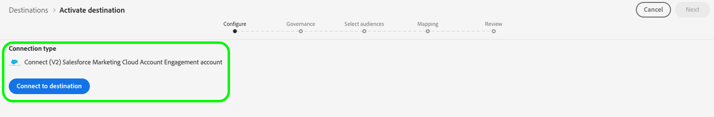

# [!DNL (V2) Salesforce Marketing Cloud Account Engagement]-Verbindung

Das Ziel [[!DNL Salesforce Marketing Cloud Account Engagement]](https://www.salesforce.com/products/marketing-cloud/marketing-automation/) (früher als [!DNL Pardot] bezeichnet) ermöglicht den Export Ihrer Adobe Experience Platform-Profildaten in die B2B-Marketing-Automatisierungsplattform von Salesforce.

Diese Integration ermöglicht eine nahtlose Datensynchronisation zwischen Ihren Kundenprofilen in Adobe Experience Platform und Ihren Marketing-Kampagnen in [!DNL Salesforce Marketing Cloud Account Engagement].

Dieses Ziel verwendet die -[[!DNL Salesforce Import API v5]](https://developer.salesforce.com/docs/marketing/pardot/guide/import-v5.html), um Batch-Datenexporte effizient zu verarbeiten.

>[!IMPORTANT]
> 
> Dies ist die V2-Version des Ziels [Salesforce Marketing Cloud Account Engagement](help/destinations/catalog/email-marketing/salesforce-marketing-cloud-account-engagement.md). Diese Version ersetzt das vorherige Ziel und befindet sich derzeit in der Alpha-Version.
> >  
> > Wenn Sie derzeit die vorherige Version des Ziels [Salesforce Marketing Cloud Account Engagement](help/destinations/catalog/email-marketing/salesforce-marketing-cloud-account-engagement.md) verwenden, müssen Sie vor dem **. Januar 2026 zu dieser Version 2**. Nach Januar 2026 wird Adobe die Vorgängerversion einstellen und nicht mehr verfügbar sein.

## Anwendungsfälle {#use-cases}

Damit Sie besser verstehen können, wie und wann Sie das [!DNL (V2) Marketing Cloud Account Engagement]-Ziel verwenden sollten, finden Sie hier einige Beispielanwendungsfälle, die Kundinnen und Kunden von Adobe Experience Platform mit diesem Ziel bewältigen können.

### B2B-Lead-Management {#use-case-lead-management}

Synchronisieren Sie Lead-Daten aus Adobe Experience Platform mit [!DNL Salesforce Marketing Cloud Account Engagement], um eine umfassende Lead-Pflege und -Bewertung zu ermöglichen. Ihr Marketing-Team kann in Experience Platform umfangreiche Zielgruppenprofile erstellen und für automatisierte B2B-Marketing-Kampagnen in [!DNL Salesforce Marketing Cloud Account Engagement] exportieren.

### Automatisierung von Campaign {#use-case-campaign-automation}

Sie können Trigger-Marketing-Kampagnen in [!DNL Salesforce Marketing Cloud Account Engagement] durchführen, indem Sie Zielgruppen verwenden, die Sie in Adobe Experience Platform definieren. Nachdem Sie Ihre Audiences in [!DNL Salesforce] exportiert haben, können Sie sie für E-Mail-Kampagnen und die Verwaltung Ihrer Leads durch Pflege, Bewertung und Kampagnensegmentierung verwenden.

### Profilanreicherung {#use-case-profile-enrichment}

Erweitern Sie Ihre [!DNL Salesforce Marketing Cloud Account Engagement] Interessentenprofile mit umfangreichen Kundendaten aus Adobe Experience Platform. Exportieren Sie umfassende Profilattribute, um detailliertere Interessentendatensätze in zu erstellen, [!DNL Salesforce Marketing Cloud Account Engagement] Targeting und Personalisierung zu verbessern.

## Voraussetzungen {#prerequisites}

In den folgenden Abschnitten finden Sie alle Voraussetzungen, die Sie in Experience Platform und [!DNL Salesforce] einrichten müssen, sowie Informationen, die Sie vor der Arbeit mit dem [!DNL (V2) Marketing Cloud Account Engagement]-Ziel sammeln müssen.

### Voraussetzungen für Experience Platform {#prerequisites-in-experience-platform}

Bevor Sie Daten für das [!DNL (V2) Marketing Cloud Account Engagement]-Ziel aktivieren, müssen Sie ein [Schema](/help/xdm/schema/composition.md), einen [Datensatz](../../../catalog/datasets/overview.md) und [Audiences](../../../segmentation/types/overview.md) in [!DNL Experience Platform] erstellt haben.

### Voraussetzungen für [!DNL Salesforce Marketing Cloud Account Engagement] {#prerequisites-destination}

Beachten Sie die folgenden Voraussetzungen, um Daten aus Experience Platform in Ihr [!DNL Marketing Cloud Account Engagement]-Konto zu exportieren:

#### Sie benötigen ein [!DNL Marketing Cloud Account Engagement]-Konto {#prerequisites-account}

Ein [!DNL Marketing Cloud Account Engagement] Konto mit einem Abonnement für das Produkt [Marketing Cloud Account Engagement](https://www.salesforce.com/products/marketing-cloud/marketing-automation/) ist erforderlich, um fortzufahren.

#### Sammeln von [!DNL Marketing Cloud Account Engagement]-Anmeldedaten {#gather-credentials}

Schreiben Sie die folgenden Elemente auf, bevor Sie sich beim [!DNL (V2) Marketing Cloud Account Engagement]-Ziel authentifizieren.

| Anmeldedaten | Beschreibung |
| --- | --- |
| **[!UICONTROL Business Unit-ID für Kontointeraktion]** | Ihre Geschäftseinheits-ID für die [!DNL Salesforce]-Kontointeraktion. Weitere Informationen zum Ermitteln der ID finden [ in ](https://help.salesforce.com/s/articleView?id=000381973&type=1) Salesforce-Dokumentation . |

{style="table-layout:auto"}

## Unterstützte Identitäten {#supported-identities}

[!DNL (V2) Marketing Cloud Account Engagement] unterstützt die Aktivierung von Identitäten, die in der folgenden Tabelle beschrieben sind. Erhalten Sie weitere Informationen zu [Identitäten](/help/identity-service/features/namespaces.md).

Wenn mithilfe einer dieser Kennungen eine Übereinstimmung gefunden wird, wird der vorhandene Datensatz für Interessenten für Kontointeraktionen mit den Daten aus Adobe Experience Platform aktualisiert. Wenn keine Übereinstimmung gefunden wird, wird in Account Engagement ein neuer Interessenten-Datensatz erstellt.

| Zielidentität | Beschreibung | Zu beachten |
|---|---|---|
| `matchId` | Interessenten-ID in Account-Interaktion | Mindestens eine dieser drei Identitäten ist erforderlich |
| `matchSalesforceId` | Salesforce Lead/Kontakt-ID des potenziellen Kunden | Mindestens eine dieser drei Identitäten ist erforderlich |
| `matchEmail` | E-Mail-Adresse des potenziellen Kunden | Mindestens eine dieser drei Identitäten ist erforderlich |

{style="table-layout:auto"}

## Exporttyp und -häufigkeit {#export-type-frequency}

Beziehen Sie sich auf die folgende Tabelle, um Informationen zu Typ und Häufigkeit des Zielexports zu erhalten.

| Element | Typ | Anmerkungen |
---------|----------|---------|
| Exporttyp | **[!UICONTROL Profilbasiert]** | <ul><li>Sie exportieren alle Mitglieder einer Zielgruppe zusammen mit den gewünschten Schemafeldern *z. B. E-Mail-Adresse, Telefonnummer, Nachname)* entsprechend Ihrer Feldzuordnung.</li><li>Dieses Ziel unterstützt den Batch-Export von Profildaten mithilfe der Salesforce Import-API v5.</li></ul> |
| Exporthäufigkeit | **[!UICONTROL Batch]** | <ul><li>**Anfänglicher Export**: Vollständiger Export unmittelbar nach der Zuordnung</li><li>**Nachfolgende Exporte**: Inkrementelle Exporte alle 3 Stunden</li><li>Dieser Zeitplan ist fest und kann in Alpha nicht angepasst werden</li></ul> |

{style="table-layout:auto"}

## Herstellen einer Verbindung mit dem Ziel {#connect}

>[!IMPORTANT]
>
>Um eine Verbindung mit dem Ziel herzustellen, benötigen Sie **[!UICONTROL Ziele anzeigen]** und **[!UICONTROL Ziele verwalten]** [Zugriffssteuerungsberechtigungen](/help/access-control/home.md#permissions). Lesen Sie die [Zugriffskontrolle – Übersicht](/help/access-control/ui/overview.md) oder wenden Sie sich an Ihren Produktadministrator, um die erforderlichen Berechtigungen zu erhalten.

Um eine Verbindung mit diesem Ziel herzustellen, gehen Sie wie im [Tutorial zur Zielkonfiguration](../../ui/connect-destination.md) beschrieben vor. Füllen Sie im Workflow zum Konfigurieren des Ziels die Felder aus, die in den beiden folgenden Abschnitten aufgeführt sind.

### Beim Ziel authentifizieren {#authenticate}

Um sich beim Ziel zu authentifizieren, wählen Sie **[!UICONTROL Mit Ziel verbinden]** aus.

Sie werden zur Anmeldeseite von [!DNL Salesforce] weitergeleitet. Geben Sie Ihre [!DNL Marketing Cloud Account Engagement] Kontoanmeldeinformationen ein und wählen Sie **[!UICONTROL Anmelden]**.

Wählen Sie anschließend **[!UICONTROL Zulassen]** aus, um der **Adobe Experience Platform**-App Berechtigungen für den Zugriff auf Ihr [!DNL Salesforce Marketing Cloud Account Engagement] zu erteilen. *Sie müssen dies nur einmal tun*.

Wenn die angegebenen Details gültig sind, zeigt die Benutzeroberfläche eine Meldung an: *Sie haben erfolgreich eine Verbindung mit dem (V2) Salesforce Marketing Cloud Account Engagement Account* hergestellt **[!UICONTROL und einen]**-Status mit einem grünen Häkchen.

### Ausfüllen der Zieldetails {#destination-details}

Füllen Sie die folgenden erforderlichen und optionalen Felder aus, um Details für das Ziel zu konfigurieren. Ein Sternchen neben einem Feld in der Benutzeroberfläche zeigt an, dass das Feld erforderlich ist.

* **[!UICONTROL Name]**: Ein Name, durch den Sie dieses Ziel in Zukunft erkennen können.
* **[!UICONTROL Beschreibung]**: Eine Beschreibung, die Ihnen hilft, dieses Ziel in Zukunft zu identifizieren.
* **[!UICONTROL Business Unit-ID für Kontointeraktion]**: Ihre [!DNL Salesforce] `Account Engagement Business Unit ID`.
* **[!UICONTROL Account Engagement API]**: Wählen Sie aus, ob Sie die Produktions- (`https://pi.pardot.com`) oder Demo- (`https://pi.demo.pardot.com`) Endpunkte der Account Engagement API verwenden möchten.
* **[!UICONTROL Account Engagement Campaign ID]**: Jeder [!DNL Account Engagement] Interessent muss einer Kampagne zugeordnet sein. Wenn Sie keine Kampagnen-ID festlegen, versucht Account Engagement automatisch, eine ID zuzuweisen, wenn in Ihrem Salesforce-Konto eine Standardeinstellung vorhanden ist.

### Aktivieren von Warnhinweisen {#enable-alerts}

Sie können Warnhinweise aktivieren, um Benachrichtigungen zum Status des Datenflusses zu Ihrem Ziel zu erhalten. Wählen Sie einen Warnhinweis aus der zu abonnierenden Liste aus, um Benachrichtigungen über den Status Ihres Datenflusses zu erhalten. Weitere Informationen zu Warnhinweisen finden Sie im Handbuch zum [Abonnieren von Zielwarnhinweisen über die Benutzeroberfläche](../../ui/alerts.md).

Wenn Sie alle Details für Ihre Zielverbindung eingegeben haben, klicken Sie auf **[!UICONTROL Weiter]**.

## Aktivieren von Zielgruppen für dieses Ziel {#activate}

>[!IMPORTANT]
> 
>* Zum Aktivieren von Daten benötigen Sie die Berechtigungen **[!UICONTROL Ziele anzeigen]**, **[!UICONTROL Ziele aktivieren]**, **[!UICONTROL Profile anzeigen]** und **[!UICONTROL Segmente anzeigen]**[Zugriffssteuerung](/help/access-control/home.md#permissions). Lesen Sie die [Übersicht über die Zugriffssteuerung](/help/access-control/ui/overview.md) oder wenden Sie sich an Ihre Produktadmins, um die erforderlichen Berechtigungen zu erhalten.
>* Zum Exportieren *Identitäten* benötigen Sie die Berechtigung **[!UICONTROL Identitätsdiagramm anzeigen]** [Zugriffssteuerung](/help/access-control/home.md#permissions).   {width="100" zoomable="yes"}

Anweisungen zum Aktivieren von Zielgruppen für dieses Ziel finden Sie unter [Aktivieren von Zielgruppendaten für Batch-Profil-Exportziele](/help/destinations/ui/activate-batch-profile-destinations.md).

### Zuordnungsüberlegungen und Beispiel {#mapping-considerations-example}

Um Zielgruppendaten von Adobe Experience Platform an das [!DNL (V2) Marketing Cloud Account Engagement] Ziel zu senden, müssen Sie Ihre Schemafelder des Experience-Datenmodells (XDM) den entsprechenden Feldern im Ziel zuordnen.

Eine vollständige Liste der unterstützten [ finden Sie in der Dokumentation zur ](https://developer.salesforce.com/docs/marketing/pardot/guide/prospect-v5.html)Salesforce Prospect API v5. Beachten Sie[ dass ](https://developer.salesforce.com/docs/marketing/pardot/guide/custom-field-v5.html)benutzerdefinierte Felder“ in der Alpha-Version nicht unterstützt werden.

#### Unterstützte Attribute {#supported-attributes}

Das Ziel Salesforce Marketing Cloud-Kontointeraktion unterstützt die in der folgenden Tabelle beschriebenen Zielattribute.

| Attribut | Typ | Beschreibung |
|---------|----------|----------|
| `salesforceId` | Zeichenfolge | Die Salesforce-ID des potenziellen Kunden |
| `salesforceOwnerId` | Ganzzahl | Die Salesforce-Benutzer-ID des potenziellen Besitzers |
| `salutation` | String | Anrede des potenziellen Kunden (z. B. Herr, Frau, Dr.) |
| `score` | Ganzzahl | Punktzahl des potenziellen Kunden bei der Kontointeraktion |
| `source` | String | Quelle des Interessenten-Datensatzes |
| `state` | String | Bundesland/Region des potenziellen Kunden |
| `territory` | String | Das dem Interessenten zugewiesene Gebiet |
| `userId` | Ganzzahl | Die dem Interessenten zugeordnete Benutzer-ID |
| `website` | String | URL der Website des Interessenten |
| `yearsInBusiness` | String | Die Anzahl der Jahre, die der potenzielle Kunde bereits im Geschäft ist |
| `zip` | String | Die Postleitzahl des potenziellen Kunden |

#### Erforderliche Zuordnungen {#required-mappings}

Bevor Sie mit der Zuordnung Ihrer Daten beginnen, überprüfen Sie die erforderlichen Feldzuordnungen unten.

| Zielfeld | Typ | Erforderlich | Verwendung |
|---|---|---|---|
| `email` | Attribut | Immer erforderlich | Die E-Mail-Adresse des Interessenten. Dies ist die primäre Kennung, um Interessentendatensätze in Account Engagement zu finden und abzugleichen, wenn Sie keine `matchId` oder `matchSalesforceId` haben.   **Hinweis:** Bei der Funktion „Mehrere Interessenten mit derselben E-Mail-Adresse zulassen“ von Account Engagement kann die ausschließliche Verwendung von E-Mails zu Unklarheiten führen, wenn mehrere Interessenten mit derselben E-Mail vorhanden sind. Bei der Kontointeraktion wird in der Regel in solchen Fällen standardmäßig der Interessent mit der neuesten Aktivität aktualisiert. |
| `matchId` | Identität | Mindestens eine dieser drei Identitäten ist erforderlich | Eine eindeutige Kennung, die von Account Engagement für jeden einzelnen Interessentendatensatz generiert wird. Verwenden Sie diese Option, wenn Sie bereits über die Account Engagement Prospect ID verfügen und sicherstellen möchten, dass Aktualisierungen auf den richtigen Interessenten angewendet werden, insbesondere wenn mehrere Interessenten dieselbe E-Mail-Adresse teilen. |
| `matchSalesforceId` | Identität | Mindestens eine dieser drei Identitäten ist erforderlich | Die Salesforce-ID eines Leads oder Kontakts in Salesforce. Verwenden Sie diese Option, wenn ein Interessent bereits mit Salesforce synchronisiert wurde, um die Datenkonsistenz zwischen Account-Interaktion und Salesforce zu gewährleisten. |
| `matchEmail` | Identität | Mindestens eine dieser drei Identitäten ist erforderlich | Die E-Mail-Adresse des Interessenten, die für den Abgleich verwendet wird. Verwenden Sie diese ID als alternative Kennung, wenn Sie nicht über die spezifische Account Engagement Prospect ID oder Salesforce ID verfügen. Hinweis: Wenn mehrere Interessenten dieselbe E-Mail-Adresse haben, aktualisiert Account Engagement in der Regel den Interessenten mit der neuesten Aktivität. |

Gehen Sie wie folgt vor, um die richtigen Felder zuzuordnen.

1. Wählen Sie Im Schritt **[!UICONTROL Zuordnung]** die Option **[!UICONTROL Neue Zuordnung hinzufügen]** aus. Auf dem Bildschirm wird eine neue Zuordnungszeile angezeigt.
1. Wählen Sie im Fenster **[!UICONTROL Quellfeld auswählen]** die Kategorie **[!UICONTROL Attribute auswählen]** und wählen Sie das XDM-Attribut oder den **[!UICONTROL Identity-Namespace auswählen]** und wählen Sie eine Identität aus.
1. Wählen Sie im Fenster **[!UICONTROL Zielfeld auswählen]** die Kategorie **[!UICONTROL Identity-Namespace auswählen]** und wählen Sie eine Identität aus oder wählen Sie **[!UICONTROL Benutzerdefinierte Attribute auswählen]** und geben Sie in der Liste der standardmäßigen Felder für Interessenten für Account-Interaktion an.

## Überprüfen des Datenexports {#exported-data}

Gehen Sie wie folgt vor, um zu überprüfen, ob Sie das Ziel korrekt eingerichtet haben:

1. Navigieren Sie zu einer der ausgewählten Zielgruppen. Wählen Sie die Registerkarte **[!DNL Activation data]** aus. Die Spalte **[!UICONTROL Zuordnungs]** zeigt den Namen des benutzerdefinierten Felds an, das innerhalb der [!DNL Marketing Cloud Account Engagement Prospects] generiert wird.
   Beispiel-Screenshot der 

1. Melden Sie sich bei der [[!DNL Salesforce]](https://login.salesforce.com/)-Website an. Navigieren Sie dann zur Seite **[!DNL Account Engagement]** > **[!DNL Prospects]** > **[!DNL Pardot Prospects]** und überprüfen Sie, ob die potenziellen Kunden aus der Audience hinzugefügt/aktualisiert wurden. Alternativ können Sie auch auf [[!DNL Account Engagement]](https://pi.pardot.com/) und die **[!DNL Prospects]** zugreifen.
   

1. Um zu überprüfen, ob die Interessenten aktualisiert wurden, wählen Sie einen Interessenten aus und überprüfen Sie, ob das benutzerdefinierte Feld des Interessenten mit dem Zielgruppenstatus von Experience Platform aktualisiert wurde.
   

## Datennutzung und -Governance {#data-usage-governance}

Alle [!DNL Adobe Experience Platform]-Ziele sind bei der Verarbeitung Ihrer Daten mit Datennutzungsrichtlinien konform. Ausführliche Informationen darüber, wie [!DNL Adobe Experience Platform] Data Governance erzwingt, finden Sie unter [Data Governance – Übersicht](/help/data-governance/home.md).

## Zusätzliche Ressourcen {#additional-resources}

* [!DNL Marketing Cloud Account Engagement] [API-Dokumentation](https://developer.salesforce.com/docs/marketing/pardot/guide/overview.html)
* [Dokumentation zur Salesforce-Import-API v5](https://developer.salesforce.com/docs/marketing/pardot/guide/import-v5.html)
* [Dokumentation zur Salesforce Prospect API v5](https://developer.salesforce.com/docs/marketing/pardot/guide/prospect-v5.html)