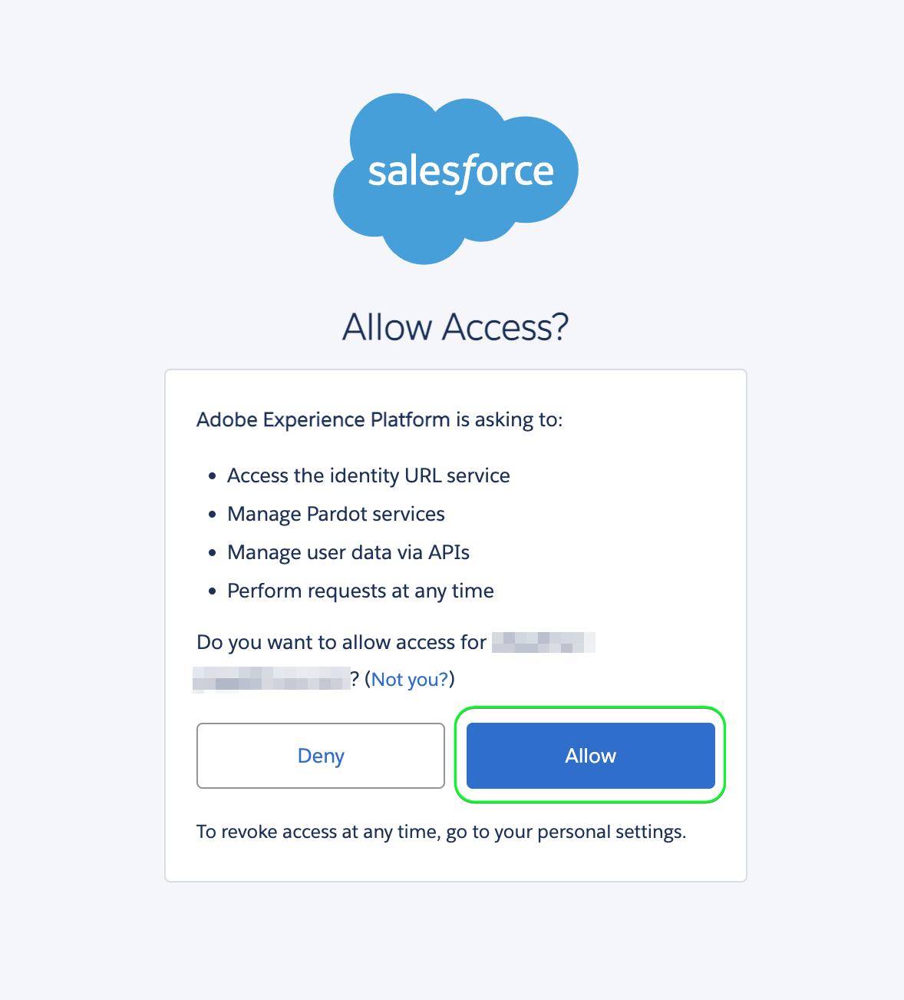
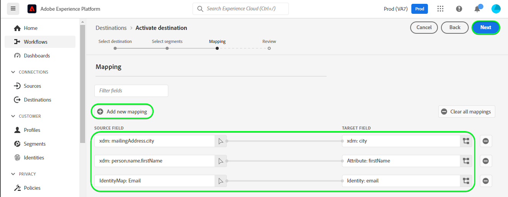

# [!DNL Salesforce Marketing Cloud Account Engagement]-Verbindung

Verwenden Sie die [[!DNL Salesforce Marketing Cloud Account Engagement]](https://www.salesforce.com/products/marketing-cloud/marketing-automation/) *(früher bekannt als [!DNL Pardot])* Ziel, um Leads zu erfassen, zu verfolgen, zu bewerten und zu bewerten. Sie können auch Lead-Tracks für alle Phasen der Pipeline für zielgerichtete Marktzielgruppen und Kundengruppen über E-Mail-Drip-Kampagnen und Lead-Management mit Pflege-, Scoring- und Kampagnensegmentierung erstellen.

Im Vergleich zu [!DNL Salesforce Marketing Cloud Engagement] die stärker auf **B2C** Marketing, [!DNL Marketing Cloud Account Engagement] ist ideal für **B2B** Anwendungsfälle, die mehrere Abteilungen und Entscheidungsträger betreffen und längere Verkaufs- und Entscheidungszyklen erfordern. Zusätzlich erhalten Sie eine engere Nähe und Integration in Ihr CRM, um geeignete Verkaufs- und Marketingentscheidungen treffen zu können. *Beachten Sie, dass Experience Platform auch Verbindungen für [!DNL Salesforce Marketing Cloud Engagement], können Sie sie auf der [[!DNL Salesforce Marketing Cloud]](/help/destinations/catalog/email-marketing/salesforce-marketing-cloud.md) und [[!DNL (API) Salesforce Marketing Cloud]](/help/destinations/catalog/email-marketing/salesforce-marketing-cloud-exact-target.md) Seiten.*

Diese [!DNL Adobe Experience Platform] [Ziel](/help/destinations/home.md) nutzt die [[!DNL Salesforce Account Engagement API > Prospect Upsert by Email]](https://developer.salesforce.com/docs/marketing/pardot/guide/prospect-v5.html#prospect-upsert-by-email) Endpunkt, bis **Leads hinzufügen oder aktualisieren** nach ihrer Aktivierung in einem neuen [!DNL Marketing Cloud Account Engagement] Segment.

[!DNL Marketing Cloud Account Engagement] verwendet das OAuth 2-Protokoll mit Autorisierungscode , um sich bei der [!DNL Account Engagement] API. Anweisungen zur Authentifizierung bei Ihrer [!DNL Marketing Cloud Account Engagement]-Instanz sehen Sie weiter unten im Abschnitt [Authentifizieren bei Ziel](#authenticate).

## Anwendungsfälle {#use-cases}

Damit Sie besser verstehen können, wie und wann Sie das [!DNL Marketing Cloud Account Engagement]-Ziel verwenden sollten, finden Sie hier ein Anwendungsbeispiel, das für Kundinnen und Kunden von Adobe Experience Platform mit diesem Ziel geeignet ist.

### Senden von E-Mails an Kontakte für Marketingkampagnen {#use-case-send-emails}

Die Marketingabteilung einer Online-Plattform möchte eine E-Mail-basierte Marketing-Kampagne an eine kuratierte Audience von B2B-Leads senden. Das Marketing-Team der Plattform kann neue Leads hinzufügen oder vorhandene Lead-Informationen über Adobe Experience Platform aktualisieren, Zielgruppen aus eigenen Offline-Daten erstellen und diese Zielgruppen an senden [!DNL Marketing Cloud Account Engagement], die dann zum Versand der E-Mail-Adresse der Marketing-Kampagne verwendet werden kann.

## Voraussetzungen {#prerequisites}

In den folgenden Abschnitten finden Sie alle Voraussetzungen, die Sie in Experience Platform einrichten müssen, und [!DNL Salesforce] und für Informationen, die Sie vor der Arbeit mit dem [!DNL Marketing Cloud Account Engagement] Ziel.

### Voraussetzungen für die Experience Platform {#prerequisites-in-experience-platform}

Vor der Aktivierung der Daten für das [!DNL Marketing Cloud Account Engagement]-Ziel müssen Sie über ein [Schema](/help/xdm/schema/composition.md), einen [Datensatz](https://experienceleague.adobe.com/docs/platform-learn/tutorials/data-ingestion/create-datasets-and-ingest-data.html?lang=de) und [Segmente](https://experienceleague.adobe.com/docs/platform-learn/tutorials/segments/create-segments.html?lang=de) verfügen, die in [!DNL Experience Platform] erstellt wurden.

### Voraussetzungen in [!DNL Marketing Cloud Account Engagement] {#prerequisites-destination}

Beachten Sie die folgenden Voraussetzungen, um Daten von Platform in Ihre [!DNL Marketing Cloud Account Engagement] Konto:

#### Sie benötigen ein [!DNL Marketing Cloud Account Engagement]-Konto {#prerequisites-account}

A [!DNL Marketing Cloud Account Engagement] -Konto mit einem Abonnement für [Interaktion mit Marketing Cloud-Konten](https://www.salesforce.com/products/marketing-cloud/marketing-automation/) Das Produkt ist für den Fortgang des Verfahrens obligatorisch.

Ihre [!DNL Salesforce] -Konto sollte [!DNL Salesforce] `Account Engagement Administrator role`. Dies ist erforderlich für [Erstellen benutzerdefinierter Interessensfelder](https://help.salesforce.com/s/articleView?id=sf.pardot_fields_create_custom_field.htm&amp;type=5).

Schließlich sollte Ihr Konto auch auf die [[!DNL Account Engagement Lightning App]](https://help.salesforce.com/s/articleView?id=sf.pardot_lightning_enable.htm&amp;type=5).

Wenden Sie sich an [[!DNL Salesforce] Support](https://www.salesforce.com/company/contact-us/?d=cta-glob-footer-10) oder [!DNL Salesforce] Kontoadministrator , wenn Sie kein Konto haben oder das Konto fehlt, [!DNL Marketing Cloud Account Engagement] Abonnement oder [!DNL Account Engagement Administrator role].

#### Sammeln von [!DNL Marketing Cloud Account Engagement]-Anmeldeinformationen {#gather-credentials}

Beachten Sie die folgenden Elemente, bevor Sie sich bei der [!DNL Marketing Cloud Account Engagement] Ziel.

| Anmeldedaten | Beschreibung |
| --- | --- |
| `Username` | Ihre [!DNL Marketing Cloud Account Engagement] Benutzername des Kontos. |
| `Password` | Ihre [!DNL Marketing Cloud Account Engagement] Kontokennwort. |
| `Account Engagement Business Unit ID` | Um die Kennung der Geschäftseinheit &quot;Kontointeraktion&quot;zu finden, verwenden Sie Einrichtung unter [!DNL Salesforce]. Geben Sie unter Einrichtung *Einrichtung von Geschäftseinheiten* im Feld &quot;Schnellsuche&quot;. Ihre Business Unit-ID für Kontointeraktion beginnt mit `0Uv` und ist 18 Zeichen lang. Wenn Sie nicht auf die Informationen zur Einrichtung der Geschäftseinheit zugreifen können, fragen Sie Ihren [!DNL Salesforce] Kontoadministrator, der Ihnen die `Account Engagement Business Unit ID`. Wenn Sie zusätzliche Anleitungen benötigen, lesen Sie den Abschnitt [[!DNL Salesforce] Authentifizierung](https://developer.salesforce.com/docs/marketing/pardot/guide/authentication) Führungsseite. |

{style="table-layout:auto"}

### Leitplanken {#guardrails}

Siehe Abschnitt [!DNL Marketing Cloud Account Engagement] [Grenzwerte](https://developer.salesforce.com/docs/marketing/pardot/guide/overview.html#rate-limits) die die durch Ihren Plan festgelegten Beschränkungen detailliert beschreibt und auch für die Hinrichtungen der Experience Platform gelten würde.

>[!IMPORTANT]
>
>Wenn [!DNL Salesforce] Kontoadministrator hat eingeschränkten Zugriff auf vertrauenswürdige IP-Bereiche, müssen Sie sie kontaktieren, um [Experience Platformen-IPs](/help/destinations/catalog/streaming/ip-address-allow-list.md) auf die Zulassungsliste gesetzt. Siehe Abschnitt [!DNL Salesforce] [Einschränken des Zugriffs auf vertrauenswürdige IP-Bereiche für eine verbundene App](https://help.salesforce.com/s/articleView?id=sf.connected_app_edit_ip_ranges.htm&amp;type=5) Dokumentation, wenn Sie zusätzliche Anleitungen benötigen.

## Unterstützte Identitäten {#supported-identities}

[!DNL Marketing Cloud Account Engagement] unterstützt die Aktualisierung von Identitäten, die in der folgenden Tabelle beschrieben werden. Erhalten Sie weitere Informationen zu [Identitäten](/help/identity-service/namespaces.md).

| Ziel-Identität | Beschreibung | Zu beachten |
|---|---|---|
| E-Mail | Prospect Email Address | Obligatorisch |

{style="table-layout:auto"}

## Exporttyp und -häufigkeit {#export-type-frequency}

Beziehen Sie sich auf die folgende Tabelle, um Informationen zu Typ und Häufigkeit des Zielexports zu erhalten.

| Element | Typ | Anmerkungen |
---------|----------|---------|
| Exporttyp | **[!UICONTROL Profilbasiert]** | <ul><li>Sie exportieren alle Mitglieder eines Segments zusammen mit den gewünschten Schemafeldern *(z. B.: E-Mail-Adresse, Telefonnummer, Nachname)*, entsprechend Ihrer Feldzuordnung.</li><li> Für jede ausgewählte Zielgruppe in Platform wird die entsprechende [!DNL Salesforce Marketing Cloud Account Engagement] Der Segmentstatus wird mit dem Zielgruppenstatus von Platform aktualisiert.</li></ul> |
| Exporthäufigkeit | **[!UICONTROL Streaming]** | Streaming-Ziele sind „immer verfügbare“ API-basierte Verbindungen. Sobald ein Profil in Experience Platform basierend auf der Zielgruppenbewertung aktualisiert wird, sendet der Connector das Update an die Zielplattform. Lesen Sie mehr über [Streaming-Ziele](/help/destinations/destination-types.md#streaming-destinations). |

{style="table-layout:auto"}

## Herstellen einer Verbindung mit dem Ziel {#connect}

>[!IMPORTANT]
>
>Um eine Verbindung zum Ziel herzustellen, benötigen Sie die [Zugriffsberechtigung](/help/access-control/home.md#permissions) **[!UICONTROL Ziele verwalten]**. Lesen Sie die [Zugriffskontrolle – Übersicht](/help/access-control/ui/overview.md) oder wenden Sie sich an Ihren Produktadministrator, um die erforderlichen Berechtigungen zu erhalten.

Um eine Verbindung mit diesem Ziel herzustellen, gehen Sie wie im [Tutorial zur Zielkonfiguration](../../ui/connect-destination.md) beschrieben vor. Füllen Sie im Workflow zum Konfigurieren des Ziels die Felder aus, die in den beiden folgenden Abschnitten aufgeführt sind.

Within **[!UICONTROL Ziele]** > **[!UICONTROL Katalog]**, suchen Sie nach [!DNL Salesforce Marketing Cloud Account Engagement]. Alternativ können Sie sie unter der **[!UICONTROL E-Mail-Marketing]** Kategorie.

### Beim Ziel authentifizieren {#authenticate}

Um sich beim Ziel zu authentifizieren, wählen Sie **[!UICONTROL Mit Ziel verbinden]**. Sie werden zum [!DNL Salesforce] Anmeldeseite. Geben Sie Ihre [!DNL Marketing Cloud Account Engagement] Kontoanmeldeinformationen und wählen Sie [!DNL Log In].

Wählen Sie als Nächstes [!UICONTROL Zulassen] im nachfolgenden Fenster, um Berechtigungen für die **Adobe Experience Platform** App für den Zugriff auf [!DNL Salesforce Marketing Cloud Account Engagement] -Konto. *Sie müssen dies nur einmal tun*.

Wenn die angegebenen Details gültig sind, zeigt die Benutzeroberfläche eine Meldung an: *Sie haben erfolgreich eine Verbindung zum Konto für die Interaktion mit Salesforce-Marketing Clouden hergestellt* und **[!UICONTROL Verbunden]** Status mit einem grünen Häkchen anzeigen, können Sie mit dem nächsten Schritt fortfahren.

### Ausfüllen der Zieldetails {#destination-details}

Füllen Sie die folgenden erforderlichen und optionalen Felder aus, um Details für das Ziel zu konfigurieren. Ein Sternchen neben einem Feld in der Benutzeroberfläche zeigt an, dass das Feld erforderlich ist. Eine Anleitung dazu finden Sie im Abschnitt [ [!DNL Marketing Cloud Account Engagement] Sammeln von -Anmeldeinformationen](#gather-credentials).

| Feld | Beschreibung |
| --- | --- |
| **[!UICONTROL Name]** | Ein Name, durch den Sie dieses Ziel in Zukunft erkennen können. |
| **[!UICONTROL Beschreibung]** | Eine Beschreibung, die Ihnen dabei hilft, dieses Ziel in der Zukunft zu identifizieren. |
| **[!UICONTROL Business Unit-ID des Kontos]** | Ihre [!DNL Salesforce] `Account Engagement Business Unit ID`. |

{style="table-layout:auto"}

### Aktivieren von Warnhinweisen {#enable-alerts}

Sie können Warnhinweise aktivieren, um Benachrichtigungen zum Status des Datenflusses zu Ihrem Ziel zu erhalten. Wählen Sie einen Warnhinweis aus der zu abonnierenden Liste aus, um Benachrichtigungen über den Status Ihres Datenflusses zu erhalten. Weitere Informationen zu Warnhinweisen finden Sie im Handbuch zum [Abonnieren von Zielwarnhinweisen über die Benutzeroberfläche](../../ui/alerts.md).

Wenn Sie alle Details für Ihre Zielverbindung eingegeben haben, klicken Sie auf **[!UICONTROL Weiter]**.

## Aktivieren von Zielgruppen für dieses Ziel {#activate}

>[!IMPORTANT]
>
>Um Daten zu aktivieren, benötigen Sie die [Zugriffskontrollberechtigungen](/help/access-control/home.md#permissions) **[!UICONTROL Ziele verwalten]**, **[!UICONTROL Ziele aktivieren]**, **[!UICONTROL Profile anzeigen]** und **[!UICONTROL Segmente anzeigen]**. Lesen Sie die [Übersicht über die Zugriffskontrolle](/help/access-control/ui/overview.md) oder wenden Sie sich an Ihren Produktadministrator, um die erforderlichen Berechtigungen zu erhalten.

Lesen [Aktivieren von Profilen und Zielgruppen für Streaming-Zielgruppenexport-Ziele](/help/destinations/ui/activate-segment-streaming-destinations.md) für Anweisungen zum Aktivieren von Zielgruppen für dieses Ziel.

### Zuordnungsüberlegungen und Beispiel {#mapping-considerations-example}

Um Ihre Zielgruppendaten ordnungsgemäß von Adobe Experience Platform an das [!DNL Marketing Cloud Account Engagement]-Ziel zu senden, müssen Sie den Schritt zur Feldzuordnung durchlaufen. Die Zuordnung besteht darin, eine Verknüpfung zwischen den Schemafeldern Ihres Experience-Datenmodells (XDM) in Ihrem Platform-Konto und den jeweiligen Entsprechungen vom Ziel zu erstellen.

So ordnen Sie Ihre XDM-Felder korrekt der [!DNL Marketing Cloud Account Engagement] Gehen Sie wie folgt vor:

1. Wählen Sie Im Schritt **[!UICONTROL Zuordnung]** die Option **[!UICONTROL Neue Zuordnung hinzufügen]** aus. Auf dem Bildschirm wird eine neue Zuordnungszeile angezeigt.
1. Im **[!UICONTROL Quellfeld auswählen]** Fenster, wählen Sie die **[!UICONTROL Attribute auswählen]** und wählen Sie das XDM-Attribut aus oder wählen Sie die **[!UICONTROL Identitäts-Namespace auswählen]** und wählen Sie eine Identität aus.
1. Im **[!UICONTROL Zielgruppenfeld auswählen]** Fenster, wählen Sie die **[!UICONTROL Identitäts-Namespace auswählen]** und wählen Sie eine Identität oder **[!UICONTROL Benutzerdefinierte Attribute auswählen]** und aus der Liste der [[!DNL Prospect API fields]](https://developer.salesforce.com/docs/marketing/pardot/guide/prospect-v5.html#fields) aus dem verfügbaren Schema.

   * Wiederholen Sie diese Schritte, um Zuordnungen zwischen Ihrem XDM-Profilschema und [!DNL Marketing Cloud Account Engagement]: | Quellfeld | Zielfeld | Obligatorisch | | — | — | — | |`IdentityMap: Email`|`Identity: email`| Ja | |`xdm: MailingAddress.city`|`xdm: city`| | |`xdm: person.name.firstName`|`Attribute: firstName`| |

   * Nachfolgend finden Sie ein Beispiel mit den oben aufgeführten Zuordnungen:
     

Wenn Sie die Zuordnungen für Ihre Zielverbindung bereitgestellt haben, wählen Sie **[!UICONTROL Nächste]**.

## Überprüfen des Datenexports {#exported-data}

Gehen Sie wie folgt vor, um zu überprüfen, ob Sie das Ziel korrekt eingerichtet haben:

1. Navigieren Sie zu einer der ausgewählten Zielgruppen. Wählen Sie die **[!DNL Activation data]** Registerkarte. Die **[!UICONTROL Zuordnungs-ID]** zeigt den Namen des benutzerdefinierten Felds an, das innerhalb der [!DNL Marketing Cloud Account Engagement Prospects] Seite.
   

1. Melden Sie sich bei der [[!DNL Salesforce]](https://login.salesforce.com/) Website. Navigieren Sie dann zum **[!DNL Account Engagement]** > **[!DNL Prospects]** > **[!DNL Pardot Prospects]** und überprüfen Sie, ob die Interessenten aus der Audience hinzugefügt/aktualisiert wurden. Alternativ können Sie auch auf [[!DNL Salesforce Pardot]](https://pi.pardot.com/) und greifen Sie auf die **[!DNL Prospects]** Seite.
   

1. Um zu überprüfen, ob die Interessenten aktualisiert wurden, wählen Sie einen Interessenten aus und überprüfen Sie, ob das benutzerdefinierte Interessensfeld mit dem Zielgruppenstatus Experience Platform aktualisiert wurde.
   

## Datennutzung und -Governance {#data-usage-governance}

Alle [!DNL Adobe Experience Platform]-Ziele sind bei der Verarbeitung Ihrer Daten mit Datennutzungsrichtlinien konform. Ausführliche Informationen darüber, wie [!DNL Adobe Experience Platform] Data Governance erzwingt, finden Sie unter [Data Governance – Übersicht](/help/data-governance/home.md).

## Zusätzliche Ressourcen {#additional-resources}

* [!DNL Marketing Cloud Account Engagement] [API-Dokumentation](https://developer.salesforce.com/docs/marketing/pardot/guide/overview.html).
