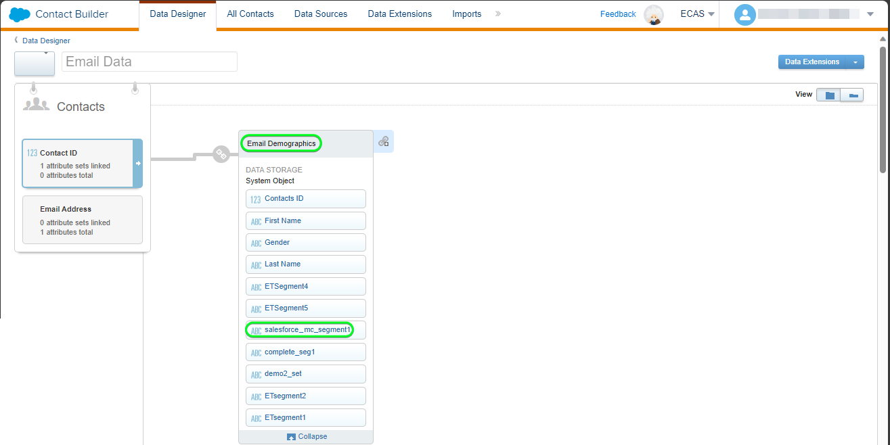

# [!DNL (API) Salesforce Marketing Cloud]-Verbindung

## Übersicht {#overview}

[[!DNL (API) Salesforce Marketing Cloud]](https://www.salesforce.com/products/marketing-cloud/engagement/) (ehemals [!DNL ExactTarget]) ist eine Digital Marketing Suite, mit der Sie Journey für Besucher und Kunden erstellen und anpassen können, um deren Erlebnis zu personalisieren.

>[!IMPORTANT]
>
> Beachten Sie den Unterschied zwischen dieser Verbindung und der anderen [[!DNL Salesforce Marketing Cloud] Verbindung](/help/destinations/catalog/email-marketing/salesforce-marketing-cloud.md), die im Abschnitt E-Mail-Marketing-Katalog vorhanden ist. Mit der anderen Salesforce-Marketing Cloud-Verbindung können Sie Dateien an einen bestimmten Speicherort exportieren, während es sich hierbei um eine API-basierte Streaming-Verbindung handelt.

Im Vergleich zu [!DNL Salesforce Marketing Cloud Account Engagement] , das stärker auf das Marketing von **B2B** ausgerichtet ist, ist das Ziel [!DNL (API) Salesforce Marketing Cloud] ideal für Anwendungsfälle mit **B2C** und kürzeren Entscheidungszyklen für Transaktionen. Sie können größere Datensätze, die das Verhalten Ihrer Zielgruppe repräsentieren, zusammenfassen, um Marketing-Kampagnen anzupassen und zu verbessern, indem Sie Kontakte priorisieren und segmentieren, insbesondere aus Datensätzen außerhalb von [!DNL Salesforce]. *Beachten Sie, dass Experience Platform auch eine Verbindung für den [[!DNL Salesforce Marketing Cloud Account Engagement]](/help/destinations/catalog/email-marketing/salesforce-marketing-cloud-account-engagement.md) hat.*

Dieses [!DNL Adobe Experience Platform] [Ziel](/help/destinations/home.md) verwendet die [!DNL Salesforce Marketing Cloud] [Kontaktaktualisierung](https://developer.salesforce.com/docs/marketing/marketing-cloud/guide/updateContacts.html) -API, mit der Sie **Kontakte hinzufügen und Kontaktdaten aktualisieren** können, nachdem Sie diese in einem neuen [!DNL Salesforce Marketing Cloud] -Segment aktiviert haben.

[!DNL Salesforce Marketing Cloud] verwendet OAuth 2 mit Client-Anmeldeinformationen als Authentifizierungsmechanismus für die Kommunikation mit der [!DNL Salesforce Marketing Cloud]-API. Anweisungen zur Authentifizierung bei Ihrer [!DNL Salesforce Marketing Cloud]-Instanz sehen Sie weiter unten im Abschnitt [Authentifizieren bei Ziel](#authenticate).

## Anwendungsfälle {#use-cases}

Damit Sie besser verstehen können, wie und wann Sie das [!DNL (API) Salesforce Marketing Cloud]-Ziel verwenden sollten, finden Sie hier ein Anwendungsbeispiel, das für Kundinnen und Kunden von Adobe Experience Platform mit diesem Ziel geeignet ist.

### Senden von E-Mails an Kontakte für Marketingkampagnen {#use-case-send-emails}

Die Vertriebsabteilung einer Heimmiet-Plattform möchte eine Marketing-E-Mail an eine zielgerichtete Kundenzielgruppe senden. Das Marketing-Team der Plattform kann neue Kontakte hinzufügen/vorhandene Kontakte *(und ihre E-Mail-Adressen)* über Adobe Experience Platform aktualisieren, Zielgruppen aus eigenen Offline-Daten erstellen und diese Zielgruppen an [!DNL Salesforce Marketing Cloud] senden, die dann zum Senden der E-Mail-Adresse für Marketingkampagnen verwendet werden können.

## Voraussetzungen {#prerequisites}

### Voraussetzungen für Experience Platform {#prerequisites-in-experience-platform}

Vor der Aktivierung der Daten für das [!DNL (API) Salesforce Marketing Cloud]-Ziel müssen Sie über ein [Schema](/help/xdm/schema/composition.md), einen [Datensatz](https://experienceleague.adobe.com/docs/platform-learn/tutorials/data-ingestion/create-datasets-and-ingest-data.html) und [Segmente](https://experienceleague.adobe.com/docs/platform-learn/tutorials/segments/create-segments.html) verfügen, die in [!DNL Experience Platform] erstellt wurden.

### Voraussetzungen in [!DNL (API) Salesforce Marketing Cloud] {#prerequisites-destination}

Beachten Sie die folgenden Voraussetzungen, um Daten von Platform in Ihr [!DNL Salesforce Marketing Cloud] -Konto zu exportieren:

#### Sie benötigen ein [!DNL Salesforce Marketing Cloud]-Konto {#prerequisites-account}

Um fortzufahren, ist ein [!DNL Salesforce Marketing Cloud] -Konto mit einem Abonnement für das Produkt [[!DNL Marketing Cloud Engagement]](https://www.salesforce.com/products/marketing-cloud/engagement/) erforderlich.

Wenden Sie sich an den [[!DNL Salesforce] Support](https://www.salesforce.com/company/contact-us/?d=cta-glob-footer-10) , wenn Sie kein [!DNL Salesforce Marketing Cloud] -Konto haben oder Ihr Konto das [!DNL Marketing Cloud Engagement] -Produktabonnement fehlt.

#### Erstellen von Attributen innerhalb von [!DNL Salesforce Marketing Cloud] {#prerequisites-attribute}

Beim Aktivieren von Zielgruppen für das Ziel [!DNL (API) Salesforce Marketing Cloud] müssen Sie im Schritt **[Zielgruppenplan](#schedule-segment-export-example)** im Feld **[!UICONTROL Zuordnungs-ID]** einen Wert für jede aktivierte Zielgruppe eingeben.

[!DNL Salesforce] erfordert diesen Wert, um von Experience Platform kommende Zielgruppen korrekt zu lesen und zu interpretieren und ihren Zielgruppenstatus innerhalb von [!DNL Salesforce Marketing Cloud] zu aktualisieren. Informationen zum Zielgruppenstatus finden Sie in der Experience Platform-Dokumentation für die Schemafeldergruppe [Zielgruppenzugehörigkeitsdetails](/help/xdm/field-groups/profile/segmentation.md) .

Für jede Zielgruppe, die Sie von Platform bis [!DNL Salesforce] aktivieren, muss das Attribut des Typs `Text` mit der Datenerweiterung [!DNL Email Demographics] innerhalb von [!DNL Salesforce Marketing Cloud] verknüpft sein. Verwenden Sie die [!DNL Salesforce Marketing Cloud] [!DNL Contact Builder], um Attribute zu erstellen. Informationen zum Erstellen von Attributen finden Sie in der Dokumentation zu [!DNL Salesforce Marketing Cloud] in [Attribut erstellen](https://help.salesforce.com/s/articleView?id=mc_cab_create_an_attribute.htm&amp;type=5&amp;language=en_US) .

Die Attributfeldnamen werden für das Zielfeld [!DNL (API) Salesforce Marketing Cloud] während des Schritts **[!UICONTROL Zuordnung]** verwendet. Je nach Ihren Geschäftsanforderungen können Sie das Feldzeichen mit maximal 4000 Zeichen definieren. Weitere Informationen zu Attributtypen finden Sie auf der Dokumentationsseite [!DNL Salesforce Marketing Cloud] [Datenerweiterungsdatentypen](https://help.salesforce.com/s/articleView?id=sf.mc_es_data_extension_data_types.htm&amp;type=5) .

Nachfolgend finden Sie ein Beispiel für den Bildschirm &quot;Data Designer&quot;in [!DNL Salesforce Marketing Cloud], dem Sie das Attribut hinzufügen werden:

Eine Ansicht einer Attributgruppe mit dem Wert [!DNL Salesforce Marketing Cloud] [!DNL Email Data] mit Attributen, die dem Zielgruppenstatus innerhalb der Datenerweiterung [!DNL Email Demographics] entsprechen, ist unten dargestellt:

Das Ziel [!DNL (API) Salesforce Marketing Cloud] verwendet die [!DNL Salesforce Marketing Cloud] [!DNL Search Attribute-Set Definitions REST] [API](https://developer.salesforce.com/docs/marketing/marketing-cloud/guide/retrieveAttributeSetDefinitions.html), um die Datenerweiterungen und die zugehörigen verknüpften Attribute dynamisch abzurufen, die in [!DNL Salesforce Marketing Cloud] definiert sind.

Diese werden im Auswahlfenster **[!UICONTROL Zielfeld]** angezeigt, wenn Sie die [Zuordnung](#mapping-considerations-example) im Workflow zu [Zielgruppen aktivieren](#activate) eingerichtet haben.

>[!IMPORTANT]
>
> Innerhalb von [!DNL Salesforce Marketing Cloud] müssen Sie Attribute mit einem **[!UICONTROL FELDNAMEN]** erstellen, der genau mit dem in **[!UICONTROL Zuordnungs-ID]** angegebenen Wert für jedes aktivierte Platform-Segment übereinstimmt. Der folgende Screenshot zeigt beispielsweise ein Attribut mit dem Namen `salesforce_mc_segment_1`. Fügen Sie beim Aktivieren einer Zielgruppe für dieses Ziel `salesforce_mc_segment_1` als **[!UICONTROL Zuordnungs-ID]** hinzu, um Zielgruppen aus Experience Platform in dieses Attribut zu füllen.

Nachfolgend finden Sie ein Beispiel für die Attributerstellung in [!DNL Salesforce Marketing Cloud]:

>[!TIP]
>
> * Fügen Sie beim Erstellen des Attributs keine Leerzeichen in den Feldnamen ein. Verwenden Sie stattdessen den Unterstrich `(_)` als Trennzeichen.
> * Um zwischen Attributen, die für Platform-Zielgruppen verwendet werden, und anderen Attributen innerhalb von [!DNL Salesforce Marketing Cloud] zu unterscheiden, können Sie ein erkennbares Präfix oder Suffix für die Attribute einfügen, die für Adobe-Segmente verwendet werden. Verwenden Sie beispielsweise anstelle von `test_segment` `Adobe_test_segment` oder `test_segment_Adobe`.
> * Wenn Sie bereits andere Attribute in [!DNL Salesforce Marketing Cloud] erstellt haben, können Sie denselben Namen wie das Platform-Segment verwenden, um die Zielgruppe in [!DNL Salesforce Marketing Cloud] einfach zu identifizieren.

#### Zuweisen von Benutzerrollen und Berechtigungen innerhalb von [!DNL Salesforce Marketing Cloud] {#prerequisites-roles-permissions}

Da [!DNL Salesforce Marketing Cloud] benutzerdefinierte Rollen je nach Anwendungsfall unterstützt, sollte Ihrem Benutzer die entsprechenden Rollen zugewiesen werden, um Ihre Attribute in [!DNL Salesforce Marketing Cloud] zu aktualisieren. Nachfolgend finden Sie ein Beispiel für Benutzerrollen:

Je nachdem, welchen Rollen Ihr [!DNL Salesforce Marketing Cloud] -Benutzer zugewiesen wurde, müssen Sie auch der [!DNL Salesforce Marketing Cloud] -Datenerweiterung Berechtigungen zuweisen, die mit den Feldern verknüpft sind, die Sie aktualisieren möchten.

Da für dieses Ziel der Zugriff auf die `[!DNL data extension]` erforderlich ist, müssen Sie sie zulassen. Beispielsweise müssen Sie für die `Email` [!DNL data extension] Folgendes zulassen:

Um die Zugriffsebene zu beschränken, können Sie auch den individuellen Zugriff mithilfe granularer Berechtigungen überschreiben.

Detaillierte Anleitungen finden Sie auf den Seiten [[!DNL Marketing Cloud Roles]](https://help.salesforce.com/s/articleView?language=en_US&amp;id=sf.mc_overview_marketing_cloud_roles.htm&amp;type=5) und [[!DNL Marketing Cloud Roles and Permissions]](https://help.salesforce.com/s/articleView?language=en_US&amp;id=sf.mc_overview_roles.htm&amp;type=5) .

#### Sammeln von [!DNL Salesforce Marketing Cloud]-Anmeldeinformationen {#gather-credentials}

Beachten Sie die folgenden Elemente, bevor Sie sich beim [!DNL (API) Salesforce Marketing Cloud]-Ziel authentifizieren.

| Anmeldedaten | Beschreibung | Beispiel |
| --- | --- | --- |
| Subdomain | Unter [[!DNL Salesforce Marketing Cloud domain prefix]](https://developer.salesforce.com/docs/marketing/marketing-cloud/guide/your-subdomain-tenant-specific-endpoints.html) erfahren Sie, wie Sie diesen Wert über die [!DNL Salesforce Marketing Cloud] -Oberfläche abrufen. | Wenn Ihre [!DNL Salesforce Marketing Cloud] -Domäne   ist *`mcq4jrssqdlyc4lph19nnqgzzs84`.login.executeTarget.com*,  Sie müssen `mcq4jrssqdlyc4lph19nnqgzzs84` als Wert angeben. |
| Client-ID | Informationen zum Abrufen dieses Werts aus der Benutzeroberfläche von [!DNL Salesforce Marketing Cloud] finden Sie in der [!DNL Salesforce Marketing Cloud] [Dokumentation](https://developer.salesforce.com/docs/marketing/marketing-cloud/guide/access-token-s2s.html) . | r23kxxxxxxxx0z05xxxxxx |
| Client-Geheimnis | Informationen zum Abrufen dieses Werts aus der Benutzeroberfläche von [!DNL Salesforce Marketing Cloud] finden Sie in der [!DNL Salesforce Marketing Cloud] [Dokumentation](https://developer.salesforce.com/docs/marketing/marketing-cloud/guide/access-token-s2s.html) . | ipxxxxxxxxxxT4xxxxxxxxxxxx |

{style="table-layout:auto"}

### Leitplanken {#guardrails}

* Salesforce legt bestimmte [Ratenbeschränkungen](https://developer.salesforce.com/docs/marketing/marketing-cloud/guide/rate-limiting.html) fest.
   * In der Dokumentation [!DNL Salesforce Marketing Cloud] [Dokumentation](https://developer.salesforce.com/docs/marketing/marketing-cloud/guide/rate-limiting-errors.html) finden Sie Informationen zu möglichen Beschränkungen, die bei der Ausführung auftreten könnten, sowie zur Reduzierung von Fehlern bei der Ausführung.
   * Auf der Seite [[!DNL Salesforce Marketing Cloud] Interaktionspreise](https://www.salesforce.com/editions-pricing/marketing-cloud/email/) finden Sie die Informationen unter *Vergleichstabelle für die Vollversion herunterladen* als pdf, in dem die durch Ihren Plan festgelegten Beschränkungen beschrieben werden.
   * Auf der Seite [API-Übersicht](https://developer.salesforce.com/docs/marketing/marketing-cloud/guide/apis-overview.html) sind zusätzliche Einschränkungen aufgeführt.
   * Eine Seite mit diesen Details finden Sie unter [hier](https://salesforce.stackexchange.com/questions/205898/marketing-cloud-api-limits) .
* Die Anzahl der pro Objekt *zulässigen* benutzerdefinierten Felder variiert je nach Salesforce Edition.
   * Weitere Anleitungen finden Sie in der Dokumentation zu [!DNL Salesforce] [Dokumentation](https://help.salesforce.com/s/articleView?id=sf.custom_field_allocations.htm&amp;type=5) .
   * Wenn Sie die für *benutzerdefinierte Felder, die pro Objekt* innerhalb von [!DNL Salesforce Marketing Cloud] zulässig sind, definierte Grenze erreicht haben, müssen Sie
      * Entfernen Sie ältere Attribute, bevor Sie neue Attribute in [!DNL Salesforce Marketing Cloud] hinzufügen.
      * Aktualisieren oder entfernen Sie aktivierte Zielgruppen in Platform-Zielen, die diese älteren Attributnamen als Wert verwenden, der während des Schritts [Zielgruppenplanung](#schedule-segment-export-example) für die **[!UICONTROL Zuordnungs-ID]** angegeben wurde.

## Unterstützte Identitäten {#supported-identities}

[!DNL (API) Salesforce Marketing Cloud] unterstützt die Aktivierung von Identitäten, die in der folgenden Tabelle beschrieben sind. Erhalten Sie weitere Informationen zu [Identitäten](/help/identity-service/features/namespaces.md).

| Ziel-Identität | Beschreibung | Zu beachten |
|---|---|---|
| contactKey | [!DNL Salesforce Marketing Cloud] Kontaktschlüssel. Weitere Hinweise finden Sie in der Dokumentation zu [!DNL Salesforce Marketing Cloud] [Dokumentation](https://help.salesforce.com/s/articleView?id=sf.mc_cab_contact_builder_best_practices.htm&amp;type=5) . | Obligatorisch |

## Unterstützte Zielgruppen {#supported-audiences}

In diesem Abschnitt wird beschrieben, welche Zielgruppentypen Sie an dieses Ziel exportieren können.

| Audience Origin | Unterstützt | Beschreibung |
|---------|----------|----------|
| [!DNL Segmentation Service] | ✓ | Zielgruppen, die durch den Experience Platform [Segmentierungsdienst](../../../segmentation/home.md) generiert wurden. |
| Benutzerdefinierte Uploads | X | Zielgruppen, die aus CSV-Dateien in Experience Platform [importiert](../../../segmentation/ui/audience-portal.md#import-audience) werden. |

{style="table-layout:auto"}

## Exporttyp und -häufigkeit {#export-type-frequency}

Beziehen Sie sich auf die folgende Tabelle, um Informationen zu Typ und Häufigkeit des Zielexports zu erhalten.

| Element | Typ | Anmerkungen |
---------|----------|---------|
| Exporttyp | **[!UICONTROL Profilbasiert]** | <ul><li>Sie exportieren alle Mitglieder eines Segments zusammen mit den gewünschten Schemafeldern *(z. B.: E-Mail-Adresse, Telefonnummer, Nachname)*, entsprechend Ihrer Feldzuordnung.</li><li> Jeder Segmentstatus in [!DNL Salesforce Marketing Cloud] wird mit dem entsprechenden Zielgruppenstatus von Platform aktualisiert, basierend auf dem Wert **[!UICONTROL Zuordnungs-ID]** , der während des Schritts [Zielgruppenplanung](#schedule-segment-export-example) angegeben wurde.</li></ul> |
| Exporthäufigkeit | **[!UICONTROL Streaming]** | Streaming-Ziele sind „immer verfügbare“ API-basierte Verbindungen. Sobald ein Profil in Experience Platform auf der Grundlage einer Zielgruppenauswertung aktualisiert wird, sendet der Connector das Update nachgelagert an die Zielplattform. Lesen Sie mehr über [Streaming-Ziele](/help/destinations/destination-types.md#streaming-destinations). |

{style="table-layout:auto"}

## Herstellen einer Verbindung mit dem Ziel {#connect}

>[!IMPORTANT]
>
> Um eine Verbindung zum Ziel herzustellen, benötigen Sie die [Zugriffsberechtigung](/help/access-control/home.md#permissions) **[!UICONTROL Ziele verwalten]**. Lesen Sie die [Zugriffskontrolle – Übersicht](/help/access-control/ui/overview.md) oder wenden Sie sich an Ihren Produktadministrator, um die erforderlichen Berechtigungen zu erhalten.

Um eine Verbindung mit diesem Ziel herzustellen, gehen Sie wie im [Tutorial zur Zielkonfiguration](../../ui/connect-destination.md) beschrieben vor. Füllen Sie im Workflow zum Konfigurieren des Ziels die Felder aus, die in den beiden folgenden Abschnitten aufgeführt sind.

Suchen Sie in **[!UICONTROL Ziele]** > **[!UICONTROL Katalog]** nach [!DNL (API) Salesforce Marketing Cloud]. Alternativ können Sie ihn unter der Kategorie **[!UICONTROL E-Mail-Marketing]** finden.

### Beim Ziel authentifizieren {#authenticate}

Um sich beim Ziel zu authentifizieren, füllen Sie die erforderlichen Felder unten aus und wählen Sie **[!UICONTROL Mit Ziel verbinden]** aus. Eine Anleitung finden Sie im Abschnitt [Anmeldedaten sammeln [!DNL Salesforce Marketing Cloud] 2} .](#gather-credentials)

| [!DNL (API) Salesforce Marketing Cloud] Ziel | [!DNL Salesforce Marketing Cloud] |
| --- | --- |
| **[!UICONTROL Subdomain]** | Ihr [!DNL Salesforce Marketing Cloud]-Domänenpräfix.  Wenn Ihre Domäne beispielsweise   ist *`mcq4jrssqdlyc4lph19nnqgzzs84`.login.executeTarget.com*,   Sie müssen als Wert `mcq4jrssqdlyc4lph19nnqgzzs84` angeben. |
| **[!UICONTROL Client-ID]** | Ihr [!DNL Salesforce Marketing Cloud] `Client ID`. |
| **[!UICONTROL Client Secret]** (Client-Geheimnis) | Ihr [!DNL Salesforce Marketing Cloud] `Client Secret`. |

Wenn die angegebenen Details gültig sind, zeigt die Benutzeroberfläche den Status **[!UICONTROL Verbunden]** mit einem grünen Häkchen an. Sie können dann mit dem nächsten Schritt fortfahren.

### Ausfüllen der Zieldetails {#destination-details}

Füllen Sie die folgenden erforderlichen und optionalen Felder aus, um Details für das Ziel zu konfigurieren. Ein Sternchen neben einem Feld in der Benutzeroberfläche zeigt an, dass das Feld erforderlich ist.

* **[!UICONTROL Name]**: Ein Name, durch den Sie dieses Ziel in Zukunft erkennen können.
* **[!UICONTROL Beschreibung]**: Eine Beschreibung, die Ihnen hilft, dieses Ziel in Zukunft zu identifizieren.

### Aktivieren von Warnhinweisen {#enable-alerts}

Sie können Warnhinweise aktivieren, um Benachrichtigungen zum Status des Datenflusses zu Ihrem Ziel zu erhalten. Wählen Sie einen Warnhinweis aus der zu abonnierenden Liste aus, um Benachrichtigungen über den Status Ihres Datenflusses zu erhalten. Weitere Informationen zu Warnhinweisen finden Sie im Handbuch zum [Abonnieren von Zielwarnhinweisen über die Benutzeroberfläche](../../ui/alerts.md).

Wenn Sie alle Details für Ihre Zielverbindung eingegeben haben, klicken Sie auf **[!UICONTROL Weiter]**.

## Aktivieren von Zielgruppen für dieses Ziel {#activate}

>[!IMPORTANT]
> 
> * Um Daten zu aktivieren, benötigen Sie die Zugriffssteuerungsberechtigungen **[!UICONTROL Ziele anzeigen]**, **[!UICONTROL Ziele aktivieren]**, **[!UICONTROL Profile anzeigen]** und **[!UICONTROL Segmente anzeigen]** [. ](/help/access-control/home.md#permissions) Lesen Sie die [Übersicht über die Zugriffssteuerung](/help/access-control/ui/overview.md) oder wenden Sie sich an Ihre Produktadmins, um die erforderlichen Berechtigungen zu erhalten.
> * Um *identities* zu exportieren, benötigen Sie die Zugriffssteuerungsberechtigung **[!UICONTROL Identitätsdiagramm anzeigen]** .   {width="100" zoomable="yes"}

Anweisungen zum Aktivieren von Zielgruppen für dieses Ziel finden Sie unter [Aktivieren von Profilen und Zielgruppen für Streaming-Zielgruppen-Exportziele](/help/destinations/ui/activate-segment-streaming-destinations.md).

### Zuordnungsüberlegungen und Beispiel {#mapping-considerations-example}

Um Ihre Zielgruppendaten ordnungsgemäß von Adobe Experience Platform an das [!DNL (API) Salesforce Marketing Cloud]-Ziel zu senden, müssen Sie den Schritt zur Feldzuordnung durchlaufen. Die Zuordnung besteht darin, eine Verknüpfung zwischen den Schemafeldern Ihres Experience-Datenmodell (XDM) in Ihrem Platform-Konto und den entsprechenden Entsprechungen vom Ziel zu erstellen.

Gehen Sie wie folgt vor, um Ihre XDM-Felder korrekt den [!DNL (API) Salesforce Marketing Cloud] -Zielfeldern zuzuordnen.

>[!IMPORTANT]
>
> * Obwohl Ihre Attributnamen gemäß Ihrem [!DNL Salesforce Marketing Cloud] -Konto angegeben werden, sind die Zuordnungen für sowohl `contactKey` als auch `personalEmail.address` obligatorisch.
>
> * Die Integration mit der [!DNL Salesforce Marketing Cloud] -API unterliegt einer Paginierungsbegrenzung dahingehend, wie viele Attribute Experience Platform aus Salesforce abrufen kann. Das bedeutet, dass im Schritt **[!UICONTROL Zuordnung]** das Zielfeldschema maximal 2000 Attribute aus Ihrem Salesforce-Konto anzeigen kann.

1. Wählen Sie Im Schritt **[!UICONTROL Zuordnung]** die Option **[!UICONTROL Neue Zuordnung hinzufügen]** aus. Auf dem Bildschirm wird eine neue Zuordnungszeile angezeigt.
   
1. Wählen Sie im Fenster **[!UICONTROL Quellfeld auswählen]** die Kategorie **[!UICONTROL Attribute auswählen]** aus, wählen Sie das XDM-Attribut aus oder wählen Sie den Eintrag **[!UICONTROL Identitäts-Namespace auswählen]** und wählen Sie eine Identität aus.
1. Wählen Sie im Fenster **[!UICONTROL Zielfeld auswählen]** den Eintrag **[!UICONTROL Identitäts-Namespace auswählen]** aus, wählen Sie eine Identität aus oder wählen Sie die Kategorie **[!UICONTROL Attribute auswählen]** und wählen Sie ein Attribut aus den angezeigten Datenerweiterungen nach Bedarf aus. Das Ziel [!DNL (API) Salesforce Marketing Cloud] verwendet die [!DNL Salesforce Marketing Cloud] [!DNL Search Attribute-Set Definitions REST] [API](https://developer.salesforce.com/docs/marketing/marketing-cloud/guide/retrieveAttributeSetDefinitions.html), um die Datenerweiterungen und die zugehörigen verknüpften Attribute dynamisch abzurufen, die in [!DNL Salesforce Marketing Cloud] definiert sind. Diese werden im Popup-Fenster **[!UICONTROL Zielfeld]** angezeigt, wenn Sie die [Zuordnung](#mapping-considerations-example) im Workflow [Zielgruppen aktivieren](#activate) einrichten.

   * Wiederholen Sie diese Schritte, um die folgenden Zuordnungen zwischen Ihrem XDM-Profilschema und [!DNL (API) Salesforce Marketing Cloud] hinzuzufügen:

     | Quellfeld | Zielfeld | Obligatorisch |
     |---|---|---|
     | `IdentityMap: contactKey` | `Identity: salesforceContactKey` | `Mandatory` |
     | `xdm: personalEmail.address` | `Attribute: Email Address` aus der Datenerweiterung [!DNL Salesforce Marketing Cloud] [!DNL Email Addresses]. | `Mandatory` beim Hinzufügen neuer Kontakte. |
     | `xdm: person.name.firstName` | `Attribute: First Name` aus der gewünschten [!DNL Salesforce Marketing Cloud] -Datenerweiterung. | – |

   * Nachfolgend finden Sie ein Beispiel für die Verwendung dieser Zuordnungen:
     

Wenn Sie die Zuordnungen für Ihre Zielverbindung bereitgestellt haben, wählen Sie **[!UICONTROL Weiter]** aus.

### Zielgruppenexport und Beispiel planen {#schedule-segment-export-example}

Beim Ausführen des Schritts [Zielgruppenexport planen](/help/destinations/ui/activate-segment-streaming-destinations.md#scheduling) müssen Sie Platform-Zielgruppen den [Attributen](#prerequisites-attribute) in [!DNL Salesforce Marketing Cloud] manuell zuordnen.

Wählen Sie dazu jedes Segment aus und geben Sie dann im Feld [!DNL (API) Salesforce Marketing Cloud] **[!UICONTROL Zuordnungs-ID]** den Namen des Attributs von [!DNL Salesforce Marketing Cloud] ein. Anleitungen und Best Practices zum Erstellen von Attributen in [!DNL Salesforce Marketing Cloud] finden Sie im Abschnitt [Attribut in  [!DNL Salesforce Marketing Cloud]](#prerequisites-custom-field) erstellen .

Wenn Ihr [!DNL Salesforce Marketing Cloud] -Attribut beispielsweise `salesforce_mc_segment_1` ist, geben Sie diesen Wert in der [!DNL (API) Salesforce Marketing Cloud] **[!UICONTROL Zuordnungs-ID]** an, um Zielgruppen aus Experience Platform in dieses Attribut einzufügen.

Nachfolgend finden Sie ein Beispielattribut von [!DNL Salesforce Marketing Cloud]:

Unten finden Sie ein Beispiel, das die Position der [!DNL (API) Salesforce Marketing Cloud] **[!UICONTROL Zuordnungs-ID]** angibt:

Wie gezeigt, sollte die [!DNL (API) Salesforce Marketing Cloud] **[!UICONTROL Zuordnungs-ID]** genau mit dem in [!DNL Salesforce Marketing Cloud] **[!UICONTROL FELDNAME]** angegebenen Wert übereinstimmen.

Wiederholen Sie diesen Abschnitt für jedes aktivierte Platform-Segment.

Ein typisches Beispiel, das auf dem oben gezeigten Bild basiert, könnte sein.
| [!DNL (API) Salesforce Marketing Cloud] Segmentname | [!DNL Salesforce Marketing Cloud] **[!UICONTROL FELDNAME]** | [!DNL (API) Salesforce Marketing Cloud] **[!UICONTROL Zuordnungs-ID]** |
| — | — | — |
| salesforce mc audience 1 | `salesforce_mc_segment_1` | `salesforce_mc_segment_1` |
| salesforce mc audience 2 | `salesforce_mc_segment_2` | `salesforce_mc_segment_2` |

## Überprüfen des Datenexports {#exported-data}

Gehen Sie wie folgt vor, um zu überprüfen, ob Sie das Ziel korrekt eingerichtet haben:

1. Wählen Sie **[!UICONTROL Ziele]** > **[!UICONTROL Durchsuchen]** aus, um zur Liste der Ziele zu navigieren.
   

1. Wählen Sie das Ziel aus und überprüfen Sie, ob der Status **[!UICONTROL aktiviert]** ist.
   

1. Wechseln Sie zur Registerkarte **[!DNL Activation data]** und wählen Sie einen Zielgruppennamen aus.
   

1. Überwachen Sie die Zielgruppenzusammenfassung und stellen Sie sicher, dass die Anzahl der Profile der im Segment erstellten Anzahl entspricht.
   

1. Melden Sie sich bei der Website [[!DNL Salesforce Marketing Cloud]](https://mc.exacttarget.com/) an. Navigieren Sie dann zur Seite **[!DNL Audience Builder]** > **[!DNL Contact Builder]** > **[!DNL All contacts]** > **[!DNL Email]** und überprüfen Sie, ob die Profile aus der Audience hinzugefügt wurden.
   

1. Um zu überprüfen, ob Profile aktualisiert wurden, navigieren Sie zur Seite **[!UICONTROL E-Mail]** und überprüfen Sie, ob die Attributwerte für das Profil aus der Zielgruppe aktualisiert wurden. Bei erfolgreicher Ausführung können Sie sehen, dass jeder Zielgruppenstatus in [!DNL Salesforce Marketing Cloud] basierend auf dem im Schritt [Zielgruppenplanung](#schedule-segment-export-example) angegebenen Wert für die **[!UICONTROL Zuordnungs-ID]** mit dem entsprechenden Zielgruppenstatus von Platform aktualisiert wurde.
   

## Datennutzung und -Governance {#data-usage-governance}

Alle [!DNL Adobe Experience Platform]-Ziele sind bei der Verarbeitung Ihrer Daten mit Datennutzungsrichtlinien konform. Ausführliche Informationen darüber, wie [!DNL Adobe Experience Platform] Data Governance erzwingt, finden Sie unter [Data Governance – Übersicht](/help/data-governance/home.md).

## Fehler und Fehlerbehebung {#errors-and-troubleshooting}

### Unbekannte Fehler beim Senden von Ereignissen an das Salesforce-Marketing Cloud {#unknown-errors}

* Beim Überprüfen eines Datenfluss-Ablaufs wird möglicherweise die folgende Fehlermeldung ausgegeben: `Unknown errors encountered while pushing events to the destination. Please contact the administrator and try again.`
  

   * Um diesen Fehler zu beheben, überprüfen Sie, ob die **[!UICONTROL Zuordnungs-ID]**, die Sie im Aktivierungs-Workflow für das Ziel [!DNL (API) Salesforce Marketing Cloud] angegeben haben, genau mit dem Namen des Attributs übereinstimmt, das Sie in [!DNL Salesforce Marketing Cloud] erstellt haben. Eine Anleitung dazu finden Sie im Abschnitt [Attribut in  [!DNL Salesforce Marketing Cloud]](#prerequisites-custom-field) erstellen .

* Beim Aktivieren eines Segments erhalten Sie möglicherweise eine Fehlermeldung: `The client's IP address is unauthorized for this account. Allowlist the client's IP address...`
   * Um diesen Fehler zu beheben, wenden Sie sich an Ihren [!DNL Salesforce Marketing Cloud] -Kontoadministrator, um [Experience Platform IP-Adressen](/help/destinations/catalog/streaming/ip-address-allow-list.md) zu den vertrauenswürdigen IP-Bereichen Ihrer [!DNL Salesforce Marketing Cloud]-Konten hinzuzufügen. Weitere Informationen zu Zulassungslisten in Marketing Cloud](https://help.salesforce.com/s/articleView?id=sf.mc_es_ip_addresses_for_inclusion.htm&amp;type=5) finden Sie in der Dokumentation [!DNL Salesforce Marketing Cloud] [IP-Adressen für die Aufnahme .

## Zusätzliche Ressourcen {#additional-resources}

* [!DNL Salesforce Marketing Cloud] [API](https://developer.salesforce.com/docs/marketing/marketing-cloud/guide/apis-overview.html)
* [!DNL Salesforce Marketing Cloud] [Dokumentation](https://developer.salesforce.com/docs/marketing/marketing-cloud/guide/updateContacts.html), die erklärt, wie Kontakte mit den angegebenen Informationen aktualisiert werden.

### Änderungsprotokoll {#changelog}

In diesem Abschnitt werden aktualisierte Funktionen und wesentliche Dokumentationsänderungen für diesen Ziel-Connector erfasst.

+++ Änderungsprotokoll anzeigen

| Veröffentlichungsmonat | Art der Aktualisierung | Beschreibung |
|---|---|---|
| Oktober 2023 | Aktualisierung der Dokumentation | <ul><li>Wir haben den Abschnitt [ Voraussetzungen im Salesforce-Marketing Cloud (API) ](#prerequisites-destination) aktualisiert und im Allgemeinen unnötige Verweise auf Attributgruppen im gesamten Dokument entfernt.</li> <li>Die Dokumentation wurde aktualisiert, um anzugeben, dass Attribute für den Zielgruppenstatus nur innerhalb von [!DNL Salesforce Marketing Cloud] innerhalb der Datenerweiterung [!DNL Email Demographics] erstellt werden sollen.</li> <li>Wir haben die Zuordnungstabelle im Abschnitt [Zuordnungsüberlegungen und Beispiel](#mapping-considerations-example) aktualisiert. Die Zuordnung für das Attribut `Email Address` innerhalb der Datenerweiterung `Email Addresses` ist als obligatorisch markiert. Diese Anforderung wurde im als WICHTIG markierten Callout erwähnt, wurde jedoch in der Tabelle weggelassen.</li></ul> |
| April 2023 | Aktualisierung der Dokumentation | <ul><li>Wir haben eine Anweisung und einen Referenz-Link im Abschnitt [Voraussetzungen in (API) Salesforce Marketing Cloud](#prerequisites-destination) korrigiert, um darauf hinzuweisen, dass [!DNL Salesforce Marketing Cloud Engagement] ein obligatorisches Abonnement für die Verwendung dieses Ziels ist. Im vorherigen Abschnitt wurde fälschlicherweise darauf hingewiesen, dass Benutzer für den Fortgang der Interaktion mit dem Marketing Cloud **Account** ein Abonnement benötigen.</li> <li>Unter [Voraussetzungen](#prerequisites) wurde ein Abschnitt hinzugefügt, in dem [Rollen und Berechtigungen](#prerequisites-roles-permissions) dem [!DNL Salesforce] -Benutzer zugewiesen werden, damit dieses Ziel funktioniert. (PLATIR-26299)</li></ul> |
| Februar 2023 | Aktualisierung der Dokumentation | Wir haben den Abschnitt [ Voraussetzungen im Salesforce-Marketing Cloud (API) ](#prerequisites-destination) aktualisiert, um einen Verweis-Link aufzunehmen, der angibt, dass [!DNL Salesforce Marketing Cloud Engagement] ein obligatorisches Abonnement für die Verwendung dieses Ziels ist. |
| Februar 2023 | Funktionsaktualisierung | Es wurde ein Problem behoben, bei dem eine falsche Konfiguration im Ziel dazu führte, dass eine fehlerhafte JSON an Salesforce gesendet wurde. Dies führte dazu, dass bei einigen Benutzern bei der Aktivierung eine hohe Anzahl von Identitäten fehlschlug. (PLATIR-26299) |
| Januar 2023 | Aktualisierung der Dokumentation | <ul><li>Wir haben den Abschnitt [Voraussetzungen} in  [!DNL Salesforce]](#prerequisites-destination) aktualisiert, um herauszufinden, dass Attribute auf der Seite [!DNL Salesforce] erstellt werden müssen. Dieser Abschnitt enthält jetzt detaillierte Anweisungen dazu und Best Practices zur Benennung der Attribute in [!DNL Salesforce]. (PLATIR-25602)</li><li>Im Schritt [Zielgruppenplanung](#schedule-segment-export-example) wurden klare Anweisungen zur Verwendung der Zuordnungs-ID für jede aktivierte Zielgruppe hinzugefügt. (PLATIR-25602)</li></ul> |
| Oktober 2022 | Erstmalige Veröffentlichung | Erste Zielversion und Veröffentlichung der Dokumentation. |

{style="table-layout:auto"}

+++
