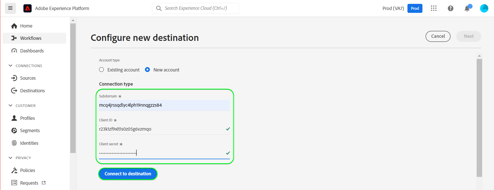

# [!DNL (API) Salesforce Marketing Cloud]-Verbindung

## Übersicht {#overview}

[[!DNL (API) Salesforce Marketing Cloud]](https://www.salesforce.com/products/marketing-cloud/overview/) (früher bekannt als [!DNL ExactTarget]) ist eine Digital Marketing Suite, mit der Sie Journey für Besucher und Kunden erstellen und anpassen können, um deren Erlebnis zu personalisieren.

>[!IMPORTANT]
>
>Beachten Sie den Unterschied zwischen dieser Verbindung und der anderen [[!DNL Salesforce Marketing Cloud] connection](/help/destinations/catalog/email-marketing/salesforce-marketing-cloud.md) , die im Abschnitt E-Mail-Marketing-Katalog vorhanden ist. Mit der anderen Salesforce-Marketing Cloud-Verbindung können Sie Dateien an einen bestimmten Speicherort exportieren, während es sich hierbei um eine API-basierte Streaming-Verbindung handelt.

Diese [!DNL Adobe Experience Platform] [Ziel](/help/destinations/home.md) nutzt die [!DNL Salesforce Marketing Cloud] [Kontakte aktualisieren](https://developer.salesforce.com/docs/marketing/marketing-cloud/guide/updateContacts.html) API, mit der Sie Kontakte hinzufügen/Kontaktdaten für Ihre geschäftlichen Anforderungen aktualisieren können, nachdem Sie sie in einer neuen aktiviert haben [!DNL Salesforce Marketing Cloud] Segment.

[!DNL Salesforce Marketing Cloud] verwendet OAuth 2 mit Client-Anmeldeinformationen als Authentifizierungsmechanismus für die Kommunikation mit dem [!DNL Salesforce Marketing Cloud] API. Anweisungen zur Authentifizierung bei Ihrer [!DNL Salesforce Marketing Cloud]-Instanz sehen Sie weiter unten im Abschnitt [Authentifizieren bei Ziel](#authenticate).

## Anwendungsbeispiele {#use-cases}

Um Ihnen zu helfen, besser zu verstehen, wie und wann Sie die [!DNL (API) Salesforce Marketing Cloud] Ziel, hier ein Beispielanwendungsfall, den Adobe Experience Platform-Kunden mit diesem Ziel lösen können.

### Senden von E-Mails an Kontakte für Marketingkampagnen {#use-case-send-emails}

Die Vertriebsabteilung einer Heimmiet-Plattform möchte eine Marketing-E-Mail an eine zielgerichtete Kundenzielgruppe senden. Das Marketing-Team der Plattform kann neue Kontakte hinzufügen/vorhandene Kontakte aktualisieren *(und ihre E-Mail-Adressen)* Erstellen Sie über Adobe Experience Platform Segmente aus eigenen Offline-Daten und senden Sie diese Segmente an [!DNL Salesforce Marketing Cloud], die dann zum Versand der E-Mail-Adresse der Marketing-Kampagne verwendet werden kann.

## Voraussetzungen {#prerequisites}

### Voraussetzungen für die Experience Platform {#prerequisites-in-experience-platform}

Vor der Aktivierung der Daten für das [!DNL (API) Salesforce Marketing Cloud]-Ziel müssen Sie über ein [Schema](/help/xdm/schema/composition.md), einen [Datensatz](https://experienceleague.adobe.com/docs/platform-learn/tutorials/data-ingestion/create-datasets-and-ingest-data.html?lang=de) und [Segmente](https://experienceleague.adobe.com/docs/platform-learn/tutorials/segments/create-segments.html?lang=de) verfügen, die in [!DNL Experience Platform] erstellt wurden.

### Voraussetzungen in [!DNL (API) Salesforce Marketing Cloud] {#prerequisites-destination}

Beachten Sie die folgenden Voraussetzungen, um Daten von Platform in Ihre [!DNL Salesforce Marketing Cloud] Konto:

#### Sie benötigen ein [!DNL Salesforce Marketing Cloud]-Konto {#prerequisites-account}

Wenden Sie sich an Ihre [!DNL Salesforce Account Executive] , um sich für die [!DNL Salesforce Marketing Cloud Account Engagement] Produkt, wenn Sie es noch nicht haben.

#### Erstellen von Attributen in [!DNL Salesforce Marketing Cloud] {#prerequisites-attribute}

Beim Aktivieren von Segmenten für [!DNL (API) Salesforce Marketing Cloud] Ziel, müssen Sie einen Wert in die **[!UICONTROL Zuordnungs-ID]** -Feld für jedes aktivierte Segment im **[Segmentplan](#schedule-segment-export-example)** Schritt.

[!DNL Salesforce] erfordert, dass dieser Wert Segmente aus Experience Platform korrekt liest und interpretiert und ihr Segmentstatus in [!DNL Salesforce Marketing Cloud]. Weitere Informationen finden Sie in der Dokumentation zur Experience Platform für [Feldergruppe Segmentzugehörigkeitsdetails](/help/xdm/field-groups/profile/segmentation.md) , wenn Sie Anleitungen zum Segmentstatus benötigen.

Für jedes Segment, das Sie von Platform in aktivieren [!DNL Salesforce Marketing Cloud], müssen Sie ein Attribut des Typs `Text` Innerhalb [!DNL Salesforce]. Verwenden Sie die [!DNL Salesforce Marketing Cloud] [!DNL Contact Builder] , um Attribute zu erstellen. Die Attributfeldnamen werden für die [!DNL (API) Salesforce Marketing Cloud] Zielfeld und sollte unter dem `[!DNL Email Demographics system attribute-set]`. Je nach Ihren Geschäftsanforderungen können Sie das Feldzeichen mit maximal 4000 Zeichen definieren. Siehe [!DNL Salesforce Marketing Cloud] [Datentypen für Datenerweiterungen](https://help.salesforce.com/s/articleView?id=sf.mc_es_data_extension_data_types.htm&amp;type=5) Dokumentationsseite für weitere Informationen zu Attributtypen.

Siehe Abschnitt [!DNL Salesforce Marketing Cloud] Dokumentation zu [Attribute erstellen](https://help.salesforce.com/s/articleView?id=mc_cab_create_an_attribute.htm&amp;type=5&amp;language=en_US) , wenn Sie Anleitungen zum Erstellen von Attributen benötigen.

Ein Beispiel für den Data Designer-Bildschirm in [!DNL Salesforce Marketing Cloud], zu dem Sie das Attribut hinzufügen werden, sehen Sie wie folgt:

Ansicht der [!DNL Salesforce Marketing Cloud] [!DNL Email Demographics] attribute-set ist unten dargestellt:

Die [!DNL (API) Salesforce Marketing Cloud] Das Ziel verwendet [!DNL Salesforce Marketing Cloud] [!DNL Search Attribute-Set Definitions REST] [API](https://developer.salesforce.com/docs/marketing/marketing-cloud/guide/retrieveAttributeSetDefinitions.html) dynamisch die Attribute und ihre Attribute-Sets abrufen, die in [!DNL Salesforce Marketing Cloud].

Diese werden im **[!UICONTROL Zielfeld]** Auswahlfenster bei der Einrichtung [Mapping](#mapping-considerations-example) im Workflow zu [Aktivieren von Segmenten für das Ziel](#activate). Beachten Sie, dass nur Zuordnungen für die Attribute erstellt werden, die innerhalb der Variablen [!DNL Salesforce Marketing Cloud] `[!DNL Email Demographics]` -Attributsätze unterstützt.

>[!IMPORTANT]
>
>Within [!DNL Salesforce Marketing Cloud]müssen Sie Attribute mit einer **[!UICONTROL FELDNAME]** genau mit dem Wert übereinstimmt, der in **[!UICONTROL Zuordnungs-ID]** für jedes aktivierte Platform-Segment. Der folgende Screenshot zeigt beispielsweise ein Attribut mit dem Namen `salesforce_mc_segment_1`. Fügen Sie bei der Aktivierung eines Segments für dieses Ziel hinzu `salesforce_mc_segment_1` as **[!UICONTROL Zuordnungs-ID]** , um Segmentzielgruppen aus Experience Platform in dieses Attribut zu füllen.

Ein Beispiel für die Attributerstellung in [!DNL Salesforce Marketing Cloud], wie unten gezeigt:

>[!TIP]
>
>* Fügen Sie beim Erstellen des Attributs keine Leerzeichen in den Feldnamen ein. Verwenden Sie stattdessen den Unterstrich. `(_)` als Trennzeichen.
>* So unterscheiden Sie zwischen Attributen, die für Platform-Segmente verwendet werden, und anderen Attributen in [!DNL Salesforce Marketing Cloud]können Sie ein erkennbares Präfix oder Suffix für die Attribute einfügen, die für Adobe-Segmente verwendet werden. Beispiel: anstelle von `test_segment`, verwenden `Adobe_test_segment` oder `test_segment_Adobe`.
>* Wenn Sie bereits andere Attribute in erstellt haben [!DNL Salesforce Marketing Cloud]können Sie denselben Namen wie das Platform-Segment verwenden, um das Segment einfach in [!DNL Salesforce Marketing Cloud].

#### Sammeln von [!DNL Salesforce Marketing Cloud]-Anmeldeinformationen {#gather-credentials}

Beachten Sie die folgenden Elemente, bevor Sie sich bei der [!DNL (API) Salesforce Marketing Cloud] Ziel.

| Anmeldedaten | Beschreibung | Beispiel |
| --- | --- | --- |
| Subdomain | Siehe [[!DNL Salesforce Marketing Cloud domain prefix]](https://developer.salesforce.com/docs/marketing/marketing-cloud/guide/your-subdomain-tenant-specific-endpoints.html) , um zu erfahren, wie Sie diesen Wert aus dem [!DNL Salesforce Marketing Cloud] -Schnittstelle. | Wenn [!DNL Salesforce Marketing Cloud] Domäne ist  *`mcq4jrssqdlyc4lph19nnqgzzs84`.login.executeTarget.com*,  Sie müssen `mcq4jrssqdlyc4lph19nnqgzzs84` als Wert. |
| Client-ID | Siehe [!DNL Salesforce Marketing Cloud] [Dokumentation](https://developer.salesforce.com/docs/marketing/marketing-cloud/guide/access-token-s2s.html) , um zu erfahren, wie Sie diesen Wert aus dem [!DNL Salesforce Marketing Cloud] -Schnittstelle. | r23kxxxxxxxx0z05xxxxxx |
| Client-Geheimnis | Siehe [!DNL Salesforce Marketing Cloud] [Dokumentation](https://developer.salesforce.com/docs/marketing/marketing-cloud/guide/access-token-s2s.html) , um zu erfahren, wie Sie diesen Wert aus dem [!DNL Salesforce Marketing Cloud] -Schnittstelle. | ipxxxxxxxxxxT4xxxxxxxxxx |

{style=&quot;table-layout:auto&quot;}

### Leitplanken {#guardrails}

* Salesforce setzt bestimmte [Grenzwerte](https://developer.salesforce.com/docs/marketing/marketing-cloud/guide/rate-limiting.html).
   * Siehe Abschnitt [!DNL Salesforce Marketing Cloud] [Dokumentation](https://developer.salesforce.com/docs/marketing/marketing-cloud/guide/rate-limiting-errors.html) , um alle möglichen Einschränkungen zu beheben, die bei der Ausführung auftreten könnten, und Fehler zu reduzieren.
   * Siehe Abschnitt [[!DNL Salesforce Marketing Cloud] Interaktionskosten](https://www.salesforce.com/editions-pricing/marketing-cloud/email/) Seite zu *Vollständige Vergleichstabelle herunterladen* als pdf , in dem die durch Ihren Plan festgelegten Grenzen beschrieben werden.
   * Die [API-Übersicht](https://developer.salesforce.com/docs/marketing/marketing-cloud/guide/apis-overview.html) Seite enthält zusätzliche Einschränkungen.
   * Siehe [here](https://salesforce.stackexchange.com/questions/205898/marketing-cloud-api-limits) für eine Seite, die diese Details sortiert.
* Die Anzahl der *Benutzerdefinierte Felder pro Objekt zulässig* variiert je nach Salesforce Edition.
   * Siehe Abschnitt [!DNL Salesforce] [Dokumentation](https://help.salesforce.com/s/articleView?id=sf.custom_field_allocations.htm&amp;type=5) für zusätzliche Leitlinien.
   * Wenn Sie die für *Benutzerdefinierte Felder pro Objekt zulässig* Innerhalb [!DNL Salesforce Marketing Cloud] Sie müssen
      * Ältere Attribute vor dem Hinzufügen neuer Attribute in [!DNL Salesforce Marketing Cloud].
      * Aktualisieren oder entfernen Sie aktivierte Segmente in Platform-Zielen, die diese älteren Attributnamen als Wert für **[!UICONTROL Zuordnungs-ID]** während der [Segmentplanung](#schedule-segment-export-example) Schritt.

## Unterstützte Identitäten {#supported-identities}

[!DNL (API) Salesforce Marketing Cloud] unterstützt die Aktualisierung von Identitäten, die in der folgenden Tabelle beschrieben werden. Erhalten Sie weitere Informationen zu [Identitäten](/help/identity-service/namespaces.md).

| Ziel-Identität | Beschreibung | Zu beachten |
|---|---|---|
| contactKey | [!DNL Salesforce Marketing Cloud] Kontaktschlüssel. Siehe Abschnitt [!DNL Salesforce Marketing Cloud] [Dokumentation](https://help.salesforce.com/s/articleView?id=sf.mc_cab_contact_builder_best_practices.htm&amp;type=5) wenn Sie zusätzliche Anleitungen benötigen. | Obligatorisch |

## Exporttyp und -häufigkeit {#export-type-frequency}

Beziehen Sie sich auf die folgende Tabelle, um Informationen zu Typ und Häufigkeit des Zielexports zu erhalten.

| Element | Typ | Anmerkungen |
---------|----------|---------|
| Exporttyp | **[!UICONTROL Profilbasiert]** | <ul><li>Sie exportieren alle Mitglieder eines Segments zusammen mit den gewünschten Schemafeldern *(z. B.: E-Mail-Adresse, Telefonnummer, Nachname)*, entsprechend Ihrer Feldzuordnung.</li><li> Jeder Segmentstatus in [!DNL Salesforce Marketing Cloud] wird mit dem entsprechenden Segmentstatus von Platform aktualisiert, basierend auf dem Wert der **[!UICONTROL Zuordnungs-ID]**, der im Schritt [Segmentplanung](#schedule-segment-export-example) angegeben wurde.</li></ul> |
| Exporthäufigkeit | **[!UICONTROL Streaming]** | Streaming-Ziele sind „immer verfügbare“ API-basierte Verbindungen. Sobald ein Profil in Experience Platform auf der Grundlage einer Segmentbewertung aktualisiert wird, sendet der Connector das Update nachgelagert an die Zielplattform. Lesen Sie mehr über [Streaming-Ziele](/help/destinations/destination-types.md#streaming-destinations). |

{style=&quot;table-layout:auto&quot;}

## Herstellen einer Verbindung mit dem Ziel {#connect}

>[!IMPORTANT]
>
>Um eine Verbindung zum Ziel herzustellen, benötigen Sie die [Zugriffsberechtigung](/help/access-control/home.md#permissions) **[!UICONTROL Ziele verwalten]**. Lesen Sie die [Zugriffskontrolle – Übersicht](/help/access-control/ui/overview.md) oder wenden Sie sich an Ihren Produktadministrator, um die erforderlichen Berechtigungen zu erhalten.

Um eine Verbindung mit diesem Ziel herzustellen, gehen Sie wie im [Tutorial zur Zielkonfiguration](../../ui/connect-destination.md) beschrieben vor. Füllen Sie im Workflow zum Konfigurieren des Ziels die Felder aus, die in den beiden folgenden Abschnitten aufgeführt sind.

Within **[!UICONTROL Ziele]** > **[!UICONTROL Katalog]**, suchen Sie nach [!DNL (API) Salesforce Marketing Cloud]. Alternativ können Sie sie unter der **[!UICONTROL E-Mail-Marketing]** Kategorie.

### Beim Ziel authentifizieren {#authenticate}

Um sich beim Ziel zu authentifizieren, füllen Sie die erforderlichen Felder unten aus und wählen Sie **[!UICONTROL Mit Ziel verbinden]**. Eine Anleitung dazu finden Sie im Abschnitt [ [!DNL Salesforce Marketing Cloud] Sammeln von -Anmeldeinformationen](#gather-credentials).

| [!DNL (API) Salesforce Marketing Cloud] Ziel | [!DNL Salesforce Marketing Cloud] |
| --- | --- |
| **[!UICONTROL Subdomain]** | Ihre [!DNL Salesforce Marketing Cloud] Domänen-Präfix.  Beispiel: Ihre Domäne   *`mcq4jrssqdlyc4lph19nnqgzzs84`.login.executeTarget.com*,   Sie müssen `mcq4jrssqdlyc4lph19nnqgzzs84` als Wert. |
| **[!UICONTROL Client-ID]** | Ihre [!DNL Salesforce Marketing Cloud] `Client ID`. |
| **[!UICONTROL Client-Geheimnis]** | Ihre [!DNL Salesforce Marketing Cloud] `Client Secret`. |

Wenn die angegebenen Details gültig sind, zeigt die Benutzeroberfläche eine **[!UICONTROL Verbunden]** Status mit einem grünen Häkchen anzeigen, können Sie mit dem nächsten Schritt fortfahren.

### Ausfüllen der Zieldetails {#destination-details}

Füllen Sie die folgenden erforderlichen und optionalen Felder aus, um Details für das Ziel zu konfigurieren. Ein Sternchen neben einem Feld in der Benutzeroberfläche zeigt an, dass das Feld erforderlich ist.

* **[!UICONTROL Name]**: Ein Name, durch den Sie dieses Ziel in Zukunft erkennen können.
* **[!UICONTROL Beschreibung]**: Eine Beschreibung, die Ihnen hilft, dieses Ziel in Zukunft zu identifizieren.

### Aktivieren von Warnhinweisen {#enable-alerts}

Sie können Warnhinweise aktivieren, um Benachrichtigungen zum Status des Datenflusses zu Ihrem Ziel zu erhalten. Wählen Sie einen Warnhinweis aus der zu abonnierenden Liste aus, um Benachrichtigungen über den Status Ihres Datenflusses zu erhalten. Weitere Informationen zu Warnhinweisen finden Sie im Handbuch zum [Abonnieren von Zielwarnhinweisen über die Benutzeroberfläche](../../ui/alerts.md).

Wenn Sie mit dem Eingeben der Details für Ihre Zielverbindung fertig sind, klicken Sie auf **[!UICONTROL Weiter]**.

## Aktivieren von Segmenten für dieses Ziel {#activate}

>[!IMPORTANT]
>
>Um Daten zu aktivieren, benötigen Sie die [Zugriffssteuerungsberechtigungen](/help/access-control/home.md#permissions) **[!UICONTROL Ziele verwalten]**, **[!UICONTROL Ziele aktivieren]**, **[!UICONTROL Profile anzeigen]** und **[!UICONTROL Segmente anzeigen]**. Lesen Sie die [Zugriffssteuerung – Übersicht](/help/access-control/ui/overview.md) oder wenden Sie sich an Ihren Produktadministrator, um die erforderlichen Berechtigungen zu erhalten.

Anweisungen zum Aktivieren von Zielgruppensegmenten für dieses Ziel finden Sie unter [Aktivieren von Profilen und Segmenten für Streaming-Segmentexportziele](/help/destinations/ui/activate-segment-streaming-destinations.md).

### Zuordnungsüberlegungen und Beispiel {#mapping-considerations-example}

Um Ihre Zielgruppendaten ordnungsgemäß von Adobe Experience Platform an das [!DNL (API) Salesforce Marketing Cloud]-Ziel zu senden, müssen Sie den Schritt zur Feldzuordnung durchlaufen. Die Zuordnung besteht darin, eine Verknüpfung zwischen den Schemafeldern Ihres Experience-Datenmodells (XDM) in Ihrem Platform-Konto und den jeweiligen Entsprechungen vom Ziel zu erstellen.

So ordnen Sie Ihre XDM-Felder korrekt der [!DNL (API) Salesforce Marketing Cloud] Gehen Sie wie folgt vor:

>[!IMPORTANT]
>
>Auch wenn Ihre Attributnamen gemäß Ihrer [!DNL Salesforce Marketing Cloud] -Konto, die Zuordnungen für beide `contactKey` und `personalEmail.address` sind zwingend erforderlich. Beim Zuordnen von Attributen werden nur Attribute aus der Experience Platform `Email Demographics` sollte in den Zielfeldern verwendet werden.

1. Wählen Sie Im Schritt **[!UICONTROL Zuordnung]** die Option **[!UICONTROL Neue Zuordnung hinzufügen]** aus. Auf dem Bildschirm wird eine neue Zuordnungszeile angezeigt.
   
1. Im **[!UICONTROL Quellfeld auswählen]** Fenster, wählen Sie die **[!UICONTROL Attribute auswählen]** und wählen Sie das XDM-Attribut aus oder wählen Sie die **[!UICONTROL Identitäts-Namespace auswählen]** und wählen Sie eine Identität aus.
1. Im **[!UICONTROL Zielgruppenfeld auswählen]** Fenster, wählen Sie die **[!UICONTROL Identitäts-Namespace auswählen]** und wählen Sie eine Identität oder **[!UICONTROL Benutzerdefinierte Attribute auswählen]** und wählen Sie ein Attribut aus der `Email Demographics` -Attribute nach Bedarf angezeigt werden. Die [!DNL (API) Salesforce Marketing Cloud] Das Ziel verwendet [!DNL Salesforce Marketing Cloud] [!DNL Search Attribute-Set Definitions REST] [API](https://developer.salesforce.com/docs/marketing/marketing-cloud/guide/retrieveAttributeSetDefinitions.html) dynamisch die Attribute und ihre in [!DNL Salesforce Marketing Cloud]. Diese werden im **[!UICONTROL Zielfeld]** Popup bei der Einrichtung der [Mapping](#mapping-considerations-example) im [Aktivieren von Segmenten für den Workflow](#activate). Beachten Sie, dass nur Zuordnungen für die Attribute erstellt werden, die innerhalb der Variablen [!DNL Salesforce Marketing Cloud] `[!DNL Email Demographics]` -Attributsätze unterstützt.

   * Wiederholen Sie diese Schritte, um die folgenden Zuordnungen zwischen Ihrem XDM-Profilschema und [!DNL (API) Salesforce Marketing Cloud]: |Quellfeld|Zielfeld| Erforderlich| |—|—|—| |`IdentityMap: contactKey`|`Identity: salesforceContactKey`| `Mandatory` |\
      |`xdm: person.name.firstName`|`Attribute: Email Demographics.First Name`| - | |`xdm: personalEmail.address`|`Attribute: Email Addresses.Email Address`| - |

   * Nachfolgend finden Sie ein Beispiel für die Verwendung dieser Zuordnungen:
      

Wenn Sie die Zuordnungen für Ihre Zielverbindung bereitgestellt haben, wählen Sie **[!UICONTROL Nächste]**.

### Planen des Segmentexports und Beispiel {#schedule-segment-export-example}

Bei der Durchführung der [Segmentexport planen](/help/destinations/ui/activate-segment-streaming-destinations.md#scheduling) Schritt: Sie müssen Platform-Segmente manuell dem [attributes](#prerequisites-attribute) in [!DNL Salesforce Marketing Cloud].

Wählen Sie dazu jedes Segment aus und geben Sie dann den Namen des Attributs aus [!DNL Salesforce Marketing Cloud] im [!DNL (API) Salesforce Marketing Cloud] **[!UICONTROL Zuordnungs-ID]** -Feld. Siehe Abschnitt [Attribut erstellen in [!DNL Salesforce Marketing Cloud]](#prerequisites-custom-field) Abschnitt mit Anleitungen und Best Practices zum Erstellen von Attributen in [!DNL Salesforce Marketing Cloud].

Wenn beispielsweise Ihre [!DNL Salesforce Marketing Cloud] Attribut ist `salesforce_mc_segment_1`, geben Sie diesen Wert in der [!DNL (API) Salesforce Marketing Cloud] **[!UICONTROL Zuordnungs-ID]** , um Segmentzielgruppen aus Experience Platform in dieses Attribut zu füllen.

Ein Beispielattribut aus [!DNL Salesforce Marketing Cloud] ist unten dargestellt:

Ein Beispiel, das die Position der [!DNL (API) Salesforce Marketing Cloud] **[!UICONTROL Zuordnungs-ID]** ist unten dargestellt:

Wie gezeigt, [!DNL (API) Salesforce Marketing Cloud] **[!UICONTROL Zuordnungs-ID]** sollte genau mit dem Wert übereinstimmen, der in [!DNL Salesforce Marketing Cloud] **[!UICONTROL FELDNAME]**.

Wiederholen Sie diesen Abschnitt für jedes aktivierte Platform-Segment.

Je nach Anwendungsfall können alle aktivierten Segmente demselben [!DNL Salesforce Marketing Cloud] **[!UICONTROL FELDNAME]** oder anderen **[!UICONTROL FELDNAME]** in [!DNL (API) Salesforce Marketing Cloud]. Ein typisches Beispiel, das auf dem oben gezeigten Bild basiert, könnte sein.
| [!DNL (API) Salesforce Marketing Cloud] Segmentname | [!DNL Salesforce Marketing Cloud] **[!UICONTROL FELDNAME]** | [!DNL (API) Salesforce Marketing Cloud] **[!UICONTROL Zuordnungs-ID]** | | — | — | — | | Salesforce mc Segment 1 | `salesforce_mc_segment_1` | `salesforce_mc_segment_1` | | Salesforce mc Segment 2 | `salesforce_mc_segment_2` | `salesforce_mc_segment_2` |

## Überprüfen des Datenexports {#exported-data}

Gehen Sie wie folgt vor, um zu überprüfen, ob Sie das Ziel korrekt eingerichtet haben:

1. Wählen Sie **[!UICONTROL Ziele]** > **[!UICONTROL Durchsuchen]** aus, um zur Liste der Ziele zu navigieren.
   

1. Wählen Sie das Ziel aus und überprüfen Sie, ob der Status **[!UICONTROL aktiviert]** ist.
   

1. Wechseln Sie zur Registerkarte **[!DNL Activation data]** und wählen Sie einen Segmentnamen aus.
   

1. Überwachen Sie die Segmentzusammenfassung und stellen Sie sicher, dass die Anzahl der Profile der im Segment erstellten Anzahl entspricht.
   

1. Melden Sie sich bei der [[!DNL Salesforce Marketing Cloud]](https://mc.exacttarget.com/) Website. Navigieren Sie dann zum **[!DNL Audience Builder]** > **[!DNL Contact Builder]** > **[!DNL All contacts]** > **[!DNL Email]** und überprüfen Sie, ob die Profile aus dem Segment hinzugefügt wurden.
   

1. Um zu überprüfen, ob Profile aktualisiert wurden, navigieren Sie zum **[!UICONTROL Email]** und überprüfen Sie, ob die Attributwerte für das Profil aus dem Segment aktualisiert wurden. Bei Erfolg können Sie sehen, dass jeder Segmentstatus in [!DNL Salesforce Marketing Cloud] mit dem entsprechenden Segmentstatus von Platform aktualisiert wurde, basierend auf dem **[!UICONTROL Zuordnungs-ID]** Wert, der im [Segmentplanung](#schedule-segment-export-example) Schritt.
   

## Datennutzung und -Governance {#data-usage-governance}

Alle [!DNL Adobe Experience Platform]-Ziele sind bei der Verarbeitung Ihrer Daten mit Datennutzungsrichtlinien konform. Ausführliche Informationen darüber, wie [!DNL Adobe Experience Platform] Data Governance erzwingt, finden Sie unter [Data Governance – Übersicht](/help/data-governance/home.md).

## Fehler und Fehlerbehebung {#errors-and-troubleshooting}

### Unbekannte Fehler beim Senden von Ereignissen an das Salesforce-Marketing Cloud {#unknown-errors}

* Beim Überprüfen eines Datenfluss-Ablaufs wird möglicherweise die folgende Fehlermeldung angezeigt: `Unknown errors encountered while pushing events to the destination. Please contact the administrator and try again.`

   

   * Um diesen Fehler zu beheben, überprüfen Sie, ob die Variable **[!UICONTROL Zuordnungs-ID]** die Sie im Aktivierungs-Workflow für das [!DNL (API) Salesforce Marketing Cloud] Das Ziel stimmt genau mit dem Namen des Attributs überein, das Sie in [!DNL Salesforce Marketing Cloud]. Siehe Abschnitt [Attribut erstellen in [!DNL Salesforce Marketing Cloud]](#prerequisites-custom-field) für Hinweise.

* Beim Aktivieren eines Segments erhalten Sie möglicherweise eine Fehlermeldung: `The client's IP address is unauthorized for this account. Allowlist the client's IP address...`
   * Wenden Sie sich zur Behebung dieses Fehlers an Ihren [!DNL Salesforce Marketing Cloud] Kontoadministrator zum Hinzufügen [IP-Adressen der Experience Platform](/help/destinations/catalog/streaming/ip-address-allow-list.md) auf [!DNL Salesforce Marketing Cloud] Vertrauenswürdige IP-Bereiche der Konten. Siehe Abschnitt [!DNL Salesforce Marketing Cloud] [IP-Adressen für die Einbindung in Zulassungslisten in Marketing Cloud](https://help.salesforce.com/s/articleView?id=sf.mc_es_ip_addresses_for_inclusion.htm&amp;type=5) Dokumentation, wenn Sie zusätzliche Anleitungen benötigen.

## Zusätzliche Ressourcen {#additional-resources}

* [!DNL Salesforce Marketing Cloud] [API](https://developer.salesforce.com/docs/marketing/marketing-cloud/guide/apis-overview.html)
* [!DNL Salesforce Marketing Cloud] [Dokumentation](https://developer.salesforce.com/docs/marketing/marketing-cloud/guide/updateContacts.html) Erläuterung der Aktualisierung von Kontakten mit den in den angegebenen Attributgruppen angegebenen Informationen.