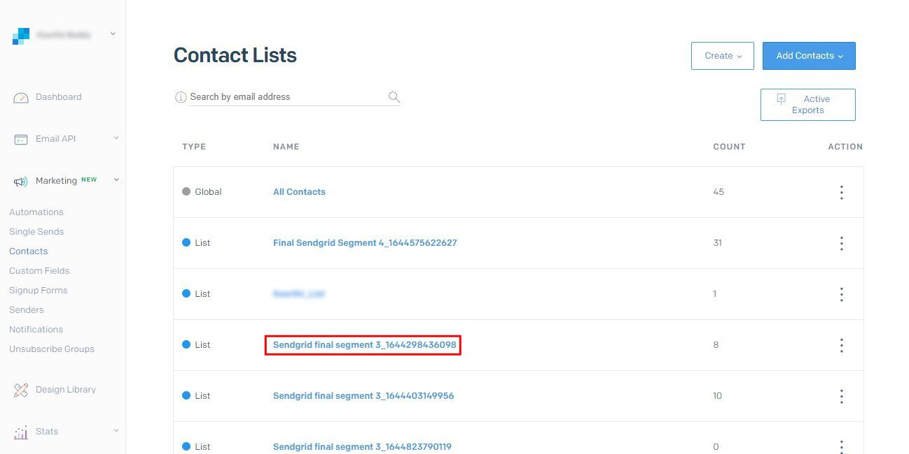

# [!DNL SendGrid]-Verbindung

## Übersicht {#overview}

[SendGrid](https://www.sendgrid.com) ist eine beliebte Kundenkommunikationsplattform für Transaktions- und Marketing-E-Mails.

Dieses [!DNL Adobe Experience Platform] [Ziel](/help/destinations/home.md) nutzt die [[!DNL SendGrid Marketing Contacts API]](https://api.sendgrid.com/v3/marketing/contacts), mit der Sie Ihre Erstanbieter-E-Mail-Profile exportieren und in einer neuen SendGrid-Zielgruppe für Ihre Geschäftsanforderungen aktivieren können.

SendGrid verwendet API-Bearer-Token als Authentifizierungsmechanismus für die Kommunikation mit der SendGrid-API.

## Voraussetzungen {#prerequisites}

Die folgenden Elemente sind erforderlich, bevor Sie mit der Konfiguration des Ziels beginnen.

1. Sie benötigen ein SendGrid-Konto.
   * Navigieren Sie zur SendGrid[Anmeldeseite ](https://signup.sendgrid.com/) registrieren Sie sich und erstellen Sie ein SendGrid-Konto, falls Sie noch keines haben.
1. Nach der Anmeldung beim SendGrid-Portal müssen Sie auch ein API-Token generieren.
1. Navigieren Sie zur SendGrid-Website und rufen Sie die Seite **[!DNL Settings]** > **[!DNL API Keys]** auf. Alternativ finden Sie in der [SendGrid-Dokumentation](https://app.sendgrid.com/settings/api_keys) Informationen zum Zugriff auf den entsprechenden Abschnitt in der SendGrid-App.
1. Klicken Sie abschließend auf die Schaltfläche **[!DNL Create API Key]** .
   * Weitere Informationen zu den auszuführenden Aktionen [ Sie in der ](https://docs.sendgrid.com/ui/account-and-settings/api-keys#creating-an-api-key) zu SendGrid .
   * Wenn Sie Ihren API-Schlüssel programmgesteuert generieren möchten, lesen Sie die [SendGrid-Dokumentation](https://docs.sendgrid.com/api-reference/api-keys/create-api-keys).

Bevor Sie Daten für das SendGrid-Ziel aktivieren, müssen Sie ein [Schema](https://experienceleague.adobe.com/docs/experience-platform/xdm/schema/composition.html?lang=de), einen [Datensatz](https://experienceleague.adobe.com/docs/platform-learn/tutorials/data-ingestion/create-datasets-and-ingest-data.html) und [Segmente](https://experienceleague.adobe.com/docs/platform-learn/tutorials/segments/create-segments.html) in [!DNL Experience Platform] erstellt haben. Weitere Informationen finden Sie [ Abschnitt ](#limits)Beschränkungen“ weiter unten auf dieser Seite.

>[!IMPORTANT]
>
>* Für die SendGrid-API, die zum Erstellen der Mailing-Liste aus E-Mail-Profilen verwendet wird, müssen in jedem Profil eindeutige E-Mail-Adressen angegeben werden. Dies gilt unabhängig davon, ob es als Wert für (E *Mail* oder *alternative E-Mail* verwendet wird. Da die SendGrid-Verbindung Zuordnungen sowohl für E-Mail- als auch für alternative E-Mail-Werte unterstützt, stellen Sie sicher, dass alle verwendeten E-Mail-Adressen in jedem Profil des *Datensatzes) eindeutig*. Andernfalls führt das Senden der E-Mail-Profile an SendGrid zu einem Fehler, und dieses E-Mail-Profil ist nicht im Datenexport vorhanden.
>
>* Derzeit gibt es keine Funktion zum Entfernen von Profilen aus SendGrid, wenn sie aus Zielgruppen in Experience Platform entfernt werden.

## Unterstützte Identitäten {#supported-identities}

SendGrid unterstützt die Aktivierung von Identitäten, die in der folgenden Tabelle beschrieben werden. Erhalten Sie weitere Informationen zu [Identitäten](/help/identity-service/features/namespaces.md).

| Ziel-Identität | Beschreibung | Zu beachten |
|---|---|---|
| email | E-Mail-Adresse | Beachten Sie, dass sowohl Nur-Text- als auch SHA256-Hash-E-Mail-Adressen von [!DNL Adobe Experience Platform] unterstützt werden. Wenn das Quellfeld von Experience Platform ungehashte Attribute enthält, überprüfen Sie die Option **[!UICONTROL Apply transformation]** , damit die Daten bei Aktivierung automatisch gehasht [!DNL Experience Platform].   Beachten Sie, dass **SendGrid** keine Hash-E-Mail-Adressen unterstützt, sodass nur Textdaten ohne Umwandlung an das Ziel gesendet werden. |

{style="table-layout:auto"}

## Exporttyp und -häufigkeit {#export-type-frequency}

Beziehen Sie sich auf die folgende Tabelle, um Informationen zu Typ und Häufigkeit des Zielexports zu erhalten.

| Element | Typ | Anmerkungen |
|---------|----------|---------|
| Exporttyp | **[!UICONTROL Profile-based]** | Sie exportieren alle Mitglieder eines Segments zusammen mit den gewünschten Schemafeldern (z. B. E-Mail-Adresse, Telefonnummer, Nachname), wie im Bildschirm „Auswählen der Profilattribute“ im [Zielaktivierungs-Workflow](/help/destinations/ui/activate-batch-profile-destinations.md#select-attributes) festgelegt. |
| Exporthäufigkeit | **[!UICONTROL Streaming]** | Streaming-Ziele sind „immer verfügbare“ API-basierte Verbindungen. Sobald ein Profil in Experience Platform auf der Grundlage einer Zielgruppenauswertung aktualisiert wird, sendet der Connector das Update nachgelagert an die Zielplattform. Lesen Sie mehr über [Streaming-Ziele](/help/destinations/destination-types.md#streaming-destinations). |

{style="table-layout:auto"}

## Anwendungsfälle {#use-cases}

Damit Sie besser verstehen können, wie und wann Sie das SendGrid-Ziel verwenden sollten, finden Sie hier einige Beispielanwendungsfälle, die [!DNL Experience Platform] Kunden mit diesem Ziel bewältigen können.

### Erstellen einer Marketing-Liste für mehrere Marketing-Aktivitäten

Marketing-Teams, die SendGrid verwenden, können in SendGrid eine Mailing-Liste erstellen und mit E-Mail-Adressen füllen. Die nun in SendGrid erstellte Mailing-Liste kann anschließend für mehrere Marketing-Aktivitäten verwendet werden.

## Mit Ziel verbinden {#connect}

>[!IMPORTANT]
> 
>Um eine Verbindung zum Ziel herzustellen, benötigen Sie die **[!UICONTROL View Destinations]** und **[!UICONTROL Manage Destinations]** Zugriffssteuerungsberechtigungen[. ](/help/access-control/home.md#permissions) Lesen Sie die [Zugriffskontrolle – Übersicht](/help/access-control/ui/overview.md) oder wenden Sie sich an Ihren Produktadministrator, um die erforderlichen Berechtigungen zu erhalten.

Um eine Verbindung mit diesem Ziel herzustellen, gehen Sie wie im [Tutorial zur Zielkonfiguration](../../ui/connect-destination.md) beschrieben vor. Füllen Sie im Workflow zum Konfigurieren des Ziels die Felder aus, die in den beiden folgenden Abschnitten aufgeführt sind.

### Beim Ziel authentifizieren {#authenticate}

1. Navigieren Sie in der [!DNL Adobe Experience Platform]-Konsole zu **Ziele**.

1. Wählen Sie die **Katalog** aus und suchen Sie nach *SendGrid*. Wählen Sie dann **Einrichten** aus. Nachdem Sie eine Verbindung zum Ziel hergestellt haben, ändert sich die Bezeichnung der Benutzeroberfläche in **Segmente aktivieren**.
   

1. Ihnen wird ein Assistent angezeigt, der Sie bei der Konfiguration des SendGrid-Ziels unterstützt. Erstellen Sie das neue Ziel, indem Sie **Neues Ziel konfigurieren** auswählen.
   

1. Wählen Sie die Option **Neues Konto** und geben Sie den Wert **Bearer-Token** ein. Dieser Wert ist der SendGrid-*API-Schlüssel* der zuvor im Abschnitt [Voraussetzungen](#prerequisites) erwähnt wurde.
   

1. Wählen Sie **Mit Ziel verbinden** aus. Wenn der angegebene SendGrid *API* Schlüssel gültig ist, zeigt die Benutzeroberfläche den Status **Verbunden** mit einem grünen Häkchen an. Sie können dann mit dem nächsten Schritt fortfahren, um zusätzliche Informationsfelder auszufüllen.

### Ausfüllen der Zieldetails {#destination-details}

Beim [Einrichten](https://experienceleague.adobe.com/docs/experience-platform/destinations/ui/connect-destination.html?lang=de) dieses Ziels müssen Sie die folgenden Informationen angeben:

* **[!UICONTROL Name]**: Der Name, durch den Sie dieses Ziel in Zukunft erkennen können.
* **[!UICONTROL Description]**: Eine optionale Beschreibung, die Ihnen hilft, dieses Ziel in Zukunft zu identifizieren.

### Aktivieren von Warnhinweisen {#enable-alerts}

Sie können Warnhinweise aktivieren, um Benachrichtigungen zum Status des Datenflusses zu Ihrem Ziel zu erhalten. Wählen Sie einen Warnhinweis aus der zu abonnierenden Liste aus, um Benachrichtigungen über den Status Ihres Datenflusses zu erhalten. Weitere Informationen zu Warnhinweisen finden Sie im Handbuch zum [Abonnieren von Zielwarnhinweisen über die Benutzeroberfläche](../../ui/alerts.md).

Wenn Sie mit dem Eingeben der Details für Ihre Zielverbindung fertig sind, wählen Sie **[!UICONTROL Next]** aus.

## Aktivieren von Zielgruppen für dieses Ziel {#activate}

>[!IMPORTANT]
> 
>* Zum Aktivieren von Daten benötigen Sie die **[!UICONTROL View Destinations]**, **[!UICONTROL Activate Destinations]**, **[!UICONTROL View Profiles]** und **[!UICONTROL View Segments]** [Zugriffssteuerungsberechtigungen](/help/access-control/home.md#permissions). Lesen Sie die [Übersicht über die Zugriffssteuerung](/help/access-control/ui/overview.md) oder wenden Sie sich an Ihre Produktadmins, um die erforderlichen Berechtigungen zu erhalten.
>* Zum Exportieren *Identitäten* benötigen Sie die **[!UICONTROL View Identity Graph]** Zugriffssteuerungsberechtigung.   {width="100" zoomable="yes"}

Anweisungen zum Aktivieren von Zielgruppen für dieses Ziel finden Sie unter [Aktivieren von Profilen und Zielgruppen für Streaming-Zielgruppen-Exportziele](/help/destinations/ui/activate-segment-streaming-destinations.md).

Auf den folgenden Bildern finden Sie Details, die speziell für dieses Ziel gelten.

1. Wählen Sie eine oder mehrere Zielgruppen für den Export in SendGrid aus.
   

1. Im **[!UICONTROL Mapping]** Schritt wird nach der Auswahl von **[!UICONTROL Add new mapping]** die Zuordnungsseite angezeigt, um die Quell-XDM-Felder den SendGrid-API-Zielfeldern zuzuordnen. Die folgenden Bilder zeigen, wie Identity-Namespaces zwischen Experience Platform und SendGrid zugeordnet werden. Stellen Sie sicher **[!UICONTROL Source field]** dass *E-Mail* wie unten dargestellt der **[!UICONTROL Target field]** *external_id* zugeordnet werden sollte.
   
   
   
   

1. Ordnen Sie auf ähnliche Weise die gewünschten [!DNL Adobe Experience Platform]-Attribute, die Sie exportieren möchten, dem SendGrid-Ziel zu.
   
   

1. Wählen Sie nach Abschluss der Zuordnungen die Option **[!UICONTROL Next]** aus, um zum Bildschirm „Überprüfung“ zu gelangen.
   

1. Wählen Sie **[!UICONTROL Finish]** aus, um die Einrichtung abzuschließen.
   

Die umfassende Liste der unterstützten Attributzuordnungen, die für die [SendGrid-Marketing-Kontakte > Kontakt-API hinzufügen oder aktualisieren) eingerichtet ](https://docs.sendgrid.com/api-reference/contacts/add-or-update-a-contact) können, finden Sie unten.

| Quellfeld | Zielfeld | Typ | Beschreibung | Beschränkungen |
|---|---|---|---|---|
| xdm:  homeAddress.street1 | xdm:  address_line_1 | String | Die erste Zeile der Adresse. | Maximale Länge:   100 Zeichen |
| xdm:  homeAddress.street2 | xdm:  address_line_2 | String | Eine optionale zweite Zeile für die Adresse. | Maximale Länge:   100 Zeichen |
| xdm:  _extconndev.alternate_emails | xdm:  alternative_emails | String-Array | Zusätzliche E-Mails, die mit dem Kontakt verknüpft sind. | <ul><li>Max.: 5 Elemente</li><li>Min.: 0 Elemente</li></ul> |
| xdm:  homeAddress.city | xdm:  city | String | Die Stadt des Kontakts. | Maximale Länge:   60 Zeichen |
| xdm:  homeAddress.country | xdm:  Land | String | Das Land des Kontakts. Kann ein vollständiger Name oder eine Abkürzung sein. | Maximale Länge:   50 Zeichen |
| identityMap:  E-Mail | Identität:  external_id | String | Die primäre E-Mail des Kontakts. Dies ist eine gültige E-Mail. | Maximale Länge:   254 Zeichen |
| xdm:  person.name.firstName | xdm:  first_name | String | Der Name des Kontakts | Maximale Länge:   50 Zeichen |
| xdm:  person.name.lastName | xdm:  last_name | String | Nachname des Kontakts | Maximale Länge:   50 Zeichen |
| xdm:  homeAddress.postalCode | xdm:  Postal_Code | String | Die Postleitzahl des Kontakts oder eine andere Postleitzahl. | |
| xdm:  homeAddress.stateProvince | xdm:  state_Province_region | String | Bundesland, Provinz oder Region des Kontakts. | Maximale Länge:   50 Zeichen |

## Überprüfen des Datenexports in SendGrid {#validate}

Gehen Sie wie folgt vor, um zu überprüfen, ob Sie das Ziel korrekt eingerichtet haben:

1. Wählen Sie **[!UICONTROL Destinations]** > **[!UICONTROL Browse]** aus, um zur Liste der Ziele zu navigieren.
   

1. Wählen Sie das Ziel aus und überprüfen Sie, ob der Status **[!UICONTROL enabled]** ist.
   

1. Wechseln Sie zur Registerkarte **[!DNL Activation data]** und wählen Sie einen Zielgruppennamen aus.
   

1. Überwachen Sie die Zielgruppenzusammenfassung und überprüfen Sie, ob die Anzahl der Profile der im Datensatz erstellten Anzahl entspricht.
   

1. Die [SendGrid Marketing Lists > Create List API](https://docs.sendgrid.com/api-reference/lists/create-list) wird verwendet, um innerhalb von SendGrid eindeutige Kontaktlisten zu erstellen, indem der Wert des *list_name*-Attributs mit dem Zeitstempel des Datenexports verbunden wird. Navigieren Sie zur SendGrid-Site und überprüfen Sie, ob die neue Kontaktliste entsprechend dem Namensmuster erstellt wurde.
   
   

1. Wählen Sie die neu erstellte Kontaktliste aus und überprüfen Sie, ob der neue E-Mail-Datensatz aus dem von Ihnen erstellten Datensatz in der neuen Kontaktliste ausgefüllt wird.

1. Überprüfen Sie außerdem einige E-Mails, um zu überprüfen, ob die Feldzuordnung korrekt ist.
   
   

## Datennutzung und -Governance {#data-usage-governance}

Alle [!DNL Adobe Experience Platform]-Ziele sind bei der Verarbeitung Ihrer Daten mit Datennutzungsrichtlinien konform. Ausführliche Informationen darüber, wie [!DNL Adobe Experience Platform] Data Governance erzwingt, finden Sie unter [Data Governance – Übersicht](/help/data-governance/home.md).

## Weitere Ressourcen {#additional-resources}

Dieses SendGrid-Ziel nutzt die folgenden APIs:

* [SendGrid-Marketing-Listen > Listen-API erstellen](https://docs.sendgrid.com/api-reference/lists/create-list)
* [SendGrid Marketing-Kontakte > Kontakt-API hinzufügen oder aktualisieren](https://docs.sendgrid.com/api-reference/contacts/add-or-update-a-contact)

### Beschränkungen {#limits}

* Die [SendGrid-Marketing-Kontakte > Kontakt-API hinzufügen oder ](https://api.sendgrid.com/v3/marketing/contacts)Kontakt aktualisieren) kann 30.000 Kontakte oder 6 MB Daten akzeptieren, je nachdem, welcher Wert niedriger ist.
