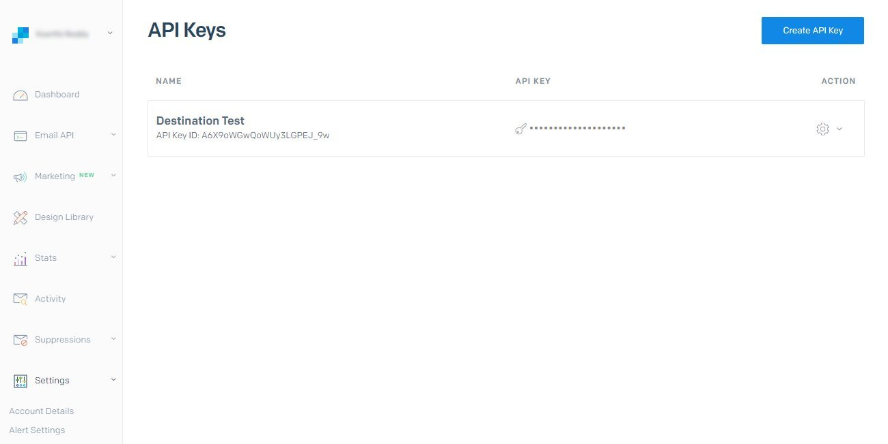

# [!DNL SendGrid]-Verbindung

## Übersicht {#overview}

[SendGrid](https://www.sendgrid.com) ist eine beliebte Kundenkommunikationsplattform für Transaktions- und Marketing-E-Mails.

Diese [!DNL Adobe Experience Platform] [Ziel](/help/destinations/home.md) nutzt die [[!DNL SendGrid Marketing Contacts API]](https://api.sendgrid.com/v3/marketing/contacts), mit dem Sie Ihre Erstanbieter-E-Mail-Profile exportieren und in einer neuen SendGrid-Zielgruppe für Ihre geschäftlichen Anforderungen aktivieren können.

SendGrid verwendet API-Träger-Token als Authentifizierungsmechanismus für die Kommunikation mit der SendGrid-API.

## Voraussetzungen {#prerequisites}

Die folgenden Elemente sind erforderlich, bevor Sie mit der Konfiguration des Ziels beginnen.

1. Sie benötigen ein SendGrid-Konto.
   * Navigieren Sie zum SendGrid [anmelden](https://signup.sendgrid.com/) Seite, um sich zu registrieren und ein SendGrid-Konto zu erstellen, falls noch keines vorhanden ist.
1. Nach der Anmeldung beim SendGrid-Portal müssen Sie auch ein API-Token generieren.
1. Navigieren Sie zur SendGrid-Website und rufen Sie die **[!DNL Settings]** > **[!DNL API Keys]** Seite. Weitere Informationen finden Sie im Abschnitt [SendGrid-Dokumentation](https://app.sendgrid.com/settings/api_keys) , um auf den entsprechenden Abschnitt in der SendGrid-App zuzugreifen.
1. Wählen Sie abschließend die **[!DNL Create API Key]** Schaltfläche.
   * Siehe Abschnitt [SendGrid-Dokumentation](https://docs.sendgrid.com/ui/account-and-settings/api-keys#creating-an-api-key), wenn Sie Anleitungen zu den auszuführenden Aktionen benötigen.
   * Informationen zum programmgesteuerten Generieren Ihres API-Schlüssels finden Sie im Abschnitt [SendGrid-Dokumentation](https://docs.sendgrid.com/api-reference/api-keys/create-api-keys).

Bevor Sie Daten für das SendGrid-Ziel aktivieren, müssen Sie über eine [schema](https://experienceleague.adobe.com/docs/experience-platform/xdm/schema/composition.html?lang=de), [Datensatz](https://experienceleague.adobe.com/docs/platform-learn/tutorials/data-ingestion/create-datasets-and-ingest-data.html?lang=de)und [Segmente](https://experienceleague.adobe.com/docs/platform-learn/tutorials/segments/create-segments.html?lang=de) erstellt in [!DNL Experience Platform]. Weitere Informationen finden Sie unter [limits](#limits) weiter unten auf dieser Seite.

>[!IMPORTANT]
>
>* Für die SendGrid-API, die zum Erstellen der Mailing-Liste aus E-Mail-Profilen verwendet wird, müssen innerhalb jedes Profils eindeutige E-Mail-Adressen angegeben werden. Dies ist unabhängig davon, ob es als Wert für *email* oder *alternative email*. Da die SendGrid-Verbindung Zuordnungen für E-Mail- und alternative E-Mail-Werte unterstützt, müssen Sie sicherstellen, dass alle verwendeten E-Mail-Adressen innerhalb jedes Profils der *Datensatz*. Andernfalls tritt beim Senden der E-Mail-Profile an SendGrid ein Fehler auf, und dieses E-Mail-Profil ist im Datenexport nicht vorhanden.
>
>* Derzeit gibt es keine Funktion zum Entfernen von Profilen aus SendGrid, wenn sie aus Zielgruppen in Experience Platform entfernt werden.

## Unterstützte Identitäten {#supported-identities}

SendGrid unterstützt die Aktivierung von Identitäten, die in der folgenden Tabelle beschrieben sind. Erhalten Sie weitere Informationen zu [Identitäten](/help/identity-service/namespaces.md).

| Ziel-Identität | Beschreibung | Zu beachten |
|---|---|---|
| E-Mail | E-Mail Adresse | Beachten Sie, dass sowohl Nur-Text- als auch SHA256-Hash-E-Mail-Adressen von [!DNL Adobe Experience Platform]. Wenn das Quellfeld der Experience Platform ungehashte Attribute enthält, überprüfen Sie die **[!UICONTROL Umwandlung anwenden]** -Option, um [!DNL Platform] die Daten bei Aktivierung automatisch hash.   Beachten Sie Folgendes: **SendGrid** unterstützt keine Hash-E-Mail-Adressen, daher werden nur Textdaten ohne Umwandlung an das Ziel gesendet. |

{style="table-layout:auto"}

## Exporttyp und -häufigkeit {#export-type-frequency}

Beziehen Sie sich auf die folgende Tabelle, um Informationen zu Typ und Häufigkeit des Zielexports zu erhalten.

| Element | Typ | Anmerkungen |
---------|----------|---------|
| Exporttyp | **[!UICONTROL Profilbasiert]** | Sie exportieren alle Mitglieder eines Segments zusammen mit den gewünschten Schemafeldern (z. B. E-Mail-Adresse, Telefonnummer, Nachname), wie im Bildschirm „Auswählen der Profilattribute“ im [Zielaktivierungs-Workflow](/help/destinations/ui/activate-batch-profile-destinations.md#select-attributes) festgelegt. |
| Exporthäufigkeit | **[!UICONTROL Streaming]** | Streaming-Ziele sind „immer verfügbare“ API-basierte Verbindungen. Sobald ein Profil in Experience Platform basierend auf der Zielgruppenbewertung aktualisiert wird, sendet der Connector das Update an die Zielplattform. Lesen Sie mehr über [Streaming-Ziele](/help/destinations/destination-types.md#streaming-destinations). |

{style="table-layout:auto"}

## Anwendungsfälle {#use-cases}

Hier finden Sie Beispielanwendungsfälle, die Ihnen helfen, besser zu verstehen, wie und wann Sie das SendGrid-Ziel verwenden sollten [!DNL Experience Platform] -Kunden können dies mithilfe dieses Ziels lösen.

### Erstellen einer Marketingliste für mehrere Marketingaktivitäten

Marketingteams, die SendGrid verwenden, können eine Mailingliste in SendGrid erstellen und diese mit E-Mail-Adressen füllen. Die jetzt in SendGrid erstellte Mailingliste kann später für mehrere Marketing-Aktivitäten verwendet werden.

## Mit Ziel verbinden {#connect}

>[!IMPORTANT]
> 
>Um eine Verbindung zum Ziel herzustellen, benötigen Sie die [Zugriffsberechtigung](/help/access-control/home.md#permissions) **[!UICONTROL Ziele verwalten]**. Lesen Sie die [Zugriffskontrolle – Übersicht](/help/access-control/ui/overview.md) oder wenden Sie sich an Ihren Produktadministrator, um die erforderlichen Berechtigungen zu erhalten.

Um eine Verbindung mit diesem Ziel herzustellen, gehen Sie wie im [Tutorial zur Zielkonfiguration](../../ui/connect-destination.md) beschrieben vor. Füllen Sie im Workflow zum Konfigurieren des Ziels die Felder aus, die in den beiden folgenden Abschnitten aufgeführt sind.

### Beim Ziel authentifizieren {#authenticate}

1. Innerhalb der [!DNL Adobe Experience Platform] Konsole, navigieren Sie zu **Ziele**.

1. Wählen Sie die **Katalog** Registerkarte und suchen Sie nach *SendGrid*. Wählen Sie anschließend **Einrichten**. Nachdem Sie eine Verbindung zum Ziel hergestellt haben, ändert sich die Beschriftung der Benutzeroberfläche in **Segmente aktivieren**.
   

1. Ihnen wird ein Assistent angezeigt, der Sie bei der Konfiguration des SendGrid-Ziels unterstützt. Erstellen Sie das neue Ziel durch Auswahl von **Neues Ziel konfigurieren**.
   

1. Wählen Sie die **Neues Konto** und füllen Sie die **Trägertoken** -Wert. Dieser Wert ist das SendGrid *API-Schlüssel* zuvor in [Abschnitt mit Voraussetzungen](#prerequisites).
   

1. Auswählen **Mit Ziel verbinden**. Wenn das SendGrid *API-Schlüssel* Wenn Sie angegeben haben, dass gültig ist, zeigt die Benutzeroberfläche eine **Verbunden** mit einem grünen Häkchen angezeigt wird, können Sie dann mit dem nächsten Schritt fortfahren, um zusätzliche Informationsfelder auszufüllen.

### Ausfüllen der Zieldetails {#destination-details}

Beim [Einrichten](https://experienceleague.adobe.com/docs/experience-platform/destinations/ui/connect-destination.html?lang=de) dieses Ziels müssen Sie die folgenden Informationen angeben:

* **[!UICONTROL Name]**: Der Name, mit dem Sie dieses Ziel in der Zukunft erkennen werden.
* **[!UICONTROL Beschreibung]**: Eine optionale Beschreibung, die Ihnen dabei hilft, dieses Ziel in der Zukunft zu identifizieren.

### Aktivieren von Warnhinweisen {#enable-alerts}

Sie können Warnhinweise aktivieren, um Benachrichtigungen zum Status des Datenflusses zu Ihrem Ziel zu erhalten. Wählen Sie einen Warnhinweis aus der zu abonnierenden Liste aus, um Benachrichtigungen über den Status Ihres Datenflusses zu erhalten. Weitere Informationen zu Warnhinweisen finden Sie im Handbuch zum [Abonnieren von Zielwarnhinweisen über die Benutzeroberfläche](../../ui/alerts.md).

Wenn Sie alle Details für Ihre Zielverbindung eingegeben haben, klicken Sie auf **[!UICONTROL Weiter]**.

## Aktivieren von Zielgruppen für dieses Ziel {#activate}

>[!IMPORTANT]
> 
>Um Daten zu aktivieren, benötigen Sie die [Zugriffskontrollberechtigungen](/help/access-control/home.md#permissions) **[!UICONTROL Ziele verwalten]**, **[!UICONTROL Ziele aktivieren]**, **[!UICONTROL Profile anzeigen]** und **[!UICONTROL Segmente anzeigen]**. Lesen Sie die [Übersicht über die Zugriffskontrolle](/help/access-control/ui/overview.md) oder wenden Sie sich an Ihren Produktadministrator, um die erforderlichen Berechtigungen zu erhalten.

Lesen [Aktivieren von Profilen und Zielgruppen für Streaming-Zielgruppenexport-Ziele](/help/destinations/ui/activate-segment-streaming-destinations.md) für Anweisungen zum Aktivieren von Zielgruppen für dieses Ziel.

Weitere Informationen zu diesem Ziel finden Sie in den folgenden Bildern.

1. Wählen Sie eine oder mehrere Zielgruppen aus, die in SendGrid exportiert werden sollen.
   

1. Im **[!UICONTROL Zuordnung]** Schritt nach Auswahl **[!UICONTROL Neues Mapping hinzufügen]** angezeigt, wird Ihnen die Zuordnungsseite angezeigt, um die Quell-XDM-Felder den SendGrid-API-Zielfeldern zuzuordnen. Die folgenden Abbildungen zeigen, wie Identitäts-Namespaces zwischen Experience Platform und SendGrid zugeordnet werden. Stellen Sie sicher, dass **[!UICONTROL Quellfeld]** *Email* sollte der **[!UICONTROL Zielfeld]** *external_id* wie unten dargestellt.
   
   
   
   

1. Ordnen Sie die gewünschte [!DNL Adobe Experience Platform] -Attribute, die Sie an das SendGrid-Ziel exportieren möchten.
   
   

1. Nachdem Sie die Zuordnungen abgeschlossen haben, wählen Sie **[!UICONTROL Nächste]** , um zum Überprüfungsbildschirm zu gelangen.
   

1. Auswählen **[!UICONTROL Beenden]** , um das Setup abzuschließen.
   

Die umfassende Liste der unterstützten Attributzuordnungen, die für die [Marketing-Kontakte senden > Kontakt-API hinzufügen oder aktualisieren](https://docs.sendgrid.com/api-reference/contacts/add-or-update-a-contact) unten.

| Quellfeld | Zielfeld | Typ | Beschreibung | Beschränkungen |
|---|---|---|---|---|
| xdm:  homeAddress.street1 | xdm:  address_line_1 | Zeichenfolge | Die erste Zeile der Adresse. | Max. Länge:  100 Zeichen |
| xdm:  homeAddress.street2 | xdm:  address_line_2 | Zeichenfolge | Eine optionale zweite Zeile für die Adresse. | Max. Länge:  100 Zeichen |
| xdm:  _extconndev.alternate_emails | xdm:  alternate_emails | Zeichenfolgen-Array | Zusätzliche E-Mails, die mit dem Kontakt verknüpft sind. | <ul><li>Max.: 5 Posten</li><li>Min.: 0 Elemente</li></ul> |
| xdm:  homeAddress.city | xdm:  city | Zeichenfolge | Die Stadt des Kontakts. | Max. Länge:  60 Zeichen |
| xdm:  homeAddress.country | xdm:  country | Zeichenfolge | Das Land des Kontakts. Kann ein vollständiger Name oder eine Abkürzung sein. | Max. Länge:  50 Zeichen |
| identityMap:  Email | Identität:  external_id | Zeichenfolge | Die primäre E-Mail des Kontakts. Dies muss eine gültige E-Mail sein. | Max. Länge:  254 Zeichen |
| xdm:  person.name.firstName | xdm:  first_name | Zeichenfolge | Name des Kontakts | Max. Länge:  50 Zeichen |
| xdm:  person.name.lastName | xdm:  last_name | Zeichenfolge | Familienname des Kontakts | Max. Länge:  50 Zeichen |
| xdm:  homeAddress.postalCode | xdm:  postal_code | Zeichenfolge | Postleitzahl des Kontakts oder andere Postleitzahlen. | |
| xdm:  homeAddress.stateProvince | xdm:  state_provin_region | Zeichenfolge | Das Bundesland, die Provinz oder die Region des Kontakts. | Max. Länge:  50 Zeichen |

## Validieren des Datenexports in SendGrid {#validate}

Gehen Sie wie folgt vor, um zu überprüfen, ob Sie das Ziel korrekt eingerichtet haben:

1. Wählen Sie **[!UICONTROL Ziele]** > **[!UICONTROL Durchsuchen]** aus, um zur Liste der Ziele zu navigieren.
   

1. Wählen Sie das Ziel aus und überprüfen Sie, ob der Status **[!UICONTROL aktiviert]** ist.
   

1. Wechseln Sie zu **[!DNL Activation data]** und wählen Sie einen Zielgruppennamen aus.
   

1. Überwachen Sie die Zielgruppenzusammenfassung und überprüfen Sie, ob die Anzahl der Profile der im Datensatz erstellten Anzahl entspricht.
   

1. Die [SendGrid-Marketinglisten > Listen-API erstellen](https://docs.sendgrid.com/api-reference/lists/create-list) wird verwendet, um innerhalb von SendGrid eindeutige Kontaktlisten zu erstellen, indem der Wert der *list_name* und dem Zeitstempel des Datenexports. Navigieren Sie zur SendGrid-Site und überprüfen Sie, ob die neue Kontaktliste erstellt wurde, die dem Namensmuster entspricht.
   
   

1. Wählen Sie die neu erstellte Kontaktliste aus und überprüfen Sie, ob der neue E-Mail-Datensatz aus dem von Ihnen erstellten Datensatz in der neuen Kontaktliste eingetragen wird.

1. Überprüfen Sie außerdem einige E-Mails, um zu überprüfen, ob die Feldzuordnung korrekt ist.
   
   

## Datennutzung und -Governance {#data-usage-governance}

Alle [!DNL Adobe Experience Platform]-Ziele sind bei der Verarbeitung Ihrer Daten mit Datennutzungsrichtlinien konform. Ausführliche Informationen darüber, wie [!DNL Adobe Experience Platform] Data Governance erzwingt, finden Sie unter [Data Governance – Übersicht](/help/data-governance/home.md).

## Zusätzliche Ressourcen {#additional-resources}

Dieses SendGrid-Ziel nutzt die folgenden APIs:
* [SendGrid-Marketinglisten > Listen-API erstellen](https://docs.sendgrid.com/api-reference/lists/create-list)
* [Marketing-Kontakte senden > Kontakt-API hinzufügen oder aktualisieren](https://docs.sendgrid.com/api-reference/contacts/add-or-update-a-contact)

### Beschränkungen {#limits}

* Die [Marketing-Kontakte senden > Kontakt-API hinzufügen oder aktualisieren](https://api.sendgrid.com/v3/marketing/contacts) kann 30.000 Kontakte aufnehmen oder 6 MB an Daten, je nachdem, welcher Wert niedriger ist.
