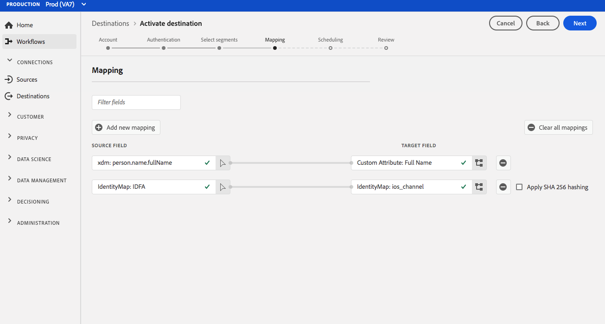

# (Beta) [!DNL Airship Attributes] Verbindung {#airship-attributes-destination}

>[!IMPORTANT]
>
>Das [!DNL Airship Attributes]-Ziel in Adobe Experience Platform befindet sich derzeit in der Betaphase. Dokumentation und Funktionalität können sich ändern.

## Übersicht {#overview}

[!DNL Airship] ist die führende Plattform für Kundeninteraktionen, mit der Sie Ihren Benutzern in allen Phasen des Kundenlebenszyklus sinnvolle, personalisierte Omnichannel-Nachrichten bereitstellen können.

Durch diese Integration werden Adobe-Profildaten zum Targeting oder zur Auslösung als [Attribute](https://docs.airship.com/guides/audience/attributes/) an [!DNL Airship] übergeben.

Weitere Informationen zu [!DNL Airship] finden Sie in den [Airship Docs](https://docs.airship.com).

>[!TIP]
>
>Diese Dokumentationsseite wurde vom [!DNL Airship]-Team erstellt. Bei Fragen oder Aktualisierungsanfragen wenden Sie sich bitte direkt an [support.airship.com](https://support.airship.com/).

## Voraussetzungen {#prerequisites}

Bevor Sie Ihre Zielgruppensegmente an [!DNL Airship] senden können, müssen Sie Folgendes tun:

* Aktivieren Sie Attribute in Ihrem [!DNL Airship]-Projekt.
* Generieren Sie ein Trägertoken zur Authentifizierung.

>[!TIP]
>
>Erstellen Sie ein [!DNL Airship]-Konto über [diesen Anmelde-Link](https://go.airship.eu/accounts/register/plan/starter/), falls noch nicht geschehen.

## Attribute aktivieren {#enable-attributes}

Adobe Experience Platform-Profilattribute ähneln [!DNL Airship] -Attributen und können in Platform mithilfe des im Folgenden auf dieser Seite beschriebenen Mapping-Tools einfach zugeordnet werden.

[!DNL Airship] -Projekte haben mehrere vordefinierte und standardmäßige Attribute. Wenn Sie über ein benutzerdefiniertes Attribut verfügen, müssen Sie es zuerst in [!DNL Airship] definieren. Weitere Informationen finden Sie unter [Attribute einrichten und verwalten](https://docs.airship.com/tutorials/audience/attributes/) .

## Bearer-Token generieren {#bearer-token}

Gehen Sie zu **[!UICONTROL Einstellungen]**&quot; **[!UICONTROL APIs und Integrationen]** im [Airship Dashboard](https://go.airship.com) und wählen Sie im Menü links **[!UICONTROL Tokens]** aus.

Klicken Sie auf **[!UICONTROL Token erstellen]**.

Geben Sie einen benutzerfreundlichen Namen für Ihr Token ein, z. B. &quot;Adobe Attributes Destination&quot;und wählen Sie &quot;All Access&quot;für die  aus.

Klicken Sie auf **[!UICONTROL Token erstellen]** und speichern Sie die Details als vertraulich.

## Anwendungsbeispiele {#use-cases}

Um Ihnen zu helfen, besser zu verstehen, wie und wann Sie das [!DNL Airship Attributes]-Ziel verwenden sollten, finden Sie hier Beispielanwendungsfälle, die Adobe Experience Platform-Kunden mit diesem Ziel lösen können.

### Anwendungsfall 1

Nutzen Sie in Adobe Experience Platform erfasste Profildaten zur Personalisierung der Nachricht und des Rich-Inhalts in einem der Kanäle von [!DNL Airship]. Verwenden Sie beispielsweise [!DNL Experience Platform]-Profildaten, um Standortattribute in [!DNL Airship] festzulegen. Dadurch kann eine Hotelmarke für jeden Benutzer ein Bild für den nächstgelegenen Hotelstandort anzeigen.

### Anwendungsfall 2

Nutzen Sie Attribute aus Adobe Experience Platform, um [!DNL Airship]-Profile weiter anzureichern und sie mit SDK- oder [!DNL Airship]-Prognosedaten zu kombinieren. Beispielsweise kann ein Einzelhändler ein Segment mit Treuestatus und Standortdaten (Attribute von Platform) erstellen und [!DNL Airship] mit Abwanderungsdaten erstellen, um hochgradig zielgerichtete Nachrichten an Benutzer mit dem Gold-Treuestatus zu senden, die in Las Vegas, NV leben und eine hohe Wahrscheinlichkeit für Abwanderung haben.

## Mit Ziel verbinden {#connect}

Anweisungen zum Aktivieren von Zielgruppensegmenten für dieses Ziel finden Sie unter [Aktivieren von Zielgruppendaten für Streaming-Segmentexportziele](../../ui/activate-segment-streaming-destinations.md) .

### Verbindungsparameter {#parameters}

Während [Einrichten](../../ui/connect-destination.md) dieses Ziels müssen Sie die folgenden Informationen angeben:

* **[!UICONTROL Trägertoken]**: das Inhaber-Token, das Sie über das  [!DNL Airship] Dashboard generiert haben.
* **[!UICONTROL Name]**: Geben Sie einen Namen ein, der Ihnen bei der Identifizierung dieses Ziels hilft.
* **[!UICONTROL Beschreibung]**: Geben Sie eine Beschreibung für dieses Ziel ein.
* **[!UICONTROL Domäne]**: Wählen Sie entweder ein US- oder ein EU-Rechenzentrum aus, je nachdem, welches  [!DNL Airship] Rechenzentrum für dieses Ziel gilt.

## Aktivieren von Segmenten für dieses Ziel {#activate}

Anweisungen zum Aktivieren von Zielgruppensegmenten für dieses Ziel finden Sie unter [Aktivieren von Zielgruppendaten für Streaming-Segmentexportziele](../../ui/activate-segment-streaming-destinations.md) .

## Zuordnungsüberlegungen {#mapping-considerations}

[!DNL Airship] -Attribute können entweder für einen Kanal festgelegt werden, der die Geräteinstanz darstellt, z. B. iPhone, oder für einen benannten Benutzer, der alle Geräte eines Benutzers einer gemeinsamen Kennung wie einer Kunden-ID zuordnet. Wenn Sie E-Mail-Adressen mit normalem Text (ungehasht) als primäre Identität in Ihrem Schema haben, wählen Sie das E-Mail-Feld in Ihrem **[!UICONTROL Quellattribute]** aus und ordnen Sie es in der rechten Spalte unter **[!UICONTROL Zielidentitäten]** dem benannten Benutzer [!DNL Airship] zu, wie unten dargestellt.

Bei Kennungen, die einem Kanal zugeordnet werden sollen, d. h. einem Gerät, müssen Sie basierend auf der Quelle dem entsprechenden Kanal zuordnen. Die folgenden Abbildungen zeigen, wie zwei Zuordnungen erstellt werden:

* IDFA iOS-Advertising-ID für einen iOS-Kanal [!DNL Airship]
* Attribut Adobe `fullName` des Attributs [!DNL Airship] &quot;Vollständiger Name&quot;

>[!NOTE]
>
>Verwenden Sie den benutzerfreundlichen Namen, der im Dashboard [!DNL Airship] angezeigt wird, wenn Sie das Zielfeld für Ihr Attribut-Mapping auswählen.

**Zuordnungsidentität**

Quellfeld auswählen:

Zielgruppenfeld auswählen:

**Zuordnungsattribut**

Quellattribut auswählen:

Wählen Sie das Zielattribut aus:

Überprüfung der Zuordnung:

## Datennutzung und -verwaltung {#data-usage-governance}

Alle [!DNL Adobe Experience Platform]-Ziele sind bei der Verarbeitung Ihrer Daten mit Datennutzungsrichtlinien konform. Detaillierte Informationen dazu, wie [!DNL Adobe Experience Platform] Data Governance durchsetzt, finden Sie unter [Übersicht über Data Governance](../../../data-governance/home.md).
