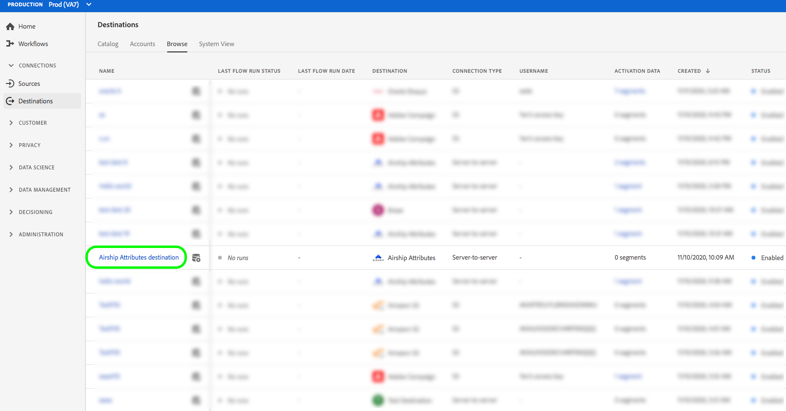

# (Beta) [!DNL Airship Attributes] Verbindung {#airship-attributes-destination}

>[!IMPORTANT]
>
>Das [!DNL Airship Attributes]-Ziel in Adobe Experience Platform befindet sich derzeit in der Betaphase. Die Dokumentation und Funktionalität können sich ändern.

## Übersicht {#overview}

[!DNL Airship] ist die führende Plattform für Kundeninteraktion, mit der Sie Ihren Benutzern in jeder Phase des Kundenlebenszyklus aussagekräftige, personalisierte Omniannel-Nachrichten bereitstellen können.

Diese Integration übergibt Profil-Daten der Adobe zum Targeting oder Auslösen als [Attribute](https://docs.airship.com/guides/audience/attributes/).[!DNL Airship]

Weitere Informationen zu [!DNL Airship] finden Sie unter [Luftfrachtdokumente](https://docs.airship.com).

>[!TIP]
>
>Diese Dokumentationsseite wurde vom [!DNL Airship]-Team erstellt. Für Anfragen oder Aktualisierungsanfragen wenden Sie sich bitte direkt an [support.airship.com](https://support.airship.com/).

## Voraussetzungen {#prerequisites}

Bevor Sie Ihre Audiencen an [!DNL Airship] senden können, müssen Sie Folgendes tun:

* Aktivieren Sie Attribute in Ihrem [!DNL Airship]-Projekt.
* Generieren Sie ein Inhabertoken zur Authentifizierung.

>[!TIP]
>
>Erstellen Sie ein [!DNL Airship]-Konto über [diesen Anmeldelink](https://go.airship.eu/accounts/register/plan/starter/), falls noch nicht geschehen.

## Attribute {#enable-attributes} aktivieren

Adobe Experience Platform-Profil-Attribute ähneln [!DNL Airship]-Attributen und können in Platform mithilfe des unten auf dieser Seite dargestellten Zuordnungswerkzeugs einfach zugeordnet werden.

[!DNL Airship] Projekte haben mehrere vordefinierte und standardmäßige Attribute. Wenn Sie über ein benutzerdefiniertes Attribut verfügen, müssen Sie es zuerst in [!DNL Airship] definieren. Weitere Informationen finden Sie unter [Attribute einrichten und verwalten](https://docs.airship.com/tutorials/audience/attributes/).

## Überbringungstoken {#bearer-token} generieren

Gehen Sie zu **[!UICONTROL Settings]**&quot; **[!UICONTROL APIs und Integrationen]** im [Airship-Dashboard](https://go.airship.com) und wählen Sie **[!UICONTROL Tokens]** im Menü links.

Klicken Sie auf **[!UICONTROL Token erstellen]**.

Geben Sie einen benutzerfreundlichen Namen für Ihr Token ein, z. B. &quot;Zielort für Adoben-Attribute&quot;und wählen Sie &quot;Zugriff für alle&quot;für die Rolle.

Klicken Sie auf **[!UICONTROL Token erstellen]** und speichern Sie die Details als vertraulich.

## Anwendungsbeispiele {#use-cases}

Damit Sie besser verstehen können, wie und wann Sie das [!DNL Airship Attributes]-Ziel verwenden sollten, finden Sie hier Beispiele für Anwendungsfälle, die Adobe Experience Platform-Kunden mit diesem Ziel lösen können.

### Verwendungsfall Nr. 1

Nutzen Sie die in Adobe Experience Platform erfassten Profil-Daten zur Personalisierung der Nachricht und des Rich-Content in einem der [!DNL Airship]-Kanal. Verwenden Sie beispielsweise [!DNL Experience Platform]-Profil, um Positionsattribute innerhalb von [!DNL Airship] festzulegen. Dadurch kann eine Hotelmarke ein Bild für den nächstgelegenen Hotelstandort für jeden Benutzer anzeigen.

### Verwendungsfall Nr. 2

Nutzen Sie Attribute von Adobe Experience Platform, um [!DNL Airship]-Profil weiter zu bereichern und diese mit SDK- oder [!DNL Airship]-Vorhersagedaten zu kombinieren. Ein Einzelhändler kann beispielsweise ein Segment mit Treuestatus- und Standortdaten (Attribute von Plattform) erstellen und [!DNL Airship]-Daten abgeben, um hochgradig zielgerichtete Nachrichten an Benutzer im Goldloyalitätsstatus zu senden, die in Las Vegas, NV leben und eine hohe Wahrscheinlichkeit haben, sich zu kurbeln.

## Verbinden mit [!DNL Airship Attributes] {#connect-airship-attributes}

Führen Sie in **[!UICONTROL Ziele]** > **[!UICONTROL Katalog]** einen Bildlauf zur Kategorie **[!UICONTROL Mobile Interaktion]** durch. Wählen Sie **[!DNL Airship Attributes]** und dann **[!UICONTROL Konfigurieren]**.

>[!NOTE]
>
>Wenn bereits eine Verbindung zu diesem Ziel besteht, wird auf der Zielkarte die Schaltfläche **[!UICONTROL Aktivieren]** angezeigt. Weitere Informationen zum Unterschied zwischen **[!UICONTROL Aktivieren]** und **[!UICONTROL Konfigurieren]** finden Sie im Abschnitt [Katalog](../../ui/destinations-workspace.md#catalog) der Dokumentation zum Zielarbeitsbereich.

Wenn Sie im Schritt **Konto** zuvor eine Verbindung zu Ihrem [!DNL Airship Attributes]-Ziel eingerichtet haben, wählen Sie **[!UICONTROL Vorhandenes Konto]** und wählen Sie Ihre bestehende Verbindung aus. Sie können auch **[!UICONTROL Neues Konto]** auswählen, um eine neue Verbindung zu [!DNL Airship Attributes] einzurichten. Wählen Sie **[!UICONTROL Mit Ziel]** verbinden, um Adobe Experience Platform mit Ihrem [!DNL Airship]-Projekt zu verbinden, indem Sie das Inhabertoken verwenden, das Sie aus dem [!DNL Airship]-Dashboard generiert haben.

>[!NOTE]
>
>Adobe Experience Platform unterstützt die Berechtigungsüberprüfung im Authentifizierungsprozess und zeigt eine Fehlermeldung an, wenn Sie falsche Berechtigungen in Ihr [!DNL Airship]-Konto eingeben. Dadurch wird sichergestellt, dass Sie den Workflow nicht mit falschen Anmeldedaten ausführen.

Nachdem Sie Ihre Anmeldedaten bestätigt haben und Adobe Experience Platform mit Ihrem [!DNL Airship]-Projekt verbunden ist, können Sie **[!UICONTROL Weiter]** auswählen, um mit dem Schritt **[!UICONTROL Setup]** fortzufahren.

Geben Sie im Schritt **[!UICONTROL Authentication]** einen **[!UICONTROL Name]** und einen **[!UICONTROL Description]** für die Aktivierung ein.

Außerdem können Sie in diesem Schritt entweder das US- oder das EU-Rechenzentrum auswählen, je nachdem, welches [!DNL Airship]-Rechenzentrum für dieses Ziel gilt. Wählen Sie schließlich eine oder mehrere **[!UICONTROL Marketingaktionen]** aus, für die Daten in das Ziel exportiert werden. Sie können aus von der Adobe definierten Marketingaktionen auswählen oder eigene erstellen. Weitere Informationen zu Marketingaktionen finden Sie unter [Übersicht über Datenverwendungsrichtlinien](../../../data-governance/policies/overview.md).

Wählen Sie **[!UICONTROL Ziel erstellen]** aus, nachdem Sie die oben stehenden Felder ausgefüllt haben.

Ihr Ziel wird jetzt erstellt. Sie können **[!UICONTROL Speichern und beenden]** auswählen, wenn Sie Segmente später aktivieren möchten, oder Sie können **[!UICONTROL Weiter]** wählen, um den Workflow fortzusetzen und Segmente zur Aktivierung auszuwählen. In beiden Fällen finden Sie den Rest des Workflows im nächsten Abschnitt [Segmente aktivieren](#activate-segments).

## Aktivieren von Segmenten {#activate-segments}

Gehen Sie wie folgt vor, um Segmente nach [!DNL Airship Attributes] zu aktivieren:

Wählen Sie unter **[!UICONTROL Ziele > Durchsuchen]** das Ziel aus, an dem Sie Ihre Segmente aktivieren möchten.[!DNL Airship Attributes]

Klicken Sie auf den Namen des Ziels. So gelangen Sie zum Aktivierungsfluss.

Beachten Sie, dass, wenn für ein Ziel bereits ein Seitenfluss vorhanden ist, die Aktivierungen angezeigt werden, die derzeit an das Ziel gesendet werden. Wählen Sie in der rechten Leiste die Option **[!UICONTROL Aktivierung bearbeiten]** und führen Sie die unten beschriebenen Schritte aus, um die Aktivierungsdetails zu ändern.

Wählen Sie **[!UICONTROL Aktivieren]**. Wählen Sie im Arbeitsablauf **[!UICONTROL Ziel aktivieren]** auf der Seite **[!UICONTROL Segmente auswählen]** die Segmente aus, die an [!DNL Airship Attributes] gesendet werden sollen.

Wählen Sie im Schritt **[!UICONTROL Zuordnung]** aus dem Schema [XDM](../../../xdm/home.md), welche Attribute und Identitäten dem Ziel-Schema zugeordnet werden sollen. Wählen Sie **[!UICONTROL Hinzufügen neue Zuordnung]**, um Ihr Schema zu durchsuchen und es der entsprechenden Zielgruppe zuzuordnen.

[!DNL Airship] Attribute können entweder auf einem Kanal festgelegt werden, der eine Geräteinstanz darstellt, z. B. iPhone, oder auf einem benannten Benutzer, der alle Geräte eines Benutzers einem allgemeinen Bezeichner wie einer Kunden-ID zuordnet. Wenn Sie in Ihrem Schema als primäre Identität Nur-Text-E-Mail-Adressen (ohne Hashing) verwenden, wählen Sie das E-Mail-Feld in Ihrer **[!UICONTROL Quellattribute]** aus und ordnen Sie es dem [!DNL Airship] benannten Benutzer in der rechten Spalte unter **[!UICONTROL Zielgruppen-ID]** zu, wie unten dargestellt.

Bei Identifikatoren, die einem Kanal zugeordnet werden sollen, d. h. einem Gerät, müssen Sie dem entsprechenden Kanal je nach Quelle zugeordnet werden. Die folgenden Bilder zeigen, wie zwei Zuordnungen erstellt werden:

* IDFA-iOS-Anzeigen-ID für einen [!DNL Airship]-iOS-Kanal
* Adobe `fullName` Attribut zu [!DNL Airship] &quot;Vollständiger Name&quot;-Attribut

>[!NOTE]
>
>Verwenden Sie den benutzerfreundlichen Namen, der im Dashboard [!DNL Airship] angezeigt wird, wenn Sie das Feld &quot;Zielgruppe&quot;für Ihre Attributzuordnung auswählen.

**Identität zuordnen**

Quellfeld auswählen:

Feld Zielgruppe auswählen:

**Map-Attribut**

Quellattribut auswählen:

Zielgruppe auswählen:

Zuordnung überprüfen:

Auf der Seite **[!UICONTROL Segmentplan]** ist die Planung derzeit deaktiviert. Klicken Sie auf **[!UICONTROL Weiter]**, um mit dem Review-Schritt fortzufahren.

Auf der Seite **[!UICONTROL Überprüfen]** können Sie eine Zusammenfassung Ihrer Auswahl sehen. Wählen Sie **[!UICONTROL Abbrechen]**, um den Fluss abzubrechen, **[!UICONTROL Zurück]**, um die Einstellungen zu ändern, oder **[!UICONTROL Fertig stellen]**, um Ihre Auswahl zu bestätigen und mit dem Senden von Daten an das Ziel zu beginnen.

>[!IMPORTANT]
>
>In diesem Schritt prüft Adobe Experience Platform, ob die Datenschutzrichtlinien verletzt wurden. Unten sehen Sie ein Beispiel, bei dem eine Richtlinie verletzt wird. Sie können den Segmentarbeitsablauf erst dann abschließen, wenn Sie die Aktivierung gelöst haben. Informationen zum Beheben von Richtlinienverletzungen finden Sie unter [Richtliniendurchsetzung](../../../data-governance/enforcement/auto-enforcement.md) im Abschnitt zur Datenverwaltung.

Wenn keine Richtlinienverletzungen festgestellt wurden, wählen Sie **[!UICONTROL Fertigstellen]**, um Ihre Auswahl zu bestätigen und den Beginn, der Daten an das Ziel sendet, zu bestätigen.

## Datenverwendung und -verwaltung {#data-usage-governance}

Alle [!DNL Adobe Experience Platform]-Ziele sind bei der Verarbeitung Ihrer Daten mit den Datenverwendungsrichtlinien konform. Detaillierte Informationen dazu, wie [!DNL Adobe Experience Platform] die Datenverwaltung erzwingt, finden Sie unter [Übersicht über die Datenverwaltung](../../../data-governance/home.md).
