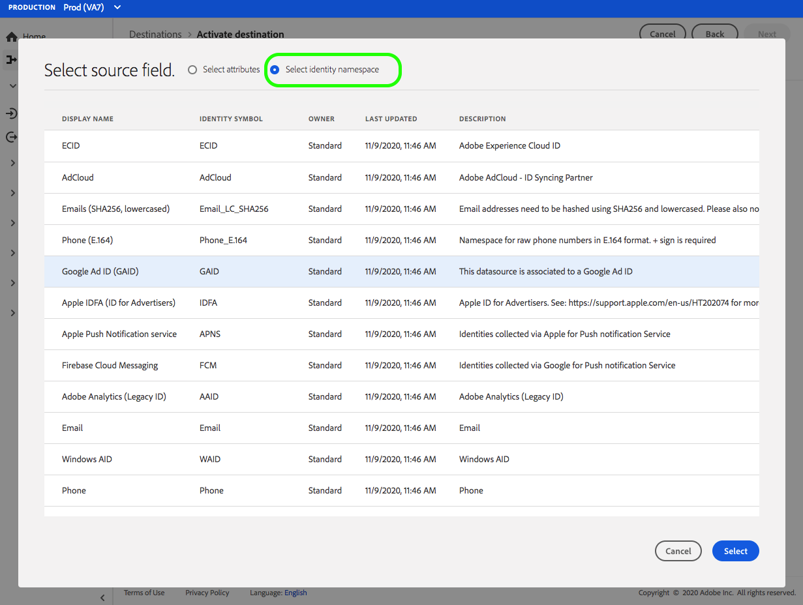

# [!DNL Airship Tags]-Verbindung {#airship-tags-destination}

## Überblick {#overview}

[!DNL Airship] ist die führende Plattform für Kundeninteraktion, mit der Sie Ihren Benutzern in jeder Phase des Kundenlebenszyklus aussagekräftige, personalisierte Omni-Channel-Messaging bereitstellen können.

Diese Integration übergibt [!DNL Adobe Experience Platform] Zielgruppendaten als [!DNL Airship]Tags[&#x200B; zum Targeting oder Triggern an &#x200B;](https://docs.airship.com/guides/audience/tags/).

Weitere Informationen zu [!DNL Airship] finden Sie unter [Airship Docs](https://docs.airship.com).

>[!TIP]
>
>Dieser Ziel-Connector und diese Dokumentationsseite werden vom [!DNL Airship]-Team erstellt und gepflegt. Bei Fragen oder Aktualisierungsanfragen wenden Sie sich bitte direkt an [support.airship.com](https://support.airship.com/).

## Voraussetzungen {#prerequisites}

Bevor Sie Ihre [!DNL Adobe Experience Platform] Zielgruppen an [!DNL Airship] senden können, müssen Sie:

* Erstellen Sie eine Tag-Gruppe in Ihrem [!DNL Airship].
* Erzeugt ein Bearer-Token zur Authentifizierung.

>[!TIP]
>
>Erstellen Sie über [!DNL Airship]diesen Anmelde-Link[&#x200B; ein &#x200B;](https://go.airship.eu/accounts/register/plan/starter/)-Konto, falls noch nicht geschehen.

## Unterstützte Zielgruppen {#supported-audiences}

In diesem Abschnitt wird beschrieben, welche Arten von Zielgruppen Sie an dieses Ziel exportieren können.

| Zielgruppenherkunft | Unterstützt | Beschreibung |
|---------|----------|----------|
| [!DNL Segmentation Service] | Ja | Zielgruppen, die über den Experience Platform-[&#x200B; (Segmentierungs-Service) generiert &#x200B;](../../../segmentation/home.md). |
| Alle anderen Ursprünge der Zielgruppe | Ja | Diese Kategorie enthält alle Ursprünge der Zielgruppe außerhalb der Zielgruppen, die durch die [!DNL Segmentation Service] generiert wurden. Lesen Sie mehr über [verschiedene Ursprünge von Audiences](/help/segmentation/ui/audience-portal.md#customize). Einige Beispiele: <ul><li> benutzerdefinierte Upload-Zielgruppen [importiert](../../../segmentation/ui/audience-portal.md#import-audience) aus CSV-Dateien in Experience Platform,</li><li> Lookalike-Zielgruppen, </li><li> Federated Audiences, </li><li> Zielgruppen, die in anderen Experience Platform-Apps generiert werden, z. B. [!DNL Adobe Journey Optimizer], </li><li> und mehr. </li></ul> |

{style="table-layout:auto"}

Unterstützte Zielgruppen nach Zielgruppen-Datentyp:

| Datentyp der Zielgruppe | Unterstützt | Beschreibung | Anwendungsfälle |
|--------------------|-----------|-------------|-----------|
| [Personen-Zielgruppen](/help/segmentation/types/people-audiences.md) | Ja | Basierend auf Kundenprofilen können Sie bestimmte Personengruppen für Marketing-Kampagnen ansprechen. | Häufige Käufer, Warenkorbabbrüche |
| [Konto-Zielgruppen](/help/segmentation/types/account-audiences.md) | Nein | Targeting von Personen in bestimmten Organisationen für Account-basierte Marketing-Strategien. | B2B-Marketing |
| [Interessenten-Zielgruppen](/help/segmentation/types/prospect-audiences.md) | Nein | Targeting von Personen, die noch keine Kunden sind, aber Merkmale mit Ihrer Zielgruppe teilen. | Akquise mit Drittanbieterdaten |
| [Datensatzexporte](/help/catalog/datasets/overview.md) | Nein | Sammlungen strukturierter Daten, die im Data Lake von [!DNL Adobe Experience Platform] gespeichert sind. | Reporting, Datenwissenschaft-Workflows |

{style="table-layout:auto"}

## Exporttyp und -häufigkeit {#export-type-frequency}

Beziehen Sie sich auf die folgende Tabelle, um Informationen zu Typ und Häufigkeit des Zielexports zu erhalten.

| Element | Typ | Anmerkungen |
|---------|----------|---------|
| Exporttyp | **[!UICONTROL Audience export]** | Sie exportieren alle Mitglieder einer Zielgruppe mit den IDs, die im Ziel „Airship Tags“ verwendet werden. |
| Exporthäufigkeit | **[!UICONTROL Streaming]** | Streaming-Ziele sind „immer verfügbare“ API-basierte Verbindungen. Sobald ein Profil in Experience Platform auf der Grundlage einer Zielgruppenauswertung aktualisiert wird, sendet der Connector das Update nachgelagert an die Zielplattform. Lesen Sie mehr über [Streaming-Ziele](/help/destinations/destination-types.md#streaming-destinations). |

{style="table-layout:auto"}

## Tag-Gruppen {#tag-groups}

Das Konzept der Zielgruppen in Adobe Experience Platform ähnelt [Tags](https://docs.airship.com/guides/audience/tags/) in Airship, mit leichten Unterschieden in der Implementierung. Diese Integration ordnet den Status der [&#x200B; eines Benutzers in einem Experience Platform](../../../xdm/field-groups/profile/segmentation.md)Segment dem Vorhandensein oder Nichtvorhandensein eines [!DNL Airship]-Tags zu. In einer Experience Platform-Zielgruppe, in der sich der `xdm:status` in &quot;`realized`&quot; ändert, wird das Tag beispielsweise dem [!DNL Airship]-Kanal oder dem benannten Benutzer hinzugefügt, dem dieses Profil zugeordnet ist. Wenn sich die `xdm:status` in `exited` ändert, wird das Tag entfernt.

Um diese Integration zu aktivieren, erstellen Sie eine *Tag-Gruppe* in [!DNL Airship] namens `adobe-segments`.

>[!IMPORTANT]
>
>Wählen Sie beim Erstellen Ihrer neuen Tag **Gruppe „Nicht**&quot; das Optionsfeld aus, auf dem &quot;[!DNL Allow these tags to be set only from your server]&quot; steht. Dadurch schlägt die Adobe Tags-Integration fehl.

Anweisungen [&#x200B; Erstellen der Tag](https://docs.airship.com/tutorials/manage-project/messaging/tag-groups)Gruppe finden Sie unter „Verwalten von Tag-Gruppen“.

## Bearer-Token generieren {#generate-bearer-token}

Gehen Sie zu **[!UICONTROL Settings]**&quot; **[!UICONTROL APIs & Integrations]** im [Airship Dashboard](https://go.airship.com) und wählen Sie **[!UICONTROL Tokens]** im Menü links aus.

Klicken Sie auf **[!UICONTROL Create Token]**.

Geben Sie einen benutzerfreundlichen Namen für Ihr Token an, z. B. &quot;Adobe Tags-Ziel“, und wählen Sie für die Rolle „Zugriff auf alle“ aus.

Klicken Sie auf **[!UICONTROL Create Token]** und speichern Sie die Details als vertraulich.

## Anwendungsfälle {#use-cases}

Damit Sie besser verstehen können, wie und wann Sie das [!DNL Airship Tags]-Ziel verwenden sollten, finden Sie hier einige Beispielanwendungsfälle, die [!DNL Adobe Experience Platform] Kunden mit diesem Ziel bewältigen können.

### Anwendungsfall #1 {#use-case-1}

Einzelhändler oder Unterhaltungsplattformen können Benutzerprofile für ihre Treuekunden erstellen und diese Zielgruppen an [!DNL Airship] für das Nachrichten-Targeting in Mobile-Kampagnen weiterleiten.

### Anwendungsfall #2 {#use-case-2}

Trigger von Eins-zu-eins-Nachrichten in Echtzeit, wenn Benutzende in bestimmte Zielgruppen innerhalb von [!DNL Adobe Experience Platform] fallen oder aus ihnen herausfallen.

Beispiel: Ein retailer richtet eine markenspezifische Zielgruppe für Jeans in Experience Platform ein. Dass retailer jetzt eine Mobile-Nachricht als Trigger verwenden kann, sobald jemand seine Jeans-Präferenz auf eine bestimmte Marke festlegt.

## Herstellen einer Verbindung mit dem Ziel {#connect}

>[!IMPORTANT]
>
>Um eine Verbindung zum Ziel herzustellen, benötigen Sie die **[!UICONTROL View Destinations]** und **[!UICONTROL Manage Destinations]** Zugriffssteuerungsberechtigungen[. &#x200B;](/help/access-control/home.md#permissions) Lesen Sie die [Zugriffskontrolle – Übersicht](/help/access-control/ui/overview.md) oder wenden Sie sich an Ihren Produktadministrator, um die erforderlichen Berechtigungen zu erhalten.

Um eine Verbindung mit diesem Ziel herzustellen, gehen Sie wie im [Tutorial zur Zielkonfiguration](../../ui/connect-destination.md) beschrieben vor. Füllen Sie im Workflow zum Konfigurieren des Ziels die Felder aus, die in den beiden folgenden Abschnitten aufgeführt sind.

### Beim Ziel authentifizieren {#authenticate}

Um sich beim Ziel zu authentifizieren, füllen Sie die erforderlichen Felder aus und wählen Sie **[!UICONTROL Connect to destination]** aus.

* **[!UICONTROL Bearer token]**: Das Bearer-Token, das Sie aus dem [!DNL Airship]-Dashboard generiert haben.

### Ausfüllen der Zieldetails {#destination-details}

Füllen Sie die folgenden erforderlichen und optionalen Felder aus, um Details für das Ziel zu konfigurieren. Ein Sternchen neben einem Feld in der Benutzeroberfläche zeigt an, dass das Feld erforderlich ist.

* **[!UICONTROL Name]**: Geben Sie einen Namen ein, der Ihnen bei der Identifizierung dieses Ziels hilft.
* **[!UICONTROL Description]**: Geben Sie eine Beschreibung für dieses Ziel ein.
* **[!UICONTROL Domain]**: Wählen Sie entweder ein US- oder ein EU-Rechenzentrum aus, je nachdem, welches [!DNL Airship] Rechenzentrum für dieses Ziel gilt.

### Aktivieren von Warnhinweisen {#enable-alerts}

Sie können Warnhinweise aktivieren, um Benachrichtigungen zum Status des Datenflusses zu Ihrem Ziel zu erhalten. Wählen Sie einen Warnhinweis aus der zu abonnierenden Liste aus, um Benachrichtigungen über den Status Ihres Datenflusses zu erhalten. Weitere Informationen zu Warnhinweisen finden Sie im Handbuch zum [Abonnieren von Zielwarnhinweisen über die Benutzeroberfläche](../../ui/alerts.md).

Wenn Sie mit dem Eingeben der Details für Ihre Zielverbindung fertig sind, wählen Sie **[!UICONTROL Next]** aus.

## Aktivieren von Zielgruppen für dieses Ziel {#activate}

>[!IMPORTANT]
>
>Zum Aktivieren von Daten benötigen Sie die **[!UICONTROL View Destinations]**, **[!UICONTROL Activate Destinations]**, **[!UICONTROL View Profiles]** und **[!UICONTROL View Segments]** [Zugriffssteuerungsberechtigungen](/help/access-control/home.md#permissions). Lesen Sie die [Übersicht über die Zugriffssteuerung](/help/access-control/ui/overview.md) oder wenden Sie sich an Ihre Produktadmins, um die erforderlichen Berechtigungen zu erhalten.

Anweisungen zum Aktivieren von Zielgruppen für dieses Ziel finden Sie unter [Aktivieren von Zielgruppendaten für Streaming-Zielgruppen-Exportziele](../../ui/activate-segment-streaming-destinations.md).

## Zuordnungsüberlegungen {#mapping-considerations}

[!DNL Airship] Tags können entweder für einen Kanal festgelegt werden, der eine Geräteinstanz darstellt, z. B. iPhone, oder für einen benannten Benutzer, der alle Geräte eines Benutzers einer gemeinsamen Kennung wie einer Kunden-ID zuordnet. Wenn Sie in Ihrem Schema E-Mail-Adressen im Klartext (ungehasht) als primäre Identität haben, wählen Sie das E-Mail-Feld in Ihrem **[!UICONTROL Source Attributes]** aus und ordnen Sie sie dem [!DNL Airship] namens Benutzer in der rechten Spalte unter **[!UICONTROL Target Identities]** zu, wie unten dargestellt.

Bei Bezeichnern, die einem Kanal, d. h. einem Gerät, zugeordnet werden sollen, müssen Sie dem entsprechenden Kanal basierend auf der Quelle zuordnen. Die folgenden Bilder zeigen, wie Sie einem [!DNL Airship] Android-Kanal eine Google Advertising ID zuordnen.

## Datennutzung und -Governance {#data-usage-governance}

Alle [!DNL Adobe Experience Platform]-Ziele sind bei der Verarbeitung Ihrer Daten mit Datennutzungsrichtlinien konform. Ausführliche Informationen darüber, wie [!DNL Adobe Experience Platform] Data Governance erzwingt, finden Sie unter [Data Governance - Übersicht](../../../data-governance/home.md).
