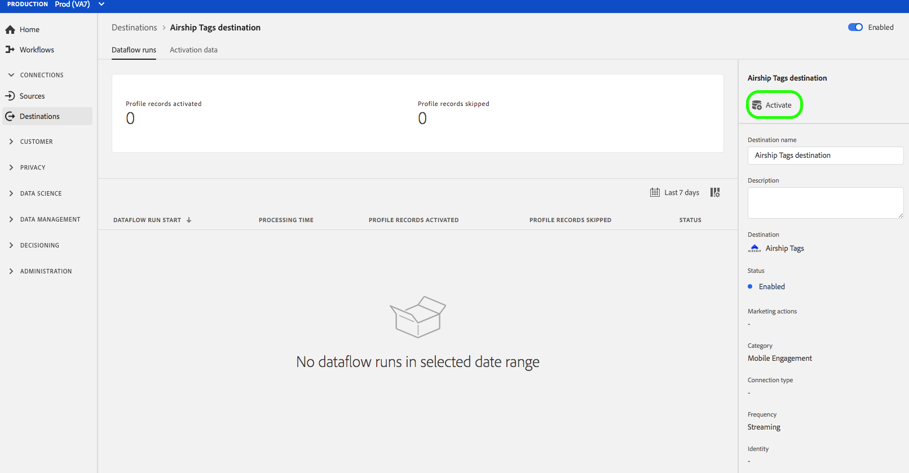

# (Beta) [!DNL Airship Tags] Verbindung {#airship-tags-destination}

>[!IMPORTANT]
>
>Das [!DNL Airship Tags]-Ziel in Adobe Experience Platform befindet sich derzeit in der Betaphase. Dokumentation und Funktionalität können sich ändern.

## Übersicht

[!DNL Airship] ist die führende Plattform für Kundeninteraktion, mit der Sie Ihren Benutzern in jeder Phase des Kundenlebenszyklus aussagekräftige, personalisierte Omniannel-Nachrichten bereitstellen können.

Diese Integration übergibt Adobe Experience Platform-Segmentdaten zum Targeting oder Auslösen als [Tags](https://docs.airship.com/guides/audience/tags/).[!DNL Airship]

Weitere Informationen zu [!DNL Airship] finden Sie unter [Luftfrachtdokumente](https://docs.airship.com).

>[!TIP]
>
>Diese Dokumentationsseite wurde vom [!DNL Airship]-Team erstellt. Für Anfragen oder Aktualisierungsanfragen wenden Sie sich bitte direkt an [support.airship.com](https://support.airship.com/).

## Voraussetzungen

Bevor Sie Ihre Adobe Experience Platform-Segmente an [!DNL Airship] senden können, müssen Sie:

* Erstellen Sie eine Tag-Gruppe im [!DNL Airship]-Projekt.
* Generieren Sie ein Inhabertoken zur Authentifizierung.

>[!TIP]
> 
>Erstellen Sie ein [!DNL Airship]-Konto über [diesen Anmeldelink](https://go.airship.eu/accounts/register/plan/starter/), falls noch nicht geschehen.

## Tag-Gruppen

Das Konzept der Segmente in der Adobe-Erlebnisplattform ähnelt dem von [Tags](https://docs.airship.com/guides/audience/tags/) in Airship, wobei sich die Implementierung geringfügig unterscheidet. Diese Integration ordnet den Status der [Mitgliedschaft eines Benutzers in einem Experience Platform-Segment](https://experienceleague.adobe.com/docs/experience-platform/xdm/mixins/profile/segmentation.html?lang=en#mixins) dem Vorhandensein oder Nichtvorhandensein eines [!DNL Airship]-Tags zu. In einem Plattformsegment, in dem `xdm:status` zu `realized` wechselt, wird das Tag dem Kanal [!DNL Airship] hinzugefügt oder dem dieser Profil zugeordnet wird. Wenn sich `xdm:status` in `exited` ändert, wird das Tag entfernt.

Um diese Integration zu aktivieren, erstellen Sie eine *Tag-Gruppe* in [!DNL Airship] mit dem Namen `adobe-segments`.

>[!IMPORTANT]
>
>Wenn Sie Ihre neue Tag-Gruppe **Markieren Sie nicht** das Optionsfeld mit der Meldung &quot;[!DNL Allow these tags to be set only from your server]&quot;. Dadurch schlägt die Integration der Adobe-Tags fehl.

Anweisungen zum Erstellen der Tag-Gruppe finden Sie unter [Tag-Gruppen verwalten](https://docs.airship.com/tutorials/manage-project/messaging/tag-groups).

## Überbringungstoken generieren

Gehen Sie zu **[!UICONTROL Settings]**&quot; **[!UICONTROL APIs und Integrationen]** im [Airship-Dashboard](https://go.airship.com) und wählen Sie **[!UICONTROL Tokens]** im Menü links.

Klicken Sie auf **[!UICONTROL Token erstellen]**.

Geben Sie einen benutzerfreundlichen Namen für das Token ein, z. B. &quot;Ziel der Adobe-Tags&quot;und wählen Sie &quot;Zugriff für alle&quot;für die Rolle.

Klicken Sie auf **[!UICONTROL Token erstellen]** und speichern Sie die Details als vertraulich.

## Anwendungsbeispiele

Damit Sie besser verstehen können, wie und wann Sie das [!DNL Airship Tags]-Ziel verwenden sollten, finden Sie hier Beispiele für Anwendungsfälle, die Adobe Experience Platform-Kunden mit diesem Ziel lösen können.

### Verwendungsfall Nr. 1

Einzelhändler oder Unterhaltungsplattformen können Profil für ihre Kundentreue erstellen und diese Segmente für das Messaging auf mobilen Kampagnen an [!DNL Airship] übergeben.

### Verwendungsfall Nr. 2

Trigger von Eins-zu-Eins-Nachrichten in Echtzeit, wenn Benutzer in bestimmte Segmente innerhalb von Adobe Experience Platform fallen oder aus diesen herausfallen.

Ein Einzelhändler richtet beispielsweise ein markenspezifisches Jeans-Segment in Platform ein. Dieser Händler kann nun eine Mobilnachricht Trigger haben, sobald jemand seine Jeans-Präferenz auf eine bestimmte Marke setzt.

## Verbinden mit [!DNL Airship Tags] {#connect-airship-tags}

Führen Sie in **[!UICONTROL Ziele]** > **[!UICONTROL Katalog]** einen Bildlauf zur Kategorie **[!UICONTROL Mobile Interaktion]** durch. Wählen Sie **[!DNL Airship Tags]** und dann **[!UICONTROL Konfigurieren]**.

>[!NOTE]
>
>Wenn bereits eine Verbindung zu diesem Ziel besteht, wird auf der Zielkarte die Schaltfläche **[!UICONTROL Aktivieren]** angezeigt. Weitere Informationen zum Unterschied zwischen **[!UICONTROL Aktivieren]** und **[!UICONTROL Konfigurieren]** finden Sie im Abschnitt [Katalog](../../ui/destinations-workspace.md#catalog) der Dokumentation zum Zielarbeitsbereich.

Wenn Sie im Schritt **Konto** zuvor eine Verbindung zu Ihrem [!DNL Airship Tags]-Ziel eingerichtet haben, wählen Sie **[!UICONTROL Vorhandenes Konto]** und wählen Sie Ihre bestehende Verbindung aus. Sie können auch **[!UICONTROL Neues Konto]** auswählen, um eine neue Verbindung zu [!DNL Airship Tags] einzurichten. Wählen Sie **[!UICONTROL Mit Ziel]** verbinden, um Adobe Experience Platform mit Ihrem [!DNL Airship]-Projekt zu verbinden, indem Sie das Inhabertoken verwenden, das Sie aus dem [!DNL Airship]-Dashboard generiert haben.

>[!NOTE]
>
>Adobe Experience Platform unterstützt die Berechtigungsüberprüfung im Authentifizierungsprozess und zeigt eine Fehlermeldung an, wenn Sie falsche Berechtigungen in Ihr [!DNL Airship]-Konto eingeben. Dadurch wird sichergestellt, dass Sie den Workflow nicht mit falschen Anmeldedaten ausführen.

Nachdem Sie Ihre Anmeldedaten bestätigt haben und Adobe Experience Platform mit Ihrem [!DNL Airship]-Projekt verbunden ist, können Sie **[!UICONTROL Weiter]** auswählen, um mit dem Schritt **[!UICONTROL Setup]** fortzufahren.

Geben Sie im Schritt **[!UICONTROL Authentication]** einen **[!UICONTROL Name]** und einen **[!UICONTROL Description]** für die Aktivierung ein.

Außerdem können Sie in diesem Schritt entweder das US- oder das EU-Rechenzentrum auswählen, je nachdem, welches [!DNL Airship]-Rechenzentrum für dieses Ziel gilt. Wählen Sie schließlich eine oder mehrere **[!UICONTROL Marketingaktionen]** aus, für die Daten in das Ziel exportiert werden. Sie können aus von der Adobe definierten Marketingaktionen auswählen oder eigene erstellen. Weitere Informationen zu Marketingaktionen finden Sie unter [Übersicht über Datenverwendungsrichtlinien](../../../data-governance/policies/overview.md).

Wählen Sie **[!UICONTROL Ziel erstellen]** aus, nachdem Sie die oben stehenden Felder ausgefüllt haben.

Ihr Ziel wird jetzt erstellt. Sie können **[!UICONTROL Speichern und beenden]** auswählen, wenn Sie Segmente später aktivieren möchten, oder Sie können **[!UICONTROL Weiter]** wählen, um den Workflow fortzusetzen und Segmente zur Aktivierung auszuwählen. In beiden Fällen finden Sie den Rest des Workflows im nächsten Abschnitt [Segmente aktivieren](#activate-segments).

## Aktivieren von Segmenten {#activate-segments}

Gehen Sie wie folgt vor, um Segmente nach [!DNL Airship Tags] zu aktivieren:

Wählen Sie unter **[!UICONTROL Ziele > Durchsuchen]** das Ziel aus, an dem Sie Ihre Segmente aktivieren möchten.[!DNL Airship Tags]

Klicken Sie auf den Namen des Ziels. So gelangen Sie zum Aktivierungsfluss.

Beachten Sie, dass, wenn für ein Ziel bereits ein Seitenfluss vorhanden ist, die Aktivierungen angezeigt werden, die derzeit an das Ziel gesendet werden. Wählen Sie in der rechten Leiste die Option **[!UICONTROL Aktivierung bearbeiten]** und führen Sie die unten beschriebenen Schritte aus, um die Aktivierungsdetails zu ändern.

Wählen Sie **[!UICONTROL Aktivieren]**. Wählen Sie im Arbeitsablauf **[!UICONTROL Ziel aktivieren]** auf der Seite **[!UICONTROL Segmente auswählen]** die Segmente aus, die an [!DNL Airship Tags] gesendet werden sollen.

Wählen Sie im Schritt **[!UICONTROL Zuordnung]** aus dem Schema [XDM](../../../xdm/home.md), welche Attribute und Identitäten dem Ziel-Schema zugeordnet werden sollen. Wählen Sie **[!UICONTROL Hinzufügen neue Zuordnung]**, um Ihr Schema zu durchsuchen und es der entsprechenden Zielgruppe zuzuordnen.

[!DNL Airship] -Tags können entweder auf einem Kanal eingestellt werden, der eine Geräteinstanz darstellt, z. B. iPhone, oder auf einem benannten Benutzer, der alle Geräte eines Benutzers einem allgemeinen Bezeichner wie einer Kunden-ID zuordnet. Wenn Sie in Ihrem Schema als primäre Identität Nur-Text-E-Mail-Adressen (ohne Hashing) verwenden, wählen Sie das E-Mail-Feld in Ihrer **[!UICONTROL Quellattribute]** aus und ordnen Sie es dem [!DNL Airship] benannten Benutzer in der rechten Spalte unter **[!UICONTROL Zielgruppen-ID]** zu, wie unten dargestellt.

Bei Identifikatoren, die einem Kanal zugeordnet werden sollen, d. h. einem Gerät, müssen Sie dem entsprechenden Kanal je nach Quelle zugeordnet werden. Die folgenden Abbildungen zeigen, wie eine Google Advertising-ID einem [!DNL Airship]-Android-Kanal zugeordnet wird.

Auf der Seite **[!UICONTROL Segmentplan]** ist die Planung derzeit deaktiviert. Klicken Sie auf **[!UICONTROL Weiter]**, um mit dem Review-Schritt fortzufahren.

Auf der Seite **[!UICONTROL Überprüfen]** können Sie eine Zusammenfassung Ihrer Auswahl sehen. Wählen Sie **[!UICONTROL Abbrechen]**, um den Fluss abzubrechen, **[!UICONTROL Zurück]**, um die Einstellungen zu ändern, oder **[!UICONTROL Fertig stellen]**, um Ihre Auswahl zu bestätigen und mit dem Senden von Daten an das Ziel zu beginnen.

>[!IMPORTANT]
>
>In diesem Schritt prüft Adobe Experience Platform, ob die Datenschutzrichtlinien verletzt wurden. Unten sehen Sie ein Beispiel, bei dem eine Richtlinie verletzt wird. Sie können den Segmentarbeitsablauf erst dann abschließen, wenn Sie die Aktivierung gelöst haben. Informationen zum Beheben von Richtlinienverletzungen finden Sie unter [Richtliniendurchsetzung](../../../data-governance/enforcement/auto-enforcement.md) im Abschnitt zur Datenverwaltung.

Wenn keine Richtlinienverletzungen festgestellt wurden, wählen Sie **[!UICONTROL Fertigstellen]**, um Ihre Auswahl zu bestätigen und den Beginn, der Daten an das Ziel sendet, zu bestätigen.

## Datenverwendung und -verwaltung {#data-usage-governance}

Alle [!DNL Adobe Experience Platform]-Ziele sind bei der Verarbeitung Ihrer Daten mit den Datenverwendungsrichtlinien konform. Detaillierte Informationen dazu, wie [!DNL Adobe Experience Platform] die Datenverwaltung erzwingt, finden Sie unter [Übersicht über die Datenverwaltung](../../../data-governance/home.md).

