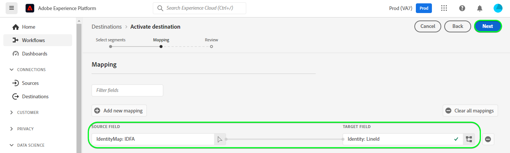

# [!DNL LINE]-Verbindung

## Übersicht {#overview}

[[!DNL LINE]](https://line.me/en/) ist eine beliebte Kommunikationsplattform, die Menschen, Dienstleistungen und Informationen verbindet und sich von einer Chat-App zu einem Zentrum für Unterhaltung, soziale Aktivitäten und tägliche Aktivitäten entwickelt hat.

Dieses [!DNL Adobe Experience Platform] [Ziel](/help/destinations/home.md) nutzt die [[!DNL LINE] Messaging-API](https://developers.line.biz/en/reference/messaging-api/). Sie können Profile aus Ihren Experience Platform-Zielgruppen als Verbindungen innerhalb von [!DNL LINE] für Ihre Geschäftsanforderungen aktivieren.

[!DNL LINE] verwendet Bearer-Token als Authentifizierungsmechanismus für die Kommunikation mit der [!DNL LINE] Messaging-API. Anweisungen zur Authentifizierung bei Ihrer [!DNL LINE] finden Sie weiter unten im Abschnitt [Authentifizieren bei Ziel](#authenticate).

## Anwendungsszenarien {#use-cases}

Als Marketing-Experte können Sie Benutzende in einem Ziel für mobile Interaktion ansprechen, wobei Zielgruppen in [!DNL Adobe Experience Platform] integriert sind. Darüber hinaus können Sie ihnen personalisierte Erlebnisse auf der Grundlage von Attributen aus ihren [!DNL Adobe Experience Platform] Profilen bereitstellen, sobald Zielgruppen und Profile in [!DNL Adobe Experience Platform] aktualisiert werden.

## Voraussetzungen {#prerequisites}

### Voraussetzungen für [!DNL LINE] {#prerequisites-destination}

Beachten Sie die folgenden Voraussetzungen in [!DNL LINE], um Daten aus Experience Platform in Ihr [!DNL LINE]-Konto zu exportieren:

#### Sie benötigen ein [!DNL LINE]-Konto {#prerequisites-account}

Sie müssen sich registrieren und ein [!DNL LINE] Konto erstellen, falls Sie noch keines haben. So erstellen Sie ein Konto:

1. Navigieren Sie zur [!DNL LINE] [Kontoanmeldung](https://account.line.biz/login?redirectUri=https%3A%2F%2Fmanager.line.biz%2F) Seite
2. Wählen Sie **[!UICONTROL Konto erstellen]** aus.

#### Sammeln Sie die [!DNL LINE channel access token (long-lived)] aus der [!DNL LINE] Developer Console {#gather-credentials}

Damit Experience Platform auf [!DNL LINE] Ressourcen zugreifen kann, benötigen Sie die *[!DNL Channel access token (long-lived)]* des gewünschten [!DNL LINE]Messaging *API*-Kanals.

1. Melden Sie sich mit Ihrem [!DNL LINE]-Konto bei der [[!DNL LINE] Entwicklerkonsole](https://developers.line.biz/console) an.
1. Rufen Sie als Nächstes die *[!DNL Providers]* auf, wählen Sie dann die gewünschte *[!DNL Provider]* aus und wählen Sie schließlich den Kanal *Messaging-API* aus, um auf die Einstellungen zuzugreifen. Wenn Sie zum ersten Mal auf die Entwicklerkonsole zugreifen, befolgen Sie die [[!DNL LINE] Dokumentation](https://developers.line.biz/en/docs/messaging-api/getting-started/), um die zum Erstellen eines Anbieters erforderlichen Schritte auszuführen.
1. Navigieren Sie abschließend zum Abschnitt ***[!DNL Channel access token]*** und kopieren Sie den ***[!DNL Channel access token (long-lived)]*** Wert, der im Schritt [Authentifizieren bei Ziel](#authenticate) erforderlich ist.

| Anmeldedaten | Beschreibung | Beispiel |
| --- | --- | --- |
| `[!DNL Channel access token (long-lived)]` | Ihre [!DNL LINE Channel access token (long-lived)]. | `aaa2112XSMWqLXR7..........nyilFU=` |

Anleitungen zum Erstellen [[!DNL LINE]  Kanals oder Hinzufügen eines Kanals zu Ihrem vorhandenen [!DNL LINE]-Konto über die [!DNL LINE] Entwicklerkonsole finden Sie in der Dokumentation](https://developers.line.biz/en/docs/messaging-api/getting-started/).

## Unterstützte Identitäten {#supported-identities}

[!DNL LINE] unterstützt die Aktualisierung und den Export von Identitäten, die in der folgenden Tabelle beschrieben sind. Erhalten Sie weitere Informationen zu [Identitäten](/help/identity-service/features/namespaces.md).

| Ziel-Identität | Beschreibung |
|---|---|
| ID für Werbetreibende (IFAs) | Wählen Sie die ID für die Zielidentität der Advertiser (IFAs) aus, wenn die Quellidentitäten die Namespaces IFA *(Apple-ID für Advertiser)* oder GAID *(Google Advertising ID) sind. |
| LINE-Benutzerkennung | Wählen Sie die Benutzer-ID-Zielidentität aus, wenn die Quellidentitäten LINE-Benutzer-IDs sind. |

## Exporttyp und -häufigkeit {#export-type-frequency}

Beziehen Sie sich auf die folgende Tabelle, um Informationen zu Typ und Häufigkeit des Zielexports zu erhalten.

| Element | Typ | Anmerkungen |
---------|----------|---------|
| Exporttyp | **[!UICONTROL Profilbasiert]** | Sie exportieren alle Mitglieder einer Zielgruppe mit den IDs (Name, Telefonnummer oder sonstiges), die im [!DNL LINE]-Ziel verwendet werden. |
| Exporthäufigkeit | **[!UICONTROL Streaming]** | Streaming-Ziele sind „immer verfügbare“ API-basierte Verbindungen. Sobald ein Profil in Experience Platform auf der Grundlage einer Zielgruppenauswertung aktualisiert wird, sendet der Connector das Update nachgelagert an die Zielplattform. Lesen Sie mehr über [Streaming-Ziele](/help/destinations/destination-types.md#streaming-destinations). |

{style="table-layout:auto"}

## Herstellen einer Verbindung mit dem Ziel {#connect}

>[!IMPORTANT]
>
>Um eine Verbindung mit dem Ziel herzustellen, benötigen Sie **[!UICONTROL Ziele anzeigen]** und **[!UICONTROL Ziele verwalten]** [Zugriffssteuerungsberechtigungen](/help/access-control/home.md#permissions). Lesen Sie die [Zugriffskontrolle – Übersicht](/help/access-control/ui/overview.md) oder wenden Sie sich an Ihren Produktadministrator, um die erforderlichen Berechtigungen zu erhalten.

Um eine Verbindung mit diesem Ziel herzustellen, gehen Sie wie im [Tutorial zur Zielkonfiguration](../../ui/connect-destination.md) beschrieben vor. Füllen Sie im Workflow zum Konfigurieren des Ziels die Felder aus, die in den beiden folgenden Abschnitten aufgeführt sind.

Suchen Sie in **[!UICONTROL Ziele]** > **[!UICONTROL Katalog]** nach [!DNL LINE]. Alternativ können Sie es unter der Kategorie **[!UICONTROL Mobile-Interaktion]** finden.

### Beim Ziel authentifizieren {#authenticate}

Um sich beim Ziel zu authentifizieren, wählen Sie **[!UICONTROL Mit Ziel verbinden]**.
Screenshot der 

Füllen Sie die erforderlichen Felder aus.
* **[!UICONTROL Bearer-Token]**: Ihr [!DNL LINE Channel access token (long-lived)] über die [!DNL LINE] Entwicklerkonsole. Siehe den Abschnitt [Sammeln von Anmeldeinformationen](#gather-credentials).

Wenn die angegebenen Details gültig sind, zeigt die Benutzeroberfläche den Status **[!UICONTROL Verbunden]** mit einem grünen Häkchen an. Sie können dann mit dem nächsten Schritt fortfahren.

### Ausfüllen der Zieldetails {#destination-details}

Füllen Sie die folgenden erforderlichen und optionalen Felder aus, um Details für das Ziel zu konfigurieren. Ein Sternchen neben einem Feld in der Benutzeroberfläche zeigt an, dass das Feld erforderlich ist.
Screenshot der 

* **[!UICONTROL Name]**: Ein Name, durch den Sie dieses Ziel in Zukunft erkennen können.
* **[!UICONTROL Beschreibung]**: Eine Beschreibung, die Ihnen hilft, dieses Ziel in Zukunft zu identifizieren.
* **[!UICONTROL Zielgruppentyp]**: Wählen Sie **[!UICONTROL ID für Werbetreibende (IFAs)]** aus, wenn die Identitäten, die exportiert werden sollen, vom Typ *ID für Werbetreibende (IFAs)*. Wählen Sie **[!UICONTROL LINE-Benutzer]** IDs aus, wenn die Identitäten, die exportiert werden sollen, vom Typ *LINE-Benutzer-IDs* sind. Weitere Informationen zu den Identitätstypen [&#x200B; Sie &#x200B;](#supported-identities) Abschnitt „Unterstützte Identitäten“.

### Aktivieren von Warnhinweisen {#enable-alerts}

Sie können Warnhinweise aktivieren, um Benachrichtigungen zum Status des Datenflusses zu Ihrem Ziel zu erhalten. Wählen Sie einen Warnhinweis aus der zu abonnierenden Liste aus, um Benachrichtigungen über den Status Ihres Datenflusses zu erhalten. Weitere Informationen zu Warnhinweisen finden Sie im Handbuch zum [Abonnieren von Zielwarnhinweisen über die Benutzeroberfläche](../../ui/alerts.md).

Wenn Sie alle Details für Ihre Zielverbindung eingegeben haben, klicken Sie auf **[!UICONTROL Weiter]**.

## Aktivieren von Zielgruppen für dieses Ziel {#activate}

>[!IMPORTANT]
> 
>* Zum Aktivieren von Daten benötigen Sie die Berechtigungen **[!UICONTROL Ziele anzeigen]**, **[!UICONTROL Ziele aktivieren]**, **[!UICONTROL Profile anzeigen]** und **[!UICONTROL Segmente anzeigen]**&#x200B;[Zugriffssteuerung](/help/access-control/home.md#permissions). Lesen Sie die [Übersicht über die Zugriffssteuerung](/help/access-control/ui/overview.md) oder wenden Sie sich an Ihre Produktadmins, um die erforderlichen Berechtigungen zu erhalten.
>* Zum Exportieren *Identitäten* benötigen Sie die Berechtigung **[!UICONTROL Identitätsdiagramm anzeigen]** [Zugriffssteuerung](/help/access-control/home.md#permissions).   {width="100" zoomable="yes"}

Anweisungen zum Aktivieren von Zielgruppen für dieses Ziel finden Sie unter [Aktivieren von Profilen und Zielgruppen für Streaming-Zielgruppen-Exportziele](/help/destinations/ui/activate-segment-streaming-destinations.md).

### Zuordnen von Attributen und Identitäten {#map}

Um Ihre Zielgruppendaten ordnungsgemäß von Adobe Experience Platform an das [!DNL LINE]-Ziel zu senden, müssen Sie den Schritt zur Feldzuordnung durchlaufen. Die Zuordnung besteht darin, eine Verknüpfung zwischen den Schemafeldern Ihres Experience-Datenmodells (XDM) in Ihrem Experience Platform-Konto und den entsprechenden Entsprechungen vom Ziel zu erstellen. Um Ihre XDM-Felder den [!DNL LINE]-Zielfeldern korrekt zuzuordnen, führen Sie die folgenden Schritte aus:

Abhängig von Ihrer Quellidentität müssen die folgenden Ziel-Identity-Namespaces zugeordnet werden:

| Ziel-Identität | Quellfeld | Zielfeld |
| --- | --- | --- |
| ID für Werbetreibende (IFAs) | `IDFA` oder `GAID` | `LineId` |
| LINE-Benutzerkennung | `UserID` | `LineId` |

Wenn es sich bei Ihren Zielidentitäten um *LINE-Benutzer-IDs* handelt, benötigen Sie Folgendes:

Wenn Ihre Zielidentität *ID für Advertisers (IFAs) lautet* benötigen Sie Folgendes:

## Überprüfen des Datenexports {#exported-data}

Nach einem erfolgreichen Datenexport aus Experience Platform erstellt das [!DNL LINE]-Ziel mithilfe des ausgewählten Zielgruppennamen eine neue Zielgruppe in [!DNL LINE].

Gehen Sie wie folgt vor, um zu überprüfen, ob Sie das Ziel korrekt eingerichtet haben:

1. Melden Sie sich [!DNL LINE] bei der [Manager-Konsole](https://manager.line.biz/) an.

1. Navigieren Sie dann zu **[!UICONTROL Datensteuerelemente]** > **[!UICONTROL Zielgruppen]** und überprüfen Sie den Namen, der mit der ausgewählten Zielgruppe in der Spalte **[!UICONTROL Zielgruppenname]** übereinstimmt.

1. Das aktualisierte Volumen würde mit der Anzahl innerhalb des Segments übereinstimmen.

1. In der Spalte *Typ* wird **[!UICONTROL Benutzer-ID]** angegeben, wenn die exportierten Identitäten vom Typ *Benutzer-ID* sind. In ähnlicher Weise wird in der Spalte *Typ* &quot;**[!UICONTROL -ID“]**, wenn die exportierten Identitäten vom Typ *IDFA* sind.

Im Folgenden finden Sie ein Beispiel-Setup in [!DNL LINE]:

## Datennutzung und -Governance {#data-usage-governance}

Alle [!DNL Adobe Experience Platform]-Ziele sind bei der Verarbeitung Ihrer Daten mit Datennutzungsrichtlinien konform. Ausführliche Informationen darüber, wie [!DNL Adobe Experience Platform] Data Governance erzwingt, finden Sie unter [Data Governance – Übersicht](/help/data-governance/home.md).
