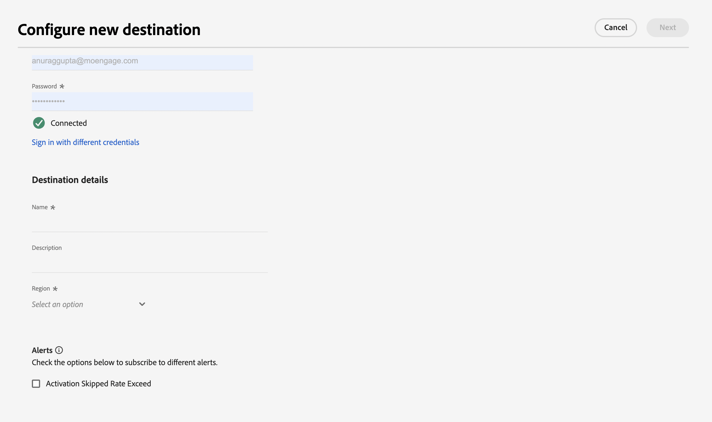
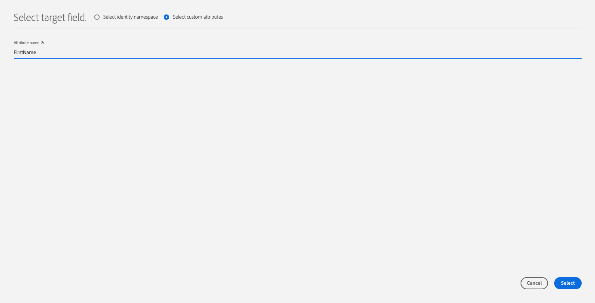

# [!DNL Moengage]-Verbindung

## Übersicht {#overview}

Verwenden Sie das [!DNL Moengage] Ziel, um Ihre Adobe-Daten (Benutzerattribute, Segmente und Ereignisse) in Echtzeit mit MoEngage zu verbinden und zuzuordnen. Kunden können diese Daten dann nutzen und personalisierte, zielgerichtete Erlebnisse bereitstellen.

Mit Adobe ist die Integration sehr einfach und intuitiv. Nehmen Sie einfach ein beliebiges Adobe-Benutzerprofil und ordnen Sie es einem MoEngage-Benutzerattribut zu.

>[!IMPORTANT]
>
>Dieser Ziel-Connector und diese Dokumentationsseite werden vom Team *Moengage* erstellt und. Bei Fragen oder Aktualisierungsanfragen wenden Sie sich bitte direkt an *`https://help.moengage.com/hc/en-us`.*

## Anwendungsfälle {#use-cases}

Ein Marketing-Experte möchte ein (in Adobe Experience Platform erstelltes) Benutzersegment über [!DNL Moengage] Kampagnen ansprechen. Außerdem möchten sie Kampagneninhalte anhand von Attributen aus Adobe Experience Platform-Profilen personalisieren. Mit dieser Integration werden Benutzende und Attribute in MoEngage aktualisiert, sobald Segmente und Profile in Adobe Experience Platform aktualisiert werden.

## Voraussetzungen {#prerequisites}

Beachten Sie die folgenden Voraussetzungen, bevor Sie Ihre Adobe Experience Platform-Daten an [!DNL Moengage] senden können:

* Um das MoEngage-Ziel mit Adobe Experience Platform verwenden zu können, müssen Benutzerinnen und Benutzer zunächst Zugriff auf ihr [!DNL Moengage]-Konto haben. Besuchen Sie die folgende Seite, um sich bei Ihrem MoEngage-Konto anzumelden: https://app.moengage.com

## Unterstützte Identitäten {#supported-identities}

[!DNL Moengage] unterstützt die Aktualisierung von Identitäten, die in der folgenden Tabelle beschrieben werden.

| Ziel-Identität | Beschreibung | Zu beachten |
|---|------------------------------------------------------------------------------------------|----------------------------------------------------------------------------------------|
| user_id | Eindeutige Kennung, die ein Benutzerprofil im [!DNL Moengage] eindeutig identifiziert. | Diese Kennung unterstützt den Zeichenfolgentyp. Entweder „user_id“ oder „anonymous_id“ ist erforderlich |
| anonyme_id | Eine weitere Kennung für ein unbekanntes Benutzerprofil - ein Profil, das nicht im System vorhanden ist. | Diese Kennung unterstützt den Zeichenfolgentyp. Entweder „user_id“ oder „anonymous_id“ ist erforderlich |

{style="table-layout:auto"}

## Exporttyp und -häufigkeit {#export-type-frequency}

Beziehen Sie sich auf die folgende Tabelle, um Informationen zu Typ und Häufigkeit des Zielexports zu erhalten.

| Element | Typ | Anmerkungen |
---------|----------|------------------------------------------------------------------------------------------------------------------------------------------------------------------------------------------------------------------------------------------------------------------------------------------------------------------------------------|
| Exporttyp | **[!UICONTROL Profilbasiert]** | Sie exportieren alle Mitglieder eines Segments (Zielgruppe) mit den Kennungen (user_id, anonymous_id) zusammen mit benutzerdefinierten Attributen, die von Ihnen in [!DNL Moengage] exportiert wurden. |
| Exporthäufigkeit | **[!UICONTROL Streaming]** | Streaming-Ziele sind „immer verfügbare“ API-basierte Verbindungen. Sobald ein Profil in Experience Platform auf der Grundlage einer Segmentauswertung aktualisiert wird, sendet der Connector das Update nachgelagert an die Zielplattform. Lesen Sie mehr über [Streaming-Ziele](/help/destinations/destination-types.md#streaming-destinations). |

{style="table-layout:auto"}

## Herstellen einer Verbindung mit dem Ziel {#connect}

>[!IMPORTANT]
> 
>Um eine Verbindung mit dem Ziel herzustellen, benötigen Sie **[!UICONTROL Ziele anzeigen]** und **[!UICONTROL Ziele verwalten]** [Zugriffssteuerungsberechtigungen](/help/access-control/home.md#permissions). Lesen Sie die [Zugriffskontrolle – Übersicht](/help/access-control/ui/overview.md) oder wenden Sie sich an Ihren Produktadministrator, um die erforderlichen Berechtigungen zu erhalten.

Um eine Verbindung mit diesem Ziel herzustellen, gehen Sie wie im [Tutorial zur Zielkonfiguration](../../ui/connect-destination.md) beschrieben vor. Füllen Sie im Workflow zum Konfigurieren des Ziels die Felder aus, die in den beiden folgenden Abschnitten aufgeführt sind.

### Beim Ziel authentifizieren {#authenticate}

Um sich beim Ziel zu authentifizieren, füllen Sie die erforderlichen Felder aus und wählen Sie **[!UICONTROL Mit Ziel verbinden]** aus.

### Ausfüllen der Zieldetails {#destination-details}

Füllen Sie die folgenden erforderlichen und optionalen Felder aus, um Details für das Ziel zu konfigurieren. Ein Sternchen neben einem Feld in der Benutzeroberfläche zeigt an, dass das Feld erforderlich ist.

* **[!UICONTROL BENUTZERNAME]**: DATA APP-ID der Einstellungsseite [!DNL Moengage] Dashboards.
* **[!UICONTROL KENNWORT]**: DATA APP KEY auf der Seite „Einstellungen“ [!DNL Moengage] Dashboards.

* **[!UICONTROL Name]**: Ein Name, durch den Sie dieses Ziel in Zukunft erkennen können.
* **[!UICONTROL Beschreibung]**: Eine Beschreibung, die Ihnen hilft, dieses Ziel in Zukunft zu identifizieren.
* **[!UICONTROL Region]**: Ihre Anwendung *Rechenzentrum*.

### Aktivieren von Warnhinweisen {#enable-alerts}

Sie können Warnhinweise aktivieren, um Benachrichtigungen zum Status des Datenflusses zu Ihrem Ziel zu erhalten. Wählen Sie einen Warnhinweis aus der zu abonnierenden Liste aus, um Benachrichtigungen über den Status Ihres Datenflusses zu erhalten. Weitere Informationen zu Warnhinweisen finden Sie im Handbuch zum [Abonnieren von Zielwarnhinweisen über die Benutzeroberfläche](../../ui/alerts.md).

Wenn Sie mit dem Eingeben der Details für Ihre Zielverbindung fertig sind, klicken Sie auf **[!UICONTROL Weiter]**.

## Aktivieren von Segmenten für dieses Ziel {#activate}

>[!IMPORTANT]
> 
>Zum Aktivieren von Daten benötigen Sie die Berechtigungen **[!UICONTROL Ziele anzeigen]**, **[!UICONTROL Ziele aktivieren]**, **[!UICONTROL Profile anzeigen]** und **[!UICONTROL Segmente anzeigen]**[Zugriffssteuerung](/help/access-control/home.md#permissions). Lesen Sie die [Übersicht über die Zugriffssteuerung](/help/access-control/ui/overview.md) oder wenden Sie sich an Ihre Produktadmins, um die erforderlichen Berechtigungen zu erhalten.

Anweisungen zum Aktivieren von Zielgruppensegmenten für dieses Ziel finden Sie unter [Aktivieren von Zielgruppendaten für Streaming-Segmentexportziele](../../ui/activate-segment-streaming-destinations.md).

### Zuordnen von Attributen und Identitäten {#map}

Um Ihre Zielgruppendaten ordnungsgemäß von [!DNL Adobe Experience Platform] an das [!DNL Moengage] Ziel zu senden, müssen Sie den Schritt zur Feldzuordnung durchlaufen.

Die Zuordnung besteht darin, eine Verknüpfung zwischen den Schemafeldern Ihres [!DNL Experience Data Model] (XDM) in Ihrem [!DNL Platform]-Konto und den entsprechenden Entsprechungen vom Ziel zu erstellen.

Um Ihre XDM-Felder den [!DNL Moengage]-Zielfeldern korrekt zuzuordnen, führen Sie die folgenden Schritte aus:

Wählen [!UICONTROL  Schritt ]Zuordnung“ **[!UICONTROL Kontrollkästchen]** aus.

Wählen [!UICONTROL  Schritt ]Zuordnung“ **[!UICONTROL Neue Zuordnung hinzufügen]** aus.

Wählen Sie im Abschnitt [!UICONTROL Source] die Pfeilschaltfläche neben dem leeren Feld aus.

Im Fenster [!UICONTROL Quellfeld auswählen] können Sie zwischen zwei Kategorien von XDM-Feldern wählen:
* [!UICONTROL Attribute auswählen]: Verwenden Sie diese Option, um ein bestimmtes Feld aus Ihrem XDM-Schema [!DNL Moengage] Attribut zuzuordnen.

Wählen Sie Ihr Quellfeld und dann **[!UICONTROL Auswählen]** aus.

Wählen [!UICONTROL  im Abschnitt ]Zielfeld“ das Zuordnungssymbol rechts neben dem Feld aus.

Im Fenster [!UICONTROL Zielfeld auswählen] können Sie zwischen zwei Kategorien von Zielfeldern wählen:
* [!UICONTROL Identity-Namespace auswählen]: Verwenden Sie diese Option, um [!DNL Platform] Identity-Namespaces [!DNL Moengage] Identity-Namespaces zuzuordnen.
* [!UICONTROL Benutzerdefinierte Attribute auswählen]: Verwenden Sie diese Option, um XDM-Attribute benutzerdefinierten [!DNL Moengage] zuzuordnen, die Sie in Ihrem [!DNL Moengage]-Konto definiert haben.   Sie können diese Option auch verwenden, um vorhandene XDM-Attribute in [!DNL Moengage] umzubenennen. Wenn Sie beispielsweise ein `lastName` XDM-Attribut einem benutzerdefinierten `Last_Name`-Attribut in [!DNL Moengage] zuordnen, wird das `Last_Name`-Attribut in [!DNL Moengage] erstellt, falls es noch nicht vorhanden ist, und ihm wird das `lastName` XDM-Attribut zugeordnet.

Wählen Sie Ihr Zielfeld und dann **[!UICONTROL Auswählen]** aus.

Die Feldzuordnung sollte nun in der Liste angezeigt werden.

Um weitere Zuordnungen hinzuzufügen, wiederholen Sie die vorherigen Schritte.

## Exportierte Daten/Datenexport validieren {#exported-data}

Um sich zu vergewissern, dass die Daten erfolgreich in das [!DNL Moengage]-Ziel exportiert wurden, wechseln Sie zum Benutzerprofil in Ihrem [!DNL Moengage]. Daraufhin wird ein Benutzerattribut mit dem Namen „AEP-Segment“ angezeigt.

## Datennutzung und -Governance {#data-usage-governance}

Alle [!DNL Adobe Experience Platform]-Ziele sind bei der Verarbeitung Ihrer Daten mit Datennutzungsrichtlinien konform. Ausführliche Informationen darüber, wie [!DNL Adobe Experience Platform] Data Governance erzwingt, finden Sie unter [Data Governance - Übersicht](/help/data-governance/home.md).
