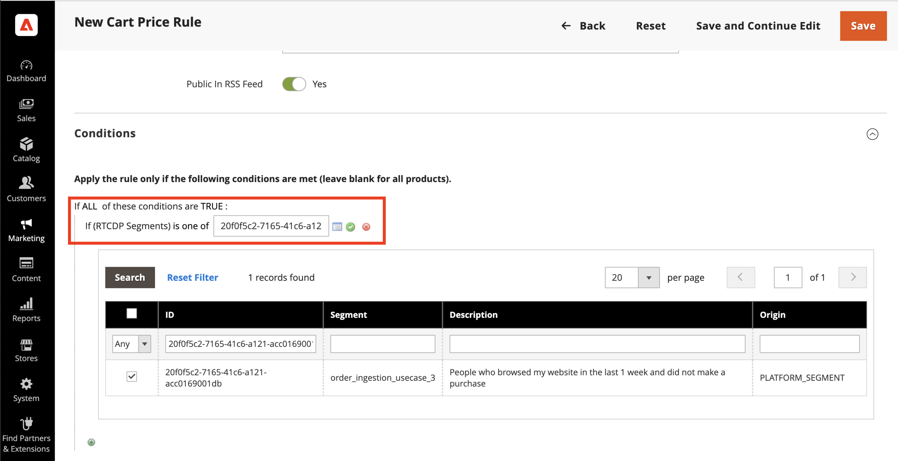

# (Beta) Adobe Commerce-Verbindung {#adobe-commerce}

## Übersicht {#overview}

>[!IMPORTANT]
> 
>Der **[!UICONTROL Adobe Commerce]**-Connector befindet sich in der Beta-Phase und steht nur einer ausgewählten Anzahl von Kunden zur Verfügung.

Mit dem Ziel-Connector von [!DNL Adobe Commerce] können Sie ein oder mehrere Real-Time CDP-Segmente auswählen, die Sie in Ihrem [!DNL Adobe Commerce]-Konto aktivieren, um Ihren Kundinnen und Kunden ein dynamisches, personalisiertes Erlebnis zu bieten. Innerhalb von [!DNL Adobe Commerce] können Sie dann diese Real-Time CDP-Segmente auswählen, um einzigartige Angebote im Warenkorb zu personalisieren, wie beispielsweise „Kaufen Sie zwei, erhalten Sie eins gratis“. Sie können auch Hero-Banner anzeigen und die Produktpreise durch Werbeangebote ändern, die alle auf Adobe Real-Time CDP-Segmente zugeschnitten sind.

<!--## Use cases {#use-cases}

To help you better understand how and when you should use the *YourDestination* destination, here are sample use cases that Adobe Experience Platform customers can solve by using this destination.

### Use case #1 {#use-case-1}

*For mobile messaging platforms:*

*A home rental and sales platform wants to push mobile notifications to customers' Android and iOS devices to let them know that there are 100 updated listings in the area where they previously searched for a rental.*

### Use case #2 {#use-case-2}

*For social network platforms:*

*An athletic apparel brand wants to reach existing customers through their social media accounts. The apparel brand can ingest email addresses from their own CRM to Adobe Experience Platform, build segments from their own offline data, and send these segments to YourDestination, to display ads in their customers' social media feeds.*-->

## Voraussetzungen {#prerequisites}

Diese Erweiterung ist im Zielkatalog für ausgewählte Beta-Kunden verfügbar, die Real-time CDP Prime oder Ultimate und Adobe Commerce erworben haben.

Beta-Kunden sollten Zugriff haben auf:

- [Adobe Experience Platform](https://experience.adobe.com/)
- [Adobe Developer Console](https://developer.adobe.com/developer-console/docs/guides/getting-started/)
- [Adobe Commerce Cloud-Version 2.4.4 oder höher](https://business.adobe.com/de/products/magento/magento-commerce.html)

Erstellen Sie in Experience Platform Folgendes:

- [Schema](../../../xdm/schema/composition.md). Das Schema, das Sie erstellen, repräsentiert die Daten, die Sie aus Adobe Commerce aufnehmen möchten. [Erfahren Sie mehr](https://experienceleague.adobe.com/docs/commerce-merchant-services/experience-platform-connector/fundamentals/update-xdm.html?lang=de) darüber, wie man ein Schema erstellt, das Commerce-spezifische Feldergruppen enthält.
- [Datensatz](../../../catalog/datasets/user-guide.md#create). Ein Datensatz ist ein Speicher- und Verwaltungskonstrukt für eine Sammlung von Daten. Sie müssen diesen Datensatz aus dem Schema erstellen, das Sie oben erstellt haben.
- [Datenstrom](../../../edge/datastreams/overview.md#create). ID, die den Datenfluss von Adobe Experience Platform zu anderen Adobe-DX-Produkten ermöglicht. Diese ID muss mit einer bestimmten Website in Ihrer jeweiligen Adobe Commerce-Instanz verknüpft sein. Wenn Sie diesen Datenstrom erstellen, geben Sie das von Ihnen oben erstellte XDM-Schema an.

Nachdem Sie die Voraussetzungen erfüllt haben, stellen Sie eine Verbindung mit dem Ziel [!DNL Commerce] her.

## Herstellen einer Verbindung mit dem Ziel {#connect}

>[!IMPORTANT]
> 
>Um eine Verbindung zum Ziel herzustellen, benötigen Sie die [Zugriffsberechtigung](/help/access-control/home.md#permissions) **[!UICONTROL Ziele verwalten]**. Lesen Sie die [Übersicht über die Zugriffskontrolle](/help/access-control/ui/overview.md) oder wenden Sie sich an Ihren Produktadministrator, um die erforderlichen Berechtigungen zu erhalten.

So stellen Sie eine Verbindung mit dem Ziel [!DNL Adobe Commerce] her:

1. Gehen Sie in der [Platform-Oberfläche](https://experience.adobe.com/platform/) zu **[!UICONTROL Ziele]** > **[!UICONTROL Katalog]**.
1. Wählen Sie **[!UICONTROL Personalisierung]** aus.
1. Wählen Sie das Adobe Commerce-Ziel aus, um es zu markieren, und wählen Sie dann **[!UICONTROL Einrichten]** aus.
1. Führen Sie die im [Tutorial zur Zielkonfiguration](../../ui/connect-destination.md) beschriebenen Schritte aus.

### Verbindungsparameter {#parameters}

Beim [Einrichten](../../ui/connect-destination.md) dieses Ziels müssen Sie die folgenden Informationen angeben:

- **[!UICONTROL Name]**: Geben Sie den gewünschten Namen für das Ziel ein.
- **[!UICONTROL Beschreibung]**: Geben Sie eine Beschreibung für das Ziel ein. Hier können Sie beispielsweise erwähnen, für welche Kampagne Sie dieses Ziel verwenden. Dieses Feld ist optional.
- **[!UICONTROL Integrationsalias]**: Dieser Wert wird als JSON-Objektname an das Experience Platform Web SDK gesendet.
- **[!UICONTROL Datenstrom-ID]**: Diese Angabe legt fest, in welchen Datenerfassungsdatenstrom die Segmente in der Antwort auf die Seite aufgenommen werden. Das Dropdown-Menü enthält nur Datenströme, für die die Zielkonfiguration aktiviert ist. Weitere Details finden Sie unter [Konfigurieren eines Datenstroms](../../../edge/datastreams/overview.md).

### Aktivieren von Warnhinweisen {#enable-alerts}

Sie können Warnhinweise aktivieren, um Benachrichtigungen zum Status des Datenflusses zu Ihrem Ziel zu erhalten. Wählen Sie einen Warnhinweis aus der zu abonnierenden Liste aus, um Benachrichtigungen über den Status Ihres Datenflusses zu erhalten. Weitere Informationen zu Warnhinweisen finden Sie im Handbuch zum [Abonnieren von Zielwarnhinweisen über die Benutzeroberfläche](../../ui/alerts.md).

Wenn Sie alle Details für Ihre Zielverbindung eingegeben haben, klicken Sie auf **[!UICONTROL Weiter]**.

## Aktivieren von Segmenten für das Ziel [!DNL Commerce] {#activate}

>[!IMPORTANT]
> 
>Um Daten zu aktivieren, benötigen Sie die [Zugriffskontrollberechtigungen](/help/access-control/home.md#permissions) **[!UICONTROL Ziele verwalten]**, **[!UICONTROL Ziele aktivieren]**, **[!UICONTROL Profile anzeigen]** und **[!UICONTROL Segmente anzeigen]**. Lesen Sie die [Übersicht über die Zugriffskontrolle](/help/access-control/ui/overview.md) oder wenden Sie sich an Ihren Produktadministrator, um die erforderlichen Berechtigungen zu erhalten.

Weitere Informationen zur Aktivierung von Zielgruppensegmenten für das Ziel [!DNL Commerce] finden Sie unter [Aktivieren von Profilen und Segmenten für Profilanforderungsziele](../../ui/activate-profile-request-destinations.md).

## Nächste Schritte in [!DNL Adobe Commerce]

Nachdem Sie das [!DNL Commerce]-Ziel in Experience Platform konfiguriert haben, müssen Sie nun den [!DNL Commerce Admin] konfigurieren, um die von Ihnen erstellten Real-Time CDP-Segmente zu importieren. Weitere Informationen finden Sie in der [[!DNL Commerce] Dokumentation](https://experienceleague.adobe.com/docs/commerce-admin/marketing/promotions/cart-rules/customer-segment-rtcdp.html?lang=de).

## Validieren von Audience Activation in Commerce {#exported-data}

Nachdem Sie Real-Time CDP-Segmente für Ihr [!DNL Adobe Commerce]-Konto aktiviert haben, sehen Sie diese Segmente i [!DNL Admin], wenn Sie eine Warenkorb-Preisregel erstellen:

## Datennutzung und -Governance {#data-usage-governance}

Alle [!DNL Adobe Experience Platform]-Ziele sind bei der Verarbeitung Ihrer Daten mit Datennutzungsrichtlinien konform. Ausführliche Informationen darüber, wie [!DNL Adobe Experience Platform] Data Governance erzwingt, finden Sie unter [Data Governance - Übersicht](/help/data-governance/home.md).
