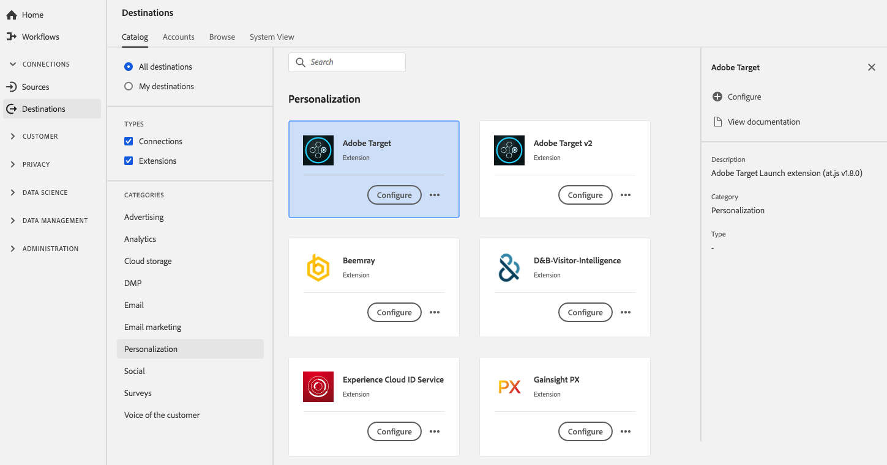

# Adobe Target-Erweiterung

## Überblick {#overview}

Adobe Target ist die Adobe Experience Cloud-Lösung, die Ihnen all das bietet, was Sie zur Anpassung und Personalisierung Ihrer Kundenerlebnisse benötigen, sodass Sie Umsätze auf Ihren Web- und mobilen Sites, in Mobile Apps, Social Media und anderen digitalen Kanälen maximieren können.

Adobe Target ist eine Personalisierungserweiterung in Adobe Experience Platform. Weitere Informationen zur Funktionalität der Erweiterung finden Sie auf der Seite zu Erweiterungen auf [Adobe Exchange](https://exchange.adobe.com/experiencecloud.details.100162.html).

Dieses Ziel ist eine Tag-Erweiterung. Weitere Informationen zur Funktionsweise von Tag-Erweiterungen in Experience Platform finden Sie unter [Tag-Erweiterungen - Übersicht](../launch-extensions/overview.md).

## Voraussetzungen {#prerequisites}

Diese Erweiterung ist im [!DNL Destinations] für alle Kunden verfügbar, die Experience Platform erworben haben.

Um diese Erweiterung verwenden zu können, müssen Sie Zugriff auf Tags in Adobe Experience Platform haben. Tags werden Adobe Experience Cloud-Kunden als integrierte Mehrwertfunktion angeboten. Wenden Sie sich an den Admin Ihrer Organisation, um Zugriff auf Tags zu erhalten, und bitten Sie darum, Ihnen die Berechtigung **[!UICONTROL manage_properties]** zu erteilen, damit Sie Erweiterungen installieren können.

## Installieren einer Erweiterung {#install-extension}

So installieren Sie die Adobe Target-Erweiterung:

Experience Platform Wechseln Sie in der ](https://platform.adobe.com/) von [zu **[!UICONTROL Ziele]** > **[!UICONTROL Katalog]**.

Wählen Sie die Erweiterung aus dem Katalog aus oder verwenden Sie die Suchleiste.

Klicken Sie auf das Ziel, um es zu markieren, und wählen Sie dann in der rechten Leiste die Option **[!UICONTROL Konfigurieren]** aus. Wenn das Feld **[!UICONTROL Konfigurieren]** ausgegraut ist, verfügen Sie nicht über die Berechtigung **[!UICONTROL manage_properties]**. Siehe [Voraussetzungen](#prerequisites).

Wählen Sie die Tag-Eigenschaft aus, in der Sie die Erweiterung installieren möchten. Sie können auch eine neue Eigenschaft erstellen. Eine Eigenschaft ist eine Sammlung von Regeln, Datenelementen, konfigurierten Erweiterungen, Umgebungen und Bibliotheken. Weitere Informationen zu Eigenschaften finden Sie in der [Tags-Dokumentation](../../../tags/ui/administration/companies-and-properties.md).

Der Workflow führt Sie zur Datenerfassungs-Benutzeroberfläche, um die Installation abzuschließen.

Informationen zu den Konfigurationsoptionen für Erweiterungen finden Sie auf der Seite [Adobe Target-Erweiterung](../../../tags/extensions/client/target/overview.md) in der Tags-Dokumentation.

Sie können die Erweiterung auch direkt in der [Datenerfassungs-Benutzeroberfläche](https://experience.adobe.com/#/data-collection/) installieren. Weitere Informationen finden Sie im Handbuch [Hinzufügen einer neuen ](../../../tags/ui/managing-resources/extensions/overview.md#add-a-new-extension)&quot;.

## Verwenden der Erweiterung {#how-to-use}

Nachdem Sie die Erweiterung installiert haben, können Sie mit dem Einrichten von Regeln beginnen. In der Datenerfassungs-Benutzeroberfläche können Sie Regeln für Ihre installierten Erweiterungen einrichten, damit nur in bestimmten Situationen Ereignisdaten an das Erweiterungsziel gesendet werden. Weitere Informationen zum Einrichten von Regeln für Erweiterungen finden Sie in der Übersicht zu [Regeln](../../../tags/ui/managing-resources/rules.md) in der Tags-Dokumentation.

## Konfigurieren, Aktualisieren und Löschen von Erweiterungen {#configure-upgrade-delete}

Sie können Erweiterungen in der Datenerfassungs-Benutzeroberfläche konfigurieren, aktualisieren und löschen.

>[!TIP]
>
>Wenn die Erweiterung bereits in einer Ihrer Eigenschaften installiert ist, wird in der Benutzeroberfläche weiterhin **[!UICONTROL Installieren]** für die Erweiterung angezeigt. Starten Sie den Installations-Workflow, wie unter [Installieren einer Erweiterung](#install-extension) beschrieben, um Ihre Erweiterung zu konfigurieren oder zu löschen.

Informationen zum Aktualisieren Ihrer Erweiterung finden Sie in der Anleitung zum [Erweiterungs-Upgrade-Prozess](../../../tags/ui/managing-resources/extensions/extension-upgrade.md) in der Tags-Dokumentation.
