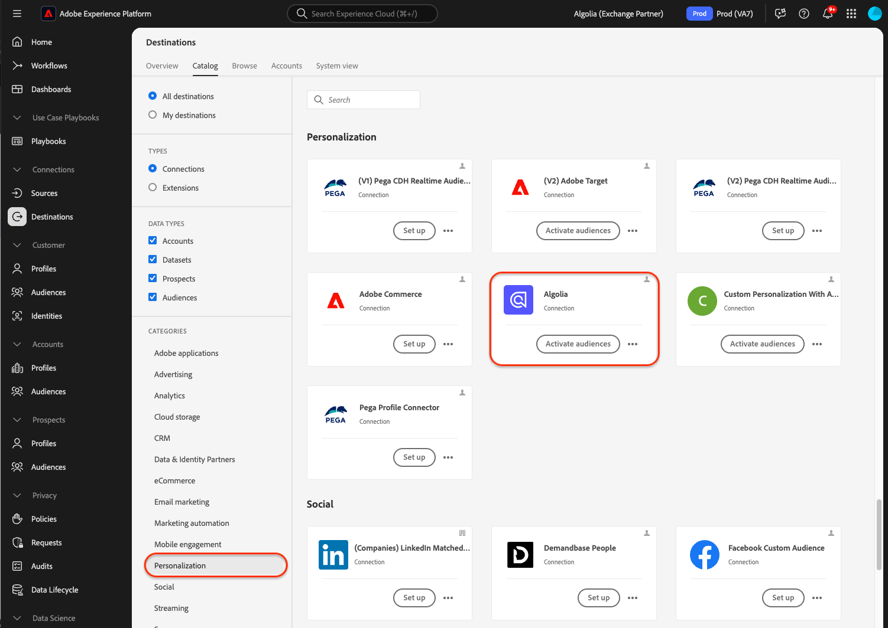

# [!DNL Algolia]-Verbindung

## Übersicht {#overview}

>[!IMPORTANT]
>
>Der [!DNL Algolia]-Ziel-Connector und die Dokumentationsseite werden vom Algolia Integration Services-Team erstellt und gepflegt. Bei Anfragen oder Aktualisierungsanfragen wenden Sie sich unter [adobe-algolia-solutions@algolia.com](adobe-algolia-solutions@algolia.com) an sie.

Verwenden Sie die [!DNL Algolia] Zielverbindung, um Adobe Experience Platform-Zielgruppen für personalisierte Suche und Empfehlungen an Algolia zu senden. Bevor Sie den [!DNL Algolia]-Ziel-Connector verwenden können, müssen Sie zunächst den [[!DNL Algolia User Profiles]](/help/sources/connectors/data-partners/algolia-user-profiles.md)-Quell-Connector einrichten. Während des Tutorials zur Einrichtung des Quell-Connectors erstellen Sie die Identität des Algolia-Benutzer-Tokens. Diese Identität ist für die Zuordnung erforderlich, wenn Sie den Ziel-Connector konfigurieren.

In diesem Tutorial werden Schritte zum Erstellen einer [!DNL Algolia] Zielverbindung und eines Datenflusses mithilfe der Adobe Experience Platform-Benutzeroberfläche beschrieben.

## Anwendungsfälle {#use-cases}

Damit Sie besser verstehen können, wie und wann Sie das [!DNL Algolia]-Ziel verwenden sollten, finden Sie hier einige Beispielanwendungsfälle, die Kundinnen und Kunden von Adobe Experience Platform mit diesem Ziel bewältigen können.

### Personalization-Konsistenz {#personalization-consistency}

Verwenden Sie diesen Ziel-Connector, um eine konsistente Personalisierung Ihrer Site von der Startseite bis zur Suche bereitzustellen.

Als Marketing-Experte können Sie beispielsweise umfangreiche Zielgruppen in Adobe Experience Platform aus mehreren Benutzerdatenquellen, einschließlich Algolia, erstellen. Sie können den Ziel-Connector von [!DNL Algolia] verwenden, um die Zielgruppen für Zielgruppenbestimmungsstrategien freizugeben, was zu einer verstärkten Personalisierung und Konversion von Kampagnen führt.

Um diesen Anwendungsfall zu implementieren, müssen Sie sowohl den Quell- als auch den [[!DNL Algolia User Profiles]](/help/sources/connectors/data-partners/algolia-user-profiles.md)-Connector [!DNL Algolia].

Importieren Sie zunächst Ihre vorhandenen [!DNL Algolia]-Benutzerprofile in Adobe Experience Platform Real-Time CDP und andere Quellen, um mit der Erstellung von Zielgruppen mit dem Quell-Connector zu beginnen. Marketing-Experten erstellen Zielgruppen mithilfe der Profildaten, die zur Personalisierung von Suchen und Empfehlungen an Algolia gesendet werden können.

Verwenden Sie dann den entsprechenden [[!DNL Algolia User Profiles]](/help/sources/connectors/data-partners/algolia-user-profiles.md)-Quell-Connector, um Kundenprofile wieder in Real-Time CDP aufzunehmen und zu erweitern.

## Voraussetzungen {#prerequisites}

>[!IMPORTANT]
>
>* Um eine Verbindung zum Ziel herzustellen, benötigen Sie die **[!UICONTROL Ziele anzeigen]** und **[!UICONTROL Ziele verwalten]**, **[!UICONTROL Ziele aktivieren]**, **[!UICONTROL Profile anzeigen]** und **[!UICONTROL Segmente anzeigen]** [Zugriffssteuerungsberechtigungen](/help/access-control/home.md#permissions). Lesen Sie die [Übersicht über die Zugriffssteuerung](/help/access-control/ui/overview.md) oder wenden Sie sich an Ihre Produktadmins, um die erforderlichen Berechtigungen zu erhalten.
>* Zum Exportieren *Identitäten* benötigen Sie die Berechtigung **[!UICONTROL Identitätsdiagramm anzeigen]** [Zugriffssteuerung](/help/access-control/home.md#permissions).   {width="100" zoomable="yes"}

## Unterstützte Identitäten {#supported-identities}

[!DNL Algolia] unterstützt die Aktivierung von Identitäten, die in der folgenden Tabelle beschrieben sind. Erhalten Sie weitere Informationen zu [Identitäten](https://experienceleague.adobe.com/de/docs/experience-platform/identity/features/namespaces).

| Ziel-Identität | Beschreibung | Zu beachten |
|---------|---------|----------|
| userId | Benutzer-Token [!DNL Algolia] | Wählen Sie diese Zielidentität aus, um die `AlgoliaUserToken` Quellidentität dem `userToken` in der [!DNL Algolia] Platform zuzuordnen. |

{style="table-layout:auto"}

## Unterstützte Zielgruppen {#supported-audiences}

In diesem Abschnitt wird beschrieben, welche Art von Zielgruppen Sie an dieses Ziel exportieren können.

| Zielgruppenherkunft | Unterstützt | Beschreibung |
|---------|---------|----------|
| [!DNL Segmentation Service] | ✓ | Zielgruppen, die über den Experience Platform-[ (Segmentierungs-Service) generiert ](../../../segmentation/home.md). |
| Benutzerdefinierte Uploads | ✓ | Zielgruppen, die aus CSV-Dateien in Experience Platform [importiert](../../../segmentation/ui/audience-portal.md#import-audience) werden. |

{style="table-layout:auto"}

## Exporttyp und -häufigkeit {#export-type-frequency}

Beziehen Sie sich auf die folgende Tabelle, um Informationen zu Typ und Häufigkeit des Zielexports zu erhalten.

| Element | Typ | Anmerkungen |
|---------|----------|---------|
| Exporttyp | **[!DNL Audience export]** | Sie exportieren alle Mitglieder einer Zielgruppe mit den IDs (Name, Telefonnummer oder sonstiges), die im [!DNL Algolia]-Ziel verwendet werden. |
| Exporthäufigkeit | **[!UICONTROL Streaming]** | Streaming-Ziele sind „immer verfügbare“ API-basierte Verbindungen. Sobald ein Profil in Experience Platform auf der Grundlage einer Zielgruppenauswertung aktualisiert wird, sendet der Connector das Update nachgelagert an die Zielplattform. Lesen Sie mehr über [Streaming-Ziele](/help/destinations/destination-types.md#streaming-destinations). |

{style="table-layout:auto"}

## Herstellen einer Verbindung mit dem Ziel {#connect}

>[!IMPORTANT]
>
>Um eine Verbindung zum Ziel herzustellen, benötigen Sie die **[!UICONTROL Ziele anzeigen]** und **[!UICONTROL Datensatzziele verwalten und aktivieren]** [Zugriffssteuerungsberechtigungen](/help/access-control/home.md#permissions). Lesen Sie die [Zugriffskontrolle – Übersicht](/help/access-control/ui/overview.md) oder wenden Sie sich an Ihren Produktadministrator, um die erforderlichen Berechtigungen zu erhalten.

Um eine Verbindung mit diesem Ziel herzustellen, gehen Sie wie im [Tutorial zur Zielkonfiguration](../../ui/connect-destination.md) beschrieben vor. Füllen Sie im Zielkonfigurations-Workflow die Felder aus, die in den beiden folgenden Abschnitten aufgeführt sind.

### Beim Ziel authentifizieren {#authenticate}

Um sich beim Ziel zu authentifizieren, füllen Sie die erforderlichen Felder aus und wählen Sie **[!UICONTROL Mit Ziel verbinden]** aus.

* **[!UICONTROL Anwendungs-ID]**: Die [!DNL Algolia] Anwendungs-ID ist eine eindeutige Kennung, die Ihrem [!DNL Algolia]-Konto zugewiesen ist.
* **[!UICONTROL API-Schlüssel]**: Der [!DNL Algolia]-API-Schlüssel ist eine Berechtigung zur Authentifizierung und Autorisierung von API-Anfragen an die Such- und Indizierungs-Services von [!DNL Algolia].

Weitere Informationen zu diesen Anmeldeinformationen finden Sie unter [!DNL Algolia] [Authentifizierungsdokumentation](https://www.algolia.com/doc/tools/cli/get-started/authentication/).

### Ausfüllen der Zieldetails

Füllen Sie die folgenden erforderlichen und optionalen Felder aus, um Details für das Ziel zu konfigurieren. Ein Sternchen neben einem Feld in der Benutzeroberfläche zeigt an, dass das Feld erforderlich ist.

* **[!UICONTROL Name]**: Geben Sie den gewünschten Namen für das Ziel ein.
* **[!UICONTROL Beschreibung]**: Kurze Erläuterung des Zwecks des Ziels.
* **[!UICONTROL Region]**: Die Optionen sind **USA** oder **EU**. Wählen Sie die Region aus, in der die Kundendaten gespeichert werden.

### Aktivieren von Warnhinweisen {#enable-alerts}

Sie können Warnhinweise aktivieren, um Benachrichtigungen zum Status des Datenflusses zu Ihrem Ziel zu erhalten. Wählen Sie einen Warnhinweis aus der zu abonnierenden Liste aus, um Benachrichtigungen über den Status Ihres Datenflusses zu erhalten. Weitere Informationen zu Warnhinweisen finden Sie im Handbuch zum [Abonnieren von Zielwarnhinweisen über die Benutzeroberfläche](../../ui/alerts.md).

Wenn Sie alle Details für Ihre Zielverbindung eingegeben haben, klicken Sie auf **[!UICONTROL Weiter]**.

## Aktivieren von Zielgruppen für dieses Ziel {#activate}

>[!IMPORTANT]
> 
>* Zum Aktivieren von Daten benötigen Sie die Berechtigungen **[!UICONTROL Ziele anzeigen]**, **[!UICONTROL Ziele aktivieren]**, **[!UICONTROL Profile anzeigen]** und **[!UICONTROL Segmente anzeigen]**&#x200B;[Zugriffssteuerung](/help/access-control/home.md#permissions). Lesen Sie die [Übersicht über die Zugriffssteuerung](/help/access-control/ui/overview.md) oder wenden Sie sich an Ihre Produktadmins, um die erforderlichen Berechtigungen zu erhalten.
>* Zum Exportieren von Identitäten benötigen Sie das Identitätsdiagramm anzeigen [Zugriffssteuerungsberechtigung](https://experienceleague.adobe.com/en/docs/experience-platform/access-control/home#permissions).

Anweisungen zum Aktivieren von Zielgruppen für dieses Ziel finden Sie unter [Aktivieren von Profilen und Zielgruppen für Streaming-Zielgruppen-Exportziele](https://experienceleague.adobe.com/en/docs/experience-platform/destinations/ui/activate/activate-segment-streaming-destinations).

### Zuordnen von Attributen und Identitäten {#mapping-attributes-identities}

Während des [!UICONTROL Zuordnungsschritts] müssen Sie die Quellidentität „AlgoliaUserToken“ der Zielidentität „userId“ zuordnen.

## Überprüfen des Datenexports {#exported-data}

Um sicherzustellen, dass Zielgruppen erfolgreich in die Benutzerprofile exportiert wurden, überprüfen Sie Ihr [!DNL Algolia]-Dashboard, navigieren Sie zu **[!UICONTROL Erweiterter Personalization]** und klicken Sie auf **[!UICONTROL Benutzerinspektor]**. Suchen Sie ein Benutzerprofil, das mit der exportierten Adobe Experience Platform-Zielgruppe verknüpft ist, und suchen Sie im User Inspector danach. Die Zielgruppen-ID wird im Segmentabschnitt angezeigt.

## Datennutzung und -Governance {#data-usage-governance}

Alle [!DNL Adobe Experience Platform]-Ziele sind bei der Verarbeitung Ihrer Daten mit Datennutzungsrichtlinien konform. Ausführliche Informationen darüber, wie [!DNL Adobe Experience Platform] Data Governance erzwingt, finden Sie unter [Data Governance - Übersicht](https://experienceleague.adobe.com/docs/experience-platform/data-governance/home.html?lang=de).

## Zusätzliche Ressourcen {#additional-resources}

Weitere Informationen finden Sie in der folgenden [!DNL Algolia]-Dokumentation:

* [Was ist Advanced Personalization?](https://www.algolia.com/doc/guides/personalization/advanced-personalization/what-is-advanced-personalization/)
* [Benutzerprofile](https://www.algolia.com/doc/guides/personalization/advanced-personalization/what-is-advanced-personalization/concepts/user-profiles/)
* [Segmentieren von Benutzern mit Regelkontexten](https://www.algolia.com/doc/guides/personalization/advanced-personalization/implement/guides/segment-users-with-rule-contexts/#assign-a-segment-context-at-query-time)

## Nächste Schritte {#next-steps}

In diesem Tutorial haben Sie erfolgreich einen Datenfluss erstellt, um Zielgruppen aus Experience Platform in Ihr [!DNL Algolia]-Programm zu exportieren. Weitere Informationen zur [!DNL Algolia]-Plattform finden Sie in der [Algolia-Dokumentation](https://www.algolia.com/doc/).