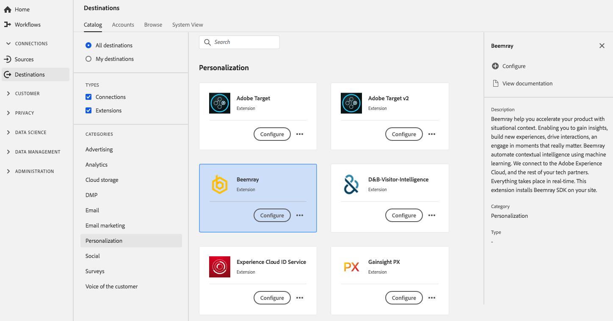

# [!DNL Beemray]-Erweiterung {#beemray-extension}

## Überblick {#overview}

[!DNL Beemray] hilft Ihnen, Ihr Produkt mit situativem Kontext zu beschleunigen. So können Sie Einblicke gewinnen, neue Erlebnisse entwickeln, Interaktionen fördern und Momente kreieren, auf die es ankommt. Beemray automatisiert mithilfe von maschinellem Lernen kontextbezogene Kenntnisse. Beemray verbindet sich mit dem [!DNL Adobe Experience Cloud] und dem Rest Ihrer Technologiepartner. Alles findet in Echtzeit statt. Mit dieser Erweiterung wird [!DNL Beemray] SDK auf Ihrer Site installiert.

Beemray ist eine Personalisierungserweiterung in [!DNL Adobe Experience Platform]. Weitere Informationen zur Funktionalität der Erweiterung finden Sie auf der Seite zu Erweiterungen auf [Adobe Exchange](https://exchange.adobe.com/experiencecloud.details.101063.beemray-human-context.html).

Dieses Ziel ist eine Tag-Erweiterung. Weitere Informationen zur Funktionsweise von Tag-Erweiterungen in Experience Platform finden Sie unter [Tag-Erweiterungen - Übersicht](../launch-extensions/overview.md).

## Voraussetzungen {#prerequisites}

Diese Erweiterung ist im [!DNL Destinations] für alle Kunden verfügbar, die Experience Platform erworben haben.

Um diese Erweiterung verwenden zu können, benötigen Sie Zugriff auf Tags in [!DNL Adobe Experience Platform]. Tags werden [!DNL Adobe Experience Cloud] Kunden als integrierte Mehrwertfunktion angeboten. Wenden Sie sich an den Admin Ihrer Organisation, um Zugriff auf Tags zu erhalten, und bitten Sie darum, Ihnen die **[!UICONTROL manage_properties]** Berechtigung zu erteilen, damit Sie Erweiterungen installieren können.

## Installieren einer Erweiterung {#install-extension}

So installieren Sie die [!DNL Beemray]-Erweiterung:

Wechseln Sie in der [Experience Platform](https://platform.adobe.com/)Benutzeroberfläche zu **[!UICONTROL Destinations]** > **[!UICONTROL Catalog]**.

Wählen Sie die Erweiterung aus dem Katalog aus oder verwenden Sie die Suchleiste.

Wählen Sie das Ziel aus und klicken Sie dann in der rechten Leiste auf **[!UICONTROL Configure]** . Wenn das **[!UICONTROL Configure]** ausgegraut ist, fehlt die **[!UICONTROL manage_properties]**. Siehe [Voraussetzungen](#prerequisites).

Wählen Sie die Tag-Eigenschaft aus, in der Sie die Erweiterung installieren möchten. Sie können auch eine neue Eigenschaft erstellen. Eine Eigenschaft ist eine Sammlung von Regeln, Datenelementen, konfigurierten Erweiterungen, Umgebungen und Bibliotheken. Weitere Informationen zu Eigenschaften finden Sie in der [Tags-Dokumentation](../../../tags/ui/administration/companies-and-properties.md).

Der Workflow führt Sie zur Datenerfassungs-Benutzeroberfläche, um die Installation abzuschließen.

Informationen zu den Konfigurationsoptionen für Erweiterungen und zur Installationsunterstützung finden Sie auf der [Beemray-Seite in Adobe Exchange](https://exchange.adobe.com/experiencecloud.details.101063.beemray-human-context.html).

Sie können die Erweiterung auch direkt in der [Datenerfassungs-Benutzeroberfläche](https://experience.adobe.com/#/data-collection/) installieren. Weitere Informationen finden Sie im Handbuch [Hinzufügen einer neuen ](../../../tags/ui/managing-resources/extensions/overview.md#add-a-new-extension)&quot;.

## Verwenden der Erweiterung {#how-to-use}

Nachdem Sie die Erweiterung installiert haben, können Sie mit dem Einrichten von Regeln beginnen. In der Datenerfassungs-Benutzeroberfläche können Sie Regeln für Ihre installierten Erweiterungen einrichten, damit nur in bestimmten Situationen Ereignisdaten an das Erweiterungsziel gesendet werden. Weitere Informationen zum Einrichten von Regeln für Erweiterungen finden Sie in der Übersicht zu [Regeln](../../../tags/ui/managing-resources/rules.md) in der Tags-Dokumentation.

## Konfigurieren, Aktualisieren und Löschen von Erweiterungen {#configure-upgrade-delete}

Sie können Erweiterungen in der Datenerfassungs-Benutzeroberfläche konfigurieren, aktualisieren und löschen.

>[!TIP]
>
>Wenn die Erweiterung bereits in einer Ihrer Eigenschaften installiert ist, zeigt die Benutzeroberfläche weiterhin **[!UICONTROL Install]** für die Erweiterung an. Starten Sie den Installations-Workflow, wie unter [Installieren einer Erweiterung](#install-extension) beschrieben, um Ihre Erweiterung zu konfigurieren oder zu löschen.

Informationen zum Aktualisieren Ihrer Erweiterung finden Sie in der Anleitung zum [Erweiterungs-Upgrade-Prozess](../../../tags/ui/managing-resources/extensions/extension-upgrade.md) in der Tags-Dokumentation.
