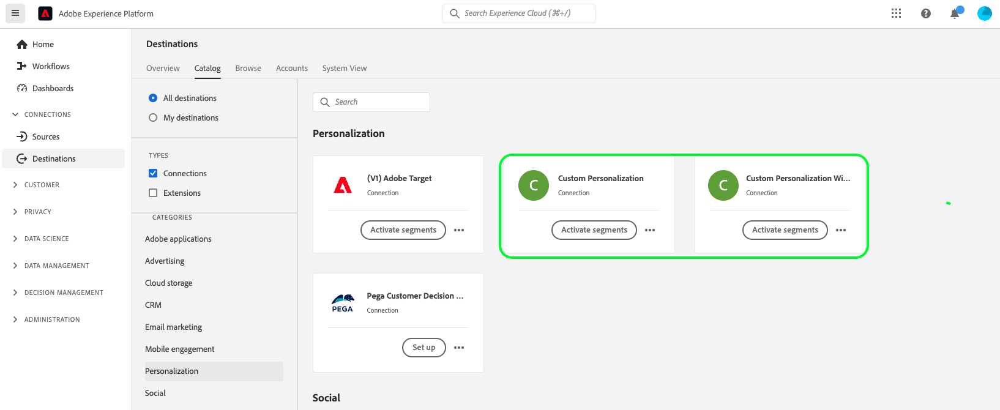

# Benutzerdefinierte Personalisierungsverbindung {#custom-personalization-connection}

## Ziel-Änderungsprotokoll {#changelog}

Mit der Beta-Version der erweiterten **[!UICONTROL Benutzerdefinierte Personalisierung]** Ziel-Connector angezeigt werden, werden möglicherweise zwei **[!UICONTROL Benutzerdefinierte Personalisierung]** Karten im Zielkatalog.

Die **[!UICONTROL Benutzerdefinierte Personalisierung mit Attributen]** -Connector befindet sich derzeit in der Beta-Phase und steht nur einer bestimmten Anzahl von Kunden zur Verfügung. Zusätzlich zu den Funktionen der **[!UICONTROL benutzerdefinierten Personalisierung]** fügt der Connector **[!UICONTROL Benutzerdefinierte Personalisierung mit Attributen]** dem Aktivierungs-Workflow einen optionalen [Zuordnungsschritt](/help/destinations/ui/activate-profile-request-destinations.md#map-attributes) hinzu, mit dem Sie Profilattribute Ihrem benutzerdefinierten Personalisierungsziel zuordnen können, was eine Attribut-basierte Personalisierung auf derselben Seite und auf der nächsten Seite ermöglicht.

>[!IMPORTANT]
>
>Profilattribute können vertrauliche Daten enthalten. Um diese Daten zu schützen, erfordert das Ziel **[!UICONTROL Benutzerdefinierte Personalisierung mit Attributen]**, dass für die Datenerfassung die [Edge Network Server-API](/help/server-api/overview.md) verwendet wird. Außerdem müssen alle Aufrufe der Server-API in einem [authentifizierten Kontext](../../../server-api/authentication.md) erfolgen.
>
>Wenn Sie bereits Web SDK oder Mobile SDK für Ihre Integration verwenden, können Sie Attribute über die Server-API auf zwei Arten abrufen:
>
> * Fügen Sie eine serverseitige Integration hinzu, die Attribute über die Server-API abruft.
> * Aktualisieren Sie Ihre Client-seitige Konfiguration mit einem benutzerdefinierten JavaScript-Code, um Attribute über die Server-API abzurufen.
>
> Wenn Sie die obigen Anforderungen nicht erfüllen, basiert die Personalisierung nur auf der Segmentzugehörigkeit, die mit dem Erlebnis der **[!UICONTROL Benutzerdefinierte Personalisierung]** Connector.



## Übersicht {#overview}

Dieses Ziel bietet eine Möglichkeit, Segmentinformationen von Adobe Experience Platform auf externe Personalisierungsplattformen, Content-Management-Systeme, Anzeigen-Server und andere Programme zu übertragen, die auf Kunden-Websites ausgeführt werden.

## Voraussetzungen {#prerequisites}

Diese Integration basiert auf dem [Adobe Experience Platform Web SDK](../../../edge/home.md) oder [Adobe Experience Platform Mobile SDK](https://aep-sdks.gitbook.io/docs/). Sie müssen eines dieser SDKs verwenden, um dieses Ziel verwenden zu können.

>[!IMPORTANT]
>
>Lesen Sie vor der Erstellung einer benutzerdefinierten Personalisierungsverbindung die Anleitung zum [Konfigurieren von Personalisierungszielen für die Personalisierung derselben Seite und der nächsten Seite](../../ui/configure-personalization-destinations.md). In dieser Anleitung werden die erforderlichen Konfigurationsschritte für die Anwendungsfälle der Personalisierung derselben Seite und der nächsten Seite für mehrere Experience Platform-Komponenten erläutert.

## Exporttyp und Häufigkeit {#export-type-frequency}

**Profilanfrage**: Sie fordern alle Segmente an, die im benutzerdefinierten Personalisierungsziel für ein einzelnes Profil zugeordnet sind. Für verschiedene [Adobe-Datenerfassungsdatenströme](../../../edge/datastreams/overview.md) können verschiedene benutzerdefinierte Personalisierungsziele eingerichtet werden.

## Anwendungsfälle {#use-cases}

Die [!DNL Custom Personalization Connection] ermöglicht Ihnen die Verwendung eigener Plattformen für Personalisierungspartner (z. B. [!DNL Optimizely], [!DNL Pega]) sowie proprietären Systemen (z. B. internem CMS) zur Verfügung, während gleichzeitig die Datenerfassungs- und Segmentierungsfunktionen des Edge-Netzwerks der Experience Platform genutzt werden, um ein tieferes Kundenpersonalisierungs-Erlebnis zu erzielen.

Die unten beschriebenen Anwendungsfälle umfassen sowohl die Personalisierung der Site als auch zielgruppengerechte On-site-Werbung.

Um diese Anwendungsfälle zu aktivieren, benötigen Kunden eine schnelle, optimierte Methode zum Abrufen von Segmentinformationen aus der Experience Platform und zum Senden dieser Informationen an ihre vorgesehenen Systeme, die sie in der Experience Platform-Benutzeroberfläche als benutzerdefinierte Personalisierungsverbindungen konfiguriert haben.

Bei diesen Systemen kann es sich um externe Personalisierungsplattformen, Content Management-Systeme, Adserver und andere Anwendungen handeln, die über die Web- und mobilen Eigenschaften von Kunden hinweg ausgeführt werden.

### Personalisierung derselben Seite {#same-page}

Ein Benutzer besucht eine Seite Ihrer Website. Der Kunde kann die aktuelle Seitenbesuchsinformationen (z. B. verweisende URL, Browsersprache, eingebettete Produktinformationen) verwenden, um die nächste Aktion/Entscheidung (z. B. Personalisierung) auszuwählen, indem er die benutzerdefinierte Personalisierungsverbindung für Plattformen ohne Adobe verwendet (z. B. [!DNL Pega], [!DNL Optimizely]usw.).

### Personalisierung der nächsten Seite {#next-page}

Ein Benutzer besucht Seite A auf Ihrer Website. Auf der Grundlage dieser Interaktion hat sich der Benutzer für eine Reihe von Segmenten qualifiziert. Der Benutzer klickt dann auf einen Link, der ihn von Seite A zu Seite B bringt. Die Segmente, für die sich der Benutzer während der vorherigen Interaktion auf Seite A qualifiziert hat, werden zusammen mit den durch den aktuellen Website-Besuch festgelegten Profilaktualisierungen verwendet, um die nächste Aktion/Entscheidung zu ermöglichen (z. B. welches Werbebanner dem Besucher angezeigt werden soll oder, im Fall von A/B-Tests, welche Version der Seite angezeigt werden soll).

### Personalisierung der nächsten Sitzung {#next-session}

Ein Benutzer besucht mehrere Seiten auf Ihrer Website. Auf der Grundlage dieser Interaktionen hat sich der Benutzer für eine Reihe von Segmenten qualifiziert. Der Benutzer beendet dann die aktuelle Browser-Sitzung.

Am folgenden Tag kehrt der Benutzer zur gleichen Kundenwebsite zurück. Die Segmente, für die sie sich während der vorherigen Interaktion mit allen besuchten Webseiten qualifiziert hatten, sowie die durch den aktuellen Website-Besuch bestimmten Profilattribute werden zur Auswahl der nächsten Aktion/Entscheidung verwendet (z. B. welches Werbebanner dem Besucher angezeigt werden soll oder, im Fall von A/B-Tests, welche Version der Seite angezeigt werden soll).

## Herstellen einer Verbindung mit der Datenbank {#connect}

>[!CONTEXTUALHELP]
>id="platform_destinations_custom_personalization_datastream"
>title="Informationen zu Datenstrom-IDs"
>abstract="Diese Option bestimmt, in welchen Datenerfassungsdatenstrom die Segmente in der Antwort auf die Seite aufgenommen werden. Das Dropdown-Menü enthält nur Datenströme, für die die Zielkonfiguration aktiviert ist. Sie müssen einen Datenstrom konfigurieren, bevor Sie Ihr Ziel konfigurieren können."
>additional-url="https://experienceleague.adobe.com/docs/experience-platform/edge/fundamentals/datastreams.html?lang=de" text="Erfahren Sie, wie Sie einen Datenstrom konfigurieren"

>[!IMPORTANT]
> 
>Um eine Verbindung zum Ziel herzustellen, benötigen Sie die [Zugriffsberechtigung](/help/access-control/home.md#permissions) **[!UICONTROL Ziele verwalten]**. Lesen Sie die [Übersicht über die Zugriffskontrolle](/help/access-control/ui/overview.md) oder wenden Sie sich an Ihren Produktadministrator, um die erforderlichen Berechtigungen zu erhalten.

Um eine Verbindung mit diesem Ziel herzustellen, gehen Sie wie im Abschnitt [Tutorial zur Zielkonfiguration](../../ui/connect-destination.md) beschrieben vor.

### Verbindungsparameter {#parameters}

Beim [Einrichten](../../ui/connect-destination.md) dieses Ziels müssen Sie die folgenden Informationen angeben:

* **[!UICONTROL Name]**: Geben Sie den gewünschten Namen für das Ziel ein.
* **[!UICONTROL Beschreibung]**: Geben Sie eine Beschreibung für das Ziel ein. Hier können Sie beispielsweise erwähnen, für welche Kampagne Sie dieses Ziel verwenden. Dieses Feld ist optional.
* **[!UICONTROL Integrationsalias]**: Dieser Wert wird als JSON-Objektname an das Experience Platform Web SDK gesendet.
* **[!UICONTROL Datenstrom-ID]**: Diese Angabe legt fest, in welchen Datenerfassungsdatenstrom die Segmente in der Antwort auf die Seite aufgenommen werden. Das Dropdown-Menü enthält nur Datenströme, für die die Zielkonfiguration aktiviert ist. Weitere Details finden Sie unter [Konfigurieren eines Datenstroms](../../../edge/datastreams/overview.md).

### Aktivieren von Warnhinweisen {#enable-alerts}

Sie können Warnhinweise aktivieren, um Benachrichtigungen zum Status des Datenflusses zu Ihrem Ziel zu erhalten. Wählen Sie einen Warnhinweis aus der zu abonnierenden Liste aus, um Benachrichtigungen über den Status Ihres Datenflusses zu erhalten. Weitere Informationen zu Warnhinweisen finden Sie im Handbuch zum [Abonnieren von Zielwarnhinweisen über die Benutzeroberfläche](../../ui/alerts.md).

Wenn Sie mit dem Eingeben der Details für Ihre Zielverbindung fertig sind, klicken Sie auf **[!UICONTROL Weiter]**.

## Aktivieren von Segmenten für dieses Ziel {#activate}

>[!IMPORTANT]
> 
>Um Daten zu aktivieren, benötigen Sie die [Zugriffssteuerungsberechtigungen](/help/access-control/home.md#permissions) **[!UICONTROL Ziele verwalten]**, **[!UICONTROL Ziele aktivieren]**, **[!UICONTROL Profile anzeigen]** und **[!UICONTROL Segmente anzeigen]**. Lesen Sie die [Übersicht über die Zugriffskontrolle](/help/access-control/ui/overview.md) oder wenden Sie sich an Ihren Produktadministrator, um die erforderlichen Berechtigungen zu erhalten.

Anweisungen zum Aktivieren von Zielgruppensegmenten für dieses Ziel finden Sie unter [Aktivieren von Profilen und Segmenten für Profilanfrageziele](../../ui/activate-profile-request-destinations.md).

## Exportierte Daten {#exported-data}

Wenn Sie [Tags in Adobe Experience Platform](../../../tags/home.md) zum Bereitstellen des Experience Platform Web SDK verwenden, nutzen Sie die Funktion [send event complete](../../../edge/extension/event-types.md), damit Ihre Aktion mit benutzerdefiniertem Code über eine `event.destinations`-Variable verfügt, mit der Sie die exportierten Daten anzeigen können.

Hier finden Sie einen Beispielwert für die `event.destinations`-Variable:

```
[
   {
      "type":"profileLookup",
      "destinationId":"7bb4cb8d-8c2e-4450-871d-b7824f547111",
      "alias":"personalizationAlias",
      "segments":[
         {
            "id":"399eb3e7-3d50-47d3-ad30-a5ad99e8ab77"
         },
         {
            "id":"499eb3e7-3d50-47d3-ad30-a5ad99e8ab77"
         }
      ]
   }
]
```

Wenn Sie [Tags](../../../tags/home.md) nicht zum Bereitstellen des Experience Platform Web SDK verwenden, nutzten Sie die Funktion [handling responses from events](../../../edge/fundamentals/tracking-events.md#handling-responses-from-events), um die exportierten Daten anzuzeigen.

Die JSON-Antwort von Adobe Experience Platform kann analysiert werden, um den entsprechenden Integrationsalias des Programms zu finden, das Sie mit Adobe Experience Platform integrieren. Die Segment-IDs können als Targeting-Parameter dem Code des Programms übergeben werden. Nachfolgend finden Sie ein Beispiel dafür, wie dies spezifisch für die Zielantwort aussehen würde.

```
alloy("sendEvent", {
  "renderDecisions": true,
  "xdm": {
    "commerce": {
      "order": {
        "purchaseID": "a8g784hjq1mnp3",
        "purchaseOrderNumber": "VAU3123",
        "currencyCode": "USD",
        "priceTotal": 999.98
      }
    }
  }
}).then(function(result) {
    if(result.destinations) { // Looking to see if the destination results are there
 
        // Get the destination with a particular alias
        var personalizationDestinations = result.destinations.filter(x => x.alias == "personalizationAlias")
        if(personalizationDestinations.length > 0) {
             // Code to pass the segment IDs into the system that corresponds to personalizationAlias
        }
        var adServerDestinations = result.destinations.filter(x => x.alias == "adServerAlias")
        if(adServerDestinations.length > 0) {
            // Code to pass the segment ids into the system that corresponds to adServerAlias
        }
     }
   })
  .catch(function(error) {
    // Tracking the event failed.
  });
```

### Beispielantwort für [!UICONTROL Benutzerdefinierte Personalisierung mit Attributen]

Bei Verwendung von **[!UICONTROL Benutzerdefinierte Personalisierung mit Attributen]**, sieht die API-Antwort ähnlich wie im folgenden Beispiel aus.

Der Unterschied zwischen **[!UICONTROL Benutzerdefinierte Personalisierung mit Attributen]** und **[!UICONTROL Benutzerdefinierte Personalisierung]** ist die Aufnahme der `attributes` in der API-Antwort.

```json
[
    {
        "type": "profileLookup",
        "destinationId": "7bb4cb8d-8c2e-4450-871d-b7824f547130",
        "alias": "personalizationAlias",
        "attributes": {
             "countryCode": {
                   "value" : "DE"
              },
             "membershipStatus": {
                   "value" : "PREMIUM"
              }
         },         
        "segments": [
            {
                "id": "399eb3e7-3d50-47d3-ad30-a5ad99e8ab77"
            },
            {
                "id": "499eb3e7-3d50-47d3-ad30-a5ad99e8ab77"
            }
        ]
    }
]
```

## Datennutzung und -Governance {#data-usage-governance}

Alle [!DNL Adobe Experience Platform]-Ziele sind bei der Verarbeitung Ihrer Daten mit Datennutzungsrichtlinien konform. Ausführliche Informationen darüber, wie [!DNL Adobe Experience Platform] Data Governance erzwingt, finden Sie unter [Data Governance - Übersicht](../../../data-governance/home.md).
