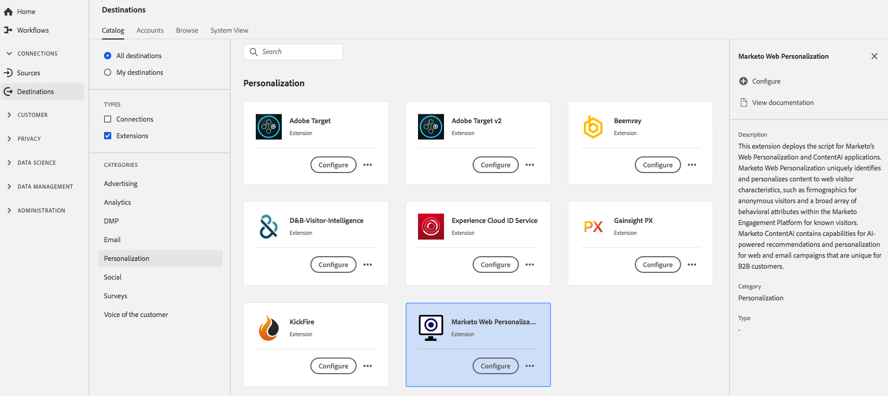

# [!DNL Marketo Web Personalization]-Erweiterung {#marketo-web-personalization-extension}

## Überblick {#overview}

Diese Erweiterung stellt das Skript für [!DNL Marketo's] Web-Personalization- und ContentAI-Anwendungen bereit. [!DNL Marketo] Web Personalization identifiziert und personalisiert Inhalte eindeutig anhand von Web-Besuchermerkmalen, z. B. Firmografien für anonyme Besucher und eine breite Palette von Verhaltensattributen innerhalb der [!DNL Marketo] Interaktionsplattform für bekannte Besucher. [!DNL Marketo] ContentAI enthält Funktionen für KI-gestützte Empfehlungen und Personalisierung für Web- und E-Mail-Kampagnen, die für B2B-Kunden einzigartig sind.

[!DNL Marketo Web Personalization] ist eine Personalisierungserweiterung in Adobe Experience Platform. Weitere Informationen zur Web-Personalisierung und ContentAI in Marketo finden Sie unter [Übersicht über Web-Personalization](https://experienceleague.adobe.com/docs/marketo/using/product-docs/web-personalization/understanding-web-personalization/web-personalization-overview.html).

Dieses Ziel ist eine Tag-Erweiterung. Weitere Informationen zur Funktionsweise von Tag-Erweiterungen in Experience Platform finden Sie unter [Tag-Erweiterungen - Übersicht](../launch-extensions/overview.md).

## Voraussetzungen {#prerequisites}

Diese Erweiterung ist im [!DNL Destinations] für alle Kunden verfügbar, die Experience Platform erworben haben.

Um diese Erweiterung verwenden zu können, müssen Sie Zugriff auf Tags in Adobe Experience Platform haben. Tags werden Adobe Experience Cloud-Kunden als integrierte Mehrwertfunktion angeboten. Wenden Sie sich an den Admin Ihrer Organisation, um Zugriff auf Tags zu erhalten, und bitten Sie darum, Ihnen die **[!UICONTROL manage_properties]** Berechtigung zu erteilen, damit Sie Erweiterungen installieren können.

## Installieren einer Erweiterung {#install-extension}

So installieren Sie die [!DNL Marketo Web Personalization]-Erweiterung:

Wechseln Sie in der [Experience Platform](https://platform.adobe.com/)Benutzeroberfläche zu **[!UICONTROL Destinations]** > **[!UICONTROL Catalog]**.

Wählen Sie die Erweiterung aus dem Katalog aus oder verwenden Sie die Suchleiste.

Wählen Sie das Ziel aus und klicken Sie dann in der rechten Leiste auf **[!UICONTROL Configure]** . Wenn das **[!UICONTROL Configure]** ausgegraut ist, fehlt die **[!UICONTROL manage_properties]**. Siehe [Voraussetzungen](#prerequisites).

Wählen Sie die Eigenschaft aus, in der Sie die Erweiterung installieren möchten. Sie können auch eine neue Eigenschaft erstellen. Eine Eigenschaft ist eine Sammlung von Regeln, Datenelementen, konfigurierten Erweiterungen, Umgebungen und Bibliotheken. Informationen zu Eigenschaften finden Sie im [Eigenschaften-Seitenabschnitt](../../../tags/ui/administration/companies-and-properties.md#properties-page) der Tags-Dokumentation.

Der Workflow führt Sie durch die Schritte zum Abschließen der Installation.

Sie können die Erweiterung auch direkt in der [Datenerfassungs-Benutzeroberfläche](https://experience.adobe.com/#/data-collection/) installieren. Weitere Informationen finden Sie im Abschnitt zum Thema [Hinzufügen einer neuen Erweiterung](../../../tags/ui/managing-resources/extensions/overview.md#add-a-new-extension) in der Tag-Dokumentation.

## Verwenden der Erweiterung {#how-to-use}

Nachdem Sie die Erweiterung installiert haben, können Sie mit dem Einrichten von Regeln beginnen.

Sie können Regeln für Ihre installierten Erweiterungen einrichten, damit nur in bestimmten Situationen Ereignisdaten an das Erweiterungsziel gesendet werden. Weitere Informationen zum Einrichten von Regeln für Erweiterungen finden Sie in der [Tags-Dokumentation](../../../tags/ui/managing-resources/rules.md).

## Konfigurieren, Aktualisieren und Löschen von Erweiterungen {#configure-upgrade-delete}

Sie können Erweiterungen in der Datenerfassungs-Benutzeroberfläche konfigurieren, aktualisieren und löschen.

>[!TIP]
>
>Wenn die Erweiterung bereits in einer Ihrer Eigenschaften installiert ist, zeigt die Experience Platform-Benutzeroberfläche weiterhin **[!UICONTROL Install]** für die Erweiterung an. Starten Sie den Installations-Workflow, wie unter [Installieren einer Erweiterung](#install-extension) beschrieben, um Ihre Erweiterung zu konfigurieren oder zu löschen.

Informationen zum Aktualisieren Ihrer Erweiterung finden Sie in der Anleitung zum [Erweiterungs-Upgrade-Prozess](../../../tags/ui/managing-resources/extensions/extension-upgrade.md) in der Tags-Dokumentation.
