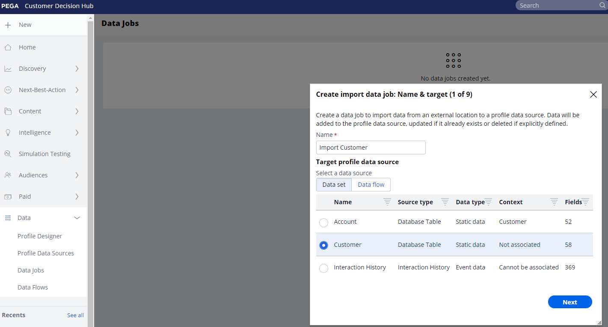

# Pega-Profil-Connector

## Überblick {#overview}

Verwenden Sie die [!DNL Pega Profile Connector] in Adobe Experience Platform, um eine ausgehende Live-Verbindung zu Ihrem [!DNL Amazon Web Services] (AWS) S3-Speicher herzustellen und so Profildaten regelmäßig in CSV-Dateien aus Adobe Experience Platform in Ihre eigenen S3-Buckets zu exportieren. In [!DNL Pega Customer Decision Hub] können Sie Datenaufträge planen, um diese Profildaten aus dem S3-Speicher zur Aktualisierung des [!DNL Pega Customer Decision Hub]-Profils importieren.

Dieser Connector hilft beim Einrichten des anfänglichen Exports von Profildaten und beim regelmäßigen Synchronisieren neuer Profile mit [!DNL Pega Customer Decision Hub].  Aktuelle Daten im Customer Decision Hub bieten eine bessere und aktualisierte Ansicht Ihres Kundenstamms für die nächstbeste Entscheidungsfindung.

>[!IMPORTANT]
>
>Dieser Ziel-Connector und diese Dokumentationsseite werden von Pegasystems erstellt und gepflegt. Bei Fragen oder Aktualisierungsanfragen wenden Sie sich bitte direkt an Pega [hier](mailto:support@pega.com).

## Anwendungsfälle {#use-cases}

Damit Sie besser verstehen können, wie und wann Sie das [!DNL Pega Profile Connector]-Ziel verwenden sollten, finden Sie hier einige Beispielanwendungsfälle, die Kundinnen und Kunden von Adobe Experience Platform mit diesem Ziel bewältigen können.

### Anwendungsfall 1 {#use-case-1}

Ein Marketing-Experte möchte zunächst [!DNL Pega Customer Decision Hub] mit Profildaten einrichten, die aus Adobe Experience Platform geladen wurden. Hierbei handelt es sich um eine anfängliche Volllast, gefolgt von geplanten Delta-Lasten.

### Anwendungsfall 2 {#use-case-2}

Marketing-Experten fordern aktuelle Profildaten aus Adobe Experience Platform, die in [!DNL Pega Customer Decision Hub] verfügbar sind und die Pega-Erkenntnisse zu Kundenprofilen laufend verbessern.

## Voraussetzungen {#prerequisites}

Bevor Sie dieses Ziel verwenden können, um Daten aus Adobe Experience Platform zu exportieren und Profile in [!DNL Pega Customer Decision Hub] zu importieren, müssen Sie die folgenden Voraussetzungen erfüllen:

* Konfigurieren Sie [!DNL Amazon S3] Bucket und den Ordnerpfad, der für den Export und Import von Datendateien verwendet werden soll.
* Konfigurieren Sie den [!DNL Amazon S3] Zugriffsschlüssel und [!DNL Amazon S3] geheimen Schlüssel: Generieren Sie in [!DNL Amazon S3] ein `access key - secret access key`, um Experience Platform Zugriff auf Ihr [!DNL Amazon S3] zu gewähren.
* Um Daten erfolgreich mit Ihrem [!DNL Amazon S3]-Speicherort zu verbinden und dorthin zu exportieren, erstellen Sie ein Benutzerprofil für Identitäts- und Zugriffsverwaltung (IAM) zum [!DNL Experience Platform] in [!DNL Amazon S3] und weisen Berechtigungen wie `s3:DeleteObject`, `s3:GetBucketLocation`, `s3:GetObject`, `s3:ListBucket`, `s3:PutObject` `s3:ListMultipartUploadParts` zu
* Stellen Sie sicher, dass Ihre [!DNL Pega Customer Decision Hub]-Instanz auf Version 8.8 oder höher aktualisiert wurde.

## Unterstützte Identitäten {#supported-identities}

[!DNL Pega Customer Decision Hub] unterstützt die Aktivierung benutzerdefinierter Benutzer-IDs, die in der folgenden Tabelle beschrieben werden. Weitere Informationen finden Sie unter [Identitäten](/help/identity-service/features/namespaces.md).

| Ziel-Identität | Beschreibung |
|---|---|
| *CustomerID* | Allgemeine Benutzerkennung, die ein Profil in [!DNL Pega Customer Decision Hub] und Adobe Experience Platform eindeutig identifiziert |

{style="table-layout:auto"}

## Unterstützte Zielgruppen {#supported-audiences}

In diesem Abschnitt wird beschrieben, welche Arten von Zielgruppen Sie an dieses Ziel exportieren können.

| Zielgruppenherkunft | Unterstützt | Beschreibung |
|---------|----------|----------|
| [!DNL Segmentation Service] | Ja | Zielgruppen, die über den Experience Platform-[ (Segmentierungs-Service) generiert ](../../../segmentation/home.md). |
| Alle anderen Ursprünge der Zielgruppe | Nein | Diese Kategorie enthält alle Ursprünge der Zielgruppe außerhalb der Zielgruppen, die durch die [!DNL Segmentation Service] generiert wurden. Lesen Sie mehr über [verschiedene Ursprünge von Audiences](/help/segmentation/ui/audience-portal.md#customize). Einige Beispiele: <ul><li> benutzerdefinierte Upload-Zielgruppen [importiert](../../../segmentation/ui/audience-portal.md#import-audience) aus CSV-Dateien in Experience Platform,</li><li> Lookalike-Zielgruppen, </li><li> Federated Audiences, </li><li> Zielgruppen, die in anderen Experience Platform-Apps wie Adobe Journey Optimizer generiert wurden, </li><li> und mehr. </li></ul> |

{style="table-layout:auto"}

Unterstützte Zielgruppen nach Zielgruppen-Datentyp:

| Datentyp der Zielgruppe | Unterstützt | Beschreibung | Anwendungsfälle |
|--------------------|-----------|-------------|-----------|
| [Personen-Zielgruppen](/help/segmentation/types/people-audiences.md) | Ja | Basierend auf Kundenprofilen können Sie bestimmte Personengruppen für Marketing-Kampagnen ansprechen. | Häufige Käufer, Warenkorbabbrüche |
| [Konto-Zielgruppen](/help/segmentation/types/account-audiences.md) | Nein | Targeting von Personen in bestimmten Organisationen für Account-basierte Marketing-Strategien. | B2B-Marketing |
| [Interessenten-Zielgruppen](/help/segmentation/types/prospect-audiences.md) | Nein | Targeting von Personen, die noch keine Kunden sind, aber Merkmale mit Ihrer Zielgruppe teilen. | Akquise mit Drittanbieterdaten |
| [Datensatzexporte](/help/catalog/datasets/overview.md) | Nein | Im Data Lake von Adobe Experience Platform gespeicherte Sammlungen strukturierter Daten. | Reporting, Datenwissenschaft-Workflows |

{style="table-layout:auto"}

## Exporttyp und -häufigkeit {#export-type-frequency}

Beziehen Sie sich auf die folgende Tabelle, um Informationen zu Typ und Häufigkeit des Zielexports zu erhalten.

| Element | Typ | Anmerkungen |
|---------|----------|---------|
| Exporttyp | **[!UICONTROL Profile-based]** | Sie exportieren alle Mitglieder eines Segments zusammen mit den gewünschten Schemafeldern (z. B. E-Mail-Adresse, Telefonnummer, Nachname), wie im Bildschirm „Auswählen der Profilattribute“ im [Zielaktivierungs-Workflow](../../ui/activate-batch-profile-destinations.md#select-attributes) festgelegt. |
| Exporthäufigkeit | **[!UICONTROL Batch]** | Batch-Ziele exportieren Dateien in Schritten von drei, sechs, acht, zwölf oder vierundzwanzig Stunden auf nachgelagerte Plattformen. Weitere Informationen finden Sie unter [Batch-Datei-basierte Ziele](/help/destinations/destination-types.md#file-based). |

{style="table-layout:auto"}

## Herstellen einer Verbindung mit dem Ziel {#connect}

>[!IMPORTANT]
>
>Um eine Verbindung zum Ziel herzustellen, benötigen Sie die **[!UICONTROL View Destinations]** und **[!UICONTROL Manage Destinations]** Zugriffssteuerungsberechtigungen[. ](/help/access-control/home.md#permissions) Lesen Sie die [Zugriffskontrolle – Übersicht](/help/access-control/ui/overview.md) oder wenden Sie sich an Ihren Produktadministrator, um die erforderlichen Berechtigungen zu erhalten.

Um eine Verbindung mit diesem Ziel herzustellen, gehen Sie wie im [Tutorial zur Zielkonfiguration](../../ui/connect-destination.md) beschrieben vor. Füllen Sie im Zielkonfigurations-Workflow die Felder aus, die in den beiden folgenden Abschnitten aufgeführt sind.

### Beim Ziel authentifizieren {#authenticate}

Um sich beim Ziel zu authentifizieren, füllen Sie die erforderlichen Felder aus und wählen Sie **[!UICONTROL Connect to destination]** aus.

* **[!DNL Amazon S3]-** und **[!DNL Amazon S3]geheimer Schlüssel**: Generieren Sie [!DNL Amazon S3] ein `access key - secret access key`, um Adobe Experience Platform Zugriff auf Ihr [!DNL Amazon S3]-Konto zu gewähren. Weitere Informationen finden Sie in der [Amazon Web Services-Dokumentation](https://docs.aws.amazon.com/de_de/IAM/latest/UserGuide/id_credentials_access-keys.html).

### Ausfüllen der Zieldetails {#destination-details}

Geben Sie nach Herstellung der Authentifizierungsverbindung zum [!DNL Amazon S3] die folgenden Informationen für das Ziel an:

Um Details für das Ziel zu konfigurieren, füllen Sie die erforderlichen Felder aus und wählen Sie **[!UICONTROL Next]** aus. Ein Sternchen neben einem Feld in der Benutzeroberfläche zeigt an, dass das Feld erforderlich ist.

* **[!UICONTROL Name]**: Geben Sie einen Namen ein, der Ihnen bei der Identifizierung dieses Ziels hilft.
* **[!UICONTROL Description]**: Geben Sie eine Beschreibung für dieses Ziel ein.
* **[!UICONTROL Bucket name]**: Geben Sie den Namen des [!DNL Amazon S3]-Behälters ein, der von diesem Ziel verwendet werden soll.
* **[!UICONTROL Folder path]**: Geben Sie den Pfad zum Zielordner ein, in dem die exportierten Dateien gespeichert werden.
* **[!UICONTROL Compression Type]**: Wählen Sie den Komprimierungstyp als GZIP oder KEINE aus.

>[!TIP]
>
>Im Zielverbindungs-Workflow können Sie für jede exportierte Zielgruppendatei einen benutzerdefinierten Ordner im Amazon S3-Speicher erstellen. Anweisungen finden Sie unter [Verwenden von Makros zum Erstellen eines Ordners an Ihrem Speicherort](/help/destinations/catalog/cloud-storage/overview.md#use-macros).

### Aktivieren von Warnhinweisen {#enable-alerts}

Sie können Warnhinweise aktivieren, um Benachrichtigungen zum Status des Datenflusses zu Ihrem Ziel zu erhalten. Wählen Sie einen Warnhinweis aus der zu abonnierenden Liste aus, um Benachrichtigungen über den Status Ihres Datenflusses zu erhalten. Weitere Informationen zu Warnhinweisen finden Sie im Handbuch zum [Abonnieren von Zielwarnhinweisen über die Benutzeroberfläche](../../ui/alerts.md).

Wenn Sie mit dem Eingeben der Details für Ihre Zielverbindung fertig sind, wählen Sie **[!UICONTROL Next]** aus.

## Aktivieren von Zielgruppen für dieses Ziel {#activate}

>[!IMPORTANT]
>
>* Zum Aktivieren von Daten benötigen Sie die **[!UICONTROL View Destinations]**, **[!UICONTROL Activate Destinations]**, **[!UICONTROL View Profiles]** und **[!UICONTROL View Segments]** [Zugriffssteuerungsberechtigungen](/help/access-control/home.md#permissions). Lesen Sie die [Übersicht über die Zugriffssteuerung](/help/access-control/ui/overview.md) oder wenden Sie sich an Ihre Produktadmins, um die erforderlichen Berechtigungen zu erhalten.
>* Zum Exportieren *Identitäten* benötigen Sie die **[!UICONTROL View Identity Graph]** Zugriffssteuerungsberechtigung.   {width="100" zoomable="yes"}

Anweisungen [ Aktivieren von Zielgruppen für dieses Ziel finden Sie ](../../ui/activate-batch-profile-destinations.md)Aktivieren von Zielgruppendaten für Batch-Profil-).

### Zuordnen von Attributen und Identitäten {#map}

Im **[!UICONTROL Mapping]** Schritt können Sie auswählen, welche Attribut- und Identitätsfelder für Ihre Profile exportiert werden sollen. Sie können auch festlegen, dass die Kopfzeilen in der exportierten Datei in einen beliebigen Anzeigenamen geändert werden. Weitere Informationen finden Sie im [Zuordnungsschritt](/help/destinations/ui/activate-batch-profile-destinations.md#mapping) im Tutorial zur Benutzeroberfläche der Aktivierung von Batch-Zielen.

## Überprüfen des Datenexports {#exported-data}

Für [!DNL Pega Profile Connector]-Ziele erstellt [!DNL Experience Platform] eine `.csv`-Datei an dem von Ihnen angegebenen Amazon S3-Speicherort. Weitere Informationen zu den Dateien finden Sie unter [Aktivieren von Zielgruppendaten für Batch-Profil-Exportziele](../../ui/activate-batch-profile-destinations.md) im Tutorial zur Zielgruppenaktivierung.

Bei einem erfolgreichen Import von Profildaten aus S3 werden Daten in den [!DNL Pega Customer] Profildatenspeicher eingefügt. Die importierten Kundenprofildaten können in [!DNL Pega Customer Profile Designer] validiert werden, wie in der folgenden Abbildung dargestellt.

In [!DNL Pega Customer Decision Hub] können Datenadministratoren Datenaufträge konfigurieren, [!DNL Customer Profile Designer] Profildaten regelmäßig aus S3 zu importieren, wie in der folgenden Abbildung dargestellt. Weitere Informationen [ Konfigurieren von Datenvorgängen ](#additional-resources) Importieren von Profildaten aus [!DNL Amazon S3] finden Sie unter „Zusätzliche Ressourcen“.

## Weitere Ressourcen {#additional-resources}

Siehe [Datenaufträge importieren](https://academy.pega.com/topic/import-data-jobs/v1) in [!DNL Pega Customer Decision Hub].

## Datennutzung und -Governance {#data-usage-governance}

Alle [!DNL Adobe Experience Platform]-Ziele sind bei der Verarbeitung Ihrer Daten mit Datennutzungsrichtlinien konform. Ausführliche Informationen darüber, wie [!DNL Adobe Experience Platform] Data Governance erzwingt, finden Sie unter [Data Governance – Übersicht](/help/data-governance/home.md).
