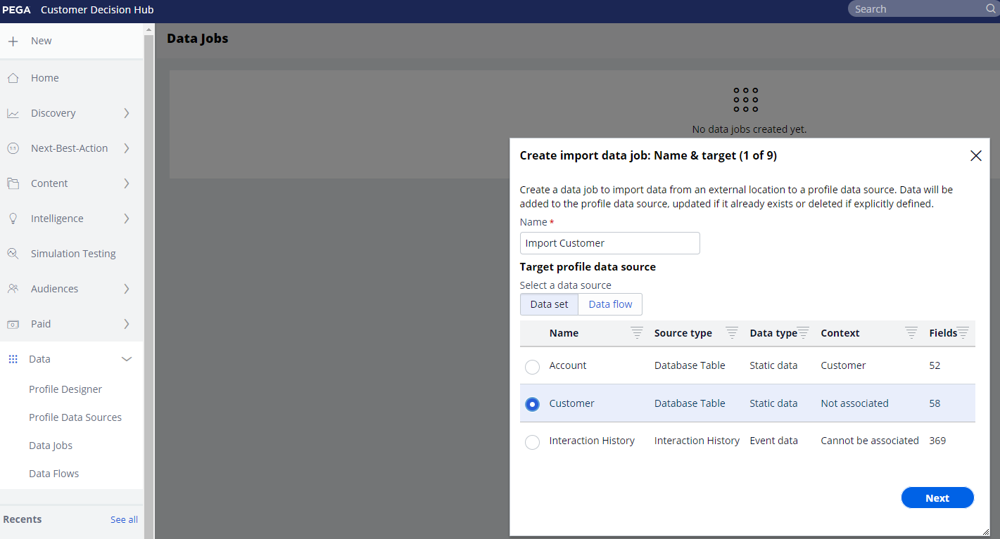

# Pega Profile Connector

## Übersicht {#overview}

Verwenden Sie den Wert [!DNL Pega Profile Connector] in Adobe Experience Platform, um eine ausgehende Live-Verbindung zu Ihrem S3-Speicher vom Typ [!DNL Amazon Web Services] (AWS) herzustellen, um regelmäßig Profildaten in CSV-Dateien von Adobe Experience Platform in Ihre eigenen S3-Behälter zu exportieren. In [!DNL Pega Customer Decision Hub] können Sie Datenaufträge planen, um diese Profildaten aus dem S3-Speicher zur Aktualisierung des [!DNL Pega Customer Decision Hub]-Profils importieren.

Dieser Connector hilft beim Einrichten des anfänglichen Exports von Profildaten und hilft auch, neue Profile regelmäßig in [!DNL Pega Customer Decision Hub] zu synchronisieren.  Die Verwendung aktueller Daten in Customer Decisioning Hub bietet eine bessere und aktualisierte Ansicht Ihrer Kundenbasis für die Entscheidungsfindung für die nächsten Schritte.

>[!IMPORTANT]
>
>Diese Ziel-Connector- und Dokumentationsseite werden von Pegasystemen erstellt und gepflegt. Bei Fragen oder Aktualisierungsanfragen wenden Sie sich bitte direkt an Pega [hier](mailto:support@pega.com).

## Anwendungsfälle

Um Ihnen zu helfen, besser zu verstehen, wie und wann Sie das [!DNL Pega Profile Connector]-Ziel verwenden sollten, finden Sie hier Beispielanwendungsfälle, die Adobe Experience Platform-Kunden mit diesem Ziel lösen können.

### Anwendungsfall 1

Ein Marketing-Experte möchte zunächst [!DNL Pega Customer Decision Hub] mit aus Adobe Experience Platform geladenen Profildaten einrichten. Hierbei handelt es sich um eine anfängliche Volllast, der Delta-Ladevorgänge auf geplanter Basis folgen.

### Anwendungsfall 2

Ein Marketer möchte aktuelle Profildaten aus Adobe Experience Platform in [!DNL Pega Customer Decision Hub] verfügbar machen, die die Pega-Einblicke um Kundenprofile kontinuierlich verbessern.

## Voraussetzungen {#prerequisites}

Bevor Sie dieses Ziel verwenden können, um Daten aus Adobe Experience Platform zu exportieren und Profile in [!DNL Pega Customer Decision Hub] zu importieren, müssen Sie die folgenden Voraussetzungen erfüllen:

* Konfigurieren Sie den Ordner [!DNL Amazon S3] und den Ordnerpfad, der für den Export und Import von Datendateien verwendet werden soll.
* Konfigurieren Sie den Zugriffsschlüssel [!DNL Amazon S3] und den geheimen Schlüssel [!DNL Amazon S3]: Generieren Sie in [!DNL Amazon S3] ein Paar `access key - secret access key` , um Platform Zugriff auf Ihr [!DNL Amazon S3] -Konto zu gewähren.
* Um Daten erfolgreich mit Ihrem [!DNL Amazon S3] -Speicherort zu verbinden und zu exportieren, erstellen Sie einen Benutzer für die Identitäts- und Zugriffsverwaltung (IAM) für [!DNL Platform] in [!DNL Amazon S3] und weisen Sie Berechtigungen wie `s3:DeleteObject`, `s3:GetBucketLocation`, `s3:GetObject`, `s3:ListBucket`, `s3:PutObject`, `s3:ListMultipartUploadParts` zu.
* Stellen Sie sicher, dass Ihre [!DNL Pega Customer Decision Hub] -Instanz auf Version 8.8 oder höher aktualisiert ist.

## Unterstützte Identitäten {#supported-identities}

[!DNL Pega Customer Decision Hub] unterstützt die Aktivierung benutzerdefinierter Benutzer-IDs, die in der folgenden Tabelle beschrieben sind. Weitere Informationen finden Sie unter [identities](/help/identity-service/features/namespaces.md).

| Ziel-Identität | Beschreibung |
|---|---|
| *CustomerID* | Allgemeine Benutzer-ID, die ein Profil in [!DNL Pega Customer Decision Hub] und Adobe Experience Platform eindeutig identifiziert |

{style="table-layout:auto"}

## Exporttyp und -häufigkeit {#export-type-frequency}

Beziehen Sie sich auf die folgende Tabelle, um Informationen zu Typ und Häufigkeit des Zielexports zu erhalten.

| Element | Typ | Anmerkungen |
|---------|----------|---------|
| Exporttyp | **[!UICONTROL Profilbasiert]** | Sie exportieren alle Mitglieder eines Segments zusammen mit den gewünschten Schemafeldern (z. B. E-Mail-Adresse, Telefonnummer, Nachname), wie im Bildschirm „Auswählen der Profilattribute“ im [Zielaktivierungs-Workflow](../../ui/activate-batch-profile-destinations.md#select-attributes) festgelegt. |
| Exporthäufigkeit | **[!UICONTROL Batch]** | Batch-Ziele exportieren Dateien in Schritten von drei, sechs, acht, zwölf oder vierundzwanzig Stunden auf nachgelagerte Plattformen. Weitere Informationen finden Sie unter [Batch-Datei-basierte Ziele](/help/destinations/destination-types.md#file-based). |

{style="table-layout:auto"}

## Herstellen einer Verbindung mit dem Ziel {#connect}

>[!IMPORTANT]
> 
>Um eine Verbindung zum Ziel herzustellen, benötigen Sie die Zugriffssteuerungsberechtigungen **[!UICONTROL Ziele anzeigen]** und **[!UICONTROL Ziele verwalten]** [. ](/help/access-control/home.md#permissions) Lesen Sie die [Zugriffskontrolle – Übersicht](/help/access-control/ui/overview.md) oder wenden Sie sich an Ihren Produktadministrator, um die erforderlichen Berechtigungen zu erhalten.

Um eine Verbindung mit diesem Ziel herzustellen, gehen Sie wie im [Tutorial zur Zielkonfiguration](../../ui/connect-destination.md) beschrieben vor. Füllen Sie im Zielkonfigurations-Workflow die Felder aus, die in den beiden folgenden Abschnitten aufgeführt sind.

### Beim Ziel authentifizieren {#authenticate}

Um sich beim Ziel zu authentifizieren, füllen Sie die erforderlichen Felder aus und wählen Sie **[!UICONTROL Mit Ziel verbinden]** aus.

* **[!DNL Amazon S3]Zugriffsschlüssel** und **[!DNL Amazon S3]geheimer Schlüssel**: Generieren Sie in [!DNL Amazon S3] ein `access key - secret access key` Paar, um Adobe Experience Platform Zugriff auf Ihr [!DNL Amazon S3]-Konto zu gewähren. Weitere Informationen finden Sie in der [Amazon Web Services-Dokumentation](https://docs.aws.amazon.com/de_de/IAM/latest/UserGuide/id_credentials_access-keys.html).

### Ausfüllen der Zieldetails {#destination-details}

Geben Sie nach Einrichtung der Authentifizierungsverbindung zu [!DNL Amazon S3] die folgenden Informationen für das Ziel ein:

Um Details für das Ziel zu konfigurieren, füllen Sie die erforderlichen Felder aus und wählen Sie **[!UICONTROL Weiter]** aus. Ein Sternchen neben einem Feld in der Benutzeroberfläche zeigt an, dass das Feld erforderlich ist.

* **[!UICONTROL Name]**: Geben Sie einen Namen ein, der Ihnen bei der Identifizierung dieses Ziels hilft.
* **[!UICONTROL Beschreibung]**: Geben Sie eine Beschreibung für dieses Ziel ein.
* **[!UICONTROL Behältername]**: Geben Sie den Namen des [!DNL Amazon S3]-Behälters ein, der von diesem Ziel verwendet werden soll.
* **[!UICONTROL Ordnerpfad]**: Geben Sie den Pfad zum Zielordner ein, in dem die exportierten Dateien gespeichert werden.
* **[!UICONTROL Komprimierungstyp]**: Wählen Sie als Komprimierungstyp &quot;GZIP&quot;oder &quot;KEINE&quot;.

>[!TIP]
>
>Im Zielverbindungs-Workflow können Sie einen benutzerdefinierten Ordner in Ihrem Amazon S3-Speicher pro exportierter Zielgruppendatei erstellen. Anweisungen finden Sie unter [Verwenden von Makros zum Erstellen eines Ordners an Ihrem Speicherort](/help/destinations/catalog/cloud-storage/overview.md#use-macros).

### Aktivieren von Warnhinweisen {#enable-alerts}

Sie können Warnhinweise aktivieren, um Benachrichtigungen zum Status des Datenflusses zu Ihrem Ziel zu erhalten. Wählen Sie einen Warnhinweis aus der zu abonnierenden Liste aus, um Benachrichtigungen über den Status Ihres Datenflusses zu erhalten. Weitere Informationen zu Warnhinweisen finden Sie im Handbuch zum [Abonnieren von Zielwarnhinweisen über die Benutzeroberfläche](../../ui/alerts.md).

Wenn Sie alle Details für Ihre Zielverbindung eingegeben haben, klicken Sie auf **[!UICONTROL Weiter]**.

## Aktivieren von Zielgruppen für dieses Ziel {#activate}

>[!IMPORTANT]
> 
>* Um Daten zu aktivieren, benötigen Sie die Zugriffssteuerungsberechtigungen **[!UICONTROL Ziele anzeigen]**, **[!UICONTROL Ziele aktivieren]**, **[!UICONTROL Profile anzeigen]** und **[!UICONTROL Segmente anzeigen]** [. ](/help/access-control/home.md#permissions) Lesen Sie die [Übersicht über die Zugriffssteuerung](/help/access-control/ui/overview.md) oder wenden Sie sich an Ihre Produktadmins, um die erforderlichen Berechtigungen zu erhalten.
>* Um *identities* zu exportieren, benötigen Sie die Zugriffssteuerungsberechtigung **[!UICONTROL Identitätsdiagramm anzeigen]** .   {width="100" zoomable="yes"}

Anweisungen zum Aktivieren von Zielgruppen für dieses Ziel finden Sie unter [Aktivieren von Zielgruppendaten für Batch-Profilexportziele](../../ui/activate-batch-profile-destinations.md) .

### Zuordnen von Attributen und Identitäten {#map}

Im Schritt **[!UICONTROL Zuordnung]** können Sie festlegen, welche Attribute und Identitätsfelder für Ihre Profile exportiert werden sollen. Sie können auch festlegen, dass die Kopfzeilen in der exportierten Datei in einen beliebigen Anzeigenamen geändert werden. Weitere Informationen finden Sie im [Zuordnungsschritt](/help/destinations/ui/activate-batch-profile-destinations.md#mapping) im Tutorial zur Benutzeroberfläche der Aktivierung von Batch-Zielen.

## Überprüfen des Datenexports {#exported-data}

Für [!DNL Pega Profile Connector] -Ziele erstellt [!DNL Platform] eine `.csv` -Datei im von Ihnen angegebenen Amazon S3-Speicherort. Weitere Informationen zu den Dateien finden Sie unter [Aktivieren von Zielgruppendaten für Batch-Profilexportziele](../../ui/activate-batch-profile-destinations.md) im Tutorial zur Aktivierung der Zielgruppe.

Bei einem erfolgreichen Import von Profildaten aus S3 werden Daten in den [!DNL Pega Customer]-Profildatenspeicher eingefügt. Die importierten Kundenprofildaten können in [!DNL Pega Customer Profile Designer] validiert werden, wie in der folgenden Abbildung dargestellt.

In [!DNL Pega Customer Decision Hub] können Datenadministratoren Datenaufträge in [!DNL Customer Profile Designer] so konfigurieren, dass Profildaten regelmäßig aus S3 importiert werden, wie in der folgenden Abbildung dargestellt. Weitere Informationen zum Konfigurieren von Datenaufträgen zum Importieren von Profildaten aus [!DNL Amazon S3] finden Sie unter [Zusätzliche Ressourcen](#additional-resources) .

## Zusätzliche Ressourcen {#additional-resources}

Siehe [Importieren von Datenaufträgen](https://academy.pega.com/topic/import-data-jobs/v1) in [!DNL Pega Customer Decision Hub].

## Datennutzung und -Governance {#data-usage-governance}

Alle [!DNL Adobe Experience Platform]-Ziele sind bei der Verarbeitung Ihrer Daten mit Datennutzungsrichtlinien konform. Ausführliche Informationen darüber, wie [!DNL Adobe Experience Platform] Data Governance erzwingt, finden Sie unter [Data Governance – Übersicht](/help/data-governance/home.md).
