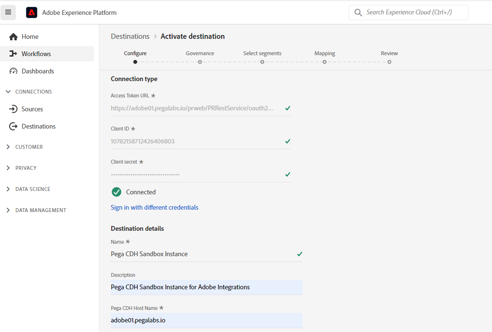
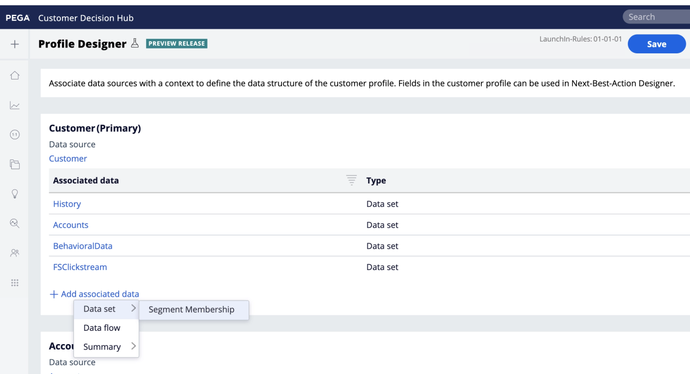

# Pega Customer Decision Hub-Verbindung

## Übersicht {#overview}

Verwenden Sie die [!DNL Pega Customer Decision Hub] Ziel in Adobe Experience Platform zum Senden von Profilattributen und Segmentmitgliedsdaten an [!DNL Pega Customer Decision Hub] für die Entscheidungsfindung für die nächste beste Aktion.

Mitgliedschaft in Profilsegmenten aus Adobe Experience Platform beim Laden in [!DNL Pega Customer Decision Hub], kann als Prädikator in adaptiven Modellen verwendet werden und dazu beitragen, die richtigen kontextuellen und Verhaltensdaten für Entscheidungszwecke mit der nächsten besten Aktion bereitzustellen.

>[!IMPORTANT]
>
>Diese Dokumentationsseite wurde von Pegasystems erstellt. Bei Fragen oder Aktualisierungsanfragen wenden Sie sich bitte direkt an Pega [here](mailto:support@pega.com).

## Anwendungsbeispiele

Um Ihnen zu helfen, besser zu verstehen, wie und wann Sie die [!DNL Customer Decision Hub] Ziel, hier finden Sie Beispielanwendungsfälle, die Adobe Experience Platform-Kunden mit diesem Ziel lösen können.

### Telekommunikation

Ein Marketing-Experte möchte Einblicke aus datenwissenschaftlichen Modellen basierenden nächsten Best-Action nutzen, die von [!DNL Pega Customer Decision Hub] für Kundeninteraktion. [!DNL Pega Customer Decision Hub] ist stark von der Kundenabsicht abhängig, z. B. &quot;Interessant_In_5G&quot;, &quot;Interessant_in_Unlimited_Dataplan&quot;oder &quot;Interesse_in_iPhone_Zubehör&quot;.

### Finanz-Services

Ein Marketing-Experte möchte die Angebote für Kunden optimieren, die Newsletter im Pensionsplan oder Pensionsplan abonniert oder abbestellt haben. Finanzdienstleistungsunternehmen können mehrere Kunden-IDs aus ihren eigenen CRMs in Adobe Experience Platform erfassen, Segmente aus ihren eigenen Offline-Daten erstellen und Profile senden, die die Segmente aufrufen und beenden, an . [!DNL Pega Customer Decision Hub] für die Entscheidungsfindung über die nächste beste Aktion (NBA) in ausgehenden Kanälen.

## Voraussetzungen {#prerequisites}

Bevor Sie mit diesem Ziel Daten aus Adobe Experience Platform exportieren können, müssen Sie die folgenden Voraussetzungen erfüllen in [!DNL Pega Customer Decision Hub]:

* Konfigurieren Sie die [Integrationskomponente für Adobe Experience Platform-Profil und Segmentzugehörigkeit](https://docs.pega.com/component/customer-decision-hub/adobe-experience-platform-profile-and-segment-membership-integration-component) in [!DNL Pega Customer Decision Hub] -Instanz.
* Konfigurieren von OAuth 2.0 [Client-Registrierung mithilfe von Client-Anmeldeinformationen](https://docs.pega.com/security/87/creating-and-configuring-oauth-20-client-registration) Grant-Typ in Ihrer [!DNL Pega Customer Decision Hub] -Instanz.
* Konfigurieren [Datenfluss bei Echtzeit-Ausführung](https://docs.pega.com/decision-management/87/creating-real-time-run-data-flows) für den Datenfluss der Segmentzugehörigkeit in Ihrer Adobe [!DNL Pega Customer Decision Hub] -Instanz.

## Unterstützte Identitäten {#supported-identities}

[!DNL Pega Customer Decision Hub] unterstützt die Aktivierung von benutzerdefinierten Benutzer-IDs, die in der folgenden Tabelle beschrieben sind. Weitere Informationen finden Sie unter [identities](/help/identity-service/namespaces.md).

| Zielgruppenidentität | Beschreibung |
|---|---|
| *CustomerID* | Allgemeine Benutzer-ID, die ein Profil eindeutig in [!DNL Pega Customer Decision Hub] und Adobe Experience Platform |

{style=&quot;table-layout:auto&quot;}

## Exportart und -frequenz {#export-type-frequency}

Informationen zum Zielexporttyp und zur Häufigkeit finden Sie in der unten stehenden Tabelle.

| Element | Typ | Anmerkungen |
---------|----------|---------|
| Exporttyp | **[!UICONTROL Profilbasiert]** | Exportieren Sie alle Mitglieder eines Segments mit Kennung (*CustomerID*), Attributen (Nachname, Vorname, Ort usw.) und Segmentzugehörigkeitsdaten. |
| Exporthäufigkeit | **[!UICONTROL Streaming]** | Streaming-Ziele sind immer auf API-basierten Verbindungen basiert. Sobald ein Profil in Experience Platform basierend auf der Segmentbewertung aktualisiert wird, sendet der Connector das Update nachgelagert an die Zielplattform. Weitere Informationen finden Sie unter [Streaming-Ziele](/help/destinations/destination-types.md#streaming-destinations). |

{style=&quot;table-layout:auto&quot;}

## Herstellen einer Verbindung mit der Datenbank {#connect}

Um eine Verbindung mit diesem Ziel herzustellen, gehen Sie wie im Abschnitt [Tutorial zur Zielkonfiguration](../../ui/connect-destination.md) beschrieben vor. Füllen Sie im Workflow zum Konfigurieren des Ziels die Felder aus, die in den beiden folgenden Abschnitten aufgeführt sind.

### An Ziel authentifizieren {#authenticate}

#### OAuth 2 Client Credentials authentication {#oauth-2-client-credentials-authentication}

Füllen Sie die Felder unten aus und wählen Sie **[!UICONTROL Mit Ziel verbinden]**:

* **[!UICONTROL Zugriffstoken-URL]**: Die OAuth 2-Zugriffstoken-URL auf Ihrer [!DNL Pega Customer Decision Hub] -Instanz.
* **[!UICONTROL Client-ID]**: OAuth 2 [!DNL client ID] die Sie in Ihrer [!DNL Pega Customer Decision Hub] -Instanz.
* **[!UICONTROL Client Secret]**: OAuth 2 [!DNL client secret] die Sie in Ihrer [!DNL Pega Customer Decision Hub] -Instanz.

### Zieldetails ausfüllen {#destination-details}

Nach dem Einrichten der Authentifizierungsverbindung zum [!DNL Pega Customer Decision Hub]Geben Sie die folgenden Informationen für das Ziel an:

Füllen Sie die erforderlichen Felder aus und wählen Sie **[!UICONTROL Nächste]**.

* **[!UICONTROL Name]**: Ein Name, mit dem Sie dieses Ziel in der Zukunft erkennen werden.
* **[!UICONTROL Beschreibung]**: Eine Beschreibung, die Ihnen dabei hilft, dieses Ziel in der Zukunft zu identifizieren.
* **[!UICONTROL Hostname]**: Der Hostname des Pega Customer Decisioning Hub, in den das Profil als JSON-Daten exportiert wird.

## Aktivieren von Segmenten für dieses Ziel {#activate}

>[!IMPORTANT]
> 
>Um Daten zu aktivieren, benötigen Sie die **[!UICONTROL Ziele verwalten]**, **[!UICONTROL Ziele aktivieren]**, **[!UICONTROL Profile anzeigen]** und **[!UICONTROL Segmente anzeigen]** [Zugriffssteuerungsberechtigungen](/help/access-control/home.md#permissions). Lesen Sie die [Zugriffskontrolle - Übersicht](/help/access-control/ui/overview.md) oder wenden Sie sich an Ihren Produktadministrator, um die erforderlichen Berechtigungen zu erhalten.

Siehe [Aktivieren von Zielgruppendaten für Streaming-Profil-Export-Ziele](../../ui/activate-streaming-profile-destinations.md) für Anweisungen zum Aktivieren von Zielgruppensegmenten für dieses Ziel.

### Zielattribute {#attributes}

Im [[!UICONTROL Attribute auswählen]](../../ui/activate-streaming-profile-destinations.md#select-attributes) in Adobe empfiehlt, eine eindeutige Kennung aus der [Vereinigungsschema](../../../profile/home.md#profile-fragments-and-union-schemas). Wählen Sie die eindeutige Kennung und alle anderen XDM-Felder aus, die Sie an das Ziel exportieren möchten.

### Zuordnungsbeispiel: Aktivieren von Profilaktualisierungen in [!DNL Pega Customer Decision Hub] {#mapping-example}

Nachfolgend finden Sie ein Beispiel für die korrekte Identitätszuordnung beim Export von Profilen in . [!DNL Pega Customer Decision Hub].

Auswählen von Quellfeldern:

* Wählen Sie eine Kennung aus (z. B.: CustomerID) als Quellidentität, die ein Profil in Adobe Experience Platform eindeutig identifiziert und [!DNL Pega Customer Decision Hub].
* Wählen Sie XDM-Quellprofilattributänderungen aus, die exportiert und aktualisiert werden müssen in [!DNL Pega Customer Decision Hub].

Zielgruppenfelder auswählen:

* Wählen Sie die `CustomerID` Namespace als Zielidentität.
* Wählen Sie Zielprofilattributnamen aus, die den entsprechenden XDM-Quellprofilattributen zugeordnet werden müssen.

## Export von Daten/Export validieren {#exported-data}

Bei einer erfolgreichen Aktualisierung der Segmentzugehörigkeit für ein Profil würden die Segmentkennung, der Name und der Status im Datenspeicher zur Pega-Marketing-Segmentmitgliedschaft eingefügt. Die Mitgliedschaftsdaten sind mit einem Kunden verknüpft, der mithilfe des Kundenprofil-Designers in [!DNL Pega Customer Decision Hub], wie unten dargestellt.

Die Daten zur Segmentmitgliedschaft werden in den Interaktionsrichtlinien von Pega Next-Best-Action Designer für die nächste beste Aktion verwendet, wie unten dargestellt.

Die Datenfelder für die Mitgliedschaft in Kundensegmenten werden als Prädikatoren in adaptiven Modellen hinzugefügt, wie unten dargestellt.

## Weitere Ressourcen {#additional-resources}

Siehe [Einrichten einer OAuth 2.0-Client-Registrierung](https://docs.pega.com/security/87/creating-and-configuring-oauth-20-client-registration) in [!DNL Pega Customer Decision Hub].

Siehe [Erstellen einer Echtzeitausführung für Datenflüsse](https://docs.pega.com/decision-management/87/creating-real-time-run-data-flows) in [!DNL Pega Customer Decision Hub].

Siehe [Verwalten von Kundendatensätzen in Customer Profile Designer](https://docs.pega.com/whats-new-pega-platform/manage-customer-records-customer-profile-designer-86).

## Datennutzung und -Governance {#data-usage-governance}

Alle [!DNL Adobe Experience Platform]-Ziele sind bei der Verarbeitung Ihrer Daten mit Datennutzungsrichtlinien konform. Detaillierte Informationen zur [!DNL Adobe Experience Platform] erzwingt Data Governance, siehe [Data Governance - Übersicht](/help/data-governance/home.md).
