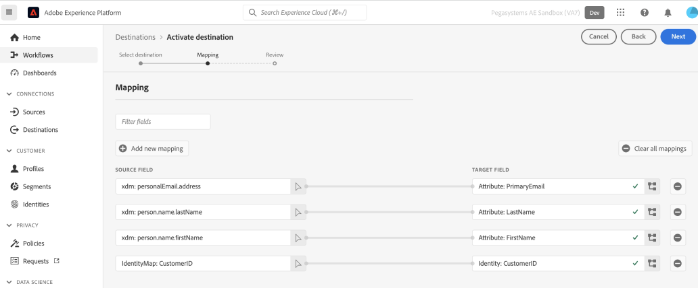

# Pega Customer Decision Hub-Verbindung

## Übersicht {#overview}

Verwenden Sie die [!DNL Pega Customer Decision Hub] Ziel in Adobe Experience Platform zum Senden von Profilattributen und Zielgruppenmitgliedsdaten an [!DNL Pega Customer Decision Hub] für die Entscheidungsfindung für die nächste beste Aktion.

Profil-Zielgruppenmitgliedschaft aus Adobe Experience Platform beim Laden in [!DNL Pega Customer Decision Hub], kann als Prädikator in adaptiven Modellen verwendet werden und dazu beitragen, die richtigen kontextuellen und Verhaltensdaten für Entscheidungszwecke mit der nächsten besten Aktion bereitzustellen.

>[!IMPORTANT]
>
>Diese Dokumentationsseite wurde von Pegasystems erstellt. Bei Fragen oder Aktualisierungsanfragen wenden Sie sich bitte direkt an Pega [here](mailto:support@pega.com).

## Anwendungsfälle

Damit Sie besser verstehen können, wie und wann Sie das [!DNL Customer Decision Hub]-Ziel verwenden sollten, finden Sie hier einige Beispielanwendungsfälle, die Kundinnen und Kunden von Adobe Experience Platform mit diesem Ziel bewältigen können.

### Telekommunikation

Ein Marketing-Experte möchte Einblicke aus datenwissenschaftlichen Modellen basierenden nächsten Best-Action nutzen, die von [!DNL Pega Customer Decision Hub] für Kundeninteraktion. [!DNL Pega Customer Decision Hub] ist stark von der Kundenabsicht abhängig, z. B. &quot;Interessant_In_5G&quot;, &quot;Interessant_in_Unlimited_Dataplan&quot;oder &quot;Interesse_in_iPhone_Zubehör&quot;.

### Finanz-Services

Ein Marketing-Experte möchte die Angebote für Kunden optimieren, die Newsletter im Pensionsplan oder Pensionsplan abonniert oder abbestellt haben. Finanzdienstleistungsunternehmen können mehrere Kunden-IDs aus ihren eigenen CRMs in Adobe Experience Platform erfassen, Zielgruppen aus ihren eigenen Offline-Daten erstellen und Profile senden, die die Zielgruppen aufrufen und verlassen, an [!DNL Pega Customer Decision Hub] für die Entscheidungsfindung über die nächste beste Aktion (NBA) in ausgehenden Kanälen.

## Voraussetzungen {#prerequisites}

Bevor Sie mit diesem Ziel Daten aus Adobe Experience Platform exportieren können, müssen Sie die folgenden Voraussetzungen erfüllen in [!DNL Pega Customer Decision Hub]:

* Konfigurieren Sie die [Komponente zur Integration von Adobe Experience Platform-Profilen und Zielgruppen](https://docs.pega.com/component/customer-decision-hub/adobe-experience-platform-profile-and-segment-membership-integration-component) in [!DNL Pega Customer Decision Hub] -Instanz.
* Konfigurieren von OAuth 2.0 [Client-Registrierung mithilfe von Client-Anmeldeinformationen](https://docs.pega.com/security/87/creating-and-configuring-oauth-20-client-registration) Grant-Typ in Ihrer [!DNL Pega Customer Decision Hub] -Instanz.
* Konfigurieren [Datenfluss bei Echtzeit-Ausführung](https://docs.pega.com/decision-management/87/creating-real-time-run-data-flows) für die Adobe des Datenflusses zur Zielgruppenzugehörigkeit in Ihrer [!DNL Pega Customer Decision Hub] -Instanz.

## Unterstützte Identitäten {#supported-identities}

[!DNL Pega Customer Decision Hub] unterstützt die Aktivierung von benutzerdefinierten Benutzer-IDs, die in der folgenden Tabelle beschrieben sind. Weitere Informationen finden Sie unter [identities](/help/identity-service/namespaces.md).

| Ziel-Identität | Beschreibung |
|---|---|
| *CustomerID* | Allgemeine Benutzer-ID, die ein Profil eindeutig in [!DNL Pega Customer Decision Hub] und Adobe Experience Platform |

{style="table-layout:auto"}

## Exporttyp und -häufigkeit {#export-type-frequency}

Beziehen Sie sich auf die folgende Tabelle, um Informationen zu Typ und Häufigkeit des Zielexports zu erhalten.

| Element | Typ | Anmerkungen |
---------|----------|---------|
| Exporttyp | **[!UICONTROL Profilbasiert]** | Exportieren Sie alle Mitglieder einer Zielgruppe mit Kennung (*CustomerID*), Attributen (Nachname, Vorname, Ort usw.) und Daten zur Zielgruppenzugehörigkeit. |
| Exporthäufigkeit | **[!UICONTROL Streaming]** | Streaming-Ziele sind immer auf API-basierten Verbindungen basiert. Sobald ein Profil in Experience Platform basierend auf der Zielgruppenbewertung aktualisiert wird, sendet der Connector das Update nachgelagert an die Zielplattform. Weitere Informationen finden Sie unter [Streaming-Ziele](/help/destinations/destination-types.md#streaming-destinations). |

{style="table-layout:auto"}

## Herstellen einer Verbindung mit dem Ziel {#connect}

Um eine Verbindung mit diesem Ziel herzustellen, gehen Sie wie im [Tutorial zur Zielkonfiguration](../../ui/connect-destination.md) beschrieben vor. Füllen Sie im Workflow zum Konfigurieren des Ziels die Felder aus, die in den beiden folgenden Abschnitten aufgeführt sind.

### Beim Ziel authentifizieren {#authenticate}

#### Authenifizierung mit Client-Anmeldeinformationen für OAuth 2 {#oauth-2-client-credentials-authentication}

Füllen Sie die Felder unten aus und wählen Sie **[!UICONTROL Mit Ziel verbinden]**:

* **[!UICONTROL Zugriffstoken-URL]**: Die OAuth 2-Zugriffstoken-URL auf Ihrer [!DNL Pega Customer Decision Hub] -Instanz.
* **[!UICONTROL Client-ID]**: OAuth 2 [!DNL client ID] die Sie in Ihrer [!DNL Pega Customer Decision Hub] -Instanz.
* **[!UICONTROL Client Secret]**: OAuth 2 [!DNL client secret] die Sie in Ihrer [!DNL Pega Customer Decision Hub] -Instanz.

### Ausfüllen der Zieldetails {#destination-details}

Nach dem Einrichten der Authentifizierungsverbindung zum [!DNL Pega Customer Decision Hub]Geben Sie die folgenden Informationen für das Ziel an:

Füllen Sie die erforderlichen Felder aus und wählen Sie **[!UICONTROL Nächste]**.

* **[!UICONTROL Name]**: Ein Name, durch den Sie dieses Ziel in Zukunft erkennen können.
* **[!UICONTROL Beschreibung]**: Eine Beschreibung, die Ihnen hilft, dieses Ziel in Zukunft zu identifizieren.
* **[!UICONTROL Hostname]**: Der Hostname des Pega Customer Decisioning Hub, in den das Profil als JSON-Daten exportiert wird.

## Aktivieren von Zielgruppen für dieses Ziel {#activate}

>[!IMPORTANT]
> 
>Um Daten zu aktivieren, benötigen Sie die [Zugriffskontrollberechtigungen](/help/access-control/home.md#permissions) **[!UICONTROL Ziele verwalten]**, **[!UICONTROL Ziele aktivieren]**, **[!UICONTROL Profile anzeigen]** und **[!UICONTROL Segmente anzeigen]**. Lesen Sie die [Übersicht über die Zugriffskontrolle](/help/access-control/ui/overview.md) oder wenden Sie sich an Ihren Produktadministrator, um die erforderlichen Berechtigungen zu erhalten.

Siehe [Aktivieren von Zielgruppendaten für Streaming-Profil-Export-Ziele](../../ui/activate-streaming-profile-destinations.md) für Anweisungen zum Aktivieren von Zielgruppen für dieses Ziel.

### Zielattribute {#attributes}

Im Schritt [[!UICONTROL Attribute auswählen]](../../ui/activate-streaming-profile-destinations.md#select-attributes) empfiehlt Adobe, eine eindeutige Kennung aus Ihrem [Vereinigungsschema](../../../profile/home.md#profile-fragments-and-union-schemas) auszuwählen. Wählen Sie die eindeutige Kennung und alle anderen XDM-Felder aus, die Sie an das Ziel exportieren möchten.

### Zuordnungsbeispiel: Aktivieren von Profilaktualisierungen in [!DNL Pega Customer Decision Hub] {#mapping-example}

Nachfolgend finden Sie ein Beispiel für die korrekte Identitätszuordnung beim Export von Profilen in . [!DNL Pega Customer Decision Hub].

Auswählen von Quellfeldern:

* Wählen Sie eine Kennung aus (z. B.: CustomerID) als Quellidentität, die ein Profil in Adobe Experience Platform eindeutig identifiziert und [!DNL Pega Customer Decision Hub].
* Wählen Sie XDM-Quellprofilattributänderungen aus, die exportiert und aktualisiert werden müssen in [!DNL Pega Customer Decision Hub].

Zielgruppenfelder auswählen:

* Wählen Sie die `CustomerID` Namespace als Zielidentität.
* Wählen Sie Zielprofilattributnamen aus, die den entsprechenden XDM-Quellprofilattributen zugeordnet werden müssen.

## Exportierte Daten/Datenexport validieren {#exported-data}

Bei einer erfolgreichen Aktualisierung der Zielgruppenzugehörigkeit für ein Profil werden die Zielgruppenkennung, der Name und der Status in den Mitgliederdatenspeicher der Pega-Marketing-Zielgruppe eingefügt. Die Mitgliedschaftsdaten sind mit einem Kunden verknüpft, der mithilfe des Kundenprofil-Designers in [!DNL Pega Customer Decision Hub], wie unten dargestellt.

Die Daten zur Zielgruppenzugehörigkeit werden in den Interaktionsrichtlinien von Pega Next-Best-Action Designer für die Entscheidungsfindung nach dem besten Willen verwendet, wie unten dargestellt.

Die Datenfelder für die Mitgliedschaft in einer Zielgruppe für Kunden werden wie unten dargestellt als Prädikatoren in adaptiven Modellen hinzugefügt.

## Zusätzliche Ressourcen {#additional-resources}

Siehe [Einrichten einer OAuth 2.0-Client-Registrierung](https://docs.pega.com/security/87/creating-and-configuring-oauth-20-client-registration) in [!DNL Pega Customer Decision Hub].

Siehe [Erstellen einer Echtzeitausführung für Datenflüsse](https://docs.pega.com/decision-management/87/creating-real-time-run-data-flows) in [!DNL Pega Customer Decision Hub].

Siehe [Verwalten von Kundendatensätzen in Customer Profile Designer](https://docs.pega.com/whats-new-pega-platform/manage-customer-records-customer-profile-designer-86).

## Datennutzung und -Governance {#data-usage-governance}

Alle [!DNL Adobe Experience Platform]-Ziele sind bei der Verarbeitung Ihrer Daten mit Datennutzungsrichtlinien konform. Ausführliche Informationen darüber, wie [!DNL Adobe Experience Platform] Data Governance erzwingt, finden Sie unter [Data Governance – Übersicht](/help/data-governance/home.md).
