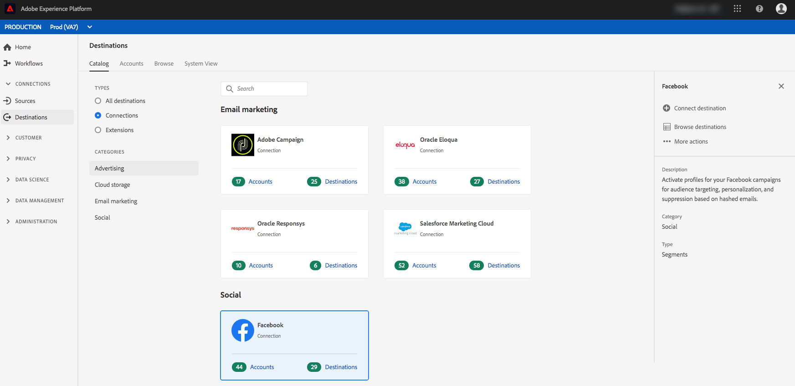
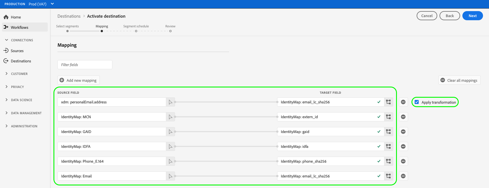

# [!DNL Facebook]-Verbindung

## Übersicht {#overview}

Profile für Ihre [!DNL Facebook] Kampagnen für Zielgruppen-Targeting, Personalisierung und Unterdrückung basierend auf Hash-E-Mails.

Sie können dieses Ziel für Zielgruppen-Targeting über [!DNL Facebook’s] -Familie von Apps, die von [!DNL Custom Audiences], einschließlich [!DNL Facebook], [!DNL Instagram], [!DNL Audience Network]und [!DNL Messenger]. Die Auswahl der App, für die Sie die Kampagne ausführen möchten, wird auf der Platzierungsebene in [!DNL Facebook Ads Manager] angezeigt.

## Anwendungsfälle

So können Sie besser verstehen, wie und wann die Variable [!DNL Facebook] Ziel: Hier finden Sie zwei Beispielanwendungsfälle, die Adobe Experience Platform-Kunden mit dieser Funktion lösen können.

### Anwendungsfall 1

Ein Online-Einzelhändler möchte bestehende Kunden über soziale Plattformen erreichen und ihnen personalisierte Angebote basierend auf ihren bisherigen Bestellungen zeigen. Der Online-Händler kann E-Mail-Adressen aus seinem eigenen CRM-System in Adobe Experience Platform erfassen, Segmente aus eigenen Offline-Daten erstellen und an die [!DNL Facebook] Social-Plattform zur Optimierung ihrer Werbeausgaben.

### Anwendungsfall 2

Eine Fluggesellschaft hat verschiedene Kundenstufen (Bronze, Silber und Gold) und möchte über soziale Plattformen für jede dieser Ebenen personalisierte Angebote bereitstellen. Es wird jedoch nicht von allen Kunden die App der Fluglinie verwendet, und einige von ihnen haben sich nicht bei der Website des Unternehmens angemeldet. Die einzigen Identifikatoren, die das Unternehmen über diese Kunden hat, sind Mitgliedschafts-IDs und E-Mail-Adressen.

Um sie über soziale Netzwerke hinweg anzusprechen, können sie die Kundendaten aus ihrem CRM-System in Adobe Experience Platform integrieren und dabei die E-Mail-Adressen als Kennungen verwenden.

Als Nächstes können sie ihre Offline-Daten einschließlich der zugehörigen Mitgliedschafts-IDs und Kundenebenen verwenden, um neue Zielgruppensegmente zu erstellen, die sie über die [!DNL Facebook] Ziel.

## Unterstützte Identitäten {#supported-identities}

[!DNL Facebook Custom Audiences] unterstützt die Aktualisierung von Identitäten, die in der folgenden Tabelle beschrieben werden. Erhalten Sie weitere Informationen zu [Identitäten](/help/identity-service/namespaces.md).

| Ziel-Identität | Beschreibung | Zu beachten |
|---|---|---|
| GAID | Google Advertising ID | Wählen Sie die GAID-Zielidentität aus, wenn Ihre Quellidentität ein GAID-Namespace ist. |
| IDFA | Apple ID für Advertiser | Wählen Sie die IDFA-Zielidentität aus, wenn Ihre Quellidentität ein IDFA-Namespace ist. |
| phone_sha256 | Telefonnummern, die mit dem SHA256-Algorithmus gehasht wurden | Sowohl einfache als auch SHA256-Hash-Telefonnummern werden von Adobe Experience Platform unterstützt. Befolgen Sie die Anweisungen im Abschnitt [Anforderungen an die ID-Übereinstimmung](#id-matching-requirements-id-matching-requirements) und verwenden Sie die entsprechenden Namespaces für Klartext- bzw. Hash-Telefonnummern. Wenn Ihr Quellfeld ungehashte Attribute enthält, überprüfen Sie die **[!UICONTROL Umwandlung anwenden]** -Option, um [!DNL Platform] die Daten bei Aktivierung automatisch hash. |
| email_lc_sha256 | E-Mail-Adressen, die mit dem SHA-256-Algorithmus gehasht wurden | Sowohl Nur-Text- als auch SHA256-Hash-E-Mail-Adressen werden von Adobe Experience Platform unterstützt. Befolgen Sie die Anweisungen im Abschnitt [Anforderungen an die ID-Übereinstimmung](#id-matching-requirements-id-matching-requirements) und verwenden Sie die entsprechenden Namespaces für Nur-Text- bzw. Hash-E-Mail-Adressen. Wenn Ihr Quellfeld ungehashte Attribute enthält, überprüfen Sie die **[!UICONTROL Umwandlung anwenden]** -Option, um [!DNL Platform] die Daten bei Aktivierung automatisch hash. |
| extern_id | Benutzerdefinierte Benutzer-IDs | Wählen Sie diese Zielidentität aus, wenn Ihre Quellidentität ein benutzerdefinierter Namespace ist. |

## Exporttyp und -häufigkeit {#export-type-frequency}

Beziehen Sie sich auf die folgende Tabelle, um Informationen zu Typ und Häufigkeit des Zielexports zu erhalten.

| Element | Typ | Anmerkungen |
---------|----------|---------|
| Exporttyp | **[!UICONTROL Segmentexport]** | Sie exportieren alle Mitglieder eines Segments (Zielgruppe) mit den IDs (Name, Telefonnummer oder andere), die im Facebook-Ziel verwendet werden. |
| Exporthäufigkeit | **[!UICONTROL Streaming]** | Streaming-Ziele sind „immer verfügbare“ API-basierte Verbindungen. Sobald ein Profil in Experience Platform auf der Grundlage einer Segmentbewertung aktualisiert wird, sendet der Connector das Update nachgelagert an die Zielplattform. Lesen Sie mehr über [Streaming-Ziele](/help/destinations/destination-types.md#streaming-destinations). |

{style="table-layout:auto"}

## Voraussetzungen für facebook-Konten {#facebook-account-prerequisites}

Bevor Sie Zielgruppensegmente an [!DNL Facebook] senden können, müssen Sie sicherstellen, dass Sie die folgenden Voraussetzungen erfüllen:

* Ihre [!DNL Facebook] Das Benutzerkonto muss über Folgendes verfügen: **[!DNL Manage campaigns]** -Berechtigung für das Werbekonto aktiviert wurde, das Sie verwenden möchten.
* Die **Adobe Experience Cloud** Geschäftskonto muss als Werbepartner in Ihrem [!DNL Facebook Ad Account]. Verwenden Sie `business ID=206617933627973`. Siehe [Partner zu Ihrem Business Manager hinzufügen](https://www.facebook.com/business/help/1717412048538897) in der Dokumentation zu Facebook .
   >[!IMPORTANT]
   >
   > Beim Konfigurieren der Berechtigungen für Adobe Experience Cloud müssen Sie die Berechtigung **Kampagnen verwalten** aktivieren. Die Berechtigung ist für die [!DNL Adobe Experience Platform] Integration.
* Lesen und unterschreiben Sie die [!DNL Facebook Custom Audiences]-Nutzungsbedingungen. Gehen Sie dazu zu `https://business.facebook.com/ads/manage/customaudiences/tos/?act=[accountID]`, wobei `accountID` ist [!DNL Facebook Ad Account ID].
   >[!IMPORTANT]
   >
   >Beim Signieren der [!DNL Facebook Custom Audiences] Achten Sie darauf, dasselbe Benutzerkonto zu verwenden, das Sie für die Authentifizierung in der Facebook-API verwendet haben.

## Anforderungen an die ID-Übereinstimmung {#id-matching-requirements}

[!DNL Facebook] erfordert, dass keine personenbezogenen Daten (PII) klar übermittelt werden. Daher werden die Zielgruppen für [!DNL Facebook] kann deaktiviert werden *Hash* Kennungen wie E-Mail-Adressen oder Telefonnummern.

Abhängig vom Typ der IDs, die Sie in Adobe Experience Platform erfassen, müssen Sie die entsprechenden Anforderungen erfüllen.

## Hash-Anforderungen für Telefonnummern {#phone-number-hashing-requirements}

Es gibt zwei Methoden zum Aktivieren von Telefonnummern in [!DNL Facebook]:

* **Rohe Telefonnummern erfassen**: Sie können rohe Telefonnummern in der [!DNL E.164] in [!DNL Platform]. Sie sind bei Aktivierung automatisch gehasht. Wenn Sie diese Option wählen, achten Sie darauf, Ihre rohen Telefonnummern immer in die `Phone_E.164` Namespace.
* **Hash-Telefonnummern erfassen**: Sie können Ihre Telefonnummern vor der Erfassung in [!DNL Platform]. Wenn Sie diese Option wählen, achten Sie darauf, Ihre Hash-Telefonnummern immer in die `Phone_SHA256` Namespace.

>[!NOTE]
>
>Telefonnummern, die in die `Phone` Namespace kann nicht in aktiviert werden [!DNL Facebook].

## Anforderungen an das E-Mail-Hashing {#email-hashing-requirements}

Sie können E-Mail-Adressen hash, bevor Sie sie in Adobe Experience Platform aufnehmen, oder eindeutige E-Mail-Adressen in Experience Platform verwenden und [!DNL Platform] Hash sie bei Aktivierung.

Informationen zur Aufnahme von E-Mail-Adressen in Experience Platform finden Sie in der [Batch-Erfassung - Übersicht](/help/ingestion/batch-ingestion/overview.md) und [Streaming-Erfassung - Übersicht](/help/ingestion/streaming-ingestion/overview.md).

Wenn Sie die E-Mail-Adressen selbst hash möchten, stellen Sie sicher, dass Sie die folgenden Anforderungen erfüllen:

* Entfernen Sie alle Leerzeichen am Anfang und am Ende der E-Mail-Zeichenfolge. Beispiel: `johndoe@example.com`, nicht `<space>johndoe@example.com<space>`;
* Achten Sie beim Hashing der E-Mail-Zeichenfolgen darauf, die Zeichenfolge in Kleinbuchstaben zu hash;
   * Beispiel: `example@email.com`, nicht `EXAMPLE@EMAIL.COM`;
* Stellen Sie sicher, dass der Hash-String nur in Kleinbuchstaben geschrieben wird.
   * Beispiel: `55e79200c1635b37ad31a378c39feb12f120f116625093a19bc32fff15041149`, nicht `55E79200C1635B37AD31A378C39FEB12F120F116625093A19bC32FFF15041149`;
* Salz die Zeichenfolge nicht.

>[!NOTE]
>
>Daten aus nicht gehashten Namespaces werden automatisch von [!DNL Platform] bei Aktivierung.
> Attributquellendaten werden nicht automatisch gehasht. Wenn Ihr Quellfeld ungehashte Attribute enthält, überprüfen Sie die **[!UICONTROL Umwandlung anwenden]** -Option, um [!DNL Platform] die Daten bei Aktivierung automatisch hash.
> Die **[!UICONTROL Umwandlung anwenden]** wird nur angezeigt, wenn Sie Attribute als Quellfelder auswählen. Es wird nicht angezeigt, wenn Sie Namespaces auswählen.

## Verwenden benutzerdefinierter Namespaces {#custom-namespaces}

Bevor Sie die `Extern_ID` Namespace zum Senden von Daten an [!DNL Facebook], stellen Sie sicher, dass Sie Ihre eigenen Kennungen mit [!DNL Facebook Pixel]. Siehe [Offizielle Dokumentation zu facebook](https://developers.facebook.com/docs/marketing-api/audiences/guides/custom-audiences/#external_identifiers) für detaillierte Informationen.

## Herstellen einer Verbindung mit dem Ziel {#connect}

>[!IMPORTANT]
> 
>Um eine Verbindung zum Ziel herzustellen, benötigen Sie die [Zugriffsberechtigung](/help/access-control/home.md#permissions) **[!UICONTROL Ziele verwalten]**. Lesen Sie die [Zugriffskontrolle – Übersicht](/help/access-control/ui/overview.md) oder wenden Sie sich an Ihren Produktadministrator, um die erforderlichen Berechtigungen zu erhalten.

Um eine Verbindung mit diesem Ziel herzustellen, gehen Sie wie im [Tutorial zur Zielkonfiguration](../../ui/connect-destination.md) beschrieben vor. Füllen Sie im Workflow zum Konfigurieren des Ziels die Felder aus, die in den beiden folgenden Abschnitten aufgeführt sind.

Das folgende Video zeigt auch die Schritte zum Konfigurieren eines [!DNL Facebook] Zielgruppen und Aktivieren von Segmenten.

>[!VIDEO](https://video.tv.adobe.com/v/332599/?quality=12&learn=on&captions=eng)

>[!NOTE]
>
>Die Benutzeroberfläche von Experience Platform wird häufig aktualisiert und kann sich seit der Aufzeichnung dieses Videos geändert haben. Die aktuellsten Informationen finden Sie im Abschnitt [Tutorial zur Zielkonfiguration](../../ui/connect-destination.md).

### Beim Ziel authentifizieren {#authenticate}

1. Suchen Sie das Facebook-Ziel im Zielkatalog und wählen Sie **[!UICONTROL Einrichten]**.
2. Auswählen **[!UICONTROL Mit Ziel verbinden]**.
   
3. Geben Sie Ihre Facebook-Anmeldedaten ein und wählen Sie **Anmelden**.

### Ausfüllen der Zieldetails {#destination-details}

>[!CONTEXTUALHELP]
>id="platform_destinations_connect_facebook_accountid"
>title="Konto-ID"
>abstract="Ihre Facebook-Werbekonto-ID. Diese ID finden Sie im Facebook-Werbeanzeigenmanager-Konto. Stellen Sie bei der Eingabe dieser ID immer das Präfix `act_` voran."

Füllen Sie die folgenden erforderlichen und optionalen Felder aus, um Details für das Ziel zu konfigurieren. Ein Sternchen neben einem Feld in der Benutzeroberfläche zeigt an, dass das Feld erforderlich ist.

* **[!UICONTROL Name]**: Ein Name, durch den Sie dieses Ziel in Zukunft erkennen können.
* **[!UICONTROL Beschreibung]**: Eine Beschreibung, die Ihnen hilft, dieses Ziel in Zukunft zu identifizieren.
* **[!UICONTROL Konto-ID]**: Ihre [!DNL Facebook Ad Account ID]. Diese ID finden Sie in Ihrer [!DNL Facebook Ads Manager] -Konto. Stellen Sie bei der Eingabe dieser ID immer das Präfix `act_` voran.

### Aktivieren von Warnhinweisen {#enable-alerts}

Sie können Warnhinweise aktivieren, um Benachrichtigungen zum Status des Datenflusses zu Ihrem Ziel zu erhalten. Wählen Sie einen Warnhinweis aus der zu abonnierenden Liste aus, um Benachrichtigungen über den Status Ihres Datenflusses zu erhalten. Weitere Informationen zu Warnhinweisen finden Sie im Handbuch zum [Abonnieren von Zielwarnhinweisen über die Benutzeroberfläche](../../ui/alerts.md).

Wenn Sie mit dem Eingeben der Details für Ihre Zielverbindung fertig sind, klicken Sie auf **[!UICONTROL Weiter]**.

## Aktivieren von Segmenten für dieses Ziel {#activate}

>[!CONTEXTUALHELP]
>id="platform_destinations_activate_facebook_originofaudience"
>title="Ursprung der Zielgruppe"
>abstract="Wählen Sie aus, wie die Kundendaten im Segment ursprünglich erfasst wurden. Die Daten werden in Facebook angezeigt, wenn ein Benutzer bzw. eine Benutzerin in die Zielgruppe des Segments fällt"

>[!CONTEXTUALHELP]
>id="platform_destinations_activate_facebook_originofaudience_customers"
>title="Ursprung der Zielgruppe"
>abstract="Werbetreibende erfassten Daten direkt bei ihren Kundinnen und Kunden."

>[!CONTEXTUALHELP]
>id="platform_destinations_activate_facebook_originofaudience_partners"
>title="Ursprung der Zielgruppe"
>abstract="Werbetreibende erfassten Daten direkt bei ihren Partnerinnen und Partnern."

>[!CONTEXTUALHELP]
>id="platform_destinations_activate_facebook_originofaudience_customersandpartners"
>title="Ursprung der Zielgruppe"
>abstract="Werbetreibende erfassten Daten direkt bei ihren Kundinnen, Kunden, Partnerinnen und Partnern."

>[!IMPORTANT]
> 
>Um Daten zu aktivieren, benötigen Sie die [Zugriffskontrollberechtigungen](/help/access-control/home.md#permissions) **[!UICONTROL Ziele verwalten]**, **[!UICONTROL Ziele aktivieren]**, **[!UICONTROL Profile anzeigen]** und **[!UICONTROL Segmente anzeigen]**. Lesen Sie die [Übersicht über die Zugriffskontrolle](/help/access-control/ui/overview.md) oder wenden Sie sich an Ihren Produktadministrator, um die erforderlichen Berechtigungen zu erhalten.

Anweisungen zum Aktivieren von Zielgruppensegmenten für dieses Ziel finden Sie unter [Aktivieren von Zielgruppendaten für Streaming-Segmentexportziele](../../ui/activate-segment-streaming-destinations.md).

Im **[!UICONTROL Segmentplan]** Schritt, müssen Sie die [!UICONTROL Ursprung der Zielgruppe] beim Senden von Segmenten an [!DNL Facebook Custom Audiences].

### Zuordnungsbeispiel: Aktivieren von Zielgruppendaten in [!DNL Facebook Custom Audience] {#example-facebook}

Nachfolgend finden Sie ein Beispiel für die korrekte Identitätszuordnung bei der Aktivierung von Zielgruppendaten in [!DNL Facebook Custom Audience].

Auswählen von Quellfeldern:

* Wählen Sie die `Email` Namespace als Quellidentität verwenden, wenn die von Ihnen verwendeten E-Mail-Adressen nicht gehasht sind.
* Wählen Sie die `Email_LC_SHA256` Namespace als Quellidentität verwenden, wenn Sie bei der Datenerfassung in einen Hash-Wert für E-Mail-Adressen von Kunden [!DNL Platform]gemäß [!DNL Facebook] [Anforderungen an das E-Mail-Hashing](#email-hashing-requirements).
* Wählen Sie die `PHONE_E.164` Namespace als Quellkennung verwenden, wenn Ihre Daten aus nicht gehashten Telefonnummern bestehen. [!DNL Platform] Hash die Telefonnummern, um die [!DNL Facebook] Anforderungen.
* Wählen Sie die `Phone_SHA256` Namespace als Quellidentität, wenn Sie bei der Datenerfassung in [!DNL Platform]gemäß [!DNL Facebook] [Hash-Anforderungen für Telefonnummern](#phone-number-hashing-requirements).
* Wählen Sie die `IDFA` Namespace als Quellidentität, wenn Ihre Daten aus [!DNL Apple] Geräte-IDs.
* Wählen Sie die `GAID` Namespace als Quellidentität, wenn Ihre Daten aus [!DNL Android] Geräte-IDs.
* Wählen Sie die `Custom` Namespace als Quellidentität verwenden, wenn Ihre Daten aus einem anderen Kennungstyp bestehen.

Zielgruppenfelder auswählen:

* Wählen Sie die `Email_LC_SHA256` Namespace als Zielidentität verwenden, wenn Ihre Quell-Namespaces `Email` oder `Email_LC_SHA256`.
* Wählen Sie die `Phone_SHA256` Namespace als Zielidentität verwenden, wenn Ihre Quell-Namespaces `PHONE_E.164` oder `Phone_SHA256`.
* Wählen Sie die `IDFA` oder `GAID` Namespaces als Zielidentität verwenden, wenn Ihre Quell-Namespaces `IDFA` oder `GAID`.
* Wählen Sie die `Extern_ID` Namespace als Zielidentität verwenden, wenn Ihr Quell-Namespace ein benutzerdefinierter ist.

>[!IMPORTANT]
>
>Daten aus nicht gehashten Namespaces werden automatisch von [!DNL Platform] bei Aktivierung.
> 
>Attributquellendaten werden nicht automatisch gehasht. Wenn Ihr Quellfeld ungehashte Attribute enthält, überprüfen Sie die **[!UICONTROL Umwandlung anwenden]** -Option, um [!DNL Platform] die Daten bei Aktivierung automatisch hash.

## Exportierte Daten {#exported-data}

Für [!DNL Facebook], bedeutet eine erfolgreiche Aktivierung, dass eine [!DNL Facebook] eine benutzerdefinierte Zielgruppe wird programmgesteuert in [[!DNL Facebook Ads Manager]](https://www.facebook.com/adsmanager/manage/). Segmentmitgliedschaft in der Zielgruppe wird hinzugefügt und entfernt, wenn Anwender für die aktivierten Segmente qualifiziert oder disqualifiziert werden.

>[!TIP]
>
>Die Integration zwischen Adobe Experience Platform und [!DNL Facebook] unterstützt historische Zielgruppen-Backups. Alle historischen Segmentqualifikationen werden an gesendet. [!DNL Facebook] wenn Sie die Segmente für das Ziel aktivieren.

## Fehlerbehebung {#troubleshooting}

### 400 Fehlermeldung &quot;Bad Request&quot; {#bad-request}

Beim Konfigurieren dieses Ziels wird möglicherweise der folgende Fehler angezeigt:

`{"message":"Facebook Error: Permission error","code":"400 BAD_REQUEST"}`

Dieser Fehler tritt auf, wenn Kunden neu erstellte Konten verwenden und die [!DNL Facebook] -Berechtigungen sind noch nicht aktiv.

Wenn Sie die `400 Bad Request` Fehlermeldung nach dem Ausführen der Schritte unter [Voraussetzungen für facebook-Konten](#facebook-account-prerequisites), erlauben Sie bitte einige Tage für die [!DNL Facebook] -Berechtigungen in Kraft treten.
