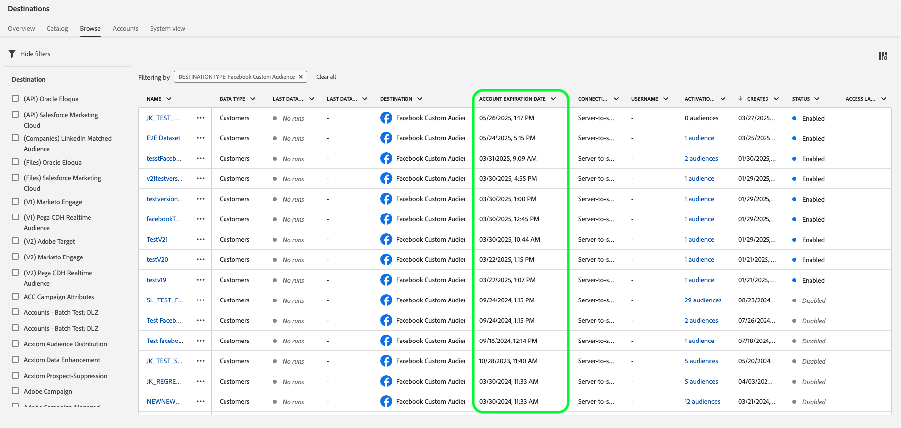

# [!DNL Facebook]-Verbindung

## Übersicht {#overview}

Aktivieren Sie Profile für Ihre [!DNL Facebook] Kampagnen zum Zielgruppen-Targeting, zur Personalisierung und zur Unterdrückung auf der Grundlage von gehashten E-Mails.

Sie können dieses Ziel für das Audience-Targeting in [!DNL Facebook's] Familie von Apps verwenden, die von [!DNL Custom Audiences] unterstützt werden, einschließlich [!DNL Facebook], [!DNL Instagram], [!DNL Audience Network] und [!DNL Messenger]. Die Auswahl der App, für die Sie eine Kampagne ausführen möchten, wird auf der Platzierungsebene in [!DNL Facebook Ads Manager] angezeigt.

## Anwendungsfälle

Damit Sie besser verstehen können, wie und wann Sie das [!DNL Facebook]-Ziel verwenden, finden Sie hier zwei Beispielanwendungsfälle, die Kundinnen und Kunden von Adobe Experience Platform mit dieser Funktion bewältigen können.

### Anwendungsfall #1

Ein Online-retailer möchte bestehende Kunden über soziale Plattformen erreichen und ihnen personalisierte Angebote auf der Grundlage ihrer vorherigen Bestellungen zeigen. Der Online-retailer kann E-Mail-Adressen aus dem eigenen CRM in Adobe Experience Platform aufnehmen, Zielgruppen aus eigenen Offline-Daten erstellen und diese Zielgruppen an die [!DNL Facebook] Social-Media-Plattform senden, wodurch die Werbeausgaben optimiert werden.

### Anwendungsfall #2

Eine Fluggesellschaft hat verschiedene Kundenstufen (Bronze, Silber und Gold) und möchte jeder dieser Stufen über soziale Plattformen personalisierte Angebote bieten. Allerdings nutzen nicht alle Kunden die Mobile App der Fluggesellschaft, und einige von ihnen haben sich nicht auf der Website des Unternehmens angemeldet. Die einzigen Kennungen, die das Unternehmen zu diesen Kunden hat, sind Mitgliedschafts-IDs und E-Mail-Adressen.

Um sie in Social Media als Zielgruppe anzusprechen, können sie die Kundendaten aus ihrem CRM in Adobe Experience Platform integrieren und die E-Mail-Adressen als Kennungen verwenden.

Als Nächstes können sie ihre Offline-Daten einschließlich der zugehörigen Mitgliedschafts-IDs und Kundenebenen verwenden, um neue Zielgruppen zu erstellen, die sie über das [!DNL Facebook] Ziel ansprechen können.

## Unterstützte Identitäten {#supported-identities}

[!DNL Facebook Custom Audiences] unterstützt die Aktivierung von Identitäten, die in der folgenden Tabelle beschrieben sind. Erhalten Sie weitere Informationen zu [Identitäten](/help/identity-service/features/namespaces.md).

| Ziel-Identität | Beschreibung | Zu beachten |
|---|---|---|
| `GAID` | GOOGLE ADVERTISING ID | Wählen Sie die GAID-Zielidentität aus, wenn Ihre Quellidentität ein GAID-Namespace ist. |
| `IDFA` | Apple-ID für Werbetreibende | Wählen Sie die IDFA-Zielidentität aus, wenn Ihre Quellidentität ein IDFA-Namespace ist. |
| `phone_sha256` | Telefonnummern, die mit dem SHA256-Algorithmus gehasht wurden | Es werden sowohl einfache als auch SHA256-Hash-Telefonnummern von Adobe Experience Platform unterstützt. Befolgen Sie die Anweisungen im Abschnitt [ID-](#id-matching-requirements-id-matching-requirements)-Anforderungen“ und verwenden Sie die entsprechenden Namespaces für Nur-Text- bzw. Hash-Telefonnummern. Wenn Ihr Quellfeld ungehashte Attribute enthält, überprüfen Sie die Option **[!UICONTROL Umwandlung anwenden]**, damit [!DNL Experience Platform] die Daten bei Aktivierung automatisch hasht. |
| `email_lc_sha256` | E-Mail-Adressen, die mit dem SHA-256-Algorithmus gehasht wurden | Es werden sowohl Nur-Text- als auch SHA256-Hash-E-Mail-Adressen von Adobe Experience Platform unterstützt. Befolgen Sie die Anweisungen im Abschnitt [ID-](#id-matching-requirements-id-matching-requirements)-Anforderungen“ und verwenden Sie die entsprechenden Namespaces für Nur-Text- bzw. Hash-E-Mail-Adressen. Wenn Ihr Quellfeld ungehashte Attribute enthält, überprüfen Sie die Option **[!UICONTROL Umwandlung anwenden]**, damit [!DNL Experience Platform] die Daten bei Aktivierung automatisch hasht. |
| `extern_id` | Benutzerdefinierte Benutzer-IDs | Wählen Sie diese Zielidentität aus, wenn Ihre Quellidentität ein benutzerdefinierter Namespace ist. |
| `gender` | Geschlecht | Akzeptierte Werte: <ul><li>`m` für Männer</li><li>`f` für Frauen</li></ul> Experience Platform **hasht** diesen Wert automatisch, bevor er an Facebook gesendet wird. Dieser automatische Hashing ist erforderlich, um die Sicherheits- und Datenschutzanforderungen von Facebook zu erfüllen. Geben **nicht** vorab gehashte Werte für dieses Feld an, da dies dazu führt, dass der Abgleichsprozess fehlschlägt. |
| `date_of_birth` | Date of birth | Akzeptiertes Format: `yyyy-MM-DD`.  Experience Platform **hasht** diesen Wert, bevor er an Facebook gesendet wird. Dieser automatische Hashing ist erforderlich, um die Sicherheits- und Datenschutzanforderungen von Facebook zu erfüllen. Geben **nicht** vorab gehashte Werte für dieses Feld an, da dies dazu führt, dass der Abgleichsprozess fehlschlägt. |
| `last_name` | Last name | Akzeptiertes Format: Kleinbuchstaben, nur `a-z` Zeichen, keine Satzzeichen. Verwenden Sie UTF-8-Codierung für Sonderzeichen.   Experience Platform **hasht** diesen Wert, bevor er an Facebook gesendet wird. Dieser automatische Hashing ist erforderlich, um die Sicherheits- und Datenschutzanforderungen von Facebook zu erfüllen. Geben **nicht** vorab gehashte Werte für dieses Feld an, da dies dazu führt, dass der Abgleichsprozess fehlschlägt. |
| `first_name` | Vorname | Akzeptiertes Format: Kleinbuchstaben, nur `a-z` Zeichen, keine Satzzeichen, keine Leerzeichen. Verwenden Sie UTF-8-Codierung für Sonderzeichen.   Experience Platform **hasht** diesen Wert, bevor er an Facebook gesendet wird. Dieser automatische Hashing ist erforderlich, um die Sicherheits- und Datenschutzanforderungen von Facebook zu erfüllen. Geben **nicht** vorab gehashte Werte für dieses Feld an, da dies dazu führt, dass der Abgleichsprozess fehlschlägt. |
| `first_name_initial` | Vorname (anfänglich) | Akzeptiertes Format: Kleinbuchstaben, nur `a-z` Zeichen. Verwenden Sie UTF-8-Codierung für Sonderzeichen.   Experience Platform **hasht** diesen Wert, bevor er an Facebook gesendet wird. Dieser automatische Hashing ist erforderlich, um die Sicherheits- und Datenschutzanforderungen von Facebook zu erfüllen. Geben **nicht** vorab gehashte Werte für dieses Feld an, da dies dazu führt, dass der Abgleichsprozess fehlschlägt. |
| `state` | Land | Verwenden Sie den [2-stelligen ANSI-Abkürzungscode](https://en.wikipedia.org/wiki/Federal_Information_Processing_Standard_state_code) in Kleinbuchstaben. Verwenden Sie für Nicht-US-Bundesstaaten Kleinbuchstaben, keine Satzzeichen, keine Sonderzeichen und keine Leerzeichen.   Experience Platform **hasht** diesen Wert, bevor er an Facebook gesendet wird. Dieser automatische Hashing ist erforderlich, um die Sicherheits- und Datenschutzanforderungen von Facebook zu erfüllen. Geben **nicht** vorab gehashte Werte für dieses Feld an, da dies dazu führt, dass der Abgleichsprozess fehlschlägt. |
| `city` | Stadt | Akzeptiertes Format: Kleinbuchstaben, nur `a-z` Zeichen, keine Satzzeichen, keine Sonderzeichen, keine Leerzeichen.   Experience Platform **hasht** diesen Wert, bevor er an Facebook gesendet wird. Dieser automatische Hashing ist erforderlich, um die Sicherheits- und Datenschutzanforderungen von Facebook zu erfüllen. Geben **nicht** vorab gehashte Werte für dieses Feld an, da dies dazu führt, dass der Abgleichsprozess fehlschlägt. |
| `zip` | Postleitzahl | Akzeptiertes Format: Kleinbuchstaben, keine Leerzeichen. Verwenden Sie für US-Postleitzahlen nur die ersten 5 Ziffern. Für Großbritannien verwenden Sie das `Area/District/Sector`.   Experience Platform **hasht** diesen Wert, bevor er an Facebook gesendet wird. Dieser automatische Hashing ist erforderlich, um die Sicherheits- und Datenschutzanforderungen von Facebook zu erfüllen. Geben **nicht** vorab gehashte Werte für dieses Feld an, da dies dazu führt, dass der Abgleichsprozess fehlschlägt. |
| `country` | Land | Akzeptiertes Format: Kleinbuchstaben, 2-Buchstaben-Ländercodes im [ISO 3166-1 alpha-2](https://en.wikipedia.org/wiki/ISO_3166-1_alpha-2)-Format.   Experience Platform **hasht** diesen Wert, bevor er an Facebook gesendet wird. Dieser automatische Hashing ist erforderlich, um die Sicherheits- und Datenschutzanforderungen von Facebook zu erfüllen. Geben **nicht** vorab gehashte Werte für dieses Feld an, da dies dazu führt, dass der Abgleichsprozess fehlschlägt. |

## Unterstützte Zielgruppen {#supported-audiences}

In diesem Abschnitt wird beschrieben, welche Arten von Zielgruppen Sie an dieses Ziel exportieren können.

| Zielgruppenherkunft | Unterstützt | Beschreibung |
|---------|----------|----------|
| [!DNL Segmentation Service] | ✓ | Zielgruppen, die über den Experience Platform-[ (Segmentierungs-Service) generiert ](../../../segmentation/home.md). |
| Benutzerdefinierte Uploads | ✓ | Zielgruppen, die aus CSV-Dateien in Experience Platform [importiert](../../../segmentation/ui/audience-portal.md#import-audience) werden. |

{style="table-layout:auto"}

## Exporttyp und -häufigkeit {#export-type-frequency}

Beziehen Sie sich auf die folgende Tabelle, um Informationen zu Typ und Häufigkeit des Zielexports zu erhalten.

| Element | Typ | Anmerkungen |
---------|----------|---------|
| Exporttyp | **[!UICONTROL Zielgruppenexport]** | Sie exportieren alle Mitglieder einer Zielgruppe mit den IDs (Name, Telefonnummer oder sonstiges), die im Facebook-Ziel verwendet werden. |
| Exporthäufigkeit | **[!UICONTROL Streaming]** | Streaming-Ziele sind „immer verfügbare“ API-basierte Verbindungen. Sobald ein Profil in Experience Platform auf der Grundlage einer Zielgruppenauswertung aktualisiert wird, sendet der Connector das Update nachgelagert an die Zielplattform. Lesen Sie mehr über [Streaming-Ziele](/help/destinations/destination-types.md#streaming-destinations). |

{style="table-layout:auto"}

## Voraussetzungen für Facebook-Konten {#facebook-account-prerequisites}

Bevor Sie Ihre Zielgruppen an [!DNL Facebook] senden können, müssen Sie die folgenden Anforderungen erfüllen:

* Ihr [!DNL Facebook]-Benutzerkonto muss vollen Zugriff auf die [!DNL Facebook Business Account] haben, der das von Ihnen verwendete Werbekonto gehört.
* Für Ihr [!DNL Facebook]-Benutzerkonto muss die **[!DNL Manage campaigns]** für das Werbekonto aktiviert sein, das Sie verwenden möchten.
* Adobe Experience Cloud Das Geschäftskonto **&#x200B;**&#x200B;muss Werbepartner in Ihrem [!DNL Facebook Ad Account] hinzugefügt werden. Verwenden Sie `business ID=206617933627973`. Weitere Informationen finden [ in der Facebook](https://www.facebook.com/business/help/1717412048538897)Dokumentation unter „Partner zu Ihrem Business Manager hinzufügen“.

  >[!IMPORTANT]
  >
  > Beim Konfigurieren der Berechtigungen für Adobe Experience Cloud müssen Sie die Berechtigung **Kampagnen verwalten** aktivieren. Die Berechtigung ist für die [!DNL Adobe Experience Platform] erforderlich.

* Lesen und unterschreiben Sie die [!DNL Facebook Custom Audiences]-Nutzungsbedingungen. Gehen Sie dazu zu `https://business.facebook.com/ads/manage/customaudiences/tos/?act=[accountID]&business_id=206617933627973`, wo `accountID` Ihr [!DNL Facebook Ad Account ID] ist. Stellen Sie sicher, dass der Abschnitt `business_id=206617933627973` in der URL vorhanden ist, wenn Sie die Nutzungsbedingungen unterzeichnen.

  >[!IMPORTANT]
  >
  >Achten Sie beim Signieren der [!DNL Facebook Custom Audiences] Nutzungsbedingungen darauf, dasselbe Benutzerkonto zu verwenden, das Sie zur Authentifizierung in der Facebook-API verwendet haben.

## Anforderungen für den ID-Abgleich {#id-matching-requirements}

[!DNL Facebook] erfordert, dass keine personenbezogenen Daten (PII) in klarer Form gesendet werden. Daher können die für [!DNL Facebook] aktivierten Zielgruppen als Hash-*(*) verschlüsselt werden, z. B. E-Mail-Adressen oder Telefonnummern.

Je nach Typ der IDs, die Sie in Adobe Experience Platform aufnehmen, müssen Sie die entsprechenden Anforderungen erfüllen.

## Übereinstimmungsraten der Zielgruppen maximieren {#match-rates}

Um die höchsten Übereinstimmungsraten für die Zielgruppe in [!DNL Facebook] zu erzielen, wird dringend empfohlen, die `phone_sha256` und `email_lc_sha256` Zielidentitäten zu verwenden.

Diese Kennungen werden von [!DNL Facebook] hauptsächlich zum Abgleichen von Zielgruppen über ihre Plattformen hinweg verwendet. Stellen Sie sicher, dass Ihre Quelldaten ordnungsgemäß diesen Zielidentitäten zugeordnet sind und [!DNL Facebook's] Hash-Anforderungen einhalten.

## Hashing-Anforderungen für Telefonnummern {#phone-number-hashing-requirements}

Es gibt zwei Methoden zum Aktivieren von Telefonnummern in [!DNL Facebook]:

* **Aufnahme von rohen Telefonnummern**: Sie können rohe Telefonnummern im [!DNL E.164] Format in [!DNL Experience Platform] aufnehmen. Sie werden bei Aktivierung automatisch gehasht. Wenn Sie diese Option wählen, stellen Sie sicher, dass Sie immer Ihre unformatierten Telefonnummern in den `Phone_E.164`-Namespace aufnehmen.
* **Aufnehmen von Hash** Telefonnummern: Sie können Ihre Telefonnummern vor der Aufnahme in [!DNL Experience Platform] vorab hashen. Wenn Sie diese Option wählen, stellen Sie sicher, dass Sie immer Ihre gehashten Telefonnummern in den `Phone_SHA256`-Namespace aufnehmen.

>[!NOTE]
>
>Telefonnummern, die in den `Phone`-Namespace aufgenommen wurden, können in [!DNL Facebook] nicht aktiviert werden.

## Hash-Anforderungen für E-Mails {#email-hashing-requirements}

Sie können E-Mail-Adressen hashen, bevor Sie sie in Adobe Experience Platform aufnehmen, oder E-Mail-Adressen in Clear in Experience Platform verwenden und bei der Aktivierung hashen [!DNL Experience Platform].

Weitere Informationen zum Aufnehmen von E-Mail-Adressen in Experience Platform finden Sie unter [Übersicht über die Batch](/help/ingestion/batch-ingestion/overview.md)Aufnahme und [Streaming-Aufnahme - Übersicht](/help/ingestion/streaming-ingestion/overview.md).

Wenn Sie sich dafür entscheiden, die E-Mail-Adressen selbst zu hashen, stellen Sie sicher, dass Sie die folgenden Anforderungen erfüllen:

* Alle führenden und nachfolgenden Leerzeichen aus der E-Mail-Zeichenfolge kürzen; Beispiel: `johndoe@example.com`, nicht `<space>johndoe@example.com<space>`;
* Achten Sie beim Hashing der E-Mail-Zeichenfolgen darauf, die Zeichenfolge in Kleinbuchstaben zu hashen.
   * Beispiel: `example@email.com`, nicht `EXAMPLE@EMAIL.COM`;
* Stellen Sie sicher, dass die Hash-Zeichenfolge vollständig in Kleinbuchstaben geschrieben ist
   * Beispiel: `55e79200c1635b37ad31a378c39feb12f120f116625093a19bc32fff15041149`, nicht `55E79200C1635B37AD31A378C39FEB12F120F116625093A19bC32FFF15041149`;
* Die Schnur nicht salzen.

>[!NOTE]
>
>Daten aus nicht gehashten Namespaces werden von [!DNL Experience Platform] bei der Aktivierung automatisch gehasht.
>&#x200B;> Attributquelldaten werden nicht automatisch gehasht. Wenn Ihr Quellfeld ungehashte Attribute enthält, überprüfen Sie die Option **[!UICONTROL Umwandlung anwenden]**, damit [!DNL Experience Platform] die Daten bei Aktivierung automatisch hasht.
>&#x200B;> Die Option **[!UICONTROL Umwandlung anwenden]** wird nur angezeigt, wenn Sie Attribute als Quellfelder auswählen. Er wird bei der Auswahl von Namespaces nicht angezeigt.

## Verwenden benutzerdefinierter Namespaces {#custom-namespaces}

Bevor Sie den `Extern_ID`-Namespace zum Senden von Daten an [!DNL Facebook] verwenden können, müssen Sie Ihre eigenen Kennungen mithilfe von [!DNL Facebook Pixel] synchronisieren. Detaillierte Informationen finden [ in der offiziellen ](https://developers.facebook.com/docs/marketing-api/audiences/guides/custom-audiences/#external_identifiers) von Facebook.

## Herstellen einer Verbindung mit dem Ziel {#connect}

>[!IMPORTANT]
> 
>Um eine Verbindung mit dem Ziel herzustellen, benötigen Sie **[!UICONTROL Ziele anzeigen]** und **[!UICONTROL Ziele verwalten]** [Zugriffssteuerungsberechtigungen](/help/access-control/home.md#permissions). Lesen Sie die [Zugriffskontrolle – Übersicht](/help/access-control/ui/overview.md) oder wenden Sie sich an Ihren Produktadministrator, um die erforderlichen Berechtigungen zu erhalten.

Um eine Verbindung mit diesem Ziel herzustellen, gehen Sie wie im [Tutorial zur Zielkonfiguration](../../ui/connect-destination.md) beschrieben vor. Füllen Sie im Workflow zum Konfigurieren des Ziels die Felder aus, die in den beiden folgenden Abschnitten aufgeführt sind.

Das folgende Video zeigt auch die Schritte zum Konfigurieren eines [!DNL Facebook] Ziels und zum Aktivieren von Zielgruppen.

>[!VIDEO](https://video.tv.adobe.com/v/332599/?quality=12&learn=on&captions=eng)

>[!NOTE]
>
>Die Benutzeroberfläche von Experience Platform wird häufig aktualisiert und kann sich seit der Aufzeichnung dieses Videos geändert haben. Die neuesten Informationen finden Sie im Abschnitt [Tutorial zur Zielkonfiguration](../../ui/connect-destination.md).

### Beim Ziel authentifizieren {#authenticate}

1. Suchen Sie das Facebook-Ziel im Zielkatalog und wählen Sie **[!UICONTROL Einrichten]**.
2. Wählen Sie **[!UICONTROL Mit Ziel verbinden]** aus.
   
3. Geben Sie Ihre Facebook-Anmeldeinformationen ein und wählen Sie **Anmelden** aus.

### Authentifizierungsdaten aktualisieren {#refresh-authentication-credentials}

Facebook-Authentifizierungstoken laufen alle 60 Tage ab. Sobald das Token abgelaufen ist, funktionieren Datenexporte an das Ziel nicht mehr.

Sie können das Ablaufdatum Ihres Tokens über die Spalte **[!UICONTROL Account-Ablaufdatum]** entweder auf den Registerkarten **[!UICONTROL Konten]** oder **[!UICONTROL Durchsuchen]** überwachen.

Um zu verhindern, dass der Ablauf von Token zu Unterbrechungen in Ihren Aktivierungsdatenflüssen führt, authentifizieren Sie sich erneut, indem Sie die folgenden Schritte ausführen:

1. Navigieren Sie **[!UICONTROL Ziele]** > **[!UICONTROL Konten]**
2. (Optional) Verwenden Sie die verfügbaren Filter auf der Seite, um nur Facebook-Konten anzuzeigen.
   
3. Wählen Sie das Konto aus, das Sie aktualisieren möchten, klicken Sie auf das Auslassungszeichen und wählen Sie **[!UICONTROL Details bearbeiten]**.
   
4. Wählen Sie im modalen Fenster die Option **[!UICONTROL OAuth erneut verbinden]** und authentifizieren Sie sich erneut mit Ihren Facebook-Anmeldeinformationen.
   

>[!SUCCESS]
> 
>Ihre Authentifizierungsdaten werden aktualisiert und ihre Gültigkeitsdauer wird auf 60 Tage zurückgesetzt.

### Ausfüllen der Zieldetails {#destination-details}

>[!CONTEXTUALHELP]
>id="platform_destinations_connect_facebook_accountid"
>title="Konto-ID"
>abstract="Ihre Facebook-Werbekonto-ID. Diese ID finden Sie im Facebook-Werbeanzeigenmanager-Konto. Stellen Sie bei der Eingabe dieser ID immer das Präfix `act_` voran."

Füllen Sie die folgenden erforderlichen und optionalen Felder aus, um Details für das Ziel zu konfigurieren. Ein Sternchen neben einem Feld in der Benutzeroberfläche zeigt an, dass das Feld erforderlich ist.

* **[!UICONTROL Name]**: Ein Name, durch den Sie dieses Ziel in Zukunft erkennen können.
* **[!UICONTROL Beschreibung]**: Eine Beschreibung, die Ihnen hilft, dieses Ziel in Zukunft zu identifizieren.
* **[!UICONTROL Konto-ID]**: Ihre [!DNL Facebook Ad Account ID]. Diese ID finden Sie in Ihrem [!DNL Facebook Ads Manager]. Stellen Sie bei der Eingabe dieser ID immer das Präfix `act_` voran.

### Aktivieren von Warnhinweisen {#enable-alerts}

Sie können Warnhinweise aktivieren, um Benachrichtigungen zum Status des Datenflusses zu Ihrem Ziel zu erhalten. Wählen Sie einen Warnhinweis aus der zu abonnierenden Liste aus, um Benachrichtigungen über den Status Ihres Datenflusses zu erhalten. Weitere Informationen zu Warnhinweisen finden Sie im Handbuch zum [Abonnieren von Zielwarnhinweisen über die Benutzeroberfläche](../../ui/alerts.md).

Wenn Sie alle Details für Ihre Zielverbindung eingegeben haben, klicken Sie auf **[!UICONTROL Weiter]**.

## Aktivieren von Zielgruppen für dieses Ziel {#activate}

>[!CONTEXTUALHELP]
>id="platform_destinations_activate_facebook_originofaudience"
>title="Ursprung der Zielgruppe"
>abstract="Wählen Sie aus, wie die Kundendaten in der Zielgruppe ursprünglich erfasst wurden. Die Daten werden in Facebook angezeigt, wenn eine Person zur Zielgruppe des Segments gehört"

>[!CONTEXTUALHELP]
>id="platform_destinations_activate_facebook_originofaudience_customers"
>title="Ursprung der Zielgruppe"
>abstract="Werbetreibende erfassten Daten direkt bei ihren Kundinnen und Kunden."

>[!CONTEXTUALHELP]
>id="platform_destinations_activate_facebook_originofaudience_partners"
>title="Ursprung der Zielgruppe"
>abstract="Werbetreibende erfassten Daten direkt bei ihren Partnerinnen und Partnern."

>[!CONTEXTUALHELP]
>id="platform_destinations_activate_facebook_originofaudience_customersandpartners"
>title="Ursprung der Zielgruppe"
>abstract="Werbetreibende erfassten Daten direkt bei ihren Kundinnen, Kunden, Partnerinnen und Partnern."

>[!IMPORTANT]
> 
>* Zum Aktivieren von Daten benötigen Sie die Berechtigungen **[!UICONTROL Ziele anzeigen]**, **[!UICONTROL Ziele aktivieren]**, **[!UICONTROL Profile anzeigen]** und **[!UICONTROL Segmente anzeigen]**&#x200B;[Zugriffssteuerung](/help/access-control/home.md#permissions). Lesen Sie die [Übersicht über die Zugriffssteuerung](/help/access-control/ui/overview.md) oder wenden Sie sich an Ihre Produktadmins, um die erforderlichen Berechtigungen zu erhalten.
>* Zum Exportieren *Identitäten* benötigen Sie die Berechtigung **[!UICONTROL Identitätsdiagramm anzeigen]** [Zugriffssteuerung](/help/access-control/home.md#permissions).   {width="100" zoomable="yes"}

Anweisungen zum Aktivieren von Zielgruppen für dieses Ziel finden Sie unter [Aktivieren von Zielgruppendaten für Streaming-Zielgruppen-Exportziele](../../ui/activate-segment-streaming-destinations.md).

Im Schritt **[!UICONTROL Segmentzeitplan]** müssen Sie die [!UICONTROL Herkunft der Zielgruppe] angeben, wenn Sie Zielgruppen an [!DNL Facebook Custom Audiences] senden.

### Zuordnungsbeispiel: Aktivieren von Zielgruppendaten in [!DNL Facebook Custom Audience] {#example-facebook}

Nachfolgend finden Sie ein Beispiel für die korrekte Identitätszuordnung beim Aktivieren von Zielgruppendaten in [!DNL Facebook Custom Audience].

Auswahl der Quellfelder:

* Wählen Sie den `Email` Namespace als Quellidentität aus, wenn die von Ihnen verwendeten E-Mail-Adressen nicht in einen Hash-Wert umgewandelt werden.
* Wählen Sie den `Email_LC_SHA256`-Namespace als Quellidentität aus, wenn Sie die E-Mail-Adressen von Kunden bei der Datenaufnahme in [!DNL Experience Platform] gemäß den [!DNL Facebook]E[Mail-Hash-Anforderungen](#email-hashing-requirements) gehasht haben.
* Wählen Sie den `PHONE_E.164`-Namespace als Quellidentität aus, wenn Ihre Daten aus nicht gehashten Telefonnummern bestehen. [!DNL Experience Platform] werden die Telefonnummern hashen, um [!DNL Facebook] Anforderungen zu erfüllen.
* Wählen Sie den `Phone_SHA256`-Namespace als Quellidentität aus, wenn Sie Telefonnummern bei der Datenaufnahme in [!DNL Experience Platform] gemäß [!DNL Facebook] Anforderungen zum Hashing [ Telefonnummern ](#phone-number-hashing-requirements).
* Wählen Sie den `IDFA` Namespace als Quellidentität aus, wenn Ihre Daten aus [!DNL Apple] Geräte-IDs bestehen.
* Wählen Sie den `GAID` Namespace als Quellidentität aus, wenn Ihre Daten aus [!DNL Android] Geräte-IDs bestehen.
* Wählen Sie den `Custom` Namespace als Quellidentität aus, wenn Ihre Daten aus anderen Kennungstypen bestehen.

Auswählen der Zielfelder:

* Wählen Sie den `Email_LC_SHA256`-Namespace als Zielidentität aus, wenn Ihre Quell-Namespaces entweder `Email` oder `Email_LC_SHA256` sind.
* Wählen Sie den `Phone_SHA256`-Namespace als Zielidentität aus, wenn Ihre Quell-Namespaces entweder `PHONE_E.164` oder `Phone_SHA256` sind.
* Wählen Sie die `IDFA` oder `GAID` Namespaces als Zielidentität aus, wenn Ihre Quell-Namespaces `IDFA` oder `GAID` sind.
* Wählen Sie den `Extern_ID` Namespace als Zielidentität aus, wenn Ihr Quell-Namespace ein benutzerdefinierter Namespace ist.

>[!IMPORTANT]
>
>Daten aus nicht gehashten Namespaces werden von [!DNL Experience Platform] bei der Aktivierung automatisch gehasht.
> 
>Attributquelldaten werden nicht automatisch gehasht. Wenn Ihr Quellfeld ungehashte Attribute enthält, überprüfen Sie die Option **[!UICONTROL Umwandlung anwenden]**, damit [!DNL Experience Platform] die Daten bei Aktivierung automatisch hasht.

## Exportierte Daten {#exported-data}

[!DNL Facebook] bedeutet eine erfolgreiche Aktivierung, dass eine [!DNL Facebook] benutzerdefinierte Zielgruppe programmgesteuert in [[!DNL Facebook Ads Manager]](https://www.facebook.com/adsmanager/manage/) erstellt wird. Die Zielgruppenzugehörigkeit wird hinzugefügt und entfernt, da Benutzende für die aktivierten Zielgruppen qualifiziert oder disqualifiziert sind.

>[!TIP]
>
>Die Integration zwischen Adobe Experience Platform und [!DNL Facebook] unterstützt Aufstockungen historischer Zielgruppen. Alle historischen Zielgruppenqualifikationen werden an [!DNL Facebook] gesendet, wenn Sie die Zielgruppen für das Ziel aktivieren.

## Fehlerbehebung {#troubleshooting}

### Fehlermeldung „400 Fehlerhafte Anfrage“ {#bad-request}

Beim Konfigurieren dieses Ziels wird möglicherweise der folgende Fehler angezeigt:

`{"message":"Facebook Error: Permission error","code":"400 BAD_REQUEST"}`

Dieser Fehler tritt auf, wenn Kundinnen und Kunden neu erstellte Konten verwenden und die [!DNL Facebook] noch nicht aktiv sind.

>[!IMPORTANT]
>
>Akzeptieren Sie die [!DNL Facebook Custom Audience Terms of Service] unter `business ID 206617933627973`, wie in der URL-Vorlage im Abschnitt [Voraussetzungen für das Konto](#facebook-account-prerequisites) dargestellt.

Wenn Sie die `400 Bad Request` Fehlermeldung erhalten, nachdem Sie die Schritte unter [Voraussetzungen für das Facebook-](#facebook-account-prerequisites)Konto) ausgeführt haben, warten Sie einige Tage, bis die [!DNL Facebook]-Berechtigungen wirksam werden.

