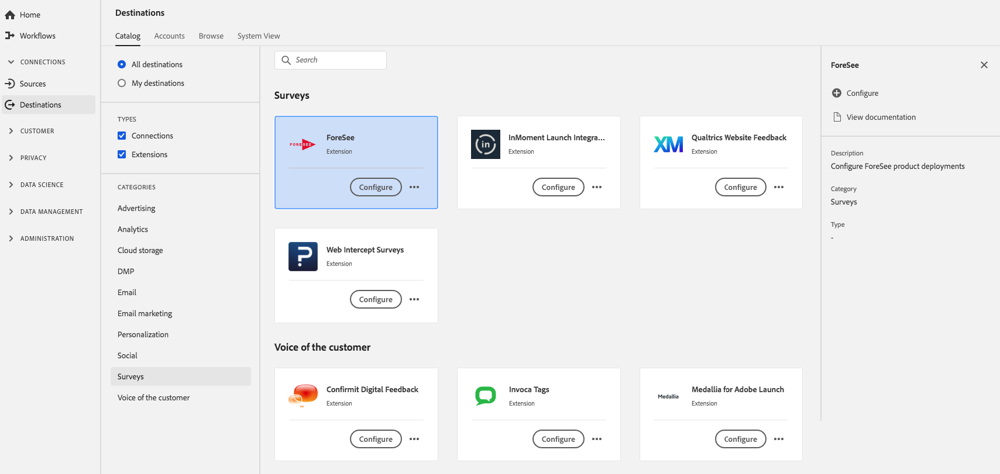

# [!DNL Foresee]-Erweiterung  {#foresee-extension}

## Übersicht {#overview}

Konfigurieren Sie [!DNL ForeSee] -Produktbereitstellungen mit Experience Platform Launch.

[!DNL Foresee] ist eine Umfrageerweiterung in Adobe Experience Platform. Weitere Informationen zur Funktionalität der Erweiterung finden Sie auf der Seite der Erweiterung auf [Adobe Exchange](https://exchange.adobe.com/experiencecloud.details.100164.html).

Dieses Ziel ist eine Adobe Experience Platform Launch-Erweiterung. Weitere Informationen zur Funktionsweise von Platform launch-Erweiterungen in Platform finden Sie unter [Übersicht über Adobe Experience Platform Launch-Erweiterungen](../launch-extensions/overview.md).

## Voraussetzungen {#prerequisites}

Diese Erweiterung ist im Katalog [!DNL Destinations] für alle Kunden verfügbar, die Platform erworben haben.

Um diese Erweiterung verwenden zu können, benötigen Sie Zugriff auf Adobe Experience Platform Launch.  Platform Launch ist für Adobe Experience Cloud-Kunden als integrierte, Mehrwert bietende Funktion verfügbar. Wenden Sie sich an Ihren Organisationsadministrator, um Zugriff auf Platform launch zu erhalten, und bitten Sie ihn, Ihnen die Berechtigung **[!UICONTROL manage_properties]** zu erteilen, damit Sie Erweiterungen installieren können.

## Installieren einer Erweiterung {#install-extension}

So installieren Sie die [!DNL Foresee]-Erweiterung:

Gehen Sie in der [Platform-Oberfläche](http://platform.adobe.com/) zu **[!UICONTROL Ziele]** > **[!UICONTROL Katalog]**.

Wählen Sie die Erweiterung aus dem Katalog aus oder verwenden Sie die Suchleiste.

Klicken Sie auf das Ziel, um es zu markieren, und wählen Sie dann **[!UICONTROL Konfigurieren]** in der rechten Leiste aus. Wenn das Steuerelement **[!UICONTROL Konfigurieren]** ausgegraut ist, fehlt Ihnen die Berechtigung **[!UICONTROL manage_properties]**. Siehe [Voraussetzungen](#prerequisites).

Wählen Sie im Fenster **[!UICONTROL Verfügbare Platform launch-Eigenschaft]** die Platform launch-Eigenschaft aus, in der Sie die Erweiterung installieren möchten. Sie können auch eine neue Eigenschaft im Platform launch erstellen. Eine Eigenschaft ist eine Sammlung von Regeln, Datenelementen, konfigurierten Erweiterungen, Umgebungen und Bibliotheken. Weitere Informationen zu Eigenschaften finden Sie im Abschnitt [Eigenschaftenseite](../../../tags/ui/administration/companies-and-properties.md#properties-page) der Platform launch-Dokumentation.

Der Workflow führt Sie zum Platform launch, um die Installation abzuschließen.

Informationen zu den Konfigurationsoptionen für Erweiterungen finden Sie auf der [Foresee-Erweiterungsseite](https://exchange.adobe.com/experiencecloud.details.100164.html) in Adobe Exchange.

Sie können die Erweiterung auch direkt in der [Adobe Experience Platform Launch-Benutzeroberfläche](https://launch.adobe.com/) installieren. Siehe [Hinzufügen einer neuen Erweiterung](../../../tags/ui/managing-resources/extensions/overview.md#add-a-new-extension) in der Platform launch-Dokumentation.

## Verwenden der Erweiterung {#how-to-use}

Nachdem Sie die Erweiterung installiert haben, können Sie direkt im Platform launch mit der Einrichtung von Regeln für diese Erweiterung beginnen.

Unter Platform launch können Sie Regeln für Ihre installierten Erweiterungen einrichten, um Ereignisdaten nur in bestimmten Situationen an das Erweiterungsziel zu senden. Weitere Informationen zum Einrichten von Regeln für Erweiterungen finden Sie in der [Regeldokumentation](../../../tags/ui/managing-resources/rules.md).

## Konfigurieren, Aktualisieren und Löschen von Erweiterungen {#configure-upgrade-delete}

Sie können Erweiterungen in der Platform launch-Oberfläche konfigurieren, aktualisieren und löschen.

>[!TIP]
>
>Wenn die Erweiterung bereits in einer Ihrer Eigenschaften installiert ist, zeigt die Platform-Benutzeroberfläche weiterhin **[!UICONTROL Installieren]** für die Erweiterung an. Starten Sie den Installations-Workflow, wie unter [Installieren der Erweiterung](#install-extension) beschrieben, um zu Platform launch zu gelangen und Ihre Erweiterung zu konfigurieren oder zu löschen.

Informationen zum Aktualisieren Ihrer Erweiterung finden Sie unter [Erweiterungs-Upgrade](../../../tags/ui/managing-resources/extensions/extension-upgrade.md) in der Platform launch-Dokumentation.
