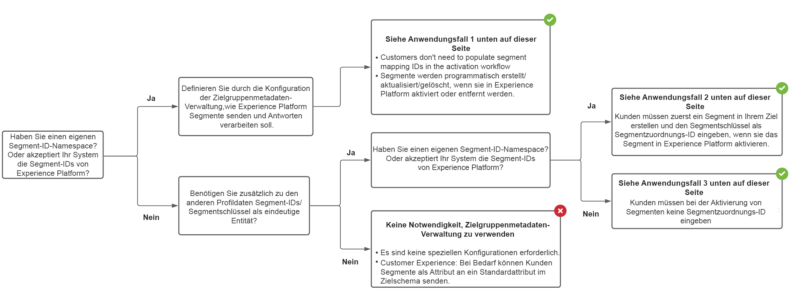

# Zielgruppen-Metadatenverwaltung {#audience-metadata-management}

## Übersicht {#overview}

Verwenden Sie Zielgruppen-Metadatenvorlagen, um Zielgruppen in Ihrem Ziel programmgesteuert zu erstellen, zu aktualisieren oder zu löschen. Adobe bietet eine Erweiterungsvorlage für Zielgruppen-Metadaten, die Sie anhand der Spezifikationen Ihrer Marketing-API konfigurieren können. Nachdem Sie die Konfiguration definiert, getestet und gesendet haben, wird sie von Adobe verwendet, um die API-Aufrufe an Ihr Ziel zu strukturieren.

Sie können die in diesem Dokument beschriebenen Funktionen mithilfe der `/authoring/audience-templates` API-Endpunkt. Lesen [API-Vorgänge für Zielgruppen-Metadaten-Endpunkte](./audience-metadata-api.md) für eine vollständige Liste der Vorgänge, die Sie am -Endpunkt ausführen können.

## Verwendung des Endpunkts Zielgruppen-Metadatenverwaltung {#when-to-use}

Abhängig von Ihrer API-Konfiguration müssen Sie möglicherweise den Endpunkt des Zielgruppen-Metadatenmanagements verwenden, während Sie Ihr Ziel in Experience Platform konfigurieren. Verwenden Sie das unten stehende Entscheidungsbaum-Diagramm, um zu verstehen, wann der Zielgruppen-Metadaten-Endpunkt verwendet und wie eine Zielgruppen-Metadatenvorlage konfiguriert werden soll.



## Anwendungsfälle, die vom Zielgruppen-Metadatenmanagement unterstützt werden {#use-cases}

Dank der Unterstützung von Zielgruppen-Metadaten in Destination SDK können Sie bei der Konfiguration Ihres Experience Platform-Ziels Plattformbenutzern eine von mehreren Optionen geben, wenn sie Segmente Ihrem Ziel zuordnen und aktivieren. Sie können die dem Benutzer zur Verfügung stehenden Optionen über die Parameter im Abschnitt Segmentzuordnung des [Zielkonfiguration](./destination-configuration.md#segment-mapping).

### Nutzungsszenario 1 - Sie verfügen über eine Drittanbieter-API und Benutzer müssen keine Zuordnungs-IDs eingeben

Wenn Sie über einen API-Endpunkt zum Erstellen/Aktualisieren/Löschen von Segmenten oder Zielgruppen verfügen, können Sie mithilfe von Zielgruppen-Metadatenvorlagen die Destination SDK so konfigurieren, dass sie den Spezifikationen Ihres Segmentendpunkts zum Erstellen/Aktualisieren/Löschen entspricht. Experience Platform kann Segmente programmgesteuert erstellen/aktualisieren/löschen und Metadaten wieder mit Experience Platform synchronisieren.

Beim Aktivieren von Segmenten für Ihr Ziel in der Experience Platform-Benutzeroberfläche müssen Benutzer im Aktivierungs-Workflow kein manuelles Ausfüllen des Felds für die Segmentzuordnungs-ID vornehmen.

### Anwendungsfall 2 - Benutzer müssen zuerst ein Segment in Ihrem Ziel erstellen und die Zuordnungs-ID manuell eingeben

Wenn Segmente und andere Metadaten von Partnern oder Benutzern manuell in Ihrem Ziel erstellt werden müssen, müssen die Benutzer das Feld für die Segmentzuordnungs-ID im Aktivierungs-Workflow manuell ausfüllen, um die Segmentmetadaten zwischen Ihrem Ziel und Ihrer Experience Platform zu synchronisieren.


### Nutzungsszenario 3: Ihr Ziel akzeptiert die Experience Platform-Segment-ID, Benutzer müssen die Zuordnungs-ID nicht manuell eingeben

Wenn Ihr Zielsystem die Segmentkennung der Experience Platform akzeptiert, können Sie diese in Ihrer Zielgruppen-Metadatenvorlage konfigurieren. Benutzer müssen beim Aktivieren eines Segments keine Segmentzuordnungs-ID ausfüllen.

## Generische und erweiterbare Zielgruppenvorlage {#generic-and-extensible}

Um die oben aufgeführten Anwendungsfälle zu unterstützen, bietet Ihnen Adobe eine generische Vorlage, die Sie an Ihre API-Spezifikationen anpassen können.

Sie können die generische Vorlage verwenden, um [eine neue Zielgruppenvorlage erstellen](./audience-metadata-api.md#create) wenn Ihre API unterstützt:

* Die HTTP-Methoden: POST, GET, PUT, DELETE, PATCH
* Die Authentifizierungstypen: OAuth 1, OAuth 2 mit Aktualisierungstoken, OAuth 2 mit Trägertoken
* Die Funktionen: Erstellen einer Zielgruppe, Aktualisieren einer Zielgruppe, Abrufen einer Zielgruppe, Löschen einer Zielgruppe, Validieren der Anmeldeinformationen

Das Adobe Engineering-Team kann mit Ihnen zusammenarbeiten, um die generische Vorlage mit benutzerdefinierten Feldern zu erweitern, wenn dies für Ihre Anwendungsfälle erforderlich ist.

## Konfigurationsbeispiele {#configuration-examples}

Dieser Abschnitt enthält drei Beispiele für allgemeine Konfigurationen von Zielgruppen-Metadaten für Ihre Referenz sowie Beschreibungen der wichtigsten Abschnitte der Konfiguration. Beachten Sie, wie sich URL, Kopfzeilen, Anfrage- und Antworttext zwischen den drei Beispielkonfigurationen unterscheiden. Dies liegt an den unterschiedlichen Spezifikationen der Marketing-API der drei Beispielplattformen.

Beachten Sie, dass in einigen Beispielen Makro-Felder wie `{{authData.accessToken}}` oder `{{segment.name}}` werden in der URL verwendet und in anderen Beispielen in den Kopfzeilen oder im Anfragetext verwendet. Das hängt wirklich von Ihren Marketing-API-Spezifikationen ab.

| Vorlagenbereich | Beschreibung |
|--- |--- |
| `create` | Umfasst alle erforderlichen Komponenten (URL, HTTP-Methode, Kopfzeilen, Anfrage- und Antworttext), um einen HTTP-Aufruf an Ihre API durchzuführen, Segmente/Zielgruppen in Ihrer Plattform programmgesteuert zu erstellen und die Informationen wieder mit Adobe Experience Platform zu synchronisieren. |
| `update` | Umfasst alle erforderlichen Komponenten (URL, HTTP-Methode, Kopfzeilen, Anfrage- und Antworttext), um einen HTTP-Aufruf an Ihre API durchzuführen, Segmente/Zielgruppen in Ihrer Plattform programmgesteuert zu aktualisieren und die Informationen wieder mit Adobe Experience Platform zu synchronisieren. |
| `delete` | Umfasst alle erforderlichen Komponenten (URL, HTTP-Methode, Kopfzeilen, Anfrage- und Antworttext), um einen HTTP-Aufruf an Ihre API durchzuführen und Segmente/Zielgruppen in Ihrer Plattform programmgesteuert zu löschen. |
| `validate` | Führt Überprüfungen für alle Felder in der Vorlagenkonfiguration durch, bevor Sie die Partner-API aufrufen. Sie können beispielsweise überprüfen, ob die Konto-ID des Benutzers korrekt eingegeben wurde. |
| `notify` | Gilt nur für dateibasierte Ziele. Umfasst alle erforderlichen Komponenten (URL, HTTP-Methode, Header, Anfrage- und Antworttext), um einen HTTP-Aufruf an Ihre API durchzuführen und Sie über erfolgreiche Dateiexporte zu informieren. |

{style=&quot;table-layout:auto&quot;}

### Streaming-Beispiel 1 {#example-1}

```json
{
   "instanceId":"34ab9cc2-2536-44a5-9dc5-b2fea60b3bd6",
   "createdDate":"2021-07-26T19:30:52.012490Z",
   "lastModifiedDate":"2021-07-27T21:25:42.763478Z",
   "metadataTemplate":{
      "create":{
         "url":"https://adsapi.moviestar.com/v1/adaccounts/{{customerData.accountId}}/segments",
         "httpMethod":"POST",
         "headers":[
            {
               "value":"application/json",
               "header":"Content-Type"
            },
            {
               "value":"Bearer {{oauth2ServiceAccessToken}}",
               "header":"Authorization"
            }
         ],
         "requestBody":{
            "json":{
               "segments":[
                  {
                     "name":"{{segment.name}}",
                     "description":"{{segment.description}}",
                     "source_type":"FIRST_PARTY",
                     "ad_account_id":"{{customerData.accountId}}",
                     "retention_in_days":180
                  }
               ]
            }
         },
         "responseFields":[
            {
               "value":"{{body.segments[0].segment.id}}",
               "name":"externalAudienceId"
            }
         ],
         "responseErrorFields":[
            {
               "value":"{{root}}",
               "name":"message"
            }
         ]
      },
      "update":{
         "url":"https://adsapi.moviestar.com/v1/adaccounts/{{customerData.accountId}}/segments/{{segment.alias}}",
         "httpMethod":"PUT",
         "headers":[
            {
               "value":"application/json",
               "header":"Content-Type"
            },
            {
               "value":"Bearer {{oauth2ServiceAccessToken}}",
               "header":"Authorization"
            }
         ],
         "requestBody":{
            "json":{
               "segments":[
                  {
                     "id":"{{segment.alias}}",
                     "name":"{{segment.name}}",
                     "description":"{{segment.description}}"
                  }
               ]
            }
         },
         "responseFields":[
            {
               "value":"{{body.segments[0].segment.id}}",
               "name":"externalAudienceId"
            }
         ],
         "responseErrorFields":[
            {
               "value":"{{root}}",
               "name":"message"
            }
         ]
      },
      "delete":{
         "url":"https://adsapi.moviestar.com/v1/adaccounts/{{customerData.accountId}}/segments/{{segment.alias}}",
         "httpMethod":"DELETE",
         "headers":[
            {
               "value":"application/json",
               "header":"Content-Type"
            },
            {
               "value":"Bearer {{oauth2ServiceAccessToken}}",
               "header":"Authorization"
            }
         ],
         "responseErrorFields":[
            {
               "value":"{{root}}",
               "name":"message"
            }
         ]
      },
      "name":"Moviestar destination audience template - Example 1"
   }
}
```

### Streaming-Beispiel 2 {#example-2}

```json
{
   "instanceId":"12c78017-5af3-4d4e-8f9c-d330c547c482",
   "createdDate":"2021-07-20T13:27:37.029490Z",
   "lastModifiedDate":"2021-07-20T18:53:03.622306Z",
   "metadataTemplate":{
      "create":{
         "url":"https://api.moviestar.com/v1.0/{{customerData.accountId}}/customaudiences?fields=name,description,account_id&subtype=CUSTOM&name={{segment.name}}&customer_file_source={{segment.metadata.customer_file_source}}&access_token={{authData.accessToken}}",
         "httpMethod":"POST",
         "headers":[
            {
               "value":"application/x-www-form-urlencoded",
               "header":"Content-Type"
            }
         ],
         "responseFields":[
            {
               "value":"{{response.id}}",
               "name":"externalAudienceId"
            }
         ],
         "responseErrorFields":[
            {
               "value":"{{error.message}}",
               "name":"message"
            }
         ]
      },
      "update":{
         "url":"https://api.moviestar.com/v1.0/{{segment.alias}}?field=name,description,account_id&access_token={{authData.accessToken}}&customerAudienceId={{segment.alias}}&&name={{segment.name}}&description={{segment.description}}&customer_file_source={{segment.metadata.customer_file_source}}",
         "httpMethod":"POST",
         "headers":[
            {
               "value":"application/x-www-form-urlencoded",
               "header":"Content-Type"
            }
         ],
         "responseFields":[
            {
               "value":"{{response.id}}",
               "name":"externalAudienceId"
            }
         ],
         "responseErrorFields":[
            {
               "value":"{{error.message}}",
               "name":"message"
            }
         ]
      },
      "delete":{
         "url":"https://api.moviestar.com/v1.0/{{segment.alias}}?fields=name,description,account_id&access_token={{authData.accessToken}}&customerAudienceId={{segment.alias}}",
         "httpMethod":"DELETE",
         "headers":[
            {
               "value":"application/x-www-form-urlencoded",
               "header":"Content-Type"
            }
         ],
         "responseErrorFields":[
            {
               "value":"{{error.message}}",
               "name":"message"
            }
         ]
      },
      "validate":{
         "url":"https://api.moviestar.com/v1.0/permissions?access_token={{authData.accessToken}}",
         "httpMethod":"GET",
         "headers":[
            {
               "value":"application/x-www-form-urlencoded",
               "header":"Content-Type"
            }
         ],
         "responseFields":[
            {
               "value":"{{response.data[0].permission}}",
               "name":"Id"
            }
         ],
         "responseErrorFields":[
            {
               "value":"{{error.message}}",
               "name":"message"
            }
         ]
      }
   }
}
```

### Streaming-Beispiel 3 {#example-3}

```json
{
   "instanceId":"12a3238f-b509-4a40-b8fb-0a5006e7901d",
   "createdDate":"2021-07-20T13:30:30.843054Z",
   "lastModifiedDate":"2021-07-21T16:33:05.787472Z",
   "metadataTemplate":{
      "create":{
         "url":"https://api.moviestar.com/v2/dmpSegments",
         "httpMethod":"POST",
         "headers":[
            {
               "value":"application/json",
               "header":"Content-Type"
            },
            {
               "value":"Bearer {{authData.accessToken}}",
               "header":"Authorization"
            }
         ],
         "requestBody":{
            "json":{
               "name":"{{segment.name}}",
               "type":"USER",
               "account":"{{customerData.accountId}}",
               "accessPolicy":"PRIVATE",
               "destinations":[
                  {
                     "destination":"MOVIESTAR"
                  }
               ],
               "sourcePlatform":"ADOBE"
            }
         },
         "responseFields":[
            {
               "value":"{{headers.x-moviestar-id}}",
               "name":"externalAudienceId"
            }
         ],
         "responseErrorFields":[
            {
               "value":"{{message}}",
               "name":"message"
            }
         ]
      },
      "update":{
         "url":"https://api.moviestar.com/v2/dmpSegments/{{segment.alias}}",
         "httpMethod":"POST",
         "headers":[
            {
               "value":"application/json",
               "header":"Content-Type"
            },
            {
               "value":"Bearer {{authData.accessToken}}",
               "header":"Authorization"
            }
         ],
         "requestBody":{
            "json":{
               "patch":{
                  "$set":{
                     "name":"{{segment.name}}"
                  }
               }
            }
         },
         "responseErrorFields":[
            {
               "value":"{{message}}",
               "name":"message"
            }
         ]
      },
      "delete":{
         "url":"https://api.moviestar.com/v2/dmpSegments/{{segment.alias}}",
         "httpMethod":"DELETE",
         "headers":[
            {
               "value":"application/json",
               "header":"Content-Type"
            },
            {
               "value":"Bearer {{authData.accessToken}}",
               "header":"Authorization"
            }
         ],
         "responseErrorFields":[
            {
               "value":"{{message}}",
               "name":"message"
            }
         ]
      },
      "name":"Moviestar audience template - Third example"
   }
}
```


### Dateibasiertes Beispiel {#example-file-based}

```json
{
   "instanceId":"34ab9cc2-2536-44a5-9dc5-b2fea60b3bd6",
   "createdDate":"2021-07-26T19:30:52.012490Z",
   "lastModifiedDate":"2021-07-27T21:25:42.763478Z",
   "metadataTemplate":{
      "create":{
         "url":"https://adsapi.moviestar.com/v1/adaccounts/{{customerData.accountId}}/segments",
         "httpMethod":"POST",
         "headers":[
            {
               "value":"application/json",
               "header":"Content-Type"
            },
            {
               "value":"Bearer {{oauth2ServiceAccessToken}}",
               "header":"Authorization"
            }
         ],
         "requestBody":{
            "json":{
               "segments":[
                  {
                     "name":"{{segment.name}}",
                     "description":"{{segment.description}}",
                     "source_type":"FIRST_PARTY",
                     "ad_account_id":"{{customerData.accountId}}",
                     "retention_in_days":180
                  }
               ]
            }
         },
         "responseFields":[
            {
               "value":"{{body.segments[0].segment.id}}",
               "name":"externalAudienceId"
            }
         ],
         "responseErrorFields":[
            {
               "value":"{{root}}",
               "name":"message"
            }
         ]
      },
      "update":{
         "url":"https://adsapi.moviestar.com/v1/adaccounts/{{customerData.accountId}}/segments/{{segment.alias}}",
         "httpMethod":"PUT",
         "headers":[
            {
               "value":"application/json",
               "header":"Content-Type"
            },
            {
               "value":"Bearer {{oauth2ServiceAccessToken}}",
               "header":"Authorization"
            }
         ],
         "requestBody":{
            "json":{
               "segments":[
                  {
                     "id":"{{segment.alias}}",
                     "name":"{{segment.name}}",
                     "description":"{{segment.description}}"
                  }
               ]
            }
         },
         "responseFields":[
            {
               "value":"{{body.segments[0].segment.id}}",
               "name":"externalAudienceId"
            }
         ],
         "responseErrorFields":[
            {
               "value":"{{root}}",
               "name":"message"
            }
         ]
      },
      "notify":{
         "url":"https://adsapi.moviestar.com/v1/adaccounts/{{customerData.accountId}}/segments/{{segment.alias}}",
         "httpMethod":"PUT",
         "headers":[
            {
               "value":"application/json",
               "header":"Content-Type"
            },
            {
               "value":"Bearer {{oauth2ServiceAccessToken}}",
               "header":"Authorization"
            }
         ],
         "requestBody":{
            "json":{
               "segments":[
                  {
                     "id":"{{segment.alias}}",
                     "name":"{{segment.name}}",
                     "description":"{{segment.description}}"
                  }
               ]
            }
         },
         "responseFields":[
            {
               "value":"{{body.segments[0].segment.id}}",
               "name":"externalAudienceId"
            }
         ],
         "responseErrorFields":[
            {
               "value":"{{root}}",
               "name":"message"
            }
         ]
      },
      "delete":{
         "url":"https://adsapi.moviestar.com/v1/adaccounts/{{customerData.accountId}}/segments/{{segment.alias}}",
         "httpMethod":"DELETE",
         "headers":[
            {
               "value":"application/json",
               "header":"Content-Type"
            },
            {
               "value":"Bearer {{oauth2ServiceAccessToken}}",
               "header":"Authorization"
            }
         ],
         "responseErrorFields":[
            {
               "value":"{{root}}",
               "name":"message"
            }
         ]
      },
      "name":"Moviestar destination audience template - Example 1"
   }
}
```

Beschreibungen aller Parameter in der Vorlage finden Sie in der Referenzdokumentation [API-Vorgänge für Zielgruppen-Metadaten-Endpunkte](./audience-metadata-api.md).

## In Zielgruppen-Metadatenvorlagen verwendete Makros

Um Informationen wie Segment-IDs, Zugriffstoken, Fehlermeldungen und mehr zwischen Experience Platform und Ihrer API zu übermitteln, enthalten die Zielgruppenvorlagen Makros, die Sie verwenden können. Eine Beschreibung der Makros, die in den drei Konfigurationsbeispielen auf dieser Seite verwendet werden, finden Sie unten:

| Makro | Beschreibung |
|--- |--- |
| `{{segment.alias}}` | Ermöglicht den Zugriff auf den Segmentalias in Experience Platform. |
| `{{segment.name}}` | Ermöglicht den Zugriff auf den Segmentnamen in Experience Platform. |
| `{{segment.id}}` | Ermöglicht den Zugriff auf die Segment-ID in Experience Platform. |
| `{{customerData.accountId}}` | Ermöglicht den Zugriff auf das Feld &quot;Konto-ID&quot;, das Sie in der Zielkonfiguration eingerichtet haben. |
| `{{oauth2ServiceAccessToken}}` | Ermöglicht die dynamische Generierung eines Zugriffstokens basierend auf Ihrer OAuth 2-Konfiguration. |
| `{{authData.accessToken}}` | Ermöglicht die Weitergabe des Zugriffs-Tokens an Ihren API-Endpunkt. Verwendung `{{authData.accessToken}}` Wenn Experience Platform nicht ablaufende Token verwenden sollte, um eine Verbindung zu Ihrem Ziel herzustellen, verwenden Sie andernfalls `{{oauth2ServiceAccessToken}}` , um ein Zugriffstoken zu generieren. |
| `{{body.segments[0].segment.id}}` | Gibt die eindeutige Kennung der erstellten Audience als Wert des Schlüssels zurück `externalAudienceId`. |
| `{{error.message}}` | Gibt eine Fehlermeldung zurück, die Benutzern in der Experience Platform-Benutzeroberfläche angezeigt wird. |

{style=&quot;table-layout:auto&quot;}
