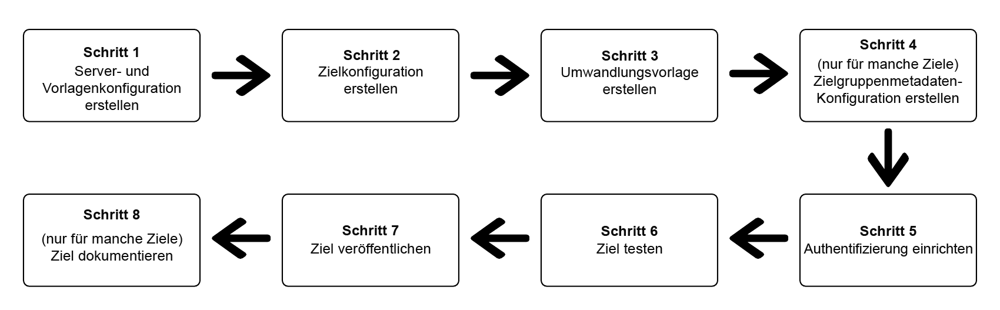

# Verwenden des Destination SDK zum Konfigurieren eines Streaming-Ziels

## Übersicht {#overview}

Auf dieser Seite wird die Verwendung der Informationen unter [Konfigurationsoptionen im Destinations SDK](./configuration-options.md) sowie anderen Destination SDK-Funktionen und API-Referenzdokumenten zum Konfigurieren eines [Streaming-Ziels](/help/destinations/destination-types.md#streaming-destinations) beschrieben. Die Schritte sind im Folgenden in der vorgegebenen Reihenfolge aufgeführt.

## Voraussetzungen {#prerequisites}

Bevor Sie mit den unten dargestellten Schritten fortfahren, informieren Sie sich auf der Seite [Erste Schritte mit dem Destination SDK](./getting-started.md), wie Sie die erforderlichen Adobe I/O-Authentifizierungsdaten und andere Voraussetzungen für die Arbeit mit Destination SDK-APIs erhalten.

## Schritte zum Verwenden der Konfigurationsoptionen im Destination SDK zum Einrichten Ihres Ziels {#steps}



## Schritt 1: Erstellen einer Server- und Vorlagenkonfiguration {#create-server-template-configuration}

Erstellen Sie zunächst eine Server- und Vorlagenkonfiguration mit dem `/destinations-server`-Endpunkt (siehe [API-Referenz](destination-server-api.md)). Weitere Informationen zur Server- und Vorlagenkonfiguration finden Sie unter [Server- und Vorlagenspezifikationen](server-and-template-configuration.md) im Referenzabschnitt.

Unten ist eine Beispielkonfiguration dargestellt. Beachten Sie, dass die Nachrichtenumwandlungsvorlage im `requestBody.value`-Parameter in Schritt 3, [Erstellen einer Umwandlungsvorlage](./configure-destination-instructions.md#create-transformation-template), behandelt wird.

```json
POST platform.adobe.io/data/core/activation/authoring/destination-servers

{
   "name":"Moviestar destination server",
   "destinationServerType":"URL_BASED",
   "urlBasedDestination":{
      "url":{
         "templatingStrategy":"PEBBLE_V1",
         "value":"https://api.moviestar.com/data/{{customerData.region}}/items"
      }
   },
   "httpTemplate":{
      "httpMethod":"POST",
      "requestBody":{
         "templatingStrategy":"PEBBLE_V1",
         "value":"insert after you create a template in step 3"
      },
      "contentType":"application/json"
   }
}
```

## Schritt 2: Erstellen einer Zielkonfiguration {#create-destination-configuration}

Im Folgenden finden Sie eine Beispielkonfiguration für eine Zielvorlage, die mithilfe dem `/destinations`-API-Endpunkt erstellt wurde. Weitere Informationen zu dieser Konfiguration finden Sie unter [Zielkonfiguration](./destination-configuration.md).

Um die Server- und Vorlagenkonfiguration in Schritt 1 mit dieser Zielkonfiguration zu verbinden, fügen Sie die Instanz-ID der Server- und Vorlagenkonfiguration hier als `destinationServerId` hinzu.

>[!IMPORTANT]
>
>Um ein korrekt konfiguriertes Ziel zu erstellen, *müssen* Sie, wie unten dargestellt, mindestens eine Zielidentität in `identityNamespaces` hinzufügen. Wenn keine Zielidentität konfiguriert ist, können Benutzer nicht über den [Zuordnungsschritt](/help/destinations/ui/activate-segment-streaming-destinations.md#mapping) des Aktivierungs-Workflows hinausgehen.

```json
POST platform.adobe.io/data/core/activation/authoring/destinations
 
{
   "name":"Moviestar",
   "description":"Moviestar is a fictional destination, used for this example.",
   "status":"TEST",
   "customerAuthenticationConfigurations":[
      {
         "authType":"BEARER"
      }
   ],
   "customerDataFields":[
      {
         "name":"endpointsInstance",
         "type":"string",
         "title":"Select Endpoint",
         "description":"Moviestar manages several instances across the globe for REST endpoints that our customers are provisioned for. Select your endpoint in the dropdown list.",
         "isRequired":true,
         "enum":[
            "US",
            "EU",
            "APAC",
            "NZ"
         ]
      },
      {
         "name":"customerID",
         "type":"string",
         "title":"Moviestar Customer ID",
         "description":"Your customer ID in the Moviestar destination (e.g. abcdef).",
         "isRequired":true,
         "pattern":""
      }
   ],
   "uiAttributes":{
      "documentationLink":"http://www.adobe.com/go/destinations-moviestar-en",
      "category":"mobile",
      "connectionType":"Server-to-server",
      "frequency":"Streaming"
   },
   "identityNamespaces":{
      "external_id":{
         "acceptsAttributes":true,
         "acceptsCustomNamespaces":true
      },
      "another_id":{
         "acceptsAttributes":true,
         "acceptsCustomNamespaces":true
      }
   },
   "segmentMappingConfig":{
      "mapExperiencePlatformSegmentName":false,
      "mapExperiencePlatformSegmentId":false,
      "mapUserInput":false,
      "audienceTemplateId":"cbf90a70-96b4-437b-86be-522fbdaabe9c"
   },   
   "aggregation":{
      "aggregationType":"CONFIGURABLE_AGGREGATION",
      "configurableAggregation":{
         "aggregationPolicyId":null,
         "aggregationKey":{
            "includeSegmentId":true,
            "includeSegmentStatus":true,
            "includeIdentity":true,
            "oneIdentityPerGroup":true,
            "groups":null
         },
         "splitUserById":true,
         "maxBatchAgeInSecs":2400,
         "maxNumEventsInBatch":5000
      }
   },
   "destinationDelivery":[
      {
         "authenticationRule":"CUSTOMER_AUTHENTICATION",
         "destinationServerId":"9c77000a-4559-40ae-9119-a04324a3ecd4"
      }
   ]
}
```

## Schritt 3: Erstellen einer Nachrichtenumwandlungsvorlage – Verwenden Sie die Vorlagensprache, um das Ausgabeformat der Nachricht anzugeben {#create-transformation-template}

Basierend auf den Payloads, die das Ziel unterstützt, müssen Sie eine Vorlage erstellen, die das Format der exportierten Daten aus dem Adobe-XDM-Format in ein vom Ziel unterstütztes Format umwandelt. Orientieren Sie sich an den Vorlagenbeispielen im Abschnitt [Verwenden einer Vorlagensprache für die Umwandlung von Identität, Attributen und Segmentzugehörigkeit](./message-format.md#using-templating) und verwenden Sie das von Adobe bereitgestellte [Tool zur Vorlagenerstellung](./create-template.md).

Nachdem Sie eine Vorlage für die Nachrichtenumwandlung erstellt haben, die Ihren Anforderungen entspricht, fügen Sie sie der Server- und Vorlagenkonfiguration hinzu, die Sie in Schritt 1 erstellt haben.

## Schritt 4: Erstellen der Zielgruppen-Metadatenkonfiguration {#create-audience-metadata-configuration}

Für einige Ziele erfordert das Destination SDK, dass Sie eine Zielgruppen-Metadatenkonfiguration konfigurieren, um Zielgruppen in Ihrem Ziel programmgesteuert zu erstellen, zu aktualisieren oder zu löschen. Informationen dazu, wann Sie diese Konfiguration einrichten müssen und wie Sie sie durchführen, finden Sie unter [Zielgruppen-Metadatenverwaltung](./audience-metadata-management.md).

Wenn Sie eine Zielgruppen-Metadatenkonfiguration verwenden, müssen Sie diese mit der Zielkonfiguration verbinden, die Sie in Schritt 2 erstellt haben. Fügen Sie Ihrer Zielkonfiguration die Instanz-ID Ihrer Zielgruppen-Metadatenkonfiguration als `audienceTemplateId` hinzu.

## Schritt 5: Einrichten der Authentifizierung {#set-up-authentication}

Je nachdem, ob Sie In der obigen Zielkonfiguration `"authenticationRule": "CUSTOMER_AUTHENTICATION"` oder `"authenticationRule": "PLATFORM_AUTHENTICATION"` angeben, können Sie unter Verwendung des Endpunkts `/destination` oder `/credentials` die Authentifizierung für Ihr Ziel einrichten.

* **Häufigster Fall**: Wenn Sie in der Zielkonfiguration `"authenticationRule": "CUSTOMER_AUTHENTICATION"` gewählt haben und Ihr Ziel die OAuth 2-Authentifizierungsmethode unterstützt, lesen Sie [OAuth 2-Authentifizierung](./oauth2-authentication.md).
* Wenn Sie `"authenticationRule": "PLATFORM_AUTHENTICATION"` gewählt haben, orientieren Sie sich an der [Authentifizierungskonfiguration](./authentication-configuration.md#when-to-use).

## Schritt 6: Testen des Ziels {#test-destination}

Nachdem Sie das Ziel mit den Konfigurationsendpunkten in den vorherigen Schritten eingerichtet haben, können Sie das [Zieltest-Tool](./test-destination.md) verwenden, um die Integration zwischen Adobe Experience Platform und Ihrem Ziel zu testen.

Im Rahmen des Testvorgangs Ihres Ziels müssen Sie die Experience Platform-Benutzeroberfläche zum Erstellen von Segmenten verwenden, die Sie für Ihr Ziel aktivieren. Anweisungen zum Erstellen von Segmenten in Experience Platform finden Sie in den beiden nachstehenden Ressourcen:

* [Erstellen einer Dokumentationsseite für Segmente](/help/segmentation/ui/overview.md#create-segment)
* [Videoanleitung zum Erstellen von Segmenten](https://experienceleague.adobe.com/docs/platform-learn/tutorials/segments/create-segments.html?lang=de)

## Schritt 7: Veröffentlichen des Ziels {#publish-destination}

>[!NOTE]
>
>Dieser Schritt ist nicht erforderlich, wenn Sie ein privates Ziel für Ihre eigene Verwendung erstellen und es nicht im Zielkatalog veröffentlichen möchten, damit andere Kunden ihn verwenden können.

Verwenden Sie nach dem Konfigurieren und Testen Ihres Ziels die [Zielveröffentlichungs-API](./destination-publish-api.md), um Ihre Konfiguration zur Überprüfung an Adobe zu senden.

## Schritt 8: Dokumentieren des Ziels {#document-destination}

>[!NOTE]
>
>Dieser Schritt ist nicht erforderlich, wenn Sie ein privates Ziel für Ihre eigene Verwendung erstellen und es nicht im Zielkatalog veröffentlichen möchten, damit andere Kunden ihn verwenden können.

Wenn Sie ein unabhängiger Software-Anbieter (ISV) oder Systemintegrator (SI) sind, der eine [produktbezogene Integration](./overview.md#productized-custom-integrations) erstellt, verwenden Sie den [Self-Service-Dokumentationsprozess](./docs-framework/documentation-instructions.md), um eine Produktdokumentationsseite für Ihr Ziel im [Experience Platform-Zielkatalog](/help/destinations/catalog/overview.md) zu erstellen.

## Schritt 9: Ziel für Überprüfung durch die Adobe übermitteln {#submit-for-review}

>[!NOTE]
>
>Dieser Schritt ist nicht erforderlich, wenn Sie ein privates Ziel für Ihre eigene Verwendung erstellen und es nicht im Zielkatalog veröffentlichen möchten, damit andere Kunden ihn verwenden können.

Bevor das Ziel im Experience Platform-Katalog veröffentlicht und für alle Experience Platform-Kunden sichtbar ist, müssen Sie das Ziel offiziell zur Überprüfung durch die Adobe übermitteln. Vollständige Informationen zum [zur Überprüfung eines in der Destination SDK erstellten produktiven Ziels einreichen](/help/destinations/destination-sdk/submit-destination.md).
