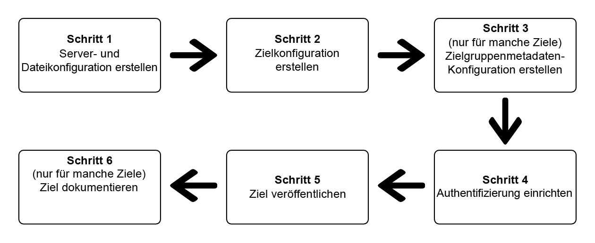

# (Beta) Verwenden des Destination SDK zum Konfigurieren eines dateibasierten Ziels

## Übersicht {#overview}

>[!IMPORTANT]
>
>Die Funktion zum Konfigurieren und Übermitteln dateibasierter Ziele mithilfe des Adobe Experience Platform Destination SDK ist derzeit als Beta-Version verfügbar. Dokumentation und Funktionalität können sich ändern.

Auf dieser Seite wird beschrieben, wie Sie die Informationen in [Konfigurationsoptionen im Destination SDK](./configuration-options.md) und in anderen Destination SDK-Funktionen und API-Referenzdokumenten verwenden können, um ein [dateibasiertes Ziel](../../destinations/destination-types.md#file-based) zu konfigurieren. Die Schritte sind im Folgenden in der vorgegebenen Reihenfolge aufgeführt.

## Voraussetzungen {#prerequisites}

Bevor Sie mit den unten dargestellten Schritten fortfahren, informieren Sie sich auf der Seite [Erste Schritte mit dem Destination SDK](./getting-started.md), wie Sie die erforderlichen Adobe I/O-Authentifizierungsdaten und andere Voraussetzungen für die Arbeit mit Destination SDK-APIs erhalten.

## Schritte zum Verwenden der Konfigurationsoptionen im Destination SDK zum Einrichten Ihres Ziels {#steps}



## Schritt 1: Erstellen einer Server- und Dateikonfiguration {#create-server-file-configuration}

Erstellen Sie zunächst eine Server- und Dateikonfiguration mithilfe des Endpunkts `/destinations-server` (siehe [API-Referenz](./destination-server-api.md)).

Nachfolgend finden Sie eine Beispielkonfiguration für ein [!DNL Amazon S3]-Ziel. Informationen zum Konfigurieren anderer Typen dateibasierter Ziele finden Sie in den entsprechenden [Server-Konfigurationen](server-and-file-configuration.md).

**API-Format**

```http
POST platform.adobe.io/data/core/activation/authoring/destination-servers
```

```json
{
    "name": "S3 destination",
    "destinationServerType": "FILE_BASED_S3",
    "fileBasedS3Destination": {
        "bucket": {
            "templatingStrategy": "PEBBLE_V1",
            "value": "{{customerData.bucket}}"
        },
        "path": {
            "templatingStrategy": "PEBBLE_V1",
            "value": "{{customerData.path}}"
        }
    },
    "fileConfigurations": {
        "compression": {
            "templatingStrategy": "PEBBLE_V1",
            "value": "{{customerData.compression}}"
        },
        "fileType": {
            "templatingStrategy": "PEBBLE_V1",
            "value": "{{customerData.fileType}}"
        },
        "csvOptions": {
            "quote": {
                "templatingStrategy": "NONE",
                "value": "\""
            },
            "quoteAll": {
                "templatingStrategy": "NONE",
                "value": "false"
            },
            "escape": {
                "templatingStrategy": "NONE",
                "value": "\\"
            },
            "escapeQuotes": {
                "templatingStrategy": "NONE",
                "value": "true"
            },
            "header": {
                "templatingStrategy": "NONE",
                "value": "true"
            },
            "ignoreLeadingWhiteSpace": {
                "templatingStrategy": "NONE",
                "value": "true"
            },
            "ignoreTrailingWhiteSpace": {
                "templatingStrategy": "NONE",
                "value": "true"
            },
            "nullValue": {
                "templatingStrategy": "NONE",
                "value": ""
            },
            "dateFormat": {
                "templatingStrategy": "NONE",
                "value": "yyyy-MM-dd"
            },
            "timestampFormat": {
                "templatingStrategy": "NONE",
                "value": "yyyy-MM-dd'T':mm:ss[.SSS][XXX]"
            },
            "charToEscapeQuoteEscaping": {
                "templatingStrategy": "NONE",
                "value": "\\"
            },
            "emptyValue": {
                "templatingStrategy": "NONE",
                "value": ""
            },
            "lineSep": {
                "templatingStrategy": "NONE",
                "value": "\n"
            }
        }
    }
}
```

## Schritt 2: Erstellen einer Zielkonfiguration {#create-destination-configuration}

Unten sehen Sie ein Beispiel für eine Zielkonfiguration, die mithilfe des API-Endpunkts `/destinations` erstellt wurde. Weitere Informationen zu dieser Konfiguration finden Sie unter [Zielkonfiguration](./file-based-destination-configuration.md).

Um die Server- und Dateikonfiguration in Schritt 1 mit dieser Zielkonfiguration zu verbinden, fügen Sie die Instanz-ID des Servers und die Vorlagenkonfiguration hier als `destinationServerId` hinzu.

**API-Format**

```http
POST platform.adobe.io/data/core/activation/authoring/destinations
```

```json
{
    "name": "Amazon S3 destination",
    "description": "Amazon S3 destination is a fictional destination, used for this example.",
    "releaseNotes": "Test",
    "status": "Test",
    "customerAuthenticationConfigurations": [
        {
            "authType": "S3"
        }
    ],
    "customerEncryptionConfigurations": [],
    "customerDataFields": [
        {
            "name": "bucket",
            "title": "Amazon S3 bucket name",
            "description": "Enter the Amazon S3 Bucket name that will host the exported files.",
            "type": "string",
            "isRequired": true,
            "readOnly": false,
            "hidden": false
        },
        {
            "name": "path",
            "title": "Amazon S3 path",
            "description": "Enter Amazon S3 folder path",
            "type": "string",
            "isRequired": true,
            "pattern": "^[A-Za-z]+$",
            "readOnly": false,
            "hidden": false
        },
        {
            "name": "compression",
            "title": "Select compression type",
            "description": "Select the file compression type used by the exported files.",
            "type": "string",
            "isRequired": true,
            "readOnly": false,
            "enum": [
                "GZIP",
                "NONE",
                "bzip2",
                "lz4",
                "snappy",
                "deflate"
            ]
        },
        {
            "name": "fileType",
            "title": "Select a file format",
            "description": "Select the file format to be used by the exported files.",
            "type": "string",
            "isRequired": true,
            "readOnly": false,
            "hidden": false,
            "enum": [
                "csv",
                "json",
                "parquet"
            ],
            "default": "csv"
        }
    ],
    "uiAttributes": {
        "documentationLink": "https://www.adobe.io/apis/experienceplatform.html",
        "category": "S3",
        "iconUrl": "https://dc5tqsrhldvnl.cloudfront.net/2/90048/da276e30c730ce6cd666c8ca78360df21.png",
        "connectionType": "S3",
        "flowRunsSupported": true,
        "monitoringSupported": true,
        "frequency": "Batch"
    },
    "destinationDelivery": [
        {
            "deliveryMatchers": [
                {
                    "type": "SOURCE",
                    "value": [
                        "batch"
                    ]
                }
            ],
            "authenticationRule": "CUSTOMER_AUTHENTICATION",
            "destinationServerId": "eec25bde-4f56-4c02-a830-9aa9ec73ee9d"
        }
    ],
    "schemaConfig": {
        "profileRequired": true,
        "segmentRequired": true,
        "identityRequired": true
    },
    "batchConfig": {
        "allowMandatoryFieldSelection": true,
        "allowDedupeKeyFieldSelection": true,
        "defaultExportMode": "DAILY_FULL_EXPORT",
        "allowedExportMode": [
            "DAILY_FULL_EXPORT",
            "FIRST_FULL_THEN_INCREMENTAL"
        ],
        "allowedScheduleFrequency": [
            "DAILY",
            "EVERY_3_HOURS",
            "EVERY_6_HOURS",
            "EVERY_8_HOURS",
            "EVERY_12_HOURS",
            "ONCE"
        ],
        "defaultFrequency": "DAILY",
        "defaultStartTime": "00:00"
    },
    "backfillHistoricalProfileData": true
}
```

## Schritt 3: Erstellen einer Zielgruppen-Metadatenkonfiguration {#create-audience-metadata-configuration}

Für einige Ziele erfordert das Destination SDK, dass Sie eine Zielgruppen-Metadatenkonfiguration konfigurieren, um Zielgruppen in Ihrem Ziel programmgesteuert zu erstellen, zu aktualisieren oder zu löschen. Informationen dazu, wann Sie diese Konfiguration einrichten müssen und wie Sie sie durchführen, finden Sie unter [Zielgruppen-Metadatenverwaltung](./audience-metadata-management.md).

Wenn Sie eine Zielgruppen-Metadatenkonfiguration verwenden, müssen Sie diese mit der Zielkonfiguration verbinden, die Sie in Schritt 2 erstellt haben. Fügen Sie die Instanz-ID Ihrer Zielgruppen-Metadatenkonfiguration als `audienceTemplateId` zu Ihrer Zielkonfiguration hinzu.

## Schritt 4: Einrichten der Authentifizierung {#set-up-authentication}

Je nachdem, ob Sie `"authenticationRule": "CUSTOMER_AUTHENTICATION"` oder `"authenticationRule": "PLATFORM_AUTHENTICATION"` in der obigen Zielkonfiguration angeben, können Sie die Authentifizierung für Ihr Ziel einrichten, indem Sie den Endpunkt `/destination` oder `/credentials` verwenden.

* Wenn Sie in der Zielkonfiguration `"authenticationRule": "CUSTOMER_AUTHENTICATION"` ausgewählt haben, finden Sie in den folgenden Abschnitten Informationen zu den Authentifizierungstypen, die vom Destination SDK für dateibasierte Ziele unterstützt werden:

   * [Amazon S3-Authentifizierung](authentication-configuration.md#s3)
   * [Azure Blob](authentication-configuration.md#blob)
   * [Azure Data Lake Storage](authentication-configuration.md#adls)
   * [Google Cloud Storage](authentication-configuration.md#gcs)
   * [SFTP-Authentifizierung mit SSH-Schlüssel](authentication-configuration.md#sftp-ssh)
   * [SFTP-Authentifizierung mit Passwort](authentication-configuration.md#sftp-password)

* Wenn Sie `"authenticationRule": "PLATFORM_AUTHENTICATION"` ausgewählt haben, lesen Sie den Abschnitt [Authentifizierungskonfiguration](./authentication-configuration.md#when-to-use).


<!-- ## Step 5: Test your destination {#test-destination}

After setting up your destination using the configuration endpoints in the previous steps, you can use the [destination testing tool](./create-template.md) to test the integration between Adobe Experience Platform and your destination.

As part of the process to test your destination, you must use the Experience Platform UI to create segments, which you will activate to your destination. Refer to the two resources below for instructions how to create segments in Experience Platform:

* [Create a segment documentation page](https://experienceleague.adobe.com/docs/experience-platform/segmentation/ui/overview.html?lang=en#create-segment)
* [Create a segment video walkthrough](https://experienceleague.adobe.com/docs/platform-learn/tutorials/segments/create-segments.html?lang=en) -->

## Schritt 5: Veröffentlichen des Ziels {#publish-destination}

Nachdem Sie Ihr Ziel konfiguriert und getestet haben, verwenden Sie die [Zielveröffentlichungs-API](./destination-publish-api.md), um Ihre Konfiguration zur Überprüfung an Adobe zu übermitteln.

## Schritt 6: Dokumentieren des Ziels {#document-destination}

Wenn Sie ein unabhängiger Software-Anbieter (ISV) oder Systemintegrator (SI) sind, der eine [produktbezogene Integration](./overview.md#productized-custom-integrations) erstellt, verwenden Sie den [Selbstbedienungs-Dokumentationsprozess](./docs-framework/documentation-instructions.md), um eine Produktdokumentationsseite für Ihr Ziel im [Experience Platform-Zielkatalog](/help/destinations/catalog/overview.md) zu erstellen.
