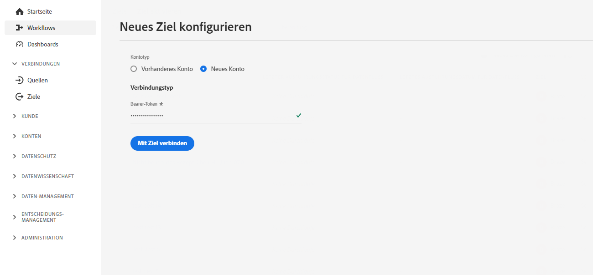
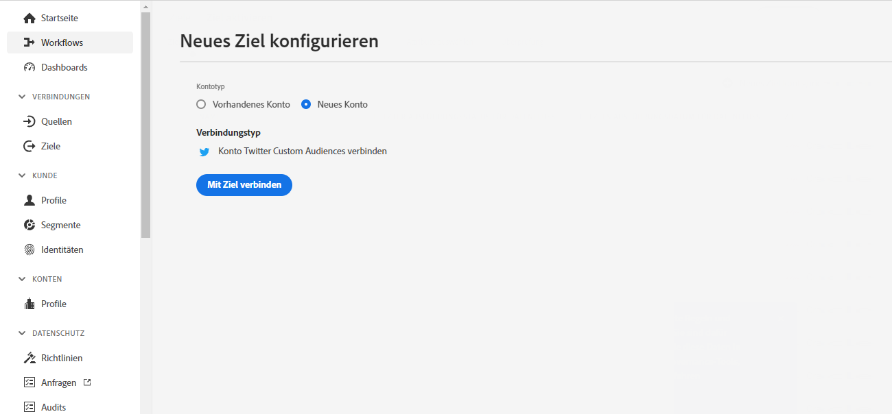

# Konfiguration des Streaming-Ziels {#destination-configuration}

## Übersicht {#overview}

Mit dieser Konfiguration können Sie wichtige Informationen für Ihr Streaming-Ziel angeben, z. B. Ihren Zielnamen, Ihre Kategorie, eine Beschreibung und mehr. Die Einstellungen in dieser Konfiguration bestimmen auch, wie Experience Platform-Benutzer sich bei Ihrem Ziel authentifizieren, wie es in der Experience Platform-Benutzeroberfläche angezeigt wird und welche Identitäten an Ihr Ziel exportiert werden können.

Diese Konfiguration verbindet auch die anderen Konfigurationen, die erforderlich sind, damit Ihr Ziel funktioniert - Zielserver und Zielgruppen-Metadaten - mit dieser Konfiguration. Erfahren Sie, wie Sie auf die beiden Konfigurationen in einer [Abschnitt weiter unten](./destination-configuration.md#connecting-all-configurations).

Sie können die in diesem Dokument beschriebenen Funktionen mithilfe der `/authoring/destinations` API-Endpunkt. Lesen [API-Endpunktvorgänge für Ziele](./destination-configuration-api.md) für eine vollständige Liste der Vorgänge, die Sie am -Endpunkt ausführen können.

## Beispiel für eine Streaming-Konfiguration {#example-configuration}

Dies ist eine Beispielkonfiguration eines fiktiven Streaming-Ziels, Moviestar, das Endpunkte an vier Orten auf der Welt hat. Das Ziel gehört zur Kategorie der mobilen Ziele .

```json
{
   "name":"Moviestar",
   "description":"Moviestar is a fictional destination, used for this example.",
   "status":"TEST",
   "customerAuthenticationConfigurations":[
      {
         "authType":"BEARER"
      }
   ],
   "customerDataFields":[
      {
         "name":"endpointsInstance",
         "type":"string",
         "title":"Select Endpoint",
         "description":"Moviestar manages several instances across the globe for REST endpoints that our customers are provisioned for. Select your endpoint in the dropdown list.",
         "isRequired":true,
         "enum":[
            "US",
            "EU",
            "APAC",
            "NZ"
         ]
      },
      {
         "name":"customerID",
         "type":"string",
         "title":"Moviestar Customer ID",
         "description":"Your customer ID in the Moviestar destination (e.g. abcdef).",
         "isRequired":true,
         "pattern":"^[A-Za-z]+$"
      }
   ],
   "uiAttributes":{
      "documentationLink":"http://www.adobe.com/go/destinations-moviestar-en",
      "category":"mobile",
      "connectionType":"Server-to-server",
      "frequency":"Streaming"
   },
   "identityNamespaces":{
      "external_id":{
         "acceptsAttributes":true,
         "acceptsCustomNamespaces":true,
         "acceptedGlobalNamespaces":{
            "Email":{
               
            }
         }
      },
      "another_id":{
         "acceptsAttributes":true,
         "acceptsCustomNamespaces":true
      }
   },
   "schemaConfig":{
      "profileRequired":false,
      "segmentRequired":true,
      "identityRequired":true
   },
   "destinationDelivery":[
      {
         "authenticationRule":"CUSTOMER_AUTHENTICATION",
         "destinationServerId":"9c77000a-4559-40ae-9119-a04324a3ecd4"
      }
   ],
   "segmentMappingConfig":{
      "mapExperiencePlatformSegmentName":false,
      "mapExperiencePlatformSegmentId":false,
      "mapUserInput":false,
      "audienceTemplateId":"cbf90a70-96b4-437b-86be-522fbdaabe9c"
   },
   "aggregation":{
      "aggregationType":"CONFIGURABLE_AGGREGATION",
      "configurableAggregation":{
         "splitUserById":true,
         "maxBatchAgeInSecs":2400,
         "maxNumEventsInBatch":5000,
         "aggregationKey":{
            "includeSegmentId":true,
            "includeSegmentStatus":true,
            "includeIdentity":true,
            "oneIdentityPerGroup":false,
            "groups":[
               {
                  "namespaces":[
                     "IDFA",
                     "GAID"
                  ]
               },
               {
                  "namespaces":[
                     "EMAIL"
                  ]
               }
            ]
         }
      }
   },
   "backfillHistoricalProfileData":true
}
```

| Parameter | Typ | Beschreibung |
|---------|----------|------|
| `name` | Zeichenfolge | Gibt den Titel Ihres Ziels im Experience Platform-Katalog an. |
| `description` | Zeichenfolge | Geben Sie im Zielkatalog der Experience Platform eine Beschreibung für Ihre Zielkarte ein. Ziel für maximal 4-5 Sätze. |
| `status` | Zeichenfolge | Gibt den Lebenszyklusstatus der Zielkarte an. Zulässige Werte sind `TEST`, `PUBLISHED` und `DELETED`. Verwendung `TEST` wenn Sie Ihr Ziel zum ersten Mal konfigurieren. |

{style=&quot;table-layout:auto&quot;}

## Benutzerauthentifizierungskonfigurationen {#customer-authentication-configurations}

Dieser Abschnitt in der Zielkonfiguration generiert die [Neues Ziel konfigurieren](/help/destinations/ui/connect-destination.md) in der Experience Platform-Benutzeroberfläche, auf der Benutzer die Experience Platform mit den Konten verbinden, die sie mit Ihrem Ziel haben. Je nachdem, welche Authentifizierungsoption Sie im `authType` -Feld wird die Benutzerseite wie folgt für die Experience Platform generiert:

### Bearer-Authentifizierung

Wenn Sie den Authentifizierungstyp des Inhabers konfigurieren, müssen Benutzer das Trägertoken eingeben, das sie von Ihrem Ziel erhalten.



### OAuth 2-Authentifizierung

Benutzer auswählen **[!UICONTROL Mit Ziel verbinden]** , um den OAuth 2-Authentifizierungsfluss an Ihr Ziel Trigger, wie im folgenden Beispiel für das Twitter Custom Audiences-Ziel dargestellt. Detaillierte Informationen zum Konfigurieren der OAuth 2-Authentifizierung für Ihren Ziel-Endpunkt finden Sie in der entsprechenden [Authentifizierungsseite für Destination SDK OAuth 2](./oauth2-authentication.md).



| Parameter | Typ | Beschreibung |
|---------|----------|------|
| `customerAuthenticationConfigurations` | Zeichenfolge | Gibt die Konfiguration an, die zum Authentifizieren von Experience Platform-Kunden auf Ihrem Server verwendet wird. Siehe `authType` unten für gültige Werte. |
| `authType` | Zeichenfolge | Zulässige Werte für Streaming-Ziele sind:<ul><li>`BEARER`. Wenn Ihr Ziel die Trägerauthentifizierung unterstützt, legen Sie `"authType":"Bearer"` und  `"authenticationRule":"CUSTOMER_AUTHENTICATION"` im [Zielversandabschnitt](./destination-configuration.md).</li><li>`OAUTH2`. Wenn Ihr Ziel die OAuth 2-Authentifizierung unterstützt, legen Sie `"authType":"OAUTH2"` und fügen Sie die erforderlichen Felder für OAuth 2 hinzu, wie in der [Authentifizierungsseite für Destination SDK OAuth 2](./oauth2-authentication.md). Zusätzlich wird `"authenticationRule":"CUSTOMER_AUTHENTICATION"` im [Zielversandabschnitt](./destination-configuration.md).</li> |

{style=&quot;table-layout:auto&quot;}

## Kundendatenfelder {#customer-data-fields}

Verwenden Sie diesen Abschnitt, um Benutzer aufzufordern, benutzerdefinierte Felder für Ihr Ziel auszufüllen, wenn sie in der Experience Platform-Benutzeroberfläche eine Verbindung zum Ziel herstellen. Die Konfiguration spiegelt sich im Authentifizierungsfluss wider, wie unten dargestellt:


| Parameter | Typ | Beschreibung |
|---------|----------|------|
| `name` | Zeichenfolge | Geben Sie einen Namen für das benutzerdefinierte Feld ein, das Sie einführen. |
| `type` | Zeichenfolge | Gibt an, welchen Typ von benutzerdefiniertem Feld Sie einführen. Akzeptierte Werte sind `string`, `object`, `integer`. |
| `title` | Zeichenfolge | Gibt den Feldnamen an, wie er von den Kunden in der Experience Platform-Benutzeroberfläche angezeigt wird. |
| `description` | Zeichenfolge | Geben Sie eine Beschreibung für das benutzerdefinierte Feld ein. |
| `isRequired` | Boolesch | Gibt an, ob dieses Feld im Ziel-Setup-Workflow erforderlich ist. |
| `enum` | Zeichenfolge | Rendert das benutzerdefinierte Feld als Dropdown-Menü und listet die für den Benutzer verfügbaren Optionen auf. |
| `pattern` | Zeichenfolge | Erzwingt bei Bedarf ein Muster für das benutzerdefinierte Feld. Verwenden Sie reguläre Ausdrücke, um ein Muster zu erzwingen. Wenn Ihre Kunden-IDs beispielsweise keine Zahlen oder Unterstriche enthalten, geben Sie `^[A-Za-z]+$` in dieses Feld ein. |

{style=&quot;table-layout:auto&quot;}

## Benutzeroberflächenattribute {#ui-attributes}

Dieser Abschnitt bezieht sich auf die UI-Elemente in der obigen Konfiguration, die von Adobe für Ihr Ziel in der Adobe Experience Platform-Benutzeroberfläche verwendet werden sollte. Siehe unten:

| Parameter | Typ | Beschreibung |
|---------|----------|------|
| `documentationLink` | Zeichenfolge | Weitere Informationen finden Sie auf der Dokumentationsseite im [Zielkatalog](https://experienceleague.adobe.com/docs/experience-platform/destinations/catalog/overview.html?lang=en#catalog) für Ihr Ziel. Verwendung `http://www.adobe.com/go/destinations-YOURDESTINATION-en`, wobei `YOURDESTINATION` ist der Name Ihres Ziels. Für ein Ziel mit dem Namen Moviestar würden Sie `http://www.adobe.com/go/destinations-moviestar-en` |
| `category` | Zeichenfolge | Bezieht sich auf die Ihrem Ziel in Adobe Experience Platform zugewiesene Kategorie. Weitere Informationen finden Sie unter [Zielkategorien](https://experienceleague.adobe.com/docs/experience-platform/destinations/destination-types.html). Verwenden Sie einen der folgenden Werte: `adobeSolutions, advertising, analytics, cdp, cloudStorage, crm, customerSuccess, database, dmp, ecommerce, email, emailMarketing, enrichment, livechat, marketingAutomation, mobile, personalization, protocols, social, streaming, subscriptions, surveys, tagManagers, voc, warehouses, payments`. |
| `connectionType` | Zeichenfolge | `Server-to-server` ist derzeit die einzige verfügbare Option. |
| `frequency` | Zeichenfolge | Bezieht sich auf den vom Ziel unterstützten Datenexport-Typ. Unterstützte Werte: <ul><li>`Streaming`</li><li>`Batch`</li></ul> |

{style=&quot;table-layout:auto&quot;}

## Schemakonfiguration im Zuordnungsschritt {#schema-configuration}


Verwenden Sie die Parameter in `schemaConfig` , um den Zuordnungsschritt des Zielaktivierungs-Workflows zu aktivieren. Mithilfe der unten beschriebenen Parameter können Sie bestimmen, ob Experience Platform-Benutzer Profilattribute und/oder Identitäten dem gewünschten Schema auf der Zielseite zuordnen können.

| Parameter | Typ | Beschreibung |
|---------|----------|------|
| `profileFields` | Array | *Wird in der obigen Beispielkonfiguration nicht angezeigt.* Beim Hinzufügen vordefinierter Elemente `profileFields`, können Experience Platform-Benutzer Platform-Attribute den vordefinierten Attributen auf der Zielseite zuordnen. |
| `profileRequired` | Boolesch | Verwendung `true` , wenn Benutzer in der Lage sein sollten, Profilattribute von Experience Platform benutzerdefinierten Attributen auf der Zielseite zuzuordnen, wie in der obigen Beispielkonfiguration dargestellt. |
| `segmentRequired` | Boolesch | Immer verwenden `segmentRequired:true`. |
| `identityRequired` | Boolesch | Verwendung `true` , wenn Benutzer in der Lage sein sollten, Identitäts-Namespaces von Experience Platform Ihrem gewünschten Schema zuzuordnen. |

{style=&quot;table-layout:auto&quot;}


## Identitäten und Attribute {#identities-and-attributes}

Die Parameter in diesem Abschnitt bestimmen, welche Identitäten Ihr Ziel akzeptiert. Diese Konfiguration füllt auch die Zielidentitäten und -attribute im [Zuordnungsschritt](/help/destinations/ui/activate-segment-streaming-destinations.md#mapping) der Experience Platform-Benutzeroberfläche, in der Benutzer Identitäten und Attribute aus ihren XDM-Schemas dem Schema in Ihrem Ziel zuordnen.

Sie müssen angeben, [!DNL Platform] Identitäten, die Kunden an Ihr Ziel exportieren können. Einige Beispiele: [!DNL Experience Cloud ID], gehashte E-Mail, Geräte-ID ([!DNL IDFA], [!DNL GAID]). Diese Werte sind [!DNL Platform] Identitäts-Namespaces, die Kunden Identitäts-Namespaces von Ihrem Ziel aus zuordnen können. Sie können auch angeben, ob Kunden benutzerdefinierte Namespaces Identitäten zuordnen können, die von Ihrem Ziel unterstützt werden.

Identitäts-Namespaces erfordern keine 1:1-Korrespondenz zwischen [!DNL Platform] und Ihr Ziel.
Kunden können beispielsweise eine [!DNL Platform] [!DNL IDFA] Namespace zu [!DNL IDFA] -Namespace von Ihrem Ziel aus oder sie können denselben [!DNL Platform] [!DNL IDFA] Namespace zu einem [!DNL Customer ID] -Namespace in Ihrem Ziel.

Mehr dazu im [Übersicht über Identity Namespace](https://experienceleague.adobe.com/docs/experience-platform/identity/namespaces.html?lang=de).


| Parameter | Typ | Beschreibung |
|---------|----------|------|
| `acceptsAttributes` | Boolesch | Gibt an, ob Ihr Ziel Standardprofilattribute akzeptiert. Normalerweise werden diese Attribute in der Dokumentation der Partner hervorgehoben. |
| `acceptsCustomNamespaces` | Boolesch | Gibt an, ob Kunden benutzerdefinierte Namespaces in Ihrem Ziel einrichten können. |
| `allowedAttributesTransformation` | Zeichenfolge | *Wird in der Beispielkonfiguration nicht angezeigt*. Wird beispielsweise verwendet, wenn die Variable [!DNL Platform] Der Kunde hat einfache E-Mail-Adressen als Attribut und Ihre Plattform akzeptiert nur Hash-E-Mails. In diesem Objekt können Sie die Transformation durchführen, die angewendet werden muss (z. B. E-Mail in Kleinbuchstaben und dann Hash). Ein Beispiel finden Sie unter `requiredTransformation` im [API-Referenz zur Zielkonfiguration](./destination-configuration-api.md#update). |
| `acceptedGlobalNamespaces` | – | Wird für Fälle verwendet, in denen Ihre Plattform [Standard-Identitäts-Namespaces](https://experienceleague.adobe.com/docs/experience-platform/identity/namespaces.html?lang=en#standard-namespaces) (z. B. IDFA), sodass Sie Platform-Benutzer darauf beschränken können, nur diese Identitäts-Namespaces auszuwählen. |

{style=&quot;table-layout:auto&quot;}

## Zielversand {#destination-delivery}

| Parameter | Typ | Beschreibung |
|---------|----------|------|
| `authenticationRule` | Zeichenfolge | Gibt an, wie [!DNL Platform] -Kunden stellen eine Verbindung zu Ihrem Ziel her. Akzeptierte Werte sind `CUSTOMER_AUTHENTICATION`, `PLATFORM_AUTHENTICATION`, `NONE`. <br> <ul><li>Verwendung `CUSTOMER_AUTHENTICATION` wenn sich Platform-Kunden über einen Benutzernamen und ein Kennwort, ein Trägertoken oder eine andere Authentifizierungsmethode bei Ihrem System anmelden. Sie würden diese Option beispielsweise auswählen, wenn Sie auch `authType: OAUTH2` oder `authType:BEARER` in `customerAuthenticationConfigurations`. </li><li> Verwendung `PLATFORM_AUTHENTICATION` wenn es ein globales Authentifizierungssystem zwischen Adobe und Ihrem Ziel und der [!DNL Platform] Der Kunde muss keine Authentifizierungsberechtigungen bereitstellen, um eine Verbindung zu Ihrem Ziel herzustellen. In diesem Fall müssen Sie mithilfe der [Anmeldeinformationen](./credentials-configuration-api.md) Konfiguration. </li><li>Verwendung `NONE` wenn keine Authentifizierung erforderlich ist, um Daten an Ihre Zielplattform zu senden. </li></ul> |
| `destinationServerId` | Zeichenfolge | Die `instanceId` des [Zielserverkonfiguration](./destination-server-api.md) für dieses Ziel verwendet. |

{style=&quot;table-layout:auto&quot;}

## Konfiguration der Segmentzuordnung {#segment-mapping}


Dieser Abschnitt der Zielkonfiguration bezieht sich darauf, wie Segmentmetadaten wie Segmentnamen oder IDs zwischen Experience Platform und Ihrem Ziel freigegeben werden sollen.

Durch die `audienceTemplateId`, verknüpft dieser Abschnitt diese Konfiguration auch mit der [Konfiguration von Zielgruppen-Metadaten](./audience-metadata-management.md).

Die in der obigen Konfiguration angezeigten Parameter werden im Abschnitt [Ziel-Endpunkt-API-Referenz](./destination-configuration-api.md).

## Aggregationspolitik {#aggregation}


In diesem Abschnitt können Sie die Aggregationsrichtlinien festlegen, die Experience Platform beim Exportieren von Daten in Ihr Ziel verwenden sollte.

Eine Aggregationsrichtlinie bestimmt, wie die exportierten Profile in den Datenexporten kombiniert werden. Verfügbare Optionen sind:
* Aggregation des besten Aufwands
* Konfigurierbare Aggregation (siehe Konfiguration oben)

Lesen Sie den Abschnitt unter [mit Vorlage](./message-format.md#using-templating) und [Beispiele für Aggregationsschlüssel](./message-format.md#template-aggregation-key) um zu verstehen, wie Sie die Aggregationsrichtlinie basierend auf Ihrer ausgewählten Aggregationsrichtlinie in Ihre Nachrichtenumwandlungsvorlage aufnehmen.

### Aggregation des besten Aufwands {#best-effort-aggregation}

>[!TIP]
>
>Verwenden Sie diese Option, wenn Ihr API-Endpunkt weniger als 100 Profile pro API-Aufruf akzeptiert.

Diese Option eignet sich am besten für Ziele, die weniger Profile pro Anforderung bevorzugen und stattdessen mehr Anforderungen mit weniger Daten als weniger Anforderungen mit mehr Daten benötigen.

Verwenden Sie die `maxUsersPerRequest` -Parameter, um die maximale Anzahl von Profilen anzugeben, die Ihr Ziel in einer Anfrage aufnehmen kann.

### Konfigurierbare Aggregation {#configurable-aggregation}

Diese Option eignet sich am besten, wenn Sie lieber große Batches mit Tausenden von Profilen im selben Aufruf durchführen möchten. Mit dieser Option können Sie die exportierten Profile auch auf der Grundlage komplexer Aggregationsregeln aggregieren.

Diese Option ermöglicht Ihnen Folgendes:
* Legen Sie die maximale Zeit und maximale Anzahl von Profilen fest, die aggregiert werden sollen, bevor ein API-Aufruf an Ihr Ziel gesendet wird.
* Aggregieren Sie die exportierten Profile, die dem Ziel zugeordnet sind, basierend auf:
   * Segment-ID;
   * Segmentstatus;
   * Identität oder Gruppen von Identitäten.

>[!NOTE]
>
>Achten Sie bei Verwendung der konfigurierbaren Aggregationsoption für Ihr Ziel auf die Mindest- und Höchstwerte, die Sie für die beiden Parameter verwenden können `maxBatchAgeInSecs` (mindestens 1 800 und höchstens 3 600) und `maxNumEventsInBatch` (mindestens 1.000, höchstens 10.000).

Ausführliche Erläuterungen der Aggregationsparameter finden Sie im Abschnitt [API-Endpunktvorgänge für Ziele](./destination-configuration-api.md) Referenzseite, auf der jeder Parameter beschrieben wird.

## Historische Profilqualifikationen {#profile-backfill}

Sie können die `backfillHistoricalProfileData` in der Zielkonfiguration zu bestimmen, ob historische Profilqualifikationen an Ihr Ziel exportiert werden sollen.

| Parameter | Typ | Beschreibung |
|---------|----------|------|
| `backfillHistoricalProfileData` | Boolesch | Steuert, ob historische Profildaten exportiert werden, wenn Segmente für das Ziel aktiviert werden. <br> <ul><li> `true`: [!DNL Platform] sendet die historischen Benutzerprofile, die sich für das Segment qualifiziert haben, bevor das Segment aktiviert wird. </li><li> `false`: [!DNL Platform] enthält nur Benutzerprofile, die sich für das Segment qualifizieren, nachdem das Segment aktiviert wurde. </li></ul> |

## Wie diese Konfiguration alle erforderlichen Informationen für Ihr Ziel verbindet {#connecting-all-configurations}

Einige Ihrer Zieleinstellungen müssen über das [Zielserver](./server-and-template-configuration.md) oder [Konfiguration von Zielgruppen-Metadaten](./audience-metadata-management.md). Die hier beschriebene Zielkonfiguration verbindet alle diese Einstellungen, indem sie wie folgt auf die beiden anderen Konfigurationen verweist:

* Verwenden Sie die `destinationServerId` , um auf den Zielserver und die Vorlagenkonfiguration zu verweisen, die für Ihr Ziel eingerichtet sind.
* Verwenden Sie die `audienceMetadataId` , um auf die für Ihr Ziel eingerichtete Audience-Metadatenkonfiguration zu verweisen.