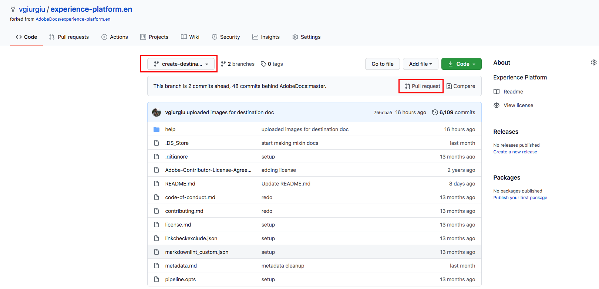

# Verwenden Sie einen Texteditor in Ihrer lokalen Umgebung, um eine Zieldokumentationsseite zu erstellen. {#local-authoring}

Die Anweisungen auf dieser Seite zeigen Ihnen, wie Sie einen Texteditor verwenden können, um in Ihrer lokalen Umgebung Dokumentation zu erstellen und eine Pull-Anforderung (PR) zu senden. Bevor Sie die hier angegebenen Schritte durchführen, lesen Sie [Ihr Ziel in Adobe Experience Platform Destinations](./documentation-instructions.md) dokumentieren.

>[!TIP]
>
>Weitere Informationen finden Sie in der entsprechenden Dokumentation im Mitarbeiter-Handbuch der Adobe:
>* [Git- und Markdown-Bearbeitungswerkzeuge installieren](https://experienceleague.adobe.com/docs/contributor/contributor-guide/setup/install-tools.html?lang=en)
>* [Lokales Git-Repository für Dokumentation einrichten](https://experienceleague.adobe.com/docs/contributor/contributor-guide/setup/local-repo.html?lang=en)
>* [GitHub-Beitragsarbeitsablauf für umfangreiche Änderungen](https://experienceleague.adobe.com/docs/contributor/contributor-guide/setup/full-workflow.html?lang=en).

## Stellen Sie eine Verbindung zu GitHub her und richten Sie Ihre lokale Authoring-Umgebung ein. {#set-up-environment}

1. Navigieren Sie im Browser zu `https://github.com/AdobeDocs/experience-platform.en`
2. Um das Repository [fork](https://experienceleague.adobe.com/docs/contributor/contributor-guide/setup/local-repo.html?lang=en#fork-the-repository) zu verlassen, klicken Sie auf **Fork**, wie im Screenshot gezeigt.

   

3. Repository auf Ihren lokalen Computer klonen. Wählen Sie **Code > HTTPS > Öffnen mit GitHub Desktop** wie unten dargestellt. Vergewissern Sie sich, dass [GitHub Desktop](https://desktop.github.com/) installiert ist. Weitere Informationen finden Sie unter [Lokalen Klon des Repositorys erstellen](https://experienceleague.adobe.com/docs/contributor/contributor-guide/setup/local-repo.html?lang=en#create-a-local-clone-of-the-repository) im Adobe Contributor Guide.

   

4. Navigieren Sie in Ihrer lokalen Dateistruktur zu `experience-platform.en/help/destinations/catalog/[...]`, wobei `[...]` die gewünschte Kategorie für Ihr Ziel ist. Wenn Sie beispielsweise ein Personalisierungsziel zu Experience Platform hinzufügen, wählen Sie den Ordner `personalization` aus.

## Dokumentationsseite für Ihr Ziel erstellen {#author-documentation}

1. Ihre Dokumentationsseite basiert auf der [Self-Service-Zielvorlage](./self-service-template.md). Laden Sie die [Zielvorlage](assets/yourdestination-template.zip) herunter. Entpacken Sie sie und extrahieren Sie die Datei `yourdestination-template.md` in das Verzeichnis, das oben in Schritt 4 erwähnt wurde.  Benennen Sie die Datei `YOURDESTINATION.md` um, wobei YOURDESTINATION der Name Ihres Ziels in Adobe Experience Platform ist. Wenn Ihr Unternehmen beispielsweise Moviestar heißt, würden Sie Ihre Datei `moviestar.md` nennen.
2. Öffnen Sie die neue Datei in Ihrem [Texteditor der Wahl](https://experienceleague.adobe.com/docs/contributor/contributor-guide/setup/install-tools.html?lang=en#understand-markdown-editors). Adobe empfiehlt die Verwendung von [Visual Studio Code](https://code.visualstudio.com/) und die Installation der Adobe Markdown Authoring-Erweiterung. Um die Erweiterung zu installieren, öffnen Sie Visual Studio Code, wählen Sie die Registerkarte **[!DNL Extensions]** auf der linken Bildschirmseite aus und suchen Sie nach `adobe markdown authoring`. Wählen Sie die Erweiterung aus und klicken Sie auf **[!DNL Install]**.
   
3. Bearbeiten Sie die Vorlage mit relevanten Informationen für Ihr Ziel. Befolgen Sie die Anweisungen in der Vorlage.
4. Screenshots oder Bilder, die Sie Ihrer Dokumentation hinzufügen möchten, finden Sie unter `GitHub/experience-platform.en/help/destinations/assets/catalog/[...]`, wobei `[...]` die gewünschte Kategorie für Ihr Ziel ist. Wenn Sie beispielsweise ein Personalisierungsziel zu Experience Platform hinzufügen, wählen Sie den Ordner `personalization` aus. Erstellen Sie einen neuen Ordner für Ihr Ziel und speichern Sie Ihre Bilder hier. Sie müssen auf der Seite, die Sie erstellen, eine Verknüpfung zu ihnen herstellen. Siehe [Anweisungen zum Verknüpfen von Bildern](https://experienceleague.adobe.com/docs/contributor/contributor-guide/writing-essentials/linking.html?lang=en#link-to-images).
5. Wenn Sie bereit sind, speichern Sie die Datei, an der Sie arbeiten.

## Übermitteln der Dokumentation zur Überprüfung {#submit-review}

1. Erstellen Sie in GitHub Desktop eine Arbeitsverzweigung für Ihre Aktualisierungen und wählen Sie **Verzweigung veröffentlichen** aus, um die Verzweigung auf GitHub zu veröffentlichen.

1. In GitHub Desktop [commit](https://docs.github.com/en/free-pro-team@latest/github/getting-started-with-github/github-glossary#commit) Ihre Arbeit, wie unten dargestellt.

   

1. In GitHub Desktop [push](https://docs.github.com/en/free-pro-team@latest/github/getting-started-with-github/github-glossary#push) Ihre Arbeit an den [remote](https://docs.github.com/en/free-pro-team@latest/github/getting-started-with-github/github-glossary#remote) -Zweig, wie unten dargestellt.

   

1. Öffnen Sie in der GitHub-Webschnittstelle eine Pull-Anfrage (PA), um Ihre Arbeitsverzweigung mit der Übergeordneten Verzweigung des Adobe-Dokumentations-Repositorys zusammenzuführen. Vergewissern Sie sich, dass der Zweig, an dem Sie gearbeitet haben, ausgewählt ist, und wählen Sie **Pull-Anforderung** aus.

   

1. Stellen Sie sicher, dass die Basis- und Vergleichsverzweigungen korrekt sind. Fügen Sie der PA einen Hinweis hinzu, beschreiben Sie Ihre Aktualisierung und wählen Sie **Pull-Anforderung erstellen** aus. Dadurch wird ein PR-Vorgang geöffnet, um die Arbeitsverzweigung Ihrer Verzweigung mit der Übergeordneten Verzweigung des Adobe-Repositorys zusammenzuführen.
   >[!TIP]
   >
   >Lassen Sie das Kontrollkästchen **Bearbeitungen durch Betreuer zulassen** aktiviert, damit das Adobe-Dokumentationsteam Änderungen an der PA vornehmen kann.

   

1. An dieser Stelle wird eine Benachrichtigung angezeigt, in der Sie aufgefordert werden, die Adobe Contributor License Agreement (CLA) zu unterzeichnen. Dies ist ein notwendiger Schritt. Nachdem Sie die CLA signiert haben, aktualisieren Sie die PR-Seite und senden Sie die Pull-Anforderung.

1. Sie können bestätigen, dass die Pull-Anforderung gesendet wurde, indem Sie die Registerkarte **Pull Requests** in `https://github.com/AdobeDocs/experience-platform.en` überprüfen.

1. Vielen Dank! Das Dokumentationsteam der Adobe wird sich in der PR für den Fall, dass Änderungen erforderlich sind, an Sie wenden und Ihnen mitteilen, wann die Dokumentation veröffentlicht wird.

>[!TIP]
>
>Um Bilder und Links zu Ihrer Dokumentation hinzuzufügen und weitere Fragen rund um Markdown zu beantworten, lesen Sie [Markdown](https://experienceleague.adobe.com/docs/contributor/contributor-guide/writing-essentials/markdown.html?lang=en) im kollaborativen Schreibleitfaden der Adobe.
