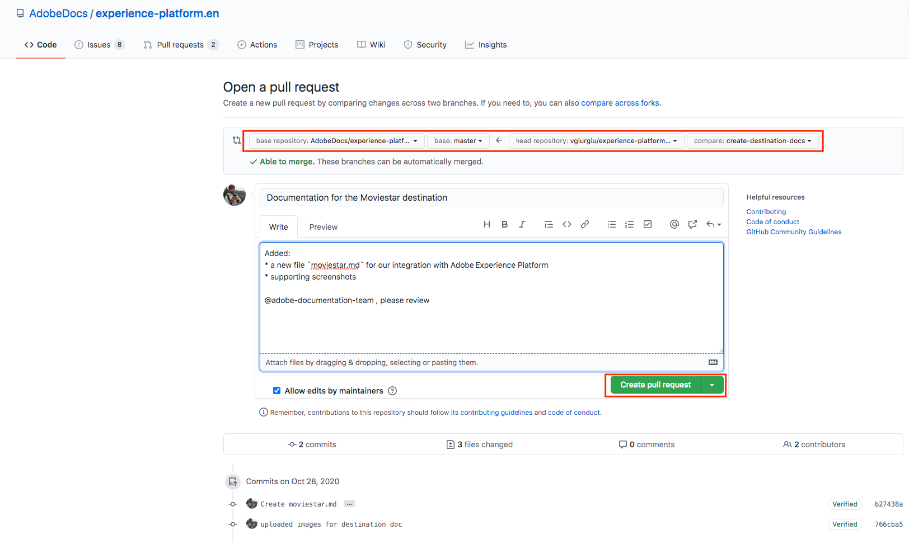

# Verwenden eines Texteditors in der lokalen Umgebung, um eine Zieldokumentationsseite zu erstellen {#local-authoring}

Die Anweisungen auf dieser Seite zeigen Ihnen, wie Sie einen Texteditor verwenden können, um in Ihrer lokalen Umgebung Dokumentation zu erstellen und eine Pull-Anforderung (PR) zu senden. Bevor Sie die hier angegebenen Schritte durchführen, lesen Sie [Ihr Ziel in Adobe Experience Platform-Zielen dokumentieren](./documentation-instructions.md).

>[!TIP]
>
>Weitere Informationen finden Sie in der unterstützenden Dokumentation im Adobe Contributor Guide:
>* [Git- und Markdown-Bearbeitungswerkzeuge installieren](https://experienceleague.adobe.com/docs/contributor/contributor-guide/setup/install-tools.html)
>* [ Git-Repository lokal für Dokumentation einrichten](https://experienceleague.adobe.com/docs/contributor/contributor-guide/setup/local-repo.html)
>* [Arbeitsablauf für GitHub-Beiträge für umfangreiche Änderungen](https://experienceleague.adobe.com/docs/contributor/contributor-guide/setup/full-workflow.html).

## Stellen Sie eine Verbindung zu GitHub her und richten Sie Ihre lokale Authoring-Umgebung ein. {#set-up-environment}

1. Navigieren Sie in Ihrem Browser zu `https://github.com/AdobeDocs/experience-platform.en` .
2. Um das Repository zu [fork](https://experienceleague.adobe.com/docs/contributor/contributor-guide/setup/local-repo.html#fork-the-repository) zu verzweigen, klicken Sie auf **Verzweigung** , wie unten dargestellt. Dadurch wird eine Kopie des Experience Platform-Repositorys in Ihrem eigenen GitHub-Konto erstellt.

   

3. Klonen Sie das Repository auf Ihrem lokalen Computer. Wählen Sie &quot;**Code > HTTPS > Öffnen mit GitHub Desktop**&quot;, wie unten dargestellt. Stellen Sie sicher, dass [GitHub Desktop](https://desktop.github.com/) installiert ist. Weitere Informationen finden Sie unter [Lokalen Klon des Repositorys erstellen](https://experienceleague.adobe.com/docs/contributor/contributor-guide/setup/local-repo.html#create-a-local-clone-of-the-repository) im Adobe-Contributor-Handbuch.

   

4. Navigieren Sie in Ihrer lokalen Dateistruktur zu `experience-platform.en/help/destinations/catalog/[...]`, wobei `[...]` die gewünschte Kategorie für Ihr Ziel ist. Wenn Sie beispielsweise ein Personalisierungsziel zu Experience Platform hinzufügen, wählen Sie den Ordner `personalization` aus.

## Dokumentationsseite für Ihr Ziel erstellen {#author-documentation}

1. Ihre Dokumentationsseite basiert auf der [Self-Service-Zielvorlage](../docs-framework/self-service-template.md). Laden Sie die [Zielvorlage](../assets/docs-framework/yourdestination-template.zip) herunter. Entpacken Sie sie und extrahieren Sie die Datei &quot;`yourdestination-template.md`&quot; in das Verzeichnis, das oben in Schritt 4 erwähnt wurde.  Benennen Sie die Datei &quot;`YOURDESTINATION.md`&quot;um, wobei YOURDESTINATION der Name Ihres Ziels in Adobe Experience Platform ist. Wenn Ihr Unternehmen beispielsweise Moviestar heißt, würden Sie Ihre Datei `moviestar.md` nennen.
2. Öffnen Sie die neue Datei in Ihrem gewünschten [Texteditor](https://experienceleague.adobe.com/docs/contributor/contributor-guide/setup/install-tools.html#understand-markdown-editors). Adobe empfiehlt die Verwendung von [Visual Studio Code](https://code.visualstudio.com/) und die Installation der Adobe Markdown Authoring-Erweiterung. Um die Erweiterung zu installieren, öffnen Sie Visual Studio Code, wählen Sie die Registerkarte &quot;**[!DNL Extensions]**&quot;auf der linken Bildschirmseite und suchen Sie nach &quot;`adobe markdown authoring`&quot;. Wählen Sie die Erweiterung aus und klicken Sie auf &quot;**[!DNL Install]**&quot;.
   
3. Bearbeiten Sie die Vorlage mit relevanten Informationen für Ihr Ziel. Befolgen Sie die Anweisungen in der Vorlage.
4. Navigieren Sie für Screenshots oder Bilder, die Sie Ihrer Dokumentation hinzufügen möchten, zu `GitHub/experience-platform.en/help/destinations/assets/catalog/[...]`, wobei `[...]` die gewünschte Kategorie für Ihr Ziel ist. Wenn Sie beispielsweise ein Personalisierungsziel zu Experience Platform hinzufügen, wählen Sie den Ordner `personalization` aus. Erstellen Sie einen neuen Ordner für Ihr Ziel und speichern Sie Ihre Bilder hier. Sie müssen auf der Seite, die Sie erstellen, eine Verknüpfung zu ihnen herstellen. Siehe [Anweisungen zum Verknüpfen von Bildern](https://experienceleague.adobe.com/docs/contributor/contributor-guide/writing-essentials/linking.html#link-to-images).
5. Wenn Sie bereit sind, speichern Sie die Datei, an der Sie arbeiten.

## Übermitteln der Dokumentation zur Überprüfung {#submit-review}

>[!TIP]
>
>Beachten Sie, dass hier nichts kaputt gemacht werden kann. Indem Sie den Anweisungen in diesem Abschnitt folgen, schlagen Sie einfach eine Aktualisierung der Dokumentation vor. Ihre vorgeschlagene Aktualisierung wird vom Dokumentationsteam von Adobe Experience Platform genehmigt oder bearbeitet.

1. Erstellen Sie in GitHub Desktop eine Arbeitsverzweigung für Ihre Aktualisierungen und wählen Sie **Publish-Verzweigung** aus, um die Verzweigung auf GitHub zu veröffentlichen.

1. In GitHub Desktop [commit](https://docs.github.com/en/free-pro-team@latest/github/getting-started-with-github/github-glossary#commit) Ihre Arbeit, wie unten dargestellt.

   

1. Im GitHub-Desktop wird Ihre Arbeit durch [Push](https://docs.github.com/en/free-pro-team@latest/github/getting-started-with-github/github-glossary#push) an den Zweig [remote](https://docs.github.com/en/free-pro-team@latest/github/getting-started-with-github/github-glossary#remote) übertragen, wie unten dargestellt.

   

1. Öffnen Sie in der GitHub-Webschnittstelle eine Pull-Anfrage (PA), um Ihre Arbeitsverzweigung mit der Masterverzweigung des Adobe-Dokumentations-Repositorys zusammenzuführen. Vergewissern Sie sich, dass die Verzweigung, an der Sie gearbeitet haben, ausgewählt ist, und wählen Sie **Contribute > Pull-Anforderung öffnen**.

   

1. Stellen Sie sicher, dass die Basis- und Vergleichsverzweigungen korrekt sind. Fügen Sie der PA einen Hinweis hinzu, beschreiben Sie Ihre Aktualisierung und wählen Sie **Pull-Anforderung erstellen** aus. Dadurch wird ein PR-Vorgang zum Zusammenführen der Arbeitsverzweigung Ihrer Verzweigung mit der Masterverzweigung des Adobe-Repositorys geöffnet.
   >[!TIP]
   >
   >Lassen Sie das Kontrollkästchen **Änderungen durch Betreuer zulassen** aktiviert, damit das Adobe-Dokumentationsteam die PR bearbeiten kann.

   

1. An dieser Stelle wird eine Benachrichtigung angezeigt, in der Sie aufgefordert werden, die Lizenzvereinbarung für Adobe Contributor License Agreement (CLA) zu unterzeichnen. Dies ist ein notwendiger Schritt. Nachdem Sie die CLA signiert haben, aktualisieren Sie die PR-Seite und senden Sie die Pull-Anforderung.

1. Sie können bestätigen, dass die Pull-Anforderung gesendet wurde, indem Sie die Registerkarte **Pull Requests** in `https://github.com/AdobeDocs/experience-platform.en` überprüfen.

1. Vielen Dank! Das Adobe-Dokumentationsteam wird sich in der PR für den Fall, dass Änderungen erforderlich sind, an Sie wenden und Ihnen mitteilen, wann die Dokumentation veröffentlicht wird.

>[!TIP]
>
>Lesen Sie zum Hinzufügen von Bildern und Links zu Ihrer Dokumentation sowie zu allen anderen Fragen rund um Markdown den Abschnitt [Verwenden von ](https://experienceleague.adobe.com/docs/contributor/contributor-guide/writing-essentials/markdown.html) in der kollaborativen Anleitung zum Schreiben in Adobe Markdown.
