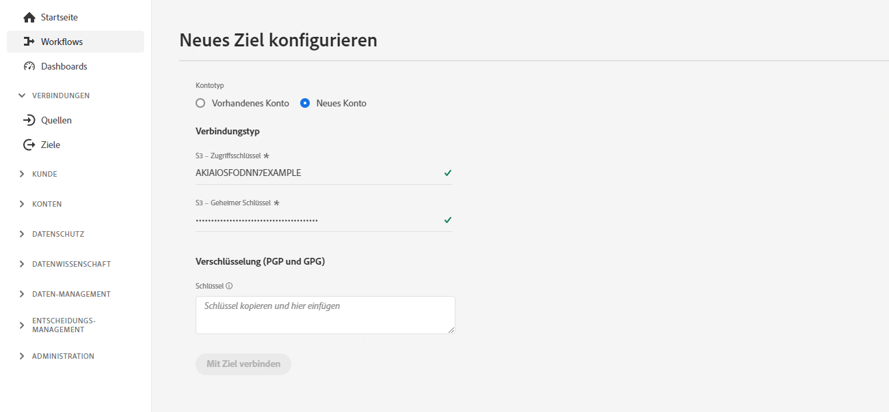
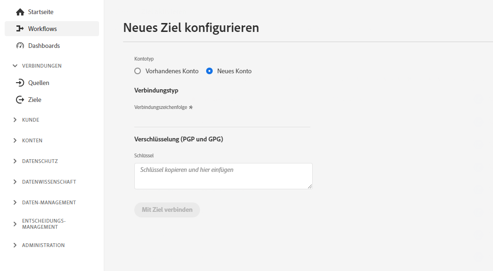
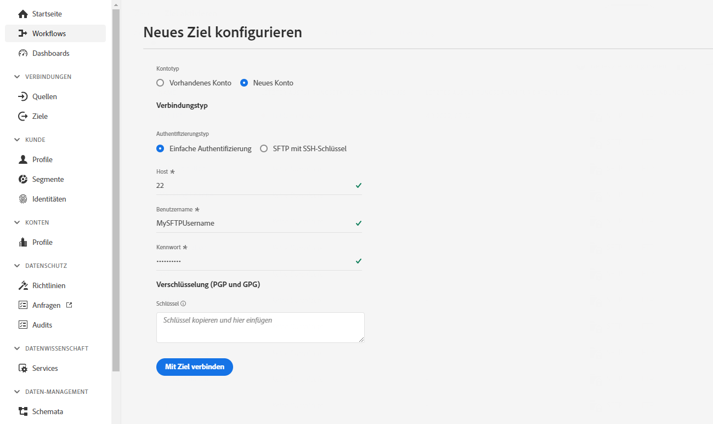
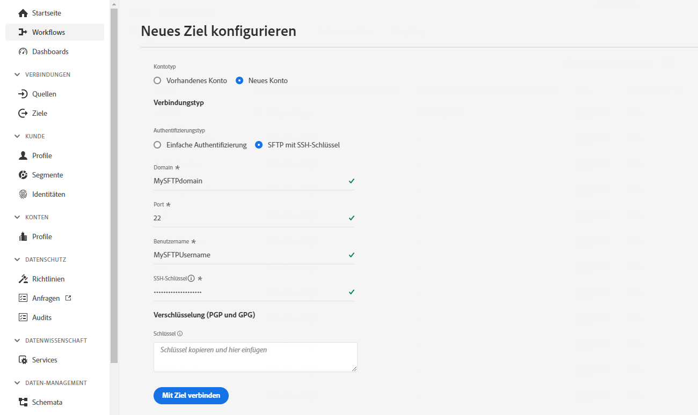

# Konfiguration dateibasierter Ziele {#destination-configuration}

## Übersicht {#overview}

Mit dieser Konfiguration können Sie wichtige Informationen für Ihr dateibasiertes Ziel angeben, z. B. Ihren Zielnamen, die Kategorie, eine Beschreibung und mehr. Die Einstellungen in dieser Konfiguration bestimmen auch, wie Experience Platform-Benutzer sich bei Ihrem Ziel authentifizieren, wie es in der Experience Platform-Benutzeroberfläche angezeigt wird und welche Identitäten an Ihr Ziel exportiert werden können. Sie können diese Konfiguration auch verwenden, um Optionen anzuzeigen, die sich auf den Dateityp, das Dateiformat oder die Komprimierungseinstellungen der exportierten Dateien beziehen.

Diese Konfiguration verbindet auch die anderen Konfigurationen, die für das Funktionieren Ihres Ziels erforderlich sind (Ziel-Server und Zielgruppen-Metadaten), mit dieser Konfiguration. Wie Sie die beiden Konfigurationen referenzieren können, erfahren Sie in einem [Abschnitt weiter unten](./file-based-destination-configuration.md#connecting-all-configurations).

Sie können die in diesem Dokument beschriebenen Funktionen mithilfe des `/authoring/destinations`-API-Endpunkts konfigurieren. Eine vollständige Liste der Vorgänge, die Sie mit dem Endpunkt durchführen können, finden Sie unter [API-Endpunktvorgänge für Ziele](./destination-configuration-api.md).

## Beispiel für eine Amazon S3-Zielkonfiguration {#batch-example-configuration}

Nachfolgend finden Sie ein Beispiel für ein privates benutzerdefiniertes Amazon S3-Ziel, das über die `/destinations` Konfigurationsendpunkt.

```json
{
   "name":"S3 Destination with CSV Options",
   "description":"S3 Destination with CSV Options",
   "status":"TEST",
   "maxProfileAttributes":"2000",
   "maxIdentityAttributes":"10",
   "customerAuthenticationConfigurations":[
      {
         "authType":"S3"
      }
   ],
   "customerEncryptionConfigurations":[
      
   ],
   "customerDataFields":[
      {
         "name":"bucketName",
         "title":"Amazon S3 bucket name",
         "description":"Enter your Amazon S3 bucket name",
         "type":"string",
         "isRequired":true,
         "pattern": "(?=^.{3,63}$)(?!^(\\d+\\.)+\\d+$)(^(([a-z0-9]|[a-z0-9][a-z0-9\\-]*[a-z0-9])\\.)*([a-z0-9]|[a-z0-9][a-z0-9\\-]*[a-z0-9])$)",
         "readOnly":false,
         "hidden":false
      },
      {
         "name":"path",
         "title":"Amazon S3 bucket path",
         "description":"Enter your S3 bucket path",
         "type":"string",
         "isRequired":true,
         "pattern": "^[0-9a-zA-Z\\/\\!\\-_\\.\\*\\''\\(\\)]*((\\%SEGMENT_(NAME|ID)\\%)?\\/?)+$",
         "readOnly":false,
         "hidden":false
      },
      {
         "name":"sep",
         "title":"Enter a separator for each field and value",
         "description":"Enter a separator character for each field and value",
         "type":"string",
         "isRequired":false,
         "readOnly":false,
         "hidden":false
      },
      {
         "name":"encoding",
         "title":"Specify encoding (charset) of saved CSV files",
         "description":"Select encoding of csv files",
         "type":"string",
         "enum":[
            "UTF-8",
            "UTF-16"
         ],
         "isRequired":false,
         "readOnly":false,
         "hidden":false
      },
      {
         "name":"quote",
         "title":"Select a single character used for escaping quoted values",
         "description":"Select single charachter for escaping quoted values",
         "type":"string",
         "isRequired":false,
         "readOnly":false,
         "hidden":false
      },
      {
         "name":"quoteAll",
         "title":"Escape all quoted values",
         "description":"Select whether to escape all quoted values",
         "type":"string",
         "enum":[
            "true",
            "false"
         ],
         "default":"true",
         "isRequired":true,
         "readOnly":false,
         "hidden":false
      },
      {
         "name":"escape",
         "title":"Select a single character used for escaping quotes",
         "description":"Select a single character used for escaping quotes inside an already quoted value",
         "type":"string",
         "isRequired":false,
         "readOnly":false,
         "hidden":false
      },
      {
         "name":"escapeQuotes",
         "title":"Escape quotes",
         "description":"A flag indicating whether values containing quotes should always be enclosed in quotes",
         "type":"string",
         "enum":[
            "true",
            "false"
         ],
         "isRequired":false,
         "default":"true",
         "readOnly":false,
         "hidden":false
      },
      {
         "name":"header",
         "title":"header",
         "description":"Writes the names of columns as the first line.",
         "type":"string",
         "isRequired":false,
         "enum":[
            "true",
            "false"
         ],
         "readOnly":false,
         "default":"true",
         "hidden":false
      },
      {
         "name":"ignoreLeadingWhiteSpace",
         "title":"Ignore leading white space",
         "description":"A flag indicating whether or not leading whitespaces from values being written should be skipped.",
         "type":"string",
         "isRequired":false,
         "enum":[
            "true",
            "false"
         ],
         "readOnly":false,
         "default":"true",
         "hidden":false
      },
      {
         "name":"nullValue",
         "title":"Select the string representation of a null value",
         "description":"Sets the string representation of a null value. ",
         "type":"string",
         "isRequired":false,
         "readOnly":false,
         "hidden":false
      },
      {
         "name":"dateFormat",
         "title":"Date format",
         "description":"Select the string that indicates a date format. ",
         "type":"string",
         "default":"yyyy-MM-dd",
         "isRequired":false,
         "readOnly":false,
         "hidden":false
      },
      {
         "name":"charToEscapeQuoteEscaping",
         "title":"Char to escape quote escaping",
         "description":"Sets a single character used for escaping the escape for the quote character",
         "type":"string",
         "isRequired":false,
         "readOnly":false,
         "hidden":false
      },
      {
         "name":"emptyValue",
         "title":"Select the string representation of an empty value",
         "description":"Select the string representation of an empty value",
         "type":"string",
         "isRequired":false,
         "readOnly":false,
         "default":"",
         "hidden":false
      },
      {
         "name":"compression",
         "title":"Select compression",
         "description":"Select compressiont",
         "type":"string",
         "isRequired":true,
         "readOnly":false,
         "enum":[
            "SNAPPY",
            "GZIP",
            "DEFLATE",
            "NONE"
         ]
      },
      {
         "name":"fileType",
         "title":"Select a fileType",
         "description":"Select fileType",
         "type":"string",
         "isRequired":true,
         "readOnly":false,
         "hidden":false,
         "enum":[
            "csv",
            "json",
            "parquet"
         ],
         "default":"csv"
      }
   ],
   "uiAttributes":{
      "documentationLink":"http://www.adobe.com/go/YOURDESTINATION-en",
      "category":"S3",
      "iconUrl":"https://dc5tqsrhldvnl.cloudfront.net/2/90048/da276e30c730ce6cd666c8ca78360df21.png",
      "connectionType":"S3",
      "flowRunsSupported":true,
      "monitoringSupported":true,
      "frequency":"Batch"
   },
   "destinationDelivery":[
      {
         "deliveryMatchers":[
            {
               "type":"SOURCE",
               "value":[
                  "batch"
               ]
            }
         ],
         "authenticationRule":"CUSTOMER_AUTHENTICATION",
         "destinationServerId":"{{destinationServerId}}"
      }
   ],
   "identityNamespaces":{
      "adobe_id":{
         "acceptsAttributes":true,
         "acceptsCustomNamespaces":true
      },
      "mobile_id":{
         "acceptsAttributes":true,
         "acceptsCustomNamespaces":true
      }
   },
   "segmentMappingConfig":{
      "mapExperiencePlatformSegmentName":false,
      "mapExperiencePlatformSegmentId":false,
      "mapUserInput":false,
      "audienceTemplateId":"cbf90a70-96b4-437b-86be-522fbdaabe9c"
   },
   "schemaConfig":{
      "profileFields":[
         {
            "name":"phoneNo",
            "title":"phoneNo",
            "description":"This is a fixed attribute on your destination side that customers can map profile attributes to. For example, the phoneNumber value in Experience Platform could be phoneNo on your side.",
            "type":"string",
            "isRequired":false,
            "readOnly":false,
            "hidden":false
         }
      ],
      "profileRequired":true,
      "segmentRequired":true,
      "identityRequired":true
   },
   "batchConfig":{
      "allowMandatoryFieldSelection":true,
      "allowDedupeKeyFieldSelection":true,
      "defaultExportMode":"DAILY_FULL_EXPORT",
      "allowedExportMode":[
         "DAILY_FULL_EXPORT",
         "FIRST_FULL_THEN_INCREMENTAL"
      ],
      "allowedScheduleFrequency":[
         "DAILY",
         "EVERY_3_HOURS",
         "EVERY_6_HOURS",
         "EVERY_8_HOURS",
         "EVERY_12_HOURS",
         "ONCE"
      ],
      "defaultFrequency":"DAILY",
      "defaultStartTime":"00:00",
      "filenameConfig":{
         "allowedFilenameAppendOptions":[
            "SEGMENT_NAME",
            "DESTINATION_INSTANCE_ID",
            "DESTINATION_INSTANCE_NAME",
            "ORGANIZATION_NAME",
            "SANDBOX_NAME",
            "DATETIME",
            "CUSTOM_TEXT"
         ],
         "defaultFilenameAppendOptions":[
            "DATETIME"
         ],
         "defaultFilename":"%DESTINATION%_%SEGMENT_ID%"
      },
      "backfillHistoricalProfileData":true
   }
```

| Parameter | Typ | Beschreibung |
|---------|----------|------|
| `name` | Zeichenfolge | Gibt den Titel Ihres Ziels im Experience Platform-Katalog an. |
| `description` | Zeichenfolge | Geben Sie im Zielkatalog von Experience Platform eine Beschreibung für Ihre Zielkarte ein. Es sollten nicht mehr als 4–5 Sätze sein. |
| `status` | Zeichenfolge | Gibt den Lebenszyklusstatus der Zielkarte an. Zulässige Werte sind `TEST`, `PUBLISHED` und `DELETED`. Verwenden Sie `TEST`, wenn Sie Ihr Ziel zum ersten Mal konfigurieren. |
| `maxProfileAttributes` | Zeichenfolge | Gibt die maximale Anzahl von Profilattributen an, die Kunden zum Ziel exportieren können. Der Standardwert lautet `2000`. |
| `maxIdentityAttributes` | Zeichenfolge | Gibt die maximale Anzahl von Identitäts-Namespaces an, die Kunden zum Ziel exportieren können. Der Standardwert lautet `10`. |

{style=&quot;table-layout:auto&quot;}

## Konfigurationen der Benutzerauthentifizierung {#customer-authentication-configurations}

Dieser Abschnitt in der Zielkonfiguration generiert die Seite [Neues Ziel konfigurieren](/help/destinations/ui/connect-destination.md) in der Experience Platform-Benutzeroberfläche, auf der Benutzer Experience Platform mit den Konten verbinden, die sie bei Ihrem Ziel haben.

```json
"customerAuthenticationConfigurations": [
        {
            "authType": "S3"
        }
    ],
```

Je nachdem, welche [Authentifizierungsoption](authentication-configuration.md##supported-authentication-types) Sie im Feld `authType` angeben, wird die Experience Platform-Seite für die Benutzer wie folgt generiert:

### Amazon S3-Authentifizierung {#s3}

Wenn Sie den Authentifizierungstyp Amazon S3 konfigurieren, müssen Benutzer die S3-Anmeldeinformationen eingeben.



### Azure Blob-Authentifizierung  {#blob}

Wenn Sie den Authentifizierungstyp Azure Blob konfigurieren, müssen Benutzer die Verbindungszeichenfolge eingeben.



### SFTP mit Passwortauthentifizierung

Wenn Sie den SFTP-Authentifizierungstyp mit Passwort konfigurieren, müssen Benutzer den SFTP-Benutzernamen und das Passwort sowie die SFTP-Domain und den Port eingeben (der standardmäßige Port ist 22).



### SFTP mit SSH-Schlüsselauthentifizierung

Wenn Sie den Authentifizierungstyp SFTP mit SSH-Schlüssel konfigurieren, müssen Benutzer den SFTP-Benutzernamen und SSH-Schlüssel sowie die SFTP-Domain und den Port eingeben (der standardmäßige Port ist 22).



## Benutzerdefinierte Datenfelder {#customer-data-fields}

Verwenden Sie diesen Abschnitt, um Benutzer aufzufordern, benutzerdefinierte Felder für Ihr Ziel auszufüllen, wenn sie in der Experience Platform-Benutzeroberfläche eine Verbindung zum Ziel herstellen.

Im folgenden Beispiel: `customerDataFields` erfordert, dass Benutzer einen Namen für ihr Ziel eingeben und eine [!DNL Amazon S3] Behältername und Ordnerpfad sowie Komprimierungstyp, Dateiformat und verschiedene andere Dateiformatierungsoptionen.

Sie können in der Vorlage auf die Kundeneingaben aus den Kundendatenfeldern zugreifen und diese verwenden. Makro verwenden `{{customerData.exampleName}}`. Wenn Sie beispielsweise Benutzer auffordern, ein Amazon S3-Bucket-Feld mit dem Namen einzugeben `bucket`, können Sie in der Vorlage darauf zugreifen, indem Sie das -Makro verwenden `{{customerData.bucket}}`. Ein Beispiel für die Verwendung eines Kundendatenfelds im [Zielserverkonfiguration](/help/destinations/destination-sdk/server-and-file-configuration.md#s3-example).

```json
 "customerDataFields":[
      {
         "name":"bucket",
         "title":"Amazon S3 bucket name",
         "description":"Enter your Amazon S3 bucket name",
         "type":"string",
         "isRequired":true,
         "readOnly":false,
         "hidden":false
      },
      {
         "name":"path",
         "title":"Amazon S3 bucket path",
         "description":"Enter your S3 bucket path",
         "type":"string",
         "isRequired":true,
         "pattern":"^[A-Za-z]+$",
         "readOnly":false,
         "hidden":false
      },
      {
         "name":"sep",
         "title":"Enter a separator for each field and value",
         "description":"Enter a separator character for each field and value",
         "type":"string",
         "isRequired":false,
         "readOnly":false,
         "hidden":false
      },
      {
         "name":"encoding",
         "title":"Specify encoding (charset) of saved CSV files",
         "description":"Select encoding of csv files",
         "type":"string",
         "enum":[
            "UTF-8",
            "UTF-16"
         ],
         "isRequired":false,
         "readOnly":false,
         "hidden":false
      },
      {
         "name":"quote",
         "title":"Select a single character used for escaping quoted values",
         "description":"Select single charachter for escaping quoted values",
         "type":"string",
         "isRequired":false,
         "readOnly":false,
         "hidden":false
      },
      {
         "name":"quoteAll",
         "title":"Escape all quoted values",
         "description":"Select whether to escape all quoted values",
         "type":"string",
         "enum":[
            "true",
            "false"
         ],
         "default":"true",
         "isRequired":true,
         "readOnly":false,
         "hidden":false
      },
      {
         "name":"escape",
         "title":"Select a single character used for escaping quotes",
         "description":"Select a single character used for escaping quotes inside an already quoted value",
         "type":"string",
         "isRequired":false,
         "readOnly":false,
         "hidden":false
      },
      {
         "name":"escapeQuotes",
         "title":"Escape quotes",
         "description":"A flag indicating whether values containing quotes should always be enclosed in quotes",
         "type":"string",
         "enum":[
            "true",
            "false"
         ],
         "isRequired":false,
         "default":"true",
         "readOnly":false,
         "hidden":false
      },
      {
         "name":"header",
         "title":"header",
         "description":"Writes the names of columns as the first line.",
         "type":"string",
         "isRequired":false,
         "enum":[
            "true",
            "false"
         ],
         "readOnly":false,
         "default":"true",
         "hidden":false
      },
      {
         "name":"ignoreLeadingWhiteSpace",
         "title":"Ignore leading white space",
         "description":"A flag indicating whether or not leading whitespaces from values being written should be skipped.",
         "type":"string",
         "isRequired":false,
         "enum":[
            "true",
            "false"
         ],
         "readOnly":false,
         "default":"true",
         "hidden":false
      },
      {
         "name":"nullValue",
         "title":"Select the string representation of a null value",
         "description":"Sets the string representation of a null value. ",
         "type":"string",
         "isRequired":false,
         "readOnly":false,
         "hidden":false
      },
      {
         "name":"dateFormat",
         "title":"Date format",
         "description":"Select the string that indicates a date format. ",
         "type":"string",
         "default":"yyyy-MM-dd",
         "isRequired":false,
         "readOnly":false,
         "hidden":false
      },
      {
         "name":"charToEscapeQuoteEscaping",
         "title":"Char to escape quote escaping",
         "description":"Sets a single character used for escaping the escape for the quote character",
         "type":"string",
         "isRequired":false,
         "readOnly":false,
         "hidden":false
      },
      {
         "name":"emptyValue",
         "title":"Select the string representation of an empty value",
         "description":"Select the string representation of an empty value",
         "type":"string",
         "isRequired":false,
         "readOnly":false,
         "default":"",
         "hidden":false
      },
      {
         "name":"compression",
         "title":"Select compression",
         "description":"Select compressiont",
         "type":"string",
         "isRequired":true,
         "readOnly":false,
         "enum":[
            "SNAPPY",
            "GZIP",
            "DEFLATE",
            "NONE"
         ]
      },
      {
         "name":"fileType",
         "title":"Select a fileType",
         "description":"Select fileType",
         "type":"string",
         "isRequired":true,
         "readOnly":false,
         "hidden":false,
         "enum":[
            "csv",
            "json",
            "parquet"
         ],
         "default":"csv"
      }
```

>[!TIP]
>
>Alle im obigen Beispiel aufgeführten Dateiformatierungskonfigurationen werden ausführlich im Abschnitt [Dateiformatierungskonfiguration](/help/destinations/destination-sdk/server-and-file-configuration.md#file-configuration) Abschnitt.

| Parameter | Typ | Beschreibung |
|---------|----------|------|
| `name` | Zeichenfolge | Geben Sie einen Namen für das benutzerdefinierte Feld ein, das Sie einführen. |
| `title` | Zeichenfolge | Gibt den Feldnamen an, wie er für den Kunden in der Experience Platform-Benutzeroberfläche angezeigt wird. |
| `description` | Zeichenfolge | Geben Sie eine Beschreibung für das benutzerdefinierte Feld ein. |
| `type` | Zeichenfolge | Gibt an, welchen Typ von benutzerdefiniertem Feld Sie einführen. Akzeptiert werden die Werte `string`, `object`, `integer`. |
| `isRequired` | Boolesch | Gibt an, ob dieses Feld im Ziel-Setup-Workflow erforderlich ist. |
| `pattern` | Zeichenfolge | Erzwingt bei Bedarf ein Muster für das benutzerdefinierte Feld. Verwenden Sie reguläre Ausdrücke, um ein Muster zu erzwingen. Wenn Ihre Kunden-IDs beispielsweise keine Zahlen oder Unterstriche enthalten, geben Sie in dieses Feld `^[A-Za-z]+$` ein. |
| `enum` | Zeichenfolge | Rendert das benutzerdefinierte Feld als Dropdown-Menü und listet die für den Benutzer verfügbaren Optionen auf. |
| `default` | Zeichenfolge | Definiert den Standardwert aus einer `enum`-Liste. |

{style=&quot;table-layout:auto&quot;}

## Benutzeroberflächenattribute {#ui-attributes}

Dieser Abschnitt bezieht sich auf die Benutzeroberflächenelemente in der obigen Konfiguration, die von Adobe für Ihr Ziel in der Adobe Experience Platform-Benutzeroberfläche verwendet werden sollte.

```json
"uiAttributes":{
      "documentationLink":"http://www.adobe.com/go/YOURDESTINATION-en",
      "category":"cloudStorage",
      "iconUrl":"https://dc5tqsrhldvnl.cloudfront.net/2/90048/da276e30c730ce6cd666c8ca78360df21.png",
      "connectionType":"S3",
      "flowRunsSupported":true,
      "monitoringSupported":true,
      "frequency":"Batch"
   }
```

| Parameter | Typ | Beschreibung |
|---------|----------|------|
| `documentationLink` | Zeichenfolge | Weitere Informationen finden Sie auf der Dokumentationsseite im [Zielkatalog](https://experienceleague.adobe.com/docs/experience-platform/destinations/catalog/overview.html?lang=de#catalog) für Ihr Ziel. Verwenden Sie `http://www.adobe.com/go/destinations-YOURDESTINATION-en`, wobei `YOURDESTINATION` für den Namen Ihres Ziels steht. Für ein Ziel mit dem Namen „Moviestar“ würden Sie `http://www.adobe.com/go/destinations-moviestar-en` verwenden. Beachten Sie, dass dieser Link nur funktioniert, wenn Adobe Ihr Ziel live festlegt und die Dokumentation veröffentlicht wird. |
| `category` | Zeichenfolge | Bezieht sich auf die Ihrem Ziel in Adobe Experience Platform zugewiesene Kategorie. Weitere Informationen finden Sie unter [Zielkategorien](https://experienceleague.adobe.com/docs/experience-platform/destinations/destination-types.html?lang=de). Verwenden Sie einen der folgenden Werte: `adobeSolutions, advertising, analytics, cdp, cloudStorage, crm, customerSuccess, database, dmp, ecommerce, email, emailMarketing, enrichment, livechat, marketingAutomation, mobile, personalization, protocols, social, streaming, subscriptions, surveys, tagManagers, voc, warehouses, payments`. |
| `iconUrl` | Zeichenfolge | Die URL, unter der das Symbol gehostet wird, das auf der Zielkatalogkarte angezeigt werden soll. Für private benutzerdefinierte Integrationen ist dies nicht erforderlich. Für produktionierte Konfigurationen müssen Sie beim Teilen eines Symbols für das Adobe-Team ein [Ziel zur Überprüfung übermitteln](/help/destinations/destination-sdk/submit-destination.md#logo). |
| `connectionType` | Zeichenfolge | Der Verbindungstyp, je nach Ziel. Unterstützte Werte: <ul><li>`Azure Blob`</li><li>`Azure Data Lake Storage`</li><li>`S3`</li><li>`SFTP`</li></ul> |
| `flowRunsSupported` | Boolesch | Gibt an, ob die Zielverbindung in der [Flussausführungs-Benutzeroberfläche](../../dataflows/ui/monitor-destinations.md#monitoring-destinations-dashboard) enthalten ist. Wenn Sie diese Einstellung auf `true` festlegen: <ul><li>Die Angaben zu **[!UICONTROL Letztes Ausführungsdatum für Datenfluss]** und **[!UICONTROL Letzter Ausführungsstatus für Datenfluss]** werden auf der Ziel-Browser-Seite angezeigt.</li><li>Die **[!UICONTROL Datenflussausführungen]** und **[!UICONTROL Aktivierungsdaten]** werden auf der Zielansichtsseite angezeigt.</li></ul> |
| `monitoringSupported` | Boolesch | Gibt an, ob die Zielverbindung in der [Monitoring-Benutzeroberfläche](../ui/destinations-workspace.md#browse) enthalten ist. Wenn Sie dies auf `true` setzen, wird die Option **[!UICONTROL Im Monitoring anzeigen]** auf der Seite für die Zielsuche angezeigt. |
| `frequency` | Zeichenfolge | Bezieht sich auf die Art des Datenexports, die vom Ziel unterstützt wird. Für dateibasierte Ziele auf `Batch` festgelegt. |

{style=&quot;table-layout:auto&quot;}

## Zielbereitstellung {#destination-delivery}

Im Abschnitt Zielbereitstellung wird angegeben, wohin genau die exportierten Daten gehen und welche Authentifizierungsregel an dem Ort verwendet wird, an dem die Daten landen. Sie müssen eine oder mehrere `destinationServerId`Gibt an, an welcher Stelle die Daten bereitgestellt werden, sowie die Authentifizierungsregel. In den meisten Fällen ist die Authentifizierungsregel, die Sie verwenden sollten, `CUSTOMER_AUTHENTICATION`.

Die `deliveryMatchers` ist optional und kann verwendet werden, wenn Sie mehrere `destinationServerId`s. Wenn dies der Fall ist, wird die `deliveryMatchers` gibt an, wie die exportierten Daten auf die verschiedenen Zielserver aufgeteilt werden sollen.

```json
 "destinationDelivery":[
      {
         "deliveryMatchers":[
            {
               "type":"SOURCE",
               "value":[
                  "batch"
               ]
            }
         ],
         "authenticationRule":"CUSTOMER_AUTHENTICATION",
         "destinationServerId":"{{destinationServerId}}"
      }
   ]
```

| Parameter | Typ | Beschreibung |
|---------|----------|------|
| `authenticationRule` | Zeichenfolge | Gibt an, wie [!DNL Platform]-Kunden eine Verbindung zu Ihrem Ziel herstellen. Akzeptierte Werte sind `CUSTOMER_AUTHENTICATION`, `PLATFORM_AUTHENTICATION`, `NONE`. <br> <ul><li>Verwenden Sie `CUSTOMER_AUTHENTICATION`, wenn sich Platform-Kunden über eine der folgenden Methoden bei Ihrem System anmelden: <ul><li>`"authType": "S3"`</li><li>`"authType":"AZURE_CONNECTION_STRING"`</li><li>`"authType":"AZURE_SERVICE_PRINCIPAL"`</li><li>`"authType":"SFTP_WITH_SSH_KEY"`</li><li>`"authType":"SFTP_WITH_PASSWORD"`</li></ul> </li><li> Verwenden Sie `PLATFORM_AUTHENTICATION`, wenn ein globales Authentifizierungssystem zwischen Adobe und Ihrem Ziel besteht und der [!DNL Platform]-Kunde keine Anmeldeinformationen zur Authentifizierung angeben muss, um eine Verbindung mit Ihrem Ziel herzustellen. In diesem Fall müssen Sie ein Objekt für die [Anmeldeinformationen](./credentials-configuration-api.md) mithilfe der Konfiguration erstellen. </li><li>Verwenden Sie `NONE`, wenn keine Authentifizierung erforderlich ist, um Daten an Ihre Zielplattform zu senden. </li></ul> |
| `destinationServerId` | Zeichenfolge | Die `instanceId` des [Zielserverkonfiguration](./server-and-file-configuration.md) dass Sie [created](/help/destinations/destination-sdk/destination-server-api.md#create-file-based) für dieses Ziel. |

{style=&quot;table-layout:auto&quot;}

## Konfiguration der Segmentzuordnung {#segment-mapping}

Dieser Abschnitt der Zielkonfiguration bezieht sich darauf, wie Segmentmetadaten, etwa Segmentnamen oder IDs, zwischen Experience Platform und Ihrem Ziel freigegeben werden sollen.

Durch `audienceTemplateId` verbindet dieser Abschnitt diese Konfiguration auch mit der [Zielgruppen-Metadatenkonfiguration](./audience-metadata-management.md).

```json
   "segmentMappingConfig":{
       "mapExperiencePlatformSegmentName":false,
       "mapExperiencePlatformSegmentId":false,
       "mapUserInput":false,
       "audienceTemplateId":"cbf90a70-96b4-437b-86be-522fbdaabe9c"
   },
```

| Parameter | Typ | Beschreibung |
|---------|----------|------|
| `mapExperiencePlatformSegmentName` | Boolesch | Steuert, ob die Segmentzuordnungs-ID im Zielaktivierungs-Workflow der Experience Platform-Segmentname ist. |
| `mapExperiencePlatformSegmentId` | Boolesch | Steuert, ob die Segmentzuordnungs-ID im Zielaktivierungs-Workflow die Experience Platform-Segment-ID ist. |
| `mapUserInput` | Boolesch | Steuert, ob die Segmentzuordnungs-ID im Zielaktivierungs-Workflow vom Benutzer eingegeben wird. |
| `audienceTemplateId` | Boolesch | Die `instanceId` der [Zielgruppen-Metadatenvorlage](./audience-metadata-management.md), die für dieses Ziel verwendet wird. Informationen zum Einrichten einer Zielgruppen-Metadatenvorlage finden Sie in der [API-Referenz für Zielgruppen-Metadaten](./audience-metadata-api.md). |

## Schemakonfiguration im Zuordnungsschritt {#schema-configuration}

Das Adobe Experience Platform Destination SDK unterstützt von Partnern definierte Schemata. Mit einem von Partnern definierten Schema können Benutzer Profilattribute und Identitäten benutzerdefinierten Schemata zuordnen, die von Zielpartnern definiert werden, ähnlich wie beim Workflow [Streaming-Ziele](destination-configuration.md#schema-configuration).

Verwenden Sie die Parameter in `schemaConfig`, um den Zuordnungsschritt des Zielaktivierungs-Workflows zu aktivieren. Mithilfe der unten beschriebenen Parameter können Sie bestimmen, ob Experience Platform-Benutzer Profilattribute und/oder Identitäten Ihrem dateibasierten Ziel zuordnen können.

Sie können statische, fest programmierte Schemafelder erstellen oder ein dynamisches Schema angeben, mit dem sich Experience Platform verbinden soll, um die Felder im Zielschema des Zuordnungs-Workflows dynamisch abzurufen und auszufüllen. Das Zielschema wird im folgenden Screenshot gezeigt.


### Statische fest programmierte Schemafeldkonfiguration

```json
"schemaConfig":{
      "profileFields":[
           {
              "name":"phoneNo",
              "title":"phoneNo",
              "description":"This is a fixed attribute on your destination side that customers can map profile attributes to. For example, the phoneNumber value in Experience Platform could be phoneNo on your side.",
              "type":"string",
              "isRequired":false,
              "readOnly":false,
              "hidden":false
           }
        ],
      "profileRequired":true,
      "segmentRequired":true,
      "identityRequired":true
}
```

| Parameter | Typ | Beschreibung |
|---------|----------|------|
| `profileFields` | Array | Wenn Sie vordefinierte `profileFields` hinzufügen, haben Experience Platform-Benutzer die Möglichkeit, Platform-Attribute den vordefinierten Attributen in Ihrem Ziel zuzuordnen. |
| `profileRequired` | Boolesch | Verwenden Sie `true`, wenn Benutzer die Zuordnung von Profilattributen aus Experience Platform zu benutzerdefinierten Attributen des Ziels vornehmen dürfen, wie in der obigen Beispielkonfiguration dargestellt. |
| `segmentRequired` | Boolesch | Verwenden Sie immer `segmentRequired:true`. |
| `identityRequired` | Boolesch | Verwenden Sie `true`, wenn Benutzer in der Lage sein sollen, Identitäts-Namespaces von Experience Platform Ihrem gewünschten Schema zuzuordnen. |

{style=&quot;table-layout:auto&quot;}

### Dynamische Schemakonfiguration im Zuordnungsschritt {#dynamic-schema-configuration}

Verwenden Sie die Parameter in  `dynamicSchemaConfig` , um Ihr eigenes Schema dynamisch abzurufen, dem Platform-Profilattribute und/oder Identitäten zugeordnet werden können.

```json
"schemaConfig":{
   "dynamicSchemaConfig":{
      "dynamicEnum": {
         "authenticationRule":"CUSTOMER_AUTHENTICATION",
         "destinationServerId":"2aa8a809-c4ae-4f66-bb02-12df2e0a2279",
         "value": "Schema Name",
         "responseFormat": "SCHEMA"
      }
   },
   "profileRequired":true,
   "segmentRequired":true,
   "identityRequired":true
}
```

| Parameter | Typ | Beschreibung |
|---------|----------|------|
| `profileRequired` | Boolesch | Verwenden Sie `true`, wenn Benutzer die Zuordnung von Profilattributen aus Experience Platform zu benutzerdefinierten Attributen des Ziels vornehmen dürfen, wie in der obigen Beispielkonfiguration dargestellt. |
| `segmentRequired` | Boolesch | Verwenden Sie immer `segmentRequired:true`. |
| `identityRequired` | Boolesch | Verwenden Sie `true`, wenn Benutzer in der Lage sein sollen, Identitäts-Namespaces von Experience Platform Ihrem gewünschten Schema zuzuordnen. |
| `destinationServerId` | Zeichenfolge | Die `instanceId` des [Zielserverkonfiguration](./destination-server-api.md) die Sie für Ihr dynamisches Schema erstellt haben. Dieser Zielserver enthält den HTTP-Endpunkt, den die Experience Platform aufruft, um das dynamische Schema abzurufen, das zum Ausfüllen der Zielfelder verwendet wird. |
| `authenticationRule` | Zeichenfolge | Gibt an, wie [!DNL Platform]-Kunden eine Verbindung zu Ihrem Ziel herstellen. Akzeptierte Werte sind `CUSTOMER_AUTHENTICATION`, `PLATFORM_AUTHENTICATION`, `NONE`. <br> <ul><li>Verwenden Sie `CUSTOMER_AUTHENTICATION`, wenn sich Platform-Kunden über eine der folgenden Methoden bei Ihrem System anmelden: <ul><li>`"authType": "S3"`</li><li>`"authType":"AZURE_CONNECTION_STRING"`</li><li>`"authType":"AZURE_SERVICE_PRINCIPAL"`</li><li>`"authType":"SFTP_WITH_SSH_KEY"`</li><li>`"authType":"SFTP_WITH_PASSWORD"`</li></ul> </li><li> Verwenden Sie `PLATFORM_AUTHENTICATION`, wenn ein globales Authentifizierungssystem zwischen Adobe und Ihrem Ziel besteht und der [!DNL Platform]-Kunde keine Anmeldeinformationen zur Authentifizierung angeben muss, um eine Verbindung mit Ihrem Ziel herzustellen. In diesem Fall müssen Sie ein Objekt für die [Anmeldeinformationen](./credentials-configuration-api.md) mithilfe der Konfiguration erstellen. </li><li>Verwenden Sie `NONE`, wenn keine Authentifizierung erforderlich ist, um Daten an Ihre Zielplattform zu senden. </li></ul> |
| `value` | Zeichenfolge | Der Name des Schemas, das in der Experience Platform-Benutzeroberfläche im Zuordnungsschritt angezeigt werden soll. |
| `responseFormat` | Zeichenfolge | Die Einstellung ist immer `SCHEMA`, wenn ein benutzerdefiniertes Schema definiert wird. |

{style=&quot;table-layout:auto&quot;}

### Erforderliche Zuordnungen {#required-mappings}

Innerhalb der Schemakonfiguration haben Sie die Möglichkeit, erforderliche (oder vordefinierte) Zuordnungen hinzuzufügen. Hierbei handelt es sich um Zuordnungen, die Benutzer anzeigen, aber nicht ändern können, wenn sie eine Verbindung zu Ihrem Ziel einrichten. Beispielsweise können Sie erzwingen, dass das Feld für die E-Mail-Adresse in den exportierten Dateien immer an das Ziel gesendet wird. Nachfolgend finden Sie zwei Beispiele für eine Schemakonfiguration mit erforderlichen Zuordnungen und wie diese im Zuordnungsschritt des [Workflow &quot;Daten für Batch-Ziele aktivieren&quot;](/help/destinations/ui/activate-batch-profile-destinations.md).

```json
    "requiredMappingsOnly": true, // when this is selected true , users cannot map other attributes and identities in the activation flow, apart from the required mappings that you define.
    "requiredMappings": [
      {
        "destination": "identityMap.ExamplePartner_ID", //if only the destination field is specified, then the user is able to select a source field to map to the destination.
        "mandatoryRequired": true,
        "primaryKeyRequired": true
      }
    ] 
```


```json
    "requiredMappingsOnly": true, // when this is selected true , users cannot map other attributes and identities in the activation flow, apart from the required mappings that you define.
    "requiredMappings": [
      {
        "sourceType": "text/x.schema-path",
        "source": "personalEmail.address",
        "destination": "personalEmail.address" //when both source and destination fields are specified as required mappings, then the user can not select or edit any of the two fields and can only view the selection.
      }
    ] 
```


>[!NOTE]
>
>Derzeit werden folgende Kombinationen erforderlicher Zuordnungen unterstützt:
>* Sie können ein erforderliches Quellfeld und ein erforderliches Zielfeld konfigurieren. In diesem Fall können Benutzer keine der beiden Felder bearbeiten oder auswählen und nur die Auswahl anzeigen.
>* Sie können nur ein erforderliches Zielfeld konfigurieren. In diesem Fall können Benutzer ein Quellfeld auswählen, das dem Ziel zugeordnet werden soll.
>
> Die Konfiguration eines nur erforderlichen Quellfelds ist derzeit *not* unterstützt.

Verwenden Sie die in der folgenden Tabelle beschriebenen Parameter, wenn Sie im Aktivierungs-Workflow für Ihr Ziel die erforderlichen Zuordnungen hinzufügen möchten.

| Parameter | Typ | Beschreibung |
|---------|----------|------|
| `requiredMappingsOnly` | Boolesch | Gibt an, ob Benutzer in der Lage sind, andere Attribute und Identitäten im Aktivierungsfluss zuzuordnen; *, außer* die erforderlichen Zuordnungen, die Sie definieren. |
| `requiredMappings.mandatoryRequired` | Boolesch | Auf true setzen, wenn dieses Feld ein obligatorisches Attribut sein muss, das immer in Dateiexporten an Ihr Ziel vorhanden sein sollte. Mehr dazu [obligatorische Attribute](/help/destinations/ui/activate-batch-profile-destinations.md#mandatory-attributes). |
| `requiredMappings.primaryKeyRequired` | Boolesch | Auf true setzen, wenn dieses Feld als Deduplizierungsschlüssel bei Dateiexporten an Ihr Ziel verwendet werden muss. Mehr dazu [Deduplizierungsschlüssel](/help/destinations/ui/activate-batch-profile-destinations.md#deduplication-keys). |
| `requiredMappings.sourceType` | Zeichenfolge | Wird verwendet, wenn Sie ein Quellfeld nach Bedarf konfigurieren. Verwendung `"text/x.schema-path"`, was anzeigt, dass das Quellfeld ein vordefiniertes XDM-Attribut ist |
| `requiredMappings.source` | Zeichenfolge | Gibt an, was das erforderliche Quellfeld sein soll. |
| `requiredMappings.destination` | Zeichenfolge | Gibt an, was das erforderliche Zielfeld sein soll. |

{style=&quot;table-layout:auto&quot;}

## Identitäten und Attribute {#identities-and-attributes}

Die Parameter in diesem Abschnitt bestimmen, welche Identitäten Ihr Ziel akzeptiert. Durch diese Konfiguration werden auch die Zielidentitäten und -attribute im [Zuordnungsschritt](/help/destinations/ui/activate-segment-streaming-destinations.md#mapping) der Experience Platform-Benutzeroberfläche ausgefüllt, in dem Benutzer Identitäten und Attribute aus ihren XDM-Schemata dem Schema in Ihrem Ziel zuordnen.


```json
"identityNamespaces": {
        "crm_id": {
            "acceptsAttributes": true,
            "acceptsCustomNamespaces": true
        },
        "mobile_id": {
            "acceptsAttributes": true,
            "acceptsCustomNamespaces": true
        }
    },
```

Sie müssen angeben, welche [!DNL Platform]-Identitäten Kunden in Ihr Ziel exportieren können. Einige Beispiele: [!DNL Experience Cloud ID], gehashte E-Mail, Geräte-ID ([!DNL IDFA], [!DNL GAID]). Diese Werte sind Identitäts-Namespaces von [!DNL Platform], die Kunden von Ihrem Ziel aus Identitäts-Namespaces zuordnen können. Sie können auch angeben, ob Kunden benutzerdefinierte Namespaces den von Ihrem Ziel unterstützten Identitäten zuordnen können (`acceptsCustomNamespaces: true`) und ob Kunden standardmäßige XDM-Attribute Identitäten zuordnen können, die von Ihrem Ziel unterstützt werden (`acceptsAttributes: true`).

Identitäts-Namespaces erfordern keine 1:1-Korrespondenz zwischen [!DNL Platform] und Ihrem Ziel.
Kunden können beispielsweise einen [!DNL IDFA]-Namespace in [!DNL Platform] einem [!DNL IDFA]-Namespace Ihres Ziels zuordnen oder sie können denselben [!DNL IDFA]-Namespace in [!DNL Platform] einem [!DNL Customer ID]-Namespace in Ihrem Ziel zuordnen.

Weitere Informationen zu Identitäten finden Sie im Abschnitt [Übersicht über Identity Namespace](/help/identity-service/namespaces.md).


## Batch-Konfiguration - Dateibenennung und Exportplanung {#batch-configuration}

Dieser Abschnitt enthält die Einstellungen für die Dateibenennung und Exportplanung, die für Ihr Ziel in der Benutzeroberfläche von Adobe Experience Platform angezeigt werden. Die Werte, die Sie hier einrichten, werden im [Segmentexport planen](/help/destinations/ui/activate-batch-profile-destinations.md#scheduling) Schritt des dateibasierten Zielaktivierungs-Workflows.

```json
"batchConfig":{
   "allowMandatoryFieldSelection":true,
   "allowDedupeKeyFieldSelection":true,
   "defaultExportMode":"DAILY_FULL_EXPORT",
   "allowedExportMode":[
      "DAILY_FULL_EXPORT",
      "FIRST_FULL_THEN_INCREMENTAL"
   ],
   "allowedScheduleFrequency":[
      "DAILY",
      "EVERY_3_HOURS",
      "EVERY_6_HOURS",
      "EVERY_8_HOURS",
      "EVERY_12_HOURS",
      "ONCE"
   ],
   "defaultFrequency":"DAILY",
   "defaultStartTime":"00:00",
   "filenameConfig":{
         "allowedFilenameAppendOptions":[
            "SEGMENT_NAME",
            "DESTINATION_INSTANCE_ID",
            "DESTINATION_INSTANCE_NAME",
            "ORGANIZATION_NAME",
            "SANDBOX_NAME",
            "DATETIME",
            "CUSTOM_TEXT"
         ],
         "defaultFilenameAppendOptions":[
            "DATETIME"
         ],
         "defaultFilename":"%DESTINATION%_%SEGMENT_ID%"
      },
   }
```

| Parameter | Typ | Beschreibung |
|---------|----------|------|
| `allowMandatoryFieldSelection` | Boolesch | Wenn auf `true` eingestellt, können Kunden festlegen, welche Profilattribute obligatorisch sind. Der Standardwert ist `false`. Weitere Informationen finden Sie unter [Obligatorische Attribute](../ui/activate-batch-profile-destinations.md#mandatory-attributes). |
| `allowDedupeKeyFieldSelection` | Boolesch | Mit der Einstellung auf `true` können Kunden Deduplizierungsschlüssel angeben. Der Standardwert ist `false`. Weitere Informationen finden Sie unter [Deduplizierungsschlüssel](../ui/activate-batch-profile-destinations.md#deduplication-keys). |
| `defaultExportMode` | Enum | Definiert den standardmäßigen Dateiexportmodus. Unterstützte Werte:<ul><li>`DAILY_FULL_EXPORT`</li><li>`FIRST_FULL_THEN_INCREMENTAL`</li></ul> Der Standardwert ist `DAILY_FULL_EXPORT`. Weitere Informationen zur Planung von Dateiexporten finden Sie in der [Dokumentation zur Batch-Aktivierung](../ui/activate-batch-profile-destinations.md#scheduling). |
| `allowedExportModes` | Liste | Definiert die für Kunden verfügbaren Dateiexportmodi. Unterstützte Werte:<ul><li>`DAILY_FULL_EXPORT`</li><li>`FIRST_FULL_THEN_INCREMENTAL`</li></ul> |
| `allowedScheduleFrequency` | Liste | Definiert die für Kunden verfügbare Dateiexportfrequenz. Unterstützte Werte:<ul><li>`ONCE`</li><li>`EVERY_3_HOURS`</li><li>`EVERY_6_HOURS`</li><li>`EVERY_8_HOURS`</li><li>`EVERY_12_HOURS`</li><li>`DAILY`</li></ul> |
| `defaultFrequency` | Enum | Definiert die standardmäßige Dateiexportfrequenz. Unterstützte Werte:<ul><li>`ONCE`</li><li>`EVERY_3_HOURS`</li><li>`EVERY_6_HOURS`</li><li>`EVERY_8_HOURS`</li><li>`EVERY_12_HOURS`</li><li>`DAILY`</li></ul> Der Standardwert ist `DAILY`. |
| `defaultStartTime` | Zeichenfolge | Definiert die standardmäßige Startzeit für den Dateiexport. Verwendet das 24-Stunden-Dateiformat. Der Standardwert ist „00:00“. |
| `filenameConfig.allowedFilenameAppendOptions` | Zeichenfolge | *Erforderlich*. Liste der verfügbaren Dateinamenmakros, aus denen Benutzer auswählen können. Dadurch wird bestimmt, welche Elemente an exportierte Dateinamen angehängt werden (Segment-ID, Organisationsname, Datum und Uhrzeit des Exports usw.). Wenn `defaultFilename`sollten Sie darauf achten, dass Makros nicht dupliziert werden. <br><br>Unterstützte Werte: <ul><li>`DESTINATION`</li><li>`SEGMENT_ID`</li><li>`SEGMENT_NAME`</li><li>`DESTINATION_INSTANCE_ID`</li><li>`DESTINATION_INSTANCE_NAME`</li><li>`ORGANIZATION_NAME`</li><li>`SANDBOX_NAME`</li><li>`DATETIME`</li><li>`CUSTOM_TEXT`</li></ul>Unabhängig von der Reihenfolge, in der Sie die Makros definieren, zeigt die Experience Platform-Benutzeroberfläche sie immer in der hier dargestellten Reihenfolge an. <br><br> Wenn `defaultFilename` leer ist, ist die `allowedFilenameAppendOptions` -Liste muss mindestens ein Makro enthalten. |
| `filenameConfig.defaultFilenameAppendOptions` | Zeichenfolge | *Erforderlich*. Vorausgewählte Standardmakros für Dateinamen, die von Benutzern deaktiviert werden können.<br><br> Die Makros in dieser Liste sind eine Teilmenge der in `allowedFilenameAppendOptions`. |
| `filenameConfig.defaultFilename` | Zeichenfolge | *Optional*. Definiert die standardmäßigen Dateinamenmakros für die exportierten Dateien. Diese können von Benutzern nicht überschrieben werden. <br><br>Jedes von `allowedFilenameAppendOptions` wird angehängt, nachdem die `defaultFilename` Makros. <br><br>Wenn `defaultFilename` leer ist, müssen Sie mindestens ein Makro in `allowedFilenameAppendOptions`. |

{style=&quot;table-layout:auto&quot;}

### Dateinamenkonfiguration {#file-name-configuration}

Verwenden Sie Dateinamenkonfigurationsmakros, um zu definieren, welche Namen der exportierten Datei enthalten sollen. Die Makros in der folgenden Tabelle beschreiben Elemente in der Benutzeroberfläche in der [Dateinamenkonfiguration](../ui/activate-batch-profile-destinations.md#file-names) angezeigt.


>[!TIP]
> 
>Als Best Practice sollten Sie immer die `SEGMENT_ID` Makro in den Namen der exportierten Dateien. Segment-IDs sind eindeutig. Daher lässt sich am besten sicherstellen, dass Dateinamen auch eindeutig sind, wenn Sie sie in den Dateinamen aufnehmen.

| Makro | UI-Bezeichnung | Beschreibung | Beispiel |
|---|---|---|---|
| `DESTINATION` | [!UICONTROL Ziel] | Zielname in der Benutzeroberfläche. | Amazon S3 |
| `SEGMENT_ID` | [!UICONTROL Segment-ID] | Eindeutige, Platform-generierte Segment-ID | ce5c5482-2813-4a80-99bc-57113f6acde2 |
| `SEGMENT_NAME` | [!UICONTROL Segmentname] | Benutzerdefinierter Segmentname | VIP |
| `DESTINATION_INSTANCE_ID` | [!UICONTROL Ziel-ID] | Eindeutige, Platform-generierte ID der Zielinstanz | 7b891e5f-025a-4f0d-9e73-1919e71da3b0 |
| `DESTINATION_INSTANCE_NAME` | [!UICONTROL Zielname] | Benutzerdefinierter Name der Zielinstanz. | Mein Werbeziel 2022 |
| `ORGANIZATION_NAME` | [!UICONTROL Organisationsname] | Name der Kundenorganisation in Adobe Experience Platform. | Mein Organisationsname |
| `SANDBOX_NAME` | [!UICONTROL Sandbox-Name] | Name der vom Kunden verwendeten Sandbox. | prod |
| `DATETIME` / `TIMESTAMP` | [!UICONTROL Datum und Uhrzeit] | `DATETIME` und `TIMESTAMP` beide definieren den Zeitpunkt der Erstellung der Datei, jedoch in verschiedenen Formaten. <br><br><ul><li>`DATETIME` verwendet das folgende Format: JJJJMMTT_HMMSS.</li><li>`TIMESTAMP` verwendet das 10-stellige Unix-Format. </li></ul> `DATETIME` und `TIMESTAMP` sich gegenseitig ausschließen und nicht gleichzeitig verwendet werden können. | <ul><li>`DATETIME`: 20220509_210543</li><li>`TIMESTAMP`: 1652131584</li></ul> |
| `CUSTOM_TEXT` | [!UICONTROL Benutzerdefinierter Text] | Benutzerdefinierter benutzerdefinierter Text, der in den Dateinamen eingefügt werden soll. Kann nicht in verwendet werden `defaultFilename`. | My_custom_text |
| `TIMESTAMP` | [!UICONTROL Datum und Uhrzeit] | 10-stelliger Zeitstempel der Zeit, zu der die Datei generiert wurde, im Unix-Format. | 1652131584 |

{style=&quot;table-layout:auto&quot;}


Das oben dargestellte Beispiel verwendet die folgende Makrokonfiguration für Dateinamen:

```json
"filenameConfig":{
   "allowedFilenameAppendOptions":[
      "CUSTOM_TEXT",
      "SEGMENT_ID",
      "DATETIME"
   ],
   "defaultFilenameAppendOptions":[
      "SEGMENT_ID",
      "DATETIME"
   ],
   "defaultFilename": "%DESTINATION%"
}
```


## Historische Profilqualifikationen {#profile-backfill}

Sie können den Parameter `backfillHistoricalProfileData` in der Zielkonfiguration verwenden, um festzulegen, ob historische Profilqualifikationen in Ihr Ziel exportiert werden sollen.

```json
   "backfillHistoricalProfileData":true
```

| Parameter | Typ | Beschreibung |
|---------|----------|------|
| `backfillHistoricalProfileData` | Boolesch | Steuert, ob historische Profildaten exportiert werden, wenn Segmente für das Ziel aktiviert werden. <br> <ul><li> `true`: [!DNL Platform] sendet die historischen Benutzerprofile, die sich für das Segment qualifiziert haben, bevor das Segment aktiviert wird. </li><li> `false`: [!DNL Platform] enthält nur Benutzerprofile, die sich für das Segment qualifizieren, nachdem das Segment aktiviert wurde. </li></ul> |

{style=&quot;table-layout:auto&quot;}

## Wie diese Konfiguration alle erforderlichen Informationen für Ihr Ziel verbindet  {#connecting-all-configurations}

Einige Ihrer Zieleinstellungen müssen über das [Zielserver](./server-and-file-configuration.md) oder [Konfiguration von Zielgruppen-Metadaten](./audience-metadata-management.md) -Endpunkte. Die hier beschriebene Zielkonfiguration verbindet alle diese Einstellungen, indem sie wie folgt auf die beiden anderen Konfigurationen verweist:

* Verwenden Sie die `destinationServerId` , um auf den Zielserver und die Dateivorlagenkonfiguration zu verweisen, die für Ihr Ziel eingerichtet sind.
* Verwenden Sie die `audienceMetadataId`, um auf die für Ihr Ziel eingerichtete Zielgruppen-Metadatenkonfiguration zu verweisen.
